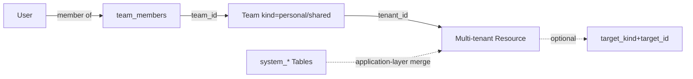
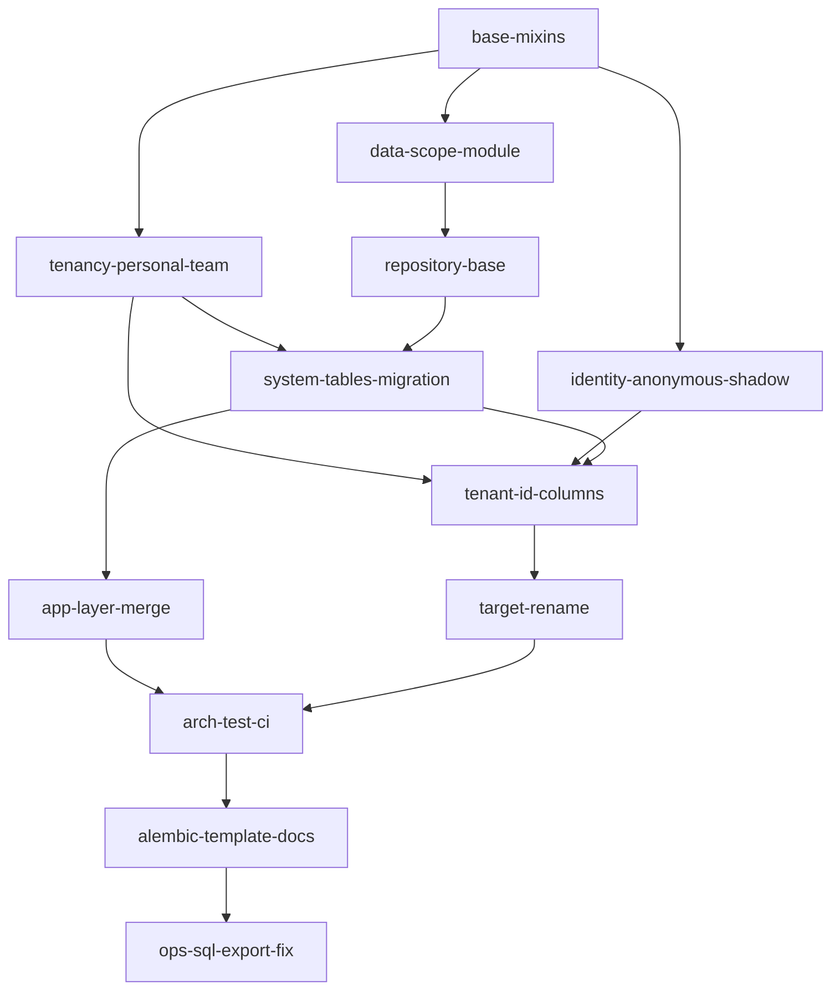

# 数据作用域长期落地（单 tenant_id 模型 · 单 PR 落地）

## 0. 决策摘要

| 维度 | 决策 |
|------|------|
| **多租户主键** | 所有业务表强制 `tenant_id UUID NOT NULL`，授权链 `User → team_members → tenant_id` |
| **个人用户** | 归属其 personal team（已有 `TeamKind.PERSONAL`） |
| **匿名用户** | 自动建 `role='anonymous'` shadow User + personal team；提供 cleanup 任务 |
| **系统级行** | **迁出**为 `system_*` 专用表（system_gateway_models 等），原业务表只装 tenant 行 |
| **系统级查询** | Repository 出 `list_system()` + `list_for_tenant()` 两方法；**应用层显式合并**（不建 VIEW） |
| **策略挂载（vkey/apikey_grant）** | `target_kind` + `target_id` 独立列，与 owner 维度正交 |
| **落地策略** | **单 PR** 完成迁移 + ORM + Repository + 守门 + 文档；旧物理列 grace 期保留，Phase 3 单独 PR DROP |
| **ORM 兼容** | 优先 ORM 列别名 `mapped_column("team_id")`；scope/scope_id 类表用 `@hybrid_property` 派生 |
| **外键** | 不依赖（项目既有约定） |



---

## 1. BaseModel 与 Mixin（[`backend/libs/orm/base.py`](backend/libs/orm/base.py)）

```python
class BaseModel(Base, TimestampMixin):
    __abstract__ = True
    id: Mapped[uuid.UUID] = mapped_column(UUID(as_uuid=True), primary_key=True, default=uuid.uuid4)

class TenantScopedMixin:
    """多租户业务表必备。tenant_id 永不为 NULL；系统行请用 system_* 表。"""
    tenant_id: Mapped[uuid.UUID] = mapped_column(
        UUID(as_uuid=True), nullable=False, index=True
    )

class AuditableMixin:
    """审计字段，不参与授权。"""
    created_by: Mapped[uuid.UUID | None]
    updated_by: Mapped[uuid.UUID | None]

class PolicyTargetMixin:
    """策略挂载表（EntitlementPlan / GatewayBudget for vkey）。"""
    target_kind: Mapped[str | None]   # 字面量由 domain 决定，libs 不感知
    target_id:   Mapped[uuid.UUID | None]
```

新表组合规则：

| 用途 | 必备 | 可选 |
|------|------|------|
| 多租户业务表 | `BaseModel + TenantScopedMixin` | `AuditableMixin` |
| 策略挂载表 | 上述 + `PolicyTargetMixin` | — |
| **`system_*` 表** | `BaseModel`（无 tenant_id） | `AuditableMixin` |
| 分区日志表 | `Base` + 自带 `created_at` + `tenant_id` | — |

---

## 2. Personal Team 与匿名 Shadow User

### Personal team（[`backend/domains/tenancy/application/personal_team_provisioner.py`](backend/domains/tenancy/application/personal_team_provisioner.py)）

```python
class PersonalTeamProvisioner:
    async def ensure_personal_team(self, user_id: UUID) -> UUID:
        """幂等。返回 team_id（即用户的 tenant_id）。"""
```

接入点：

- 注册 / 首次登录 hook（fastapi-users post-register）
- 匿名 shadow user 创建后
- 数据迁移回填时（user_id 持有的资源 → personal team）

### Anonymous shadow user（[`backend/domains/identity/application/anonymous_user_provisioner.py`](backend/domains/identity/application/anonymous_user_provisioner.py)）

```python
class AnonymousUserProvisioner:
    async def ensure_shadow_user(self, cookie_hash: str) -> UUID:
        """cookie_hash → users 行（role='anonymous'）。幂等。"""
```

- `users` 表通过 `role='anonymous'` 区分；匿名用户也走 fastapi-users 主表，避免双 ID 空间。
- 中间件 [`libs/middleware/anonymous.py`](backend/libs/middleware/anonymous.py) 已设 cookie，本计划补 provisioner 与 cleanup 任务接口（实现可后续）。
- **清理**：`cleanup_anonymous_users(retention_days)` 后台任务接口在本 PR 提供，实现细节（删 user + 级联资源策略）可独立小 PR 跟进——但**不要**留 TODO 在 production 路径上。

---

## 3. system_* 专用表

| 原表 | 新增 system 表 | 数据来源 |
|------|---------------|----------|
| [`gateway_models`](backend/domains/gateway/infrastructure/models/gateway_model.py) | `system_gateway_models` | `team_id IS NULL` 行 |
| [`gateway_routes`](backend/domains/gateway/infrastructure/models/gateway_route.py) | `system_gateway_routes` | `team_id IS NULL` 行 |
| [`gateway_alert_rules`](backend/domains/gateway/infrastructure/models/alert.py) | `system_gateway_alert_rules` | `team_id IS NULL` 行 |
| [`provider_credentials`](backend/domains/gateway/infrastructure/models/provider_credential.py) | `system_provider_credentials` | `scope='system'` 行 |

每张 `system_*` 表：

- 结构 = 原表去掉 `tenant_id`（其它字段保持）
- 同名唯一约束（如 `uq_*_name`）在 system 表内独立
- ORM 模型独立：`SystemGatewayModel`, `SystemGatewayRoute`, ...
- 原业务表迁移后强制 `tenant_id NOT NULL`

**查询模式（应用层合并）**：

```python
class GatewayModelRepository(TenantScopedRepositoryBase[GatewayModel]):
    async def list_for_tenant(self, tenant_id: UUID, **filters) -> list[GatewayModel]: ...
    async def list_system(self, **filters) -> list[SystemGatewayModel]: ...

# ProxyUseCase / 模型选择处显式合并
tenant_models = await repo.list_for_tenant(tid, only_enabled=True)
system_models = await repo.list_system(only_enabled=True)
# 同名时 tenant 行优先（业务规则在 domain policy）
```

合并策略（如「同名 tenant 行覆盖 system 行」）下沉到 [`domains/gateway/domain/policies/model_selection.py`](backend/domains/gateway/domain/policies/model_selection.py) 之类的纯函数，**不写在 libs**。

---

## 4. DataScopeEnforcer（[`backend/libs/db/data_scope.py`](backend/libs/db/data_scope.py)）

libs 只出**机制**：

| 名称 | 说明 |
|------|------|
| `DataAction` | `read` / `list` / `write` / `delete` |
| `DataResource(kind, tenant_id)` | 路由侧 explicit check |
| `DataScopeEnforcer.visibility_clause(model, ctx)` | `model.tenant_id.in_(ctx.team_ids)`；admin 直通 |
| `PermissionContext.team_ids: frozenset[UUID]` | middleware 解析；非 admin 用户首次请求查 team_members 一次缓存到 ContextVar |
| `enforce_data_scope(ctx, resource, action) -> bool` | 显式判定 |

**不感知** `vkey` / `apikey_grant` / `system`，那是 domain target 概念。

---

## 5. Repository 基类（[`backend/libs/db/base_repository.py`](backend/libs/db/base_repository.py)）

```python
class TenantScopedRepositoryBase(Generic[T]):
    model_class: type[T]

    def _scope(self, q):
        ctx = require_permission_context()
        return DataScopeEnforcer.visibility_clause(self.model_class, ctx).apply(q)

    async def find_for_tenants(self, **filters) -> list[T]: ...
    async def get_in_tenants(self, entity_id: UUID) -> T | None: ...
    async def count_for_tenants(self, **filters) -> int: ...
```

- 旧 `OwnedRepositoryBase` 保留为别名 + `DeprecationWarning`，所有继承它的仓储自动获益。
- 样板迁移：[`alert_repository.py`](backend/domains/gateway/infrastructure/repositories/alert_repository.py)，删除手写 `where(team_id=...)`，新增 `list_system()` 走 `SystemGatewayAlertRule`。
- 策略挂载查询（target 维度）由具体 Repository 自定义 SQL，**仍走 `_scope`**。

---

## 6. 单 PR 落地内容（按 todos 顺序）



### ORM 兼容策略（同 PR 内）

- **简单租户列**（`team_id` 直对应 tenant）：用 ORM 列别名一行改：
  ```python
  tenant_id: Mapped[uuid.UUID] = mapped_column("team_id", UUID, nullable=False)
  ```
  调用方写 `.tenant_id` 即可，物理列名暂不动。
- **scope/scope_id 派生**（Credential/Budget/Plan）：用 `@hybrid_property` 派生 `tenant_id`，UPDATE 路径需要显式更新两边或加 DB 触发器，本 PR 暂以 ORM 双写。
- **重命名 `scope_id` → `target_id`**：在 EntitlementPlan / Budget(scope='key') 上 Alembic 真重命名（同 PR）。

### Phase 3（独立 PR，不在本计划）

- DROP 旧物理列 `team_id` / `user_id` / `scope` / `scope_id` / `anonymous_user_id`
- 同步删除 `@hybrid_property` 派生与 ORM 列别名

---

## 7. DDD 分层一览

| 层 | 模块 | 出 |
|----|------|----|
| **libs** | `libs/orm/base.py`、`libs/db/data_scope.py`、`libs/db/base_repository.py` | BaseModel/Mixin/Enforcer/Repo 基类。**无** vkey/apikey_grant/system 字面量 |
| **domains/tenancy** | `application/personal_team_provisioner.py`、`infrastructure/.../team.py` | personal team 创建；MembershipPort 解 `user_id → team_ids` |
| **domains/identity** | `application/anonymous_user_provisioner.py` | shadow user 创建；cleanup 任务接口 |
| **domains/gateway** | `domain/types.py`（target_kind 字面量）、`domain/policies/model_selection.py`（system+tenant 合并规则） | 自家 target 与合并规则 |
| **infrastructure** | 各 domain `repositories/*.py` | 继承 `TenantScopedRepositoryBase`；新建 `*_repository_system.py` 或同文件内并存 |
| **presentation** | `libs/middleware/permission.py` | 解析 token → `PermissionContext.team_ids` |

---

## 8. 架构守门（[`backend/tests/architecture/test_orm_data_conventions.py`](backend/tests/architecture/test_orm_data_conventions.py)）

1. **时间戳**：除 allowlist（fastapi-users 表）外，所有表必须 `created_at` + `updated_at`（`timestamptz`）。
2. **多租户协议**：业务表（非 `system_*`、非分区日志、非 allowlist）必须含 `tenant_id`（NOT NULL）。
3. **新表零旧列**：基线 revision 之后的迁移不得新增 `user_id` / `team_id`（列名）/ `scope` / `scope_id` / `anonymous_user_id` 物理列。
4. **libs 纯度**：AST 扫 `libs/`，不得出现 `"vkey"`, `"apikey_grant"`, `"system"`（作为 OwnerKind 字面量）等 domain 关键字。
5. **system_* 协议**：`system_*` 表不得含 `tenant_id` 列；不得继承 `TenantScopedMixin`。

挂到 [`.github/workflows/backend-architecture.yml`](.github/workflows/backend-architecture.yml)。

---

## 9. Alembic 模板与文档

- [`backend/alembic/script.py.mako`](backend/alembic/script.py.mako) 顶注示意：新表必备 `id` + 时间戳 + `tenant_id`（多租户）或归入 `system_*` 命名空间。
- [`backend/alembic/sql/README.md`](backend/alembic/sql/README.md) 列「禁止再加 user_id/team_id/scope/scope_id/anonymous_user_id」清单 + system_* 说明。
- [`backend/docs/CODE_STANDARDS.md`](backend/docs/CODE_STANDARDS.md) 新增「数据归属与多租户模型」：决策树、personal team、anonymous shadow user、system_* 表、Casbin 概念对照。
- [`backend/docs/PERMISSION_SYSTEM_ARCHITECTURE.md`](backend/docs/PERMISSION_SYSTEM_ARCHITECTURE.md) 更新为单 tenant_id 模型流程图。

---

## 10. 相关：运维 SQL 导出

修复 [`backend/alembic/ops_sql_export.py`](backend/alembic/ops_sql_export.py)：`DefaultImpl.execute` 不要因 `information_schema` 吞掉整段 `DO $$`。本 PR 含大量 `DO $$` 回填（个人资源 → personal team / system 行迁出 / scope→target 重命名），运维 SQL 必须可信。

---

## 验收

- `uv run pytest tests/architecture/test_orm_data_conventions.py tests/unit/libs/db/test_data_scope.py tests/unit/libs/orm/test_mixins.py tests/unit/tenancy/test_personal_team_provisioner.py tests/unit/identity/test_anonymous_user_provisioner.py tests/unit/gateway/domain/test_model_selection.py -q` 全绿。
- 现有 Gateway / Agent / Session 集成测试无回归（ORM 列别名 + hybrid_property 保证 grace 兼容）。
- 新表 PR：一行 `BaseModel + TenantScopedMixin` 即可；system 行写 `system_*` 表，target 类用 `PolicyTargetMixin`。
- 数据回填后：所有用户都有 personal team；所有匿名 cookie 都对应一个 shadow user；`tenant_id IS NULL` 的业务表行数为 0。

## 不在本轮范围

- Phase 3 DROP 旧物理列（独立 PR，grace 后）。
- 分析 SQL / Grafana 改写（独立 PR）。
- 跨 tenant 共享 ACL：未来需要时另起 `resource_shares(resource_id, principal_id, role)` 表，**不**复用 tenant_id。
- 引入真正的 Casbin 库或 API 路由级策略。
- 匿名 user cleanup 的具体实现（仅出接口与后台任务定义，retention 策略与级联规则后续小 PR）。
