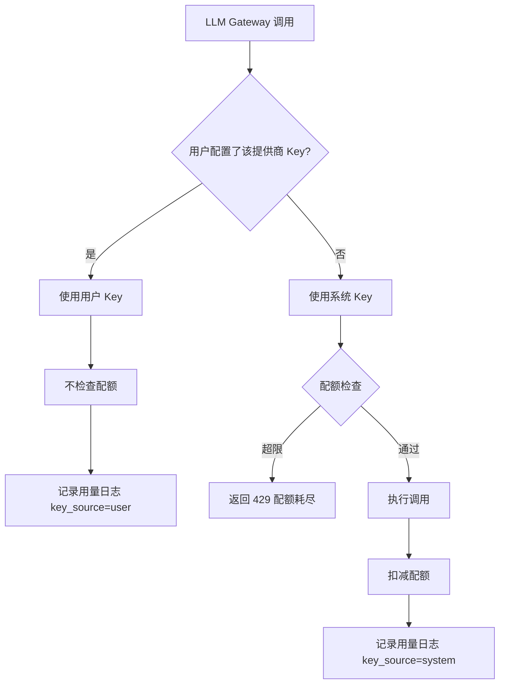

# 用户 LLM Key 与配额系统设计

## 核心需求

- **用户自配 Key**：用户可配置自己的大模型提供商 API Key（DashScope、OpenAI、DeepSeek、智谱等），用自己的 Key 调用不限次数。
- **系统 Key + 配额**：用户未配置 Key 时，使用系统默认 Key，需限制用量（按次数 / Token / 费用等）。
- **统一设计**：所有 LLM 提供商、所有能力（文本生成、图像生成、Embedding）统一架构。

---

## 1. 数据模型设计

### 1.1 用户 LLM 提供商配置

**位置**: `backend/domains/agent/infrastructure/models/user_provider_config.py`（新建）

```python
class UserProviderConfig(Base):
    """用户的大模型提供商配置"""
    __tablename__ = "user_provider_configs"
    
    id: UUID
    user_id: UUID                    # 所属用户
    provider: str                    # 提供商标识: dashscope, openai, deepseek, zhipuai, volcengine, anthropic
    api_key: str                     # 加密存储的 API Key
    api_base: str | None             # 可选的自定义 API Base
    is_active: bool = True           # 是否启用
    created_at: datetime
    updated_at: datetime
    
    # 唯一约束: (user_id, provider)
```

### 1.2 系统配额配置

**位置**: `backend/domains/identity/infrastructure/models/quota.py`（新建）

```python
class UserQuota(Base):
    """用户配额（使用系统 Key 时的限制）"""
    __tablename__ = "user_quotas"
    
    id: UUID
    user_id: UUID                    # 用户 ID
    
    # 按能力类型的配额（每日/每月）
    daily_text_requests: int | None  # 每日文本请求数
    daily_image_requests: int | None # 每日图像生成数
    daily_embedding_requests: int | None
    monthly_token_limit: int | None  # 每月 Token 上限
    
    # 当前周期已用量
    current_daily_text: int = 0
    current_daily_image: int = 0
    current_daily_embedding: int = 0
    current_monthly_tokens: int = 0
    
    # 配额重置时间
    daily_reset_at: datetime
    monthly_reset_at: datetime
    
    created_at: datetime
    updated_at: datetime

class QuotaUsageLog(Base):
    """配额使用日志（详细记录）"""
    __tablename__ = "quota_usage_logs"
    
    id: UUID
    user_id: UUID
    capability: str                  # text, image, embedding
    provider: str                    # 实际使用的提供商
    model: str                       # 模型名称
    key_source: str                  # "user" 或 "system"
    input_tokens: int | None
    output_tokens: int | None
    image_count: int | None
    cost_estimate: float | None      # 估算费用
    created_at: datetime
```

---

## 2. 架构设计

### 2.1 Key 选择逻辑




### 2.2 分层职责

- **Application 层**（UseCase）：`UserProviderConfigUseCase`、`QuotaUseCase`
  - 管理用户 Key 配置的 CRUD
  - 配额检查与扣减
  - 配额重置定时任务
- **Infrastructure 层**（LLM Gateway）：
  - `LLMGateway` 增加 `user_id` 参数
  - 调用前查询用户 Key 配置
  - 选择合适的 Key 发起请求
  - 调用后记录用量
- **Presentation 层**（API）：
  - 用户 Key 配置接口（增删改查）
  - 配额查询接口
  - 用量统计接口

---

## 3. 核心实现

### 3.1 Key 选择服务

**位置**: `backend/domains/agent/application/llm_key_service.py`（新建）

```python
class LLMKeyService:
    """LLM Key 选择与配额管理服务"""
    
    async def get_provider_config(
        self, user_id: UUID, provider: str
    ) -> tuple[str, str | None, str]:
        """
        获取指定提供商的 API Key 配置
        
        Returns:
            (api_key, api_base, key_source)
            key_source: "user" 表示用户自己的 Key，"system" 表示系统 Key
        """
        # 1. 查询用户配置
        user_config = await self.user_provider_repo.get_by_user_and_provider(
            user_id, provider
        )
        if user_config and user_config.is_active:
            return (
                decrypt(user_config.api_key),
                user_config.api_base,
                "user"
            )
        
        # 2. 使用系统 Key
        system_key = self._get_system_key(provider)
        if not system_key:
            raise NoKeyConfiguredError(f"未配置 {provider} 的 API Key")
        return (system_key, None, "system")
    
    async def check_and_deduct_quota(
        self, user_id: UUID, capability: str, amount: int = 1
    ) -> bool:
        """检查并扣减配额（仅系统 Key 调用时）"""
        quota = await self.quota_repo.get_by_user(user_id)
        # ... 配额检查与扣减逻辑
```

### 3.2 LLM Gateway 改造

**位置**: `backend/domains/agent/infrastructure/llm/gateway.py`

```python
class LLMGateway:
    async def chat(
        self,
        messages: list[dict],
        model: str,
        user_id: UUID | None = None,  # 新增：用户 ID
        **kwargs
    ) -> LLMResponse:
        # 1. 确定提供商
        provider = get_provider(model)
        
        # 2. 获取 Key（用户 Key 或系统 Key）
        if user_id:
            api_key, api_base, key_source = await self.key_service.get_provider_config(
                user_id, provider.name
            )
            
            # 3. 系统 Key 需检查配额
            if key_source == "system":
                await self.key_service.check_and_deduct_quota(
                    user_id, "text"
                )
        else:
            # 无用户上下文，使用系统 Key（内部调用）
            api_key = self._get_system_key(provider.name)
            key_source = "system"
        
        # 4. 调用 LLM
        response = await self._call_llm(
            messages, model, api_key, api_base, **kwargs
        )
        
        # 5. 记录用量
        await self._record_usage(
            user_id, provider.name, model, key_source,
            response.usage
        )
        
        return response
```

---

## 4. API 设计

### 4.1 用户 Key 配置接口

```
# 获取用户的提供商配置列表
GET /api/v1/settings/providers

# 配置/更新提供商 Key
PUT /api/v1/settings/providers/{provider}
Body: { "api_key": "sk-xxx", "api_base": "..." }

# 删除提供商配置
DELETE /api/v1/settings/providers/{provider}

# 测试 Key 有效性
POST /api/v1/settings/providers/{provider}/test
```

### 4.2 配额与用量接口

```
# 获取当前配额状态
GET /api/v1/usage/quota

# 获取用量统计
GET /api/v1/usage/stats?period=daily|monthly

# 获取用量明细
GET /api/v1/usage/logs?page=1&limit=20
```

---

## 5. 前端改动

### 5.1 设置页面新增「大模型配置」Tab

- 提供商列表（DashScope、OpenAI、DeepSeek、智谱、火山引擎、Anthropic）
- 每个提供商可配置 API Key（脱敏显示）+ 可选 API Base
- 「测试连接」按钮

### 5.2 配额显示

- 用户无自配 Key 的提供商，显示剩余配额
- 配额进度条 / 使用统计图表

---

## 6. MCP Server 集成

### 6.1 llm_server 改造

在 `llm_image_generate` 等工具中：

```python
@llm_server.tool()
async def llm_image_generate(..., ctx: Context):
    # 1. 从 MCP 上下文获取 user_id（通过 API Key 鉴权传入）
    user_id = ctx.get("user_id")
    
    # 2. 调用图像生成（内部会选择 Key、检查配额）
    result = await image_service.generate(
        prompt=prompt,
        user_id=user_id,  # 传递用户 ID
        ...
    )
    return result
```

### 6.2 MCP 鉴权传递用户上下文

在 `auth_middleware.py` 中，验证 API Key 后将 `user_id` 注入到 MCP 上下文，供工具使用。

---

## 7. 数据库迁移

```sql
-- 用户提供商配置表
CREATE TABLE user_provider_configs (
    id UUID PRIMARY KEY,
    user_id UUID NOT NULL REFERENCES users(id),
    provider VARCHAR(50) NOT NULL,
    api_key TEXT NOT NULL,
    api_base VARCHAR(255),
    is_active BOOLEAN DEFAULT TRUE,
    created_at TIMESTAMP DEFAULT NOW(),
    updated_at TIMESTAMP DEFAULT NOW(),
    UNIQUE (user_id, provider)
);

-- 用户配额表
CREATE TABLE user_quotas (
    id UUID PRIMARY KEY,
    user_id UUID NOT NULL REFERENCES users(id) UNIQUE,
    daily_text_requests INT,
    daily_image_requests INT,
    daily_embedding_requests INT,
    monthly_token_limit INT,
    current_daily_text INT DEFAULT 0,
    current_daily_image INT DEFAULT 0,
    current_daily_embedding INT DEFAULT 0,
    current_monthly_tokens INT DEFAULT 0,
    daily_reset_at TIMESTAMP,
    monthly_reset_at TIMESTAMP,
    created_at TIMESTAMP DEFAULT NOW(),
    updated_at TIMESTAMP DEFAULT NOW()
);

-- 用量日志表
CREATE TABLE quota_usage_logs (
    id UUID PRIMARY KEY,
    user_id UUID NOT NULL,
    capability VARCHAR(20) NOT NULL,
    provider VARCHAR(50) NOT NULL,
    model VARCHAR(100),
    key_source VARCHAR(10) NOT NULL,
    input_tokens INT,
    output_tokens INT,
    image_count INT,
    cost_estimate DECIMAL(10,4),
    created_at TIMESTAMP DEFAULT NOW()
);
CREATE INDEX idx_quota_usage_user_time ON quota_usage_logs(user_id, created_at);
```

---

## 8. 实现优先级

1. **P0 - 数据模型**：创建 `user_provider_configs`、`user_quotas`、`quota_usage_logs` 表
2. **P0 - Key 选择服务**：实现 `LLMKeyService`，集成到 `LLMGateway`
3. **P1 - 配额检查**：实现配额检查与扣减逻辑
4. **P1 - 前端设置页**：用户配置提供商 Key 的 UI
5. **P2 - 用量统计**：用量日志记录与查询 API
6. **P2 - 配额重置**：定时任务（每日/每月重置配额）
7. **P3 - 管理后台**：管理员设置默认配额、查看全局用量

---

## 9. 与「图像生成工具」的关系

本设计是系统级基础设施，图像生成工具（之前的计划）是其上层应用：

- 图像生成工具调用 `ImageService`
- `ImageService` 内部使用 `LLMKeyService` 获取 DashScope Key
- 若用户配了自己的 DashScope Key → 不限次数
- 若用系统 Key → 检查 `daily_image_requests` 配额

两者可并行推进：

- 图像生成工具先用系统 Key 实现功能
- Key 选择与配额系统完成后，自动生效

