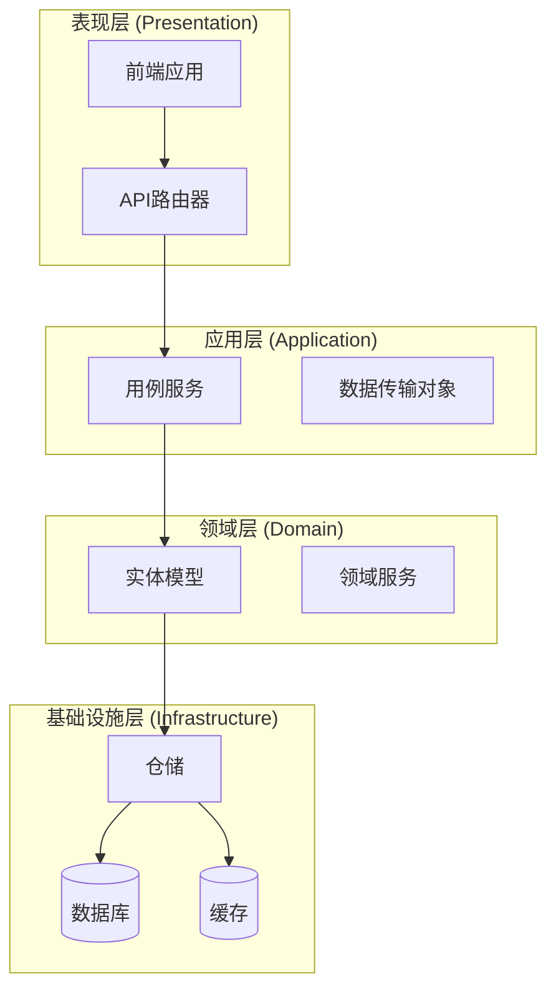
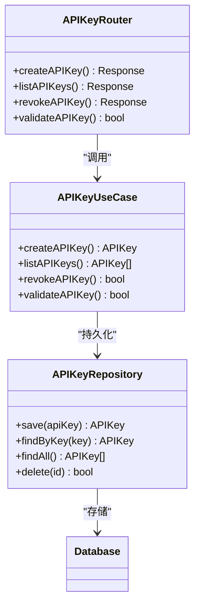
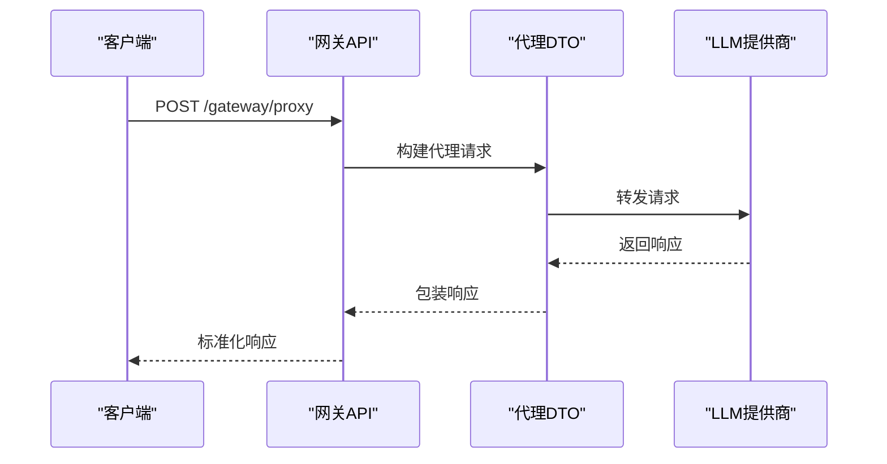
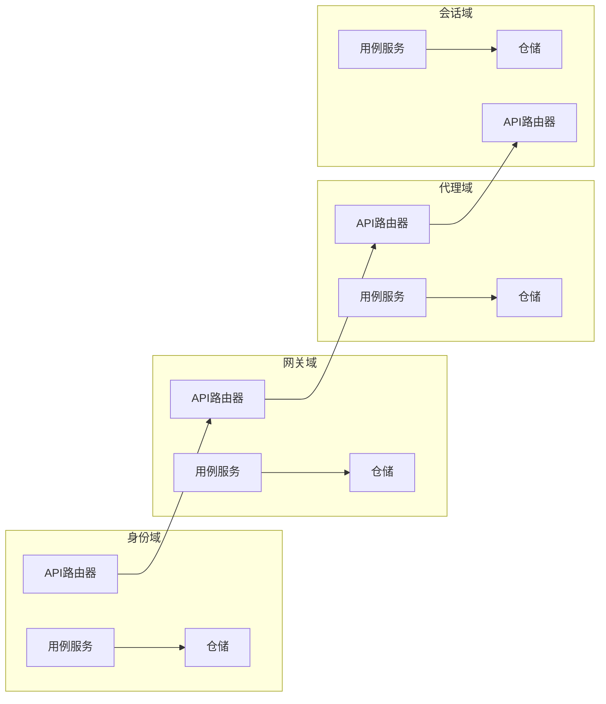
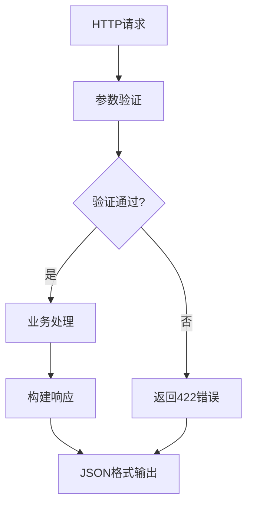
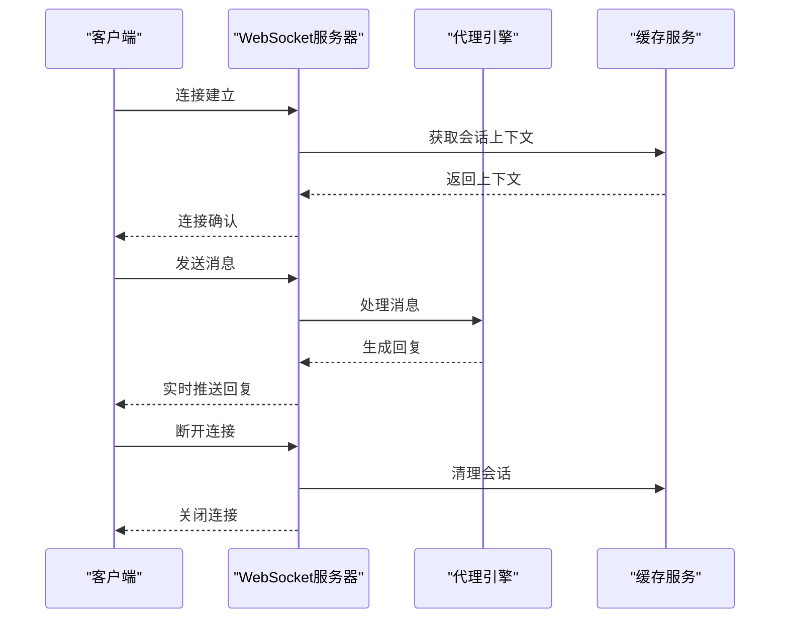
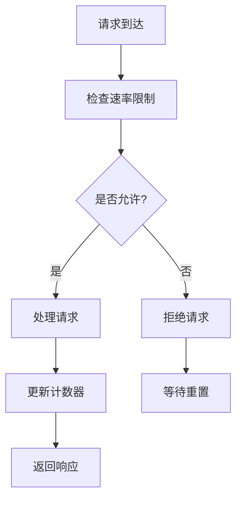
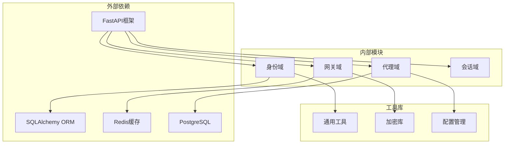

# API参考文档

<cite>
**本文档中引用的文件**
- [backend/domains/identity/presentation/api_key_router.py](file://backend/domains/identity/presentation/api_key_router.py)
- [backend/domains/identity/application/api_key_use_case.py](file://backend/domains/identity/application/api_key_use_case.py)
- [backend/domains/identity/infrastructure/repositories/api_key_repository.py](file://backend/domains/identity/infrastructure/repositories/api_key_repository.py)
- [backend/domains/gateway/presentation/routers/routes.py](file://backend/domains/gateway/presentation/routers/routes.py)
- [backend/domains/gateway/application/platform_api_key_proxy_dto.py](file://backend/domains/gateway/application/platform_api_key_proxy_dto.py)
- [backend/domains/gateway/presentation/platform_api_key_usage_middleware.py](file://backend/domains/gateway/presentation/platform_api_key_usage_middleware.py)
- [backend/libs/middleware](file://backend/libs/middleware)
- [backend/domains/agent/application/mcp_api_models.py](file://backend/domains/agent/application/mcp_api_models.py)
- [backend/docs/API_RESPONSE.md](file://backend/docs/API_RESPONSE.md)
- [backend/docs/AUTHENTICATION.md](file://backend/docs/AUTHENTICATION.md)
- [backend/docs/CONFIGURATION.md](file://backend/docs/CONFIGURATION.md)
- [frontend/src/api/client.ts](file://frontend/src/api/client.ts)
- [frontend/src/api/paths.ts](file://frontend/src/api/paths.ts)
- [frontend/src/api/chat.ts](file://frontend/src/api/chat.ts)
- [frontend/src/api/session.ts](file://frontend/src/api/session.ts)
- [frontend/src/api/tools.ts](file://frontend/src/api/tools.ts)
</cite>

## 目录
1. [简介](#简介)
2. [项目结构](#项目结构)
3. [核心组件](#核心组件)
4. [架构概览](#架构概览)
5. [详细组件分析](#详细组件分析)
6. [依赖关系分析](#依赖关系分析)
7. [性能考虑](#性能考虑)
8. [故障排除指南](#故障排除指南)
9. [结论](#结论)
10. [附录](#附录)

## 简介

AI Agent项目是一个基于FastAPI构建的企业级人工智能代理平台，提供智能对话、任务执行和多模态交互能力。本API参考文档详细描述了REST API的设计规范、WebSocket接口实现、认证机制和最佳实践。

## 项目结构

项目采用分层架构设计，主要分为以下层次：



**图表来源**
- [backend/domains](file://backend/domains)
- [backend/libs](file://backend/libs)

**章节来源**
- [backend/domains](file://backend/domains)
- [backend/libs](file://backend/libs)

## 核心组件

### 身份认证系统

身份认证系统提供了完整的API密钥管理和用户认证功能：



**图表来源**
- [backend/domains/identity/presentation/api_key_router.py](file://backend/domains/identity/presentation/api_key_router.py)
- [backend/domains/identity/application/api_key_use_case.py](file://backend/domains/identity/application/api_key_use_case.py)
- [backend/domains/identity/infrastructure/repositories/api_key_repository.py](file://backend/domains/identity/infrastructure/repositories/api_key_repository.py)

### 网关代理系统

网关代理系统负责LLM提供商的统一接入和请求路由：



**图表来源**
- [backend/domains/gateway/presentation/routers/routes.py](file://backend/domains/gateway/presentation/routers/routes.py)
- [backend/domains/gateway/application/platform_api_key_proxy_dto.py](file://backend/domains/gateway/application/platform_api_key_proxy_dto.py)

**章节来源**
- [backend/domains/identity/presentation/api_key_router.py](file://backend/domains/identity/presentation/api_key_router.py)
- [backend/domains/identity/application/api_key_use_case.py](file://backend/domains/identity/application/api_key_use_case.py)
- [backend/domains/identity/infrastructure/repositories/api_key_repository.py](file://backend/domains/identity/infrastructure/repositories/api_key_repository.py)
- [backend/domains/gateway/presentation/routers/routes.py](file://backend/domains/gateway/presentation/routers/routes.py)
- [backend/domains/gateway/application/platform_api_key_proxy_dto.py](file://backend/domains/gateway/application/platform_api_key_proxy_dto.py)

## 架构概览

系统采用模块化设计，每个域都有独立的应用层、领域层和基础设施层：



**图表来源**
- [backend/domains](file://backend/domains)

## 详细组件分析

### REST API设计规范

#### HTTP方法和URL模式

系统遵循RESTful设计原则，采用资源导向的URL结构：

**身份管理API**
- `POST /api/v1/identity/api-keys` - 创建API密钥
- `GET /api/v1/identity/api-keys` - 列表API密钥
- `DELETE /api/v1/identity/api-keys/{id}` - 删除API密钥

**网关代理API**
- `POST /api/v1/gateway/proxy` - 代理LLM请求
- `GET /api/v1/gateway/models` - 获取可用模型列表
- `POST /api/v1/gateway/budgets` - 设置预算限制

**章节来源**
- [backend/domains/identity/presentation/api_key_router.py](file://backend/domains/identity/presentation/api_key_router.py)
- [backend/domains/gateway/presentation/routers/routes.py](file://backend/domains/gateway/presentation/routers/routes.py)

#### 请求/响应模式

所有API响应遵循统一的JSON格式：



**图表来源**
- [backend/docs/API_RESPONSE.md](file://backend/docs/API_RESPONSE.md)

#### 认证方法

系统支持多种认证方式：

1. **API密钥认证**：适用于服务到服务的调用
2. **Bearer Token认证**：适用于用户认证场景
3. **会话认证**：适用于Web界面访问

**章节来源**
- [backend/docs/AUTHENTICATION.md](file://backend/docs/AUTHENTICATION.md)

### WebSocket接口实现

系统提供实时通信功能，支持以下WebSocket端点：

**聊天消息WebSocket**
- `ws://localhost:8000/ws/chat/{sessionId}`

WebSocket消息类型：
- `message`: 用户发送的消息
- `typing`: 用户正在输入状态
- `status`: 代理状态更新
- `error`: 错误通知



**图表来源**
- [frontend/src/api/chat.ts](file://frontend/src/api/chat.ts)

### API版本控制策略

系统采用URL路径版本控制策略：

- **当前版本**: `/api/v1/`
- **版本前缀**: 所有API端点均包含版本号
- **向后兼容**: 新版本保持旧版本API可用

版本升级流程：
1. 添加新版本端点
2. 保持旧版本端点运行
3. 提供迁移指南
4. 设定废弃时间表

### 各API端点详解

#### 身份管理端点

**创建API密钥**
- 方法: `POST`
- 路径: `/api/v1/identity/api-keys`
- 请求体: `{ "name": "string", "scopes": ["string"] }`
- 成功响应: `201 Created` + API密钥信息
- 错误码: `400 Bad Request`, `401 Unauthorized`

**列出API密钥**
- 方法: `GET`
- 路径: `/api/v1/identity/api-keys`
- 查询参数: `limit`, `offset`
- 成功响应: `200 OK` + 分页列表
- 错误码: `401 Unauthorized`, `403 Forbidden`

**章节来源**
- [backend/domains/identity/presentation/api_key_router.py](file://backend/domains/identity/presentation/api_key_router.py)
- [backend/domains/identity/application/api_key_use_case.py](file://backend/domains/identity/application/api_key_use_case.py)

#### 网关代理端点

**代理LLM请求**
- 方法: `POST`
- 路径: `/api/v1/gateway/proxy`
- 请求体: `{ "model": "string", "messages": [], "stream": true }`
- 成功响应: `200 OK` + 流式响应
- 错误码: `400 Bad Request`, `500 Internal Server Error`

**获取模型列表**
- 方法: `GET`
- 路径: `/api/v1/gateway/models`
- 成功响应: `200 OK` + 模型信息数组
- 错误码: `503 Service Unavailable`

**章节来源**
- [backend/domains/gateway/presentation/routers/routes.py](file://backend/domains/gateway/presentation/routers/routes.py)
- [backend/domains/gateway/application/platform_api_key_proxy_dto.py](file://backend/domains/gateway/application/platform_api_key_proxy_dto.py)

### 客户端实现指南

#### 前端SDK使用

**基础客户端配置**
```typescript
// 基础API客户端
const client = new APIClient({
  baseURL: 'http://localhost:8000',
  timeout: 30000,
  headers: {
    'Content-Type': 'application/json',
    'Authorization': 'Bearer YOUR_TOKEN'
  }
});
```

**聊天功能实现**
```typescript
// 聊天消息发送
const sendMessage = async (message: string) => {
  const response = await client.post('/api/v1/chat/messages', {
    message: message,
    sessionId: currentSessionId
  });
  return response.data;
};
```

**WebSocket连接**
```typescript
// WebSocket连接管理
const ws = new WebSocket(`ws://localhost:8000/ws/chat/${sessionId}`);

ws.onmessage = (event) => {
  const message = JSON.parse(event.data);
  handleIncomingMessage(message);
};

ws.onclose = () => {
  reconnectWebSocket();
};
```

**章节来源**
- [frontend/src/api/client.ts](file://frontend/src/api/client.ts)
- [frontend/src/api/paths.ts](file://frontend/src/api/paths.ts)
- [frontend/src/api/chat.ts](file://frontend/src/api/chat.ts)

### 安全机制

#### 权限验证

系统实施多层次的权限控制：

1. **API密钥权限**: 基于作用域的细粒度控制
2. **用户权限**: 基于角色的访问控制
3. **租户隔离**: 多租户数据隔离

#### 速率限制



**图表来源**
- [backend/domains/gateway/presentation/platform_api_key_usage_middleware.py](file://backend/domains/gateway/presentation/platform_api_key_usage_middleware.py)

#### 访问控制

- **CORS配置**: 支持跨域资源共享
- **CSRF保护**: 防止跨站请求伪造
- **输入验证**: 严格的参数验证和清理

**章节来源**
- [backend/libs/middleware](file://backend/libs/middleware)

## 依赖关系分析



**图表来源**
- [backend/bootstrap/main.py](file://backend/bootstrap/main.py)
- [backend/config/app.toml](file://backend/config/app.toml)

**章节来源**
- [backend/bootstrap/main.py](file://backend/bootstrap/main.py)
- [backend/config/app.toml](file://backend/config/app.toml)

## 性能考虑

### 缓存策略

1. **Redis缓存**: 用户会话和频繁查询
2. **数据库索引**: 优化查询性能
3. **CDN加速**: 静态资源分发

### 监控指标

- **响应时间**: API请求处理时间
- **错误率**: 4xx/5xx错误统计
- **吞吐量**: QPS和并发连接数
- **资源使用**: CPU、内存、数据库连接

### 优化建议

1. **批量操作**: 减少网络往返次数
2. **异步处理**: 长耗时任务异步化
3. **连接池**: 数据库和HTTP连接复用
4. **压缩传输**: Gzip压缩响应数据

## 故障排除指南

### 常见错误处理

**认证错误**
- `401 Unauthorized`: 无效或过期的认证令牌
- `403 Forbidden`: 权限不足访问资源

**业务逻辑错误**
- `422 Unprocessable Entity`: 参数验证失败
- `404 Not Found`: 请求的资源不存在

**系统错误**
- `500 Internal Server Error`: 服务器内部错误
- `503 Service Unavailable`: 服务暂时不可用

### 调试方法

1. **日志分析**: 查看后端应用日志
2. **API测试**: 使用Postman或curl测试
3. **WebSocket调试**: 使用浏览器开发者工具
4. **性能监控**: 监控系统指标和响应时间

**章节来源**
- [backend/docs/API_RESPONSE.md](file://backend/docs/API_RESPONSE.md)

## 结论

AI Agent项目的API设计遵循现代Web服务的最佳实践，提供了完整的企业级功能。系统具有良好的扩展性、安全性和可维护性，能够满足不同规模企业的需求。

## 附录

### API测试和调试

**Postman集合**
- 提供完整的API测试集合
- 包含认证、参数设置和响应验证
- 支持环境变量配置

**Swagger UI**
- 自动化的API文档生成
- 在线API测试工具
- 实时响应查看

### 扩展性和插件机制

系统支持以下扩展方式：

1. **新域添加**: 按照现有架构模式添加新功能域
2. **中间件扩展**: 自定义请求处理逻辑
3. **认证扩展**: 支持新的认证方式
4. **存储扩展**: 支持不同的数据存储后端

### 最佳实践

1. **错误处理**: 统一的错误响应格式
2. **版本管理**: 平滑的API版本升级
3. **性能优化**: 缓存和异步处理策略
4. **安全防护**: 多层安全机制实施
5. **监控告警**: 完善的运维监控体系