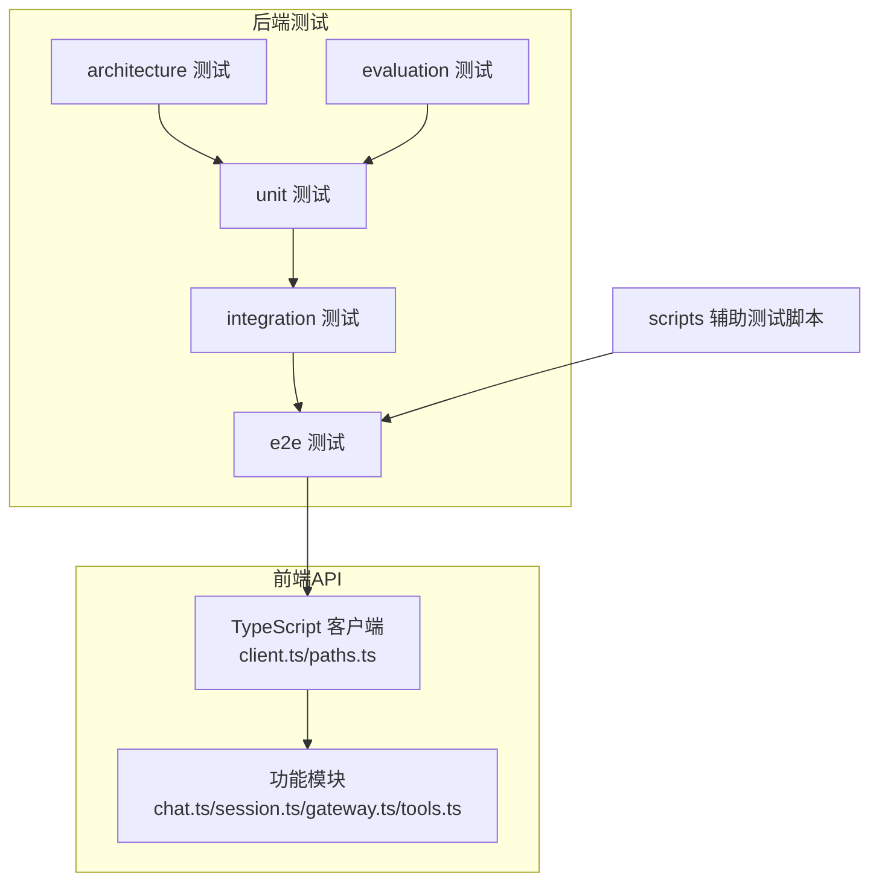
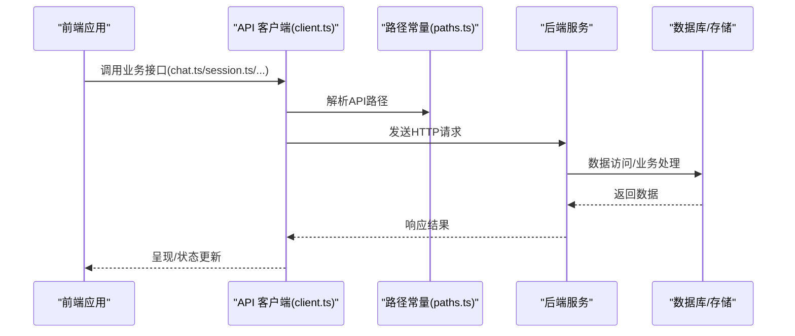
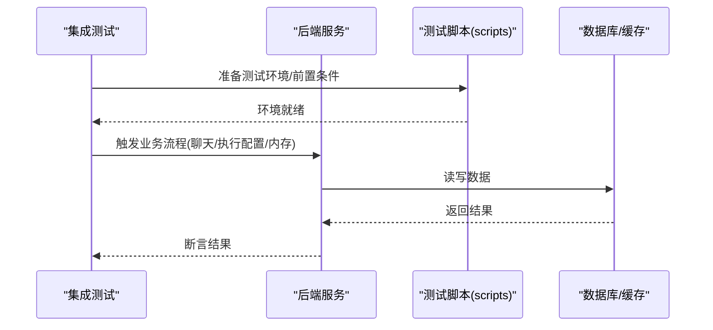
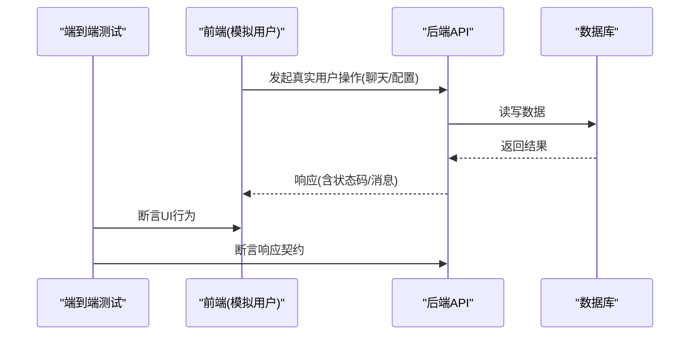
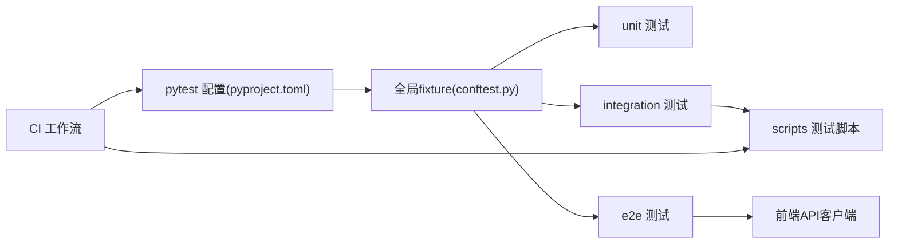

# API测试与调试

<cite>
**本文引用的文件**
- [pyproject.toml](file://backend/pyproject.toml)
- [conftest.py](file://backend/tests/conftest.py)
- [test_api_paths_e2e.py](file://backend/tests/e2e/test_api_paths_e2e.py)
- [test_chat_api_e2e.py](file://backend/tests/e2e/test_chat_api_e2e.py)
- [test_execution_config_e2e.py](file://backend/tests/e2e/test_execution_config_e2e.py)
- [test_chat_e2e.py](file://backend/tests/integration/test_chat_e2e.py)
- [test_execution_config_integration.py](file://backend/tests/integration/test_execution_config_integration.py)
- [test_simplemem_integration.py](file://backend/tests/integration/test_simplemem_integration.py)
- [test_llm_providers.py](file://backend/tests/integration/test_llm_providers.py)
- [test_memory_checkpoint_integration.py](file://backend/tests/integration/test_memory_checkpoint_integration.py)
- [test_agent_no_gateway_domain_import.py](file://backend/tests/architecture/test_agent_no_gateway_domain_import.py)
- [test_domain_no_sqlalchemy.py](file://backend/tests/architecture/test_domain_no_sqlalchemy.py)
- [test_gateway_no_agent_import.py](file://backend/tests/architecture/test_gateway_no_agent_import.py)
- [test_benchmark_loader.py](file://backend/tests/evaluation/test_benchmark_loader.py)
- [test_gaia.py](file://backend/tests/evaluation/test_gaia.py)
- [test_llm_judge.py](file://backend/tests/evaluation/test_llm_judge.py)
- [test_performance.py](file://backend/tests/evaluation/test_performance.py)
- [test_task_evaluator.py](file://backend/tests/evaluation/test_task_evaluator.py)
- [test_tool_accuracy.py](file://backend/tests/evaluation/test_tool_accuracy.py)
- [test_tool_accuracy_integration.py](file://backend/tests/evaluation/test_tool_accuracy_integration.py)
- [client.ts](file://frontend/src/api/client.ts)
- [paths.ts](file://frontend/src/api/paths.ts)
- [chat.ts](file://frontend/src/api/chat.ts)
- [session.ts](file://frontend/src/api/session.ts)
- [gateway.ts](file://frontend/src/api/gateway/gateway.ts)
- [tools.ts](file://frontend/src/api/tools.ts)
- [logging.md](file://docs/logging.md)
- [API_RESPONSE.md](file://docs/API_RESPONSE.md)
- [AUTHENTICATION.md](file://docs/AUTHENTICATION.md)
- [ARCHITECTURE.md](file://docs/ARCHITECTURE.md)
- [CONFIGURATION.md](file://docs/CONFIGURATION.md)
- [DEVELOPMENT.md](file://docs/DEVELOPMENT.md)
- [backend.env.production](file://deploy/backend.env.production)
- [run_server.py](file://backend/scripts/run_server.py)
- [run_dev_server.py](file://backend/scripts/run_dev_server.py)
- [test_gateway_proxy.py](file://backend/scripts/test_gateway_proxy.py)
- [test_network_config.py](file://backend/scripts/test_network_config.py)
- [test_tool_registry.py](file://backend/scripts/test_tool_registry.py)
- [test_checkpointer.py](file://backend/scripts/test_checkpointer.py)
- [test_litellm_models.py](file://backend/scripts/test_litellm_models.py)
- [sonarcloud_api.py](file://scripts/sonarcloud_api.py)
- [sonarcloud-scan.sh](file://scripts/sonarcloud-scan.sh)
- [sonarcloud-scan.ps1](file://scripts/sonarcloud-scan.ps1)
- [backend-architecture.yml](file://.github/workflows/backend-architecture.yml)
- [typecheck.yml](file://.github/workflows/typecheck.yml)
- [sonar.yml](file://.github/workflows/sonar.yml)
- [sonarcloud.yml](file://.github/workflows/sonarcloud.yml)
</cite>

## 目录
1. [引言](#引言)
2. [项目结构](#项目结构)
3. [核心组件](#核心组件)
4. [架构总览](#架构总览)
5. [详细组件分析](#详细组件分析)
6. [依赖关系分析](#依赖关系分析)
7. [性能考虑](#性能考虑)
8. [故障排查指南](#故障排查指南)
9. [结论](#结论)
10. [附录](#附录)

## 引言
本文件面向AI Agent项目的API测试与调试，系统化阐述测试策略（单元、集成、端到端）与测试框架使用方式，覆盖调试工具（Postman集合、curl、浏览器开发者工具）、错误处理与日志分析、性能与负载测试、监控与可观测性、API文档自动生成与维护、常见问题诊断与解决方案，以及测试自动化与CI/CD最佳实践。内容基于仓库中现有的测试目录、脚本与文档进行归纳总结。

## 项目结构
后端采用Python/FastAPI生态，测试按层次组织：unit（单元）、integration（集成）、e2e（端到端）、architecture（架构约束）、evaluation（评测），并辅以scripts中的辅助测试脚本。前端通过TypeScript封装API客户端，统一暴露路径与接口。

**图表来源**
- [conftest.py](file://backend/tests/conftest.py)
- [pyproject.toml](file://backend/pyproject.toml)
- [client.ts](file://frontend/src/api/client.ts)
- [paths.ts](file://frontend/src/api/paths.ts)
- [chat.ts](file://frontend/src/api/chat.ts)
- [session.ts](file://frontend/src/api/session.ts)
- [gateway.ts](file://frontend/src/api/gateway/gateway.ts)
- [tools.ts](file://frontend/src/api/tools.ts)

**章节来源**
- [pyproject.toml](file://backend/pyproject.toml)
- [conftest.py](file://backend/tests/conftest.py)

## 核心组件
- 测试框架与运行配置
  - 使用pytest作为测试执行器，通过pyproject.toml配置插件与选项；tests/conftest.py提供全局fixture与启动/停止逻辑。
- 前端API客户端
  - client.ts定义HTTP客户端与拦截器，paths.ts集中管理API路径常量，各业务模块（chat.ts、session.ts、gateway.ts、tools.ts）封装具体接口调用。
- 后端服务与脚本
  - run_server.py/run_dev_server.py用于本地/开发环境启动服务；scripts目录下包含网关代理、网络配置、工具注册、检查点等测试脚本，支撑集成与端到端测试。

**章节来源**
- [pyproject.toml](file://backend/pyproject.toml)
- [conftest.py](file://backend/tests/conftest.py)
- [client.ts](file://frontend/src/api/client.ts)
- [paths.ts](file://frontend/src/api/paths.ts)
- [chat.ts](file://frontend/src/api/chat.ts)
- [session.ts](file://frontend/src/api/session.ts)
- [gateway.ts](file://frontend/src/api/gateway/gateway.ts)
- [tools.ts](file://frontend/src/api/tools.ts)
- [run_server.py](file://backend/scripts/run_server.py)
- [run_dev_server.py](file://backend/scripts/run_dev_server.py)

## 架构总览
下图展示从前端到后端的典型API调用链路，以及测试覆盖的层次关系。

**图表来源**
- [client.ts](file://frontend/src/api/client.ts)
- [paths.ts](file://frontend/src/api/paths.ts)
- [chat.ts](file://frontend/src/api/chat.ts)
- [session.ts](file://frontend/src/api/session.ts)
- [gateway.ts](file://frontend/src/api/gateway/gateway.ts)
- [tools.ts](file://frontend/src/api/tools.ts)

## 详细组件分析

### 单元测试（unit）
- 覆盖范围
  - 领域模型、应用层服务、基础设施适配、工具与沙箱执行器等模块的单元测试，确保局部逻辑正确性与边界条件处理。
- 关键要点
  - 使用pytest与conftest.py提供的fixture注入依赖，避免真实外部依赖。
  - 对异常分支、空值、越界输入进行断言，保证鲁棒性。
- 典型场景
  - 沙箱执行器工厂、执行器实例化与生命周期管理。
  - 工具注册表与动态提示的单元验证。

**章节来源**
- [conftest.py](file://backend/tests/conftest.py)
- [test_sandbox_executor.py](file://backend/tests/unit/libs/test_sandbox_executor.py)
- [test_sandbox_executor_factory.py](file://backend/tests/unit/libs/test_sandbox_executor_factory.py)
- [test_sandbox_manager.py](file://backend/tests/unit/libs/test_sandbox_manager.py)

### 集成测试（integration）
- 覆盖范围
  - 端到端业务流在真实或模拟环境下的集成验证，如聊天会话、执行配置、内存检查点、LLM提供商连通性等。
- 关键要点
  - 通过scripts中的测试脚本（如网关代理、网络探测、工具注册）准备测试环境与前置条件。
  - 使用真实数据库/缓存或内存替代，确保跨模块协作正确。
- 典型场景
  - 聊天端到端流程与响应一致性校验。
  - 执行配置与Agent行为的联动测试。
  - 内存检查点与会话上下文的持久化/恢复验证。
  - LLM提供商可用性与参数传递校验。

**图表来源**
- [test_chat_e2e.py](file://backend/tests/integration/test_chat_e2e.py)
- [test_execution_config_integration.py](file://backend/tests/integration/test_execution_config_integration.py)
- [test_simplemem_integration.py](file://backend/tests/integration/test_simplemem_integration.py)
- [test_llm_providers.py](file://backend/tests/integration/test_llm_providers.py)
- [test_memory_checkpoint_integration.py](file://backend/tests/integration/test_memory_checkpoint_integration.py)
- [test_gateway_proxy.py](file://backend/scripts/test_gateway_proxy.py)
- [test_network_config.py](file://backend/scripts/test_network_config.py)
- [test_tool_registry.py](file://backend/scripts/test_tool_registry.py)

**章节来源**
- [test_chat_e2e.py](file://backend/tests/integration/test_chat_e2e.py)
- [test_execution_config_integration.py](file://backend/tests/integration/test_execution_config_integration.py)
- [test_simplemem_integration.py](file://backend/tests/integration/test_simplemem_integration.py)
- [test_llm_providers.py](file://backend/tests/integration/test_llm_providers.py)
- [test_memory_checkpoint_integration.py](file://backend/tests/integration/test_memory_checkpoint_integration.py)
- [test_gateway_proxy.py](file://backend/scripts/test_gateway_proxy.py)
- [test_network_config.py](file://backend/scripts/test_network_config.py)
- [test_tool_registry.py](file://backend/scripts/test_tool_registry.py)

### 端到端测试（e2e）
- 覆盖范围
  - 真实用户路径的完整链路验证，包括API路径可达性、聊天对话、执行配置、网关凭据探测等。
- 关键要点
  - 依赖真实或隔离的后端实例，确保从UI到数据库的全链路闭环。
  - 对关键API路径进行白盒+黑盒组合验证，关注鉴权、限流、错误码与响应格式。
- 典型场景
  - API路径可达性与返回结构一致性。
  - 聊天API的请求-响应契约验证。
  - 执行配置与Agent工作流的端到端闭环。

**图表来源**
- [test_api_paths_e2e.py](file://backend/tests/e2e/test_api_paths_e2e.py)
- [test_chat_api_e2e.py](file://backend/tests/e2e/test_chat_api_e2e.py)
- [test_execution_config_e2e.py](file://backend/tests/e2e/test_execution_config_e2e.py)

**章节来源**
- [test_api_paths_e2e.py](file://backend/tests/e2e/test_api_paths_e2e.py)
- [test_chat_api_e2e.py](file://backend/tests/e2e/test_chat_api_e2e.py)
- [test_execution_config_e2e.py](file://backend/tests/e2e/test_execution_config_e2e.py)

### 架构约束测试（architecture）
- 目标
  - 保证领域分层与模块间依赖符合设计原则，避免反向依赖与循环依赖。
- 关键要点
  - 对导入关系进行静态检查，确保Agent不直接依赖网关域、领域不直接依赖ORM等。
- 典型场景
  - Agent模块与网关域的导入约束。
  - 领域层对ORM的使用限制。

**章节来源**
- [test_agent_no_gateway_domain_import.py](file://backend/tests/architecture/test_agent_no_gateway_domain_import.py)
- [test_agent_no_litellm_import.py](file://backend/tests/architecture/test_agent_no_litellm_import.py)
- [test_agent_no_provider_settings.py](file://backend/tests/architecture/test_agent_no_provider_settings.py)
- [test_domain_no_sqlalchemy.py](file://backend/tests/architecture/test_domain_no_sqlalchemy.py)
- [test_gateway_no_agent_import.py](file://backend/tests/architecture/test_gateway_no_agent_import.py)

### 评测测试（evaluation）
- 覆盖范围
  - Benchmarks加载、GAIA评估、LLM Judge、性能评测、工具准确率等。
- 关键要点
  - 通过基准数据集与评测指标衡量Agent能力与稳定性。
- 典型场景
  - 工具准确率与任务完成率的统计与断言。

**章节来源**
- [test_benchmark_loader.py](file://backend/tests/evaluation/test_benchmark_loader.py)
- [test_gaia.py](file://backend/tests/evaluation/test_gaia.py)
- [test_llm_judge.py](file://backend/tests/evaluation/test_llm_judge.py)
- [test_performance.py](file://backend/tests/evaluation/test_performance.py)
- [test_task_evaluator.py](file://backend/tests/evaluation/test_task_evaluator.py)
- [test_tool_accuracy.py](file://backend/tests/evaluation/test_tool_accuracy.py)
- [test_tool_accuracy_integration.py](file://backend/tests/evaluation/test_tool_accuracy_integration.py)

## 依赖关系分析
- 测试耦合与内聚
  - unit高内聚、低耦合，依赖注入与mock隔离外部依赖。
  - integration与e2e逐步扩大依赖范围，最终与真实数据库/缓存交互。
- 外部依赖
  - CI/CD工作流与质量扫描脚本（SonarQube/SonarCloud）与测试结果报告集成。
- 可能的循环依赖
  - 架构约束测试用于发现并阻止模块间的不当依赖。

**图表来源**
- [pyproject.toml](file://backend/pyproject.toml)
- [conftest.py](file://backend/tests/conftest.py)
- [backend-architecture.yml](file://.github/workflows/backend-architecture.yml)
- [typecheck.yml](file://.github/workflows/typecheck.yml)
- [sonar.yml](file://.github/workflows/sonar.yml)
- [sonarcloud.yml](file://.github/workflows/sonarcloud.yml)

**章节来源**
- [pyproject.toml](file://backend/pyproject.toml)
- [conftest.py](file://backend/tests/conftest.py)
- [backend-architecture.yml](file://.github/workflows/backend-architecture.yml)
- [typecheck.yml](file://.github/workflows/typecheck.yml)
- [sonar.yml](file://.github/workflows/sonar.yml)
- [sonarcloud.yml](file://.github/workflows/sonarcloud.yml)

## 性能考虑
- 性能测试与负载测试建议
  - 在integration与e2e层引入压力测试（如并发请求数、RPS目标、响应时间分布），结合数据库索引与缓存命中率评估瓶颈。
  - 使用scripts中的网络与代理测试脚本验证网关与外部服务的延迟与可用性。
- 监控与可观测性
  - 结合日志规范与告警策略，对关键API路径与错误码进行聚合统计与阈值告警。
- 文档与基线
  - 参考文档中的日志与架构说明，建立性能基线与回归阈值。

**章节来源**
- [test_network_config.py](file://backend/scripts/test_network_config.py)
- [test_gateway_proxy.py](file://backend/scripts/test_gateway_proxy.py)
- [logging.md](file://docs/logging.md)
- [ARCHITECTURE.md](file://docs/ARCHITECTURE.md)

## 故障排查指南
- 错误码与响应解读
  - 参考API响应约定文档，明确不同HTTP状态码与错误体字段含义，便于快速定位问题类型（认证失败、参数非法、服务内部错误等）。
- 日志分析技巧
  - 使用日志规范文档中的结构化字段（如traceId、userId、endpoint）进行关联查询与聚合分析。
- 常见问题与定位步骤
  - 认证/鉴权失败：核对鉴权文档与请求头，确认令牌有效与作用域匹配。
  - 参数校验失败：对照API路径与请求体Schema，逐项比对必填字段与类型。
  - 网络/上游超时：利用scripts中的网络探测与代理测试脚本，定位网络路径与上游可用性。
  - 数据库/缓存异常：结合集成测试中的前置条件与回滚策略，缩小问题范围至特定事务或缓存键。

**章节来源**
- [API_RESPONSE.md](file://docs/API_RESPONSE.md)
- [AUTHENTICATION.md](file://docs/AUTHENTICATION.md)
- [logging.md](file://docs/logging.md)
- [test_network_config.py](file://backend/scripts/test_network_config.py)
- [test_gateway_proxy.py](file://backend/scripts/test_gateway_proxy.py)

## 结论
本项目已形成从单元到端到端的完整测试体系，并通过架构约束测试保障模块化设计。配合前端API客户端与CI/CD工作流，能够稳定地验证API的正确性、性能与可靠性。建议持续完善性能基线、监控告警与文档自动生成流程，进一步提升API质量与交付效率。

## 附录

### API测试策略与工具使用
- Postman集合
  - 建议将关键API路径与鉴权流程导入Postman集合，支持环境变量切换与预/后置脚本，便于手工与回归测试。
- curl命令
  - 使用curl进行轻量级验证，结合-j/-v输出响应头与体，快速定位协议与鉴权问题。
- 浏览器开发者工具
  - 利用Network面板查看请求/响应、Headers、Timing与错误信息，结合Console面板排查前端逻辑问题。

### API调试工具与技术
- 前端调试
  - 在client.ts中设置统一拦截器记录请求/响应，必要时开启详细日志开关。
- 后端调试
  - 使用run_dev_server.py启动开发服务器，结合断点与日志定位问题。
- 网关与外部服务
  - 使用scripts中的测试脚本验证网关代理、网络连通性与工具注册状态。

**章节来源**
- [client.ts](file://frontend/src/api/client.ts)
- [run_dev_server.py](file://backend/scripts/run_dev_server.py)
- [test_gateway_proxy.py](file://backend/scripts/test_gateway_proxy.py)
- [test_network_config.py](file://backend/scripts/test_network_config.py)

### API文档自动生成与维护
- 自动生成
  - 在后端使用OpenAPI/Swagger注解导出接口文档，结合CI生成HTML/PDF版本并归档。
- 维护流程
  - 接口变更同步更新注解与示例，确保文档与代码一致；通过架构约束测试防止破坏性修改。

### API测试自动化与CI/CD集成最佳实践
- 工作流编排
  - 使用GitHub Actions工作流分别执行架构约束、类型检查、单元/集成/端到端测试与质量扫描。
- 报告与归档
  - 将测试结果（JUnit XML、JSON）与覆盖率报告上传至CI平台，SonarQube/SonarCloud进行质量门禁与趋势分析。
- 质量门禁
  - 设置失败阈值（阻断式）与警告阈值（提醒式），确保问题在合并前被发现。

**章节来源**
- [backend-architecture.yml](file://.github/workflows/backend-architecture.yml)
- [typecheck.yml](file://.github/workflows/typecheck.yml)
- [sonar.yml](file://.github/workflows/sonar.yml)
- [sonarcloud.yml](file://.github/workflows/sonarcloud.yml)
- [sonarcloud_api.py](file://scripts/sonarcloud_api.py)
- [sonarcloud-scan.sh](file://scripts/sonarcloud-scan.sh)
- [sonarcloud-scan.ps1](file://scripts/sonarcloud-scan.ps1)