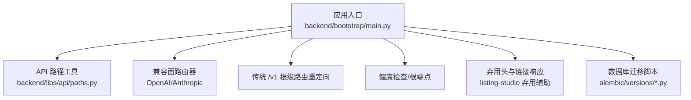
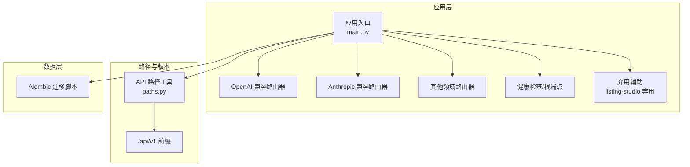
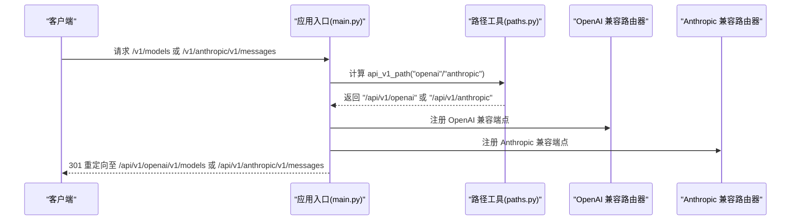
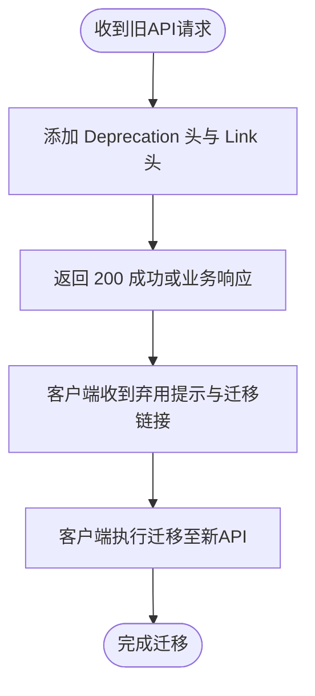
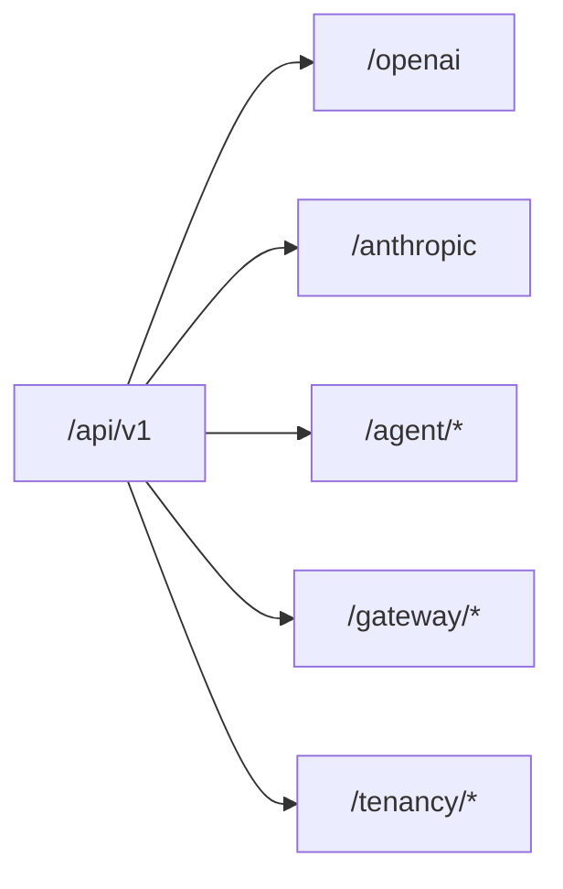
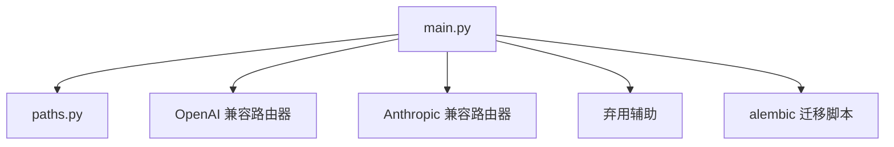

# API版本管理与兼容性

<cite>
**本文引用的文件**   
- [backend/bootstrap/main.py](file://backend/bootstrap/main.py)
- [backend/libs/api/paths.py](file://backend/libs/api/paths.py)
- [backend/domains/agent/presentation/listing_studio_deprecation.py](file://backend/domains/agent/presentation/listing_studio_deprecation.py)
- [backend/docs/archive/MIGRATION_PLAN_ZERO_REGRESSION.md](file://backend/docs/archive/MIGRATION_PLAN_ZERO_REGRESSION.md)
- [backend/tests/integration/api/test_root_path_routing.py](file://backend/tests/integration/api/test_root_path_routing.py)
- [backend/alembic/versions/20260127_180000_add_api_keys.py](file://backend/alembic/versions/20260127_180000_add_api_keys.py)
- [backend/alembic/versions/20260128_090000_drop_api_key_foreign_keys.py](file://backend/alembic/versions/20260128_090000_drop_api_key_foreign_keys.py)
- [backend/alembic/sql/20260127_180000_add_api_keys.up.sql](file://backend/alembic/sql/20260127_180000_add_api_keys.up.sql)
- [backend/alembic/versions/001_initial.py](file://backend/alembic/versions/001_initial.py)
- [backend/alembic/versions/002_add_performance_indexes.py](file://backend/alembic/versions/002_add_performance_indexes.py)
- [backend/alembic/versions/003_fix_user_schema.py](file://backend/alembic/versions/003_fix_user_schema.py)
- [backend/alembic/versions/004_fix_timestamp_defaults.py](file://backend/alembic/versions/004_fix_timestamp_defaults.py)
- [backend/alembic/versions/005_add_session_status_and_context.py](file://backend/alembic/versions/005_add_session_status_and_context.py)
- [backend/alembic/versions/006_fix_messages_table.py](file://backend/alembic/versions/006_fix_messages_table.py)
- [backend/alembic/versions/007_add_memory_last_accessed.py](file://backend/alembic/versions/007_add_memory_last_accessed.py)
- [backend/alembic/versions/008_add_langgraph_tables.py](file://backend/alembic/versions/008_add_langgraph_tables.py)
- [backend/alembic/versions/009_add_agent_config_columns.py](file://backend/alembic/versions/009_add_agent_config_columns.py)
- [backend/alembic/versions/010_align_users_for_fastapi_users.py](file://backend/alembic/versions/010_align_users_for_fastapi_users.py)
- [backend/alembic/versions/011_add_anonymous_user_support.py](file://backend/alembic/versions/011_add_anonymous_user_support.py)
- [backend/alembic/versions/20260123_212703_add_config_column_to_sessions.py](file://backend/alembic/versions/20260123_212703_add_config_column_to_sessions.py)
- [backend/alembic/versions/20260127_150000_add_mcp_servers.py](file://backend/alembic/versions/20260127_150000_add_mcp_servers.py)
- [backend/alembic/versions/20260127_160000_add_mcp_connection_status_and_tools.py](file://backend/alembic/versions/20260127_160000_add_mcp_connection_status_and_tools.py)
- [backend/alembic/versions/20260127_170000_add_mcp_description_and_category.py](file://backend/alembic/versions/20260127_170000_add_mcp_description_and_category.py)
- [backend/alembic/versions/20260127_180000_add_api_keys.py](file://backend/alembic/versions/20260127_180000_add_api_keys.py)
- [backend/alembic/versions/20260128_081900_add_updated_at_to_usage_logs.py](file://backend/alembic/versions/20260128_081900_add_updated_at_to_usage_logs.py)
- [backend/alembic/versions/20260128_100000_add_llm_key_quota_tables.py](file://backend/alembic/versions/20260128_100000_add_llm_key_quota_tables.py)
- [backend/alembic/versions/20260128_add_encrypted_key.py](file://backend/alembic/versions/20260128_add_encrypted_key.py)
- [backend/alembic/versions/20260129_add_mcp_dynamic_prompts.py](file://backend/alembic/versions/20260129_add_mcp_dynamic_prompts.py)
- [backend/alembic/versions/20260129_add_mcp_dynamic_tools.py](file://backend/alembic/versions/20260129_add_mcp_dynamic_tools.py)
- [backend/alembic/versions/20260129_add_mcp_template_fields.py](file://backend/alembic/versions/20260129_add_mcp_template_fields.py)
- [backend/alembic/versions/20260129_seed_default_mcp_prompts.py](file://backend/alembic/versions/20260129_seed_default_mcp_prompts.py)
- [backend/alembic/versions/20260202_add_video_gen_tasks.py](file://backend/alembic/versions/20260202_add_video_gen_tasks.py)
- [backend/alembic/versions/20260202_agents_tools_jsonb_to_array.py](file://backend/alembic/versions/20260202_agents_tools_jsonb_to_array.py)
- [backend/alembic/versions/20260205_add_session_video_task_count.py](file://backend/alembic/versions/20260205_add_session_video_task_count.py)
- [backend/alembic/versions/20260205_add_user_vendor_creator_id.py](file://backend/alembic/versions/20260205_add_user_vendor_creator_id.py)
- [backend/alembic/versions/20260205_add_video_model_duration.py](file://backend/alembic/versions/20260205_add_video_model_duration.py)
- [backend/alembic/versions/20260209_add_product_info_tables.py](file://backend/alembic/versions/20260209_add_product_info_tables.py)
- [backend/alembic/versions/20260224_add_step_phase_columns.py](file://backend/alembic/versions/20260224_add_step_phase_columns.py)
- [backend/alembic/versions/20260224_add_user_models_table.py](file://backend/alembic/versions/20260224_add_user_models_table.py)
- [backend/alembic/versions/20260508_add_gateway_tables.py](file://backend/alembic/versions/20260508_add_gateway_tables.py)
- [backend/alembic/versions/20260508_add_provider_credentials.py](file://backend/alembic/versions/20260508_add_provider_credentials.py)
- [backend/alembic/versions/20260513_unique_system_vkey_per_team.py](file://backend/alembic/versions/20260513_unique_system_vkey_per_team.py)
- [backend/alembic/versions/20260514_add_model_last_test_reason.py](file://backend/alembic/versions/20260514_add_model_last_test_reason.py)
- [backend/alembic/versions/20260514_add_model_last_test_status.py](file://backend/alembic/versions/20260514_add_model_last_test_status.py)
- [backend/alembic/versions/20260514_drop_studio_workflow_tables.py](file://backend/alembic/versions/20260514_drop_studio_workflow_tables.py)
- [backend/alembic/versions/20260514_gateway_budget_model_name.py](file://backend/alembic/versions/20260514_gateway_budget_model_name.py)
- [backend/alembic/versions/20260514_gateway_log_credential_dim.py](file://backend/alembic/versions/20260514_gateway_log_credential_dim.py)
- [backend/alembic/versions/20260514_gateway_log_deployment_dim.py](file://backend/alembic/versions/20260514_gateway_log_deployment_dim.py)
- [backend/alembic/versions/20260514_unique_active_personal_team_per_owner.py](file://backend/alembic/versions/20260514_unique_active_personal_team_per_owner.py)
- [backend/alembic/versions/20260515_api_key_gateway_grants.py](file://backend/alembic/versions/20260515_api_key_gateway_grants.py)
- [backend/alembic/versions/20260515_drop_gateway_legacy_user_model.py](file://backend/alembic/versions/20260515_drop_gateway_legacy_user_model.py)
- [backend/alembic/versions/20260515_drop_provider_credential_legacy_user_model.py](file://backend/alembic/versions/20260515_drop_provider_credential_legacy_user_model.py)
- [backend/alembic/versions/20260515_drop_user_models.py](file://backend/alembic/versions/20260515_drop_user_models.py)
- [backend/alembic/versions/20260515_gateway_legacy_user_model.py](file://backend/alembic/versions/20260515_gateway_legacy_user_model.py)
- [backend/alembic/versions/20260515_migrate_user_models_data.py](file://backend/alembic/versions/20260515_migrate_user_models_data.py)
- [backend/alembic/versions/20260518_gateway_model_pricing.py](file://backend/alembic/versions/20260518_gateway_model_pricing.py)
- [backend/alembic/versions/20260518_gateway_provider_entitlement_plans.py](file://backend/alembic/versions/20260518_gateway_provider_entitlement_plans.py)
- [backend/alembic/versions/20260519_drop_user_provider_configs.py](file://backend/alembic/versions/20260519_drop_user_provider_configs.py)
- [backend/alembic/versions/20260520_add_system_storage_config.py](file://backend/alembic/versions/20260520_add_system_storage_config.py)
- [backend/alembic/versions/20260520_gateway_request_log_client.py](file://backend/alembic/versions/20260520_gateway_request_log_client.py)
- [backend/alembic/versions/20260520_system_storage_config_single_active.py](file://backend/alembic/versions/20260520_system_storage_config_single_active.py)
- [backend/alembic/versions/20260521_tenant_data_scope.py](file://backend/alembic/versions/20260521_tenant_data_scope.py)
- [backend/alembic/versions/20260522_tenant_phase3.py](file://backend/alembic/versions/20260522_tenant_phase3.py)
- [backend/alembic/versions/20260523_sessions_agents_tenant_id.py](file://backend/alembic/versions/20260523_sessions_agents_tenant_id.py)
- [backend/alembic/versions/20260524_drop_agents_user_id.py](file://backend/alembic/versions/20260524_drop_agents_user_id.py)
- [backend/alembic/versions/20260525_drop_sessions_owner_columns.py](file://backend/alembic/versions/20260525_drop_sessions_owner_columns.py)
- [backend/alembic/versions/20260526_credential_profile_call_shape.py](file://backend/alembic/versions/20260526_credential_profile_call_shape.py)
- [backend/alembic/versions/20260526_provider_credentials_tenant_id.py](file://backend/alembic/versions/20260526_provider_credentials_tenant_id.py)
- [backend/alembic/versions/20260527_193526_merge_gateway_preflight_and_log_heads.py](file://backend/alembic/versions/20260527_193526_merge_gateway_preflight_and_log_heads.py)
- [backend/alembic/versions/20260527_backfill_request_log_provider.py](file://backend/alembic/versions/20260527_backfill_request_log_provider.py)
- [backend/alembic/versions/20260527_credential_api_bases.py](file://backend/alembic/versions/20260527_credential_api_bases.py)
- [backend/alembic/versions/20260527_provider_credentials_scope_nullable.py](file://backend/alembic/versions/20260527_provider_credentials_scope_nullable.py)
- [backend/alembic/versions/20260527_slow_sql_hotpath_indexes.py](file://backend/alembic/versions/20260527_slow_sql_hotpath_indexes.py)
- [backend/alembic/versions/20260528_backfill_request_log_provider_v2.py](file://backend/alembic/versions/20260528_backfill_request_log_provider_v2.py)
- [backend/alembic/versions/20260528_backfill_request_log_user.py](file://backend/alembic/versions/20260528_backfill_request_log_user.py)
- [backend/alembic/versions/20260528_system_gateway_models_credential_fk.py](file://backend/alembic/versions/20260528_system_gateway_models_credential_fk.py)
- [backend/alembic/versions/20260529_gateway_budgets_rename_to_target.py](file://backend/alembic/versions/20260529_gateway_budgets_rename_to_target.py)
- [backend/alembic/versions/20260530_downstream_pricing_scope_tenant.py](file://backend/alembic/versions/20260530_downstream_pricing_scope_tenant.py)
- [backend/alembic/versions/20260531_owned_resources_tenant_id.py](file://backend/alembic/versions/20260531_owned_resources_tenant_id.py)
- [backend/alembic/versions/20260601_drop_legacy_tenant_id_fks.py](file://backend/alembic/versions/20260601_drop_legacy_tenant_id_fks.py)
- [backend/alembic/versions/20260602_drop_all_db_foreign_keys.py](file://backend/alembic/versions/20260602_drop_all_db_foreign_keys.py)
- [backend/alembic/versions/20260603_system_visibility_acl.py](file://backend/alembic/versions/20260603_system_visibility_acl.py)
- [backend/alembic/versions/20260604_api_keys_revoked_at.py](file://backend/alembic/versions/20260604_api_keys_revoked_at.py)
- [backend/alembic/versions/20260605_migrate_system_cred_models.py](file://backend/alembic/versions/20260605_migrate_system_cred_models.py)
- [backend/alembic/versions/20260606_migrate_anonymous_shadow_to_deterministic_tenant.py](file://backend/alembic/versions/20260606_migrate_anonymous_shadow_to_deterministic_tenant.py)
- [backend/alembic/versions/20260607_gateway_preflight_indexes.py](file://backend/alembic/versions/20260607_gateway_preflight_indexes.py)
- [backend/alembic/versions/20260607_gateway_request_log_tenant_route_time.py](file://backend/alembic/versions/20260607_gateway_request_log_tenant_route_time.py)
- [backend/alembic/versions/20260608_provider_credentials_created_by.py](file://backend/alembic/versions/20260608_provider_credentials_created_by.py)
- [backend/alembic/versions/20260609_add_user_giikin_user_id.py](file://backend/alembic/versions/20260609_add_user_giikin_user_id.py)
- [backend/alembic/versions/20260610_delete_unattributed_probe_request_logs.py](file://backend/alembic/versions/20260610_delete_unattributed_probe_request_logs.py)
- [backend/alembic/versions/20260611_gateway_budget_credential.py](file://backend/alembic/versions/20260611_gateway_budget_credential.py)
- [backend/alembic/versions/20260612_gateway_budget_tenant.py](file://backend/alembic/versions/20260612_gateway_budget_tenant.py)
- [backend/alembic/versions/20260613_add_cache_creation_tokens.py](file://backend/alembic/versions/20260613_add_cache_creation_tokens.py)
</cite>

## 目录
1. [引言](#引言)
2. [项目结构](#项目结构)
3. [核心组件](#核心组件)
4. [架构总览](#架构总览)
5. [详细组件分析](#详细组件分析)
6. [依赖关系分析](#依赖关系分析)
7. [性能考量](#性能考量)
8. [故障排查指南](#故障排查指南)
9. [结论](#结论)
10. [附录](#附录)

## 引言
本文件面向AI Agent项目的API版本管理与兼容性，系统阐述版本控制策略、语义化版本应用、向后兼容保障、破坏性变更处理、废弃与迁移流程、多版本并存与路由策略、客户端适配与自动升级、变更通知与沟通机制、回滚与降级应急流程、文档版本管理与对比方法，以及兼容性测试与验证工具及流程。内容基于仓库中实际的路由注册、版本路径约定、弃用头与链接响应、数据库迁移脚本与字段演进等证据进行归纳总结。

## 项目结构
后端采用FastAPI应用入口集中注册路由，并通过统一的API路径工具函数生成版本化前缀。兼容面（OpenAI/Anthropic）以独立路由器挂载在统一的v1前缀下，同时保留对历史根级/v1的301重定向以支持平滑过渡。数据库迁移脚本以版本化文件记录数据结构演进，支撑API与数据层的兼容性。

图表来源
- [backend/bootstrap/main.py](file://backend/bootstrap/main.py)
- [backend/libs/api/paths.py](file://backend/libs/api/paths.py)
- [backend/domains/agent/presentation/listing_studio_deprecation.py](file://backend/domains/agent/presentation/listing_studio_deprecation.py)

章节来源
- [backend/bootstrap/main.py](file://backend/bootstrap/main.py)
- [backend/libs/api/paths.py](file://backend/libs/api/paths.py)
- [backend/domains/agent/presentation/listing_studio_deprecation.py](file://backend/domains/agent/presentation/listing_studio_deprecation.py)

## 核心组件
- 版本化API路径与路由注册：通过统一的路径工具函数生成/api/v1前缀，兼容面路由器在此前缀下注册端点。
- 兼容面路由器：分别注册OpenAI兼容与Anthropic Messages兼容端点，确保第三方SDK无需修改即可对接。
- 弃用标记与迁移指引：在旧版产品信息API上添加Deprecation头与Link头，引导客户端迁移到新的listing-studio API。
- 数据库迁移与演进：以版本化迁移脚本记录表结构与索引变化，支撑API与数据层的向前/向后兼容。
- 根级/v1重定向：在未配置ROOT_PATH场景下，将历史根级/v1路径301重定向到新的兼容面地址，避免断链。

章节来源
- [backend/bootstrap/main.py](file://backend/bootstrap/main.py)
- [backend/domains/agent/presentation/listing_studio_deprecation.py](file://backend/domains/agent/presentation/listing_studio_deprecation.py)
- [backend/alembic/versions/20260127_180000_add_api_keys.py](file://backend/alembic/versions/20260127_180000_add_api_keys.py)
- [backend/alembic/versions/20260128_090000_drop_api_key_foreign_keys.py](file://backend/alembic/versions/20260128_090000_drop_api_key_foreign_keys.py)

## 架构总览
下图展示API版本化与兼容性的整体交互：应用入口负责注册路由、异常处理与健康检查；路径工具提供统一前缀；兼容面路由器承载OpenAI/Anthropic兼容端点；弃用辅助在旧API上标注弃用并提供迁移链接；数据库迁移脚本记录数据演进。

图表来源
- [backend/bootstrap/main.py](file://backend/bootstrap/main.py)
- [backend/libs/api/paths.py](file://backend/libs/api/paths.py)
- [backend/domains/agent/presentation/listing_studio_deprecation.py](file://backend/domains/agent/presentation/listing_studio_deprecation.py)
- [backend/alembic/versions/20260127_180000_add_api_keys.py](file://backend/alembic/versions/20260127_180000_add_api_keys.py)

## 详细组件分析

### 版本化API路径与路由注册
- 统一前缀：通过路径工具函数生成/api/v1前缀，所有兼容面与领域API均在此前缀下注册，确保版本隔离与清晰的命名空间。
- 兼容面注册：OpenAI兼容与Anthropic Messages兼容路由器分别挂载在/api/v1/openai与/api/v1/anthropic下，满足主流SDK对接。
- 根级/v1重定向：在未配置ROOT_PATH场景下，根级/v1路径301重定向到新的兼容面地址，避免历史调用断链。

图表来源
- [backend/bootstrap/main.py](file://backend/bootstrap/main.py)
- [backend/libs/api/paths.py](file://backend/libs/api/paths.py)

章节来源
- [backend/bootstrap/main.py](file://backend/bootstrap/main.py)
- [backend/tests/integration/api/test_root_path_routing.py](file://backend/tests/integration/api/test_root_path_routing.py)

### 弃用策略与迁移指南
- 弃用头与链接：在旧版产品信息API响应中设置Deprecation头与Link头，指向新的listing-studio API，明确告知客户端版本弃用并提供迁移路径。
- 迁移流程：建议在弃用窗口期内逐步引导客户端切换到新API，期间保持旧API可用但带弃用标记，最终在到期日停止支持。

图表来源
- [backend/domains/agent/presentation/listing_studio_deprecation.py](file://backend/domains/agent/presentation/listing_studio_deprecation.py)

章节来源
- [backend/domains/agent/presentation/listing_studio_deprecation.py](file://backend/domains/agent/presentation/listing_studio_deprecation.py)

### 多版本API并存与路由策略
- 并存策略：当前以/api/v1作为稳定版本面，兼容面与领域API在此前缀下并存，避免破坏性变更影响现有客户端。
- 路由策略：通过include_router与prefix参数将不同功能域的路由器挂载到/api/v1下的子路径，形成清晰的命名空间隔离。
- 过渡期重定向：在特定环境下保留根级/v1重定向，确保历史调用不中断。

图表来源
- [backend/bootstrap/main.py](file://backend/bootstrap/main.py)

章节来源
- [backend/bootstrap/main.py](file://backend/bootstrap/main.py)

### 向后兼容性保证与破坏性变更处理
- 兼容性原则：新增字段与端点时保持默认值与向后兼容，避免破坏既有客户端行为。
- 破坏性变更：通过弃用窗口与版本前缀隔离，先标记弃用再在后续版本移除，确保有足够时间迁移。
- 数据层演进：数据库迁移脚本记录字段增删与索引调整，配合API层的兼容策略，确保数据与接口同步演进。

章节来源
- [backend/alembic/versions/20260127_180000_add_api_keys.py](file://backend/alembic/versions/20260127_180000_add_api_keys.py)
- [backend/alembic/versions/20260128_090000_drop_api_key_foreign_keys.py](file://backend/alembic/versions/20260128_090000_drop_api_key_foreign_keys.py)
- [backend/alembic/sql/20260127_180000_add_api_keys.up.sql](file://backend/alembic/sql/20260127_180000_add_api_keys.up.sql)

### 客户端版本适配与自动升级
- 版本协商：通过根端点返回当前版本号，客户端可据此判断自身版本并触发升级流程。
- 自动升级：在客户端侧实现版本检测与升级提示，结合弃用头与迁移链接，引导用户完成升级。
- 兼容性测试：在升级前后运行兼容性测试，确保关键接口行为不变。

章节来源
- [backend/bootstrap/main.py](file://backend/bootstrap/main.py)

### API变更通知与开发者沟通机制
- 弃用头与链接：在旧API响应中添加Deprecation与Link头，明确告知弃用与迁移路径。
- 文档与路线图：结合项目文档中的架构与迁移计划，向开发者提供清晰的演进路线。

章节来源
- [backend/domains/agent/presentation/listing_studio_deprecation.py](file://backend/domains/agent/presentation/listing_studio_deprecation.py)
- [backend/docs/archive/MIGRATION_PLAN_ZERO_REGRESSION.md](file://backend/docs/archive/MIGRATION_PLAN_ZERO_REGRESSION.md)

### 版本回滚与降级应急处理
- 回滚策略：在发现重大问题时，优先通过版本前缀隔离与兼容面回退，避免影响其他版本客户端。
- 降级流程：针对特定客户端或租户，临时降级到稳定版本面，同时发布补丁修复问题。
- 监控与告警：结合健康检查与错误日志，快速定位问题并启动应急流程。

章节来源
- [backend/bootstrap/main.py](file://backend/bootstrap/main.py)

### API文档版本管理与版本对比
- 文档版本化：为每个API版本维护独立的文档版本，记录变更点与迁移指南。
- 版本对比：通过数据库迁移脚本与变更日志，对比不同版本间的差异，辅助文档更新与客户端迁移。

章节来源
- [backend/alembic/versions/001_initial.py](file://backend/alembic/versions/001_initial.py)
- [backend/alembic/versions/002_add_performance_indexes.py](file://backend/alembic/versions/002_add_performance_indexes.py)
- [backend/alembic/versions/003_fix_user_schema.py](file://backend/alembic/versions/003_fix_user_schema.py)
- [backend/alembic/versions/004_fix_timestamp_defaults.py](file://backend/alembic/versions/004_fix_timestamp_defaults.py)
- [backend/alembic/versions/005_add_session_status_and_context.py](file://backend/alembic/versions/005_add_session_status_and_context.py)
- [backend/alembic/versions/006_fix_messages_table.py](file://backend/alembic/versions/006_fix_messages_table.py)
- [backend/alembic/versions/007_add_memory_last_accessed.py](file://backend/alembic/versions/007_add_memory_last_accessed.py)
- [backend/alembic/versions/008_add_langgraph_tables.py](file://backend/alembic/versions/008_add_langgraph_tables.py)
- [backend/alembic/versions/009_add_agent_config_columns.py](file://backend/alembic/versions/009_add_agent_config_columns.py)
- [backend/alembic/versions/010_align_users_for_fastapi_users.py](file://backend/alembic/versions/010_align_users_for_fastapi_users.py)
- [backend/alembic/versions/011_add_anonymous_user_support.py](file://backend/alembic/versions/011_add_anonymous_user_support.py)
- [backend/alembic/versions/20260123_212703_add_config_column_to_sessions.py](file://backend/alembic/versions/20260123_212703_add_config_column_to_sessions.py)
- [backend/alembic/versions/20260127_150000_add_mcp_servers.py](file://backend/alembic/versions/20260127_150000_add_mcp_servers.py)
- [backend/alembic/versions/20260127_160000_add_mcp_connection_status_and_tools.py](file://backend/alembic/versions/20260127_160000_add_mcp_connection_status_and_tools.py)
- [backend/alembic/versions/20260127_170000_add_mcp_description_and_category.py](file://backend/alembic/versions/20260127_170000_add_mcp_description_and_category.py)
- [backend/alembic/versions/20260127_180000_add_api_keys.py](file://backend/alembic/versions/20260127_180000_add_api_keys.py)
- [backend/alembic/versions/20260128_081900_add_updated_at_to_usage_logs.py](file://backend/alembic/versions/20260128_081900_add_updated_at_to_usage_logs.py)
- [backend/alembic/versions/20260128_100000_add_llm_key_quota_tables.py](file://backend/alembic/versions/20260128_100000_add_llm_key_quota_tables.py)
- [backend/alembic/versions/20260128_add_encrypted_key.py](file://backend/alembic/versions/20260128_add_encrypted_key.py)
- [backend/alembic/versions/20260129_add_mcp_dynamic_prompts.py](file://backend/alembic/versions/20260129_add_mcp_dynamic_prompts.py)
- [backend/alembic/versions/20260129_add_mcp_dynamic_tools.py](file://backend/alembic/versions/20260129_add_mcp_dynamic_tools.py)
- [backend/alembic/versions/20260129_add_mcp_template_fields.py](file://backend/alembic/versions/20260129_add_mcp_template_fields.py)
- [backend/alembic/versions/20260129_seed_default_mcp_prompts.py](file://backend/alembic/versions/20260129_seed_default_mcp_prompts.py)
- [backend/alembic/versions/20260202_add_video_gen_tasks.py](file://backend/alembic/versions/20260202_add_video_gen_tasks.py)
- [backend/alembic/versions/20260202_agents_tools_jsonb_to_array.py](file://backend/alembic/versions/20260202_agents_tools_jsonb_to_array.py)
- [backend/alembic/versions/20260205_add_session_video_task_count.py](file://backend/alembic/versions/20260205_add_session_video_task_count.py)
- [backend/alembic/versions/20260205_add_user_vendor_creator_id.py](file://backend/alembic/versions/20260205_add_user_vendor_creator_id.py)
- [backend/alembic/versions/20260205_add_video_model_duration.py](file://backend/alembic/versions/20260205_add_video_model_duration.py)
- [backend/alembic/versions/20260209_add_product_info_tables.py](file://backend/alembic/versions/20260209_add_product_info_tables.py)
- [backend/alembic/versions/20260224_add_step_phase_columns.py](file://backend/alembic/versions/20260224_add_step_phase_columns.py)
- [backend/alembic/versions/20260224_add_user_models_table.py](file://backend/alembic/versions/20260224_add_user_models_table.py)
- [backend/alembic/versions/20260508_add_gateway_tables.py](file://backend/alembic/versions/20260508_add_gateway_tables.py)
- [backend/alembic/versions/20260508_add_provider_credentials.py](file://backend/alembic/versions/20260508_add_provider_credentials.py)
- [backend/alembic/versions/20260513_unique_system_vkey_per_team.py](file://backend/alembic/versions/20260513_unique_system_vkey_per_team.py)
- [backend/alembic/versions/20260514_add_model_last_test_reason.py](file://backend/alembic/versions/20260514_add_model_last_test_reason.py)
- [backend/alembic/versions/20260514_add_model_last_test_status.py](file://backend/alembic/versions/20260514_add_model_last_test_status.py)
- [backend/alembic/versions/20260514_drop_studio_workflow_tables.py](file://backend/alembic/versions/20260514_drop_studio_workflow_tables.py)
- [backend/alembic/versions/20260514_gateway_budget_model_name.py](file://backend/alembic/versions/20260514_gateway_budget_model_name.py)
- [backend/alembic/versions/20260514_gateway_log_credential_dim.py](file://backend/alembic/versions/20260514_gateway_log_credential_dim.py)
- [backend/alembic/versions/20260514_gateway_log_deployment_dim.py](file://backend/alembic/versions/20260514_gateway_log_deployment_dim.py)
- [backend/alembic/versions/20260514_unique_active_personal_team_per_owner.py](file://backend/alembic/versions/20260514_unique_active_personal_team_per_owner.py)
- [backend/alembic/versions/20260515_api_key_gateway_grants.py](file://backend/alembic/versions/20260515_api_key_gateway_grants.py)
- [backend/alembic/versions/20260515_drop_gateway_legacy_user_model.py](file://backend/alembic/versions/20260515_drop_gateway_legacy_user_model.py)
- [backend/alembic/versions/20260515_drop_provider_credential_legacy_user_model.py](file://backend/alembic/versions/20260515_drop_provider_credential_legacy_user_model.py)
- [backend/alembic/versions/20260515_drop_user_models.py](file://backend/alembic/versions/20260515_drop_user_models.py)
- [backend/alembic/versions/20260515_gateway_legacy_user_model.py](file://backend/alembic/versions/20260515_gateway_legacy_user_model.py)
- [backend/alembic/versions/20260515_migrate_user_models_data.py](file://backend/alembic/versions/20260515_migrate_user_models_data.py)
- [backend/alembic/versions/20260518_gateway_model_pricing.py](file://backend/alembic/versions/20260518_gateway_model_pricing.py)
- [backend/alembic/versions/20260518_gateway_provider_entitlement_plans.py](file://backend/alembic/versions/20260518_gateway_provider_entitlement_plans.py)
- [backend/alembic/versions/20260519_drop_user_provider_configs.py](file://backend/alembic/versions/20260519_drop_user_provider_configs.py)
- [backend/alembic/versions/20260520_add_system_storage_config.py](file://backend/alembic/versions/20260520_add_system_storage_config.py)
- [backend/alembic/versions/20260520_gateway_request_log_client.py](file://backend/alembic/versions/20260520_gateway_request_log_client.py)
- [backend/alembic/versions/20260520_system_storage_config_single_active.py](file://backend/alembic/versions/20260520_system_storage_config_single_active.py)
- [backend/alembic/versions/20260521_tenant_data_scope.py](file://backend/alembic/versions/20260521_tenant_data_scope.py)
- [backend/alembic/versions/20260522_tenant_phase3.py](file://backend/alembic/versions/20260522_tenant_phase3.py)
- [backend/alembic/versions/20260523_sessions_agents_tenant_id.py](file://backend/alembic/versions/20260523_sessions_agents_tenant_id.py)
- [backend/alembic/versions/20260524_drop_agents_user_id.py](file://backend/alembic/versions/20260524_drop_agents_user_id.py)
- [backend/alembic/versions/20260525_drop_sessions_owner_columns.py](file://backend/alembic/versions/20260525_drop_sessions_owner_columns.py)
- [backend/alembic/versions/20260526_credential_profile_call_shape.py](file://backend/alembic/versions/20260526_credential_profile_call_shape.py)
- [backend/alembic/versions/20260526_provider_credentials_tenant_id.py](file://backend/alembic/versions/20260526_provider_credentials_tenant_id.py)
- [backend/alembic/versions/20260527_193526_merge_gateway_preflight_and_log_heads.py](file://backend/alembic/versions/20260527_193526_merge_gateway_preflight_and_log_heads.py)
- [backend/alembic/versions/20260527_backfill_request_log_provider.py](file://backend/alembic/versions/20260527_backfill_request_log_provider.py)
- [backend/alembic/versions/20260527_credential_api_bases.py](file://backend/alembic/versions/20260527_credential_api_bases.py)
- [backend/alembic/versions/20260527_provider_credentials_scope_nullable.py](file://backend/alembic/versions/20260527_provider_credentials_scope_nullable.py)
- [backend/alembic/versions/20260527_slow_sql_hotpath_indexes.py](file://backend/alembic/versions/20260527_slow_sql_hotpath_indexes.py)
- [backend/alembic/versions/20260528_backfill_request_log_provider_v2.py](file://backend/alembic/versions/20260528_backfill_request_log_provider_v2.py)
- [backend/alembic/versions/20260528_backfill_request_log_user.py](file://backend/alembic/versions/20260528_backfill_request_log_user.py)
- [backend/alembic/versions/20260528_system_gateway_models_credential_fk.py](file://backend/alembic/versions/20260528_system_gateway_models_credential_fk.py)
- [backend/alembic/versions/20260529_gateway_budgets_rename_to_target.py](file://backend/alembic/versions/20260529_gateway_budgets_rename_to_target.py)
- [backend/alembic/versions/20260530_downstream_pricing_scope_tenant.py](file://backend/alembic/versions/20260530_downstream_pricing_scope_tenant.py)
- [backend/alembic/versions/20260531_owned_resources_tenant_id.py](file://backend/alembic/versions/20260531_owned_resources_tenant_id.py)
- [backend/alembic/versions/20260601_drop_legacy_tenant_id_fks.py](file://backend/alembic/versions/20260601_drop_legacy_tenant_id_fks.py)
- [backend/alembic/versions/20260602_drop_all_db_foreign_keys.py](file://backend/alembic/versions/20260602_drop_all_db_foreign_keys.py)
- [backend/alembic/versions/20260603_system_visibility_acl.py](file://backend/alembic/versions/20260603_system_visibility_acl.py)
- [backend/alembic/versions/20260604_api_keys_revoked_at.py](file://backend/alembic/versions/20260604_api_keys_revoked_at.py)
- [backend/alembic/versions/20260605_migrate_system_cred_models.py](file://backend/alembic/versions/20260605_migrate_system_cred_models.py)
- [backend/alembic/versions/20260606_migrate_anonymous_shadow_to_deterministic_tenant.py](file://backend/alembic/versions/20260606_migrate_anonymous_shadow_to_deterministic_tenant.py)
- [backend/alembic/versions/20260607_gateway_preflight_indexes.py](file://backend/alembic/versions/20260607_gateway_preflight_indexes.py)
- [backend/alembic/versions/20260607_gateway_request_log_tenant_route_time.py](file://backend/alembic/versions/20260607_gateway_request_log_tenant_route_time.py)
- [backend/alembic/versions/20260608_provider_credentials_created_by.py](file://backend/alembic/versions/20260608_provider_credentials_created_by.py)
- [backend/alembic/versions/20260609_add_user_giikin_user_id.py](file://backend/alembic/versions/20260609_add_user_giikin_user_id.py)
- [backend/alembic/versions/20260610_delete_unattributed_probe_request_logs.py](file://backend/alembic/versions/20260610_delete_unattributed_probe_request_logs.py)
- [backend/alembic/versions/20260611_gateway_budget_credential.py](file://backend/alembic/versions/20260611_gateway_budget_credential.py)
- [backend/alembic/versions/20260612_gateway_budget_tenant.py](file://backend/alembic/versions/20260612_gateway_budget_tenant.py)
- [backend/alembic/versions/20260613_add_cache_creation_tokens.py](file://backend/alembic/versions/20260613_add_cache_creation_tokens.py)

### 兼容性测试与验证工具及流程
- 集成测试：验证兼容面路由是否正确注册在/api/v1前缀下，以及根级/v1重定向行为。
- 兼容性验证：通过测试覆盖OpenAI/Anthropic兼容端点的行为一致性，确保第三方SDK可用。
- 数据层验证：结合数据库迁移脚本，验证字段存在性与索引状态，确保API与数据层一致。

章节来源
- [backend/tests/integration/api/test_root_path_routing.py](file://backend/tests/integration/api/test_root_path_routing.py)

## 依赖关系分析
- 应用入口依赖路径工具生成统一前缀，再将各路由器挂载到该前缀下。
- 兼容面路由器依赖于路径工具与应用入口的路由注册逻辑。
- 弃用辅助依赖于路径工具生成新的API前缀，以便在响应头中提供迁移链接。
- 数据库迁移脚本独立于应用入口，但与API演进密切相关，需同步规划与评审。

图表来源
- [backend/bootstrap/main.py](file://backend/bootstrap/main.py)
- [backend/libs/api/paths.py](file://backend/libs/api/paths.py)
- [backend/domains/agent/presentation/listing_studio_deprecation.py](file://backend/domains/agent/presentation/listing_studio_deprecation.py)

章节来源
- [backend/bootstrap/main.py](file://backend/bootstrap/main.py)
- [backend/libs/api/paths.py](file://backend/libs/api/paths.py)
- [backend/domains/agent/presentation/listing_studio_deprecation.py](file://backend/domains/agent/presentation/listing_studio_deprecation.py)

## 性能考量
- 路由注册与中间件：统一前缀与中间件链路应尽量简洁，避免在每个端点重复计算路径。
- 兼容面性能：OpenAI/Anthropic兼容端点应复用底层领域服务，减少重复逻辑，提升吞吐。
- 数据层性能：迁移脚本中新增索引与字段应考虑查询热点，避免对生产环境造成额外压力。

## 故障排查指南
- 路由未生效：检查应用入口是否正确include_router并设置prefix；确认测试用例中路径集合包含目标端点。
- 弃用头缺失：确认弃用辅助已在对应路由器中启用，响应头包含Deprecation与Link。
- 重定向异常：在未配置ROOT_PATH场景下，确认根级/v1重定向逻辑已启用且目标URL正确拼接。

章节来源
- [backend/tests/integration/api/test_root_path_routing.py](file://backend/tests/integration/api/test_root_path_routing.py)
- [backend/domains/agent/presentation/listing_studio_deprecation.py](file://backend/domains/agent/presentation/listing_studio_deprecation.py)

## 结论
本项目通过统一的/api/v1前缀与兼容面路由器实现了稳定的API版本化与兼容性保障；通过弃用头与迁移链接明确了废弃策略与迁移流程；通过版本化数据库迁移脚本支撑了数据层演进。建议在后续版本中持续完善自动化测试与监控告警体系，确保版本演进过程中的稳定性与可观测性。

## 附录
- 语义化版本控制：建议采用主版本号.次版本号.修订号格式，遵循破坏性变更升主版本、新增向后兼容功能升次版本、修复升修订号的原则。
- 变更日志：每次版本发布应附带变更日志，记录破坏性变更、新增功能、修复问题与弃用计划。
- 客户端升级：提供升级工具与脚本，结合弃用头与迁移链接，帮助客户端平滑升级。