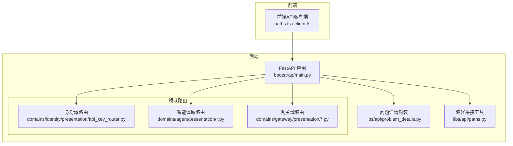
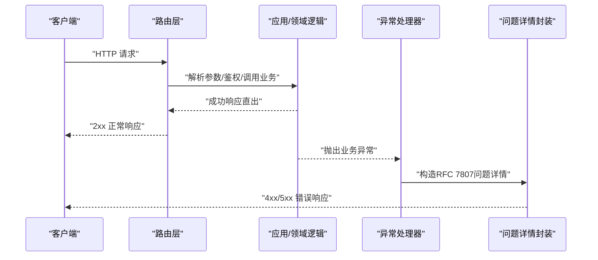
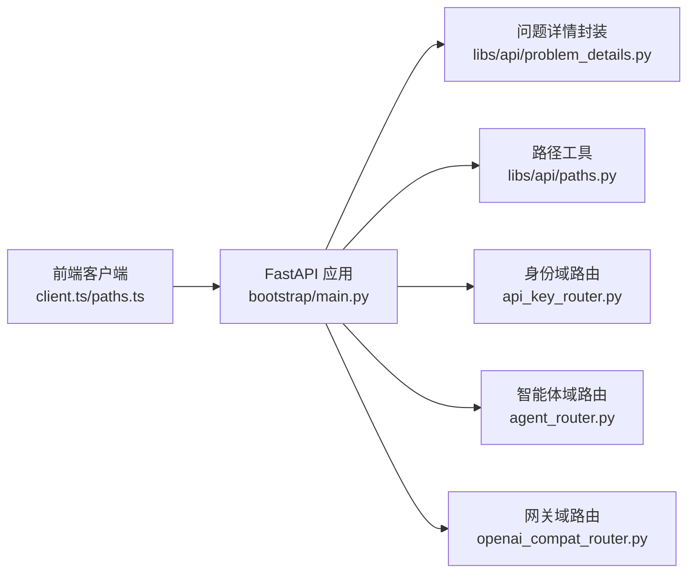

# REST API规范

<cite>
**本文引用的文件**
- [bootstrap/main.py](file://backend/bootstrap/main.py)
- [libs/api/problem_details.py](file://backend/libs/api/problem_details.py)
- [libs/api/paths.py](file://backend/libs/api/paths.py)
- [docs/API_RESPONSE.md](file://docs/API_RESPONSE.md)
- [docs/PAGINATION.md](file://docs/PAGINATION.md)
- [domains/identity/presentation/api_key_router.py](file://backend/domains/identity/presentation/api_key_router.py)
- [domains/agent/presentation/agent_router.py](file://backend/domains/agent/presentation/agent_router.py)
- [domains/agent/presentation/chat_router.py](file://backend/domains/agent/presentation/chat_router.py)
- [domains/agent/presentation/tools_router.py](file://backend/domains/agent/presentation/tools_router.py)
- [domains/agent/presentation/memory_router.py](file://backend/domains/agent/presentation/memory_router.py)
- [domains/agent/presentation/video_task_router.py](file://backend/domains/agent/presentation/video_task_router.py)
- [domains/gateway/presentation/openai_compat_router.py](file://backend/domains/gateway/presentation/openai_compat_router.py)
- [domains/gateway/application/budget_service.py](file://backend/domains/gateway/application/budget_service.py)
- [domains/gateway/infrastructure/redis_rate_limit_usage_reader.py](file://backend/domains/gateway/infrastructure/redis_rate_limit_usage_reader.py)
- [domains/gateway/domain/proxy_ratelimit_headers.py](file://backend/domains/gateway/domain/proxy_ratelimit_headers.py)
- [frontend/src/api/paths.ts](file://frontend/src/api/paths.ts)
- [frontend/src/api/client.ts](file://frontend/src/api/client.ts)
- [frontend/src/lib/pagination.ts](file://frontend/src/lib/pagination.ts)
- [tests/integration/mcp/test_llm_server_routes.py](file://backend/tests/integration/mcp/test_llm_server_routes.py)
- [tests/unit/bootstrap/test_api_paths.py](file://backend/tests/unit/bootstrap/test_api_paths.py)
</cite>

## 目录
1. [简介](#简介)
2. [项目结构](#项目结构)
3. [核心组件](#核心组件)
4. [架构总览](#架构总览)
5. [详细组件分析](#详细组件分析)
6. [依赖关系分析](#依赖关系分析)
7. [性能考量](#性能考量)
8. [故障排查指南](#故障排查指南)
9. [结论](#结论)
10. [附录](#附录)

## 简介
本规范面向AI Agent项目的REST API，覆盖管理面（/api/v1/*）与兼容面（/v1/*）两类接口，明确HTTP端点定义、URL模式设计原则、参数规范、请求/响应结构、状态码含义、版本控制与兼容策略、分页与过滤排序、限流策略、客户端实现与SDK使用要点，并提供错误处理模式与性能优化建议。

## 项目结构
- 后端采用FastAPI应用入口，集中注册异常处理器与中间件，统一错误响应遵循RFC 7807问题详情。
- 路由按领域划分（agent、gateway、identity、evaluation、studio等），管理面统一前缀/api/v1，兼容面（OpenAI/Anthropic）独立前缀。
- 前端通过路径常量与构建工具对ROOT_PATH与API_PREFIX进行对齐，确保跨环境一致性。

图表来源
- [bootstrap/main.py:181-232](file://backend/bootstrap/main.py#L181-L232)
- [libs/api/paths.py:19-35](file://backend/libs/api/paths.py#L19-L35)
- [libs/api/problem_details.py:169-201](file://backend/libs/api/problem_details.py#L169-L201)
- [domains/identity/presentation/api_key_router.py:86-94](file://backend/domains/identity/presentation/api_key_router.py#L86-L94)
- [domains/agent/presentation/agent_router.py:87-165](file://backend/domains/agent/presentation/agent_router.py#L87-L165)
- [domains/gateway/presentation/openai_compat_router.py:293-320](file://backend/domains/gateway/presentation/openai_compat_router.py#L293-L320)

章节来源
- [bootstrap/main.py:181-232](file://backend/bootstrap/main.py#L181-L232)
- [libs/api/paths.py:19-35](file://backend/libs/api/paths.py#L19-L35)
- [frontend/src/api/paths.ts:21-37](file://frontend/src/api/paths.ts#L21-L37)

## 核心组件
- 应用入口与异常处理
  - 全局异常处理器将业务异常映射为RFC 7807问题详情，422统一为请求验证错误。
  - 认证/授权/权限相关异常返回相应HTTP状态码，并在必要时设置WWW-Authenticate头。
- 路径与前缀
  - 通过ROOT_PATH与API_PREFIX组合形成统一前缀，兼容OpenAI/Anthropic兼容面。
- 管理面与兼容面
  - 管理面：/api/v1/*，统一遵循RFC 7807错误与直出响应。
  - 兼容面：/v1/*（OpenAI/Anthropic协议例外），保持上游协议错误体。

章节来源
- [bootstrap/main.py:227-310](file://backend/bootstrap/main.py#L227-L310)
- [libs/api/problem_details.py:169-201](file://backend/libs/api/problem_details.py#L169-L201)
- [libs/api/paths.py:19-44](file://backend/libs/api/paths.py#L19-L44)
- [docs/API_RESPONSE.md:128-142](file://docs/API_RESPONSE.md#L128-L142)

## 架构总览
下图展示从客户端到后端路由、异常处理与问题详情封装的整体流程。

图表来源
- [bootstrap/main.py:227-310](file://backend/bootstrap/main.py#L227-L310)
- [libs/api/problem_details.py:169-201](file://backend/libs/api/problem_details.py#L169-L201)

## 详细组件分析

### URL模式与路径参数、查询参数规范
- 前缀与拼接
  - 管理面统一前缀：ROOT_PATH + API_PREFIX（默认/ai-agent/api/v1）
  - 兼容面：OpenAI含/v1尾段，Anthropic不含
  - 路径工具提供service_path与api_v1_path，自动规范化重复斜杠与空段
- 路由定义示例
  - 身份域API Key列表：支持include_expired/include_revoked、分页skip/limit
  - 智能体域CRUD：GET/POST/GET(PK)/PUT(PK)/DELETE(PK)
  - 聊天、工具、记忆、视频任务等均有标准REST风格端点
- 查询参数约束
  - skip>=0，limit范围[1,100]，422时返回RFC 7807字段级错误

章节来源
- [libs/api/paths.py:19-44](file://backend/libs/api/paths.py#L19-L44)
- [frontend/src/api/paths.ts:21-37](file://frontend/src/api/paths.ts#L21-L37)
- [domains/identity/presentation/api_key_router.py:86-94](file://backend/domains/identity/presentation/api_key_router.py#L86-L94)
- [domains/agent/presentation/agent_router.py:87-165](file://backend/domains/agent/presentation/agent_router.py#L87-L165)
- [tests/unit/bootstrap/test_api_paths.py:24-68](file://backend/tests/unit/bootstrap/test_api_paths.py#L24-L68)

### 请求体与响应结构
- 成功响应
  - 2xx直出Pydantic响应模型，不包裹{code,message,data}
  - 列表端点使用分页Envelope（见分页章节）
- 错误响应
  - 4xx/5xx遵循RFC 7807问题详情，包含title、detail、code、扩展字段与字段级errors
  - 422字段校验错误保留loc/msg/type
- 协议例外
  - OpenAI/Anthropic兼容面保持其原生错误体，不走RFC 7807

章节来源
- [docs/API_RESPONSE.md:20-41](file://docs/API_RESPONSE.md#L20-L41)
- [docs/API_RESPONSE.md:44-96](file://docs/API_RESPONSE.md#L44-L96)
- [docs/API_RESPONSE.md:128-142](file://docs/API_RESPONSE.md#L128-L142)
- [bootstrap/main.py:235-260](file://backend/bootstrap/main.py#L235-L260)

### HTTP端点定义与使用场景
- 身份域（API Key）
  - GET /api/v1/api-keys/scopes/list：列出可用作用域
  - GET /api/v1/api-keys/scopes/groups：列出预设作用域分组
  - GET /api/v1/api-keys：分页列出API Key，支持include_expired/include_revoked
- 智能体域
  - GET /api/v1/agents：分页列出智能体
  - POST /api/v1/agents：创建智能体
  - GET /api/v1/agents/{agent_id}：获取指定智能体
  - PUT /api/v1/agents/{agent_id}：更新智能体
  - DELETE /api/v1/agents/{agent_id}：删除智能体
- 聊天、工具、记忆、视频任务等端点遵循相同REST风格，具体参数与响应模型以各路由文件为准

章节来源
- [domains/identity/presentation/api_key_router.py:61-94](file://backend/domains/identity/presentation/api_key_router.py#L61-L94)
- [domains/agent/presentation/agent_router.py:87-165](file://backend/domains/agent/presentation/agent_router.py#L87-L165)

### 分页机制、过滤与排序
- 分页Envelope
  - items、total、page、page_size、has_next、has_prev
- 过滤与排序
  - 业务过滤与排序在应用层完成，presentation负责解析page/page_size并返回Envelope
  - 支持“SQL分页”与“内存分页”两种路径，前者优先
- 前端行为
  - 筛选变化时自动回到第1页，批量拉取全量数据时按页累加直至has_next=false

章节来源
- [docs/PAGINATION.md:103-141](file://docs/PAGINATION.md#L103-L141)
- [frontend/src/lib/pagination.ts:47-78](file://frontend/src/lib/pagination.ts#L47-L78)

### 错误处理模式
- 异常映射
  - 业务异常统一转换为问题详情；422统一为请求验证错误；404/403/401分别对应NotFound/PermissionDenied/Authentication/Token错误
- 头信息
  - 401/403场景设置WWW-Authenticate头
- 前端解析
  - 2xx直出解析；4xx解析问题详情并构造ApiError

章节来源
- [bootstrap/main.py:227-310](file://backend/bootstrap/main.py#L227-L310)
- [frontend/src/api/client.ts:195-232](file://frontend/src/api/client.ts#L195-L232)

### API版本控制与向后兼容
- 版本策略
  - 管理面统一使用/api/v1作为版本前缀，兼容面使用/v1
  - 路径工具与前端常量确保ROOT_PATH与API_PREFIX对齐，便于多版本共存
- 兼容性保障
  - 新增错误码需在异常库登记并在路由层映射
  - 协议例外端点保持上游协议错误体，不影响管理面一致性

章节来源
- [libs/api/paths.py:19-44](file://backend/libs/api/paths.py#L19-L44)
- [frontend/src/api/paths.ts:21-37](file://frontend/src/api/paths.ts#L21-L37)
- [docs/API_RESPONSE.md:108-125](file://docs/API_RESPONSE.md#L108-L125)

### 限流策略与性能优化
- 限流实现
  - 60秒滚动窗口（Redis Sorted Set）：rpm（每分钟请求数）、tpm（每分钟令牌数）
  - 用量读取与窗口清理在应用层执行，失败抛出RateLimitExceededError
- 限流头
  - 代理响应头包含rpm/tpm限制与剩余值，遵循OpenAI/Anthropic限流头格式契约
- 性能建议
  - 优先使用SQL分页；合理设置page_size；缓存热点数据；避免在应用层直接执行列表SQL

章节来源
- [domains/gateway/application/budget_service.py:173-204](file://backend/domains/gateway/application/budget_service.py#L173-L204)
- [domains/gateway/infrastructure/redis_rate_limit_usage_reader.py:20-39](file://backend/domains/gateway/infrastructure/redis_rate_limit_usage_reader.py#L20-L39)
- [domains/gateway/domain/proxy_ratelimit_headers.py:16-42](file://backend/domains/gateway/domain/proxy_ratelimit_headers.py#L16-L42)
- [docs/PAGINATION.md:110-114](file://docs/PAGINATION.md#L110-L114)

### 客户端实现指南与SDK使用
- 前端路径对齐
  - 使用API_V1、GATEWAY_OPENAI_V1_BASE、GATEWAY_ANTHROPIC_BASE等常量，自动适配ROOT_PATH
- 查询参数
  - 自动序列化数组与undefined值；支持skip/limit等分页参数
- SSE与HTTP端点认证
  - LLM Server相关端点需要API Key认证，未认证将返回401/403/422等

章节来源
- [frontend/src/api/paths.ts:21-37](file://frontend/src/api/paths.ts#L21-L37)
- [frontend/src/api/client.ts:218-232](file://frontend/src/api/client.ts#L218-L232)
- [tests/integration/mcp/test_llm_server_routes.py:24-37](file://backend/tests/integration/mcp/test_llm_server_routes.py#L24-L37)

## 依赖关系分析

图表来源
- [bootstrap/main.py:181-232](file://backend/bootstrap/main.py#L181-L232)
- [libs/api/problem_details.py:169-201](file://backend/libs/api/problem_details.py#L169-L201)
- [libs/api/paths.py:19-44](file://backend/libs/api/paths.py#L19-L44)
- [domains/identity/presentation/api_key_router.py:86-94](file://backend/domains/identity/presentation/api_key_router.py#L86-L94)
- [domains/agent/presentation/agent_router.py:87-165](file://backend/domains/agent/presentation/agent_router.py#L87-L165)
- [domains/gateway/presentation/openai_compat_router.py:293-320](file://backend/domains/gateway/presentation/openai_compat_router.py#L293-L320)

章节来源
- [bootstrap/main.py:181-232](file://backend/bootstrap/main.py#L181-L232)
- [libs/api/paths.py:19-44](file://backend/libs/api/paths.py#L19-L44)

## 性能考量
- 列表查询优先使用SQL分页，避免一次性加载全量数据
- 控制page_size上限，结合has_next循环拉取
- 对热点端点进行缓存与索引优化
- 限流窗口清理与用量统计使用Redis，避免阻塞主流程

## 故障排查指南
- 401/403/404常见原因
  - 未携带有效API Key；权限不足；资源不存在
- 422字段校验
  - 检查请求体字段类型与范围；关注errors中的loc与type定位问题
- 兼容面错误
  - OpenAI/Anthropic兼容端点返回其原生错误体，注意解析差异

章节来源
- [bootstrap/main.py:227-310](file://backend/bootstrap/main.py#L227-L310)
- [docs/API_RESPONSE.md:93-96](file://docs/API_RESPONSE.md#L93-L96)

## 结论
本规范统一了AI Agent项目的REST API设计与实现，明确了管理面与兼容面的差异、分页与过滤排序、限流与性能优化、错误处理与客户端对接方式。遵循此规范可确保接口一致性、可维护性与可扩展性。

## 附录

### 端点一览（示例）
- 身份域
  - GET /api/v1/api-keys/scopes/list
  - GET /api/v1/api-keys/scopes/groups
  - GET /api/v1/api-keys?include_expired={bool}&include_revoked={bool}&skip={int}&limit={int}
- 智能体域
  - GET /api/v1/agents
  - POST /api/v1/agents
  - GET /api/v1/agents/{agent_id}
  - PUT /api/v1/agents/{agent_id}
  - DELETE /api/v1/agents/{agent_id}

章节来源
- [domains/identity/presentation/api_key_router.py:61-94](file://backend/domains/identity/presentation/api_key_router.py#L61-L94)
- [domains/agent/presentation/agent_router.py:87-165](file://backend/domains/agent/presentation/agent_router.py#L87-L165)