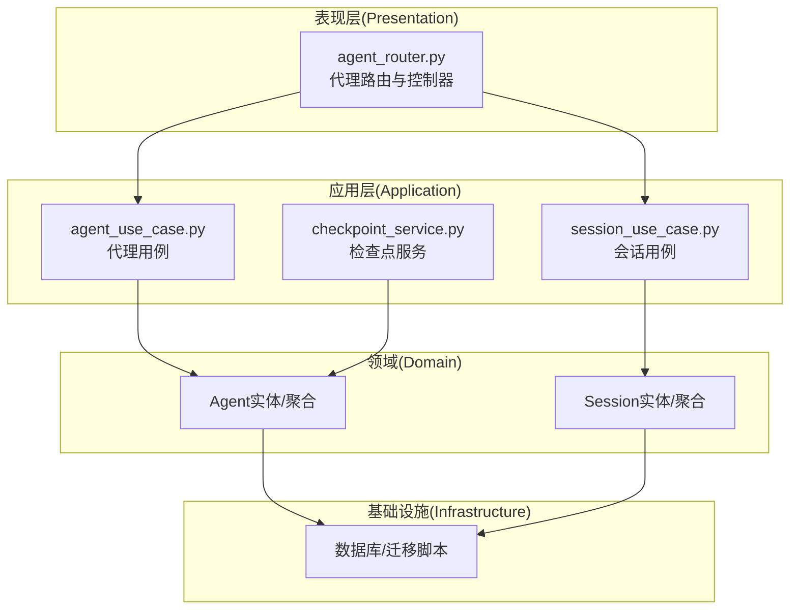
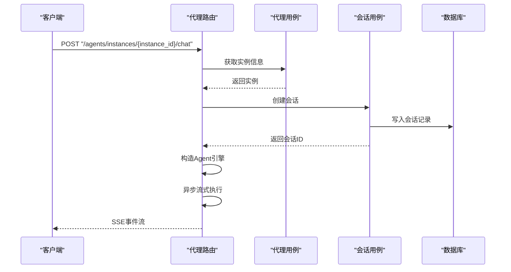
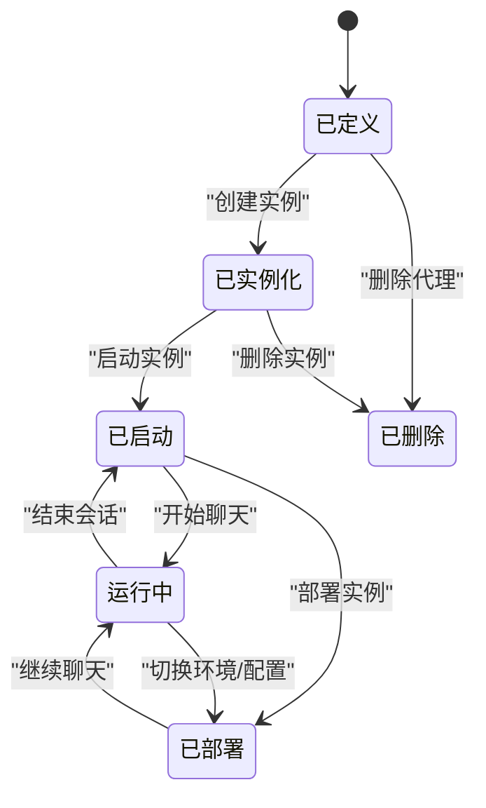

# 代理API

<cite>
**本文引用的文件**
- [backend/domains/agent/presentation/agent_router.py](file://backend/domains/agent/presentation/agent_router.py)
- [backend/docs/AGENT_ARCHITECTURE_DESIGN.md](file://backend/docs/AGENT_ARCHITECTURE_DESIGN.md)
- [backend/bootstrap/main.py](file://backend/bootstrap/main.py)
- [backend/domains/agent/application/agent_use_case.py](file://backend/domains/agent/application/agent_use_case.py)
- [backend/domains/agent/application/checkpoint_service.py](file://backend/domains/agent/application/checkpoint_service.py)
- [backend/domains/session/application/session_use_case.py](file://backend/domains/session/application/session_use_case.py)
- [backend/alembic/versions/009_add_agent_config_columns.py](file://backend/alembic/versions/009_add_agent_config_columns.py)
- [backend/alembic/versions/20260202_agents_tools_jsonb_to_array.py](file://backend/alembic/versions/20260202_agents_tools_jsonb_to_array.py)
- [backend/alembic/versions/20260523_sessions_agents_tenant_id.py](file://backend/alembic/versions/20260523_sessions_agents_tenant_id.py)
- [backend/alembic/versions/20260524_drop_agents_user_id.py](file://backend/alembic/versions/20260524_drop_agents_user_id.py)
- [backend/alembic/versions/20260123_212703_add_config_column_to_sessions.py](file://backend/alembic/versions/20260123_212703_add_config_column_to_sessions.py)
- [backend/alembic/versions/20260525_drop_sessions_owner_columns.py](file://backend/alembic/versions/20260525_drop_sessions_owner_columns.py)
</cite>

## 目录
1. [简介](#简介)
2. [项目结构](#项目结构)
3. [核心组件](#核心组件)
4. [架构总览](#架构总览)
5. [详细组件分析](#详细组件分析)
6. [依赖关系分析](#依赖关系分析)
7. [性能考虑](#性能考虑)
8. [故障排查指南](#故障排查指南)
9. [结论](#结论)
10. [附录](#附录)

## 简介
本文件为AI Agent项目的代理API详细REST API文档，覆盖代理的创建、更新、删除、查询等核心操作；代理配置参数、工具绑定、会话管理、状态管理、检查点恢复与内存管理等能力的API接口；以及分页、过滤与排序的使用说明。文档同时解释代理生命周期管理与错误处理机制，并提供完整的代码示例路径，帮助开发者快速集成与扩展。

## 项目结构
后端采用领域驱动设计（DDD）分层组织，代理API位于“代理域”的表现层（presentation），应用层（application）负责业务用例与服务编排，基础设施层负责数据库与外部集成。会话管理与检查点恢复分别由会话域与检查点服务支撑。



图表来源
- [backend/domains/agent/presentation/agent_router.py](file://backend/domains/agent/presentation/agent_router.py)
- [backend/domains/agent/application/agent_use_case.py](file://backend/domains/agent/application/agent_use_case.py)
- [backend/domains/agent/application/checkpoint_service.py](file://backend/domains/agent/application/checkpoint_service.py)
- [backend/domains/session/application/session_use_case.py](file://backend/domains/session/application/session_use_case.py)

章节来源
- [backend/domains/agent/presentation/agent_router.py](file://backend/domains/agent/presentation/agent_router.py)
- [backend/docs/AGENT_ARCHITECTURE_DESIGN.md](file://backend/docs/AGENT_ARCHITECTURE_DESIGN.md)

## 核心组件
- 代理路由与控制器：提供代理的CRUD与执行入口，包括定义、实例、部署与聊天接口。
- 代理用例：封装代理的业务逻辑，如创建、更新、删除、查询与配置变更。
- 会话用例：负责会话创建、上下文维护与状态管理。
- 检查点服务：支持代理状态的持久化与恢复，实现断点续跑与回放。
- 数据库与迁移：通过Alembic版本化管理代理与会话表结构演进。

章节来源
- [backend/domains/agent/presentation/agent_router.py](file://backend/domains/agent/presentation/agent_router.py)
- [backend/domains/agent/application/agent_use_case.py](file://backend/domains/agent/application/agent_use_case.py)
- [backend/domains/agent/application/checkpoint_service.py](file://backend/domains/agent/application/checkpoint_service.py)
- [backend/domains/session/application/session_use_case.py](file://backend/domains/session/application/session_use_case.py)

## 架构总览
代理API遵循REST风格，结合FastAPI的类型安全与异步特性，提供如下关键流程：
- 代理定义与实例化：先创建代理定义，再基于定义创建可运行实例。
- 会话驱动执行：每次与实例交互时创建会话，承载用户输入、模型输出与中间状态。
- 流式响应：聊天接口以SSE返回事件流，便于前端实时渲染。
- 部署与发布：实例可按需部署到目标环境，支持多环境配置覆盖。



图表来源
- [backend/docs/AGENT_ARCHITECTURE_DESIGN.md](file://backend/docs/AGENT_ARCHITECTURE_DESIGN.md)

## 详细组件分析

### 代理路由与端点
- GET /agents/{agent_id}：获取代理详情（含名称、描述、系统提示、模型、工具列表、温度、最大令牌数、最大迭代次数等）。
- PUT /agents/{agent_id}：更新代理（允许修改名称、描述、系统提示、模型、工具、温度、最大令牌数、最大迭代次数等）。
- DELETE /agents/{agent_id}：删除代理。
- GET /agents/definitions/{agent_id}：获取代理定义。
- POST /agents/definitions：创建代理定义。
- POST /agents/instances：从定义创建实例（支持命名、环境与配置覆盖）。
- POST /agents/instances/{instance_id}/start：启动实例。
- POST /agents/instances/{instance_id}/chat：与实例进行对话（SSE流式响应）。
- POST /agents/instances/{instance_id}/deploy：部署实例（支持部署类型与环境）。

章节来源
- [backend/domains/agent/presentation/agent_router.py](file://backend/domains/agent/presentation/agent_router.py)
- [backend/docs/AGENT_ARCHITECTURE_DESIGN.md](file://backend/docs/AGENT_ARCHITECTURE_DESIGN.md)

### 代理配置参数
- 基础信息：名称、描述、是否公开。
- 行为参数：系统提示、模型、温度、最大令牌数、最大迭代次数。
- 工具绑定：工具数组，支持动态启用/禁用与参数覆盖。
- 环境与配置覆盖：实例创建时可指定环境与配置覆盖，用于差异化部署。

章节来源
- [backend/domains/agent/presentation/agent_router.py](file://backend/domains/agent/presentation/agent_router.py)
- [backend/alembic/versions/009_add_agent_config_columns.py](file://backend/alembic/versions/009_add_agent_config_columns.py)
- [backend/alembic/versions/20260202_agents_tools_jsonb_to_array.py](file://backend/alembic/versions/20260202_agents_tools_jsonb_to_array.py)

### 会话管理
- 会话创建：每次聊天前由会话用例创建会话，写入数据库并返回会话ID。
- 上下文与状态：会话记录包含状态与上下文，支持后续恢复与继续。
- 配置字段：会话表新增配置列，便于存储运行期配置或检查点元数据。
- 租户隔离：会话与代理均关联租户ID，确保资源访问控制。

章节来源
- [backend/domains/session/application/session_use_case.py](file://backend/domains/session/application/session_use_case.py)
- [backend/alembic/versions/20260123_212703_add_config_column_to_sessions.py](file://backend/alembic/versions/20260123_212703_add_config_column_to_sessions.py)
- [backend/alembic/versions/20260523_sessions_agents_tenant_id.py](file://backend/alembic/versions/20260523_sessions_agents_tenant_id.py)
- [backend/alembic/versions/20260525_drop_sessions_owner_columns.py](file://backend/alembic/versions/20260525_drop_sessions_owner_columns.py)

### 状态管理与检查点恢复
- 检查点服务：负责代理状态的持久化与恢复，支持断点续跑与历史回放。
- 恢复策略：根据会话ID与检查点元数据重建运行时状态，保证一致性。
- 性能优化：通过增量保存与缓存策略降低I/O开销。

章节来源
- [backend/domains/agent/application/checkpoint_service.py](file://backend/domains/agent/application/checkpoint_service.py)

### 代理生命周期管理
- 定义阶段：创建代理定义，完成基础配置与工具绑定。
- 实例阶段：从定义创建实例，支持命名、环境与配置覆盖。
- 启动阶段：启动实例，准备接收请求。
- 运行阶段：通过聊天接口进行对话，期间创建会话并流式返回结果。
- 部署阶段：将实例部署到目标环境，支持多环境配置覆盖。
- 清理阶段：删除代理或实例，释放资源。



图表来源
- [backend/docs/AGENT_ARCHITECTURE_DESIGN.md](file://backend/docs/AGENT_ARCHITECTURE_DESIGN.md)

### 错误处理机制
- 请求验证错误：统一映射为RFC 7807问题详情格式，返回400。
- 领域错误：捕获可映射的领域异常，返回对应HTTP状态码与问题详情。
- 未找到资源：返回404并记录日志。
- 全局异常处理器：在应用启动时注册，确保异常被一致处理。

章节来源
- [backend/bootstrap/main.py](file://backend/bootstrap/main.py)

### 分页、过滤与排序
- 列表查询：建议在代理与会话列表接口中支持分页（页码/大小）、过滤（按租户、名称、状态）与排序（按创建时间、名称）。
- 实现建议：在应用层用例中解析查询参数，转换为SQL条件与排序子句，避免一次性加载全量数据。
- 注意事项：对高基数字段建立索引，提升过滤与排序性能。

（本节为通用实践说明，不直接分析具体文件）

## 依赖关系分析
- 路由依赖用例：代理路由调用代理用例与会话用例，实现业务编排。
- 用例依赖领域：代理用例与会话用例依赖代理与会话实体，确保业务规则正确执行。
- 检查点服务：独立于路由与用例，提供状态持久化能力，减少耦合。
- 数据库迁移：通过版本化脚本演进表结构，保障代理与会话字段的兼容性。

```mermaid
graph LR
R["代理路由"] --> UC["代理用例"]
R --> SU["会话用例"]
UC --> AD["代理实体"]
SU --> SD["会话实体"]
CS["检查点服务"] --> AD
DB["数据库"] <- --> AD
DB <- --> SD
```

图表来源
- [backend/domains/agent/presentation/agent_router.py](file://backend/domains/agent/presentation/agent_router.py)
- [backend/domains/agent/application/agent_use_case.py](file://backend/domains/agent/application/agent_use_case.py)
- [backend/domains/agent/application/checkpoint_service.py](file://backend/domains/agent/application/checkpoint_service.py)
- [backend/domains/session/application/session_use_case.py](file://backend/domains/session/application/session_use_case.py)

章节来源
- [backend/domains/agent/presentation/agent_router.py](file://backend/domains/agent/presentation/agent_router.py)
- [backend/domains/agent/application/agent_use_case.py](file://backend/domains/agent/application/agent_use_case.py)
- [backend/domains/agent/application/checkpoint_service.py](file://backend/domains/agent/application/checkpoint_service.py)
- [backend/domains/session/application/session_use_case.py](file://backend/domains/session/application/session_use_case.py)

## 性能考虑
- 异步与流式：聊天接口采用异步与SSE，降低前端等待时间，提升用户体验。
- 检查点缓存：检查点服务应结合内存缓存与批量写入，减少数据库压力。
- 查询优化：对常用过滤字段（租户ID、状态、创建时间）建立索引，避免全表扫描。
- 并发控制：在高并发场景下限制单实例的并发会话数量，防止资源争用。

（本节为通用指导，不直接分析具体文件）

## 故障排查指南
- 400请求验证错误：检查请求体字段类型与必填项，参考全局异常处理器的日志。
- 404未找到资源：确认资源ID是否存在，检查租户访问权限。
- 422语义错误：关注领域错误映射，定位业务规则触发点。
- 日志定位：通过全局异常处理器记录的警告与错误日志，快速定位问题根因。

章节来源
- [backend/bootstrap/main.py](file://backend/bootstrap/main.py)

## 结论
本代理API文档系统性地梳理了代理的定义、实例化、运行、部署与清理全生命周期，明确了配置参数、工具绑定、会话管理、检查点恢复与错误处理机制。配合分页、过滤与排序的实践建议，可满足生产级的可扩展性与可维护性要求。建议在实际接入时，优先参考本文提供的端点清单与示例路径，逐步完善前端集成与监控告警体系。

## 附录

### API端点一览与请求/响应要点
- GET /agents/{agent_id}
  - 功能：获取代理详情
  - 响应：包含名称、描述、系统提示、模型、工具列表、温度、最大令牌数、最大迭代次数等
  - 示例路径：[backend/domains/agent/presentation/agent_router.py](file://backend/domains/agent/presentation/agent_router.py)
- PUT /agents/{agent_id}
  - 功能：更新代理
  - 请求：允许修改名称、描述、系统提示、模型、工具、温度、最大令牌数、最大迭代次数等
  - 示例路径：[backend/domains/agent/presentation/agent_router.py](file://backend/domains/agent/presentation/agent_router.py)
- DELETE /agents/{agent_id}
  - 功能：删除代理
  - 示例路径：[backend/domains/agent/presentation/agent_router.py](file://backend/domains/agent/presentation/agent_router.py)
- GET /agents/definitions/{agent_id}
  - 功能：获取代理定义
  - 示例路径：[backend/docs/AGENT_ARCHITECTURE_DESIGN.md](file://backend/docs/AGENT_ARCHITECTURE_DESIGN.md)
- POST /agents/definitions
  - 功能：创建代理定义
  - 示例路径：[backend/docs/AGENT_ARCHITECTURE_DESIGN.md](file://backend/docs/AGENT_ARCHITECTURE_DESIGN.md)
- POST /agents/instances
  - 功能：从定义创建实例（支持命名、环境与配置覆盖）
  - 示例路径：[backend/docs/AGENT_ARCHITECTURE_DESIGN.md](file://backend/docs/AGENT_ARCHITECTURE_DESIGN.md)
- POST /agents/instances/{instance_id}/start
  - 功能：启动实例
  - 示例路径：[backend/docs/AGENT_ARCHITECTURE_DESIGN.md](file://backend/docs/AGENT_ARCHITECTURE_DESIGN.md)
- POST /agents/instances/{instance_id}/chat
  - 功能：与实例对话（SSE流式响应）
  - 示例路径：[backend/docs/AGENT_ARCHITECTURE_DESIGN.md](file://backend/docs/AGENT_ARCHITECTURE_DESIGN.md)
- POST /agents/instances/{instance_id}/deploy
  - 功能：部署实例（支持部署类型与环境）
  - 示例路径：[backend/docs/AGENT_ARCHITECTURE_DESIGN.md](file://backend/docs/AGENT_ARCHITECTURE_DESIGN.md)

### 数据模型与字段演进
- 代理配置列：新增代理配置相关列，支持更灵活的配置管理。
- 工具字段数组化：工具字段从JSONB改为数组，便于查询与排序。
- 会话配置列：会话表新增配置列，便于存储运行期配置或检查点元数据。
- 租户字段：会话与代理均关联租户ID，确保资源隔离。
- 用户字段移除：移除代理与会话中的用户ID字段，统一通过租户与权限控制。

章节来源
- [backend/alembic/versions/009_add_agent_config_columns.py](file://backend/alembic/versions/009_add_agent_config_columns.py)
- [backend/alembic/versions/20260202_agents_tools_jsonb_to_array.py](file://backend/alembic/versions/20260202_agents_tools_jsonb_to_array.py)
- [backend/alembic/versions/20260123_212703_add_config_column_to_sessions.py](file://backend/alembic/versions/20260123_212703_add_config_column_to_sessions.py)
- [backend/alembic/versions/20260523_sessions_agents_tenant_id.py](file://backend/alembic/versions/20260523_sessions_agents_tenant_id.py)
- [backend/alembic/versions/20260524_drop_agents_user_id.py](file://backend/alembic/versions/20260524_drop_agents_user_id.py)
- [backend/alembic/versions/20260525_drop_sessions_owner_columns.py](file://backend/alembic/versions/20260525_drop_sessions_owner_columns.py)