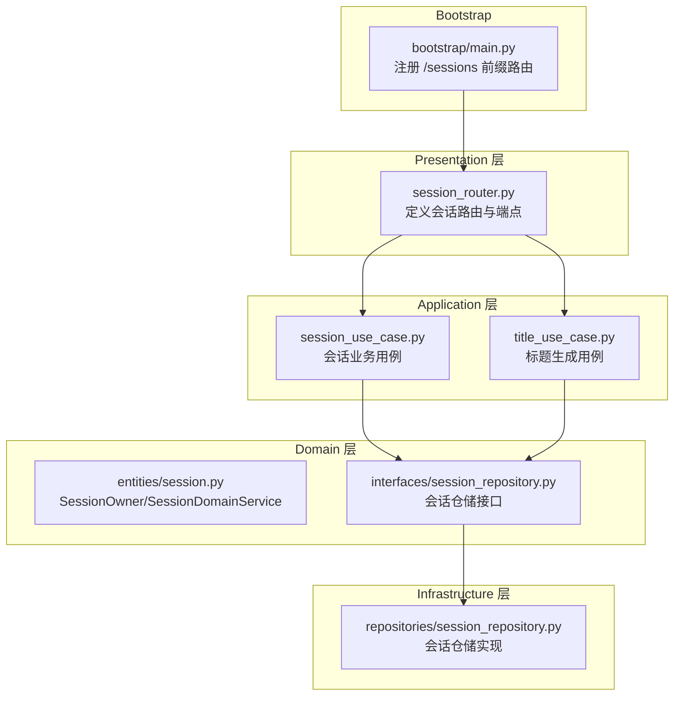
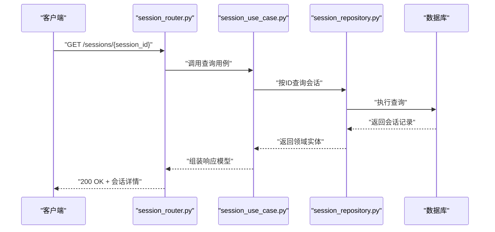
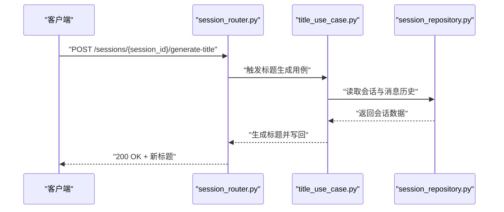
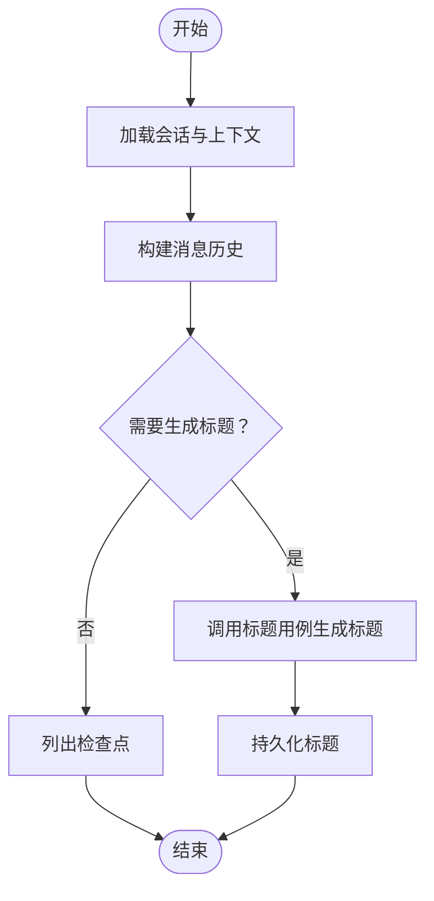
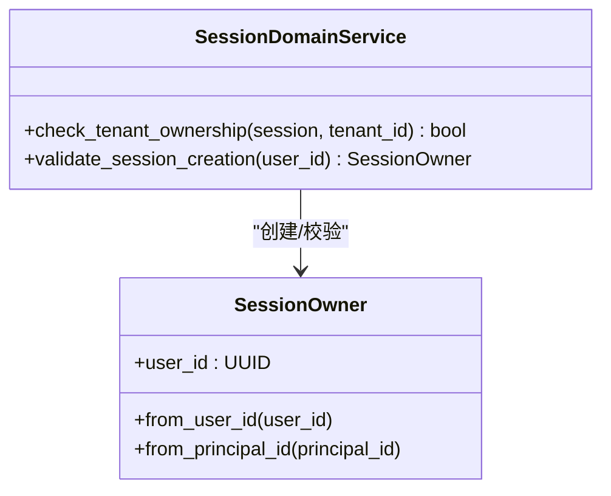
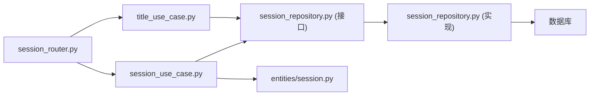

# 会话API

<cite>
**本文引用的文件**
- [bootstrap/main.py](file://backend/bootstrap/main.py)
- [domains/session/presentation/session_router.py](file://backend/domains/session/presentation/session_router.py)
- [domains/session/application/session_use_case.py](file://backend/domains/session/application/session_use_case.py)
- [domains/session/application/title_use_case.py](file://backend/domains/session/application/title_use_case.py)
- [domains/session/domain/entities/session.py](file://backend/domains/session/domain/entities/session.py)
- [domains/session/domain/interfaces/session_repository.py](file://backend/domains/session/domain/interfaces/session_repository.py)
- [domains/session/infrastructure/repositories/session_repository.py](file://backend/domains/session/infrastructure/repositories/session_repository.py)
- [domains/agent/presentation/chat_router.py](file://backend/domains/agent/presentation/chat_router.py)
- [docs/CODE_STANDARDS.md](file://backend/docs/CODE_STANDARDS.md)
- [docs/PAGINATION.md](file://backend/docs/PAGINATION.md)
- [docs/API_RESPONSE.md](file://backend/docs/API_RESPONSE.md)
- [docs/项目权限规则.md](file://backend/docs/项目权限规则.md)
- [alembic/versions/005_add_session_status_and_context.py](file://backend/alembic/versions/005_add_session_status_and_context.py)
- [alembic/versions/20260123_212703_add_config_column_to_sessions.py](file://backend/alembic/versions/20260123_212703_add_config_column_to_sessions.py)
- [alembic/versions/20260205_add_session_video_task_count.py](file://backend/alembic/versions/20260205_add_session_video_task_count.py)
- [alembic/versions/20260523_sessions_agents_tenant_id.py](file://backend/alembic/versions/20260523_sessions_agents_tenant_id.py)
- [alembic/versions/20260525_drop_sessions_owner_columns.py](file://backend/alembic/versions/20260525_drop_sessions_owner_columns.py)
</cite>

## 目录
1. [简介](#简介)
2. [项目结构](#项目结构)
3. [核心组件](#核心组件)
4. [架构总览](#架构总览)
5. [详细组件分析](#详细组件分析)
6. [依赖关系分析](#依赖关系分析)
7. [性能考虑](#性能考虑)
8. [故障排查指南](#故障排查指南)
9. [结论](#结论)
10. [附录](#附录)

## 简介
本文件为AI Agent项目的会话API完整REST API文档，覆盖会话创建、查询、删除、标题生成与管理、消息历史与检查点、会话状态管理、权限控制与共享、归档与列表检索、分页与过滤、生命周期与持久化策略等。本文以代码库实际实现为依据，结合领域驱动设计（DDD）分层结构，提供面向开发与运维的权威参考。

## 项目结构
会话API位于后端域层的session模块，采用FastAPI路由组织，通过use case协调应用层与基础设施仓储，遵循DDD分层：presentation（路由）、application（用例）、domain（实体/接口）、infrastructure（仓储/模型）。

图表来源
- [bootstrap/main.py:400](file://backend/bootstrap/main.py#L400)
- [domains/session/presentation/session_router.py:233](file://backend/domains/session/presentation/session_router.py#L233)
- [domains/session/application/session_use_case.py](file://backend/domains/session/application/session_use_case.py)
- [domains/session/application/title_use_case.py](file://backend/domains/session/application/title_use_case.py)
- [domains/session/domain/entities/session.py:18](file://backend/domains/session/domain/entities/session.py#L18)
- [domains/session/domain/interfaces/session_repository.py](file://backend/domains/session/domain/interfaces/session_repository.py)
- [domains/session/infrastructure/repositories/session_repository.py](file://backend/domains/session/infrastructure/repositories/session_repository.py)
- [backend/docs/CODE_STANDARDS.md:334](file://backend/docs/CODE_STANDARDS.md#L334)

章节来源
- [bootstrap/main.py:400](file://backend/bootstrap/main.py#L400)
- [domains/session/presentation/session_router.py:233](file://backend/domains/session/presentation/session_router.py#L233)
- [backend/docs/CODE_STANDARDS.md:334](file://backend/docs/CODE_STANDARDS.md#L334)

## 核心组件
- 路由与端点：会话路由在主应用中注册，前缀为/sessions，包含会话CRUD、标题生成、检查点查询等端点。
- 用例层：会话用例负责业务编排；标题用例负责自动生成标题。
- 领域层：会话实体与服务封装所有权、租户校验、创建参数校验等。
- 仓储层：抽象仓储接口与具体实现，承载持久化细节。
- 权限与共享：通过SessionOwner与租户字段实现权限控制与共享范围判定。

章节来源
- [domains/session/presentation/session_router.py:233](file://backend/domains/session/presentation/session_router.py#L233)
- [domains/session/application/session_use_case.py](file://backend/domains/session/application/session_use_case.py)
- [domains/session/application/title_use_case.py](file://backend/domains/session/application/title_use_case.py)
- [domains/session/domain/entities/session.py:18](file://backend/domains/session/domain/entities/session.py#L18)
- [domains/session/domain/interfaces/session_repository.py](file://backend/domains/session/domain/interfaces/session_repository.py)
- [domains/session/infrastructure/repositories/session_repository.py](file://backend/domains/session/infrastructure/repositories/session_repository.py)

## 架构总览
会话API遵循DDD分层，请求经由presentation层路由到application层用例，再通过仓储接口访问基础设施实现，最终完成数据库操作与响应返回。

图表来源
- [domains/session/presentation/session_router.py:233](file://backend/domains/session/presentation/session_router.py#L233)
- [domains/session/application/session_use_case.py](file://backend/domains/session/application/session_use_case.py)
- [domains/session/infrastructure/repositories/session_repository.py](file://backend/domains/session/infrastructure/repositories/session_repository.py)

## 详细组件分析

### 1) 会话端点与流程
- GET /sessions/{session_id}：查询指定会话详情（含状态、上下文、配置等）。
- PATCH /sessions/{session_id}：更新会话元信息（如标签、归档标记、配置等）。
- POST /sessions/{session_id}/generate-title：基于消息历史生成标题。
- GET /checkpoints/{session_id}：获取会话检查点列表（用于恢复/回放）。

图表来源
- [domains/session/presentation/session_router.py:288](file://backend/domains/session/presentation/session_router.py#L288)
- [domains/session/application/title_use_case.py](file://backend/domains/session/application/title_use_case.py)
- [domains/agent/presentation/chat_router.py:329](file://backend/domains/agent/presentation/chat_router.py#L329)

章节来源
- [domains/session/presentation/session_router.py:233](file://backend/domains/session/presentation/session_router.py#L233)
- [domains/session/presentation/session_router.py:249](file://backend/domains/session/presentation/session_router.py#L249)
- [domains/session/presentation/session_router.py:288](file://backend/domains/session/presentation/session_router.py#L288)
- [domains/agent/presentation/chat_router.py:329](file://backend/domains/agent/presentation/chat_router.py#L329)

### 2) 会话状态管理与消息历史
- 状态字段：会话具备状态字段，支持运行中、暂停、归档等状态流转。
- 上下文与配置：会话表包含上下文与配置列，用于保存对话上下文与运行配置。
- 消息历史：消息表与会话关联，支持历史查询与检查点恢复。
- 检查点：提供检查点列表端点，便于断点续跑与调试。

图表来源
- [alembic/versions/005_add_session_status_and_context.py](file://backend/alembic/versions/005_add_session_status_and_context.py)
- [alembic/versions/20260123_212703_add_config_column_to_sessions.py](file://backend/alembic/versions/20260123_212703_add_config_column_to_sessions.py)
- [domains/agent/presentation/chat_router.py:329](file://backend/domains/agent/presentation/chat_router.py#L329)

章节来源
- [alembic/versions/005_add_session_status_and_context.py](file://backend/alembic/versions/005_add_session_status_and_context.py)
- [alembic/versions/20260123_212703_add_config_column_to_sessions.py](file://backend/alembic/versions/20260123_212703_add_config_column_to_sessions.py)
- [domains/agent/presentation/chat_router.py:329](file://backend/domains/agent/presentation/chat_router.py#L329)

### 3) 权限控制与共享机制
- 所有者与租户：会话实体包含租户ID，用例通过领域服务校验租户归属。
- 用户所有者：通过SessionOwner值对象绑定用户ID，确保创建与操作权限。
- 共享范围：租户字段决定会话可见范围（个人或共享团队），用于跨团队协作与权限隔离。

图表来源
- [domains/session/domain/entities/session.py:18](file://backend/domains/session/domain/entities/session.py#L18)
- [domains/session/domain/entities/session.py:35](file://backend/domains/session/domain/entities/session.py#L35)

章节来源
- [domains/session/domain/entities/session.py:18](file://backend/domains/session/domain/entities/session.py#L18)
- [domains/session/domain/entities/session.py:35](file://backend/domains/session/domain/entities/session.py#L35)
- [docs/项目权限规则.md](file://backend/docs/项目权限规则.md)

### 4) 归档与列表查询
- 归档标记：通过PATCH更新会话归档状态，配合查询端点进行筛选。
- 列表查询：支持分页与条件过滤（如状态、时间范围、租户、标题关键字等）。
- 分页与排序：遵循统一分页约定，支持按创建/更新时间排序。

章节来源
- [domains/session/presentation/session_router.py:249](file://backend/domains/session/presentation/session_router.py#L249)
- [docs/PAGINATION.md](file://backend/docs/PAGINATION.md)

### 5) 生命周期管理与数据持久化
- 生命周期：从创建、运行、归档到删除的全链路管理。
- 持久化策略：会话与消息表分离存储，检查点独立索引，支持高并发读写与历史回溯。
- 租户迁移：历史版本迁移脚本确保多租户字段一致性与外键清理。

章节来源
- [alembic/versions/20260523_sessions_agents_tenant_id.py](file://backend/alembic/versions/20260523_sessions_agents_tenant_id.py)
- [alembic/versions/20260525_drop_sessions_owner_columns.py](file://backend/alembic/versions/20260525_drop_sessions_owner_columns.py)

## 依赖关系分析
会话API的依赖关系清晰：路由依赖用例，用例依赖仓储接口，仓储接口由具体实现提供，贯穿领域服务与权限校验。

图表来源
- [domains/session/presentation/session_router.py:233](file://backend/domains/session/presentation/session_router.py#L233)
- [domains/session/application/session_use_case.py](file://backend/domains/session/application/session_use_case.py)
- [domains/session/application/title_use_case.py](file://backend/domains/session/application/title_use_case.py)
- [domains/session/domain/interfaces/session_repository.py](file://backend/domains/session/domain/interfaces/session_repository.py)
- [domains/session/infrastructure/repositories/session_repository.py](file://backend/domains/session/infrastructure/repositories/session_repository.py)
- [domains/session/domain/entities/session.py:18](file://backend/domains/session/domain/entities/session.py#L18)

章节来源
- [domains/session/presentation/session_router.py:233](file://backend/domains/session/presentation/session_router.py#L233)
- [domains/session/application/session_use_case.py](file://backend/domains/session/application/session_use_case.py)
- [domains/session/application/title_use_case.py](file://backend/domains/session/application/title_use_case.py)
- [domains/session/domain/interfaces/session_repository.py](file://backend/domains/session/domain/interfaces/session_repository.py)
- [domains/session/infrastructure/repositories/session_repository.py](file://backend/domains/session/infrastructure/repositories/session_repository.py)
- [domains/session/domain/entities/session.py:18](file://backend/domains/session/domain/entities/session.py#L18)

## 性能考虑
- 查询优化：对会话与消息表建立合适索引，支持高频过滤与排序。
- 缓存策略：检查点与常用会话元信息可引入缓存，降低数据库压力。
- 并发控制：使用事务与锁策略保证状态更新与标题生成的一致性。
- 分页与限制：默认限制单页数量，避免大结果集导致内存压力。

## 故障排查指南
- 权限错误：确认当前用户所属租户与会话tenant_id一致，检查SessionOwner与领域服务校验。
- 状态异常：核对会话状态字段与业务规则，避免非法状态转换。
- 检查点缺失：确认检查点表存在且索引正常，必要时重建索引。
- 响应格式：遵循统一响应约定，便于前端与监控系统解析。

章节来源
- [docs/API_RESPONSE.md](file://backend/docs/API_RESPONSE.md)
- [docs/项目权限规则.md](file://backend/docs/项目权限规则.md)

## 结论
会话API以DDD为核心，围绕会话实体与用例展开，结合权限与租户模型实现安全可控的会话管理。通过检查点、状态与配置的完善设计，满足复杂对话场景的生命周期管理与数据持久化需求。建议在生产环境中配合缓存、索引与监控体系，持续优化性能与稳定性。

## 附录

### A. 端点一览与规范
- 路由前缀：/sessions
- 规范命名：遵循动词_名词风格，详见代码规范文档。

章节来源
- [backend/docs/CODE_STANDARDS.md:289](file://backend/docs/CODE_STANDARDS.md#L289)
- [backend/docs/CODE_STANDARDS.md:334](file://backend/docs/CODE_STANDARDS.md#L334)

### B. 数据模型要点
- 会话状态与上下文：新增状态与上下文列，支持会话运行态与上下文持久化。
- 会话配置：新增配置列，保存运行期配置。
- 租户字段：多版本迁移脚本引入租户ID，支持个人与共享团队场景。
- 视频任务计数：新增视频任务计数列，支撑相关业务指标。

章节来源
- [alembic/versions/005_add_session_status_and_context.py](file://backend/alembic/versions/005_add_session_status_and_context.py)
- [alembic/versions/20260123_212703_add_config_column_to_sessions.py](file://backend/alembic/versions/20260123_212703_add_config_column_to_sessions.py)
- [alembic/versions/20260205_add_session_video_task_count.py](file://backend/alembic/versions/20260205_add_session_video_task_count.py)
- [alembic/versions/20260523_sessions_agents_tenant_id.py](file://backend/alembic/versions/20260523_sessions_agents_tenant_id.py)
- [alembic/versions/20260525_drop_sessions_owner_columns.py](file://backend/alembic/versions/20260525_drop_sessions_owner_columns.py)