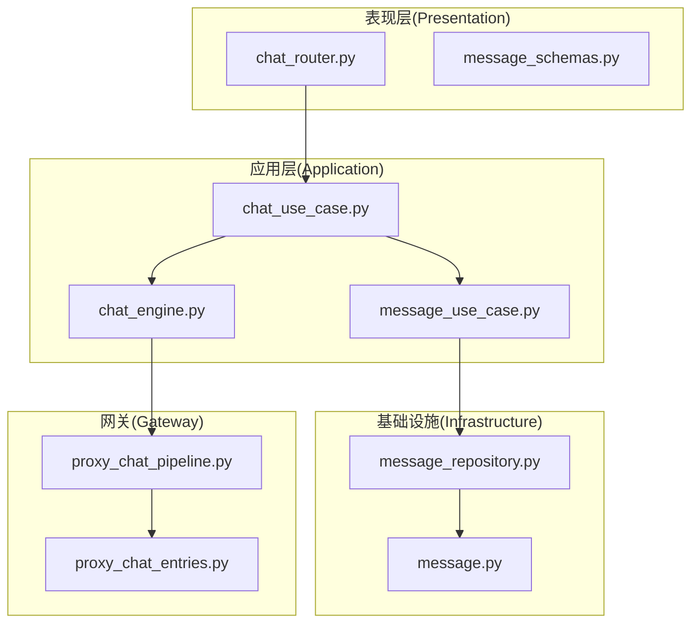
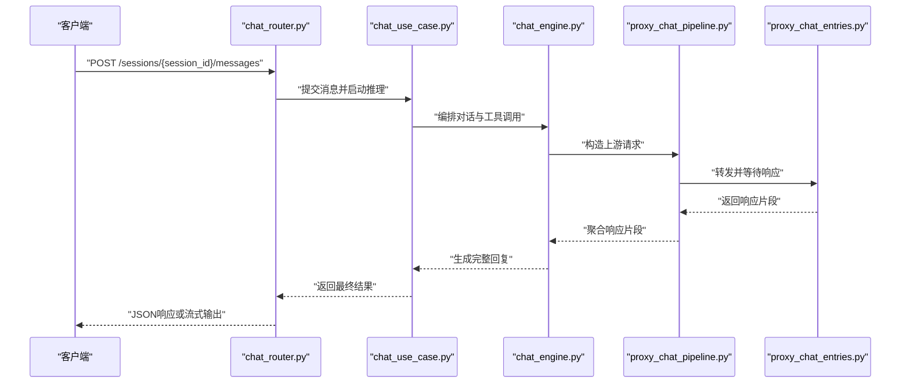
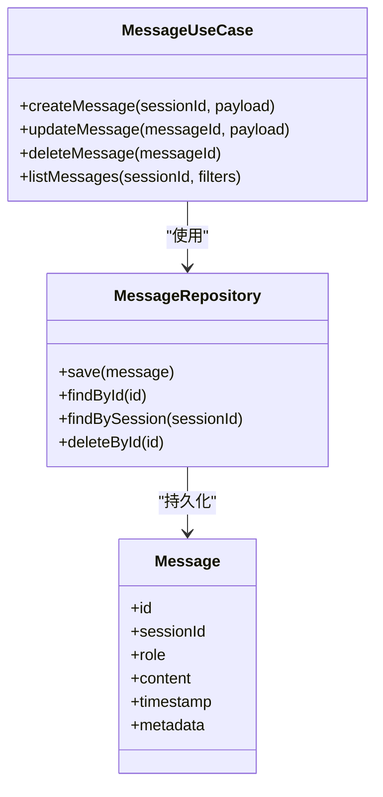
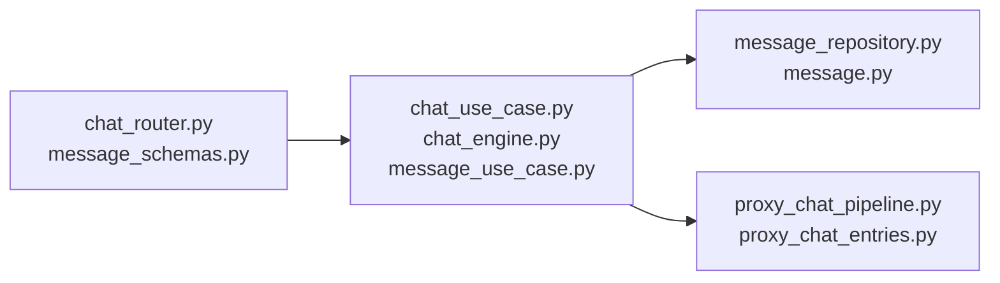

# 消息通信API

<cite>
**本文引用的文件**
- [chat_router.py](file://backend/domains/agent/presentation/chat_router.py)
- [chat_use_case.py](file://backend/domains/agent/application/chat_use_case.py)
- [chat_engine.py](file://backend/domains/agent/application/chat_engine.py)
- [message_use_case.py](file://backend/domains/agent/application/message_use_case.py)
- [message_repository.py](file://backend/domains/agent/infrastructure/repositories/message_repository.py)
- [message.py](file://backend/domains/agent/infrastructure/models/message.py)
- [message_schemas.py](file://backend/domains/agent/presentation/message_schemas.py)
- [proxy_chat_pipeline.py](file://backend/domains/gateway/application/proxy_chat_pipeline.py)
- [proxy_chat_entries.py](file://backend/domains/gateway/application/proxy_chat_entries.py)
- [test_chat_api_e2e.py](file://backend/tests/e2e/test_chat_api_e2e.py)
- [test_chat_api.py](file://backend/tests/integration/api/test_chat_api.py)
- [test_chat_router_streaming_session.py](file://backend/tests/unit/api/test_chat_router_streaming_session.py)
- [CHAT_MESSAGE_FLOW.md](file://backend/docs/archive/context/CHAT_MESSAGE_FLOW.md)
</cite>

## 目录
1. [简介](#简介)
2. [项目结构](#项目结构)
3. [核心组件](#核心组件)
4. [架构总览](#架构总览)
5. [详细组件分析](#详细组件分析)
6. [依赖关系分析](#依赖关系分析)
7. [性能考虑](#性能考虑)
8. [故障排除指南](#故障排除指南)
9. [结论](#结论)
10. [附录](#附录)

## 简介
本文件为AI Agent项目的消息通信API提供全面的REST API文档，覆盖实时聊天、消息发送、流式响应、消息历史查询、消息编辑与删除等管理功能。同时，结合后端文档与测试用例，说明WebSocket连接建立、消息格式规范、事件推送机制的实现要点，并给出消息去重、顺序保证、断线重连等高级特性在当前架构中的实现思路与最佳实践建议。

## 项目结构
消息通信相关的核心代码分布在以下模块：
- 表现层（Presentation）：负责HTTP路由与请求/响应模型定义
- 应用层（Application）：负责业务用例与引擎编排
- 基础设施（Infrastructure）：负责数据访问与持久化
- 网关（Gateway）：负责上游LLM服务代理与流式传输
- 测试（Tests）：覆盖端到端与单元场景

图表来源
- [chat_router.py](file://backend/domains/agent/presentation/chat_router.py)
- [chat_use_case.py](file://backend/domains/agent/application/chat_use_case.py)
- [chat_engine.py](file://backend/domains/agent/application/chat_engine.py)
- [message_use_case.py](file://backend/domains/agent/application/message_use_case.py)
- [message_repository.py](file://backend/domains/agent/infrastructure/repositories/message_repository.py)
- [message.py](file://backend/domains/agent/infrastructure/models/message.py)
- [proxy_chat_pipeline.py](file://backend/domains/gateway/application/proxy_chat_pipeline.py)
- [proxy_chat_entries.py](file://backend/domains/gateway/application/proxy_chat_entries.py)

章节来源
- [chat_router.py](file://backend/domains/agent/presentation/chat_router.py)
- [chat_use_case.py](file://backend/domains/agent/application/chat_use_case.py)
- [chat_engine.py](file://backend/domains/agent/application/chat_engine.py)
- [message_use_case.py](file://backend/domains/agent/application/message_use_case.py)
- [message_repository.py](file://backend/domains/agent/infrastructure/repositories/message_repository.py)
- [message.py](file://backend/domains/agent/infrastructure/models/message.py)
- [proxy_chat_pipeline.py](file://backend/domains/gateway/application/proxy_chat_pipeline.py)
- [proxy_chat_entries.py](file://backend/domains/gateway/application/proxy_chat_entries.py)

## 核心组件
- 聊天路由与会话管理：负责接收HTTP请求、解析参数、触发业务用例并返回结果或启动流式响应。
- 聊天用例与引擎：封装对话流程、上下文管理、工具调用与LLM推理编排。
- 消息用例与仓库：提供消息的增删改查、历史检索、去重与顺序控制。
- 网关代理：对接上游LLM服务，实现请求转发、流式传输与超时控制。
- 请求/响应模型：统一消息格式、字段约束与校验规则。

章节来源
- [chat_router.py](file://backend/domains/agent/presentation/chat_router.py)
- [chat_use_case.py](file://backend/domains/agent/application/chat_use_case.py)
- [chat_engine.py](file://backend/domains/agent/application/chat_engine.py)
- [message_use_case.py](file://backend/domains/agent/application/message_use_case.py)
- [message_repository.py](file://backend/domains/agent/infrastructure/repositories/message_repository.py)
- [message.py](file://backend/domains/agent/infrastructure/models/message.py)
- [message_schemas.py](file://backend/domains/agent/presentation/message_schemas.py)
- [proxy_chat_pipeline.py](file://backend/domains/gateway/application/proxy_chat_pipeline.py)
- [proxy_chat_entries.py](file://backend/domains/gateway/application/proxy_chat_entries.py)

## 架构总览
消息通信的整体流程从HTTP入口开始，经由路由与用例进入引擎，再通过网关代理与上游服务交互，最终将结果以普通响应或流式响应返回客户端；同时，消息被持久化到数据库，支持历史查询与管理操作。

图表来源
- [chat_router.py](file://backend/domains/agent/presentation/chat_router.py)
- [chat_use_case.py](file://backend/domains/agent/application/chat_use_case.py)
- [chat_engine.py](file://backend/domains/agent/application/chat_engine.py)
- [proxy_chat_pipeline.py](file://backend/domains/gateway/application/proxy_chat_pipeline.py)
- [proxy_chat_entries.py](file://backend/domains/gateway/application/proxy_chat_entries.py)

## 详细组件分析

### 路由与HTTP接口
- 入口路由：负责接收消息提交、历史查询、会话管理等请求。
- 参数解析：对会话ID、消息内容、流式标志、工具调用等进行解析与校验。
- 响应格式：统一返回标准JSON结构，必要时切换为Server-Sent Events或WebSocket流。

章节来源
- [chat_router.py](file://backend/domains/agent/presentation/chat_router.py)

### 聊天用例与引擎
- 用例职责：协调上下文、选择模型、执行工具、处理异常与回退策略。
- 引擎职责：编排多轮对话、维护消息序列、处理系统提示词与用户输入。
- 流式控制：根据客户端能力与网络状况选择合适的流式输出策略。

章节来源
- [chat_use_case.py](file://backend/domains/agent/application/chat_use_case.py)
- [chat_engine.py](file://backend/domains/agent/application/chat_engine.py)

### 消息管理用例与仓库
- 消息用例：提供消息创建、更新、删除、查询历史等操作；支持按时间范围、角色类型过滤。
- 仓库抽象：屏蔽底层存储差异，提供一致的数据访问接口。
- 数据模型：定义消息字段、索引与约束，确保查询效率与一致性。

图表来源
- [message_use_case.py](file://backend/domains/agent/application/message_use_case.py)
- [message_repository.py](file://backend/domains/agent/infrastructure/repositories/message_repository.py)
- [message.py](file://backend/domains/agent/infrastructure/models/message.py)

章节来源
- [message_use_case.py](file://backend/domains/agent/application/message_use_case.py)
- [message_repository.py](file://backend/domains/agent/infrastructure/repositories/message_repository.py)
- [message.py](file://backend/domains/agent/infrastructure/models/message.py)

### 网关代理与流式传输
- 代理编排：将应用层请求转换为上游服务可识别的格式，设置超时与重试策略。
- 流式输出：逐片返回响应，前端可即时渲染，提升用户体验。
- 错误处理：捕获上游异常并映射为统一错误码与消息。

章节来源
- [proxy_chat_pipeline.py](file://backend/domains/gateway/application/proxy_chat_pipeline.py)
- [proxy_chat_entries.py](file://backend/domains/gateway/application/proxy_chat_entries.py)

### WebSocket连接与事件推送
- 连接建立：客户端通过WebSocket与后端建立长连接，用于实时事件推送与增量更新。
- 事件类型：包括消息增量、推理状态、错误通知等。
- 心跳与断线重连：通过心跳检测与序列号保证消息顺序与完整性。

章节来源
- [test_chat_router_streaming_session.py](file://backend/tests/unit/api/test_chat_router_streaming_session.py)

### 消息格式规范
- 角色与内容：区分系统、用户、助手等角色，内容支持文本与结构化数据。
- 时间戳与元数据：记录创建时间、更新时间与扩展属性。
- 去重键：基于客户端提供的去重键避免重复插入。

章节来源
- [message_schemas.py](file://backend/domains/agent/presentation/message_schemas.py)
- [message.py](file://backend/domains/agent/infrastructure/models/message.py)

### 流式响应与实时聊天
- SSE/WS流：在HTTP头部设置合适的Content-Type与Transfer-Encoding，或升级为WebSocket。
- 片段协议：定义增量输出的JSON片段结构，前端按序渲染。
- 超时与中断：在网络波动或上游超时情况下优雅降级为非流式响应。

章节来源
- [chat_router.py](file://backend/domains/agent/presentation/chat_router.py)
- [proxy_chat_pipeline.py](file://backend/domains/gateway/application/proxy_chat_pipeline.py)

### 消息历史查询、编辑与删除
- 历史查询：支持分页、排序与条件过滤，返回标准化消息列表。
- 编辑操作：仅允许修改内容与元数据，保留原始时间戳与去重键。
- 删除操作：软删除或物理删除策略需结合审计要求与合规约束。

章节来源
- [message_use_case.py](file://backend/domains/agent/application/message_use_case.py)
- [message_repository.py](file://backend/domains/agent/infrastructure/repositories/message_repository.py)

### 集成示例与最佳实践
- 客户端集成：初始化会话、提交消息、监听流式事件、处理错误与重试。
- 服务端配置：合理设置超时、并发限制与日志级别，启用必要的安全中间件。
- 性能优化：缓存热点会话、预热模型、压缩传输与批量写入。

章节来源
- [test_chat_api_e2e.py](file://backend/tests/e2e/test_chat_api_e2e.py)
- [test_chat_api.py](file://backend/tests/integration/api/test_chat_api.py)

## 依赖关系分析
消息通信API的模块间依赖清晰，遵循分层架构原则，上层仅依赖下层抽象，降低耦合度并提高可测试性。

图表来源
- [chat_router.py](file://backend/domains/agent/presentation/chat_router.py)
- [message_schemas.py](file://backend/domains/agent/presentation/message_schemas.py)
- [chat_use_case.py](file://backend/domains/agent/application/chat_use_case.py)
- [chat_engine.py](file://backend/domains/agent/application/chat_engine.py)
- [message_use_case.py](file://backend/domains/agent/application/message_use_case.py)
- [message_repository.py](file://backend/domains/agent/infrastructure/repositories/message_repository.py)
- [message.py](file://backend/domains/agent/infrastructure/models/message.py)
- [proxy_chat_pipeline.py](file://backend/domains/gateway/application/proxy_chat_pipeline.py)
- [proxy_chat_entries.py](file://backend/domains/gateway/application/proxy_chat_entries.py)

章节来源
- [chat_router.py](file://backend/domains/agent/presentation/chat_router.py)
- [message_schemas.py](file://backend/domains/agent/presentation/message_schemas.py)
- [chat_use_case.py](file://backend/domains/agent/application/chat_use_case.py)
- [chat_engine.py](file://backend/domains/agent/application/chat_engine.py)
- [message_use_case.py](file://backend/domains/agent/application/message_use_case.py)
- [message_repository.py](file://backend/domains/agent/infrastructure/repositories/message_repository.py)
- [message.py](file://backend/domains/agent/infrastructure/models/message.py)
- [proxy_chat_pipeline.py](file://backend/domains/gateway/application/proxy_chat_pipeline.py)
- [proxy_chat_entries.py](file://backend/domains/gateway/application/proxy_chat_entries.py)

## 性能考虑
- 查询性能：为会话ID、时间戳与角色建立合适索引，减少全表扫描。
- 写入性能：批量写入与异步落库，避免阻塞主线程。
- 流式传输：控制片段大小与频率，平衡延迟与带宽占用。
- 缓存策略：热点会话与常用提示词缓存，降低重复计算成本。
- 超时与重试：合理设置上游超时与指数退避，避免雪崩效应。

## 故障排除指南
- 常见错误码与含义：统一错误码体系，明确参数缺失、鉴权失败、上游不可达等场景。
- 日志与追踪：为每个请求分配唯一ID，串联路由、用例、引擎与网关的日志。
- 重试策略：对瞬时性错误进行自动重试，对幂等操作采用去重键避免重复处理。
- 断线重连：WebSocket断开后按序号恢复，必要时回放未确认消息。

章节来源
- [test_chat_api_e2e.py](file://backend/tests/e2e/test_chat_api_e2e.py)
- [test_chat_api.py](file://backend/tests/integration/api/test_chat_api.py)

## 结论
本消息通信API以清晰的分层架构实现了从HTTP到WebSocket的全链路消息处理，结合网关代理完成与上游服务的高效交互。通过统一的消息模型、严格的去重与顺序控制，以及完善的错误处理与重试机制，能够满足实时聊天、流式响应与消息管理等核心需求。建议在生产环境中进一步完善监控告警、限流熔断与合规审计能力。

## 附录
- 消息去重与顺序保证：通过客户端去重键与服务端序列号实现，确保幂等与有序。
- 断线重连：基于WebSocket序列号与增量事件，支持无缝恢复。
- 文档参考：消息流转与上下文管理的详细设计可参考项目文档。

章节来源
- [CHAT_MESSAGE_FLOW.md](file://backend/docs/archive/context/CHAT_MESSAGE_FLOW.md)