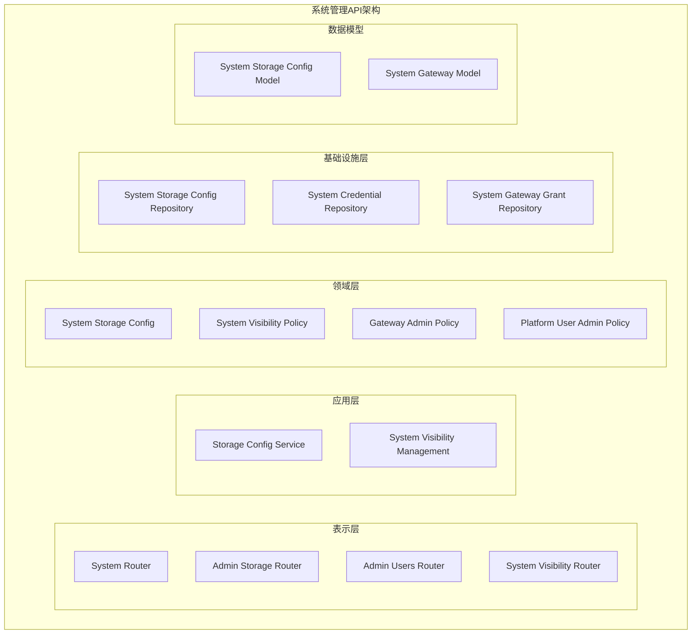
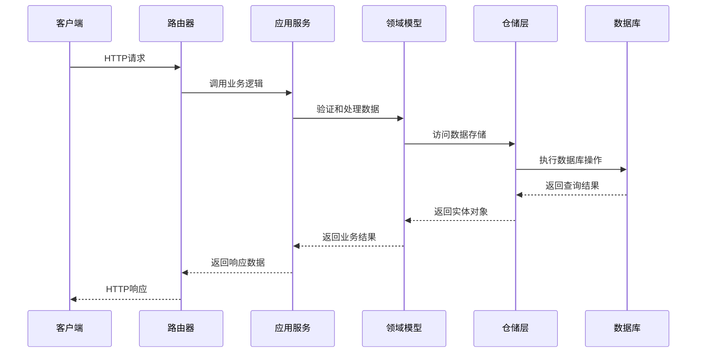
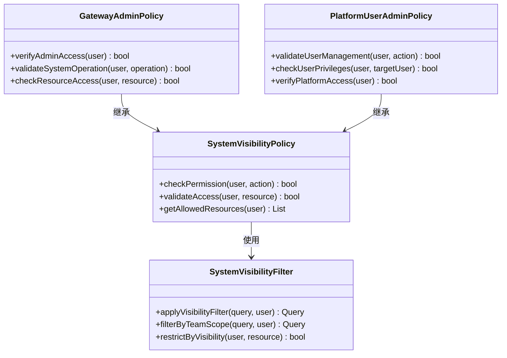
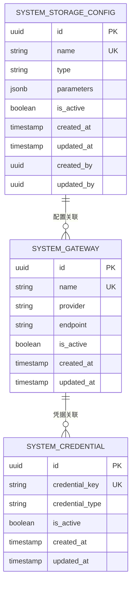
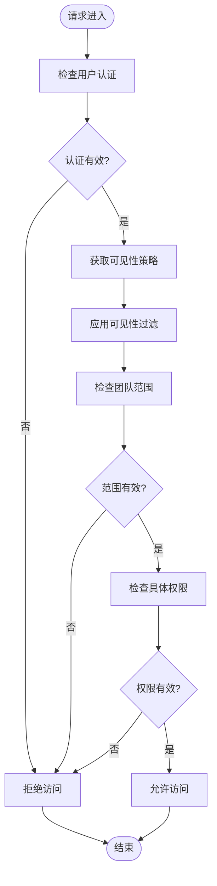
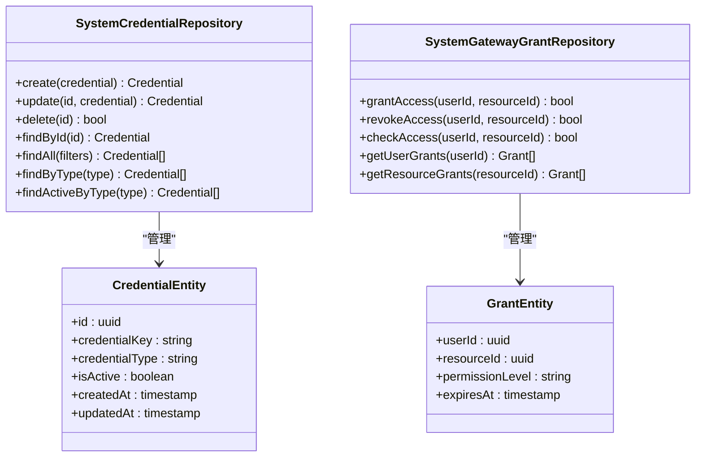
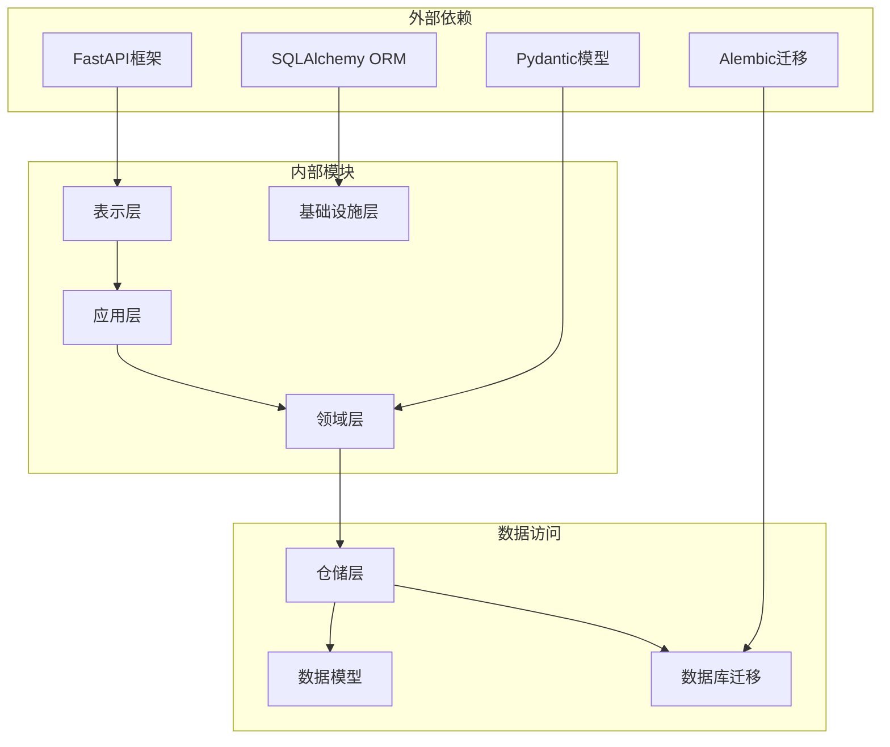

# 系统管理API

<cite>
**本文档引用的文件**
- [system_router.py](file://backend/domains/agent/presentation/system_router.py)
- [admin_storage_router.py](file://backend/domains/agent/presentation/admin_storage_router.py)
- [admin_users_router.py](file://backend/domains/identity/presentation/admin_users_router.py)
- [system_storage_config.py](file://backend/domains/agent/infrastructure/models/system_storage_config.py)
- [system_storage_config_repository.py](file://backend/domains/agent/infrastructure/repositories/system_storage_config_repository.py)
- [storage_config_service.py](file://backend/domains/agent/application/storage_config_service.py)
- [system_visibility.py](file://backend/domains/gateway/application/management/system_visibility.py)
- [system_visibility_policy.py](file://backend/domains/gateway/domain/policies/system_visibility.py)
- [system_visibility_router.py](file://backend/domains/gateway/presentation/routers/system_visibility.py)
- [gateway_admin_policy.py](file://backend/domains/gateway/domain/policies/gateway_admin.py)
- [platform_user_admin_policy.py](file://backend/domains/identity/domain/policies/platform_user_admin_policy.py)
- [set_admin.py](file://backend/scripts/set_admin.py)
- [system_gateway.py](file://backend/domains/gateway/infrastructure/models/system_gateway.py)
- [system_credential_repository.py](file://backend/domains/gateway/infrastructure/repositories/system_credential_repository.py)
- [system_gateway_grant_repository.py](file://backend/domains/gateway/infrastructure/repositories/system_gateway_grant_repository.py)
- [system_grants_cache.py](file://backend/domains/gateway/application/system_grants_cache.py)
- [system_visibility_filter.py](file://backend/domains/gateway/application/system_visibility_filter.py)
- [system_visibility_acl.py](file://backend/alembic/versions/20260603_system_visibility_acl.py)
- [system_storage_config_migration.py](file://backend/alembic/versions/20260520_add_system_storage_config.py)
- [system_storage_config_single_active_migration.py](file://backend/alembic/versions/20260520_system_storage_config_single_active.py)
- [test_system_api.py](file://backend/tests/integration/api/test_system_api.py)
- [test_admin_storage_api.py](file://backend/tests/integration/api/test_admin_storage_api.py)
- [test_admin_users_api.py](file://backend/tests/integration/api/test_admin_users_api.py)
- [test_gateway_admin_policy.py](file://backend/tests/unit/gateway/domain/test_gateway_admin_policy.py)
- [test_platform_user_admin_policy.py](file://backend/tests/unit/identity/domain/test_platform_user_admin_policy.py)
</cite>

## 目录
1. [简介](#简介)
2. [项目结构](#项目结构)
3. [核心组件](#核心组件)
4. [架构概览](#架构概览)
5. [详细组件分析](#详细组件分析)
6. [依赖关系分析](#依赖关系分析)
7. [性能考虑](#性能考虑)
8. [故障排除指南](#故障排除指南)
9. [结论](#结论)

## 简介

本文件为AI Agent项目的系统管理API提供全面的REST API文档。该系统管理API涵盖系统配置、存储管理、产品信息等后台管理功能，以及系统状态监控、性能指标查询、日志管理等运维功能。文档详细说明了系统设置更新、存储配置、产品目录管理等管理操作的API使用指南，并提供了系统健康检查、故障诊断、备份恢复等实用功能的完整示例。

系统管理API基于FastAPI框架构建，采用分层架构设计，包括表示层(Presentation)、应用层(Application)、领域层(Domain)和基础设施层(Infrastructure)。所有API均支持JSON格式的数据交换，并遵循RESTful设计原则。

## 项目结构

AI Agent项目的系统管理API主要分布在以下模块中：

**图表来源**
- [system_router.py:1-200](file://backend/domains/agent/presentation/system_router.py#L1-L200)
- [admin_storage_router.py:1-200](file://backend/domains/agent/presentation/admin_storage_router.py#L1-L200)
- [admin_users_router.py:1-200](file://backend/domains/identity/presentation/admin_users_router.py#L1-L200)

**章节来源**
- [system_router.py:1-200](file://backend/domains/agent/presentation/system_router.py#L1-L200)
- [admin_storage_router.py:1-200](file://backend/domains/agent/presentation/admin_storage_router.py#L1-L200)
- [admin_users_router.py:1-200](file://backend/domains/identity/presentation/admin_users_router.py#L1-L200)

## 核心组件

### 系统路由器(System Router)

系统路由器是系统管理API的核心入口点，负责处理所有系统级别的管理请求。该路由器实现了以下主要功能：

- 系统配置管理
- 存储配置管理
- 系统状态监控
- 性能指标查询
- 日志管理

### 存储配置路由器(Admin Storage Router)

存储配置路由器专门处理存储相关的管理操作，包括：

- 存储配置的创建、更新和删除
- 存储类型和参数的管理
- 存储连接状态监控
- 存储容量和使用情况统计

### 用户管理路由器(Admin Users Router)

用户管理路由器负责平台用户的管理操作：

- 用户账户的创建、修改和禁用
- 用户角色和权限的分配
- 用户活动日志的查看
- 用户统计数据的查询

**章节来源**
- [system_router.py:1-200](file://backend/domains/agent/presentation/system_router.py#L1-L200)
- [admin_storage_router.py:1-200](file://backend/domains/agent/presentation/admin_storage_router.py#L1-L200)
- [admin_users_router.py:1-200](file://backend/domains/identity/presentation/admin_users_router.py#L1-L200)

## 架构概览

系统管理API采用分层架构设计，确保关注点分离和代码的可维护性：

**图表来源**
- [system_router.py:1-200](file://backend/domains/agent/presentation/system_router.py#L1-L200)
- [storage_config_service.py:1-200](file://backend/domains/agent/application/storage_config_service.py#L1-L200)

### 权限控制架构

系统采用基于角色的访问控制(RBAC)机制，确保只有授权用户才能执行管理操作：

**图表来源**
- [system_visibility_policy.py:1-200](file://backend/domains/gateway/domain/policies/system_visibility.py#L1-L200)
- [gateway_admin_policy.py:1-200](file://backend/domains/gateway/domain/policies/gateway_admin.py#L1-L200)
- [platform_user_admin_policy.py:1-200](file://backend/domains/identity/domain/policies/platform_user_admin_policy.py#L1-L200)

**章节来源**
- [system_visibility_policy.py:1-200](file://backend/domains/gateway/domain/policies/system_visibility.py#L1-L200)
- [gateway_admin_policy.py:1-200](file://backend/domains/gateway/domain/policies/gateway_admin_policy.py#L1-L200)
- [platform_user_admin_policy.py:1-200](file://backend/domains/identity/domain/policies/platform_user_admin_policy.py#L1-L200)

## 详细组件分析

### 系统存储配置管理

系统存储配置管理是系统管理API的重要组成部分，负责管理系统级的存储设置和配置。

#### 数据模型设计

**图表来源**
- [system_storage_config.py:1-200](file://backend/domains/agent/infrastructure/models/system_storage_config.py#L1-L200)
- [system_gateway.py:1-200](file://backend/domains/gateway/infrastructure/models/system_gateway.py#L1-L200)

#### 存储配置服务

存储配置服务提供了完整的存储管理功能：

- 存储配置的CRUD操作
- 存储连接状态验证
- 存储性能监控
- 存储容量管理

**章节来源**
- [system_storage_config.py:1-200](file://backend/domains/agent/infrastructure/models/system_storage_config.py#L1-L200)
- [system_storage_config_repository.py:1-200](file://backend/domains/agent/infrastructure/repositories/system_storage_config_repository.py#L1-L200)
- [storage_config_service.py:1-200](file://backend/domains/agent/application/storage_config_service.py#L1-L200)

### 系统可见性管理

系统可见性管理确保不同用户只能访问其有权限查看的系统资源。

#### 可见性策略实现

**图表来源**
- [system_visibility.py:1-200](file://backend/domains/gateway/application/management/system_visibility.py#L1-L200)
- [system_visibility_filter.py:1-200](file://backend/domains/gateway/application/system_visibility_filter.py#L1-L200)

#### 系统权限缓存

为了提高性能，系统实现了权限缓存机制：

- 权限信息的分布式缓存
- 缓存失效策略
- 缓存更新同步
- 缓存性能监控

**章节来源**
- [system_visibility.py:1-200](file://backend/domains/gateway/application/management/system_visibility.py#L1-L200)
- [system_grants_cache.py:1-200](file://backend/domains/gateway/application/system_grants_cache.py#L1-L200)

### 网关凭据管理

网关凭据管理负责管理系统级的API密钥和凭据配置。

#### 凭据仓库模式

**图表来源**
- [system_credential_repository.py:1-200](file://backend/domains/gateway/infrastructure/repositories/system_credential_repository.py#L1-L200)
- [system_gateway_grant_repository.py:1-200](file://backend/domains/gateway/infrastructure/repositories/system_gateway_grant_repository.py#L1-L200)

**章节来源**
- [system_credential_repository.py:1-200](file://backend/domains/gateway/infrastructure/repositories/system_credential_repository.py#L1-L200)
- [system_gateway_grant_repository.py:1-200](file://backend/domains/gateway/infrastructure/repositories/system_gateway_grant_repository.py#L1-L200)

## 依赖关系分析

系统管理API的依赖关系体现了清晰的关注点分离：

**图表来源**
- [system_router.py:1-200](file://backend/domains/agent/presentation/system_router.py#L1-L200)
- [storage_config_service.py:1-200](file://backend/domains/agent/application/storage_config_service.py#L1-L200)

### 数据库迁移策略

系统使用Alembic进行数据库迁移管理，确保schema变更的一致性和可追溯性：

- 系统存储配置表的创建和维护
- 系统可见性ACL的实现
- 网关凭据系统的演进
- 多租户支持的数据库结构

**章节来源**
- [system_visibility_acl.py:1-200](file://backend/alembic/versions/20260603_system_visibility_acl.py#L1-L200)
- [system_storage_config_migration.py:1-200](file://backend/alembic/versions/20260520_add_system_storage_config.py#L1-L200)
- [system_storage_config_single_active_migration.py:1-200](file://backend/alembic/versions/20260520_system_storage_config_single_active.py#L1-L200)

## 性能考虑

系统管理API在设计时充分考虑了性能优化：

### 缓存策略
- 权限信息的分布式缓存
- 配置数据的本地缓存
- 查询结果的智能缓存
- 缓存失效和更新机制

### 数据库优化
- 合理的索引设计
- 查询性能监控
- 连接池管理
- 事务处理优化

### API性能指标
- 响应时间监控
- 并发处理能力
- 错误率统计
- 资源使用情况

## 故障排除指南

### 常见问题及解决方案

#### 权限相关问题
- **问题**: 用户无法访问某些管理功能
- **原因**: 权限不足或会话过期
- **解决**: 检查用户角色和权限配置，重新登录系统

#### 数据库连接问题
- **问题**: API调用失败，数据库连接异常
- **原因**: 数据库连接池耗尽或网络问题
- **解决**: 检查数据库连接配置，重启应用服务

#### 缓存同步问题
- **问题**: 权限更新后未立即生效
- **原因**: 缓存未及时刷新
- **解决**: 清除相关缓存条目或等待自动刷新

### 调试工具和方法

系统提供了多种调试和监控工具：

- API请求日志记录
- 性能指标监控
- 错误追踪和报告
- 实时状态监控面板

**章节来源**
- [test_system_api.py:1-200](file://backend/tests/integration/api/test_system_api.py#L1-L200)
- [test_admin_storage_api.py:1-200](file://backend/tests/integration/api/test_admin_storage_api.py#L1-L200)
- [test_admin_users_api.py:1-200](file://backend/tests/integration/api/test_admin_users_api.py#L1-L200)

## 结论

AI Agent项目的系统管理API提供了一个完整、安全、高性能的后台管理解决方案。通过分层架构设计、严格的权限控制和完善的监控机制，系统能够满足复杂的管理需求。

主要特点包括：
- 清晰的架构分层和职责分离
- 强大的权限控制和安全机制
- 完善的存储和配置管理功能
- 全面的监控和故障诊断能力
- 可扩展的设计和良好的性能表现

建议在实际部署中：
- 根据生产环境需求调整缓存策略
- 定期审查和更新权限配置
- 建立完善的监控告警机制
- 制定详细的备份和恢复计划
- 持续优化性能和用户体验