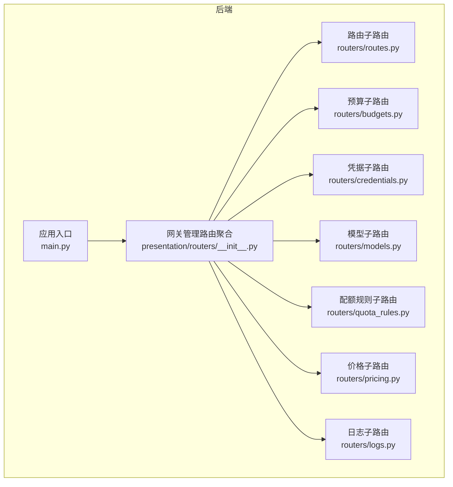
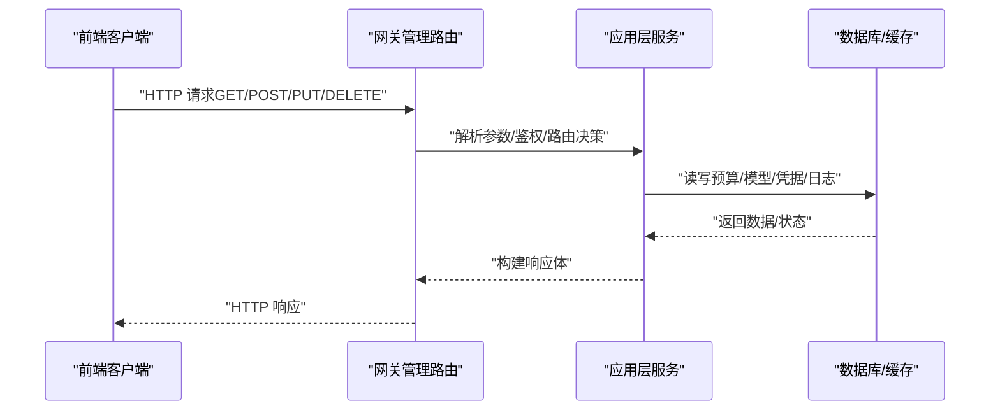
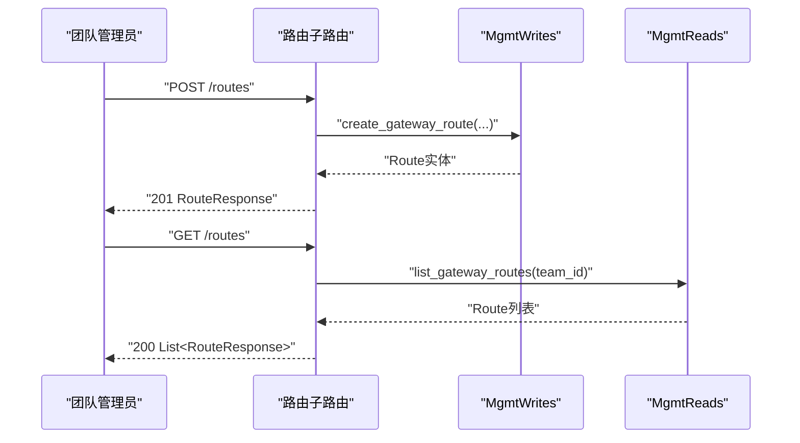
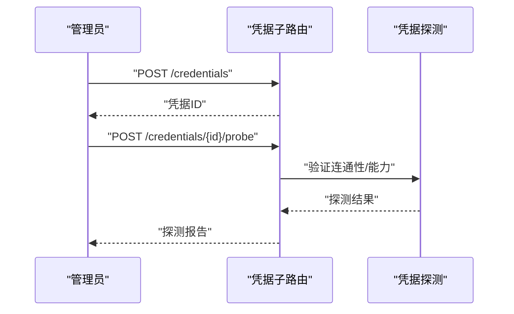
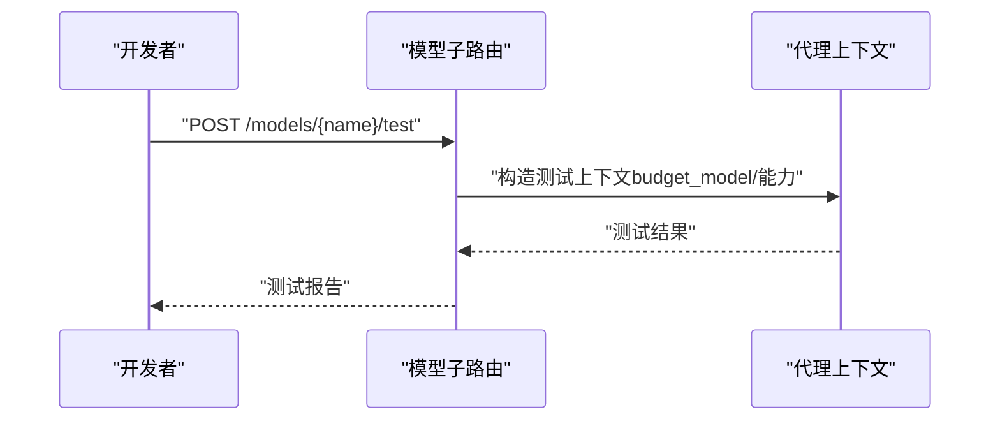
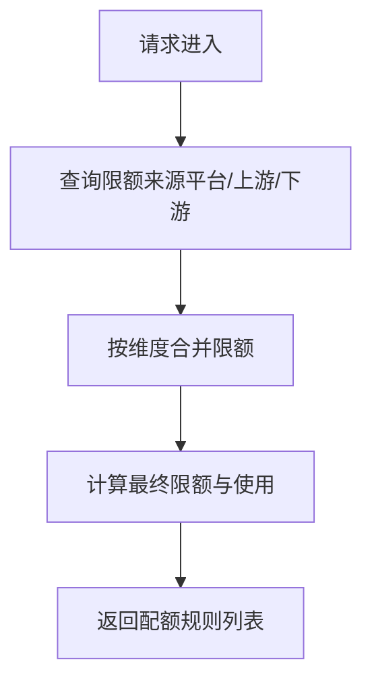
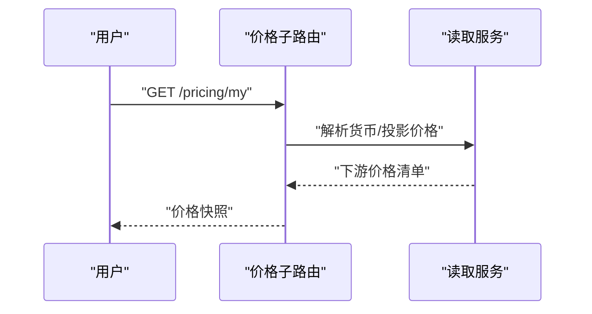
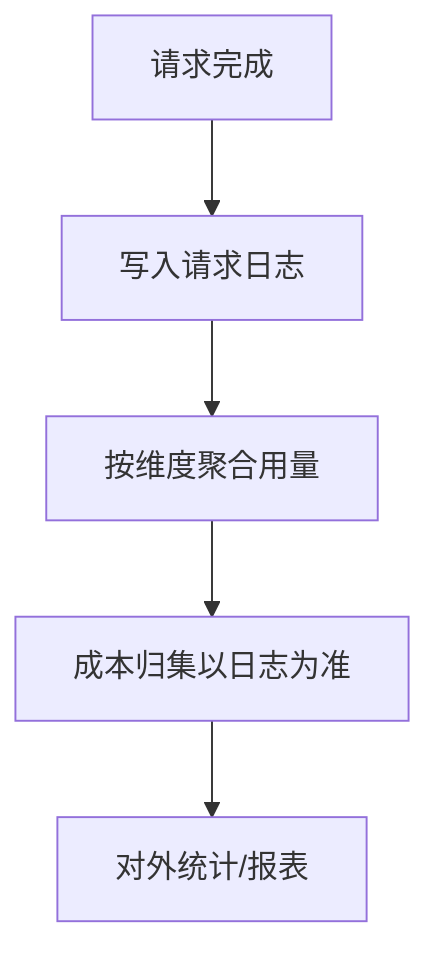
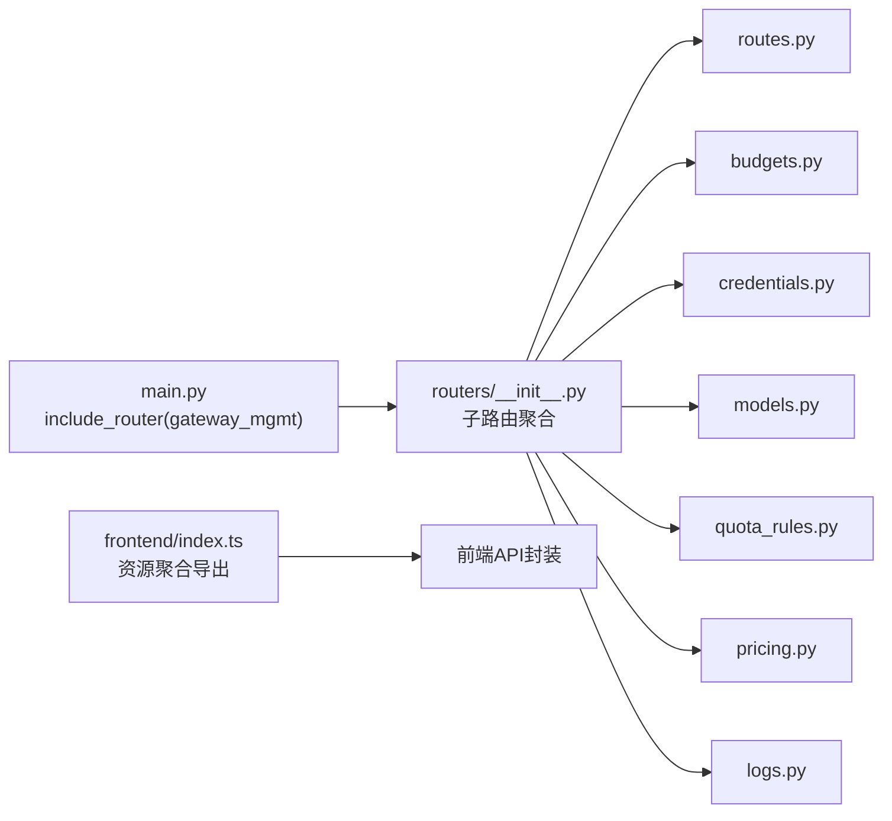
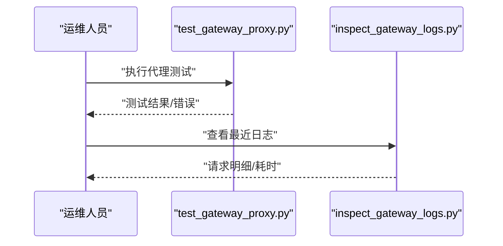

# 网关API

<cite>
**本文引用的文件**
- [main.py](file://backend/bootstrap/main.py)
- [__init__.py（网关presentation路由聚合）](file://backend/domains/gateway/presentation/routers/__init__.py)
- [routes.py（路由管理）](file://backend/domains/gateway/presentation/routers/routes.py)
- [budgets.py（预算管理）](file://backend/domains/gateway/presentation/routers/budgets.py)
- [credentials.py（凭据管理）](file://backend/domains/gateway/presentation/routers/credentials.py)
- [models.py（模型管理）](file://backend/domains/gateway/presentation/routers/models.py)
- [quota_rules.py（配额规则）](file://backend/domains/gateway/presentation/routers/quota_rules.py)
- [pricing.py（价格配置）](file://backend/domains/gateway/presentation/routers/pricing.py)
- [logs.py（使用统计与日志）](file://backend/domains/gateway/presentation/routers/logs.py)
- [proxy_context.py（代理上下文与预算/能力）](file://backend/domains/gateway/application/proxy_context.py)
- [20260508_add_gateway_tables.py（预算表结构）](file://backend/alembic/versions/20260508_add_gateway_tables.py)
- [20260224_add_user_models_table.py（用户模型表结构）](file://backend/alembic/versions/20260224_add_user_models_table.py)
- [20260515_migrate_user_models_data.py（用户模型数据迁移）](file://backend/alembic/versions/20260515_migrate_user_models_data.py)
- [GATEWAY_PRICING_AND_LITELLM_COST.html（定价与成本说明）](file://backend/docs/gateway/GATEWAY_PRICING_AND_LITELLM_COST.html)
- [index.ts（前端网关API聚合）](file://frontend/src/api/gateway/index.ts)
- [budgets.ts（前端预算API封装）](file://frontend/src/api/gateway/budgets.ts)
- [quota-rules.ts（前端配额规则类型）](file://frontend/src/api/gateway/quota-rules.ts)
- [routes.ts（前端路由API封装）](file://frontend/src/api/gateway/routes.ts)
- [test_gateway_proxy.py（网关代理测试脚本）](file://backend/scripts/test_gateway_proxy.py)
- [inspect_gateway_logs.py（网关日志检查脚本）](file://backend/scripts/inspect_gateway_logs.py)
</cite>

## 目录
1. [简介](#简介)
2. [项目结构](#项目结构)
3. [核心组件](#核心组件)
4. [架构总览](#架构总览)
5. [详细组件分析](#详细组件分析)
6. [依赖关系分析](#依赖关系分析)
7. [性能考虑](#性能考虑)
8. [故障排查指南](#故障排查指南)
9. [结论](#结论)
10. [附录](#附录)

## 简介
本文件为AI Agent项目的"网关API"全面REST API文档，覆盖LLM模型管理、凭据管理、预算控制、配额规则、价格配置、使用统计等核心功能。文档解释网关代理的请求路由、响应适配与错误处理机制，并提供凭据验证、模型测试、连接性检查等实用API的使用示例。同时说明鉴权要求、限流策略与性能优化建议。

## 项目结构
后端通过FastAPI聚合多个子路由，统一前缀为/api/v1/gateway，按资源域拆分子路由模块，包括：
- 路由管理：虚拟模型到真实模型的映射与回退策略
- 预算管理：按系统/租户/密钥/用户维度的成本与用量限额
- 凭据管理：提供商凭据的创建、更新、删除与探测
- 模型管理：模型注册、启用、能力检测与测试（支持多模型类型）
- 配额规则：统一的限额来源与叠加策略
- 价格配置：上游/下游价格与快照
- 使用统计与日志：请求日志、用量统计与成本归集

**图表来源**
- [main.py:475-480](file://backend/bootstrap/main.py#L475-L480)
- [__init__.py（网关presentation路由聚合）:1-5](file://backend/domains/gateway/presentation/routers/__init__.py#L1-L5)

**章节来源**
- [main.py:475-480](file://backend/bootstrap/main.py#L475-L480)
- [__init__.py（网关presentation路由聚合）:1-5](file://backend/domains/gateway/presentation/routers/__init__.py#L1-L5)

## 核心组件
- 网关代理上下文与能力：定义请求上下文、预算模型、能力集合、入站鉴权路径等，支撑路由决策与限额校验。
- 预算与配额：统一限额来源（平台/上游/下游），支持软上限预警与硬上限拒绝。
- 价格体系：上游价与下游价分离，支持批量镜像与快照展示。
- 使用统计：请求日志、用量聚合与成本归集，支持多维维度查询。
- **模型管理增强**：支持个人模型多模型类型（text、image等）与改进的重复创建检测机制。

**章节来源**
- [proxy_context.py:33-59](file://backend/domains/gateway/application/proxy_context.py#L33-L59)

## 架构总览
网关API采用"管理路由聚合 + 子路由模块"的组织方式，统一前缀/api/v1/gateway，各子路由负责具体资源域。前端通过聚合客户端封装调用，后端通过应用层服务与基础设施层交互。

**图表来源**
- [main.py:475-480](file://backend/bootstrap/main.py#L475-L480)
- [routes.py:28-48](file://backend/domains/gateway/presentation/routers/routes.py#L28-L48)
- [budgets.py:58-64](file://backend/domains/gateway/presentation/routers/budgets.py#L58-L64)
- [credentials.py:1-200](file://backend/domains/gateway/presentation/routers/credentials.py#L1-L200)
- [models.py:1-200](file://backend/domains/gateway/presentation/routers/models.py#L1-L200)
- [quota_rules.py:1-200](file://backend/domains/gateway/presentation/routers/quota_rules.py#L1-L200)
- [pricing.py:1-200](file://backend/domains/gateway/presentation/routers/pricing.py#L1-L200)
- [logs.py:1-200](file://backend/domains/gateway/presentation/routers/logs.py#L1-L200)

## 详细组件分析

### 路由管理（虚拟模型与主备策略）
- 功能要点
  - 列出/创建/更新/删除路由
  - 定义虚拟模型到真实模型的映射
  - 配置通用回退与内容策略回退
- 关键端点
  - GET /api/v1/gateway/routes
  - POST /api/v1/gateway/routes
  - PUT /api/v1/gateway/routes/{id}
  - DELETE /api/v1/gateway/routes/{id}
- 鉴权与权限
  - 列表：当前团队成员
  - 创建/更新/删除：团队管理员
- 响应与错误
  - 成功返回RouteResponse
  - 失败返回标准HTTP状态码与错误信息

**图表来源**
- [routes.py:28-48](file://backend/domains/gateway/presentation/routers/routes.py#L28-L48)

**章节来源**
- [routes.py:28-48](file://backend/domains/gateway/presentation/routers/routes.py#L28-L48)

### 预算管理（成本与用量限额）
- 功能要点
  - 按目标类型（系统/租户/密钥/用户）与周期（日/月/总计）设定限额
  - 支持美元、Token、请求数三类限额，软上限用于预警
  - 支持按模型名限定
- 关键端点
  - GET /api/v1/gateway/teams/{teamId}/budgets
  - PUT /api/v1/gateway/teams/{teamId}/budgets
  - DELETE /api/v1/gateway/teams/{teamId}/budgets/{id}
- 前端封装
  - 列表、创建/更新、删除方法
  - 支持过滤参数：target_kind、model_name

**图表来源**
- [budgets.py:46-64](file://backend/domains/gateway/presentation/routers/budgets.py#L46-L64)
- [budgets.ts:45-64](file://frontend/src/api/gateway/budgets.ts#L45-L64)

**章节来源**
- [budgets.py:46-64](file://backend/domains/gateway/presentation/routers/budgets.py#L46-L64)
- [budgets.ts:45-64](file://frontend/src/api/gateway/budgets.ts#L45-L64)
- [20260508_add_gateway_tables.py:340-367](file://backend/alembic/versions/20260508_add_gateway_tables.py#L340-L367)

### 凭据管理（提供商凭据与探测）
- 功能要点
  - 创建/更新/删除团队/个人凭据
  - 探测（Probe）凭据连通性与可用能力
  - 支持凭据作用域与API Base配置
- 关键端点
  - GET/POST/PUT/DELETE /api/v1/gateway/teams/{teamId}/credentials
  - POST /api/v1/gateway/teams/{teamId}/credentials/{id}/probe
- 前端封装
  - 凭据资源API导出
  - 探测结果用于UI提示

**图表来源**
- [credentials.py:1-200](file://backend/domains/gateway/presentation/routers/credentials.py#L1-L200)

**章节来源**
- [credentials.py:1-200](file://backend/domains/gateway/presentation/routers/credentials.py#L1-L200)

### 模型管理（注册、能力检测与测试）
- 功能要点
  - 注册/启用/禁用模型
  - 能力检测（如文本/图像/工具调用）
  - 模型测试（选择虚拟密钥或API Key进行连通性测试）
  - **新增**：个人模型支持多模型类型（text、image等）
  - **改进**：团队模型重复创建的错误处理逻辑
  - **增强**：duplicate detection和冲突检测机制
- 关键端点
  - GET/POST/PUT/DELETE /api/v1/gateway/teams/{teamId}/models
  - POST /api/v1/gateway/teams/{teamId}/models/{name}/test
- 前端封装
  - 模型资源API导出
  - 测试支持选择模型与密钥

**图表来源**
- [models.py:1-200](file://backend/domains/gateway/presentation/routers/models.py#L1-L200)
- [proxy_context.py:33-59](file://backend/domains/gateway/application/proxy_context.py#L33-L59)

**章节来源**
- [models.py:1-200](file://backend/domains/gateway/presentation/routers/models.py#L1-L200)
- [proxy_context.py:33-59](file://backend/domains/gateway/application/proxy_context.py#L33-L59)

### 配额规则（统一限额来源与叠加）
- 功能要点
  - 平台/上游/下游三层限额来源
  - 支持按用户/凭据/模型/周期/窗口等维度叠加
  - 提供统一限额视图与使用情况
- 关键端点
  - GET /api/v1/gateway/teams/{teamId}/quota-rules
- 前端封装
  - 定义配额规则数据结构与来源引用

**图表来源**
- [quota_rules.py:1-200](file://backend/domains/gateway/presentation/routers/quota_rules.py#L1-L200)
- [quota-rules.ts:52-59](file://frontend/src/api/gateway/quota-rules.ts#L52-L59)

**章节来源**
- [quota_rules.py:1-200](file://backend/domains/gateway/presentation/routers/quota_rules.py#L1-L200)
- [quota-rules.ts:52-59](file://frontend/src/api/gateway/quota-rules.ts#L52-L59)

### 价格配置（上游价与下游价）
- 功能要点
  - 上游价：从提供商获取的计费单价
  - 下游价：面向租户的销售价格，支持继承策略
  - 快照：价格版本与显示货币转换
- 关键端点
  - GET /api/v1/gateway/pricing/my
  - GET /api/v1/gateway/pricing/snapshots
  - PUT /api/v1/gateway/pricing/mirror
- 权限说明
  - 管理员：完整读写
  - 普通成员：只读"我的价格"，上游字段掩码

**图表来源**
- [pricing.py:1-200](file://backend/domains/gateway/presentation/routers/pricing.py#L1-L200)
- [GATEWAY_PRICING_AND_LITELLM_COST.html:928-939](file://backend/docs/gateway/GATEWAY_PRICING_AND_LITELLM_COST.html#L928-L939)

**章节来源**
- [pricing.py:1-200](file://backend/domains/gateway/presentation/routers/pricing.py#L1-L200)
- [GATEWAY_PRICING_AND_LITELLM_COST.html:928-939](file://backend/docs/gateway/GATEWAY_PRICING_AND_LITELLM_COST.html#L928-L939)

### 使用统计与日志（用量与成本）
- 功能要点
  - 请求日志：路由时间、提供商、用户、凭据等维度
  - 用量统计：按团队/模型/凭据聚合
  - 成本归集：以gateway_request_logs为准的对账机制
- 关键端点
  - GET /api/v1/gateway/logs/request
  - GET /api/v1/gateway/stats/usage
- 成本说明
  - 预算扣减与revenue_usd来源不同，以请求日志为准

**图表来源**
- [logs.py:1-200](file://backend/domains/gateway/presentation/routers/logs.py#L1-L200)
- [GATEWAY_PRICING_AND_LITELLM_COST.html:915-926](file://backend/docs/gateway/GATEWAY_PRICING_AND_LITELLM_COST.html#L915-L926)

**章节来源**
- [logs.py:1-200](file://backend/domains/gateway/presentation/routers/logs.py#L1-L200)
- [GATEWAY_PRICING_AND_LITELLM_COST.html:915-926](file://backend/docs/gateway/GATEWAY_PRICING_AND_LITELLM_COST.html#L915-L926)

## 依赖关系分析
- 路由聚合
  - 应用入口在统一前缀/api/v1/gateway下挂载网关管理路由
  - 各子路由模块导出独立APIRouter，由聚合模块统一加前缀
- 数据模型
  - 预算表结构包含限额、用量、重置时间等字段
  - **用户模型表结构支持多模型类型存储**
  - 用户模型数据迁移确保向后兼容性
- 前端集成
  - 前端聚合导出各资源API，便于调用与类型安全

**图表来源**
- [main.py:475-480](file://backend/bootstrap/main.py#L475-L480)
- [__init__.py（网关presentation路由聚合）:1-5](file://backend/domains/gateway/presentation/routers/__init__.py#L1-L5)
- [index.ts:16-31](file://frontend/src/api/gateway/index.ts#L16-L31)

**章节来源**
- [main.py:475-480](file://backend/bootstrap/main.py#L475-L480)
- [__init__.py（网关presentation路由聚合）:1-5](file://backend/domains/gateway/presentation/routers/__init__.py#L1-L5)
- [index.ts:16-31](file://frontend/src/api/gateway/index.ts#L16-L31)

## 性能考虑
- 索引优化：针对热点查询字段建立索引，减少慢查询
- 缓存策略：对常用配置（价格、模型能力）进行缓存
- 批量操作：价格镜像与日志导出支持批量处理
- 连接池：数据库与外部提供商API连接池复用
- 异步处理：日志写入与用量聚合异步化
- **模型类型优化**：多模型类型存储减少重复模型条目，提高查询效率

## 故障排查指南
- 网关代理测试
  - 使用测试脚本发起代理请求，验证虚拟密钥与模型连通性
  - 支持指定环境文件与令牌
- 日志检查
  - 查看最近请求日志，定位路由时间、提供商、错误原因
  - 支持按用户、时间段过滤
- **模型管理故障排查**
  - 检查个人模型多类型支持是否正常工作
  - 验证团队模型重复创建的错误处理逻辑
  - 确认duplicate detection和冲突检测机制有效

**图表来源**
- [test_gateway_proxy.py:32-35](file://backend/scripts/test_gateway_proxy.py#L32-L35)
- [inspect_gateway_logs.py:7-10](file://backend/scripts/inspect_gateway_logs.py#L7-L10)

**章节来源**
- [test_gateway_proxy.py:32-35](file://backend/scripts/test_gateway_proxy.py#L32-L35)
- [inspect_gateway_logs.py:7-10](file://backend/scripts/inspect_gateway_logs.py#L7-L10)

## 结论
本文档系统梳理了网关API的核心能力与端点规范，涵盖路由、预算、凭据、模型、配额、价格与日志等模块。通过统一的管理路由聚合与清晰的职责划分，实现了灵活的LLM接入与成本控制。

**最新更新**：
- 模型管理功能已增强，支持个人模型多模型类型（text、image等）
- 团队模型重复创建的错误处理逻辑得到改进
- duplicate detection和冲突检测机制更加完善

建议在生产环境中结合索引优化、缓存与异步处理提升性能，并利用测试脚本与日志工具进行持续监控与排障。

## 附录
- 鉴权与限流
  - 鉴权：虚拟密钥（vkey）与平台API Key（apikey）两种入站路径
  - 限流：RPM/TPM限制与配额叠加策略协同
- 实用示例
  - 凭据验证：POST /teams/{teamId}/credentials/{id}/probe
  - 模型测试：POST /teams/{teamId}/models/{name}/test
  - 连接性检查：GET /health（服务根级健康检查）
- **模型管理新特性**
  - 个人模型多类型支持：text、image等类型可同时存在
  - 改进的重复创建检测：避免团队模型重复创建
  - 增强的冲突检测：确保模型配置一致性