# 网关API

<cite>
**本文引用的文件**
- [main.py](file://backend/bootstrap/main.py)
- [__init__.py（网关presentation路由聚合）](file://backend/domains/gateway/presentation/routers/__init__.py)
- [routes.py（路由管理）](file://backend/domains/gateway/presentation/routers/routes.py)
- [budgets.py（预算管理）](file://backend/domains/gateway/presentation/routers/budgets.py)
- [credentials.py（凭据管理）](file://backend/domains/gateway/presentation/routers/credentials.py)
- [models.py（模型管理）](file://backend/domains/gateway/presentation/routers/models.py)
- [quota_rules.py（配额规则）](file://backend/domains/gateway/presentation/routers/quota_rules.py)
- [pricing.py（价格配置）](file://backend/domains/gateway/presentation/routers/pricing.py)
- [logs.py（使用统计与日志）](file://backend/domains/gateway/presentation/routers/logs.py)
- [proxy_context.py（代理上下文与预算/能力）](file://backend/domains/gateway/application/proxy_context.py)
- [teams_router.py（团队成员搜索API）](file://backend/domains/tenancy/presentation/teams_router.py)
- [team_repository.py（团队成员搜索实现）](file://backend/domains/tenancy/infrastructure/repositories/team_repository.py)
- [team_service.py（团队成员搜索服务）](file://backend/domains/tenancy/application/team_service.py)
- [use-team-member-filter-search.ts（前端团队成员搜索钩子）](file://frontend/src/features/gateway-usage/use-team-member-filter-search.ts)
- [use-gateway-team-members.ts（团队成员查询键标准化）](file://frontend/src/features/gateway-teams/use-gateway-team-members.ts)
- [teams.ts（前端团队API封装）](file://frontend/src/api/gateway/teams.ts)
- [logs.tsx（前端日志页面集成）](file://frontend/src/pages/gateway/logs.tsx)
- [20260508_add_gateway_tables.py（预算表结构）](file://backend/alembic/versions/20260508_add_gateway_tables.py)
- [20260224_add_user_models_table.py（用户模型表结构）](file://backend/alembic/versions/20260224_add_user_models_table.py)
- [20260515_migrate_user_models_data.py（用户模型数据迁移）](file://backend/alembic/versions/20260515_migrate_user_models_data.py)
- [GATEWAY_PRICING_AND_LITELLM_COST.html（定价与成本说明）](file://backend/docs/gateway/GATEWAY_PRICING_AND_LITELLM_COST.html)
- [index.ts（前端网关API聚合）](file://frontend/src/api/gateway/index.ts)
- [budgets.ts（前端预算API封装）](file://frontend/src/api/gateway/budgets.ts)
- [quota-rules.ts（前端配额规则类型）](file://frontend/src/api/gateway/quota-rules.ts)
- [routes.ts（前端路由API封装）](file://frontend/src/api/gateway/routes.ts)
- [test_gateway_proxy.py（网关代理测试脚本）](file://backend/scripts/test_gateway_proxy.py)
- [inspect_gateway_logs.py（网关日志检查脚本）](file://backend/scripts/inspect_gateway_logs.py)
- [utils.ts（批量操作与性能优化工具）](file://frontend/src/features/gateway-models/utils.ts)
- [use-connectivity-batch-test.ts（批量连通性测试钩子）](file://frontend/src/features/gateway-models/hooks/use-connectivity-batch-test.ts)
- [credential-probe-cache.ts（凭据探测缓存）](file://frontend/src/features/gateway-credentials/credential-probe-cache.ts)
- [combine-fetching.ts（查询状态合并）](file://frontend/src/features/gateway-shared/combine-fetching.ts)
</cite>

## 更新摘要
**所做更改**
- 更新团队成员搜索功能章节，重点反映use-team-member-filter-search钩子的React Query缓存优化
- 新增查询键结构标准化的前端实现细节
- 补充缓存策略和性能优化的具体技术实现
- 强调React Query缓存键的标准化和去重机制

## 目录
1. [简介](#简介)
2. [项目结构](#项目结构)
3. [核心组件](#核心组件)
4. [架构总览](#架构总览)
5. [详细组件分析](#详细组件分析)
6. [团队成员搜索功能](#团队成员搜索功能)
7. [批量操作优化](#批量操作优化)
8. [依赖关系分析](#依赖关系分析)
9. [性能考虑](#性能考虑)
10. [故障排查指南](#故障排查指南)
11. [结论](#结论)
12. [附录](#附录)

## 简介
本文件为AI Agent项目的"网关API"全面REST API文档，覆盖LLM模型管理、凭据管理、预算控制、配额规则、价格配置、使用统计等核心功能。文档解释网关代理的请求路由、响应适配与错误处理机制，并提供凭据验证、模型测试、连接性检查等实用API的使用示例。同时说明鉴权要求、限流策略与性能优化建议。

**最新更新**：本次更新重点反映了团队成员搜索功能的重大性能优化，通过在use-team-member-filter-search钩子中实现React Query缓存优化和查询键结构标准化，显著提升了大团队场景下的搜索体验和缓存效率。

## 项目结构
后端通过FastAPI聚合多个子路由，统一前缀为/api/v1/gateway，按资源域拆分子路由模块，包括：
- 路由管理：虚拟模型到真实模型的映射与回退策略
- 预算管理：按系统/租户/密钥/用户维度的成本与用量限额
- 凭据管理：提供商凭据的创建、更新、删除与探测
- 模型管理：模型注册、启用、能力检测与测试（支持多模型类型）
- 配额规则：统一的限额来源与叠加策略
- 价格配置：上游/下游价格与快照
- 使用统计与日志：请求日志、用量统计与成本归集
- **团队成员搜索**：支持邮箱和姓名的分页搜索功能，现已实现React Query缓存优化

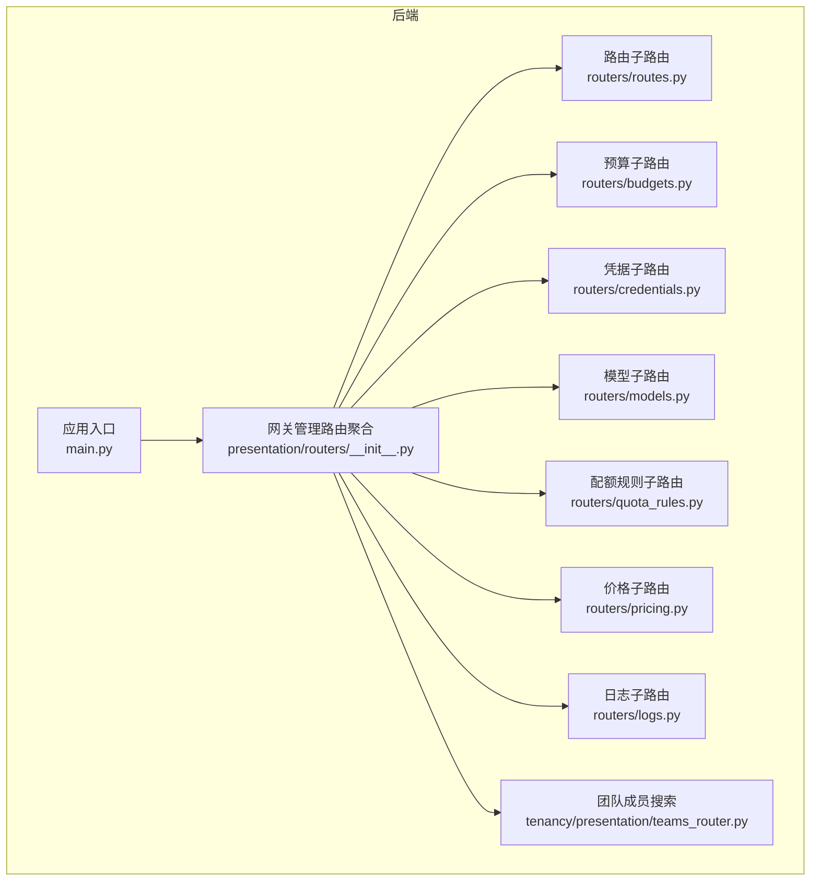

**图表来源**
- [main.py:475-480](file://backend/bootstrap/main.py#L475-L480)
- [__init__.py（网关presentation路由聚合）:1-5](file://backend/domains/gateway/presentation/routers/__init__.py#L1-L5)

**章节来源**
- [main.py:475-480](file://backend/bootstrap/main.py#L475-L480)
- [__init__.py（网关presentation路由聚合）:1-5](file://backend/domains/gateway/presentation/routers/__init__.py#L1-L5)

## 核心组件
- 网关代理上下文与能力：定义请求上下文、预算模型、能力集合、入站鉴权路径等，支撑路由决策与限额校验。
- 预算与配额：统一限额来源（平台/上游/下游），支持软上限预警与硬上限拒绝。
- 价格体系：上游价与下游价分离，支持批量镜像与快照展示。
- 使用统计：请求日志、用量聚合与成本归集，支持多维维度查询。
- **模型管理增强**：支持个人模型多模型类型（text、image等）与改进的重复创建检测机制。
- **团队成员搜索优化**：通过React Query缓存优化和查询键结构标准化，实现高性能的分页搜索功能。
- **批量操作优化**：前端并发控制和后端批量处理，显著减少数据库往返次数。

**章节来源**
- [proxy_context.py:33-59](file://backend/domains/gateway/application/proxy_context.py#L33-L59)

## 架构总览
网关API采用"管理路由聚合 + 子路由模块"的组织方式，统一前缀/api/v1/gateway，各子路由负责具体资源域。前端通过聚合客户端封装调用，后端通过应用层服务与基础设施层交互。

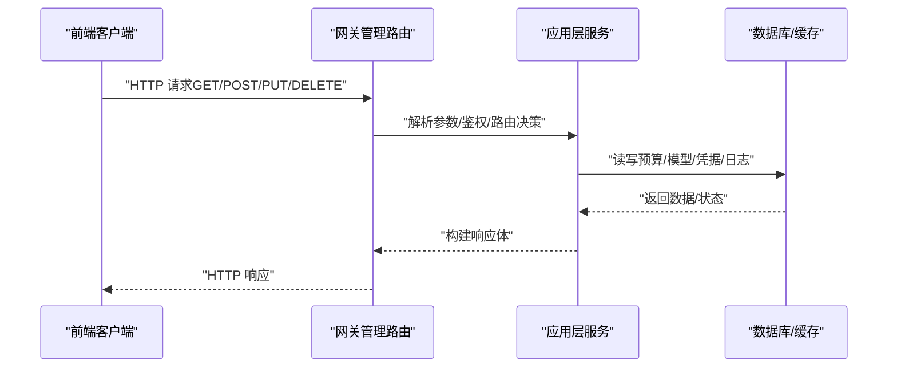

**图表来源**
- [main.py:475-480](file://backend/bootstrap/main.py#L475-L480)
- [routes.py:28-48](file://backend/domains/gateway/presentation/routers/routes.py#L28-L48)
- [budgets.py:58-64](file://backend/domains/gateway/presentation/routers/budgets.py#L58-L64)
- [credentials.py:1-200](file://backend/domains/gateway/presentation/routers/credentials.py#L1-L200)
- [models.py:1-200](file://backend/domains/gateway/presentation/routers/models.py#L1-L200)
- [quota_rules.py:1-200](file://backend/domains/gateway/presentation/routers/quota_rules.py#L1-L200)
- [pricing.py:1-200](file://backend/domains/gateway/presentation/routers/pricing.py#L1-L200)
- [logs.py:1-200](file://backend/domains/gateway/presentation/routers/logs.py#L1-L200)

## 详细组件分析

### 路由管理（虚拟模型与主备策略）
- 功能要点
  - 列出/创建/更新/删除路由
  - 定义虚拟模型到真实模型的映射
  - 配置通用回退与内容策略回退
- 关键端点
  - GET /api/v1/gateway/routes
  - POST /api/v1/gateway/routes
  - PUT /api/v1/gateway/routes/{id}
  - DELETE /api/v1/gateway/routes/{id}
- 鉴权与权限
  - 列表：当前团队成员
  - 创建/更新/删除：团队管理员
- 响应与错误
  - 成功返回RouteResponse
  - 失败返回标准HTTP状态码与错误信息

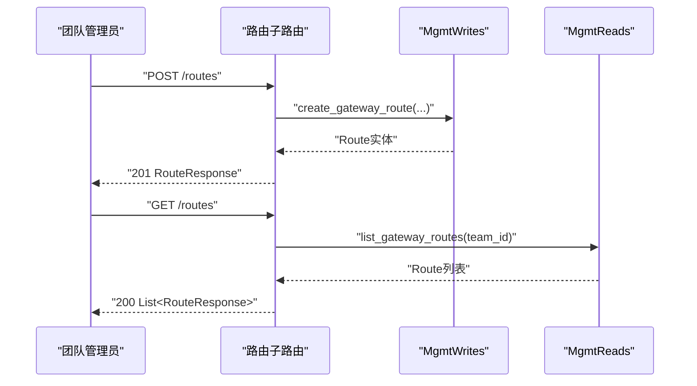

**图表来源**
- [routes.py:28-48](file://backend/domains/gateway/presentation/routers/routes.py#L28-L48)

**章节来源**
- [routes.py:28-48](file://backend/domains/gateway/presentation/routers/routes.py#L28-L48)

### 预算管理（成本与用量限额）
- 功能要点
  - 按目标类型（系统/租户/密钥/用户）与周期（日/月/总计）设定限额
  - 支持美元、Token、请求数三类限额，软上限用于预警
  - 支持按模型名限定
- 关键端点
  - GET /api/v1/gateway/teams/{teamId}/budgets
  - PUT /api/v1/gateway/teams/{teamId}/budgets
  - DELETE /api/v1/gateway/teams/{teamId}/budgets/{id}
- 前端封装
  - 列表、创建/更新、删除方法
  - 支持过滤参数：target_kind、model_name

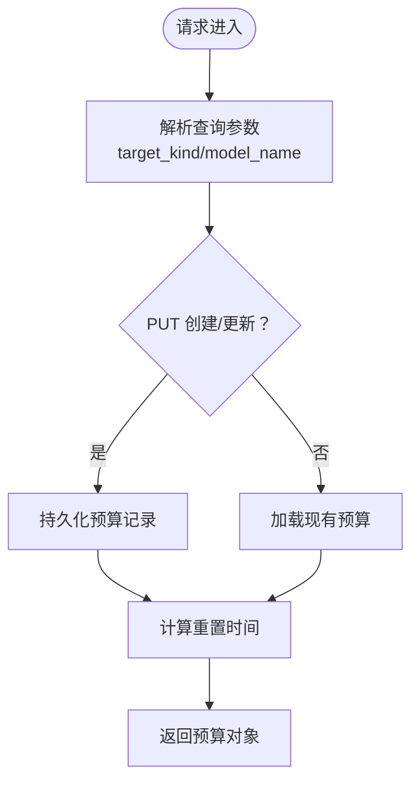

**图表来源**
- [budgets.py:46-64](file://backend/domains/gateway/presentation/routers/budgets.py#L46-L64)
- [budgets.ts:45-64](file://frontend/src/api/gateway/budgets.ts#L45-L64)

**章节来源**
- [budgets.py:46-64](file://backend/domains/gateway/presentation/routers/budgets.py#L46-L64)
- [budgets.ts:45-64](file://frontend/src/api/gateway/budgets.ts#L45-L64)
- [20260508_add_gateway_tables.py:340-367](file://backend/alembic/versions/20260508_add_gateway_tables.py#L340-L367)

### 凭据管理（提供商凭据与探测）
- 功能要点
  - 创建/更新/删除团队/个人凭据
  - 探测（Probe）凭据连通性与可用能力
  - 支持凭据作用域与API Base配置
- 关键端点
  - GET/POST/PUT/DELETE /api/v1/gateway/teams/{teamId}/credentials
  - POST /api/v1/gateway/teams/{teamId}/credentials/{id}/probe
- 前端封装
  - 凭据资源API导出
  - 探测结果用于UI提示

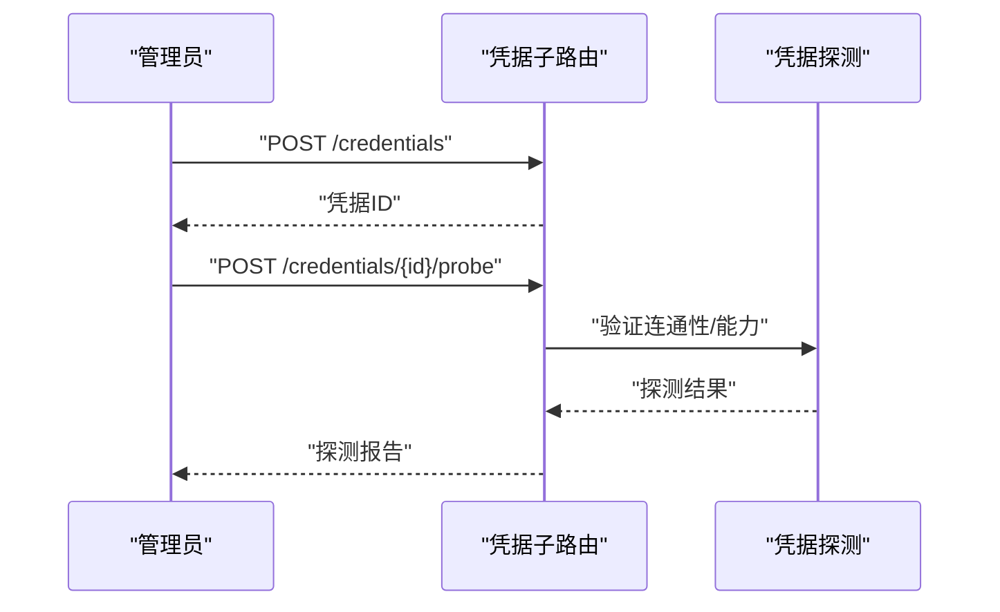

**图表来源**
- [credentials.py:1-200](file://backend/domains/gateway/presentation/routers/credentials.py#L1-L200)

**章节来源**
- [credentials.py:1-200](file://backend/domains/gateway/presentation/routers/credentials.py#L1-L200)

### 模型管理（注册、能力检测与测试）
- 功能要点
  - 注册/启用/禁用模型
  - 能力检测（如文本/图像/工具调用）
  - 模型测试（选择虚拟密钥或API Key进行连通性测试）
  - **新增**：个人模型支持多模型类型（text、image等）
  - **改进**：团队模型重复创建的错误处理逻辑
  - **增强**：duplicate detection和冲突检测机制
  - **优化**：批量测试支持并发控制和进度跟踪
- 关键端点
  - GET/POST/PUT/DELETE /api/v1/gateway/teams/{teamId}/models
  - POST /api/v1/gateway/teams/{teamId}/models/{name}/test
- 前端封装
  - 模型资源API导出
  - 测试支持选择模型与密钥

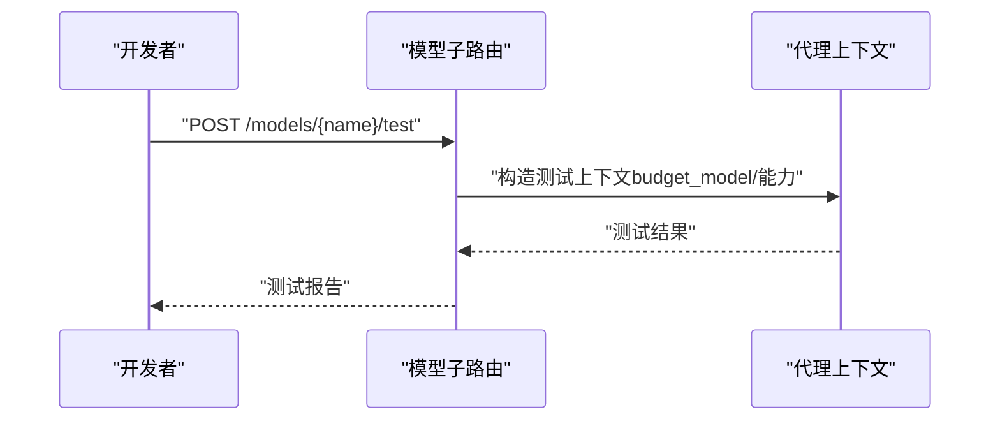

**图表来源**
- [models.py:1-200](file://backend/domains/gateway/presentation/routers/models.py#L1-L200)
- [proxy_context.py:33-59](file://backend/domains/gateway/application/proxy_context.py#L33-L59)

**章节来源**
- [models.py:1-200](file://backend/domains/gateway/presentation/routers/models.py#L1-L200)
- [proxy_context.py:33-59](file://backend/domains/gateway/application/proxy_context.py#L33-L59)

### 配额规则（统一限额来源与叠加）
- 功能要点
  - 平台/上游/下游三层限额来源
  - 支持按用户/凭据/模型/周期/窗口等维度叠加
  - 提供统一限额视图与使用情况
- 关键端点
  - GET /api/v1/gateway/teams/{teamId}/quota-rules
- 前端封装
  - 定义配额规则数据结构与来源引用

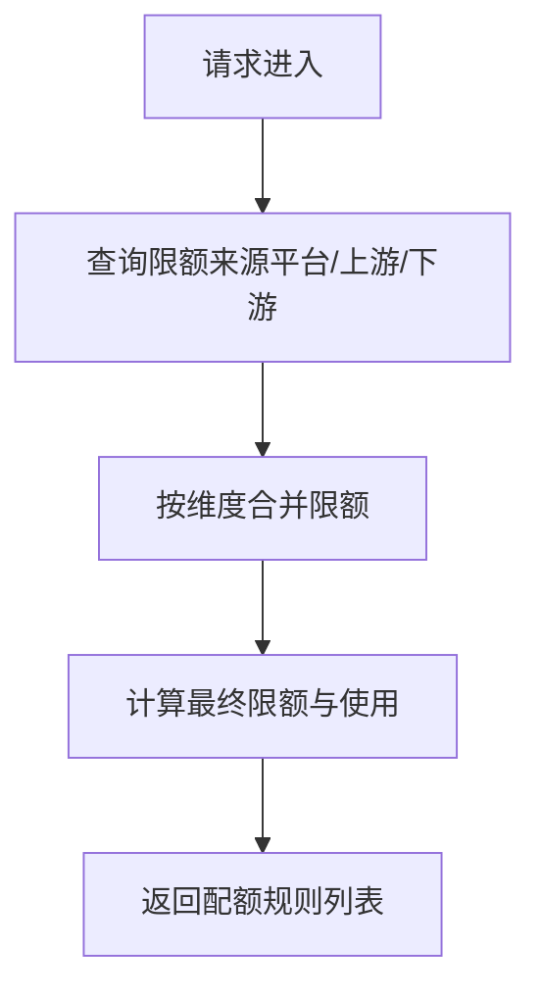

**图表来源**
- [quota_rules.py:1-200](file://backend/domains/gateway/presentation/routers/quota_rules.py#L1-L200)
- [quota-rules.ts:52-59](file://frontend/src/api/gateway/quota-rules.ts#L52-L59)

**章节来源**
- [quota_rules.py:1-200](file://backend/domains/gateway/presentation/routers/quota_rules.py#L1-L200)
- [quota-rules.ts:52-59](file://frontend/src/api/gateway/quota-rules.ts#L52-L59)

### 价格配置（上游价与下游价）
- 功能要点
  - 上游价：从提供商获取的计费单价
  - 下游价：面向租户的销售价格，支持继承策略
  - 快照：价格版本与显示货币转换
- 关键端点
  - GET /api/v1/gateway/pricing/my
  - GET /api/v1/gateway/pricing/snapshots
  - PUT /api/v1/gateway/pricing/mirror
- 权限说明
  - 管理员：完整读写
  - 普通成员：只读"我的价格"，上游字段掩码

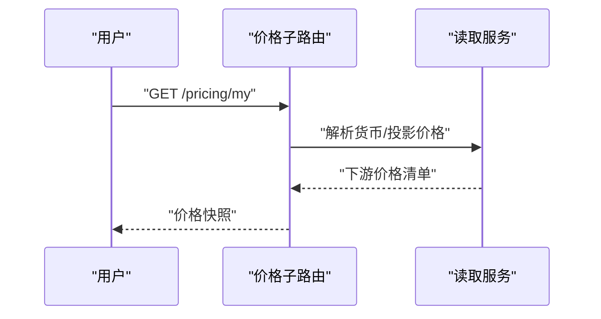

**图表来源**
- [pricing.py:1-200](file://backend/domains/gateway/presentation/routers/pricing.py#L1-L200)
- [GATEWAY_PRICING_AND_LITELLM_COST.html:928-939](file://backend/docs/gateway/GATEWAY_PRICING_AND_LITELLM_COST.html#L928-L939)

**章节来源**
- [pricing.py:1-200](file://backend/domains/gateway/presentation/routers/pricing.py#L1-L200)
- [GATEWAY_PRICING_AND_LITELLM_COST.html:928-939](file://backend/docs/gateway/GATEWAY_PRICING_AND_LITELLM_COST.html#L928-L939)

### 使用统计与日志（用量与成本）
- 功能要点
  - 请求日志：路由时间、提供商、用户、凭据等维度
  - 用量统计：按团队/模型/凭据聚合
  - 成本归集：以gateway_request_logs为准的对账机制
- 关键端点
  - GET /api/v1/gateway/logs/request
  - GET /api/v1/gateway/stats/usage
- 成本说明
  - 预算扣减与revenue_usd来源不同，以请求日志为准

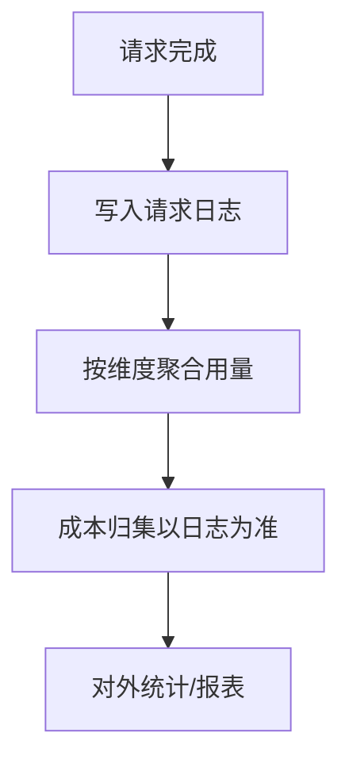

**图表来源**
- [logs.py:1-200](file://backend/domains/gateway/presentation/routers/logs.py#L1-L200)
- [GATEWAY_PRICING_AND_LITELLM_COST.html:915-926](file://backend/docs/gateway/GATEWAY_PRICING_AND_LITELLM_COST.html#L915-L926)

**章节来源**
- [logs.py:1-200](file://backend/domains/gateway/presentation/routers/logs.py#L1-L200)
- [GATEWAY_PRICING_AND_LITELLM_COST.html:915-926](file://backend/docs/gateway/GATEWAY_PRICING_AND_LITELLM_COST.html#L915-L926)

## 团队成员搜索功能

### React Query缓存优化与查询键标准化

**更新** 本次重大更新反映了团队成员搜索功能的React Query缓存优化实现，通过标准化查询键结构和智能缓存策略，显著提升了大团队场景下的性能表现。

#### 缓存优化实现细节

- **查询键标准化**：使用`['gateway', 'member-filter', teamId, deferredSearch]`作为标准化查询键，确保相同参数产生相同的缓存键
- **智能缓存策略**：30秒staleTime平衡实时性与性能，避免频繁的API调用
- **去重机制**：通过标准化查询键实现React Query的自动去重，避免重复请求
- **延迟搜索优化**：结合useDeferredValue实现搜索词的延迟处理，减少不必要的API调用

#### 前端集成与过滤钩子

- **useTeamMemberFilterSearch Hook**
  - 功能：团队成员筛选下拉框的智能搜索
  - 特性：下拉打开时按搜索词请求后端分页接口，避免全量加载
  - 参数：teamId、selectedUserId、enabled
  - 返回：options、onSearchQueryChange、onPickerOpenChange、remoteSearching、resolvingSelection
  - 性能：使用useDeferredValue延迟搜索，30秒缓存时间

- **查询键结构标准化**
  - 团队成员查询键：`gatewayTeamMembersQueryKey(teamId)`返回`['gateway', 'team-members', teamId]`
  - 搜索查询键：`['gateway', 'member-filter', teamId, deferredSearch]`
  - 统一的查询键命名约定确保缓存的一致性和可预测性

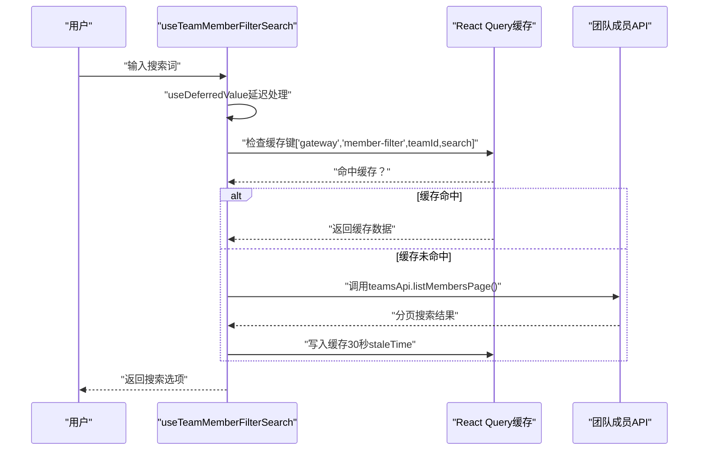

**图表来源**
- [use-team-member-filter-search.ts:55-65](file://frontend/src/features/gateway-usage/use-team-member-filter-search.ts#L55-L65)
- [use-gateway-team-members.ts:11-15](file://frontend/src/features/gateway-teams/use-gateway-team-members.ts#L11-L15)

#### API端点规范
团队成员搜索功能提供了高效的服务端分页搜索能力，避免全量加载超大团队成员列表：

- **列出团队成员（分页搜索）**
  - 方法：GET /api/v1/gateway/teams/{team_id}/members
  - 查询参数：
    - page: 分页页码（≥1）
    - page_size: 每页条数（1-200，默认20）
    - search: 搜索关键词（1-100字符，邮箱或姓名模糊匹配）
  - 响应：分页列表响应，包含total、items等字段
  - 权限：当前团队成员

- **列出可邀请用户候选**
  - 方法：GET /api/v1/gateway/teams/{team_id}/members/candidates
  - 查询参数：
    - page: 分页页码（≥1）
    - page_size: 每页条数（1-200，默认20）
    - search: 搜索关键词（1-100字符）
  - 响应：分页列表响应，排除已在团队内的成员
  - 权限：团队管理员

- **按邮箱查找用户（团队邀请前）**
  - 方法：GET /api/v1/gateway/teams/{team_id}/members/lookup
  - 查询参数：
    - email: 用户邮箱（3-320字符）
  - 响应：用户基本信息（id、email、name）
  - 权限：团队管理员

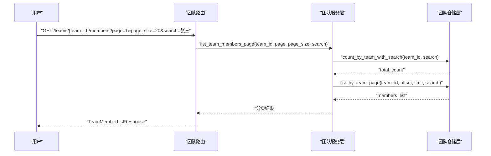

**图表来源**
- [teams_router.py:196-222](file://backend/domains/tenancy/presentation/teams_router.py#L196-L222)
- [team_repository.py:157-187](file://backend/domains/tenancy/infrastructure/repositories/team_repository.py#L157-L187)

### 集成应用场景
团队成员搜索功能在多个网关页面中得到集成：

- **网关日志页面**：在查看网关活动和日志时，支持按用户筛选
- **权限控制**：仅在非个人团队且聚合维度不是user时显示成员筛选
- **性能优化**：对于workspace模式下的大量成员场景，使用服务端搜索避免前端内存压力
- **缓存优化**：通过React Query缓存减少重复请求，提升用户体验

**章节来源**
- [use-team-member-filter-search.ts:1-97](file://frontend/src/features/gateway-usage/use-team-member-filter-search.ts#L1-L97)
- [use-gateway-team-members.ts:1-23](file://frontend/src/features/gateway-teams/use-gateway-team-members.ts#L1-L23)
- [teams_router.py:196-222](file://backend/domains/tenancy/presentation/teams_router.py#L196-L222)
- [teams_router.py:225-249](file://backend/domains/tenancy/presentation/teams_router.py#L225-L249)
- [teams_router.py:252-258](file://backend/domains/tenancy/presentation/teams_router.py#L252-L258)
- [team_repository.py:157-187](file://backend/domains/tenancy/infrastructure/repositories/team_repository.py#L157-L187)
- [team_service.py:227](file://backend/domains/tenancy/application/team_service.py#L227)
- [teams.ts:45-81](file://frontend/src/api/gateway/teams.ts#L45-L81)
- [logs.tsx:179-191](file://frontend/src/pages/gateway/logs.tsx#L179-L191)

## 批量操作优化

### 前端并发控制机制
网关API实现了高效的批量操作优化，主要通过前端并发控制来减少数据库往返次数：

- **并发度控制**：使用`runWithConcurrency`函数控制批量操作的并发数量
- **视频生成特殊处理**：视频生成模型使用较低的并发度（VIDEO_BATCH_TEST_CONCURRENCY）
- **进度跟踪**：提供onProgress回调实时反馈批量操作进度
- **错误收集**：自动收集失败的模型ID用于后续处理

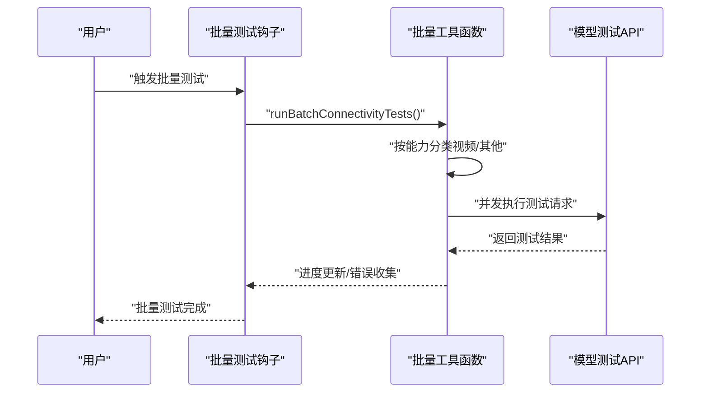

**图表来源**
- [utils.ts:453-493](file://frontend/src/features/gateway-models/utils.ts#L453-L493)
- [utils.ts:544-563](file://frontend/src/features/gateway-models/utils.ts#L544-L563)

### 批量操作分块处理
为了进一步优化性能，系统实现了批量操作的分块处理机制：

- **批量删除分块**：使用`chunkIdsForBatchOperation`将大量删除操作分批处理
- **跨团队批量处理**：支持按团队分组的批量操作，避免跨团队权限问题
- **顺序执行保证**：在需要保持操作顺序的场景使用顺序执行而非并发执行

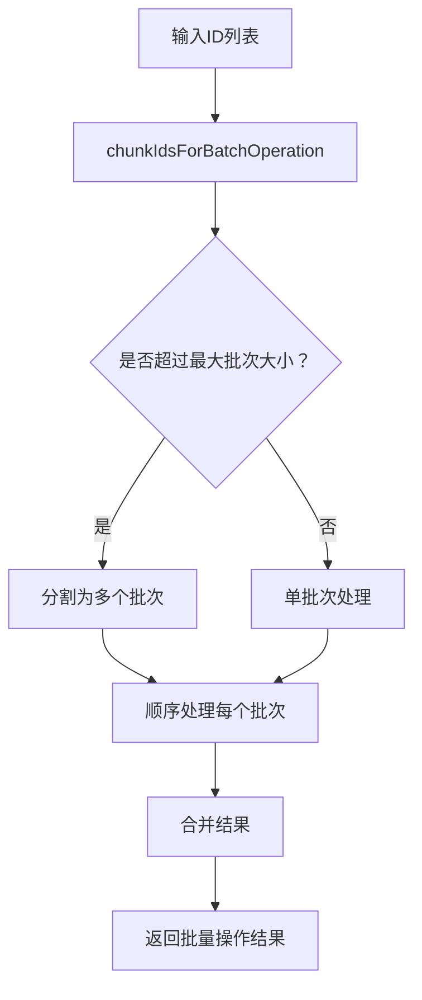

**图表来源**
- [utils.ts:682-740](file://frontend/src/features/gateway-models/utils.ts#L682-L740)
- [utils.ts:818-858](file://frontend/src/features/gateway-models/utils.ts#L818-L858)

### 跨团队批量操作
系统支持跨团队的批量操作，通过智能分组和权限验证确保操作的安全性和效率：

- **团队归属解析**：使用`resolveGatewayModelTeamId`解析模型的团队归属
- **按团队分组**：使用`groupModelsByTeamId`将模型按团队进行分组
- **权限验证**：在批量操作前验证用户的管理权限

**章节来源**
- [utils.ts:453-493](file://frontend/src/features/gateway-models/utils.ts#L453-L493)
- [utils.ts:682-740](file://frontend/src/features/gateway-models/utils.ts#L682-L740)
- [utils.ts:818-858](file://frontend/src/features/gateway-models/utils.ts#L818-L858)
- [utils.ts:898-924](file://frontend/src/features/gateway-models/utils.ts#L898-L924)

## 依赖关系分析
- 路由聚合
  - 应用入口在统一前缀/api/v1/gateway下挂载网关管理路由
  - 各子路由模块导出独立APIRouter，由聚合模块统一加前缀
- 数据模型
  - 预算表结构包含限额、用量、重置时间等字段
  - **用户模型表结构支持多模型类型存储**
  - 用户模型数据迁移确保向后兼容性
  - **团队成员搜索功能依赖用户表的邮箱和姓名字段**
- 前端集成
  - 前端聚合导出各资源API，便于调用与类型安全
  - **批量操作工具函数提供统一的批量处理接口**
  - **团队成员搜索钩子集成到网关使用统计页面**
  - **React Query缓存优化确保查询键的一致性和去重效果**

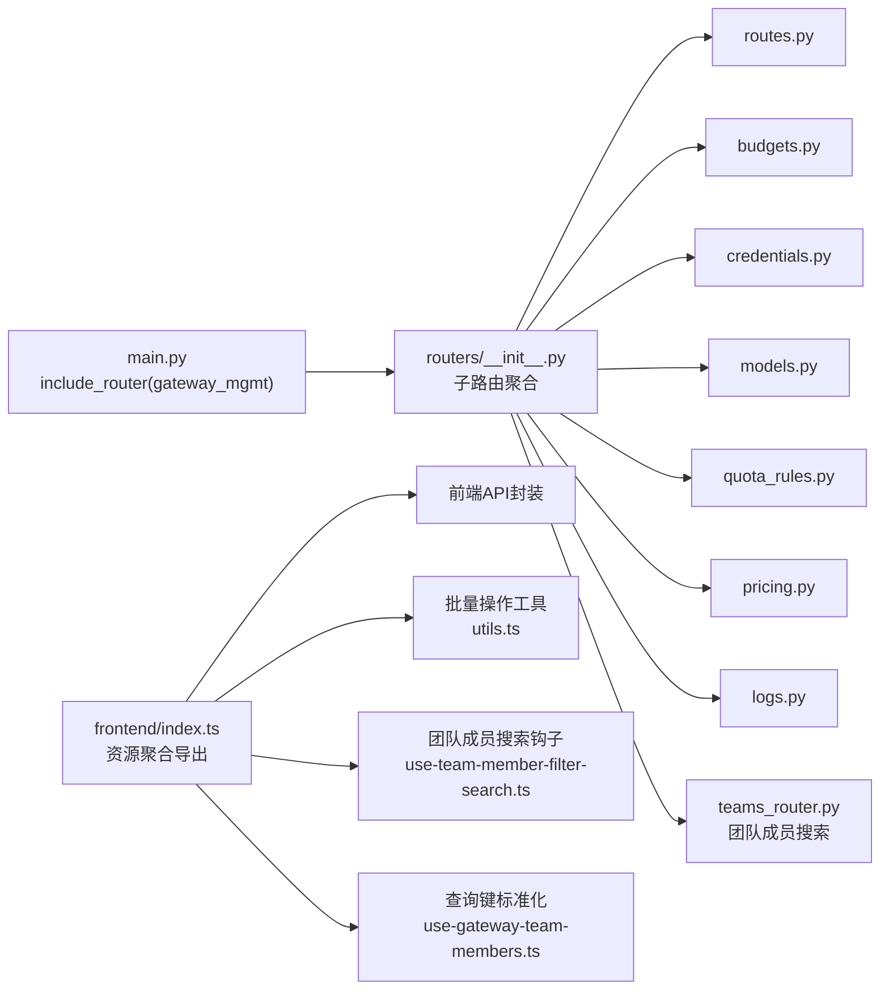

**图表来源**
- [main.py:475-480](file://backend/bootstrap/main.py#L475-L480)
- [__init__.py（网关presentation路由聚合）:1-5](file://backend/domains/gateway/presentation/routers/__init__.py#L1-L5)
- [index.ts:16-31](file://frontend/src/api/gateway/index.ts#L16-L31)
- [utils.ts:453-493](file://frontend/src/features/gateway-models/utils.ts#L453-L493)
- [use-team-member-filter-search.ts:1-97](file://frontend/src/features/gateway-usage/use-team-member-filter-search.ts#L1-L97)
- [use-gateway-team-members.ts:11-15](file://frontend/src/features/gateway-teams/use-gateway-team-members.ts#L11-L15)

**章节来源**
- [main.py:475-480](file://backend/bootstrap/main.py#L475-L480)
- [__init__.py（网关presentation路由聚合）:1-5](file://backend/domains/gateway/presentation/routers/__init__.py#L1-L5)
- [index.ts:16-31](file://frontend/src/api/gateway/index.ts#L16-L31)
- [utils.ts:453-493](file://frontend/src/features/gateway-models/utils.ts#L453-L493)
- [use-team-member-filter-search.ts:1-97](file://frontend/src/features/gateway-usage/use-team-member-filter-search.ts#L1-L97)
- [use-gateway-team-members.ts:11-15](file://frontend/src/features/gateway-teams/use-gateway-team-members.ts#L11-L15)

## 性能考虑
- **索引优化**：针对热点查询字段建立索引，减少慢查询
- **缓存策略**：对常用配置（价格、模型能力）进行缓存
- **批量操作优化**：通过前端并发控制和分块处理减少数据库往返次数
- **连接池**：数据库与外部提供商API连接池复用
- **异步处理**：日志写入与用量聚合异步化
- **模型类型优化**：多模型类型存储减少重复模型条目，提高查询效率
- **并发控制**：视频生成等高延迟操作使用独立的并发控制策略
- **进度反馈**：批量操作提供实时进度反馈，改善用户体验
- **团队成员搜索优化**：使用分页搜索避免全量加载，30秒缓存时间平衡实时性与性能
- **前端延迟处理**：useDeferredValue延迟搜索请求，减少频繁的API调用
- **React Query缓存优化**：通过标准化查询键实现自动去重，避免重复请求
- **查询键结构标准化**：统一的查询键命名约定确保缓存的一致性和可预测性

**更新**：本次性能优化重点在于团队成员搜索功能的React Query缓存优化，通过标准化查询键结构和智能缓存策略，显著提升了大团队场景下的用户体验和系统性能。

## 故障排查指南
- **网关代理测试**
  - 使用测试脚本发起代理请求，验证虚拟密钥与模型连通性
  - 支持指定环境文件与令牌
- **日志检查**
  - 查看最近请求日志，定位路由时间、提供商、错误原因
  - 支持按用户、时间段过滤
- **模型管理故障排查**
  - 检查个人模型多类型支持是否正常工作
  - 验证团队模型重复创建的错误处理逻辑
  - 确认duplicate detection和冲突检测机制有效
- **批量操作故障排查**
  - 检查并发控制设置是否合理
  - 验证分块处理是否正确执行
  - 确认跨团队批量操作的权限验证
- **团队成员搜索故障排查**
  - 检查搜索关键词长度限制（1-100字符）
  - 验证分页参数范围（1-200）
  - 确认用户邮箱格式和姓名字段完整性
  - 排查前端钩子的enabled条件和pickerOpen状态
  - **验证React Query缓存键是否标准化**
  - **检查查询键结构是否符合['gateway','member-filter',teamId,search]格式**
  - **确认staleTime设置为30秒且缓存是否正确生效**

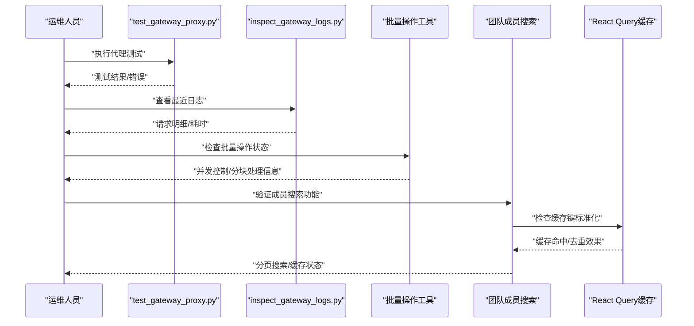

**图表来源**
- [test_gateway_proxy.py:32-35](file://backend/scripts/test_gateway_proxy.py#L32-L35)
- [inspect_gateway_logs.py:7-10](file://backend/scripts/inspect_gateway_logs.py#L7-L10)

**章节来源**
- [test_gateway_proxy.py:32-35](file://backend/scripts/test_gateway_proxy.py#L32-L35)
- [inspect_gateway_logs.py:7-10](file://backend/scripts/inspect_gateway_logs.py#L7-L10)

## 结论
本文档系统梳理了网关API的核心能力与端点规范，涵盖路由、预算、凭据、模型、配额、价格与日志等模块。通过统一的管理路由聚合与清晰的职责划分，实现了灵活的LLM接入与成本控制。

**最新更新**：
- 模型管理功能已增强，支持个人模型多模型类型（text、image等）
- 团队模型重复创建的错误处理逻辑得到改进
- duplicate detection和冲突检测机制更加完善
- **团队成员搜索功能**：新增服务端分页搜索API，支持邮箱和姓名模糊匹配，避免全量加载超大团队成员列表
- **前端过滤钩子集成**：useTeamMemberFilterSearch钩子实现智能搜索和分页加载，提升大团队场景下的用户体验
- **React Query缓存优化**：通过标准化查询键结构和智能缓存策略，显著提升团队成员搜索功能的性能和缓存效率
- **查询键结构标准化**：统一的查询键命名约定确保缓存的一致性和可预测性
- **批量操作优化**：通过前端并发控制和分块处理显著减少数据库往返次数，提高响应时间

建议在生产环境中结合索引优化、缓存与异步处理提升性能，并利用测试脚本与日志工具进行持续监控与排障。团队成员搜索功能的分页机制、React Query缓存优化和查询键标准化为大规模团队协作提供了高效解决方案。批量操作的并发控制和分块处理机制为大规模模型管理提供了高效解决方案。

## 附录
- **鉴权与限流**
  - 鉴权：虚拟密钥（vkey）与平台API Key（apikey）两种入站路径
  - 限流：RPM/TPM限制与配额叠加策略协同
- **实用示例**
  - 凭据验证：POST /teams/{teamId}/credentials/{id}/probe
  - 模型测试：POST /teams/{teamId}/models/{name}/test
  - 连接性检查：GET /health（服务根级健康检查）
  - **团队成员搜索**：GET /teams/{team_id}/members?page=1&page_size=20&search=张三
- **模型管理新特性**
  - 个人模型多类型支持：text、image等类型可同时存在
  - 改进的重复创建检测：避免团队模型重复创建
  - 增强的冲突检测：确保模型配置一致性
- **团队成员搜索新特性**
  - **分页搜索**：支持1-200条每页的分页查询
  - **模糊匹配**：支持邮箱和姓名的模糊搜索
  - **智能缓存**：30秒缓存时间平衡实时性与性能
  - **前端集成**：useTeamMemberFilterSearch钩子自动处理搜索状态
  - **React Query优化**：标准化查询键实现自动去重和缓存优化
  - **查询键标准化**：统一的查询键命名约定确保缓存一致性
- **批量操作最佳实践**
  - 视频生成模型使用较低并发度
  - 批量删除操作建议不超过200个模型
  - 跨团队批量操作需确保用户具备相应权限
  - 监控批量操作的错误率和成功率
- **缓存策略参考**
  - **团队成员搜索缓存**：30秒staleTime，避免频繁API调用
  - **团队成员查询键**：`['gateway', 'team-members', teamId]`标准化命名
  - **搜索查询键**：`['gateway', 'member-filter', teamId, search]`统一格式
  - **凭据探测缓存**：5分钟staleTime，确保探测结果新鲜度