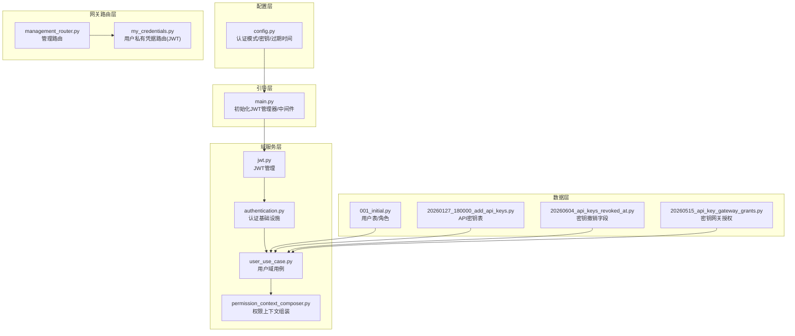
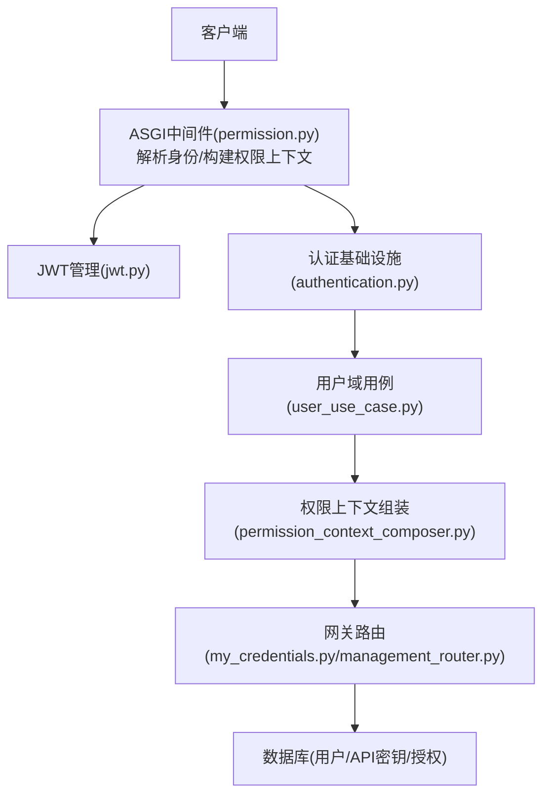
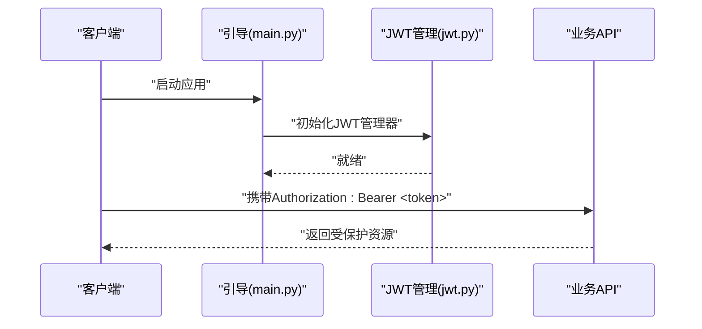
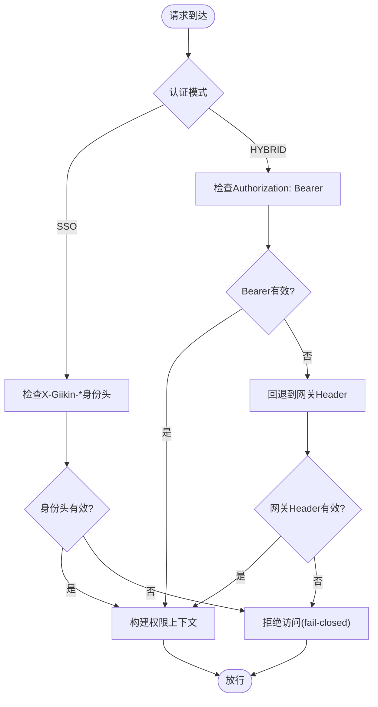
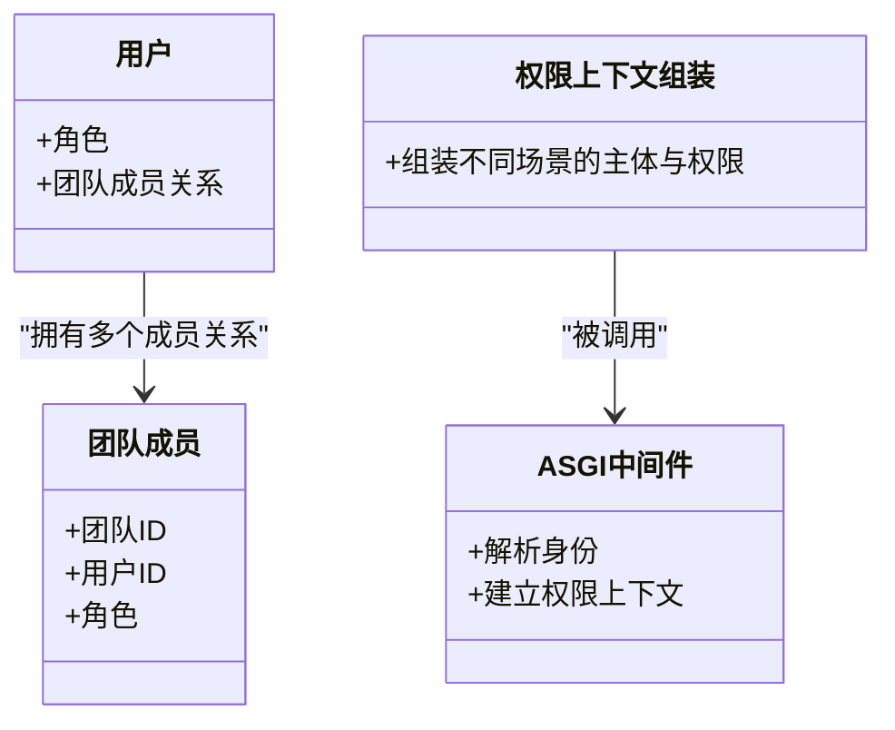
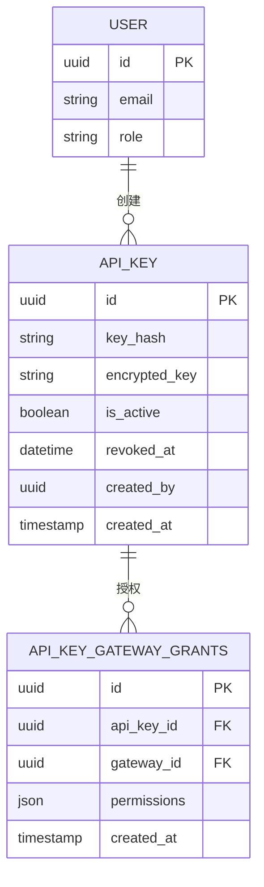
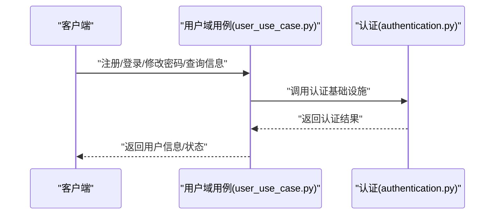
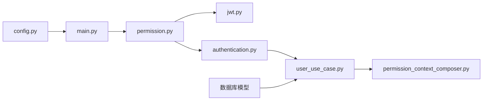

# 身份认证API

<cite>
**本文引用的文件**
- [AUTHENTICATION.md](file://backend/docs/AUTHENTICATION.md)
- [SSO.md](file://docs/SSO.md)
- [config.py](file://backend/bootstrap/config.py)
- [main.py](file://backend/bootstrap/main.py)
- [jwt.py](file://backend/domains/identity/infrastructure/auth/jwt.py)
- [authentication.py](file://backend/domains/identity/infrastructure/authentication.py)
- [user_use_case.py](file://backend/domains/identity/application/user_use_case.py)
- [permission_context_composer.py](file://backend/domains/identity/application/permission_context_composer.py)
- [permission.py](file://backend/libs/middleware/permission.py)
- [001_initial.py](file://backend/alembic/versions/001_initial.py)
- [20260127_180000_add_api_keys.py](file://backend/alembic/versions/20260127_180000_add_api_keys.py)
- [20260604_api_keys_revoked_at.py](file://backend/alembic/versions/20260604_api_keys_revoked_at.py)
- [20260515_api_key_gateway_grants.py](file://backend/alembic/versions/20260515_api_key_gateway_grants.py)
- [my_credentials.py](file://backend/domains/gateway/presentation/routers/my_credentials.py)
- [management_router.py](file://backend/domains/gateway/presentation/management_router.py)
- [test_auth_me.py](file://backend/tests/integration/api/test_auth_me.py)
- [test_jwt.py](file://backend/tests/unit/core/auth/test_jwt.py)
- [test_api_key_service.py](file://backend/tests/unit/core/auth/test_api_key_service.py)
</cite>

## 目录
1. [简介](#简介)
2. [项目结构](#项目结构)
3. [核心组件](#核心组件)
4. [架构总览](#架构总览)
5. [详细组件分析](#详细组件分析)
6. [依赖关系分析](#依赖关系分析)
7. [性能考虑](#性能考虑)
8. [故障排查指南](#故障排查指南)
9. [结论](#结论)
10. [附录](#附录)

## 简介
本文件面向AI Agent项目的身份认证API，覆盖用户注册、登录、权限管理、API密钥管理等核心能力，并对JWT令牌管理、SSO集成、角色权限控制、个人中心功能以及认证中间件的安全策略进行系统化说明。文档以仓库中的实际实现为依据，提供可操作的接口使用指南与最佳实践。

## 项目结构
认证相关能力主要分布在以下模块：
- 配置层：认证模式、JWT参数、SSO开关等
- 引导层：应用启动时初始化JWT管理器与中间件
- 域服务层：用户域用例、权限上下文组装、认证基础设施
- 网关路由层：用户私有凭据路由（JWT专用）
- 数据迁移层：用户表、API密钥表、授权关联等数据库结构
- 测试层：认证与权限相关集成与单元测试

**图表来源**
- [config.py:211-244](file://backend/bootstrap/config.py#L211-L244)
- [main.py:67-137](file://backend/bootstrap/main.py#L67-L137)
- [jwt.py](file://backend/domains/identity/infrastructure/auth/jwt.py)
- [authentication.py](file://backend/domains/identity/infrastructure/authentication.py)
- [user_use_case.py:127-127](file://backend/domains/identity/application/user_use_case.py#L127-L127)
- [permission_context_composer.py:1-10](file://backend/domains/identity/application/permission_context_composer.py#L1-L10)
- [management_router.py:1-10](file://backend/domains/gateway/presentation/management_router.py#L1-L10)
- [my_credentials.py:1-5](file://backend/domains/gateway/presentation/routers/my_credentials.py#L1-L5)
- [001_initial.py:29-29](file://backend/alembic/versions/001_initial.py#L29-L29)
- [20260127_180000_add_api_keys.py](file://backend/alembic/versions/20260127_180000_add_api_keys.py)
- [20260604_api_keys_revoked_at.py](file://backend/alembic/versions/20260604_api_keys_revoked_at.py)
- [20260515_api_key_gateway_grants.py](file://backend/alembic/versions/20260515_api_key_gateway_grants.py)

**章节来源**
- [config.py:211-244](file://backend/bootstrap/config.py#L211-L244)
- [main.py:67-137](file://backend/bootstrap/main.py#L67-L137)

## 核心组件
- 认证模式与配置
  - 支持三种模式：本地邮箱密码（local）、单点登录（sso）、混合（hybrid）。通过配置项控制，默认为local。
  - JWT参数：算法、过期时间、密钥来源与回退逻辑。
- JWT管理器
  - 应用启动时初始化JWT管理器，确保令牌签发与校验可用。
- 权限上下文与中间件
  - 权限上下文组装入口负责在不同调用场景（JWT/Gateway/后台任务/流式响应）中注入正确的主体与权限。
  - ASGI中间件在请求进入业务前解析身份并建立权限上下文。
- 用户域用例
  - 自助注册由FastAPI Users处理，注册完成后回调通知。
- 网关用户私有凭据路由
  - 提供JWT专用的用户私有凭据访问端点，无需团队路径参数。

**章节来源**
- [config.py:211-244](file://backend/bootstrap/config.py#L211-L244)
- [config.py:188-194](file://backend/bootstrap/config.py#L188-L194)
- [config.py:247-257](file://backend/bootstrap/config.py#L247-L257)
- [main.py:67-137](file://backend/bootstrap/main.py#L67-L137)
- [permission_context_composer.py:1-10](file://backend/domains/identity/application/permission_context_composer.py#L1-L10)
- [permission.py](file://backend/libs/middleware/permission.py)
- [user_use_case.py:127-127](file://backend/domains/identity/application/user_use_case.py#L127-L127)
- [my_credentials.py:1-5](file://backend/domains/gateway/presentation/routers/my_credentials.py#L1-L5)
- [management_router.py:1-10](file://backend/domains/gateway/presentation/management_router.py#L1-L10)

## 架构总览
认证体系围绕“配置—引导—域服务—路由—数据”五层展开，结合JWT与SSO两种身份来源，通过中间件在请求生命周期早期完成身份解析与权限上下文注入。

**图表来源**
- [permission.py](file://backend/libs/middleware/permission.py)
- [jwt.py](file://backend/domains/identity/infrastructure/auth/jwt.py)
- [authentication.py](file://backend/domains/identity/infrastructure/authentication.py)
- [user_use_case.py:127-127](file://backend/domains/identity/application/user_use_case.py#L127-L127)
- [permission_context_composer.py:1-10](file://backend/domains/identity/application/permission_context_composer.py#L1-L10)
- [my_credentials.py:1-5](file://backend/domains/gateway/presentation/routers/my_credentials.py#L1-L5)
- [management_router.py:1-10](file://backend/domains/gateway/presentation/management_router.py#L1-L10)

## 详细组件分析

### JWT令牌管理
- 初始化与参数
  - 应用启动时初始化JWT管理器，确保令牌签发与校验可用。
  - JWT算法、过期时间、密钥来源与回退逻辑在配置中定义。
- 使用建议
  - 生产环境务必替换默认密钥与过期时间。
  - 严格区分“JWT密钥”与“JWT密钥字符串”，避免默认值导致的安全风险。

**图表来源**
- [main.py:67-137](file://backend/bootstrap/main.py#L67-L137)
- [jwt.py](file://backend/domains/identity/infrastructure/auth/jwt.py)
- [config.py:188-194](file://backend/bootstrap/config.py#L188-L194)

**章节来源**
- [main.py:67-137](file://backend/bootstrap/main.py#L67-L137)
- [config.py:188-194](file://backend/bootstrap/config.py#L188-L194)

### SSO集成（HiGress + Giikin）
- 模式与要求
  - sso与hybrid模式下，必须启用内部密钥（internal_key），否则可能被绕过网关伪造身份。
  - SSO模式信任网关注入的X-Giikin-*身份头，采用fail-closed策略。
- 实施要点
  - 确保网关侧正确注入身份头。
  - 生产环境禁止使用默认internal_key。
  - hybrid模式下，若无有效Bearer JWT，自动回退到网关Header。

**图表来源**
- [config.py:211-244](file://backend/bootstrap/config.py#L211-L244)
- [config.py:256-257](file://backend/bootstrap/config.py#L256-L257)

**章节来源**
- [config.py:211-244](file://backend/bootstrap/config.py#L211-L244)
- [config.py:256-257](file://backend/bootstrap/config.py#L256-L257)

### 角色权限控制与权限上下文
- 角色与成员关系
  - 用户表包含角色字段；团队成员表记录team_id、user_id、role等。
- 权限上下文
  - 权限上下文组装入口统一处理不同场景下的主体与权限，确保下游业务一致的行为。
- 中间件
  - ASGI中间件在请求进入业务前解析身份并建立权限上下文，保证所有API均受控于权限框架。

**图表来源**
- [001_initial.py:29-29](file://backend/alembic/versions/001_initial.py#L29-L29)
- [permission_context_composer.py:1-10](file://backend/domains/identity/application/permission_context_composer.py#L1-L10)
- [permission.py](file://backend/libs/middleware/permission.py)

**章节来源**
- [001_initial.py:29-29](file://backend/alembic/versions/001_initial.py#L29-L29)
- [permission_context_composer.py:1-10](file://backend/domains/identity/application/permission_context_composer.py#L1-L10)
- [permission.py](file://backend/libs/middleware/permission.py)

### API密钥管理
- 数据模型
  - API密钥表包含密钥、加密存储、状态与关联字段；支持撤销字段与网关授权关联。
- 生命周期
  - 创建：生成唯一密钥与必要元数据。
  - 撤销：更新撤销时间戳，使密钥失效。
  - 授权：通过网关授权表为密钥分配访问范围。
- 安全建议
  - 密钥仅在创建时可见，请妥善保存。
  - 定期轮换密钥，限制有效期。
  - 最小权限原则：按需授予网关授权。

**图表来源**
- [20260127_180000_add_api_keys.py](file://backend/alembic/versions/20260127_180000_add_api_keys.py)
- [20260604_api_keys_revoked_at.py](file://backend/alembic/versions/20260604_api_keys_revoked_at.py)
- [20260515_api_key_gateway_grants.py](file://backend/alembic/versions/20260515_api_key_gateway_grants.py)

**章节来源**
- [20260127_180000_add_api_keys.py](file://backend/alembic/versions/20260127_180000_add_api_keys.py)
- [20260604_api_keys_revoked_at.py](file://backend/alembic/versions/20260604_api_keys_revoked_at.py)
- [20260515_api_key_gateway_grants.py](file://backend/alembic/versions/20260515_api_key_gateway_grants.py)

### 个人中心与用户域用例
- 自助注册
  - 由FastAPI Users处理，注册成功后触发回调。
- 个人信息与密码
  - 用户域用例提供个人信息查询与密码修改等能力（具体接口路径见测试与路由定义）。
- 账户激活
  - 通过FastAPI Users的激活流程完成账户激活（具体接口路径见测试与路由定义）。

**图表来源**
- [user_use_case.py:127-127](file://backend/domains/identity/application/user_use_case.py#L127-L127)
- [authentication.py](file://backend/domains/identity/infrastructure/authentication.py)

**章节来源**
- [user_use_case.py:127-127](file://backend/domains/identity/application/user_use_case.py#L127-L127)

### 网关用户私有凭据路由（JWT专用）
- 路由特性
  - 该子路由仅支持JWT，不依赖团队路径参数，适合用户级私有凭据访问。
- 使用场景
  - 用户查看/管理自己的凭据，无需团队上下文。

**章节来源**
- [my_credentials.py:1-5](file://backend/domains/gateway/presentation/routers/my_credentials.py#L1-L5)
- [management_router.py:1-10](file://backend/domains/gateway/presentation/management_router.py#L1-L10)

## 依赖关系分析
- 配置驱动行为
  - 认证模式与密钥参数决定运行时行为（JWT/SSO/hybrid）。
- 引导层装配
  - 启动时初始化JWT管理器与中间件，确保后续请求处理链可用。
- 权限上下文贯穿
  - 中间件与域服务共同保证权限上下文在各层一致。
- 数据模型支撑
  - 用户表、API密钥表与授权表构成认证与授权的数据基础。

**图表来源**
- [config.py:211-244](file://backend/bootstrap/config.py#L211-L244)
- [main.py:67-137](file://backend/bootstrap/main.py#L67-L137)
- [permission.py](file://backend/libs/middleware/permission.py)
- [jwt.py](file://backend/domains/identity/infrastructure/auth/jwt.py)
- [authentication.py](file://backend/domains/identity/infrastructure/authentication.py)
- [user_use_case.py:127-127](file://backend/domains/identity/application/user_use_case.py#L127-L127)
- [permission_context_composer.py:1-10](file://backend/domains/identity/application/permission_context_composer.py#L1-L10)

**章节来源**
- [config.py:211-244](file://backend/bootstrap/config.py#L211-L244)
- [main.py:67-137](file://backend/bootstrap/main.py#L67-L137)

## 性能考虑
- JWT热路径
  - 权限上下文获取与团队成员查询存在热路径优化，建议在高频场景下复用缓存或短TTL策略。
- SSO回退
  - hybrid模式下回退到网关Header会增加一次解析成本，建议在无Bearer时尽量减少不必要的请求。

**章节来源**
- [config.py:396-396](file://backend/bootstrap/config.py#L396-L396)

## 故障排查指南
- JWT相关
  - 确认密钥未使用默认值；检查算法与过期时间配置；验证令牌格式与签名。
- SSO相关
  - 确认网关已注入X-Giikin-*身份头；确认internal_key已正确配置；hybrid模式下检查Bearer优先级。
- 权限相关
  - 检查权限上下文是否正确注入；核对用户角色与团队成员关系；确认中间件生效。
- API密钥相关
  - 检查密钥是否已撤销；核对网关授权范围；确认密钥仅在创建时可见。

**章节来源**
- [test_jwt.py](file://backend/tests/unit/core/auth/test_jwt.py)
- [test_auth_me.py](file://backend/tests/integration/api/test_auth_me.py)
- [test_api_key_service.py](file://backend/tests/unit/core/auth/test_api_key_service.py)

## 结论
本认证体系以配置驱动、中间件前置、权限上下文统一为核心设计，结合JWT与SSO两种身份来源，满足本地注册、登录、权限管理与API密钥管理等核心需求。生产部署需重点关注密钥安全、SSO回退策略与权限最小化原则。

## 附录
- 相关文档
  - 认证设计与策略参考：[AUTHENTICATION.md](file://backend/docs/AUTHENTICATION.md)
  - SSO集成与网关桥接参考：[SSO.md](file://docs/SSO.md)