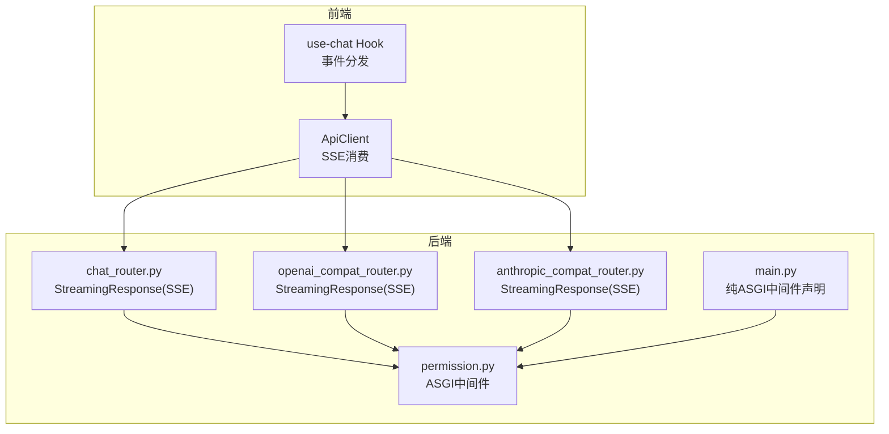
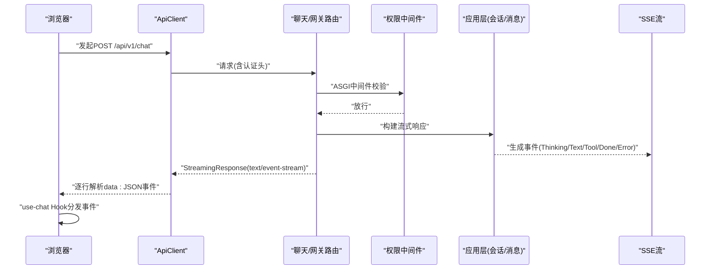
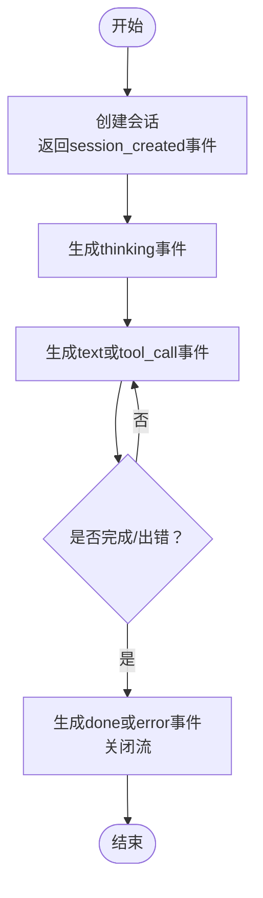
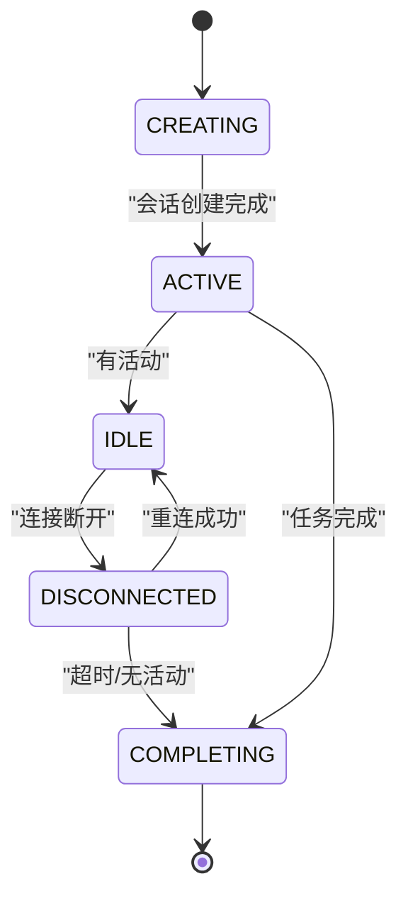
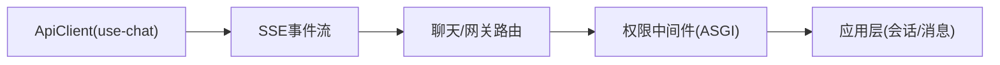

# WebSocket接口

<cite>
**本文引用的文件**
- [chat_router.py](file://backend/domains/agent/presentation/chat_router.py)
- [anthropic_compat_router.py](file://backend/domains/gateway/presentation/anthropic_compat_router.py)
- [openai_compat_router.py](file://backend/domains/gateway/presentation/openai_compat_router.py)
- [client.ts](file://frontend/src/api/client.ts)
- [use-chat.ts](file://frontend/src/hooks/use-chat.ts)
- [test_chat_api.py](file://backend/tests/integration/api/test_chat_api.py)
- [test_sse_stream.py](file://docs/系统可测试性与TDD设计.md)
- [execution_config_e2e.py](file://backend/tests/e2e/test_execution_config_e2e.py)
- [client.py](file://backend/domains/agent/infrastructure/tools/mcp/client.py)
- [execution_config.py](file://backend/libs/config/execution_config.py)
- [main.py](file://backend/bootstrap/main.py)
- [permission.py](file://backend/libs/middleware/permission.py)
- [session_repository.py](file://backend/domains/session/domain/interfaces/session_repository.py)
- [message_repository.py](file://backend/domains/agent/domain/interfaces/message_repository.py)
- [沙箱资源管理设计文档.md](file://backend/docs/沙箱资源管理设计文档.md)
</cite>

## 目录
1. [简介](#简介)
2. [项目结构](#项目结构)
3. [核心组件](#核心组件)
4. [架构总览](#架构总览)
5. [详细组件分析](#详细组件分析)
6. [依赖关系分析](#依赖关系分析)
7. [性能考量](#性能考量)
8. [故障排查指南](#故障排查指南)
9. [结论](#结论)
10. [附录](#附录)

## 简介
本文件面向AI Agent项目的实时通信能力，聚焦于WebSocket与SSE两种流式传输方案的实现与使用。当前仓库以SSE为主要实现场景，WebSocket作为MCP工具链的可选传输之一存在。本文将从连接建立、消息格式与事件类型、聊天会话协议、流式响应差异、连接管理策略、客户端实现示例与最佳实践、订阅与取消机制、调试与监控方法以及跨浏览器兼容性等方面进行全面说明。

## 项目结构
围绕WebSocket/SSE接口的关键目录与文件如下：
- 后端路由层：聊天与网关兼容路由均采用StreamingResponse输出SSE流
- 前端客户端：统一通过ApiClient消费SSE事件流
- 测试用例：覆盖SSE事件格式、错误事件与会话隔离等场景
- MCP工具链：支持ws/wss URL解析并映射为HTTP传输（当前未直接暴露WebSocket端点）

图表来源
- [chat_router.py:207-264](file://backend/domains/agent/presentation/chat_router.py#L207-L264)
- [openai_compat_router.py:93-95](file://backend/domains/gateway/presentation/openai_compat_router.py#L93-L95)
- [anthropic_compat_router.py:106-108](file://backend/domains/gateway/presentation/anthropic_compat_router.py#L106-L108)
- [permission.py:1-20](file://backend/libs/middleware/permission.py#L1-L20)
- [main.py:220-230](file://backend/bootstrap/main.py#L220-L230)

章节来源
- [chat_router.py:18-20](file://backend/domains/agent/presentation/chat_router.py#L18-L20)
- [openai_compat_router.py:21-21](file://backend/domains/gateway/presentation/openai_compat_router.py#L21-L21)
- [anthropic_compat_router.py:13-13](file://backend/domains/gateway/presentation/anthropic_compat_router.py#L13-L13)
- [permission.py:1-20](file://backend/libs/middleware/permission.py#L1-L20)
- [main.py:220-230](file://backend/bootstrap/main.py#L220-L230)

## 核心组件
- SSE流式响应（当前主推）
  - 路由层统一返回text/event-stream，事件以"data:"行承载JSON负载
  - 支持thinking、text/tool_call、done、error等事件类型
- WebSocket（MCP工具链支持）
  - MCP客户端支持ws/wss URL解析，并映射为HTTP传输
  - 当前未在聊天API中直接暴露WebSocket端点
- 前端SSE客户端
  - ApiClient基于ReadableStream Reader逐行解析SSE
  - use-chat Hook根据事件类型更新会话状态与消息流

章节来源
- [chat_router.py:207-264](file://backend/domains/agent/presentation/chat_router.py#L207-L264)
- [openai_compat_router.py:93-95](file://backend/domains/gateway/presentation/openai_compat_router.py#L93-L95)
- [anthropic_compat_router.py:106-108](file://backend/domains/gateway/presentation/anthropic_compat_router.py#L106-L108)
- [client.ts:417-470](file://frontend/src/api/client.ts#L417-L470)
- [use-chat.ts:145-169](file://frontend/src/hooks/use-chat.ts#L145-L169)
- [client.py:61-66](file://backend/domains/agent/infrastructure/tools/mcp/client.py#L61-L66)

## 架构总览
下图展示从浏览器到后端路由、中间件再到应用层的完整调用链，以及SSE事件的产生与消费路径。

图表来源
- [chat_router.py:207-264](file://backend/domains/agent/presentation/chat_router.py#L207-L264)
- [permission.py:1-20](file://backend/libs/middleware/permission.py#L1-L20)
- [client.ts:417-470](file://frontend/src/api/client.ts#L417-L470)
- [use-chat.ts:145-169](file://frontend/src/hooks/use-chat.ts#L145-L169)

## 详细组件分析

### SSE事件模型与消息格式
- 事件载体
  - 服务器通过StreamingResponse输出text/event-stream
  - 客户端逐行读取，以"data:"开头的行承载JSON事件
- 事件类型
  - thinking：推理阶段开始
  - text/tool_call：文本回复或工具调用
  - done：会话完成
  - error：错误事件（如非法model_ref）
- 会话标识
  - session_created事件包含session_id，用于前端绑定后续消息流
  - done/error事件用于结束流并触发清理

图表来源
- [test_chat_api.py:116-144](file://backend/tests/integration/api/test_chat_api.py#L116-L144)
- [test_sse_stream.py:1880-1925](file://docs/系统可测试性与TDD设计.md#L1880-L1925)
- [execution_config_e2e.py:47-71](file://backend/tests/e2e/test_execution_config_e2e.py#L47-L71)

章节来源
- [chat_router.py:207-264](file://backend/domains/agent/presentation/chat_router.py#L207-L264)
- [test_chat_api.py:116-144](file://backend/tests/integration/api/test_chat_api.py#L116-L144)
- [test_sse_stream.py:1880-1925](file://docs/系统可测试性与TDD设计.md#L1880-L1925)
- [execution_config_e2e.py:47-71](file://backend/tests/e2e/test_execution_config_e2e.py#L47-L71)

### 聊天会话的WebSocket通信协议
- 当前实现现状
  - 聊天API未直接暴露WebSocket端点，主要通过SSE提供流式响应
  - MCP工具链支持ws/wss URL解析，但映射为HTTP传输
- 若需引入WebSocket端点
  - 参考MCP客户端对ws/wss的解析策略，结合FastAPI WebSocketRoute进行扩展
  - 保持与现有SSE事件模型一致的事件类型与数据结构
  - 在会话状态机上增加DISCONNECTED/RECONNECTING状态，确保重连与恢复

章节来源
- [client.py:61-66](file://backend/domains/agent/infrastructure/tools/mcp/client.py#L61-L66)
- [execution_config.py:126-126](file://backend/libs/config/execution_config.py#L126-L126)
- [沙箱资源管理设计文档.md:114-146](file://backend/docs/沙箱资源管理设计文档.md#L114-L146)

### 流式响应：SSE vs WebSocket
- SSE优势
  - 无状态、易于缓存与重试
  - 与HTTP生态天然契合，便于代理与CDN处理
  - 事件格式简单，客户端解析成本低
- WebSocket优势
  - 双向实时交互，适合需要客户端主动控制的场景
  - 低延迟，适合高并发长连接
- 选择建议
  - 对于Agent聊天对话：SSE更合适（单向流式输出）
  - 对于工具链交互或需要客户端控制的场景：可评估WebSocket

章节来源
- [chat_router.py:207-264](file://backend/domains/agent/presentation/chat_router.py#L207-L264)
- [openai_compat_router.py:93-95](file://backend/domains/gateway/presentation/openai_compat_router.py#L93-L95)
- [anthropic_compat_router.py:106-108](file://backend/domains/gateway/presentation/anthropic_compat_router.py#L106-L108)

### 连接管理策略
- 心跳与保活
  - SSE无内置心跳，可通过定期发送空事件维持连接活跃
  - WebSocket端点可启用ping/pong机制（若引入）
- 超时处理
  - 服务端设置合理的读写超时，避免长时间占用连接
  - 客户端在长时间无事件时主动重试或提示用户
- 重连机制
  - 客户端监听流中断，按指数退避策略重连
  - 服务端在会话状态机中区分IDLE与DISCONNECTED，避免重复初始化
- 会话状态机
  - CREATING → ACTIVE → IDLE → DISCONNECTED → COMPLETING → 清理容器

图表来源
- [沙箱资源管理设计文档.md:114-146](file://backend/docs/沙箱资源管理设计文档.md#L114-L146)

章节来源
- [沙箱资源管理设计文档.md:114-146](file://backend/docs/沙箱资源管理设计文档.md#L114-L146)

### WebSocket客户端实现示例与最佳实践
- SSE客户端参考
  - 基于ReadableStream Reader逐行解析，支持[DONE]终止标记
  - 统一错误处理与AbortError识别
- WebSocket客户端建议
  - 使用指数退避重连，最大重试次数与超时阈值可配置
  - 在UI层显示连接状态（连接中/已断开/重连中）
  - 事件去重与乱序处理，确保消息顺序一致性
  - 会话ID绑定与流结束清理

章节来源
- [client.ts:417-470](file://frontend/src/api/client.ts#L417-L470)
- [use-chat.ts:145-169](file://frontend/src/hooks/use-chat.ts#L145-L169)

### 订阅与取消机制
- 订阅
  - 客户端在收到session_created事件后，绑定对应session_id
  - 仅处理与当前视图会话一致的事件流
- 取消
  - 浏览器侧：AbortController中断ReadableStream读取
  - 服务端：检测连接断开，释放会话资源，进入IDLE/COMPLETING状态

章节来源
- [use-chat.ts:145-169](file://frontend/src/hooks/use-chat.ts#L145-L169)
- [execution_config_e2e.py:47-71](file://backend/tests/e2e/test_execution_config_e2e.py#L47-L71)

### 调试与监控
- 服务端
  - 使用ASGI中间件与StreamingResponse兼容模式，避免流式取消竞态
  - 在路由层记录SSE事件序列与异常，便于定位问题
- 客户端
  - 打印data行与事件类型，捕获JSON解析异常
  - 记录重连次数、耗时与最终状态

章节来源
- [main.py:220-230](file://backend/bootstrap/main.py#L220-L230)
- [permission.py:1-20](file://backend/libs/middleware/permission.py#L1-L20)
- [client.ts:417-470](file://frontend/src/api/client.ts#L417-L470)

### 兼容性考虑
- 浏览器支持
  - 现代浏览器普遍支持SSE与WebSocket
  - 在受限网络环境下，SSE更易穿透代理与CDN
- 网关与代理
  - SSE基于HTTP，更易被反向代理与WAF识别与缓存控制
  - WebSocket需要代理支持WS升级与长连接保持

章节来源
- [chat_router.py:207-264](file://backend/domains/agent/presentation/chat_router.py#L207-L264)
- [openai_compat_router.py:93-95](file://backend/domains/gateway/presentation/openai_compat_router.py#L93-L95)
- [anthropic_compat_router.py:106-108](file://backend/domains/gateway/presentation/anthropic_compat_router.py#L106-L108)

## 依赖关系分析
- 路由层依赖StreamingResponse与ASGI中间件
- 中间件保证与StreamingResponse兼容，避免取消竞态
- 前端依赖统一的ApiClient与React Hook进行事件分发

图表来源
- [chat_router.py:207-264](file://backend/domains/agent/presentation/chat_router.py#L207-L264)
- [permission.py:1-20](file://backend/libs/middleware/permission.py#L1-L20)
- [client.ts:417-470](file://frontend/src/api/client.ts#L417-L470)
- [use-chat.ts:145-169](file://frontend/src/hooks/use-chat.ts#L145-L169)

章节来源
- [chat_router.py:207-264](file://backend/domains/agent/presentation/chat_router.py#L207-L264)
- [permission.py:1-20](file://backend/libs/middleware/permission.py#L1-L20)
- [client.ts:417-470](file://frontend/src/api/client.ts#L417-L470)
- [use-chat.ts:145-169](file://frontend/src/hooks/use-chat.ts#L145-L169)

## 性能考量
- SSE
  - 事件粒度小，网络开销低
  - 适合长文本分块传输与工具调用序列
- WebSocket
  - 降低HTTP头部开销，适合高频交互
  - 需要谨慎管理连接池与内存占用
- 通用优化
  - 控制事件频率，合并小事件
  - 合理设置缓冲区大小与解码策略
  - 在前端使用虚拟滚动与懒加载减少渲染压力

## 故障排查指南
- 常见问题
  - 401未认证：检查Authorization头
  - 422参数校验失败：检查session_id与message格式
  - 连接中断：确认网络稳定性与代理配置
  - 事件缺失：检查SSE事件序列与客户端解析逻辑
- 排查步骤
  - 后端：查看路由日志与中间件拦截信息
  - 前端：打印data行、事件类型与错误堆栈
  - 测试：参考集成测试用例验证事件序列

章节来源
- [test_chat_api.py:116-144](file://backend/tests/integration/api/test_chat_api.py#L116-L144)
- [test_sse_stream.py:1880-1925](file://docs/系统可测试性与TDD设计.md#L1880-L1925)
- [execution_config_e2e.py:47-71](file://backend/tests/e2e/test_execution_config_e2e.py#L47-L71)

## 结论
- 当前AI Agent项目以SSE为主实现聊天流式通信，具备良好的兼容性与可观测性
- WebSocket在MCP工具链中已有基础支持，未来可在聊天API中按需引入
- 建议优先完善SSE的重连、心跳与监控能力，并在前端提供统一的事件处理与状态管理

## 附录
- 关键接口与事件
  - 路由：/api/v1/chat（SSE）
  - 事件：session_created、thinking、text、tool_call、done、error
- 会话与消息接口
  - 会话仓储接口：更新、删除、计数等
  - 消息仓储接口：按会话查询、计数等

章节来源
- [session_repository.py:84-122](file://backend/domains/session/domain/interfaces/session_repository.py#L84-L122)
- [message_repository.py:55-94](file://backend/domains/agent/domain/interfaces/message_repository.py#L55-L94)