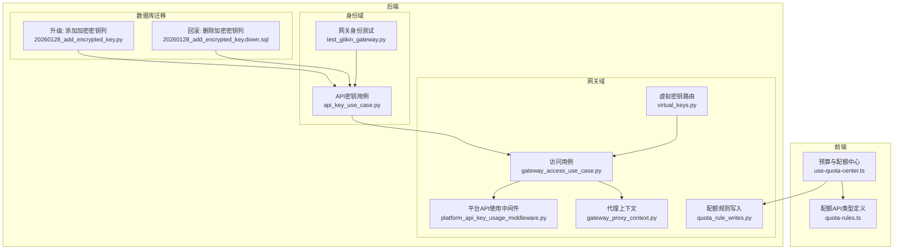
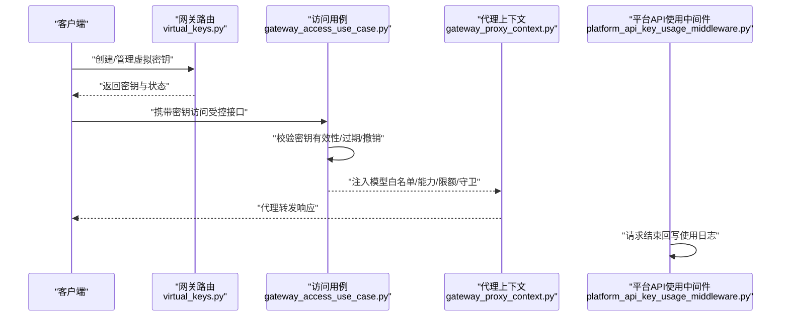
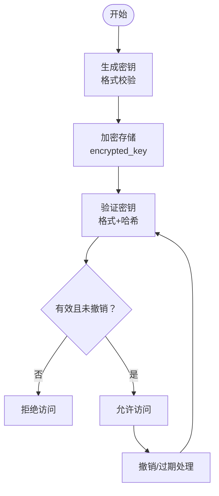
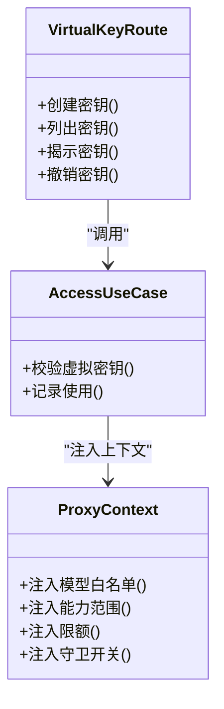
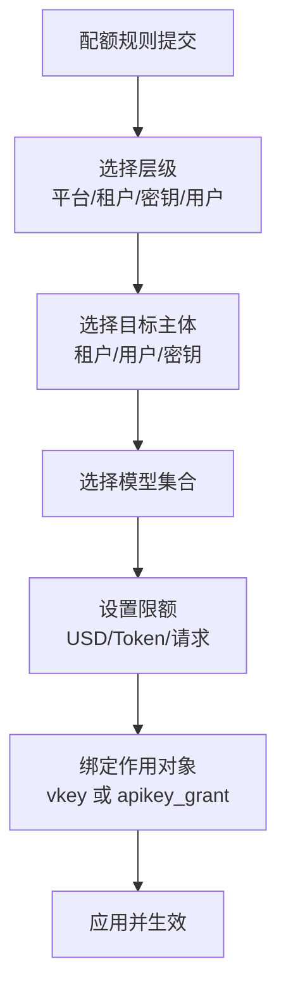
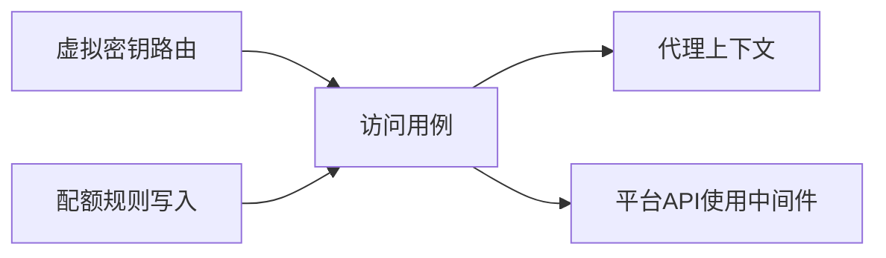

# API安全

<cite>
**本文引用的文件**
- [backend/domains/gateway/presentation/routers/virtual_keys.py](file://backend/domains/gateway/presentation/routers/virtual_keys.py)
- [backend/domains/gateway/domain/virtual_key_access.py](file://backend/domains/gateway/domain/virtual_key_access.py)
- [backend/domains/gateway/application/gateway_access_use_case.py](file://backend/domains/gateway/application/gateway_access_use_case.py)
- [backend/domains/gateway/presentation/gateway_proxy_context.py](file://backend/domains/gateway/presentation/gateway_proxy_context.py)
- [backend/domains/gateway/application/management/write_modules/quota_rule_writes.py](file://backend/domains/gateway/application/management/write_modules/quota_rule_writes.py)
- [frontend/src/features/gateway-budget/use-quota-center.ts](file://frontend/src/features/gateway-budget/use-quota-center.ts)
- [frontend/src/api/gateway/quota-rules.ts](file://frontend/src/api/gateway/quota-rules.ts)
- [backend/domains/identity/application/api_key_use_case.py](file://backend/domains/identity/application/api_key_use_case.py)
- [backend/domains/identity/infrastructure/test_giikin_gateway.py](file://backend/domains/identity/infrastructure/test_giikin_gateway.py)
- [backend/domains/gateway/presentation/platform_api_key_usage_middleware.py](file://backend/domains/gateway/presentation/platform_api_key_usage_middleware.py)
- [backend/alembic/sql/20260128_add_encrypted_key.down.sql](file://backend/alembic/sql/20260128_add_encrypted_key.down.sql)
- [backend/alembic/versions/20260128_add_encrypted_key.py](file://backend/alembic/versions/20260128_add_encrypted_key.py)
- [backend/tests/unit/gateway/test_virtual_key_service.py](file://backend/tests/unit/gateway/test_virtual_key_service.py)
- [backend/tests/unit/application/test_api_key_use_case.py](file://backend/tests/unit/application/test_api_key_use_case.py)
- [backend/tests/unit/core/auth/test_api_key_service.py](file://backend/tests/unit/core/auth/test_api_key_service.py)
</cite>

## 目录
1. [引言](#引言)
2. [项目结构](#项目结构)
3. [核心组件](#核心组件)
4. [架构总览](#架构总览)
5. [详细组件分析](#详细组件分析)
6. [依赖关系分析](#依赖关系分析)
7. [性能考量](#性能考量)
8. [故障排查指南](#故障排查指南)
9. [结论](#结论)
10. [附录](#附录)

## 引言
本文件面向AI Agent项目的API安全，围绕API密钥生命周期（生成、存储、验证、撤销）、虚拟密钥（Virtual Key）机制与使用场景、访问控制与配额限制、请求签名与防重放、限流与熔断、敏感数据传输与存储、安全配置最佳实践、监控与异常检测以及版本控制与向后兼容的安全考虑进行系统化梳理。内容基于仓库中实际代码与迁移脚本，确保可追溯与可落地。

## 项目结构
本项目采用分层与领域驱动设计（DDD），API安全相关能力主要分布在以下模块：
- 网关域（gateway）：虚拟密钥路由、访问控制、代理上下文、配额规则管理、平台API使用中间件
- 身份域（identity）：API密钥生成与验证、内部网关身份解析
- 前端预算与配额中心：配额规则的前端建模与批量操作
- 数据库迁移：API密钥加密字段的演进

图表来源
- [backend/domains/gateway/presentation/routers/virtual_keys.py:49-86](file://backend/domains/gateway/presentation/routers/virtual_keys.py#L49-L86)
- [backend/domains/gateway/application/gateway_access_use_case.py:72-104](file://backend/domains/gateway/application/gateway_access_use_case.py#L72-L104)
- [backend/domains/gateway/presentation/gateway_proxy_context.py:34-50](file://backend/domains/gateway/presentation/gateway_proxy_context.py#L34-L50)
- [backend/domains/gateway/application/management/write_modules/quota_rule_writes.py:478-522](file://backend/domains/gateway/application/management/write_modules/quota_rule_writes.py#L478-L522)
- [backend/domains/gateway/presentation/platform_api_key_usage_middleware.py:49-75](file://backend/domains/gateway/presentation/platform_api_key_usage_middleware.py#L49-L75)
- [backend/domains/identity/application/api_key_use_case.py:355-395](file://backend/domains/identity/application/api_key_use_case.py#L355-L395)
- [backend/alembic/versions/20260128_add_encrypted_key.py:21-33](file://backend/alembic/versions/20260128_add_encrypted_key.py#L21-L33)
- [backend/alembic/sql/20260128_add_encrypted_key.down.sql:1-13](file://backend/alembic/sql/20260128_add_encrypted_key.down.sql#L1-L13)

章节来源
- [backend/domains/gateway/presentation/routers/virtual_keys.py:49-86](file://backend/domains/gateway/presentation/routers/virtual_keys.py#L49-L86)
- [backend/domains/gateway/application/gateway_access_use_case.py:72-104](file://backend/domains/gateway/application/gateway_access_use_case.py#L72-L104)
- [backend/domains/gateway/presentation/gateway_proxy_context.py:34-50](file://backend/domains/gateway/presentation/gateway_proxy_context.py#L34-L50)
- [backend/domains/gateway/application/management/write_modules/quota_rule_writes.py:478-522](file://backend/domains/gateway/application/management/write_modules/quota_rule_writes.py#L478-L522)
- [backend/domains/gateway/presentation/platform_api_key_usage_middleware.py:49-75](file://backend/domains/gateway/presentation/platform_api_key_usage_middleware.py#L49-L75)
- [backend/domains/identity/application/api_key_use_case.py:355-395](file://backend/domains/identity/application/api_key_use_case.py#L355-L395)
- [backend/alembic/versions/20260128_add_encrypted_key.py:21-33](file://backend/alembic/versions/20260128_add_encrypted_key.py#L21-L33)
- [backend/alembic/sql/20260128_add_encrypted_key.down.sql:1-13](file://backend/alembic/sql/20260128_add_encrypted_key.down.sql#L1-L13)

## 核心组件
- 虚拟密钥（Virtual Key）：以“前缀_标识_随机段”形式存在，包含唯一标识、哈希校验、可选过期时间、能力与限额等属性。支持生成、存储加密、验证、遮蔽与撤销。
- 平台API密钥：具备完整密钥生命周期管理，支持加密存储、解密、格式校验与哈希验证。
- 访问控制与代理上下文：根据虚拟密钥或平台密钥解析用户身份、模型白名单、能力范围、限额与守卫开关，并在代理转发时携带。
- 配额与预算：支持按平台/租户/密钥/用户等多层级目标设定周期性限额（美元、Token、请求次数），并支持下游配额绑定到虚拟密钥或API授权。
- 平台API使用中间件：在请求结束后回写使用日志，便于审计与监控。
- 内部网关身份：通过特定头部与内部密钥进行可信身份解析，防止伪造。

章节来源
- [backend/domains/gateway/presentation/routers/virtual_keys.py:49-86](file://backend/domains/gateway/presentation/routers/virtual_keys.py#L49-L86)
- [backend/domains/gateway/application/gateway_access_use_case.py:72-104](file://backend/domains/gateway/application/gateway_access_use_case.py#L72-L104)
- [backend/domains/gateway/presentation/gateway_proxy_context.py:34-50](file://backend/domains/gateway/presentation/gateway_proxy_context.py#L34-L50)
- [backend/domains/gateway/application/management/write_modules/quota_rule_writes.py:478-522](file://backend/domains/gateway/application/management/write_modules/quota_rule_writes.py#L478-L522)
- [backend/domains/gateway/presentation/platform_api_key_usage_middleware.py:49-75](file://backend/domains/gateway/presentation/platform_api_key_usage_middleware.py#L49-L75)
- [backend/domains/identity/application/api_key_use_case.py:355-395](file://backend/domains/identity/application/api_key_use_case.py#L355-L395)

## 架构总览
下图展示API密钥与虚拟密钥在请求链路中的流转与安全控制点：

图表来源
- [backend/domains/gateway/presentation/routers/virtual_keys.py:49-86](file://backend/domains/gateway/presentation/routers/virtual_keys.py#L49-L86)
- [backend/domains/gateway/application/gateway_access_use_case.py:72-104](file://backend/domains/gateway/application/gateway_access_use_case.py#L72-L104)
- [backend/domains/gateway/presentation/gateway_proxy_context.py:34-50](file://backend/domains/gateway/presentation/gateway_proxy_context.py#L34-L50)
- [backend/domains/gateway/presentation/platform_api_key_usage_middleware.py:49-75](file://backend/domains/gateway/presentation/platform_api_key_usage_middleware.py#L49-L75)

## 详细组件分析

### API密钥生命周期管理（生成、存储、验证、撤销）
- 生成与格式
  - 平台API密钥遵循“前缀_标识_随机段”的格式，包含固定长度的标识段，便于快速索引与哈希校验。
  - 虚拟密钥同样采用统一前缀与标识段，便于区分与检索。
- 存储与加密
  - 数据库存储包含加密后的密钥字段，升级脚本将该列为非空并提供默认占位，确保后续迁移与回滚可控。
  - 解密流程在验证阶段完成，避免明文泄露。
- 验证
  - 平台密钥：先校验格式，再按“key_id”前缀索引候选集，逐条验证哈希，返回实体供上层判断有效期与状态。
  - 虚拟密钥：按哈希查询，校验密钥ID与哈希一致性，确保未被篡改且未撤销。
- 撤销
  - 虚拟密钥与平台密钥均支持失效与撤销标记，验证阶段会拒绝无效密钥。

图表来源
- [backend/domains/identity/application/api_key_use_case.py:355-395](file://backend/domains/identity/application/api_key_use_case.py#L355-L395)
- [backend/alembic/versions/20260128_add_encrypted_key.py:21-33](file://backend/alembic/versions/20260128_add_encrypted_key.py#L21-L33)

章节来源
- [backend/domains/identity/application/api_key_use_case.py:355-395](file://backend/domains/identity/application/api_key_use_case.py#L355-L395)
- [backend/alembic/versions/20260128_add_encrypted_key.py:21-33](file://backend/alembic/versions/20260128_add_encrypted_key.py#L21-L33)
- [backend/alembic/sql/20260128_add_encrypted_key.down.sql:1-13](file://backend/alembic/sql/20260128_add_encrypted_key.down.sql#L1-L13)
- [backend/tests/unit/application/test_api_key_use_case.py:168-201](file://backend/tests/unit/application/test_api_key_use_case.py#L168-L201)

### 虚拟密钥（Virtual Key）安全机制与使用场景
- 安全机制
  - 唯一标识与哈希：通过提取密钥标识与哈希校验，确保密钥不可伪造。
  - 加密存储：密钥明文仅在生成时短暂存在，随后加密入库。
  - 访问控制：按创建者私有原则，团队所有者/管理员不可查看或使用成员创建的密钥。
  - 限额与守卫：支持RPM/TPM限额与守卫开关，可在代理上下文中生效。
- 使用场景
  - 为子团队或项目分配独立密钥，隔离用量与责任。
  - 临时密钥（带过期时间）用于短期任务或外部集成。
  - 绑定模型白名单与能力范围，限制风险面。

图表来源
- [backend/domains/gateway/presentation/routers/virtual_keys.py:49-86](file://backend/domains/gateway/presentation/routers/virtual_keys.py#L49-L86)
- [backend/domains/gateway/application/gateway_access_use_case.py:72-104](file://backend/domains/gateway/application/gateway_access_use_case.py#L72-L104)
- [backend/domains/gateway/presentation/gateway_proxy_context.py:34-50](file://backend/domains/gateway/presentation/gateway_proxy_context.py#L34-L50)

章节来源
- [backend/domains/gateway/presentation/routers/virtual_keys.py:49-86](file://backend/domains/gateway/presentation/routers/virtual_keys.py#L49-L86)
- [backend/domains/gateway/domain/virtual_key_access.py:48-84](file://backend/domains/gateway/domain/virtual_key_access.py#L48-L84)
- [backend/tests/unit/gateway/test_virtual_key_service.py:20-54](file://backend/tests/unit/gateway/test_virtual_key_service.py#L20-L54)

### API访问控制与配额限制
- 访问控制
  - 虚拟密钥按创建者私有，非创建者无法查看或使用。
  - 支持团队Header兼容性校验，避免跨团队误用。
- 配额限制
  - 支持按平台/租户/密钥/用户等层级设定限额，包括美元预算、Token上限、请求次数上限。
  - 下游配额可绑定到虚拟密钥或API授权，确保细粒度控制。
  - 前端预算中心支持批量构建配额规则，自动展开目标主体与模型组合。

图表来源
- [frontend/src/features/gateway-budget/use-quota-center.ts:137-175](file://frontend/src/features/gateway-budget/use-quota-center.ts#L137-L175)
- [frontend/src/api/gateway/quota-rules.ts:61-101](file://frontend/src/api/gateway/quota-rules.ts#L61-L101)
- [backend/domains/gateway/application/management/write_modules/quota_rule_writes.py:478-522](file://backend/domains/gateway/application/management/write_modules/quota_rule_writes.py#L478-L522)

章节来源
- [frontend/src/features/gateway-budget/use-quota-center.ts:137-175](file://frontend/src/features/gateway-budget/use-quota-center.ts#L137-L175)
- [frontend/src/api/gateway/quota-rules.ts:61-101](file://frontend/src/api/gateway/quota-rules.ts#L61-L101)
- [backend/domains/gateway/application/management/write_modules/quota_rule_writes.py:478-522](file://backend/domains/gateway/application/management/write_modules/quota_rule_writes.py#L478-L522)

### API请求签名验证与防重放机制
- 内部网关身份解析
  - 通过特定头部与内部密钥进行身份解析，若缺少或不匹配则拒绝，防止伪造请求。
- 请求签名与重放防护建议
  - 在实际实现中，建议结合时间戳、随机nonce与签名（如HMAC）对请求头与体进行签名，服务端校验时间窗口与nonce去重，以抵御重放攻击。
  - 当前仓库未提供具体签名与重放实现，以上为通用安全建议。

章节来源
- [backend/domains/identity/infrastructure/test_giikin_gateway.py:44-78](file://backend/domains/identity/infrastructure/test_giikin_gateway.py#L44-L78)

### 限流与熔断保护策略
- 限流
  - 虚拟密钥支持RPM/TPM限额，代理上下文注入后由下游服务执行。
- 熔断
  - 建议在网关层引入熔断器（如基于错误率或超时），在下游异常时快速失败并降级，避免雪崩。
  - 本节为通用策略建议，当前仓库未提供具体实现。

章节来源
- [backend/domains/gateway/presentation/gateway_proxy_context.py:34-50](file://backend/domains/gateway/presentation/gateway_proxy_context.py#L34-L50)

### 敏感数据的传输加密与存储保护
- 传输加密
  - 建议强制HTTPS/TLS，确保密钥与请求在传输过程中不被窃听或篡改。
- 存储保护
  - API密钥加密字段已在数据库中持久化，升级脚本保证非空与默认值，便于后续安全加固。
  - 密钥生成与加解密流程需确保密钥材料安全，避免硬编码与日志泄露。

章节来源
- [backend/alembic/versions/20260128_add_encrypted_key.py:21-33](file://backend/alembic/versions/20260128_add_encrypted_key.py#L21-L33)
- [backend/tests/unit/core/auth/test_api_key_service.py:375-408](file://backend/tests/unit/core/auth/test_api_key_service.py#L375-L408)

### API安全配置最佳实践
- 最小权限原则：为密钥配置最小必要能力与模型白名单。
- 分层治理：平台/租户/密钥/用户多层级配额，形成纵深防御。
- 审计与监控：启用平台API使用中间件回写使用日志，结合指标与告警。
- 密钥轮换：定期轮换密钥，及时撤销不再使用的密钥。
- 环境隔离：开发/测试/生产环境分离，密钥与内部密钥严格区分。

章节来源
- [backend/domains/gateway/presentation/platform_api_key_usage_middleware.py:49-75](file://backend/domains/gateway/presentation/platform_api_key_usage_middleware.py#L49-L75)

### API监控与异常检测
- 使用中间件回写：请求结束后记录状态码、耗时、IP、UA等信息，便于异常检测与追踪。
- 建议补充
  - 异常比率阈值、慢请求检测、突发流量检测与自动告警。
  - 对高危操作（创建/撤销/修改限额）增加二次确认与审计日志。

章节来源
- [backend/domains/gateway/presentation/platform_api_key_usage_middleware.py:49-75](file://backend/domains/gateway/presentation/platform_api_key_usage_middleware.py#L49-L75)

### API版本控制与向后兼容性的安全考虑
- 版本控制
  - 建议在路由层引入版本前缀（如/v1），对变更接口进行版本化管理。
- 向后兼容
  - 新增字段应保持默认安全值，旧客户端不感知；删除字段需保留兼容逻辑与弃用提示。
  - 配额规则与密钥格式变更需提供迁移工具与回滚方案。

章节来源
- [backend/domains/gateway/application/management/write_modules/quota_rule_writes.py:478-522](file://backend/domains/gateway/application/management/write_modules/quota_rule_writes.py#L478-L522)

## 依赖关系分析
- 路由依赖访问用例，访问用例依赖仓储与上下文，上下文将密钥信息注入代理请求。
- 平台API使用中间件在ASGI生命周期内回写使用日志，依赖数据库会话工厂。
- 配额规则写入模块负责将规则应用到下游，支持绑定虚拟密钥或API授权。

图表来源
- [backend/domains/gateway/presentation/routers/virtual_keys.py:49-86](file://backend/domains/gateway/presentation/routers/virtual_keys.py#L49-L86)
- [backend/domains/gateway/application/gateway_access_use_case.py:72-104](file://backend/domains/gateway/application/gateway_access_use_case.py#L72-L104)
- [backend/domains/gateway/presentation/gateway_proxy_context.py:34-50](file://backend/domains/gateway/presentation/gateway_proxy_context.py#L34-L50)
- [backend/domains/gateway/application/management/write_modules/quota_rule_writes.py:478-522](file://backend/domains/gateway/application/management/write_modules/quota_rule_writes.py#L478-L522)
- [backend/domains/gateway/presentation/platform_api_key_usage_middleware.py:49-75](file://backend/domains/gateway/presentation/platform_api_key_usage_middleware.py#L49-L75)

章节来源
- [backend/domains/gateway/presentation/routers/virtual_keys.py:49-86](file://backend/domains/gateway/presentation/routers/virtual_keys.py#L49-L86)
- [backend/domains/gateway/application/gateway_access_use_case.py:72-104](file://backend/domains/gateway/application/gateway_access_use_case.py#L72-L104)
- [backend/domains/gateway/presentation/gateway_proxy_context.py:34-50](file://backend/domains/gateway/presentation/gateway_proxy_context.py#L34-L50)
- [backend/domains/gateway/application/management/write_modules/quota_rule_writes.py:478-522](file://backend/domains/gateway/application/management/write_modules/quota_rule_writes.py#L478-L522)
- [backend/domains/gateway/presentation/platform_api_key_usage_middleware.py:49-75](file://backend/domains/gateway/presentation/platform_api_key_usage_middleware.py#L49-L75)

## 性能考量
- 密钥验证：按key_id前缀索引候选集，减少全表扫描；哈希验证在内存中进行，成本较低。
- 代理上下文：仅注入必要字段，避免冗余计算。
- 中间件：异步回写使用日志，避免阻塞主请求路径。
- 配额规则：批量应用时注意幂等与去重，避免重复写入。

## 故障排查指南
- 密钥验证失败
  - 检查密钥格式与哈希是否匹配；确认未过期或未撤销。
  - 平台密钥解密失败：核对加密密钥派生是否一致。
- 虚拟密钥不可见
  - 确认是否为创建者本人；团队Header是否与密钥所属租户一致。
- 配额未生效
  - 检查配额层级与目标主体是否正确；确认规则已应用到下游。
- 使用日志缺失
  - 确认中间件是否正确挂载；请求是否正常结束。

章节来源
- [backend/domains/identity/application/api_key_use_case.py:355-395](file://backend/domains/identity/application/api_key_use_case.py#L355-L395)
- [backend/domains/gateway/domain/virtual_key_access.py:48-84](file://backend/domains/gateway/domain/virtual_key_access.py#L48-L84)
- [backend/domains/gateway/application/management/write_modules/quota_rule_writes.py:478-522](file://backend/domains/gateway/application/management/write_modules/quota_rule_writes.py#L478-L522)
- [backend/domains/gateway/presentation/platform_api_key_usage_middleware.py:49-75](file://backend/domains/gateway/presentation/platform_api_key_usage_middleware.py#L49-L75)

## 结论
本项目在API密钥与虚拟密钥的生命周期管理、访问控制、配额限制与使用审计方面具备清晰的实现路径。建议在现有基础上补充请求签名与防重放、限流与熔断、传输加密与存储加固，并完善监控与异常检测体系，以进一步提升整体安全性与可运维性。

## 附录
- 关键实现参考路径
  - 虚拟密钥创建与存储：[backend/domains/gateway/presentation/routers/virtual_keys.py:49-86](file://backend/domains/gateway/presentation/routers/virtual_keys.py#L49-L86)
  - 虚拟密钥访问控制：[backend/domains/gateway/domain/virtual_key_access.py:48-84](file://backend/domains/gateway/domain/virtual_key_access.py#L48-L84)
  - 平台密钥验证：[backend/domains/identity/application/api_key_use_case.py:355-395](file://backend/domains/identity/application/api_key_use_case.py#L355-L395)
  - 代理上下文注入：[backend/domains/gateway/presentation/gateway_proxy_context.py:34-50](file://backend/domains/gateway/presentation/gateway_proxy_context.py#L34-L50)
  - 平台API使用中间件：[backend/domains/gateway/presentation/platform_api_key_usage_middleware.py:49-75](file://backend/domains/gateway/presentation/platform_api_key_usage_middleware.py#L49-L75)
  - 配额规则写入：[backend/domains/gateway/application/management/write_modules/quota_rule_writes.py:478-522](file://backend/domains/gateway/application/management/write_modules/quota_rule_writes.py#L478-L522)
  - 前端配额规则类型：[frontend/src/api/gateway/quota-rules.ts:61-101](file://frontend/src/api/gateway/quota-rules.ts#L61-L101)
  - 前端配额规则构建：[frontend/src/features/gateway-budget/use-quota-center.ts:137-175](file://frontend/src/features/gateway-budget/use-quota-center.ts#L137-L175)
  - 数据库加密字段迁移：[backend/alembic/versions/20260128_add_encrypted_key.py:21-33](file://backend/alembic/versions/20260128_add_encrypted_key.py#L21-L33)