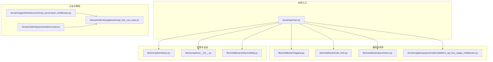
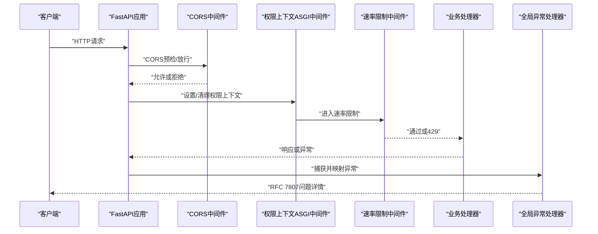
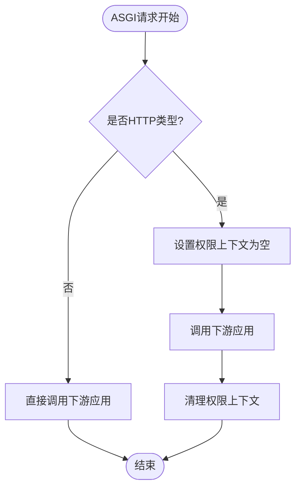
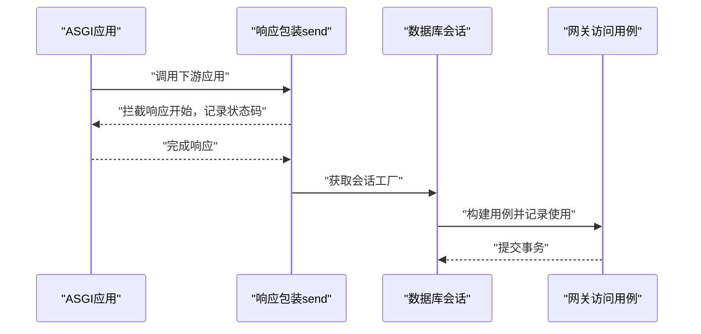
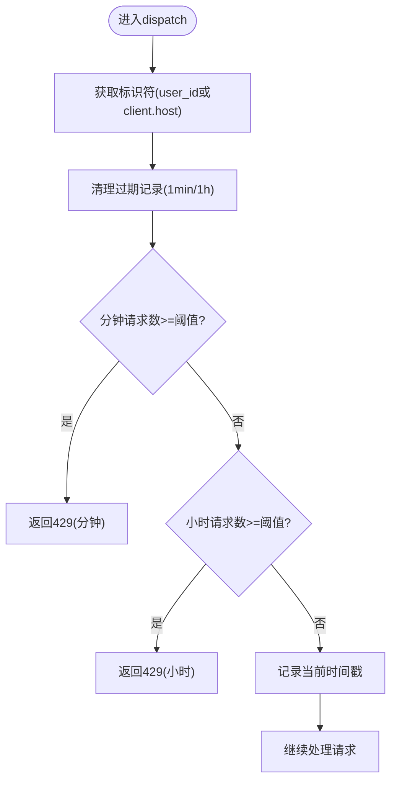
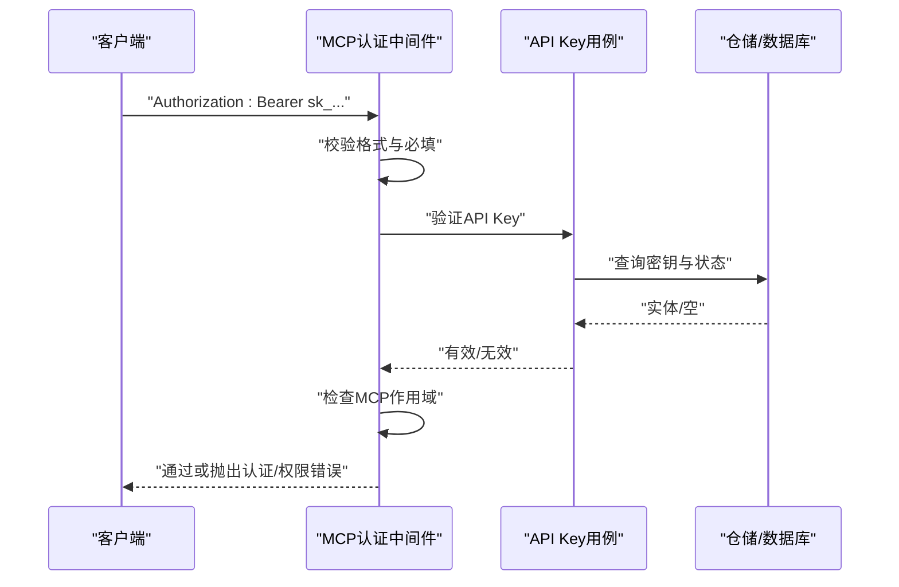
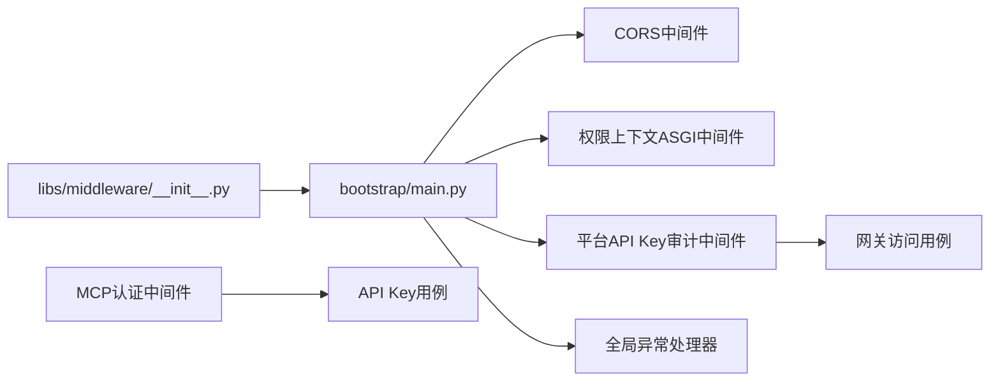

# 安全中间件

<cite>
**本文引用的文件**
- [bootstrap/main.py](file://backend/bootstrap/main.py)
- [libs/middleware/__init__.py](file://backend/libs/middleware/__init__.py)
- [libs/middleware/logging.py](file://backend/libs/middleware/logging.py)
- [libs/middleware/rate_limit.py](file://backend/libs/middleware/rate_limit.py)
- [libs/middleware/permission.py](file://backend/libs/middleware/permission.py)
- [libs/middleware/observability.py](file://backend/libs/middleware/observability.py)
- [domains/gateway/presentation/platform_api_key_usage_middleware.py](file://backend/domains/gateway/presentation/platform_api_key_usage_middleware.py)
- [domains/agent/infrastructure/mcp_server/auth_middleware.py](file://backend/domains/agent/infrastructure/mcp_server/auth_middleware.py)
- [libs/exceptions/base.py](file://backend/libs/exceptions/base.py)
- [libs/exceptions/__init__.py](file://backend/libs/exceptions/__init__.py)
- [domains/identity/presentation/router.py](file://backend/domains/identity/presentation/router.py)
- [domains/identity/application/api_key_use_case.py](file://backend/domains/identity/application/api_key_use_case.py)
</cite>

## 目录
1. [简介](#简介)
2. [项目结构](#项目结构)
3. [核心组件](#核心组件)
4. [架构总览](#架构总览)
5. [详细组件分析](#详细组件分析)
6. [依赖关系分析](#依赖关系分析)
7. [性能考量](#性能考量)
8. [故障排查指南](#故障排查指南)
9. [结论](#结论)
10. [附录](#附录)

## 简介
本文件面向AI Agent项目的“安全中间件”主题，系统梳理并解释以下能力与实现要点：
- 请求验证中间件：输入参数验证与请求格式检查
- CORS（跨域资源共享）配置与安全头设置
- CSRF（跨站请求伪造）防护现状与建议
- API速率限制与防滥用保护机制
- 安全日志记录与审计追踪
- 异常处理与错误信息的安全过滤
- 安全中间件的配置示例与自定义扩展方法
- 常见安全威胁的防护策略与应对措施

本项目采用FastAPI + ASGI架构，安全相关横切关注点通过中间件与全局异常处理器统一实现，并结合领域层的认证授权与API密钥校验。

## 项目结构
安全中间件相关代码主要分布在如下位置：
- 应用入口与全局中间件注册：backend/bootstrap/main.py
- 通用中间件聚合导出：backend/libs/middleware/__init__.py
- 日志中间件：backend/libs/middleware/logging.py
- 速率限制中间件：backend/libs/middleware/rate_limit.py
- 权限上下文中间件（ASGI）：backend/libs/middleware/permission.py
- 网关平台API Key使用审计中间件（ASGI）：backend/domains/gateway/presentation/platform_api_key_usage_middleware.py
- MCP服务器认证中间件（API Key + 作用域校验）：backend/domains/agent/infrastructure/mcp_server/auth_middleware.py
- 异常体系与问题详情输出：backend/libs/exceptions/*
- 可观测性与Sentry集成：backend/libs/middleware/observability.py

图表来源
- [bootstrap/main.py:192-227](file://backend/bootstrap/main.py#L192-L227)
- [libs/middleware/logging.py:18-59](file://backend/libs/middleware/logging.py#L18-L59)
- [libs/middleware/rate_limit.py:20-88](file://backend/libs/middleware/rate_limit.py#L20-L88)
- [libs/middleware/permission.py:21-39](file://backend/libs/middleware/permission.py#L21-L39)
- [domains/gateway/presentation/platform_api_key_usage_middleware.py:29-101](file://backend/domains/gateway/presentation/platform_api_key_usage_middleware.py#L29-L101)
- [domains/agent/infrastructure/mcp_server/auth_middleware.py:46-183](file://backend/domains/agent/infrastructure/mcp_server/auth_middleware.py#L46-L183)
- [libs/exceptions/base.py:1-36](file://backend/libs/exceptions/base.py#L1-L36)
- [libs/exceptions/__init__.py:1-57](file://backend/libs/exceptions/__init__.py#L1-L57)
- [libs/middleware/observability.py:125-159](file://backend/libs/middleware/observability.py#L125-L159)

章节来源
- [bootstrap/main.py:182-227](file://backend/bootstrap/main.py#L182-L227)
- [libs/middleware/__init__.py:1-18](file://backend/libs/middleware/__init__.py#L1-L18)

## 核心组件
- CORS中间件：在应用入口集中配置，支持凭据传递、动态暴露头部（含限流与上游计时头），并根据环境调整允许来源列表。
- 权限上下文ASGI中间件：在ASGI边界预清/清理权限上下文，避免跨请求污染，兼容流式响应。
- 平台API Key使用审计ASGI中间件：在代理响应后回写平台sk-*密钥的使用统计，包含端点、方法、IP、UA、状态码、耗时等。
- 速率限制中间件：基于内存的滑动窗口（分钟/小时）计数，超限返回标准RFC 7807问题详情。
- MCP服务器认证中间件：校验Bearer API Key格式与有效性，检查MCP作用域权限，支持可选认证模式。
- 全局异常处理器：将各类业务异常映射为RFC 7807问题详情响应，统一错误输出与安全过滤。
- 可观测性与Sentry：记录错误面包屑与上报异常，辅助审计与故障定位。

章节来源
- [bootstrap/main.py:192-227](file://backend/bootstrap/main.py#L192-L227)
- [libs/middleware/permission.py:21-39](file://backend/libs/middleware/permission.py#L21-L39)
- [domains/gateway/presentation/platform_api_key_usage_middleware.py:29-101](file://backend/domains/gateway/presentation/platform_api_key_usage_middleware.py#L29-L101)
- [libs/middleware/rate_limit.py:20-88](file://backend/libs/middleware/rate_limit.py#L20-L88)
- [domains/agent/infrastructure/mcp_server/auth_middleware.py:46-183](file://backend/domains/agent/infrastructure/mcp_server/auth_middleware.py#L46-L183)
- [bootstrap/main.py:235-383](file://backend/bootstrap/main.py#L235-L383)
- [libs/middleware/observability.py:125-159](file://backend/libs/middleware/observability.py#L125-L159)

## 架构总览
下图展示安全相关中间件与异常处理的整体交互流程，以及与认证授权的衔接。

图表来源
- [bootstrap/main.py:192-227](file://backend/bootstrap/main.py#L192-L227)
- [bootstrap/main.py:235-383](file://backend/bootstrap/main.py#L235-L383)
- [libs/middleware/permission.py:21-39](file://backend/libs/middleware/permission.py#L21-L39)
- [libs/middleware/rate_limit.py:20-88](file://backend/libs/middleware/rate_limit.py#L20-L88)

## 详细组件分析

### CORS（跨域资源共享）与安全头
- 配置要点
  - 凭据允许：开启凭据传递以支持Cookie跨域场景。
  - 动态来源：开发环境使用本地前端地址，生产环境从配置读取。
  - 头部暴露：显式暴露限流与上游网关相关响应头，便于客户端感知限流与性能指标。
- 安全建议
  - 生产环境禁止使用通配来源，必须精确列出可信域名。
  - 若不需要凭据，建议关闭allow_credentials以减少风险。
  - 结合HSTS、X-Frame-Options、Content-Security-Policy等安全头进一步加固（可在反向代理层统一注入）。

章节来源
- [bootstrap/main.py:192-227](file://backend/bootstrap/main.py#L192-L227)

### 权限上下文中间件（ASGI）
- 设计目标
  - 在ASGI请求边界预清/清理权限上下文，避免跨请求状态泄漏。
  - 与流式响应（如SSE）兼容，避免BaseHTTPMiddleware的竞态问题。
- 行为特征
  - 仅处理HTTP类型scope。
  - 在调用下游应用前后分别设置与清理上下文。

图表来源
- [libs/middleware/permission.py:21-39](file://backend/libs/middleware/permission.py#L21-L39)

章节来源
- [libs/middleware/permission.py:1-39](file://backend/libs/middleware/permission.py#L1-L39)

### 平台API Key使用审计中间件（ASGI）
- 作用
  - 在代理响应后回写平台sk-* API Key的使用统计，包含端点、方法、IP、UA、状态码、耗时等。
  - 通过ASGI包装send回调捕获最终状态码，确保记录完整性。
- 数据落库
  - 使用数据库会话工厂构建事务，调用领域用例记录使用情况，提交后释放连接。
- 容错
  - 记录异常被吞掉，不影响主流程，但会记录日志以便排查。

图表来源
- [domains/gateway/presentation/platform_api_key_usage_middleware.py:29-101](file://backend/domains/gateway/presentation/platform_api_key_usage_middleware.py#L29-L101)

章节来源
- [domains/gateway/presentation/platform_api_key_usage_middleware.py:1-101](file://backend/domains/gateway/presentation/platform_api_key_usage_middleware.py#L1-L101)

### 速率限制中间件
- 策略
  - 基于内存的滑动窗口计数：按分钟与按小时分别统计。
  - 标识符优先级：用户ID > 客户端IP，支持登录态与匿名态差异化限流。
  - 超限返回429，包含Retry-After与标准化问题详情。
- 性能
  - 时间复杂度：每次请求O(1)清理与O(1)判断。
  - 空间复杂度：按标识符维护两个时间戳列表，内存占用与并发量线性相关。
- 配置
  - 默认每分钟与每小时请求数可通过构造函数参数覆盖。

图表来源
- [libs/middleware/rate_limit.py:20-88](file://backend/libs/middleware/rate_limit.py#L20-L88)

章节来源
- [libs/middleware/rate_limit.py:1-88](file://backend/libs/middleware/rate_limit.py#L1-L88)

### 请求验证中间件与输入参数校验
- 输入验证
  - FastAPI内置的RequestValidationError由全局异常处理器统一映射为RFC 7807问题详情。
  - 业务层通过Pydantic模型进行参数校验，异常被捕获并转换为标准错误响应。
- 请求格式检查
  - CORS中间件控制允许的方法与头部，防止非法方法与头部导致的安全问题。
  - MCP认证中间件对Authorization头进行格式与范围校验，拒绝非Bearer或格式错误的凭据。
- 安全过滤
  - 全局异常处理器仅输出受控的错误摘要，避免泄露内部堆栈细节。

章节来源
- [bootstrap/main.py:235-242](file://backend/bootstrap/main.py#L235-L242)
- [bootstrap/main.py:253-259](file://backend/bootstrap/main.py#L253-L259)
- [domains/agent/infrastructure/mcp_server/auth_middleware.py:67-78](file://backend/domains/agent/infrastructure/mcp_server/auth_middleware.py#L67-L78)

### CSRF（跨站请求伪造）防护
- 现状
  - 项目未发现专门的CSRF令牌中间件或CSRF保护逻辑。
- 建议
  - 对于JSON API与Bearer认证为主的后端，CSRF风险相对较低。
  - 如需增强，可在认证路由中引入CSRF令牌校验（例如SameSite Cookie + CSRF Token），并配合CORS严格配置。
  - 对于需要Cookie认证的场景，务必禁用通配来源并启用Strict或Lax SameSite策略。

章节来源
- [bootstrap/main.py:192-227](file://backend/bootstrap/main.py#L192-L227)

### API速率限制与防滥用保护
- 速率限制
  - 内存滑动窗口，支持分钟/小时双维度限流。
  - 支持登录态与匿名态差异化限流，提升公平性。
- 防滥用
  - 与平台API Key审计联动，可结合用户/密钥维度做更细粒度的风控。
  - 建议结合Redis实现分布式限流，以支持多实例部署。

章节来源
- [libs/middleware/rate_limit.py:20-88](file://backend/libs/middleware/rate_limit.py#L20-L88)
- [domains/gateway/presentation/platform_api_key_usage_middleware.py:29-101](file://backend/domains/gateway/presentation/platform_api_key_usage_middleware.py#L29-L101)

### 安全日志记录与审计追踪
- 日志中间件
  - 记录请求方法、路径、客户端IP与响应状态码、耗时等关键信息。
- 平台API Key审计
  - 代理完成后回写使用统计，包含端点、方法、IP、UA、状态码、耗时。
- 异常与可观测性
  - 全局异常处理器记录警告/错误级别日志，并可上报Sentry。
  - 可观测性中间件在5xx错误时添加面包屑，辅助定位问题。

章节来源
- [libs/middleware/logging.py:18-59](file://backend/libs/middleware/logging.py#L18-L59)
- [domains/gateway/presentation/platform_api_key_usage_middleware.py:68-94](file://backend/domains/gateway/presentation/platform_api_key_usage_middleware.py#L68-L94)
- [bootstrap/main.py:235-383](file://backend/bootstrap/main.py#L235-L383)
- [libs/middleware/observability.py:125-159](file://backend/libs/middleware/observability.py#L125-L159)

### 异常处理与错误信息的安全过滤
- 统一映射
  - 将各类业务异常映射为RFC 7807问题详情，避免直接抛出内部异常。
- 认证/权限错误
  - 认证失败与权限不足时设置WWW-Authenticate头，提示客户端使用Bearer认证。
- 未捕获异常
  - 开发环境打印堆栈，生产环境仅返回通用错误码，不泄露内部细节。

章节来源
- [bootstrap/main.py:235-383](file://backend/bootstrap/main.py#L235-L383)
- [libs/exceptions/base.py:1-36](file://backend/libs/exceptions/base.py#L1-L36)
- [libs/exceptions/__init__.py:1-57](file://backend/libs/exceptions/__init__.py#L1-L57)

### MCP服务器认证中间件
- 认证流程
  - 解析Authorization头，校验Bearer格式与API Key前缀。
  - 通过API Key用例验证密钥有效性与状态。
  - 检查MCP作用域权限，支持“全部服务器”与特定服务器权限组合。
- 可选认证
  - 提供可选认证模式，未提供凭据时返回匿名上下文，便于公开端点。
- 使用审计
  - 成功验证后尝试记录API Key使用情况（失败不影响主流程）。

图表来源
- [domains/agent/infrastructure/mcp_server/auth_middleware.py:46-183](file://backend/domains/agent/infrastructure/mcp_server/auth_middleware.py#L46-L183)
- [domains/identity/application/api_key_use_case.py](file://backend/domains/identity/application/api_key_use_case.py)

章节来源
- [domains/agent/infrastructure/mcp_server/auth_middleware.py:1-183](file://backend/domains/agent/infrastructure/mcp_server/auth_middleware.py#L1-L183)

## 依赖关系分析
- 中间件聚合
  - libs/middleware/__init__.py导出日志、权限上下文、速率限制等通用中间件，便于集中管理。
- 应用入口装配
  - bootstrap/main.py集中注册CORS、权限上下文、平台API Key审计等中间件，并配置全局异常处理器。
- 领域集成
  - MCP认证中间件依赖身份域的API Key用例与仓储，实现密钥验证与使用记录。
  - 平台API Key审计中间件依赖网关用例记录使用统计。

图表来源
- [libs/middleware/__init__.py:13-17](file://backend/libs/middleware/__init__.py#L13-L17)
- [bootstrap/main.py:192-227](file://backend/bootstrap/main.py#L192-L227)
- [domains/agent/infrastructure/mcp_server/auth_middleware.py:46-183](file://backend/domains/agent/infrastructure/mcp_server/auth_middleware.py#L46-L183)
- [domains/gateway/presentation/platform_api_key_usage_middleware.py:29-101](file://backend/domains/gateway/presentation/platform_api_key_usage_middleware.py#L29-L101)

章节来源
- [libs/middleware/__init__.py:1-18](file://backend/libs/middleware/__init__.py#L1-L18)
- [bootstrap/main.py:182-227](file://backend/bootstrap/main.py#L182-L227)

## 性能考量
- 速率限制中间件
  - 内存存储，单实例部署即可满足中小规模流量；多实例需分布式限流方案。
  - 清理过期记录为O(n)遍历，n为该标识符的历史请求数，建议合理设置阈值与清理频率。
- 日志与审计
  - 日志中间件与平台API Key审计均为轻量I/O操作，建议结合异步日志与批量写入优化。
- 异常处理
  - 全局异常处理器仅做映射与记录，开销极低；开发环境打印堆栈会增加IO与CPU消耗。

## 故障排查指南
- 速率限制频繁触发
  - 检查用户ID与客户端IP识别是否正确，确认限流阈值配置。
  - 查看日志中间件输出的请求/响应信息，定位高频端点。
- CORS跨域失败
  - 确认allow_origins配置与请求来源一致，避免使用通配来源。
  - 检查暴露头部是否包含客户端需要的限流/上游计时头。
- 认证/权限错误
  - 确认Authorization头格式为Bearer sk_...，API Key状态有效且具备所需MCP作用域。
  - 查看MCP认证中间件日志，定位具体失败原因。
- 异常未按预期返回
  - 检查全局异常处理器注册顺序与异常类型映射，确保未被其他中间件吞没。
  - 开发环境可临时开启堆栈打印，生产环境保持默认。

章节来源
- [libs/middleware/rate_limit.py:47-77](file://backend/libs/middleware/rate_limit.py#L47-L77)
- [bootstrap/main.py:192-227](file://backend/bootstrap/main.py#L192-L227)
- [domains/agent/infrastructure/mcp_server/auth_middleware.py:67-127](file://backend/domains/agent/infrastructure/mcp_server/auth_middleware.py#L67-L127)
- [bootstrap/main.py:235-383](file://backend/bootstrap/main.py#L235-L383)

## 结论
本项目通过CORS、权限上下文、速率限制、平台API Key审计、MCP认证与全局异常处理等多层安全中间件，构建了较为完善的API安全与可观测性体系。建议在生产环境中：
- 明确CORS来源白名单，谨慎开启凭据传递；
- 引入分布式限流与CSRF保护（如适用）；
- 加强日志与Sentry的联动，完善审计与告警；
- 对高风险端点实施更严格的参数校验与访问控制。

## 附录

### 安全中间件配置示例
- CORS配置（示例路径）
  - [bootstrap/main.py:192-227](file://backend/bootstrap/main.py#L192-L227)
- 速率限制配置（示例路径）
  - [libs/middleware/rate_limit.py:20-34](file://backend/libs/middleware/rate_limit.py#L20-L34)
- 平台API Key审计（示例路径）
  - [domains/gateway/presentation/platform_api_key_usage_middleware.py:29-101](file://backend/domains/gateway/presentation/platform_api_key_usage_middleware.py#L29-L101)
- MCP认证（示例路径）
  - [domains/agent/infrastructure/mcp_server/auth_middleware.py:46-183](file://backend/domains/agent/infrastructure/mcp_server/auth_middleware.py#L46-L183)

### 自定义扩展方法
- 新增ASGI中间件
  - 在bootstrap/main.py中注册，确保与流式响应兼容。
  - 参考现有权限上下文与平台API Key审计中间件的ASGI实现风格。
- 自定义速率限制策略
  - 在速率限制中间件基础上扩展维度（如租户ID、模型类型）。
  - 建议引入Redis实现分布式计数与共享状态。
- 异常映射扩展
  - 在bootstrap/main.py的全局异常处理器中新增异常类型映射。
  - 统一输出RFC 7807问题详情，避免敏感信息泄露。

章节来源
- [bootstrap/main.py:192-227](file://backend/bootstrap/main.py#L192-L227)
- [libs/middleware/rate_limit.py:20-88](file://backend/libs/middleware/rate_limit.py#L20-L88)
- [bootstrap/main.py:235-383](file://backend/bootstrap/main.py#L235-L383)