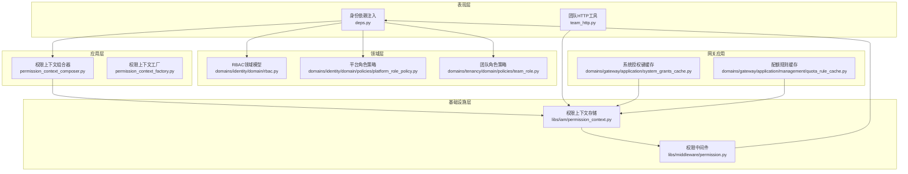
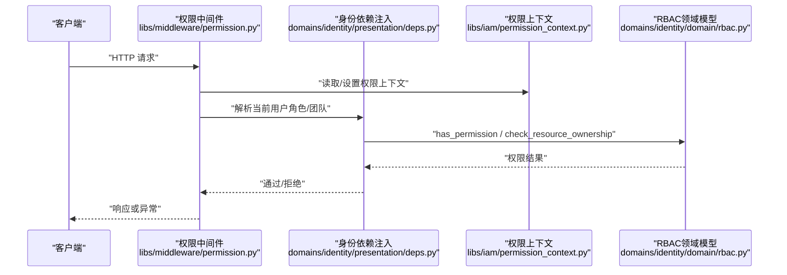
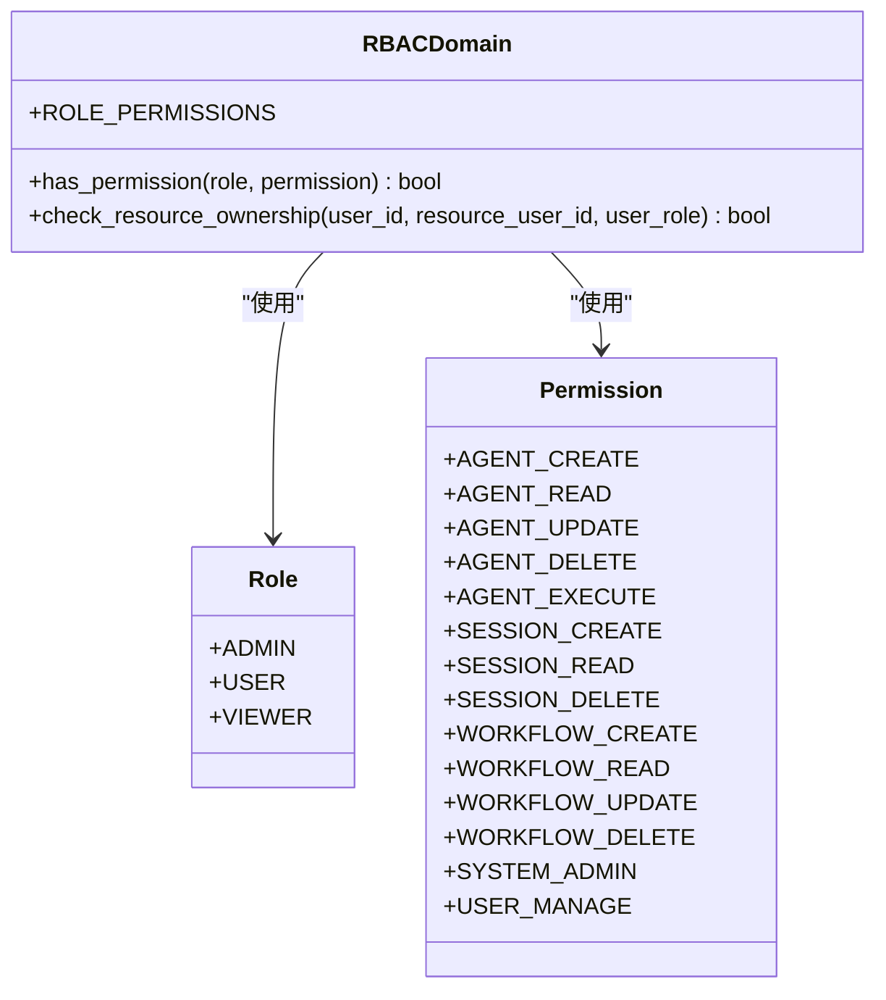
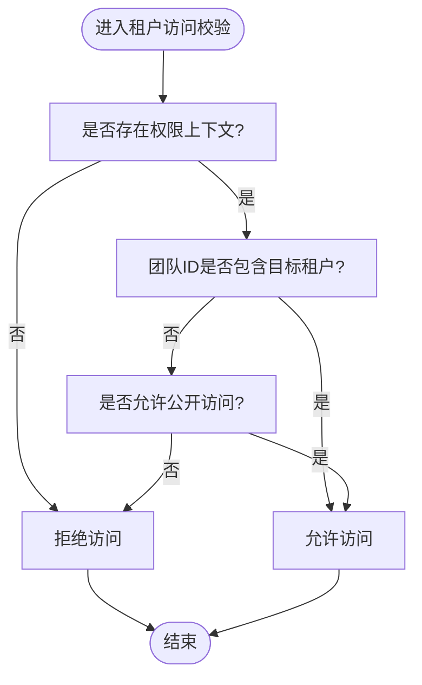
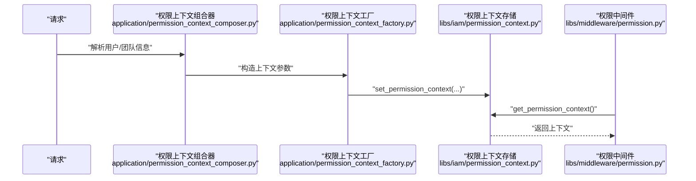
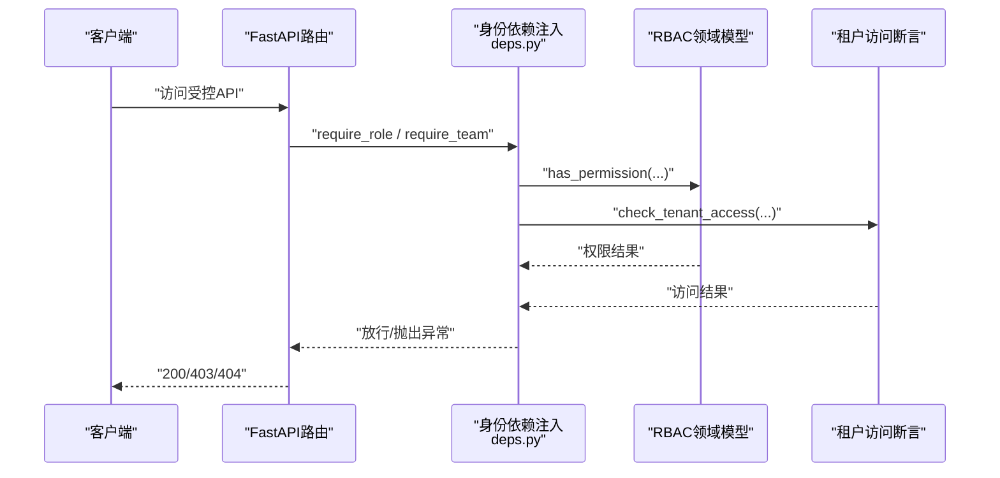
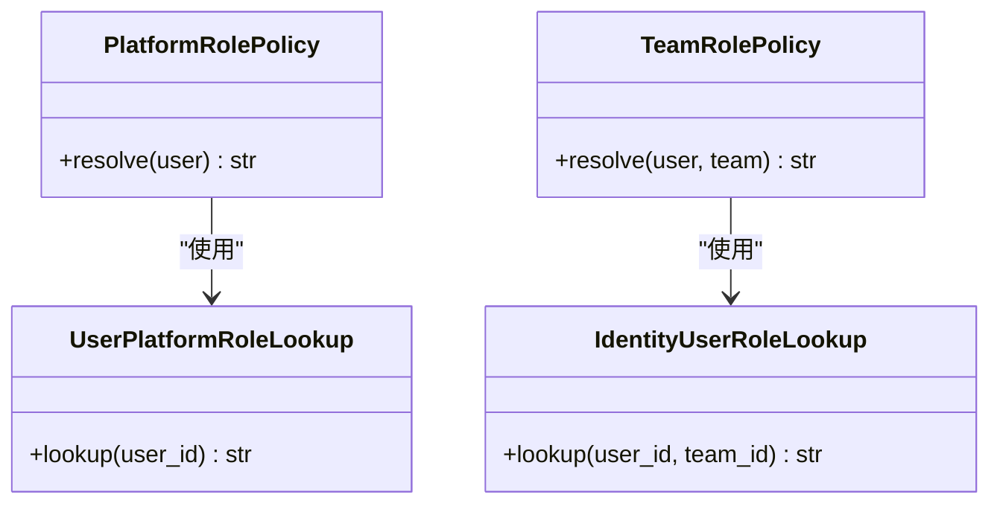
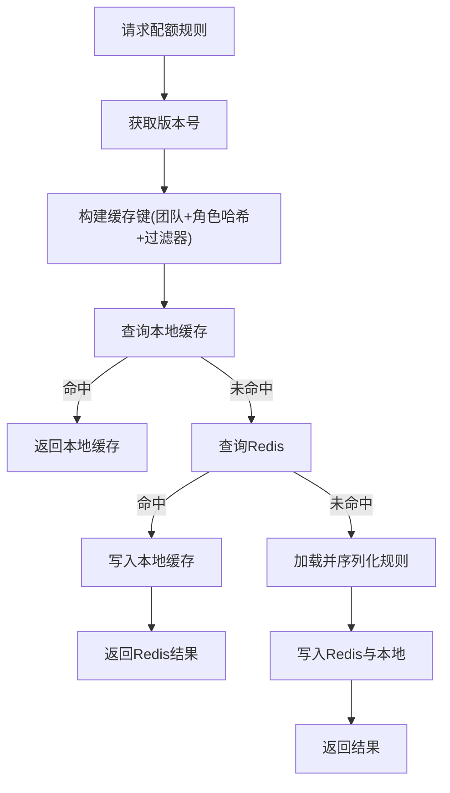
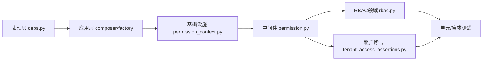

# 权限控制

<cite>
**本文引用的文件**
- [rbac.py](file://backend/domains/identity/domain/rbac.py)
- [rbac_adapter.py](file://backend/domains/identity/infrastructure/auth/rbac_adapter.py)
- [deps.py](file://backend/domains/identity/presentation/deps.py)
- [permission_context.py](file://backend/libs/iam/permission_context.py)
- [permission.py](file://backend/libs/middleware/permission.py)
- [permission_context_composer.py](file://backend/domains/identity/application/permission_context_composer.py)
- [permission_context_factory.py](file://backend/domains/identity/application/permission_context_factory.py)
- [tenant_access_assertions.py](file://backend/libs/iam/tenant_access_assertions.py)
- [team_http.py](file://backend/libs/iam/team_http.py)
- [data_scope_policy.py](file://backend/libs/iam/data_scope_policy.py)
- [deps.py](file://backend/domains/identity/presentation/deps.py)
- [test_rbac.py](file://backend/tests/unit/core/auth/test_rbac.py)
- [test_permission_checks.py](file://backend/tests/unit/identity/presentation/test_permission_checks.py)
- [test_set_permission_context_callers.py](file://backend/tests/architecture/test_set_permission_context_callers.py)
- [test_data_scope_equivalence.py](file://backend/tests/unit/libs/db/test_data_scope_equivalence.py)
- [system_grants_cache.py](file://backend/domains/gateway/application/system_grants_cache.py)
- [quota_rule_cache.py](file://backend/domains/gateway/application/management/quota_rule_cache.py)
- [20260521_tenant_data_scope.py](file://backend/alembic/versions/20260521_tenant_data_scope.py)
- [20260522_tenant_phase3.py](file://backend/alembic/versions/20260522_tenant_phase3.py)
- [20260523_sessions_agents_tenant_id.py](file://backend/alembic/versions/20260523_sessions_agents_tenant_id.py)
- [20260526_provider_credentials_tenant_id.py](file://backend/alembic/versions/20260526_provider_credentials_tenant_id.py)
- [20260530_downstream_pricing_scope_tenant.py](file://backend/alembic/versions/20260530_downstream_pricing_scope_tenant.py)
- [20260531_owned_resources_tenant_id.py](file://backend/alembic/versions/20260531_owned_resources_tenant_id.py)
- [20260601_drop_legacy_tenant_id_fks.py](file://backend/alembic/versions/20260601_drop_legacy_tenant_id_fks.py)
- [20260606_migrate_anonymous_shadow_to_deterministic_tenant.py](file://backend/alembic/versions/20260606_migrate_anonymous_shadow_to_deterministic_tenant.py)
- [20260607_gateway_request_log_tenant_route_time.py](file://backend/alembic/versions/20260607_gateway_request_log_tenant_route_time.py)
- [20260612_gateway_budget_tenant.py](file://backend/alembic/versions/20260612_gateway_budget_tenant.py)
- [tenant_scoped_response.py](file://backend/domains/gateway/presentation/tenant_scoped_response.py)
- [test_tenant_scoped_response.py](file://backend/tests/unit/gateway/test_tenant_scoped_response.py)
- [test_quota_usage_snapshot_tenant.py](file://backend/tests/unit/gateway/test_quota_usage_snapshot_tenant.py)
- [test_budget_service_tenant_bucket.py](file://backend/tests/unit/gateway/test_budget_service_tenant_bucket.py)
- [test_sso_role_persistence.py](file://backend/tests/integration/api/test_sso_role_persistence.py)
- [platform_role_policy.py](file://backend/domains/identity/domain/policies/platform_role_policy.py)
- [team_role.py](file://backend/domains/tenancy/domain/policies/team_role.py)
- [user_platform_role_lookup.py](file://backend/domains/identity/infrastructure/user_platform_role_lookup.py)
- [identity_user_role_lookup.py](file://backend/domains/tenancy/infrastructure/identity_user_role_lookup.py)
- [default_tenant_lifecycle.py](file://backend/domains/identity/infrastructure/default_tenant_lifecycle.py)
- [default_tenant_provisioner.py](file://backend/domains/tenancy/application/default_tenant_provisioner.py)
- [tenant_resolve.py](file://backend/libs/db/tenant_resolve.py)
- [test_repository_permissions.py](file://backend/tests/integration/libs/db/test_repository_permissions.py)
- [test_session_permissions.py](file://backend/tests/integration/api/test_session_permissions.py)
- [test_authz_http.py](file://backend/tests/unit/libs/iam/test_authz_http.py)
- [test_iam_tenancy_contracts.py](file://backend/tests/unit/iam/test_iam_tenancy_contracts.py)
</cite>

## 目录
1. [引言](#引言)
2. [项目结构](#项目结构)
3. [核心组件](#核心组件)
4. [架构总览](#架构总览)
5. [详细组件分析](#详细组件分析)
6. [依赖分析](#依赖分析)
7. [性能考虑](#性能考虑)
8. [故障排查指南](#故障排查指南)
9. [结论](#结论)
10. [附录](#附录)

## 引言
本文件面向AI Agent项目的权限控制体系，系统性阐述RBAC权限模型、多租户权限隔离、权限上下文构建与传递、API端点级权限控制、动态角色与权限管理、权限缓存与性能优化、以及权限审计与合规性要求。文档以仓库现有实现为依据，结合测试与迁移脚本，给出可操作的最佳实践与排障建议。

## 项目结构
权限控制相关代码主要分布在以下区域：
- 领域层：身份域的RBAC定义与策略
- 应用层：权限上下文组合器与工厂
- 基础设施层：权限上下文存储与中间件
- 表现层：依赖注入与端点权限校验
- 网关应用：系统授权键缓存与配额规则缓存
- 数据库迁移：多租户数据范围落地
- 测试：RBAC、租户访问、上下文调用者白名单等

图表来源
- [deps.py](file://backend/domains/identity/presentation/deps.py)
- [team_http.py](file://backend/libs/iam/team_http.py)
- [permission_context_composer.py](file://backend/domains/identity/application/permission_context_composer.py)
- [permission_context_factory.py](file://backend/domains/identity/application/permission_context_factory.py)
- [permission_context.py](file://backend/libs/iam/permission_context.py)
- [permission.py](file://backend/libs/middleware/permission.py)
- [rbac.py](file://backend/domains/identity/domain/rbac.py)
- [platform_role_policy.py](file://backend/domains/identity/domain/policies/platform_role_policy.py)
- [team_role.py](file://backend/domains/tenancy/domain/policies/team_role.py)
- [system_grants_cache.py](file://backend/domains/gateway/application/system_grants_cache.py)
- [quota_rule_cache.py](file://backend/domains/gateway/application/management/quota_rule_cache.py)

章节来源
- [deps.py](file://backend/domains/identity/presentation/deps.py)
- [permission_context.py](file://backend/libs/iam/permission_context.py)
- [permission.py](file://backend/libs/middleware/permission.py)
- [rbac.py](file://backend/domains/identity/domain/rbac.py)

## 核心组件
- RBAC领域模型：定义角色枚举、权限枚举及角色-权限映射规则，并提供权限检查与资源所有权检查逻辑。
- 权限上下文：在请求生命周期内携带用户ID、角色、团队集合等信息，贯穿应用层与基础设施层。
- 多租户策略：通过团队ID集合与数据范围策略实现租户隔离与资源访问控制。
- API端点权限：通过依赖注入与中间件在路由层执行权限校验。
- 缓存与性能：系统授权键缓存与配额规则缓存降低重复计算与数据库压力。
- 合规与审计：迁移脚本与测试覆盖体现数据范围落地与权限一致性。

章节来源
- [rbac.py](file://backend/domains/identity/domain/rbac.py)
- [permission_context.py](file://backend/libs/iam/permission_context.py)
- [tenant_access_assertions.py](file://backend/libs/iam/tenant_access_assertions.py)
- [data_scope_policy.py](file://backend/libs/iam/data_scope_policy.py)
- [system_grants_cache.py](file://backend/domains/gateway/application/system_grants_cache.py)
- [quota_rule_cache.py](file://backend/domains/gateway/application/management/quota_rule_cache.py)

## 架构总览
下图展示从请求进入至权限判定的关键流程，包括上下文设置、中间件拦截、依赖注入校验与RBAC检查。

图表来源
- [permission.py](file://backend/libs/middleware/permission.py)
- [deps.py](file://backend/domains/identity/presentation/deps.py)
- [permission_context.py](file://backend/libs/iam/permission_context.py)
- [rbac.py](file://backend/domains/identity/domain/rbac.py)

## 详细组件分析

### RBAC权限模型
- 角色定义：管理员、普通用户、只读用户。
- 权限定义：覆盖Agent、Session、Workflow与系统管理类权限。
- 角色-权限映射：管理员拥有全部权限；普通用户具备创建/读取/更新/删除/执行等能力；只读用户仅具备读取权限。
- 权限检查：支持字符串或枚举输入的角色，统一转换后查询映射集合并判断。
- 资源所有权：管理员可访问所有资源；其他用户仅能访问自身资源。

图表来源
- [rbac.py](file://backend/domains/identity/domain/rbac.py)

章节来源
- [rbac.py](file://backend/domains/identity/domain/rbac.py)
- [test_rbac.py](file://backend/tests/unit/core/auth/test_rbac.py)

### 多租户权限隔离与团队权限管理
- 团队ID集合：权限上下文中维护当前用户所属团队集合，作为租户访问的依据。
- 租户访问断言：提供“仅限团队”与“公开或团队”两类访问校验，拒绝无权限访问。
- 数据范围策略：通过数据范围策略与仓储层配合，确保查询与写入限定在当前租户范围内。
- 迁移脚本落地：多版本迁移逐步引入并固化租户字段与外键约束，保证历史数据与新表结构一致。

图表来源
- [tenant_access_assertions.py](file://backend/libs/iam/tenant_access_assertions.py)
- [test_permission_checks.py](file://backend/tests/unit/identity/presentation/test_permission_checks.py)

章节来源
- [tenant_access_assertions.py](file://backend/libs/iam/tenant_access_assertions.py)
- [data_scope_policy.py](file://backend/libs/iam/data_scope_policy.py)
- [test_permission_checks.py](file://backend/tests/unit/identity/presentation/test_permission_checks.py)
- [test_data_scope_equivalence.py](file://backend/tests/unit/libs/db/test_data_scope_equivalence.py)
- [20260521_tenant_data_scope.py](file://backend/alembic/versions/20260521_tenant_data_scope.py)
- [20260522_tenant_phase3.py](file://backend/alembic/versions/20260522_tenant_phase3.py)
- [20260523_sessions_agents_tenant_id.py](file://backend/alembic/versions/20260523_sessions_agents_tenant_id.py)
- [20260526_provider_credentials_tenant_id.py](file://backend/alembic/versions/20260526_provider_credentials_tenant_id.py)
- [20260530_downstream_pricing_scope_tenant.py](file://backend/alembic/versions/20260530_downstream_pricing_scope_tenant.py)
- [20260531_owned_resources_tenant_id.py](file://backend/alembic/versions/20260531_owned_resources_tenant_id.py)
- [20260601_drop_legacy_tenant_id_fks.py](file://backend/alembic/versions/20260601_drop_legacy_tenant_id_fks.py)
- [20260606_migrate_anonymous_shadow_to_deterministic_tenant.py](file://backend/alembic/versions/20260606_migrate_anonymous_shadow_to_deterministic_tenant.py)
- [20260607_gateway_request_log_tenant_route_time.py](file://backend/alembic/versions/20260607_gateway_request_log_tenant_route_time.py)
- [20260612_gateway_budget_tenant.py](file://backend/alembic/versions/20260612_gateway_budget_tenant.py)

### 权限上下文的构建与传递
- 上下文来源：由应用层组合器与工厂根据请求上下文、用户信息与团队信息构建。
- 中间件注入：权限中间件在请求进入时读取或设置权限上下文，确保后续依赖注入可用。
- 调用者白名单：限制仅允许特定模块调用上下文设置函数，避免滥用。

图表来源
- [permission_context_composer.py](file://backend/domains/identity/application/permission_context_composer.py)
- [permission_context_factory.py](file://backend/domains/identity/application/permission_context_factory.py)
- [permission_context.py](file://backend/libs/iam/permission_context.py)
- [permission.py](file://backend/libs/middleware/permission.py)
- [test_set_permission_context_callers.py](file://backend/tests/architecture/test_set_permission_context_callers.py)

章节来源
- [permission_context_composer.py](file://backend/domains/identity/application/permission_context_composer.py)
- [permission_context_factory.py](file://backend/domains/identity/application/permission_context_factory.py)
- [permission_context.py](file://backend/libs/iam/permission_context.py)
- [permission.py](file://backend/libs/middleware/permission.py)
- [test_set_permission_context_callers.py](file://backend/tests/architecture/test_set_permission_context_callers.py)

### API端点级别的权限控制
- 依赖注入：在路由层通过依赖注入解析当前用户角色与团队集合，结合RBAC与租户访问断言进行校验。
- 团队HTTP工具：封装团队维度的HTTP交互与权限声明。
- 端到端验证：集成测试覆盖会话等资源的权限边界。

图表来源
- [deps.py](file://backend/domains/identity/presentation/deps.py)
- [rbac.py](file://backend/domains/identity/domain/rbac.py)
- [tenant_access_assertions.py](file://backend/libs/iam/tenant_access_assertions.py)
- [team_http.py](file://backend/libs/iam/team_http.py)
- [test_session_permissions.py](file://backend/tests/integration/api/test_session_permissions.py)

章节来源
- [deps.py](file://backend/domains/identity/presentation/deps.py)
- [team_http.py](file://backend/libs/iam/team_http.py)
- [test_session_permissions.py](file://backend/tests/integration/api/test_session_permissions.py)

### 用户角色与权限的动态管理
- 平台角色策略：平台级角色与团队角色分离，支持跨域权限扩展。
- 角色查找：平台角色与团队角色分别通过各自的查找器解析，确保职责清晰。
- 默认租户生命周期：为匿名用户与默认场景提供确定性的租户分配策略。

图表来源
- [platform_role_policy.py](file://backend/domains/identity/domain/policies/platform_role_policy.py)
- [team_role.py](file://backend/domains/tenancy/domain/policies/team_role.py)
- [user_platform_role_lookup.py](file://backend/domains/identity/infrastructure/user_platform_role_lookup.py)
- [identity_user_role_lookup.py](file://backend/domains/tenancy/infrastructure/identity_user_role_lookup.py)
- [default_tenant_lifecycle.py](file://backend/domains/identity/infrastructure/default_tenant_lifecycle.py)
- [default_tenant_provisioner.py](file://backend/domains/tenancy/application/default_tenant_provisioner.py)

章节来源
- [platform_role_policy.py](file://backend/domains/identity/domain/policies/platform_role_policy.py)
- [team_role.py](file://backend/domains/tenancy/domain/policies/team_role.py)
- [user_platform_role_lookup.py](file://backend/domains/identity/infrastructure/user_platform_role_lookup.py)
- [identity_user_role_lookup.py](file://backend/domains/tenancy/infrastructure/identity_user_role_lookup.py)
- [default_tenant_lifecycle.py](file://backend/domains/identity/infrastructure/default_tenant_lifecycle.py)
- [default_tenant_provisioner.py](file://backend/domains/tenancy/application/default_tenant_provisioner.py)

### 权限缓存与性能优化
- 系统授权键缓存：以团队+用户为键缓存授权键集合，支持本地内存与Redis两级缓存，带TTL与失效策略。
- 配额规则缓存：按团队与角色哈希隔离缓存，支持版本号与过滤器哈希，减少重复查询。
- 性能要点：本地缓存容量控制、Redis读写失败降级、批量失效与扫描清理。

图表来源
- [system_grants_cache.py](file://backend/domains/gateway/application/system_grants_cache.py)
- [quota_rule_cache.py](file://backend/domains/gateway/application/management/quota_rule_cache.py)

章节来源
- [system_grants_cache.py](file://backend/domains/gateway/application/system_grants_cache.py)
- [quota_rule_cache.py](file://backend/domains/gateway/application/management/quota_rule_cache.py)

### 权限审计与合规性
- 数据范围一致性：通过多轮迁移脚本将租户字段引入各实体，确保历史数据与新规则一致。
- 端到端验证：测试覆盖租户范围响应、配额快照与预算桶的租户维度正确性。
- 合规基线：SSO角色持久化测试保障跨系统角色一致性。

章节来源
- [20260521_tenant_data_scope.py](file://backend/alembic/versions/20260521_tenant_data_scope.py)
- [20260522_tenant_phase3.py](file://backend/alembic/versions/20260522_tenant_phase3.py)
- [20260523_sessions_agents_tenant_id.py](file://backend/alembic/versions/20260523_sessions_agents_tenant_id.py)
- [20260526_provider_credentials_tenant_id.py](file://backend/alembic/versions/20260526_provider_credentials_tenant_id.py)
- [20260530_downstream_pricing_scope_tenant.py](file://backend/alembic/versions/20260530_downstream_pricing_scope_tenant.py)
- [20260531_owned_resources_tenant_id.py](file://backend/alembic/versions/20260531_owned_resources_tenant_id.py)
- [20260601_drop_legacy_tenant_id_fks.py](file://backend/alembic/versions/20260601_drop_legacy_tenant_id_fks.py)
- [20260606_migrate_anonymous_shadow_to_deterministic_tenant.py](file://backend/alembic/versions/20260606_migrate_anonymous_shadow_to_deterministic_tenant.py)
- [20260607_gateway_request_log_tenant_route_time.py](file://backend/alembic/versions/20260607_gateway_request_log_tenant_route_time.py)
- [20260612_gateway_budget_tenant.py](file://backend/alembic/versions/20260612_gateway_budget_tenant.py)
- [test_tenant_scoped_response.py](file://backend/tests/unit/gateway/test_tenant_scoped_response.py)
- [test_quota_usage_snapshot_tenant.py](file://backend/tests/unit/gateway/test_quota_usage_snapshot_tenant.py)
- [test_budget_service_tenant_bucket.py](file://backend/tests/unit/gateway/test_budget_service_tenant_bucket.py)
- [test_sso_role_persistence.py](file://backend/tests/integration/api/test_sso_role_persistence.py)

## 依赖分析
- 组件耦合：表现层依赖应用层与基础设施层；应用层依赖领域模型与基础设施存储；基础设施层依赖中间件与配置。
- 关键依赖链：请求 → 中间件 → 权限上下文 → 依赖注入 → RBAC/租户断言 → 业务处理。
- 外部依赖：Redis用于缓存；数据库迁移脚本确保租户字段存在。

图表来源
- [deps.py](file://backend/domains/identity/presentation/deps.py)
- [permission_context_composer.py](file://backend/domains/identity/application/permission_context_composer.py)
- [permission_context_factory.py](file://backend/domains/identity/application/permission_context_factory.py)
- [permission_context.py](file://backend/libs/iam/permission_context.py)
- [permission.py](file://backend/libs/middleware/permission.py)
- [rbac.py](file://backend/domains/identity/domain/rbac.py)
- [tenant_access_assertions.py](file://backend/libs/iam/tenant_access_assertions.py)

章节来源
- [deps.py](file://backend/domains/identity/presentation/deps.py)
- [permission_context.py](file://backend/libs/iam/permission_context.py)
- [permission.py](file://backend/libs/middleware/permission.py)
- [rbac.py](file://backend/domains/identity/domain/rbac.py)
- [tenant_access_assertions.py](file://backend/libs/iam/tenant_access_assertions.py)

## 性能考虑
- 缓存策略：系统授权键缓存与配额规则缓存均采用本地+Redis双层缓存，带TTL与容量上限，避免热点击穿。
- 失效策略：按团队粒度失效与全量扫描清理，保证缓存一致性。
- 降级与容错：Redis读写异常时记录告警并继续使用本地缓存或回源，确保服务可用。
- 查询优化：迁移脚本引入索引与字段，减少租户范围查询成本。

章节来源
- [system_grants_cache.py](file://backend/domains/gateway/application/system_grants_cache.py)
- [quota_rule_cache.py](file://backend/domains/gateway/application/management/quota_rule_cache.py)
- [20260527_slow_sql_hotpath_indexes.py](file://backend/alembic/versions/20260527_slow_sql_hotpath_indexes.py)

## 故障排查指南
- 权限上下文设置异常
  - 现象：权限校验失败或上下文为空。
  - 排查：确认仅允许白名单模块调用上下文设置函数；检查中间件是否在路由前设置上下文。
  - 参考
    - [test_set_permission_context_callers.py](file://backend/tests/architecture/test_set_permission_context_callers.py)
    - [permission.py](file://backend/libs/middleware/permission.py)
    - [permission_context.py](file://backend/libs/iam/permission_context.py)
- 租户访问被拒
  - 现象：非管理员用户无法访问非自身团队资源。
  - 排查：确认权限上下文中团队ID集合包含目标租户；检查租户访问断言逻辑；核对迁移脚本是否完成。
  - 参考
    - [test_permission_checks.py](file://backend/tests/unit/identity/presentation/test_permission_checks.py)
    - [tenant_access_assertions.py](file://backend/libs/iam/tenant_access_assertions.py)
    - [20260521_tenant_data_scope.py](file://backend/alembic/versions/20260521_tenant_data_scope.py)
- 缓存命中异常
  - 现象：配额规则或授权键频繁回源。
  - 排查：检查缓存键构建（版本号、角色哈希、过滤器哈希）；确认Redis连通性与TTL；触发按团队失效后重试。
  - 参考
    - [quota_rule_cache.py](file://backend/domains/gateway/application/management/quota_rule_cache.py)
    - [system_grants_cache.py](file://backend/domains/gateway/application/system_grants_cache.py)
- 端到端权限边界
  - 现象：会话或资源越权访问。
  - 排查：运行集成测试定位端点权限；核对依赖注入与RBAC检查顺序。
  - 参考
    - [test_session_permissions.py](file://backend/tests/integration/api/test_session_permissions.py)
    - [rbac.py](file://backend/domains/identity/domain/rbac.py)

章节来源
- [test_set_permission_context_callers.py](file://backend/tests/architecture/test_set_permission_context_callers.py)
- [permission.py](file://backend/libs/middleware/permission.py)
- [permission_context.py](file://backend/libs/iam/permission_context.py)
- [test_permission_checks.py](file://backend/tests/unit/identity/presentation/test_permission_checks.py)
- [tenant_access_assertions.py](file://backend/libs/iam/tenant_access_assertions.py)
- [quota_rule_cache.py](file://backend/domains/gateway/application/management/quota_rule_cache.py)
- [system_grants_cache.py](file://backend/domains/gateway/application/system_grants_cache.py)
- [test_session_permissions.py](file://backend/tests/integration/api/test_session_permissions.py)
- [rbac.py](file://backend/domains/identity/domain/rbac.py)

## 结论
本权限体系以RBAC为核心，结合多租户团队ID集合与数据范围策略，在请求生命周期内通过中间件与依赖注入实现端到端的权限控制。应用层组合器与工厂负责上下文构建，基础设施层提供缓存与存储，迁移脚本与测试保障数据一致性与边界正确性。整体设计兼顾安全性、可扩展性与性能。

## 附录
- 最佳实践
  - 明确角色与权限边界，避免过度授权；优先使用只读权限满足审计与查看需求。
  - 在中间件阶段尽早设置权限上下文，确保后续依赖注入与业务逻辑一致。
  - 使用团队ID集合与租户断言双重保障，防止越权访问。
  - 对热点配额规则与授权键启用缓存，合理设置TTL与失效策略。
  - 定期运行租户范围与权限边界测试，确保变更不破坏隔离性。
- 常见问题
  - 上下文未设置：检查中间件与调用者白名单。
  - 租户访问失败：核对团队ID集合与断言逻辑。
  - 缓存不命中：检查版本号、角色哈希与过滤器哈希构建。
  - 权限边界绕过：复核端点依赖注入与RBAC检查顺序。