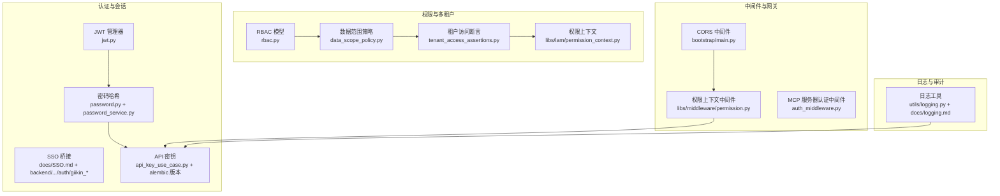
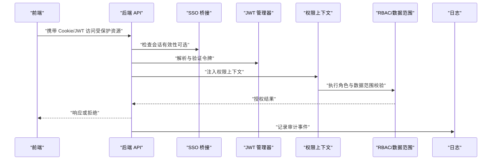
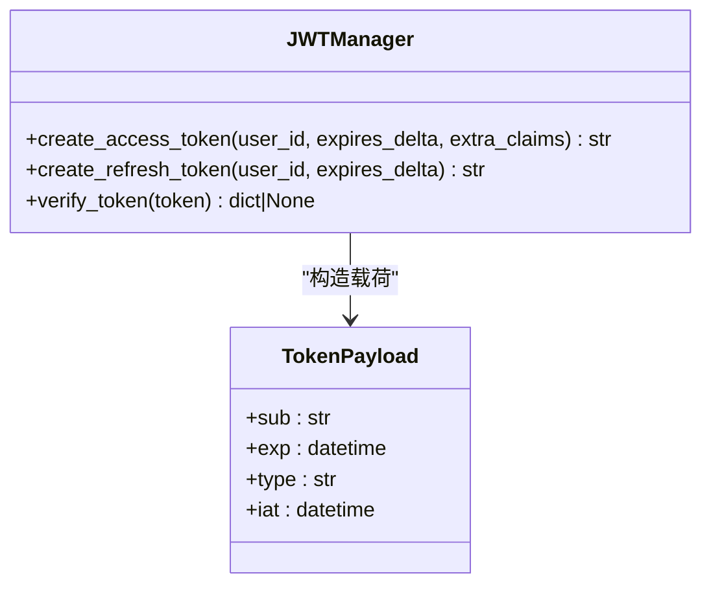
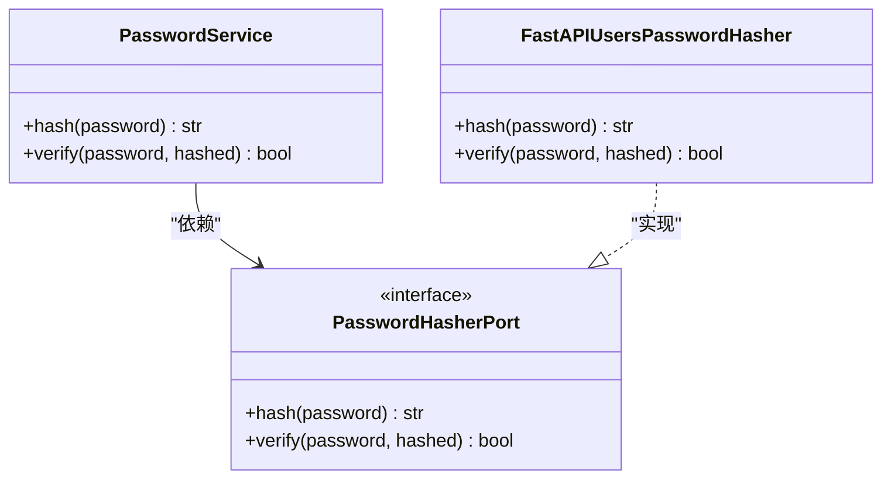
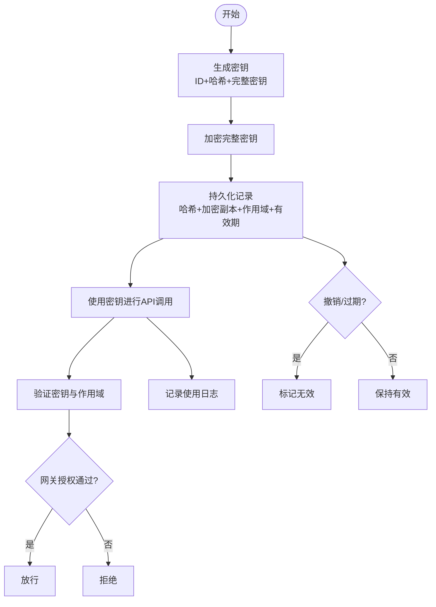
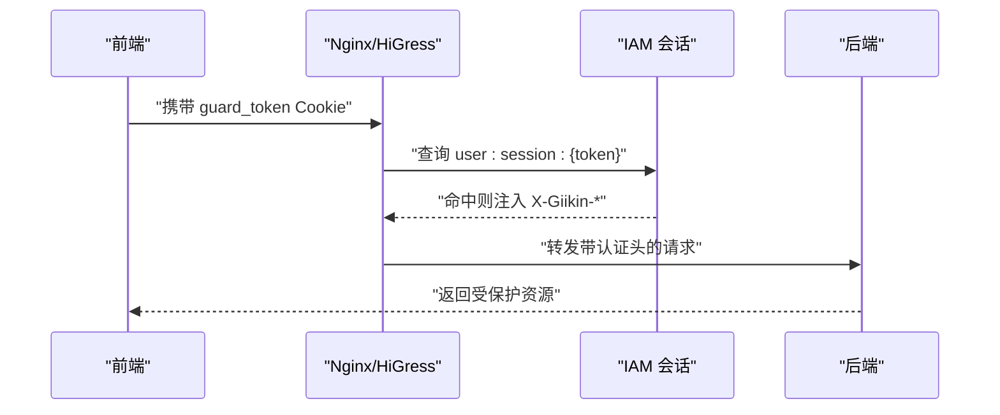
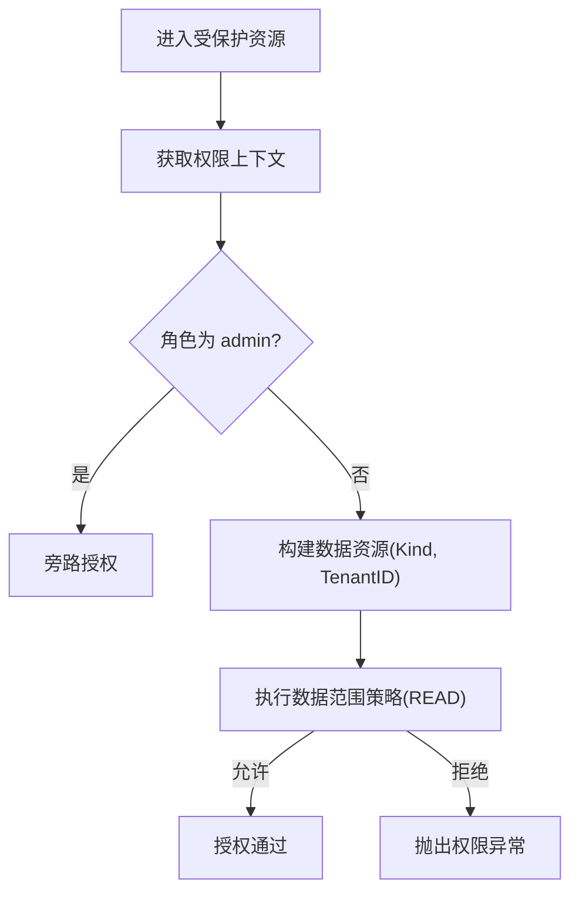
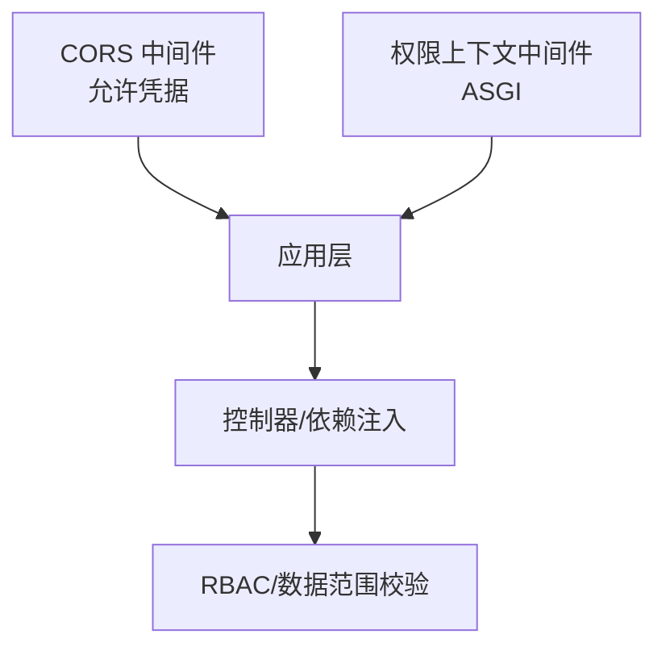
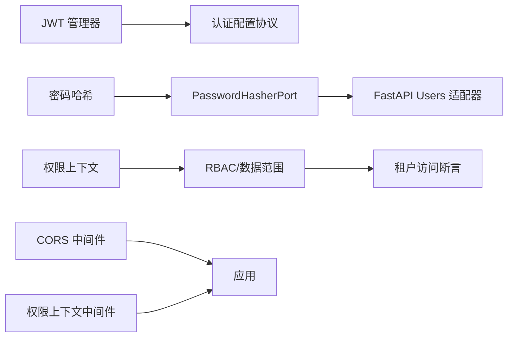

# 认证与安全

<cite>
**本文引用的文件**
- [backend/domains/identity/infrastructure/auth/jwt.py](file://backend/domains/identity/infrastructure/auth/jwt.py)
- [backend/docs/AUTHENTICATION.md](file://backend/docs/AUTHENTICATION.md)
- [docs/SSO.md](file://docs/SSO.md)
- [backend/bootstrap/main.py](file://backend/bootstrap/main.py)
- [backend/libs/middleware/__init__.py](file://backend/libs/middleware/__init__.py)
- [backend/domains/identity/infrastructure/auth/password.py](file://backend/domains/identity/infrastructure/auth/password.py)
- [backend/domains/identity/domain/services/password_service.py](file://backend/domains/identity/domain/services/password_service.py)
- [backend/domains/identity/infrastructure/password_hasher_fastapi_users.py](file://backend/domains/identity/infrastructure/password_hasher_fastapi_users.py)
- [backend/domains/identity/domain/ports/password_hasher.py](file://backend/domains/identity/domain/ports/password_hasher.py)
- [backend/domains/identity/application/api_key_use_case.py](file://backend/domains/identity/application/api_key_use_case.py)
- [backend/tests/unit/core/auth/test_api_key_service.py](file://backend/tests/unit/core/auth/test_api_key_service.py)
- [backend/tests/unit/identity/domain/test_api_key_entity_status.py](file://backend/tests/unit/identity/domain/test_api_key_entity_status.py)
- [backend/tests/unit/application/test_api_key_use_case.py](file://backend/tests/unit/application/test_api_key_use_case.py)
- [backend/alembic/versions/20260127_180000_add_api_keys.py](file://backend/alembic/versions/20260127_180000_add_api_keys.py)
- [backend/alembic/versions/20260604_api_keys_revoked_at.py](file://backend/alembic/versions/20260604_api_keys_revoked_at.py)
- [backend/alembic/versions/20260515_api_key_gateway_grants.py](file://backend/alembic/versions/20260515_api_key_gateway_grants.py)
- [backend/alembic/versions/20260128_add_encrypted_key.py](file://backend/alembic/versions/20260128_add_encrypted_key.py)
- [backend/alembic/versions/20260508_add_provider_credentials.py](file://backend/alembic/versions/20260508_add_provider_credentials.py)
- [backend/libs/iam/tenant_access_assertions.py](file://backend/libs/iam/tenant_access_assertions.py)
- [backend/tests/unit/identity/presentation/test_permission_checks.py](file://backend/tests/unit/identity/presentation/test_permission_checks.py)
- [backend/tests/unit/libs/db/test_data_scope_equivalence.py](file://backend/tests/unit/libs/db/test_data_scope_equivalence.py)
- [backend/domains/identity/domain/rbac.py](file://backend/domains/identity/domain/rbac.py)
- [backend/domains/identity/presentation/deps.py](file://backend/domains/identity/presentation/deps.py)
- [backend/domains/identity/presentation/schemas.py](file://backend/domains/identity/presentation/schemas.py)
- [backend/libs/exceptions.py](file://backend/libs/exceptions.py)
- [backend/libs/iam/data_scope_policy.py](file://backend/libs/iam/data_scope_policy.py)
- [backend/libs/iam/permission_context.py](file://backend/libs/iam/permission_context.py)
- [backend/libs/middleware/permission.py](file://backend/libs/middleware/permission.py)
- [backend/libs/crypto.py](file://backend/libs/crypto.py)
- [backend/utils/crypto.py](file://backend/utils/crypto.py)
- [backend/tests/unit/utils/test_crypto.py](file://backend/tests/unit/utils/test_crypto.py)
- [backend/tests/unit/libs/test_fernet_crypto.py](file://backend/tests/unit/libs/test_fernet_crypto.py)
- [backend/frontend/src/lib/session-invalidation.test.ts](file://backend/frontend/src/lib/session-invalidation.test.ts)
- [docs/logging.md](file://docs/logging.md)
- [backend/domains/agent/infrastructure/mcp_server/auth_middleware.py](file://backend/domains/agent/infrastructure/mcp_server/auth_middleware.py)
</cite>

## 目录
1. [简介](#简介)
2. [项目结构](#项目结构)
3. [核心组件](#核心组件)
4. [架构总览](#架构总览)
5. [详细组件分析](#详细组件分析)
6. [依赖关系分析](#依赖关系分析)
7. [性能考虑](#性能考虑)
8. [故障排查指南](#故障排查指南)
9. [结论](#结论)
10. [附录](#附录)

## 简介
本文件面向AI Agent项目的认证与安全，覆盖以下主题：
- 身份认证机制：JWT令牌管理、API密钥认证、SSO单点登录集成
- 权限控制系统：RBAC权限模型、多租户权限隔离、资源访问控制
- 安全中间件：请求验证、CORS配置、CSRF保护现状与建议
- 密码哈希策略与会话管理
- OAuth2.0与OpenID Connect集成现状与建议
- 安全审计与日志记录要求
- API密钥生命周期管理与撤销机制

## 项目结构
后端采用分层与领域驱动设计，安全相关能力主要分布在以下模块：
- 认证与会话：JWT管理、SSO桥接、密码哈希、API密钥
- 权限与多租户：RBAC、数据范围策略、权限上下文
- 中间件与网关：CORS、权限上下文注入、平台级使用统计
- 日志与审计：统一日志工具、审计日志字段约定

**图表来源**
- [backend/domains/identity/infrastructure/auth/jwt.py:1-217](file://backend/domains/identity/infrastructure/auth/jwt.py#L1-L217)
- [backend/domains/identity/infrastructure/auth/password.py:1-42](file://backend/domains/identity/infrastructure/auth/password.py#L1-L42)
- [backend/domains/identity/domain/services/password_service.py:1-31](file://backend/domains/identity/domain/services/password_service.py#L1-L31)
- [docs/SSO.md:84-475](file://docs/SSO.md#L84-L475)
- [backend/domains/identity/application/api_key_use_case.py:82-240](file://backend/domains/identity/application/api_key_use_case.py#L82-L240)
- [backend/domains/identity/domain/rbac.py](file://backend/domains/identity/domain/rbac.py)
- [backend/libs/iam/data_scope_policy.py](file://backend/libs/iam/data_scope_policy.py)
- [backend/libs/iam/tenant_access_assertions.py:1-62](file://backend/libs/iam/tenant_access_assertions.py#L1-L62)
- [backend/libs/iam/permission_context.py](file://backend/libs/iam/permission_context.py)
- [backend/bootstrap/main.py:192-230](file://backend/bootstrap/main.py#L192-L230)
- [backend/libs/middleware/permission.py](file://backend/libs/middleware/permission.py)
- [backend/domains/agent/infrastructure/mcp_server/auth_middleware.py](file://backend/domains/agent/infrastructure/mcp_server/auth_middleware.py)
- [docs/logging.md](file://docs/logging.md)

**章节来源**
- [backend/domains/identity/infrastructure/auth/jwt.py:1-217](file://backend/domains/identity/infrastructure/auth/jwt.py#L1-L217)
- [backend/docs/AUTHENTICATION.md:49-73](file://backend/docs/AUTHENTICATION.md#L49-L73)
- [docs/SSO.md:84-475](file://docs/SSO.md#L84-L475)
- [backend/bootstrap/main.py:192-230](file://backend/bootstrap/main.py#L192-L230)
- [backend/libs/middleware/__init__.py:1-17](file://backend/libs/middleware/__init__.py#L1-L17)

## 核心组件
- JWT令牌管理：支持访问令牌与刷新令牌的生成与验证，具备过期处理与日志记录。
- 密码哈希：基于bcrypt的密码哈希与校验，支持FastAPI Users适配器。
- API密钥认证：密钥生成、加密存储、作用域与有效期管理、网关授权、状态判定与撤销。
- SSO单点登录：通过HiGress Wasm插件与IAM会话桥接，Cookie与Redis会话联动。
- 权限控制：RBAC角色模型与数据范围策略结合，多租户隔离与资源访问断言。
- 安全中间件：CORS配置、权限上下文注入、平台级使用统计中间件。

**章节来源**
- [backend/domains/identity/infrastructure/auth/jwt.py:35-193](file://backend/domains/identity/infrastructure/auth/jwt.py#L35-L193)
- [backend/domains/identity/infrastructure/auth/password.py:10-42](file://backend/domains/identity/infrastructure/auth/password.py#L10-L42)
- [backend/domains/identity/domain/services/password_service.py:19-31](file://backend/domains/identity/domain/services/password_service.py#L19-L31)
- [backend/domains/identity/application/api_key_use_case.py:82-240](file://backend/domains/identity/application/api_key_use_case.py#L82-L240)
- [docs/SSO.md:84-475](file://docs/SSO.md#L84-L475)
- [backend/domains/identity/domain/rbac.py](file://backend/domains/identity/domain/rbac.py)
- [backend/libs/iam/data_scope_policy.py](file://backend/libs/iam/data_scope_policy.py)
- [backend/libs/iam/tenant_access_assertions.py:22-62](file://backend/libs/iam/tenant_access_assertions.py#L22-L62)
- [backend/bootstrap/main.py:192-230](file://backend/bootstrap/main.py#L192-L230)
- [backend/libs/middleware/permission.py](file://backend/libs/middleware/permission.py)

## 架构总览
下图展示了认证与安全的关键交互流程：前端通过SSO或JWT进行认证，后端通过权限上下文与数据范围策略进行资源访问控制，并在必要时记录审计日志。

**图表来源**
- [docs/SSO.md:84-475](file://docs/SSO.md#L84-L475)
- [backend/domains/identity/infrastructure/auth/jwt.py:120-193](file://backend/domains/identity/infrastructure/auth/jwt.py#L120-L193)
- [backend/libs/iam/permission_context.py](file://backend/libs/iam/permission_context.py)
- [backend/libs/iam/data_scope_policy.py](file://backend/libs/iam/data_scope_policy.py)
- [docs/logging.md](file://docs/logging.md)

## 详细组件分析

### JWT 令牌管理
- 功能要点
  - 访问令牌与刷新令牌生成，支持额外声明与过期时间控制
  - 令牌验证与过期处理，异常日志记录
  - 全局管理器初始化与便捷函数接口
- 安全特性
  - 使用标准JWT库进行签名与验证
  - 过期时间严格控制，防止长期有效令牌滥用
- 使用建议
  - 为敏感操作启用短期访问令牌与刷新令牌轮换
  - 在网关层对令牌进行统一解析与校验

**图表来源**
- [backend/domains/identity/infrastructure/auth/jwt.py:26-193](file://backend/domains/identity/infrastructure/auth/jwt.py#L26-L193)

**章节来源**
- [backend/domains/identity/infrastructure/auth/jwt.py:35-193](file://backend/domains/identity/infrastructure/auth/jwt.py#L35-L193)
- [backend/docs/AUTHENTICATION.md:49-73](file://backend/docs/AUTHENTICATION.md#L49-L73)

### 密码哈希策略
- 实现方式
  - bcrypt哈希，盐随机生成，确保相同明文产生不同哈希
  - FastAPI Users适配器提供统一端口，便于替换与扩展
- 安全特性
  - 高成本参数（轮数）抵御暴力破解
  - 哈希值包含算法标识，便于未来迁移
- 最佳实践
  - 新用户注册与密码更新必须使用领域服务进行哈希
  - 禁止存储明文或弱哈希

**图表来源**
- [backend/domains/identity/domain/services/password_service.py:19-31](file://backend/domains/identity/domain/services/password_service.py#L19-L31)
- [backend/domains/identity/domain/ports/password_hasher.py:8-14](file://backend/domains/identity/domain/ports/password_hasher.py#L8-L14)
- [backend/domains/identity/infrastructure/password_hasher_fastapi_users.py:10-23](file://backend/domains/identity/infrastructure/password_hasher_fastapi_users.py#L10-L23)

**章节来源**
- [backend/domains/identity/infrastructure/auth/password.py:10-42](file://backend/domains/identity/infrastructure/auth/password.py#L10-L42)
- [backend/domains/identity/domain/services/password_service.py:19-31](file://backend/domains/identity/domain/services/password_service.py#L19-L31)
- [backend/domains/identity/infrastructure/password_hasher_fastapi_users.py:10-23](file://backend/domains/identity/infrastructure/password_hasher_fastapi_users.py#L10-L23)
- [backend/domains/identity/domain/ports/password_hasher.py:8-14](file://backend/domains/identity/domain/ports/password_hasher.py#L8-L14)

### API 密钥认证与生命周期
- 功能要点
  - 密钥生成：前缀、ID、完整密钥与哈希分离存储
  - 加密存储：Fernet对称加密保存完整密钥，仅授权查看
  - 作用域与有效期：创建时校验，更新时限制扩展
  - 网关授权：按团队维度授予网关代理权限与守卫开关
  - 状态管理：激活、禁用、撤销、过期状态与有效性判定
  - 撤销机制：数据库字段支持撤销时间戳，配合状态判定
- 安全特性
  - 完整密钥仅在创建时可见，后续仅存储哈希与加密副本
  - 网关授权与守卫开关可按团队细粒度控制
  - 状态与撤销字段确保密钥失效快速生效
- 生命周期流程

**图表来源**
- [backend/domains/identity/application/api_key_use_case.py:82-240](file://backend/domains/identity/application/api_key_use_case.py#L82-L240)
- [backend/alembic/versions/20260127_180000_add_api_keys.py:29-64](file://backend/alembic/versions/20260127_180000_add_api_keys.py#L29-L64)
- [backend/alembic/versions/20260604_api_keys_revoked_at.py](file://backend/alembic/versions/20260604_api_keys_revoked_at.py)
- [backend/alembic/versions/20260515_api_key_gateway_grants.py](file://backend/alembic/versions/20260515_api_key_gateway_grants.py)
- [backend/alembic/versions/20260128_add_encrypted_key.py](file://backend/alembic/versions/20260128_add_encrypted_key.py)

**章节来源**
- [backend/domains/identity/application/api_key_use_case.py:82-240](file://backend/domains/identity/application/api_key_use_case.py#L82-L240)
- [backend/tests/unit/core/auth/test_api_key_service.py:339-376](file://backend/tests/unit/core/auth/test_api_key_service.py#L339-L376)
- [backend/tests/unit/identity/domain/test_api_key_entity_status.py:38-59](file://backend/tests/unit/identity/domain/test_api_key_entity_status.py#L38-L59)
- [backend/tests/unit/application/test_api_key_use_case.py:168-325](file://backend/tests/unit/application/test_api_key_use_case.py#L168-L325)
- [backend/alembic/versions/20260127_180000_add_api_keys.py:29-64](file://backend/alembic/versions/20260127_180000_add_api_keys.py#L29-L64)
- [backend/alembic/versions/20260604_api_keys_revoked_at.py](file://backend/alembic/versions/20260604_api_keys_revoked_at.py)
- [backend/alembic/versions/20260515_api_key_gateway_grants.py](file://backend/alembic/versions/20260515_api_key_gateway_grants.py)
- [backend/alembic/versions/20260128_add_encrypted_key.py](file://backend/alembic/versions/20260128_add_encrypted_key.py)

### SSO 单点登录集成
- 集成方式
  - HiGress Wasm插件读取HttpOnly Cookie并注入IAM头
  - Redis中维护用户会话键值，与Sa-Token与Cookie保持一致
  - 登录、续期、登出三步一致性保障
- 流程示意

**图表来源**
- [docs/SSO.md:84-475](file://docs/SSO.md#L84-L475)

**章节来源**
- [docs/SSO.md:84-475](file://docs/SSO.md#L84-L475)
- [backend/docs/AUTHENTICATION.md:49-73](file://backend/docs/AUTHENTICATION.md#L49-L73)

### 权限控制系统（RBAC + 多租户）
- RBAC模型
  - 角色定义与权限映射，管理员拥有旁路权限
- 多租户隔离
  - 数据范围策略与租户ID绑定，READ动作默认校验
  - 租户访问断言在Presentation与IAM层均有实现
- 权限上下文
  - ASGI中间件注入权限上下文，依赖注入在认证依赖中写入
- 断言与校验

**图表来源**
- [backend/libs/iam/tenant_access_assertions.py:22-62](file://backend/libs/iam/tenant_access_assertions.py#L22-L62)
- [backend/libs/iam/data_scope_policy.py](file://backend/libs/iam/data_scope_policy.py)
- [backend/libs/iam/permission_context.py](file://backend/libs/iam/permission_context.py)
- [backend/libs/exceptions.py](file://backend/libs/exceptions.py)

**章节来源**
- [backend/domains/identity/domain/rbac.py](file://backend/domains/identity/domain/rbac.py)
- [backend/libs/iam/tenant_access_assertions.py:22-62](file://backend/libs/iam/tenant_access_assertions.py#L22-L62)
- [backend/tests/unit/identity/presentation/test_permission_checks.py:34-50](file://backend/tests/unit/identity/presentation/test_permission_checks.py#L34-L50)
- [backend/tests/unit/libs/db/test_data_scope_equivalence.py:55-81](file://backend/tests/unit/libs/db/test_data_scope_equivalence.py#L55-L81)

### 安全中间件与请求验证
- CORS配置
  - 支持凭据传递，生产环境需明确白名单源
  - 暴露限流与网关相关响应头
- 权限上下文中间件
  - ASGI边界预清/清理，实际上下文由认证依赖写入
- CSRF保护现状
  - 当前未发现显式的CSRF中间件或Token校验
  - 建议在表单提交场景引入CSRF保护（参考最佳实践）

**图表来源**
- [backend/bootstrap/main.py:192-230](file://backend/bootstrap/main.py#L192-L230)
- [backend/libs/middleware/permission.py](file://backend/libs/middleware/permission.py)

**章节来源**
- [backend/bootstrap/main.py:192-230](file://backend/bootstrap/main.py#L192-L230)
- [backend/libs/middleware/__init__.py:1-17](file://backend/libs/middleware/__init__.py#L1-L17)

### 会话管理机制
- JWT会话
  - 访问令牌短期有效，刷新令牌用于轮换
- SSO会话
  - HttpOnly Cookie + Redis会话键值，避免前端直接读取
  - 登录/续期/登出一致性保障
- 前端会话失效策略
  - 401且包含“无效或过期”提示时触发全局登出
  - 403与“认证所需”不触发全局登出

**章节来源**
- [backend/frontend/src/lib/session-invalidation.test.ts:1-34](file://backend/frontend/src/lib/session-invalidation.test.ts#L1-L34)
- [docs/SSO.md:84-475](file://docs/SSO.md#L84-L475)

### OAuth2.0 与 OpenID Connect 集成现状与建议
- 现状
  - SSO通过外部IAM与Wasm桥接实现，未在后端直接集成OIDC Provider
- 建议
  - 若需自建OIDC Provider，建议使用成熟库（如Authlib/FastAPI-Users OIDC）
  - 与现有JWT与SSO路径解耦，避免重复认证链路
  - 保持会话一致性：Sa-Token、Redis会话键、Cookie三者同步

[本节为概念性建议，不直接分析具体文件]

### 安全审计与日志记录
- 日志工具
  - 统一日志工具与日志规范，建议在认证、授权、密钥使用、会话变更等关键路径记录审计事件
- 建议字段
  - 时间、用户ID/租户ID、操作类型、IP地址、User-Agent、结果状态、原因码
- 审计范围
  - 登录/登出、密钥创建/撤销、权限提升、敏感资源访问

**章节来源**
- [docs/logging.md](file://docs/logging.md)

### API 密钥生命周期管理与撤销
- 生命周期阶段
  - 创建：生成ID/哈希/完整密钥，加密存储，设置作用域与有效期
  - 使用：验证密钥与作用域，记录使用日志
  - 更新：扩展有效期、调整作用域、临时禁用（非撤销）
  - 撤销：标记撤销时间戳，状态变为REVOKED，立即失效
  - 过期：到期后状态变为EXPIRED，自动失效
- 撤销机制
  - 数据库字段支持撤销时间戳，状态判定优先于有效期
  - 网关授权与守卫开关可配合撤销快速阻断

**章节来源**
- [backend/alembic/versions/20260604_api_keys_revoked_at.py](file://backend/alembic/versions/20260604_api_keys_revoked_at.py)
- [backend/tests/unit/identity/domain/test_api_key_entity_status.py:50-59](file://backend/tests/unit/identity/domain/test_api_key_entity_status.py#L50-L59)
- [backend/tests/unit/application/test_api_key_use_case.py:321-325](file://backend/tests/unit/application/test_api_key_use_case.py#L321-L325)

## 依赖关系分析
- 认证与会话
  - JWT依赖配置协议，避免耦合应用层
  - 密码哈希通过端口抽象，可替换实现
- 权限与多租户
  - 权限上下文在ASGI边界注入，Presentation层依赖认证依赖写入
  - 数据范围策略与租户访问断言共同保证资源隔离
- 中间件
  - CORS与权限上下文中间件在应用启动时注册
  - 平台级使用统计中间件与权限上下文协同

**图表来源**
- [backend/domains/identity/infrastructure/auth/jwt.py:35-46](file://backend/domains/identity/infrastructure/auth/jwt.py#L35-L46)
- [backend/domains/identity/domain/services/password_service.py:24-25](file://backend/domains/identity/domain/services/password_service.py#L24-L25)
- [backend/domains/identity/domain/ports/password_hasher.py:8-14](file://backend/domains/identity/domain/ports/password_hasher.py#L8-L14)
- [backend/libs/iam/permission_context.py](file://backend/libs/iam/permission_context.py)
- [backend/libs/iam/data_scope_policy.py](file://backend/libs/iam/data_scope_policy.py)
- [backend/libs/iam/tenant_access_assertions.py:35-45](file://backend/libs/iam/tenant_access_assertions.py#L35-L45)
- [backend/bootstrap/main.py:192-230](file://backend/bootstrap/main.py#L192-L230)
- [backend/libs/middleware/permission.py](file://backend/libs/middleware/permission.py)

**章节来源**
- [backend/domains/identity/infrastructure/auth/jwt.py:35-46](file://backend/domains/identity/infrastructure/auth/jwt.py#L35-L46)
- [backend/domains/identity/domain/services/password_service.py:24-25](file://backend/domains/identity/domain/services/password_service.py#L24-L25)
- [backend/libs/iam/permission_context.py](file://backend/libs/iam/permission_context.py)
- [backend/bootstrap/main.py:192-230](file://backend/bootstrap/main.py#L192-L230)

## 性能考虑
- JWT令牌
  - 适度缩短访问令牌有效期，降低令牌泄露窗口
  - 使用刷新令牌轮换，减少频繁签发开销
- 密码哈希
  - bcrypt成本参数已设定，避免进一步提高以减少CPU开销
- API密钥
  - 仅在创建时解密完整密钥，其余操作使用哈希与加密副本
  - 网关授权缓存与索引优化（根据数据库版本脚本）
- CORS
  - 生产环境明确白名单，减少预检请求次数

[本节提供一般性指导，不直接分析具体文件]

## 故障排查指南
- JWT相关
  - 令牌过期：检查令牌有效期与刷新流程
  - 无效令牌：检查签名算法与密钥一致性
- SSO相关
  - 401且提示“无效或过期令牌”：前端触发全局登出
  - 403或“认证所需”：不触发全局登出，检查权限与租户访问
- API密钥
  - 状态异常：检查是否撤销或过期
  - 网关授权失败：核对团队授权与守卫开关
- 密码
  - 登录失败：确认哈希算法与盐生成一致性

**章节来源**
- [backend/frontend/src/lib/session-invalidation.test.ts:29-33](file://backend/frontend/src/lib/session-invalidation.test.ts#L29-L33)
- [backend/tests/unit/identity/domain/test_api_key_entity_status.py:50-59](file://backend/tests/unit/identity/domain/test_api_key_entity_status.py#L50-L59)
- [backend/domains/identity/infrastructure/auth/password.py:36-42](file://backend/domains/identity/infrastructure/auth/password.py#L36-L42)

## 结论
本项目在认证与安全方面形成了较为完整的体系：JWT与SSO双轨认证、强密码哈希、细粒度API密钥与网关授权、RBAC与多租户数据范围策略、以及统一的日志与审计基础。建议在CSRF保护、OIDC集成与更细粒度的审计字段方面持续完善，以满足更高安全等级的需求。

## 附录
- 前端会话失效策略测试用例可作为行为参考
- 数据库版本脚本体现了API密钥、网关授权与撤销字段的演进

**章节来源**
- [backend/frontend/src/lib/session-invalidation.test.ts:1-34](file://backend/frontend/src/lib/session-invalidation.test.ts#L1-L34)
- [backend/alembic/versions/20260127_180000_add_api_keys.py:29-64](file://backend/alembic/versions/20260127_180000_add_api_keys.py#L29-L64)
- [backend/alembic/versions/20260515_api_key_gateway_grants.py](file://backend/alembic/versions/20260515_api_key_gateway_grants.py)
- [backend/alembic/versions/20260604_api_keys_revoked_at.py](file://backend/alembic/versions/20260604_api_keys_revoked_at.py)