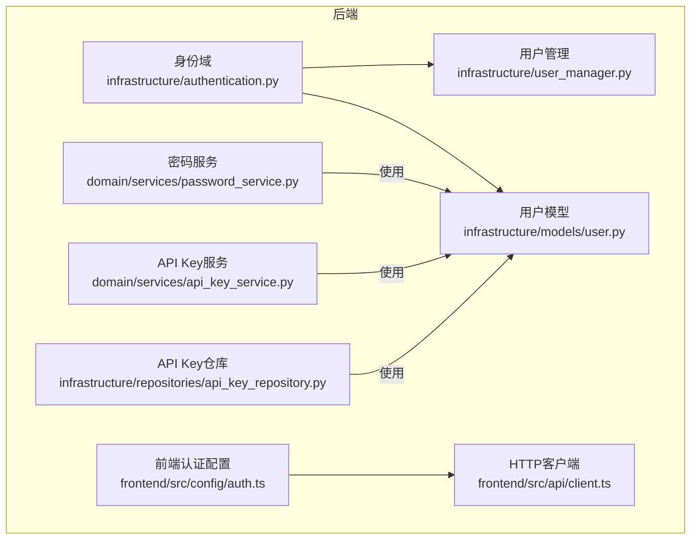
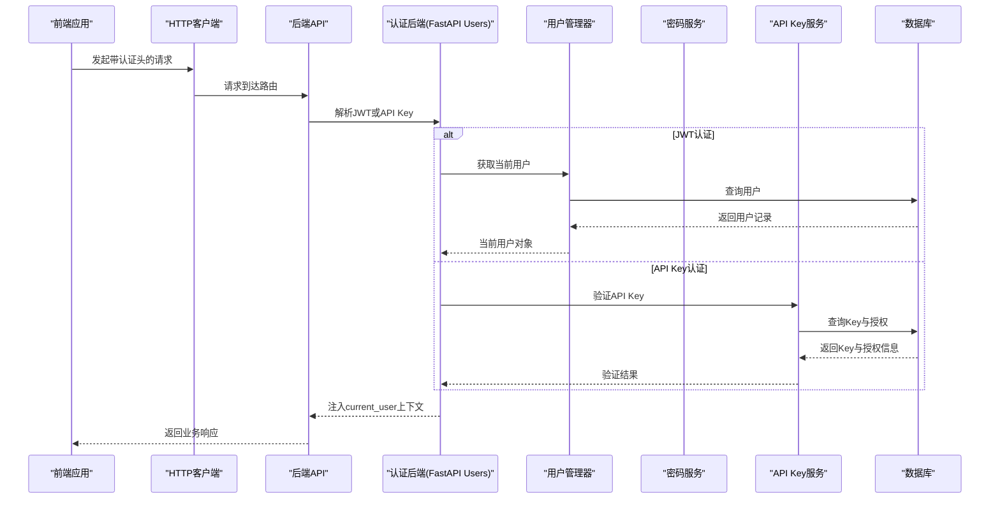
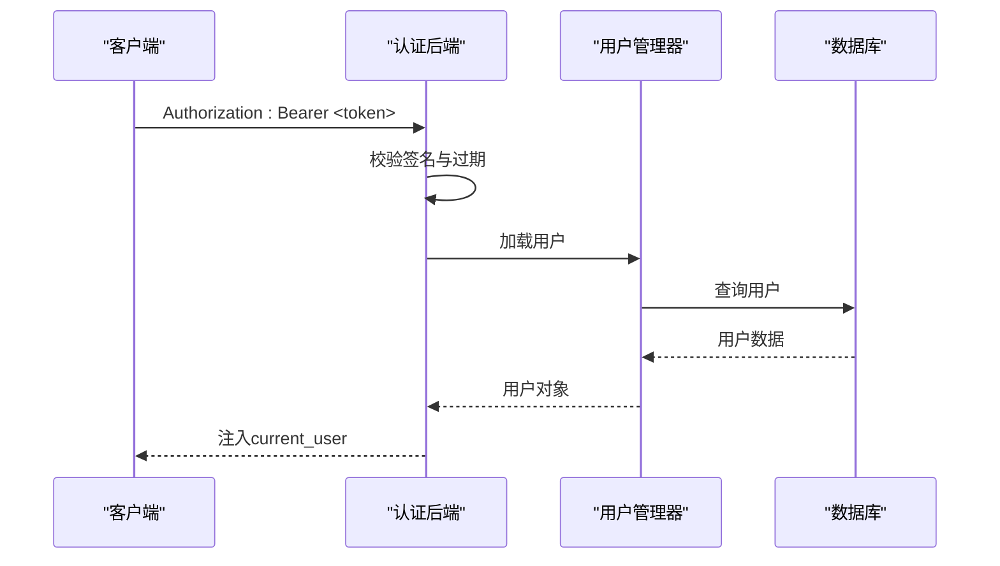
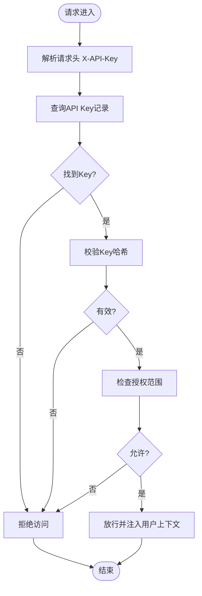
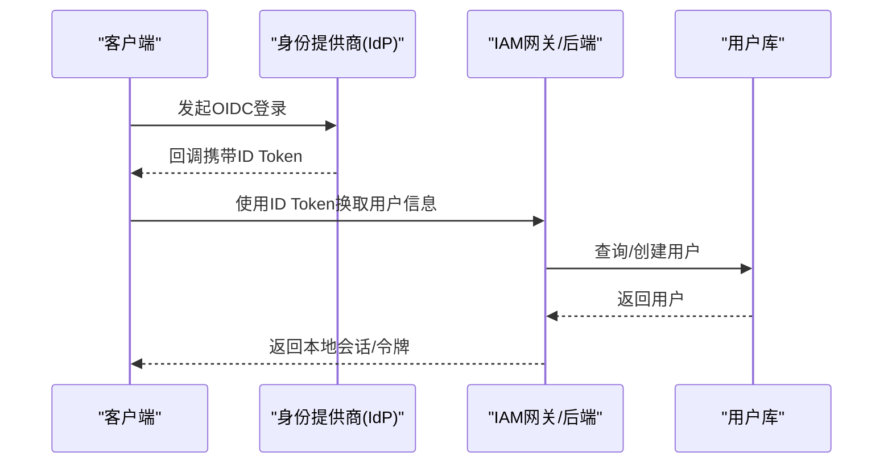
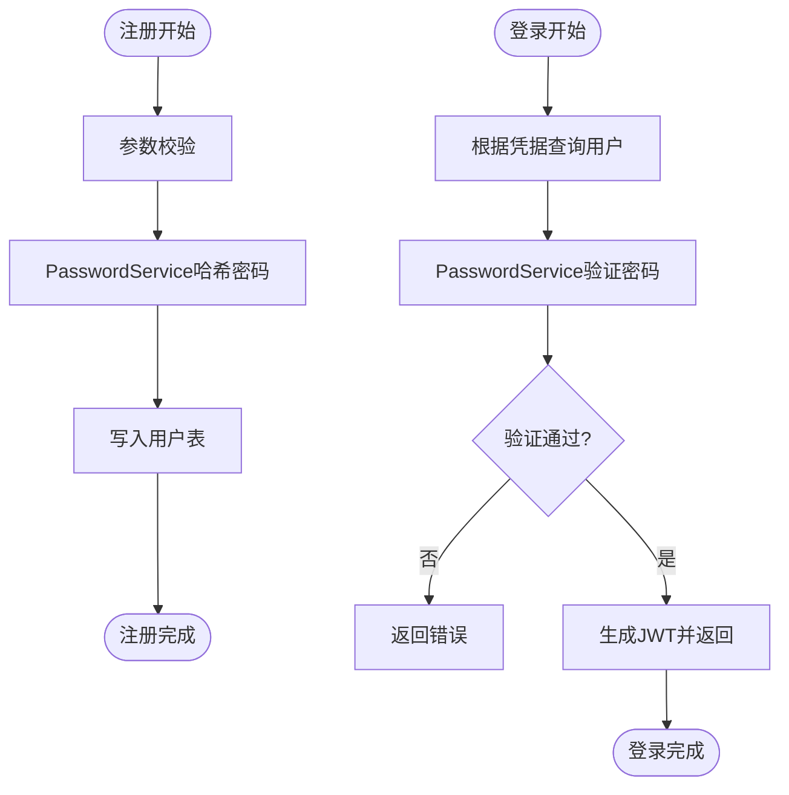
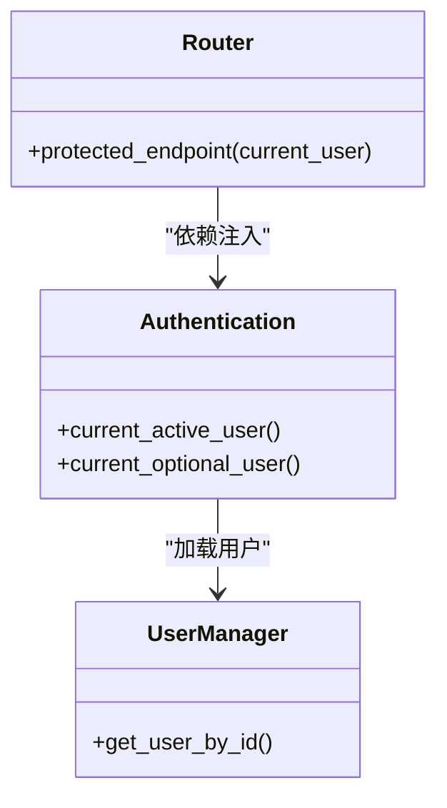
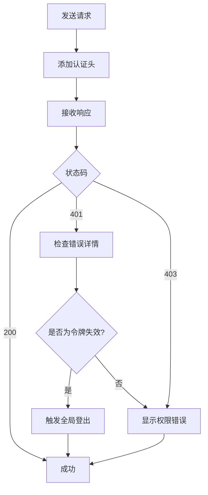
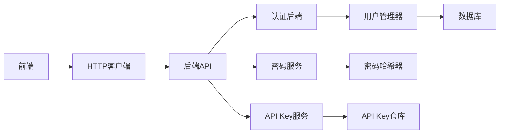

# 身份认证

<cite>
**本文引用的文件**
- [AUTHENTICATION.md](file://backend/docs/AUTHENTICATION.md)
- [SSO.md](file://docs/SSO.md)
- [authentication.py](file://backend/domains/identity/infrastructure/authentication.py)
- [user_manager.py](file://backend/domains/identity/infrastructure/user_manager.py)
- [router.py](file://backend/domains/identity/presentation/router.py)
- [password_hasher.py](file://backend/domains/identity/domain/ports/password_hasher.py)
- [password_hasher_fastapi_users.py](file://backend/domains/identity/infrastructure/password_hasher_fastapi_users.py)
- [password_service.py](file://backend/domains/identity/domain/services/password_service.py)
- [user.py](file://backend/domains/identity/infrastructure/models/user.py)
- [config.py](file://backend/bootstrap/config.py)
- [session_router.py](file://backend/domains/session/presentation/session_router.py)
- [session_invalidation.test.ts](file://frontend/src/lib/session-invalidation.test.ts)
- [005_add_session_status_and_context.down.sql](file://backend/alembic/sql/005_add_session_status_and_context.down.sql)
- [010_align_users_for_fastapi_users.py](file://backend/alembic/versions/010_align_users_for_fastapi_users.py)
- [20260127_180000_add_api_keys.py](file://backend/alembic/versions/20260127_180000_add_api_keys.py)
- [20260128_add_encrypted_key.py](file://backend/alembic/versions/20260128_add_encrypted_key.py)
- [api_key_service.py](file://backend/domains/identity/domain/services/api_key_service.py)
- [api_key_repository.py](file://backend/domains/identity/infrastructure/repositories/api_key_repository.py)
- [crypto.py](file://backend/libs/crypto.py)
- [auth.ts](file://frontend/src/config/auth.ts)
- [client.ts](file://frontend/src/api/client.ts)
</cite>

## 目录
1. [简介](#简介)
2. [项目结构](#项目结构)
3. [核心组件](#核心组件)
4. [架构总览](#架构总览)
5. [详细组件分析](#详细组件分析)
6. [依赖关系分析](#依赖关系分析)
7. [性能考虑](#性能考虑)
8. [故障排查指南](#故障排查指南)
9. [结论](#结论)
10. [附录](#附录)

## 简介
本文件面向AI Agent项目的身份认证系统，系统基于FastAPI Users实现用户域，并结合自研的API Key体系与SSO单点登录能力，覆盖JWT令牌管理、API密钥认证、SSO集成、用户注册与登录、密码哈希策略、会话管理与中间件配置等主题。文档旨在帮助开发者与运维人员理解认证流程、正确配置与扩展认证能力，并遵循安全最佳实践。

## 项目结构
认证相关代码主要分布在以下模块：
- 后端身份域（Identity Domain）：用户模型、认证后端、用户管理器、密码服务、API Key服务与仓库
- 前端认证配置与客户端：认证状态管理、HTTP客户端拦截器
- 配置与迁移：FastAPI Users对齐迁移、API Key与加密列迁移
- 文档：认证与SSO说明文档

图表来源
- [authentication.py:1-120](file://backend/domains/identity/infrastructure/authentication.py#L1-L120)
- [user_manager.py:1-60](file://backend/domains/identity/infrastructure/user_manager.py#L1-L60)
- [user.py:1-40](file://backend/domains/identity/infrastructure/models/user.py#L1-L40)
- [password_service.py:1-40](file://backend/domains/identity/domain/services/password_service.py#L1-L40)
- [api_key_service.py:1-60](file://backend/domains/identity/domain/services/api_key_service.py#L1-L60)
- [api_key_repository.py:1-80](file://backend/domains/identity/infrastructure/repositories/api_key_repository.py#L1-L80)
- [auth.ts:1-120](file://frontend/src/config/auth.ts#L1-L120)
- [client.ts:1-120](file://frontend/src/api/client.ts#L1-L120)

章节来源
- [authentication.py:1-120](file://backend/domains/identity/infrastructure/authentication.py#L1-L120)
- [user_manager.py:1-60](file://backend/domains/identity/infrastructure/user_manager.py#L1-L60)
- [user.py:1-40](file://backend/domains/identity/infrastructure/models/user.py#L1-L40)
- [password_service.py:1-40](file://backend/domains/identity/domain/services/password_service.py#L1-L40)
- [api_key_service.py:1-60](file://backend/domains/identity/domain/services/api_key_service.py#L1-L60)
- [api_key_repository.py:1-80](file://backend/domains/identity/infrastructure/repositories/api_key_repository.py#L1-L80)
- [auth.ts:1-120](file://frontend/src/config/auth.ts#L1-L120)
- [client.ts:1-120](file://frontend/src/api/client.ts#L1-L120)

## 核心组件
- 认证后端与FastAPI Users集成：定义JWT认证后端、当前用户依赖、可选用户依赖
- 用户模型与数据库表：基于SQLAlchemy的用户表，支持FastAPI Users所需字段
- 密码哈希与验证：通过端口抽象与FastAPI Users PasswordHelper实现
- API Key认证：API Key生成、存储（含加密）、验证与授权
- SSO单点登录：支持OIDC与OAuth2 Introspection两种模式
- 会话管理：会话状态与上下文、会话访问控制
- 前端认证状态与拦截器：统一处理401/403与会话失效

章节来源
- [authentication.py:80-120](file://backend/domains/identity/infrastructure/authentication.py#L80-L120)
- [user.py:1-40](file://backend/domains/identity/infrastructure/models/user.py#L1-L40)
- [password_hasher.py:1-20](file://backend/domains/identity/domain/ports/password_hasher.py#L1-L20)
- [password_hasher_fastapi_users.py:1-40](file://backend/domains/identity/infrastructure/password_hasher_fastapi_users.py#L1-L40)
- [password_service.py:1-40](file://backend/domains/identity/domain/services/password_service.py#L1-L40)
- [api_key_service.py:1-60](file://backend/domains/identity/domain/services/api_key_service.py#L1-L60)
- [config.py:200-220](file://backend/bootstrap/config.py#L200-L220)
- [session_router.py:225-264](file://backend/domains/session/presentation/session_router.py#L225-L264)

## 架构总览
下图展示了认证系统的整体交互：前端通过HTTP客户端发起请求，后端认证中间件解析JWT或API Key，FastAPI Users提供当前用户上下文，密码与API Key服务执行验证逻辑，SSO通过外部IdP完成身份校验并返回用户信息。

图表来源
- [authentication.py:80-120](file://backend/domains/identity/infrastructure/authentication.py#L80-L120)
- [user_manager.py:1-60](file://backend/domains/identity/infrastructure/user_manager.py#L1-L60)
- [password_service.py:1-40](file://backend/domains/identity/domain/services/password_service.py#L1-L40)
- [api_key_service.py:1-60](file://backend/domains/identity/domain/services/api_key_service.py#L1-L60)

## 详细组件分析

### JWT令牌管理机制
- 令牌生成：FastAPI Users负责生成与签发JWT，包含用户标识与角色等声明
- 令牌验证：通过认证后端解析Authorization头中的Bearer Token，校验签名与过期时间
- 令牌刷新：系统未显式实现专用刷新接口；通常由客户端在令牌即将过期时重新登录以获取新JWT
- 中间件注入：current_active_user/current_optional_user依赖自动注入当前用户上下文

图表来源
- [authentication.py:88-100](file://backend/domains/identity/infrastructure/authentication.py#L88-L100)
- [user_manager.py:1-60](file://backend/domains/identity/infrastructure/user_manager.py#L1-L60)

章节来源
- [authentication.py:88-100](file://backend/domains/identity/infrastructure/authentication.py#L88-L100)
- [router.py:30-45](file://backend/domains/identity/presentation/router.py#L30-L45)

### API密钥认证系统
- 密钥生成：API Key服务负责生成密钥材料并进行bcrypt哈希存储
- 存储策略：密钥哈希存于数据库，明文前缀用于识别与检索
- 验证流程：请求携带X-API-Key，后端查询对应用户与授权范围，校验密钥有效性
- 授权控制：API Key可绑定特定用户、团队或网关权限，支持撤销与审计

图表来源
- [api_key_service.py:1-60](file://backend/domains/identity/domain/services/api_key_service.py#L1-L60)
- [api_key_repository.py:1-80](file://backend/domains/identity/infrastructure/repositories/api_key_repository.py#L1-L80)
- [20260127_180000_add_api_keys.py:1-80](file://backend/alembic/versions/20260127_180000_add_api_keys.py#L1-L80)
- [20260128_add_encrypted_key.py:1-60](file://backend/alembic/versions/20260128_add_encrypted_key.py#L1-L60)

章节来源
- [api_key_service.py:1-60](file://backend/domains/identity/domain/services/api_key_service.py#L1-L60)
- [api_key_repository.py:1-80](file://backend/domains/identity/infrastructure/repositories/api_key_repository.py#L1-L80)
- [20260127_180000_add_api_keys.py:1-80](file://backend/alembic/versions/20260127_180000_add_api_keys.py#L1-L80)
- [20260128_add_encrypted_key.py:1-60](file://backend/alembic/versions/20260128_add_encrypted_key.py#L1-L60)

### SSO单点登录集成
- 支持模式：OIDC（OpenID Connect）与OAuth2 Introspection
- 配置项：federation_mode、oauth2_introspection_url等
- 工作原理：OIDC通过回调交换ID Token与用户信息；Introspection通过远程端点验证访问令牌有效性

图表来源
- [config.py:200-220](file://backend/bootstrap/config.py#L200-L220)
- [SSO.md:1-200](file://docs/SSO.md#L1-L200)

章节来源
- [config.py:200-220](file://backend/bootstrap/config.py#L200-L220)
- [SSO.md:1-200](file://docs/SSO.md#L1-L200)

### 用户注册与登录流程
- 注册：通过身份域路由触发用户创建，密码经PasswordService哈希后持久化
- 登录：支持用户名/邮箱+密码登录，FastAPI Users认证后端返回JWT
- 密码哈希策略：使用FastAPI Users PasswordHelper，具备自动升级与验证能力
- 会话管理：会话状态与上下文字段已迁移至sessions表，支持活跃状态与上下文存储

图表来源
- [password_service.py:1-40](file://backend/domains/identity/domain/services/password_service.py#L1-L40)
- [password_hasher_fastapi_users.py:1-40](file://backend/domains/identity/infrastructure/password_hasher_fastapi_users.py#L1-L40)
- [010_align_users_for_fastapi_users.py:1-120](file://backend/alembic/versions/010_align_users_for_fastapi_users.py#L1-L120)
- [005_add_session_status_and_context.down.sql:30-58](file://backend/alembic/sql/005_add_session_status_and_context.down.sql#L30-L58)

章节来源
- [password_service.py:1-40](file://backend/domains/identity/domain/services/password_service.py#L1-L40)
- [password_hasher_fastapi_users.py:1-40](file://backend/domains/identity/infrastructure/password_hasher_fastapi_users.py#L1-L40)
- [010_align_users_for_fastapi_users.py:1-120](file://backend/alembic/versions/010_align_users_for_fastapi_users.py#L1-L120)
- [005_add_session_status_and_context.down.sql:30-58](file://backend/alembic/sql/005_add_session_status_and_context.down.sql#L30-L58)

### 认证中间件与路由保护
- 中间件：current_active_user/current_optional_user自动解析并注入当前用户
- 路由保护：受保护路由通过依赖注入获取current_user，未认证时抛出401
- 可选用户：current_optional_user允许匿名访问，便于公开资源

图表来源
- [authentication.py:88-100](file://backend/domains/identity/infrastructure/authentication.py#L88-L100)
- [router.py:30-45](file://backend/domains/identity/presentation/router.py#L30-L45)

章节来源
- [authentication.py:88-100](file://backend/domains/identity/infrastructure/authentication.py#L88-L100)
- [router.py:30-45](file://backend/domains/identity/presentation/router.py#L30-L45)

### 前端认证状态与会话失效处理
- 全局状态：前端通过auth.ts维护登录状态与令牌
- 请求拦截：client.ts在请求头注入认证信息，并统一处理401/403
- 会话失效判定：当收到“Invalid or expired token”且存在令牌时触发全局登出

图表来源
- [auth.ts:1-120](file://frontend/src/config/auth.ts#L1-L120)
- [client.ts:1-120](file://frontend/src/api/client.ts#L1-L120)
- [session_invalidation.test.ts:1-34](file://frontend/src/lib/session-invalidation.test.ts#L1-L34)

章节来源
- [auth.ts:1-120](file://frontend/src/config/auth.ts#L1-L120)
- [client.ts:1-120](file://frontend/src/api/client.ts#L1-L120)
- [session_invalidation.test.ts:1-34](file://frontend/src/lib/session-invalidation.test.ts#L1-L34)

## 依赖关系分析
- 组件耦合：认证后端依赖用户管理器与数据库；密码与API Key服务依赖用户模型；前端依赖HTTP客户端与认证配置
- 外部依赖：FastAPI Users、SQLAlchemy、bcrypt、cryptography（加密）

图表来源
- [authentication.py:80-120](file://backend/domains/identity/infrastructure/authentication.py#L80-L120)
- [user_manager.py:1-60](file://backend/domains/identity/infrastructure/user_manager.py#L1-L60)
- [password_service.py:1-40](file://backend/domains/identity/domain/services/password_service.py#L1-L40)
- [api_key_service.py:1-60](file://backend/domains/identity/domain/services/api_key_service.py#L1-L60)
- [api_key_repository.py:1-80](file://backend/domains/identity/infrastructure/repositories/api_key_repository.py#L1-L80)

章节来源
- [authentication.py:80-120](file://backend/domains/identity/infrastructure/authentication.py#L80-L120)
- [user_manager.py:1-60](file://backend/domains/identity/infrastructure/user_manager.py#L1-L60)
- [password_service.py:1-40](file://backend/domains/identity/domain/services/password_service.py#L1-L40)
- [api_key_service.py:1-60](file://backend/domains/identity/domain/services/api_key_service.py#L1-L60)
- [api_key_repository.py:1-80](file://backend/domains/identity/infrastructure/repositories/api_key_repository.py#L1-L80)

## 性能考虑
- 密码哈希成本：FastAPI Users默认策略已平衡安全性与性能，建议保持默认配置
- API Key查询：为API Key索引建立合适索引，避免高并发下的热点查询
- 会话状态：sessions表新增活跃状态与上下文字段，建议定期清理过期会话以减少扫描开销
- SSO回调：OIDC回调应尽量异步化，避免阻塞主请求线程

## 故障排查指南
- 401错误但提示“Authentication required”：通常为匿名访问受保护资源，无需全局登出
- 401错误且提示“Invalid or expired token”：触发全局登出，清理本地令牌并引导重新登录
- 403错误：权限不足，检查用户角色与资源授权
- API Key无效：确认密钥前缀、哈希匹配与授权范围

章节来源
- [session_invalidation.test.ts:1-34](file://frontend/src/lib/session-invalidation.test.ts#L1-L34)
- [AUTHENTICATION.md:1-200](file://backend/docs/AUTHENTICATION.md#L1-L200)

## 结论
本认证系统以FastAPI Users为核心，结合API Key与SSO能力，提供了完整的用户生命周期管理与多维度认证方案。通过清晰的领域分层与依赖注入，系统具备良好的可扩展性与安全性。建议在生产环境中启用HTTPS、最小权限原则与定期审计，确保认证链路的安全与稳定。

## 附录
- 适用场景与选择标准
  - JWT：适用于Web应用与SPA的短期会话，适合用户主动登录场景
  - API Key：适用于服务到服务的自动化调用，适合长期稳定的集成
  - SSO：适用于企业统一身份与多系统协同，适合需要集中治理的组织
- 安全最佳实践
  - 强制HTTPS传输
  - 最小权限授权与定期轮换
  - 严格错误消息屏蔽，避免泄露内部细节
  - 对敏感操作增加二次确认与审计日志