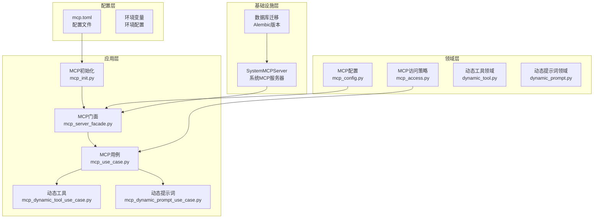
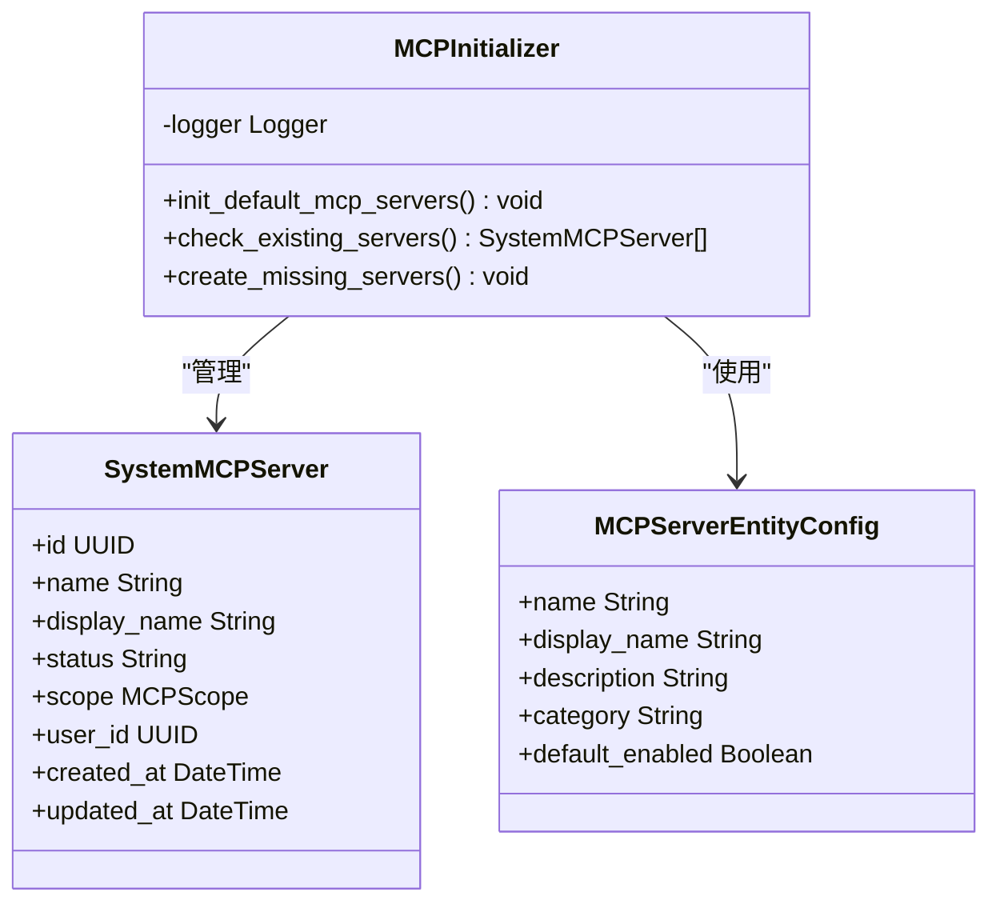
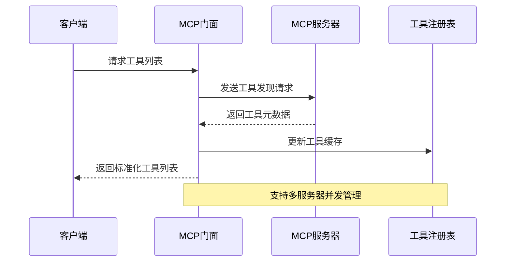
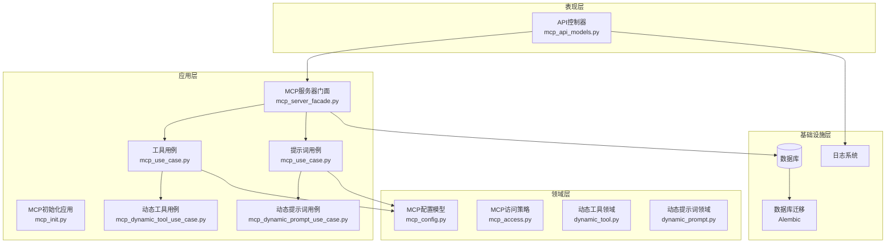
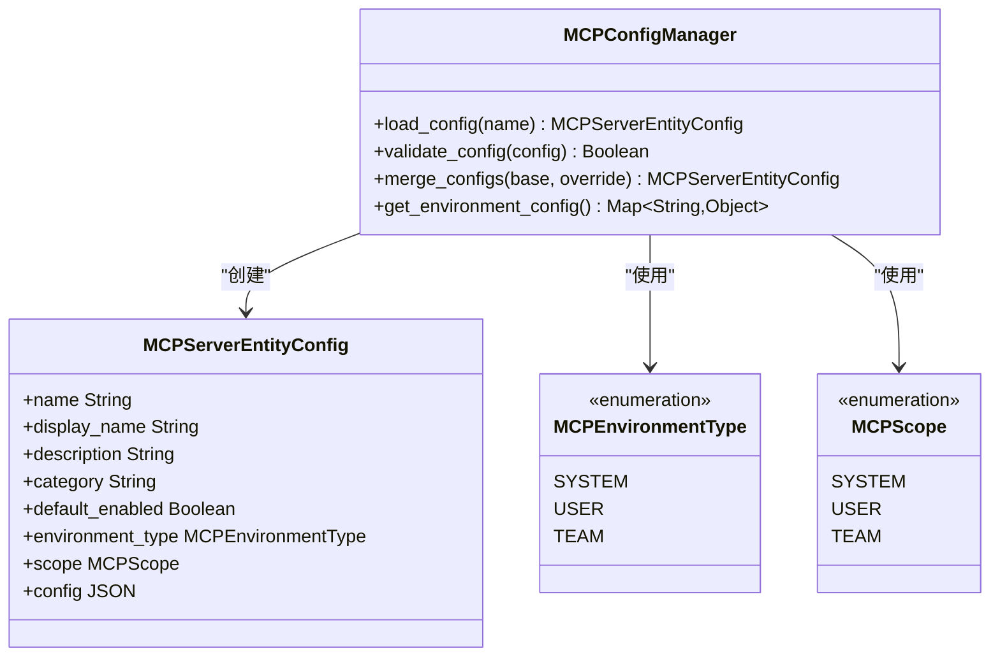
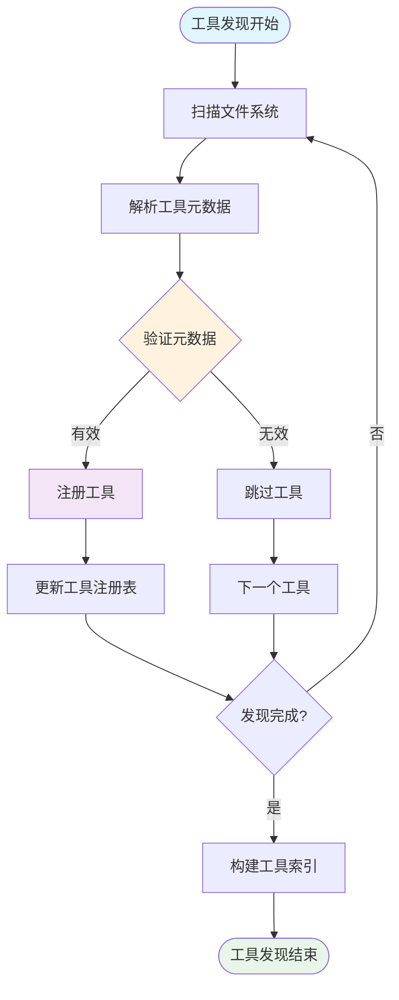
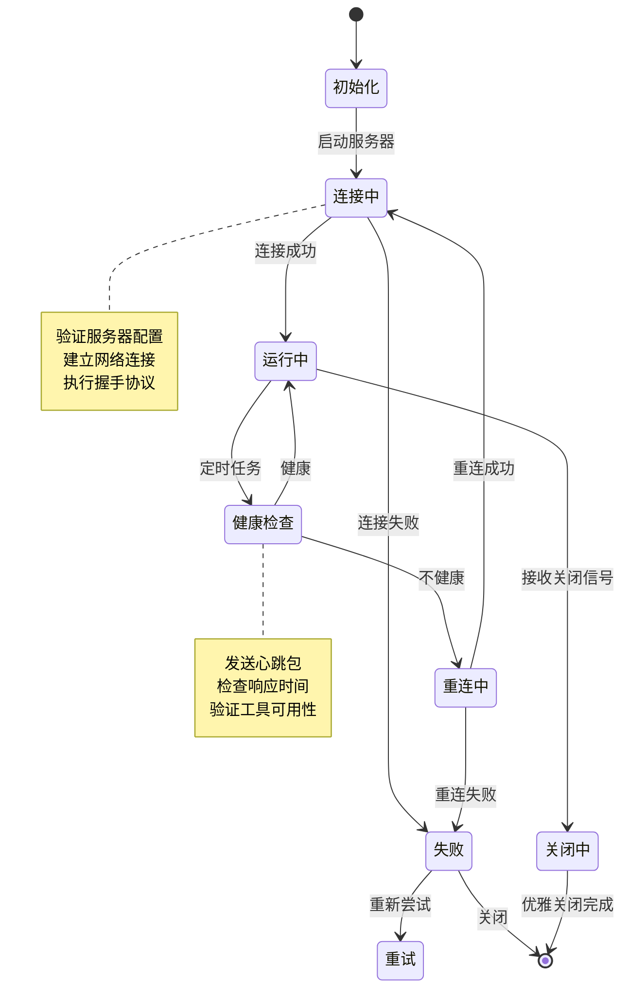
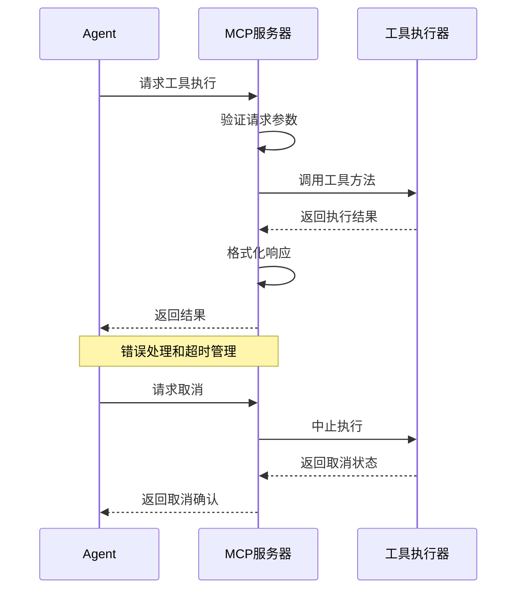
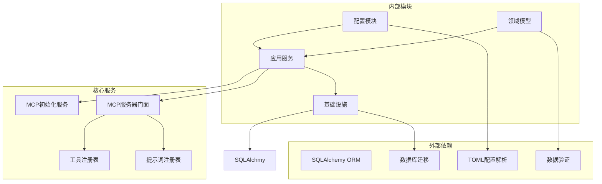

# MCP协议实现

<cite>
**本文档引用的文件**
- [mcp_init.py](file://backend/domains/agent/application/mcp_init.py)
- [MCP_AUTO_INIT.md](file://backend/docs/mcp/MCP_AUTO_INIT.md)
- [mcp.toml](file://backend/config/mcp.toml)
- [mcp_config.py](file://backend/domains/agent/domain/config/mcp_config.py)
- [mcp_server_facade.py](file://backend/domains/agent/application/mcp_server_facade.py)
- [mcp_use_case.py](file://backend/domains/agent/application/mcp_use_case.py)
- [mcp_api_models.py](file://backend/domains/agent/application/mcp_api_models.py)
- [mcp_dynamic_tool_use_case.py](file://backend/domains/agent/application/mcp_dynamic_tool_use_case.py)
- [mcp_dynamic_prompt_use_case.py](file://backend/domains/agent/application/mcp_dynamic_prompt_use_case.py)
- [dynamic_tool.py](file://backend/domains/agent/domain/mcp/dynamic_tool.py)
- [dynamic_prompt.py](file://backend/domains/agent/domain/mcp/dynamic_prompt.py)
- [mcp_access.py](file://backend/domains/agent/domain/policies/mcp_access.py)
- [20260127_150000_add_mcp_servers.py](file://backend/alembic/versions/20260127_150000_add_mcp_servers.py)
- [20260127_160000_add_mcp_connection_status_and_tools.py](file://backend/alembic/versions/20260127_160000_add_mcp_connection_status_and_tools.py)
- [20260127_170000_add_mcp_description_and_category.py](file://backend/alembic/versions/20260127_170000_add_mcp_description_and_category.py)
- [20260129_add_mcp_dynamic_tools.py](file://backend/alembic/versions/20260129_add_mcp_dynamic_tools.py)
- [20260129_add_mcp_dynamic_prompts.py](file://backend/alembic/versions/20260129_add_mcp_dynamic_prompts.py)
- [20260129_add_mcp_template_fields.py](file://backend/alembic/versions/20260129_add_mcp_template_fields.py)
- [20260129_seed_default_mcp_prompts.py](file://backend/alembic/versions/20260129_seed_default_mcp_prompts.py)
- [main.py](file://backend/bootstrap/main.py)
</cite>

## 目录
1. [引言](#引言)
2. [项目结构](#项目结构)
3. [核心组件](#核心组件)
4. [架构概览](#架构概览)
5. [详细组件分析](#详细组件分析)
6. [依赖关系分析](#依赖关系分析)
7. [性能考虑](#性能考虑)
8. [故障排除指南](#故障排除指南)
9. [结论](#结论)
10. [附录](#附录)

## 引言

MCP（Model Context Protocol）协议实现是AI Agent系统中的关键基础设施，负责管理模型上下文协议服务器、工具发现与注册、动态提示词管理等功能。本项目实现了完整的MCP协议栈，包括服务器生命周期管理、工具生态系统的动态扩展、以及与Agent域的深度集成。

该实现采用分层架构设计，通过应用层、领域层、基础设施层的清晰分离，提供了高度模块化的MCP服务管理能力。系统支持自动初始化默认MCP服务器、动态工具注册、模板化提示词管理等核心功能。

## 项目结构

MCP协议实现主要分布在以下目录结构中：

**图表来源**
- [mcp_init.py:1-18](file://backend/domains/agent/application/mcp_init.py#L1-L18)
- [mcp_server_facade.py](file://backend/domains/agent/application/mcp_server_facade.py)
- [mcp_config.py](file://backend/domains/agent/domain/config/mcp_config.py)

**章节来源**
- [mcp.toml](file://backend/config/mcp.toml)
- [MCP_AUTO_INIT.md:1-46](file://backend/docs/mcp/MCP_AUTO_INIT.md#L1-L46)

## 核心组件

### MCP初始化系统

MCP初始化系统负责在应用启动时自动配置默认的系统级MCP服务器。该系统具有幂等性，确保重复初始化不会产生冲突。

**图表来源**
- [mcp_init.py:1-18](file://backend/domains/agent/application/mcp_init.py#L1-L18)
- [mcp_config.py](file://backend/domains/agent/domain/config/mcp_config.py)

### MCP服务器门面

MCP服务器门面提供统一的接口来管理多个MCP服务器实例，封装了复杂的服务器生命周期管理和状态同步逻辑。

**图表来源**
- [mcp_server_facade.py](file://backend/domains/agent/application/mcp_server_facade.py)
- [mcp_use_case.py](file://backend/domains/agent/application/mcp_use_case.py)

**章节来源**
- [mcp_init.py:1-18](file://backend/domains/agent/application/mcp_init.py#L1-L18)
- [MCP_AUTO_INIT.md:19-32](file://backend/docs/mcp/MCP_AUTO_INIT.md#L19-L32)

## 架构概览

MCP协议实现采用分层架构，每层都有明确的职责分工：

**图表来源**
- [mcp_api_models.py](file://backend/domains/agent/application/mcp_api_models.py)
- [mcp_server_facade.py](file://backend/domains/agent/application/mcp_server_facade.py)
- [mcp_use_case.py](file://backend/domains/agent/application/mcp_use_case.py)

## 详细组件分析

### MCP配置管理系统

MCP配置管理系统提供了灵活的配置管理机制，支持静态配置和动态配置的组合使用。

**图表来源**
- [mcp_config.py](file://backend/domains/agent/domain/config/mcp_config.py)

### 动态工具管理系统

动态工具管理系统支持运行时工具的发现、注册和管理，提供了强大的工具生态系统扩展能力。

**图表来源**
- [mcp_dynamic_tool_use_case.py](file://backend/domains/agent/application/mcp_dynamic_tool_use_case.py)
- [dynamic_tool.py](file://backend/domains/agent/domain/mcp/dynamic_tool.py)

### MCP服务器生命周期管理

MCP服务器生命周期管理涵盖了从启动到关闭的完整过程，包括健康检查、状态监控和优雅关闭。

**图表来源**
- [mcp_server_facade.py](file://backend/domains/agent/application/mcp_server_facade.py)
- [mcp_use_case.py](file://backend/domains/agent/application/mcp_use_case.py)

**章节来源**
- [mcp_config.py](file://backend/domains/agent/domain/config/mcp_config.py)
- [mcp_access.py](file://backend/domains/agent/domain/policies/mcp_access.py)

### MCP协议消息传递机制

MCP协议的消息传递机制基于请求/响应模式，支持异步处理和错误传播。

**图表来源**
- [mcp_use_case.py](file://backend/domains/agent/application/mcp_use_case.py)
- [mcp_api_models.py](file://backend/domains/agent/application/mcp_api_models.py)

## 依赖关系分析

MCP协议实现的依赖关系呈现清晰的层次化结构：

**图表来源**
- [mcp_init.py:1-18](file://backend/domains/agent/application/mcp_init.py#L1-L18)
- [mcp_server_facade.py](file://backend/domains/agent/application/mcp_server_facade.py)

**章节来源**
- [20260127_150000_add_mcp_servers.py:24-30](file://backend/alembic/versions/20260127_150000_add_mcp_servers.py#L24-L30)
- [20260127_160000_add_mcp_connection_status_and_tools.py](file://backend/alembic/versions/20260127_160000_add_mcp_connection_status_and_tools.py)

## 性能考虑

MCP协议实现采用了多项性能优化策略：

### 缓存策略
- 工具元数据缓存：减少重复的工具发现请求
- 服务器状态缓存：避免频繁的状态查询
- 配置信息缓存：加速配置加载过程

### 并发控制
- 异步工具执行：支持并发工具调用
- 连接池管理：优化服务器连接复用
- 限流机制：防止过度的请求负载

### 内存管理
- 懒加载策略：按需加载工具和配置
- 对象池：重用频繁创建的对象
- 垃圾回收优化：及时释放不再使用的资源

## 故障排除指南

### 常见问题诊断

**服务器连接失败**
1. 检查MCP服务器配置是否正确
2. 验证网络连接和防火墙设置
3. 查看服务器日志获取详细错误信息

**工具发现异常**
1. 确认工具元数据格式符合规范
2. 检查工具文件的可执行权限
3. 验证工具依赖项是否完整安装

**性能问题**
1. 分析服务器响应时间指标
2. 检查并发连接数限制
3. 监控内存使用情况

### 调试技巧

**日志分析**
- 启用详细的调试日志级别
- 关注关键操作的时间戳
- 分析错误堆栈信息

**监控指标**
- 服务器可用性百分比
- 工具执行成功率
- 平均响应延迟

**配置验证**
- 使用配置验证工具检查语法
- 测试配置文件的完整性
- 验证环境变量的正确性

**章节来源**
- [MCP_AUTO_INIT.md:41-46](file://backend/docs/mcp/MCP_AUTO_INIT.md#L41-L46)

## 结论

MCP协议实现提供了完整的模型上下文协议服务管理解决方案。通过模块化的设计和分层架构，系统具备了良好的可扩展性和维护性。自动初始化机制确保了系统的即开即用特性，而动态工具管理则为工具生态系统的演进提供了强大支持。

该实现的关键优势包括：
- 完整的生命周期管理
- 灵活的配置系统
- 强大的工具生态系统
- 优秀的性能表现
- 全面的错误处理机制

未来的发展方向包括增强协议兼容性、优化性能表现、扩展工具生态系统的管理能力。

## 附录

### 最佳实践指南

**配置管理**
- 使用环境变量管理敏感配置
- 实施配置版本控制
- 建立配置变更审批流程

**工具开发**
- 遵循工具元数据规范
- 实现完整的错误处理
- 提供详细的文档说明

**部署建议**
- 实施蓝绿部署策略
- 建立健康检查机制
- 配置适当的监控告警

**安全考虑**
- 实施访问控制策略
- 加强身份认证机制
- 定期进行安全审计