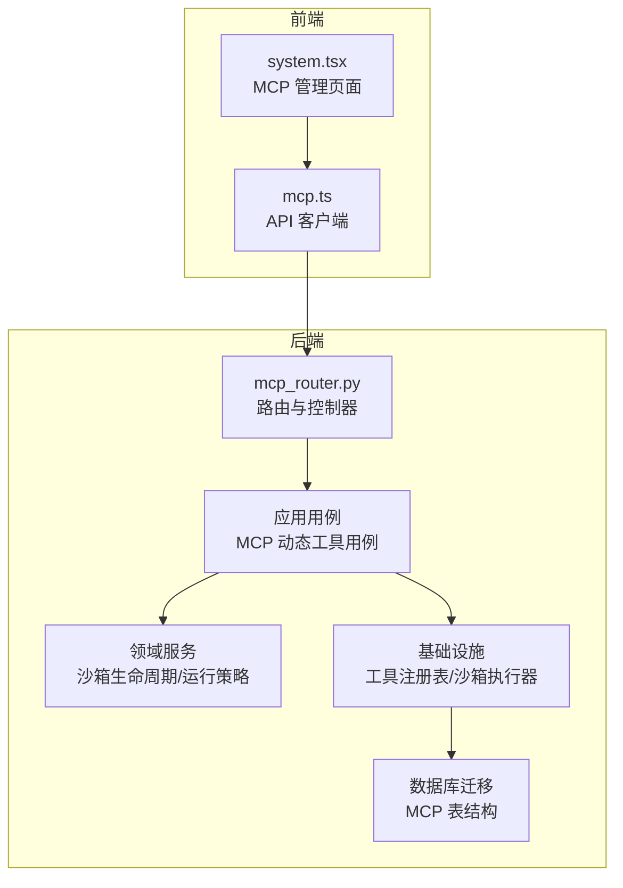
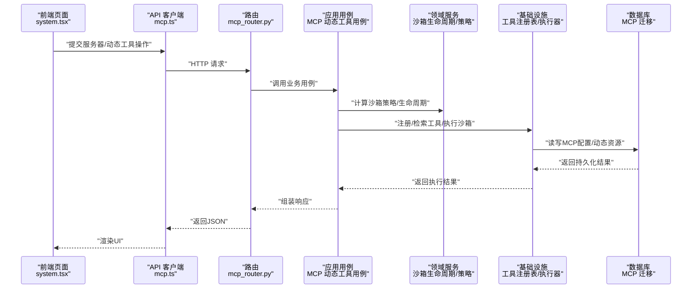
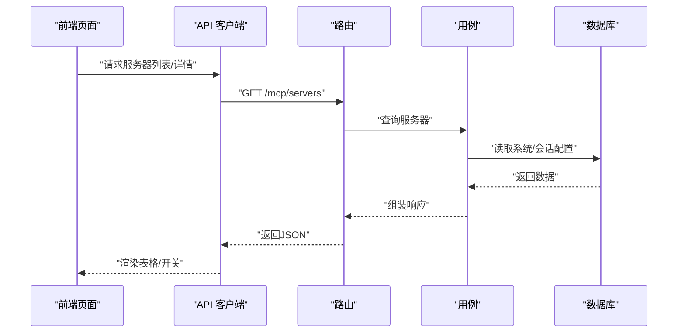
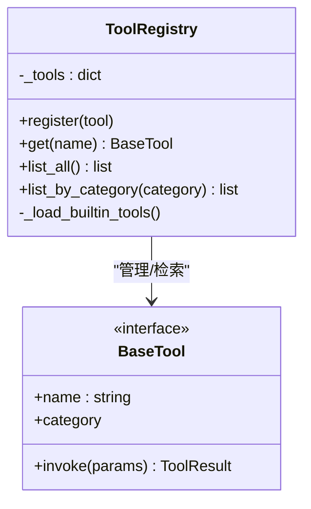
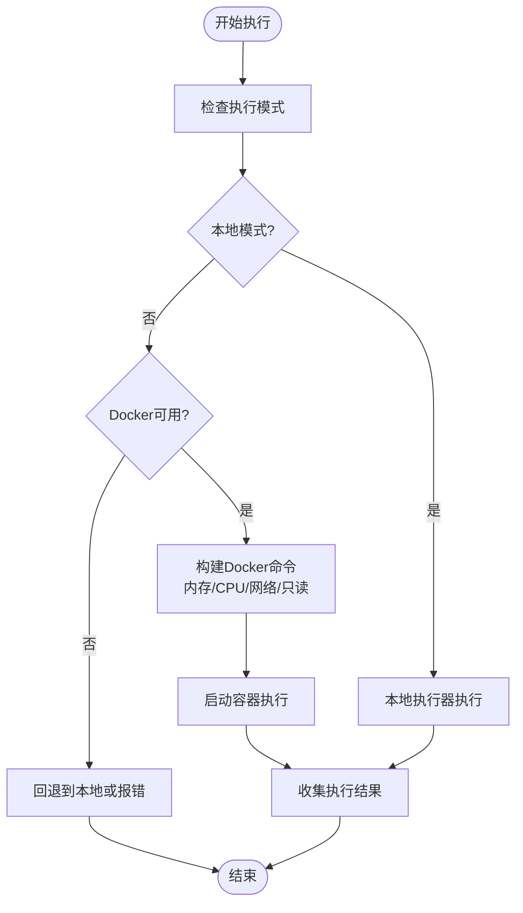
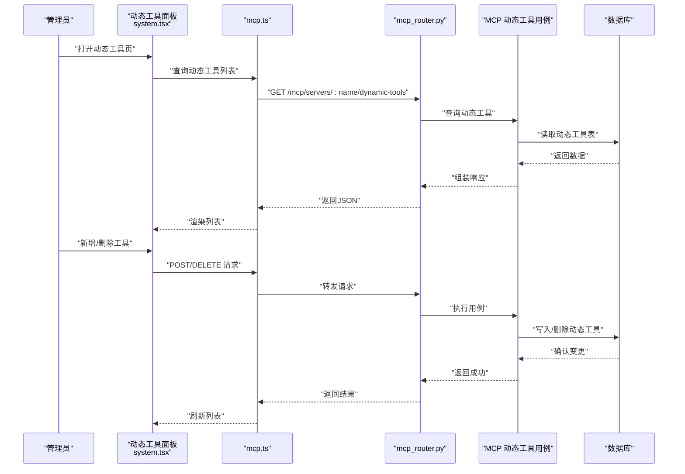
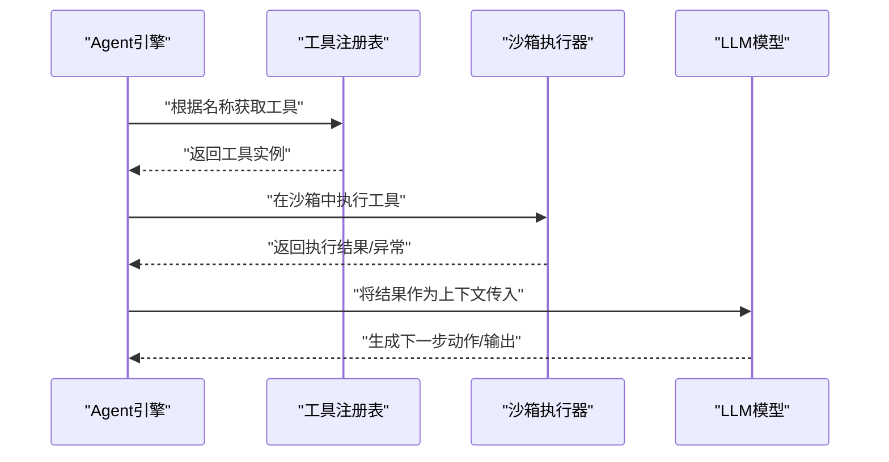
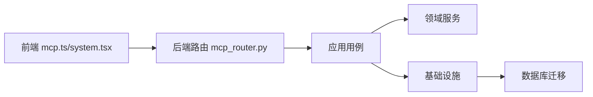
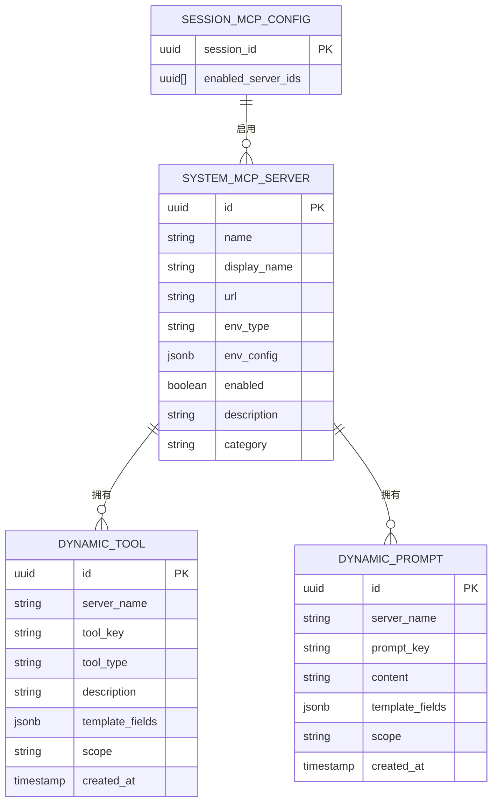

# MCP工具系统

<cite>
**本文引用的文件**
- [mcp_router.py](file://backend/domains/agent/presentation/mcp_router.py)
- [mcp.ts](file://frontend/src/api/mcp.ts)
- [system.tsx](file://frontend/src/pages/mcp/system.tsx)
- [test_mcp_api.py](file://backend/tests/integration/api/test_mcp_api.py)
- [registry.py](file://backend/domains/agent/infrastructure/tools/registry.py)
- [test_tool_registry.py](file://backend/tests/unit/core/test_tool_registry.py)
- [sandbox_lifecycle.py](file://backend/domains/agent/domain/services/sandbox_lifecycle.py)
- [sandbox_runtime_policy.py](file://backend/domains/agent/domain/sandbox_runtime_policy.py)
- [test_sandbox_executor.py](file://backend/tests/unit/test_sandbox_executor.py)
- [test_sandbox_runtime_policy.py](file://backend/tests/unit/agent/domain/test_sandbox_runtime_policy.py)
- [Dockerfile](file://backend/docker/sandbox/Dockerfile)
- [execution-config-architecture-refactor.md](file://backend/docs/archive/execution-config-architecture-refactor.md)
- [20260127_150000_add_mcp_servers.py](file://backend/alembic/versions/20260127_150000_add_mcp_servers.py)
- [20260127_160000_add_mcp_connection_status_and_tools.py](file://backend/alembic/versions/20260127_160000_add_mcp_connection_status_and_tools.py)
- [20260127_170000_add_mcp_description_and_category.py](file://backend/alembic/versions/20260127_170000_add_mcp_description_and_category.py)
- [20260129_add_mcp_dynamic_tools.py](file://backend/alembic/versions/20260129_add_mcp_dynamic_tools.py)
- [20260129_add_mcp_dynamic_prompts.py](file://backend/alembic/versions/20260129_add_mcp_dynamic_prompts.py)
- [20260129_add_mcp_template_fields.py](file://backend/alembic/versions/20260129_add_mcp_template_fields.py)
- [20260202_agents_tools_jsonb_to_array.py](file://backend/alembic/versions/20260202_agents_tools_jsonb_to_array.py)
- [20260129_seed_default_mcp_prompts.py](file://backend/alembic/versions/20260129_seed_default_mcp_prompts.py)
- [mcp.toml](file://backend/config/mcp.toml)
- [tools.toml](file://backend/config/tools.toml)
- [mcp_dynamic_tool_use_case.py](file://backend/domains/agent/application/mcp_dynamic_tool_use_case.py)
</cite>

## 目录
1. [引言](#引言)
2. [项目结构](#项目结构)
3. [核心组件](#核心组件)
4. [架构总览](#架构总览)
5. [详细组件分析](#详细组件分析)
6. [依赖关系分析](#依赖关系分析)
7. [性能考量](#性能考量)
8. [故障排查指南](#故障排查指南)
9. [结论](#结论)
10. [附录](#附录)

## 引言
本文件为AI Agent的MCP（Model Context Protocol）工具系统提供系统化技术文档，覆盖工具发现、注册与调用流程，沙箱执行环境（Docker容器管理、资源限制与安全策略），工具执行的安全机制（权限控制、资源隔离与访问审计），动态工具与提示词的管理机制（动态加载与卸载），工具与LLM模型的集成方式（参数传递、结果处理与错误恢复），以及面向工具开发者的完整指南（接口定义、实现规范与测试方法）。同时包含监控与调试能力、扩展性与插件机制说明。

## 项目结构
MCP工具系统由后端领域层、应用层、基础设施层与前端交互层协同构成，并通过数据库迁移脚本沉淀系统配置与能力边界。整体采用分层架构：Presentation层负责HTTP路由与API；Application层承载业务用例；Domain层封装领域服务与策略；Infrastructure层提供工具注册表、沙箱执行器与持久化能力；Frontend层提供MCP服务器与动态工具管理界面。

图表来源
- [mcp_router.py:88-130](file://backend/domains/agent/presentation/mcp_router.py#L88-L130)
- [mcp.ts:57-149](file://frontend/src/api/mcp.ts#L57-L149)
- [system.tsx:921-1182](file://frontend/src/pages/mcp/system.tsx#L921-L1182)
- [sandbox_lifecycle.py](file://backend/domains/agent/domain/services/sandbox_lifecycle.py)
- [sandbox_runtime_policy.py](file://backend/domains/agent/domain/sandbox_runtime_policy.py)
- [registry.py:17-44](file://backend/domains/agent/infrastructure/tools/registry.py#L17-L44)

章节来源
- [mcp_router.py:88-130](file://backend/domains/agent/presentation/mcp_router.py#L88-L130)
- [mcp.ts:57-149](file://frontend/src/api/mcp.ts#L57-L149)
- [system.tsx:921-1182](file://frontend/src/pages/mcp/system.tsx#L921-L1182)

## 核心组件
- MCP服务器管理与会话配置：提供服务器增删改查、启停、连通性测试、会话级启用配置等能力。
- 工具注册与检索：内置工具自动加载，支持自定义工具注册与分类查询。
- 沙箱执行环境：支持本地与Docker两种执行模式，具备资源限制、网络隔离与只读根文件系统等安全策略。
- 动态工具与提示词：支持基于作用域的动态工具与提示词管理，管理员可增删改查。
- 前后端协作：前端通过API客户端调用后端路由，完成MCP服务器与动态资源的全生命周期管理。

章节来源
- [mcp_router.py:88-130](file://backend/domains/agent/presentation/mcp_router.py#L88-L130)
- [registry.py:17-44](file://backend/domains/agent/infrastructure/tools/registry.py#L17-L44)
- [sandbox_lifecycle.py](file://backend/domains/agent/domain/services/sandbox_lifecycle.py)
- [sandbox_runtime_policy.py](file://backend/domains/agent/domain/sandbox_runtime_policy.py)
- [mcp.ts:57-149](file://frontend/src/api/mcp.ts#L57-L149)
- [system.tsx:921-1182](file://frontend/src/pages/mcp/system.tsx#L921-L1182)

## 架构总览
下图展示MCP工具系统的关键交互路径：前端发起请求，后端路由接收并委派给应用用例，应用用例结合领域服务与基础设施完成工具注册、沙箱执行与数据库持久化，最终返回响应。

图表来源
- [mcp_router.py:88-130](file://backend/domains/agent/presentation/mcp_router.py#L88-L130)
- [mcp.ts:57-149](file://frontend/src/api/mcp.ts#L57-L149)
- [system.tsx:921-1182](file://frontend/src/pages/mcp/system.tsx#L921-L1182)
- [sandbox_lifecycle.py](file://backend/domains/agent/domain/services/sandbox_lifecycle.py)
- [sandbox_runtime_policy.py](file://backend/domains/agent/domain/sandbox_runtime_policy.py)
- [registry.py:17-44](file://backend/domains/agent/infrastructure/tools/registry.py#L17-L44)
- [20260127_150000_add_mcp_servers.py](file://backend/alembic/versions/20260127_150000_add_mcp_servers.py)

## 详细组件分析

### 组件A：MCP服务器管理与会话配置
- 路由能力：提供服务器的创建、更新、删除、启停、连通性测试、会话级启用配置等REST接口。
- 权限与鉴权：路由层对操作进行鉴权约束，确保只有授权用户可变更服务器状态。
- 数据一致性：通过用例层协调数据库与外部MCP服务器的状态同步。

图表来源
- [mcp_router.py:88-130](file://backend/domains/agent/presentation/mcp_router.py#L88-L130)
- [mcp.ts:57-149](file://frontend/src/api/mcp.ts#L57-L149)

章节来源
- [mcp_router.py:88-130](file://backend/domains/agent/presentation/mcp_router.py#L88-L130)
- [mcp.ts:57-149](file://frontend/src/api/mcp.ts#L57-L149)

### 组件B：工具注册与检索
- 注册表职责：集中管理工具实例，内置工具自动加载，支持自定义工具注册。
- 查询能力：支持按名称检索、列出全部、按分类过滤。
- 单元测试覆盖：注册、获取、列表与分类查询均有单元测试保障。

图表来源
- [registry.py:17-44](file://backend/domains/agent/infrastructure/tools/registry.py#L17-L44)

章节来源
- [registry.py:17-44](file://backend/domains/agent/infrastructure/tools/registry.py#L17-L44)
- [test_tool_registry.py:50-99](file://backend/tests/unit/core/test_tool_registry.py#L50-L99)

### 组件C：沙箱执行环境与安全策略
- 执行器类型：支持本地执行与Docker执行，Docker执行器具备资源限制、网络隔离与只读根文件系统等安全策略。
- 生命周期与策略：根据执行配置决定是否预创建持久沙箱、是否启用Docker模式等。
- 容器镜像与构建：提供沙箱专用Docker镜像构建脚本与说明文档。

图表来源
- [test_sandbox_executor.py:152-194](file://backend/tests/unit/test_sandbox_executor.py#L152-L194)
- [test_sandbox_runtime_policy.py:1-62](file://backend/tests/unit/agent/domain/test_sandbox_runtime_policy.py#L1-L62)
- [Dockerfile](file://backend/docker/sandbox/Dockerfile)

章节来源
- [test_sandbox_executor.py:152-194](file://backend/tests/unit/test_sandbox_executor.py#L152-L194)
- [test_sandbox_runtime_policy.py:1-62](file://backend/tests/unit/agent/domain/test_sandbox_runtime_policy.py#L1-L62)
- [Dockerfile](file://backend/docker/sandbox/Dockerfile)

### 组件D：动态工具与提示词管理
- 管理界面：管理员可在前端页面查看、新增、编辑、删除动态工具与提示词。
- API能力：提供动态工具与提示词的列表、新增、删除等接口。
- 数据模型：通过数据库迁移脚本建立动态工具/提示词表，支持模板字段与默认种子数据。

图表来源
- [system.tsx:921-1182](file://frontend/src/pages/mcp/system.tsx#L921-L1182)
- [mcp.ts:132-149](file://frontend/src/api/mcp.ts#L132-L149)
- [mcp_router.py:88-130](file://backend/domains/agent/presentation/mcp_router.py#L88-L130)
- [mcp_dynamic_tool_use_case.py](file://backend/domains/agent/application/mcp_dynamic_tool_use_case.py)

章节来源
- [system.tsx:921-1182](file://frontend/src/pages/mcp/system.tsx#L921-L1182)
- [mcp.ts:132-149](file://frontend/src/api/mcp.ts#L132-L149)
- [20260129_add_mcp_dynamic_tools.py](file://backend/alembic/versions/20260129_add_mcp_dynamic_tools.py)
- [20260129_add_mcp_dynamic_prompts.py](file://backend/alembic/versions/20260129_add_mcp_dynamic_prompts.py)
- [20260129_seed_default_mcp_prompts.py](file://backend/alembic/versions/20260129_seed_default_mcp_prompts.py)

### 组件E：工具与LLM模型的集成
- 参数传递：工具调用时将会话上下文与参数传递至工具注册表，再交由沙箱执行器执行。
- 结果处理：统一的工具结果类型用于封装执行结果与错误信息。
- 错误恢复：通过沙箱生命周期与策略控制执行失败时的清理与回滚。

图表来源
- [registry.py:17-44](file://backend/domains/agent/infrastructure/tools/registry.py#L17-L44)
- [sandbox_lifecycle.py](file://backend/domains/agent/domain/services/sandbox_lifecycle.py)

章节来源
- [registry.py:17-44](file://backend/domains/agent/infrastructure/tools/registry.py#L17-L44)
- [sandbox_lifecycle.py](file://backend/domains/agent/domain/services/sandbox_lifecycle.py)

## 依赖关系分析
- 前端依赖后端API：前端通过mcp.ts调用后端路由，实现MCP服务器与动态资源的管理。
- 应用用例依赖领域服务与基础设施：用例层协调工具注册、沙箱策略与数据库持久化。
- 基础设施依赖数据库迁移：MCP服务器、动态工具/提示词、模板字段等均通过迁移脚本落地。

图表来源
- [mcp.ts:57-149](file://frontend/src/api/mcp.ts#L57-L149)
- [system.tsx:921-1182](file://frontend/src/pages/mcp/system.tsx#L921-L1182)
- [mcp_router.py:88-130](file://backend/domains/agent/presentation/mcp_router.py#L88-L130)
- [20260127_150000_add_mcp_servers.py](file://backend/alembic/versions/20260127_150000_add_mcp_servers.py)
- [20260129_add_mcp_dynamic_tools.py](file://backend/alembic/versions/20260129_add_mcp_dynamic_tools.py)

章节来源
- [mcp.ts:57-149](file://frontend/src/api/mcp.ts#L57-L149)
- [system.tsx:921-1182](file://frontend/src/pages/mcp/system.tsx#L921-L1182)
- [mcp_router.py:88-130](file://backend/domains/agent/presentation/mcp_router.py#L88-L130)

## 性能考量
- 沙箱预创建：在满足条件时预创建持久沙箱以减少冷启动开销。
- 资源限制：通过Docker资源限制降低单次执行对宿主系统的影响。
- 并发与隔离：工具执行在独立沙箱内进行，避免相互干扰。
- 配置扩展性：执行配置加载与工具定义加载分离，便于未来接入远程配置中心与数据库存储。

章节来源
- [test_sandbox_runtime_policy.py:1-62](file://backend/tests/unit/agent/domain/test_sandbox_runtime_policy.py#L1-L62)
- [execution-config-architecture-refactor.md:1-31](file://backend/docs/archive/execution-config-architecture-refactor.md#L1-L31)

## 故障排查指南
- 连接测试失败：通过后端“测试连接”接口验证MCP服务器可达性与认证配置。
- 工具不可用：检查工具是否在目标会话中启用，确认工具注册表中存在该工具。
- 沙箱执行异常：查看沙箱执行器构建命令与资源限制设置，确认Docker可用且网络策略符合预期。
- 动态工具缺失：确认数据库中动态工具记录存在，前端权限为管理员角色。

章节来源
- [mcp_router.py:88-130](file://backend/domains/agent/presentation/mcp_router.py#L88-L130)
- [test_mcp_api.py:17-39](file://backend/tests/integration/api/test_mcp_api.py#L17-L39)
- [test_sandbox_executor.py:152-194](file://backend/tests/unit/test_sandbox_executor.py#L152-L194)

## 结论
MCP工具系统通过清晰的分层架构实现了工具发现、注册与调用、沙箱执行与安全策略、动态工具与提示词管理、以及与LLM模型的集成。系统具备良好的扩展性与可维护性，能够支撑多场景下的Agent工具链路。建议持续完善监控与审计能力，并逐步引入远程配置中心与数据库存储以提升灵活性。

## 附录

### A. MCP服务器与动态资源的数据模型
- MCP服务器表：包含服务器标识、显示名、URL、环境类型与配置、启用状态、描述与分类等字段。
- 动态工具/提示词表：支持按作用域管理，包含模板字段与默认种子数据。
- 会话工具映射：将Agent启用的工具集合持久化，支持JSONB到数组的迁移。

图表来源
- [20260127_150000_add_mcp_servers.py](file://backend/alembic/versions/20260127_150000_add_mcp_servers.py)
- [20260127_160000_add_mcp_connection_status_and_tools.py](file://backend/alembic/versions/20260127_160000_add_mcp_connection_status_and_tools.py)
- [20260127_170000_add_mcp_description_and_category.py](file://backend/alembic/versions/20260127_170000_add_mcp_description_and_category.py)
- [20260129_add_mcp_dynamic_tools.py](file://backend/alembic/versions/20260129_add_mcp_dynamic_tools.py)
- [20260129_add_mcp_dynamic_prompts.py](file://backend/alembic/versions/20260129_add_mcp_dynamic_prompts.py)
- [20260202_agents_tools_jsonb_to_array.py](file://backend/alembic/versions/20260202_agents_tools_jsonb_to_array.py)

### B. 配置文件与工具清单
- MCP配置：用于定义系统级MCP服务器与相关行为。
- 工具配置：用于声明工具清单与默认启用状态。

章节来源
- [mcp.toml](file://backend/config/mcp.toml)
- [tools.toml](file://backend/config/tools.toml)

### C. 工具开发指南（最佳实践）
- 接口定义：实现统一的工具基类，提供名称、分类与调用方法。
- 实现规范：在沙箱环境中执行，严格遵守资源限制与网络隔离策略。
- 测试方法：编写单元测试覆盖注册、检索与执行流程，集成测试覆盖端到端调用链路。

章节来源
- [registry.py:17-44](file://backend/domains/agent/infrastructure/tools/registry.py#L17-L44)
- [test_tool_registry.py:50-99](file://backend/tests/unit/core/test_tool_registry.py#L50-L99)
- [test_mcp_api.py:17-39](file://backend/tests/integration/api/test_mcp_api.py#L17-L39)