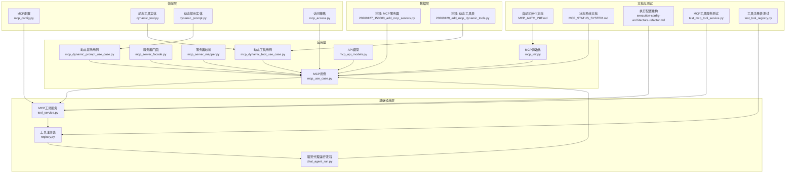
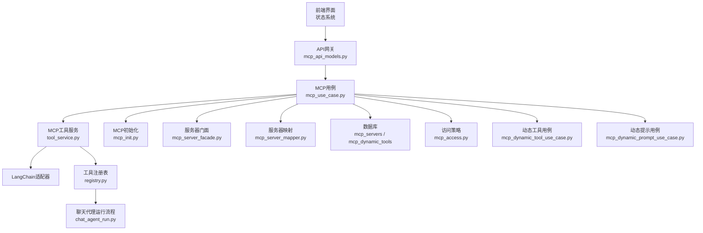
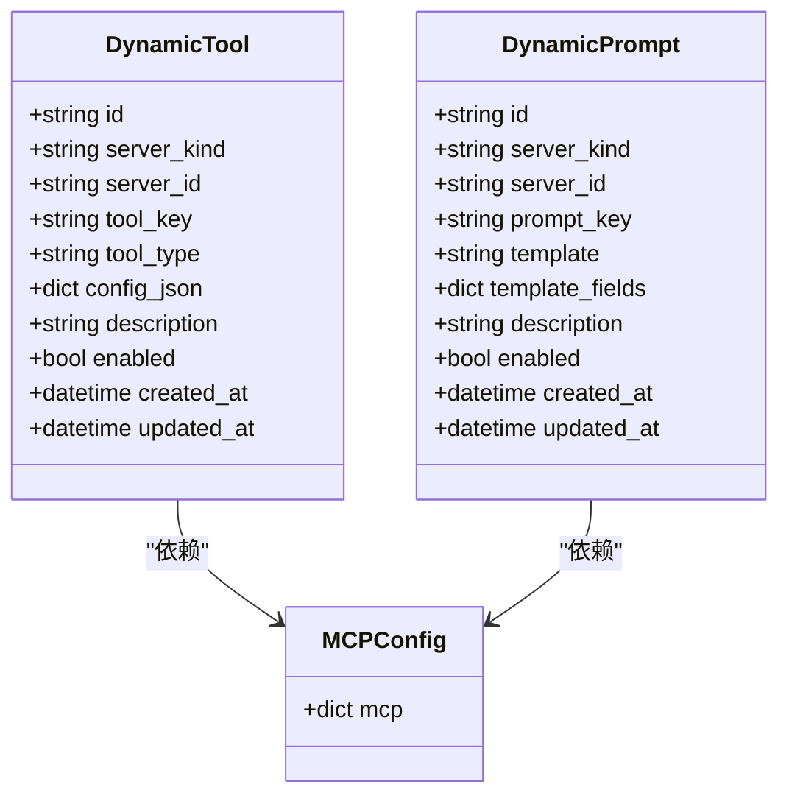
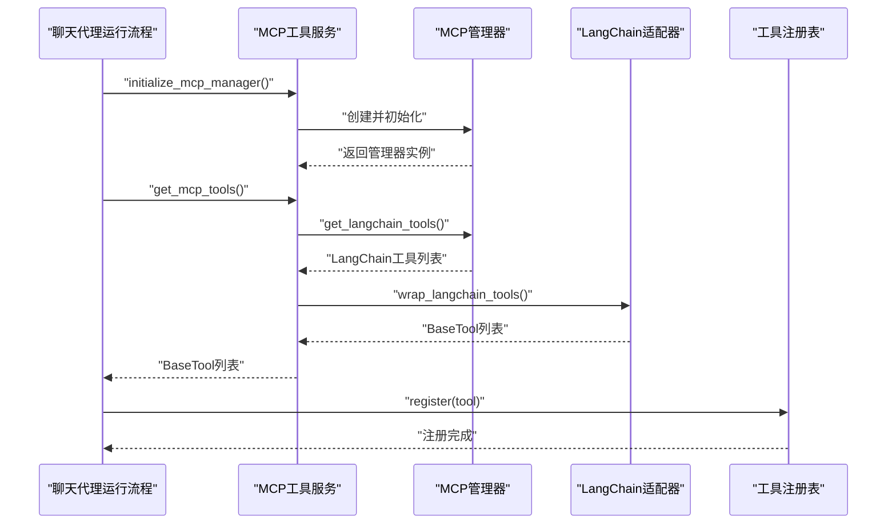
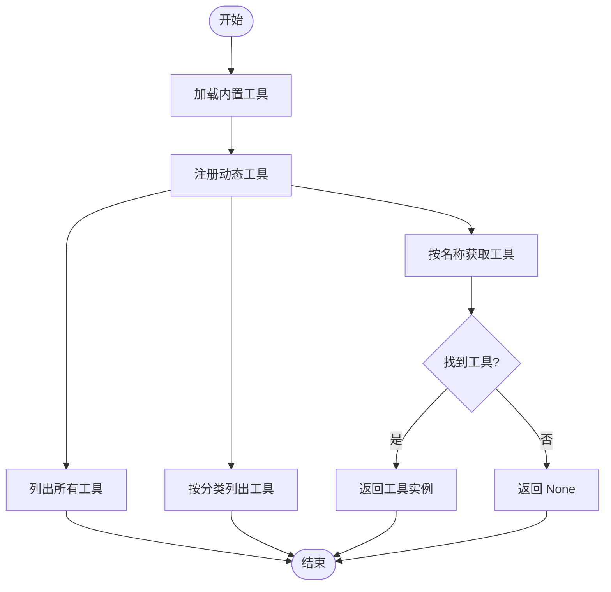
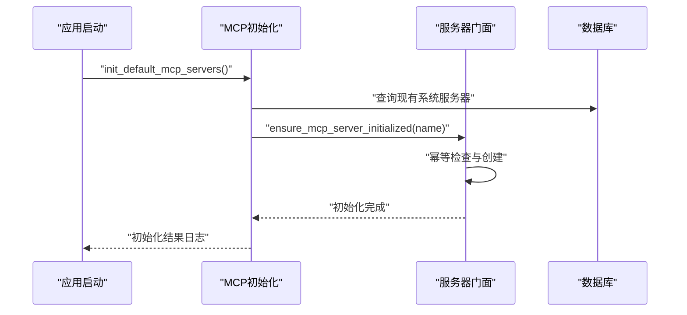
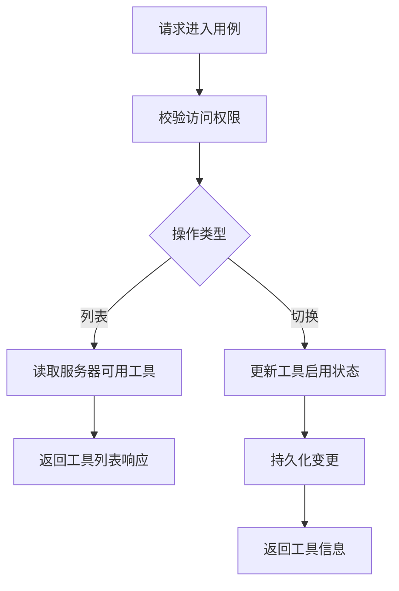
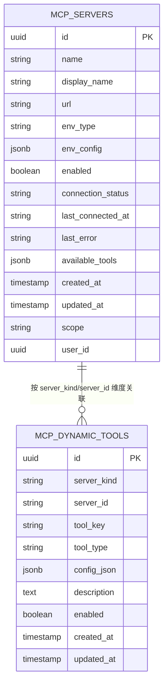
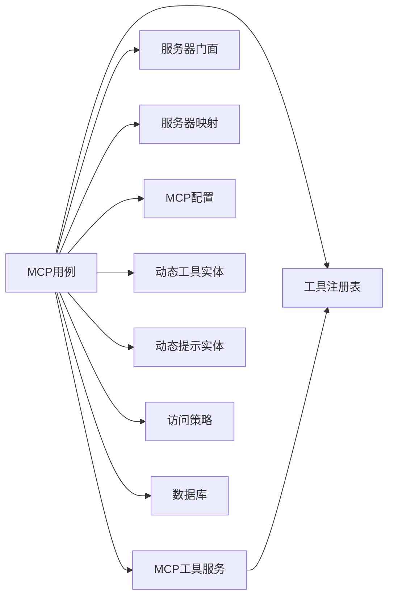

# 动态工具管理

<cite>
**本文引用的文件**
- [mcp_use_case.py](file://backend/domains/agent/application/mcp_use_case.py)
- [mcp_init.py](file://backend/domains/agent/application/mcp_init.py)
- [mcp_server_facade.py](file://backend/domains/agent/application/mcp_server_facade.py)
- [mcp_server_mapper.py](file://backend/domains/agent/application/mcp_server_mapper.py)
- [mcp_dynamic_tool_use_case.py](file://backend/domains/agent/application/mcp_dynamic_tool_use_case.py)
- [mcp_dynamic_prompt_use_case.py](file://backend/domains/agent/application/mcp_dynamic_prompt_use_case.py)
- [mcp_api_models.py](file://backend/domains/agent/application/mcp_api_models.py)
- [chat_agent_run.py](file://backend/domains/agent/application/chat_agent_run.py)
- [tool_service.py](file://backend/domains/agent/infrastructure/tools/mcp/tool_service.py)
- [registry.py](file://backend/domains/agent/infrastructure/tools/registry.py)
- [mcp_config.py](file://backend/domains/agent/domain/config/mcp_config.py)
- [dynamic_tool.py](file://backend/domains/agent/domain/mcp/dynamic_tool.py)
- [dynamic_prompt.py](file://backend/domains/agent/domain/mcp/dynamic_prompt.py)
- [mcp_access.py](file://backend/domains/agent/domain/policies/mcp_access.py)
- [20260129_add_mcp_dynamic_tools.py](file://backend/alembic/versions/20260129_add_mcp_dynamic_tools.py)
- [20260127_150000_add_mcp_servers.py](file://backend/alembic/versions/20260127_150000_add_mcp_servers.py)
- [MCP_AUTO_INIT.md](file://backend/docs/mcp/MCP_AUTO_INIT.md)
- [MCP_STATUS_SYSTEM.md](file://backend/docs/mcp/MCP_STATUS_SYSTEM.md)
- [execution-config-architecture-refactor.md](file://backend/docs/archive/execution-config-architecture-refactor.md)
- [test_mcp_tool_service.py](file://backend/tests/unit/mcp/test_mcp_tool_service.py)
- [test_tool_registry.py](file://backend/tests/unit/core/test_tool_registry.py)
</cite>

## 目录
1. [引言](#引言)
2. [项目结构](#项目结构)
3. [核心组件](#核心组件)
4. [架构总览](#架构总览)
5. [详细组件分析](#详细组件分析)
6. [依赖关系分析](#依赖关系分析)
7. [性能考量](#性能考量)
8. [故障排查指南](#故障排查指南)
9. [结论](#结论)
10. [附录](#附录)

## 引言
本技术文档围绕MCP（Model Context Protocol）动态工具管理系统展开，系统性阐述动态工具的概念与优势、动态加载/卸载/更新机制、工具注册与发现流程、调度与并发控制、状态监控与健康检查、与代理系统的集成方式、开发与部署指南以及性能优化与故障处理策略。目标是帮助开发者与运维人员快速理解并高效使用该系统。

## 项目结构
MCP动态工具管理涉及后端应用层、领域层、基础设施层与数据库迁移脚本，前端通过API与状态系统进行可视化与交互。关键模块分布如下：
- 应用层：MCP管理用例、初始化、服务器门面与映射、动态工具/提示用例、API模型
- 领域层：MCP配置、动态工具/提示实体
- 基础设施层：工具注册表、MCP工具服务（LangChain适配）
- 数据层：Alembic迁移脚本（MCP服务器、动态工具、模板字段等）
- 文档与测试：MCP自动初始化说明、状态系统说明、架构重构文档、单元测试

**图表来源**
- [mcp_use_case.py:1-400](file://backend/domains/agent/application/mcp_use_case.py#L1-L400)
- [mcp_init.py:1-200](file://backend/domains/agent/application/mcp_init.py#L1-L200)
- [mcp_server_facade.py:1-200](file://backend/domains/agent/application/mcp_server_facade.py#L1-L200)
- [mcp_server_mapper.py:1-200](file://backend/domains/agent/application/mcp_server_mapper.py#L1-L200)
- [mcp_dynamic_tool_use_case.py:1-200](file://backend/domains/agent/application/mcp_dynamic_tool_use_case.py#L1-L200)
- [mcp_dynamic_prompt_use_case.py:1-200](file://backend/domains/agent/application/mcp_dynamic_prompt_use_case.py#L1-L200)
- [mcp_api_models.py:1-200](file://backend/domains/agent/application/mcp_api_models.py#L1-L200)
- [tool_service.py:1-250](file://backend/domains/agent/infrastructure/tools/mcp/tool_service.py#L1-L250)
- [registry.py:1-120](file://backend/domains/agent/infrastructure/tools/registry.py#L1-L120)
- [chat_agent_run.py:400-450](file://backend/domains/agent/application/chat_agent_run.py#L400-L450)
- [20260127_150000_add_mcp_servers.py:1-120](file://backend/alembic/versions/20260127_150000_add_mcp_servers.py#L1-L120)
- [20260129_add_mcp_dynamic_tools.py:1-64](file://backend/alembic/versions/20260129_add_mcp_dynamic_tools.py#L1-L64)
- [MCP_AUTO_INIT.md:1-84](file://backend/docs/mcp/MCP_AUTO_INIT.md#L1-L84)
- [MCP_STATUS_SYSTEM.md:125-196](file://backend/docs/mcp/MCP_STATUS_SYSTEM.md#L125-L196)
- [execution-config-architecture-refactor.md:1-359](file://backend/docs/archive/execution-config-architecture-refactor.md#L1-L359)
- [test_mcp_tool_service.py:1-200](file://backend/tests/unit/mcp/test_mcp_tool_service.py#L1-L200)
- [test_tool_registry.py:1-120](file://backend/tests/unit/core/test_tool_registry.py#L1-L120)

**章节来源**
- [mcp_use_case.py:1-400](file://backend/domains/agent/application/mcp_use_case.py#L1-L400)
- [mcp_init.py:1-200](file://backend/domains/agent/application/mcp_init.py#L1-L200)
- [mcp_server_facade.py:1-200](file://backend/domains/agent/application/mcp_server_facade.py#L1-L200)
- [mcp_server_mapper.py:1-200](file://backend/domains/agent/application/mcp_server_mapper.py#L1-L200)
- [mcp_dynamic_tool_use_case.py:1-200](file://backend/domains/agent/application/mcp_dynamic_tool_use_case.py#L1-L200)
- [mcp_dynamic_prompt_use_case.py:1-200](file://backend/domains/agent/application/mcp_dynamic_prompt_use_case.py#L1-L200)
- [mcp_api_models.py:1-200](file://backend/domains/agent/application/mcp_api_models.py#L1-L200)
- [tool_service.py:1-250](file://backend/domains/agent/infrastructure/tools/mcp/tool_service.py#L1-L250)
- [registry.py:1-120](file://backend/domains/agent/infrastructure/tools/registry.py#L1-L120)
- [chat_agent_run.py:400-450](file://backend/domains/agent/application/chat_agent_run.py#L400-L450)
- [20260127_150000_add_mcp_servers.py:1-120](file://backend/alembic/versions/20260127_150000_add_mcp_servers.py#L1-L120)
- [20260129_add_mcp_dynamic_tools.py:1-64](file://backend/alembic/versions/20260129_add_mcp_dynamic_tools.py#L1-L64)
- [MCP_AUTO_INIT.md:1-84](file://backend/docs/mcp/MCP_AUTO_INIT.md#L1-L84)
- [MCP_STATUS_SYSTEM.md:125-196](file://backend/docs/mcp/MCP_STATUS_SYSTEM.md#L125-L196)
- [execution-config-architecture-refactor.md:1-359](file://backend/docs/archive/execution-config-architecture-refactor.md#L1-L359)
- [test_mcp_tool_service.py:1-200](file://backend/tests/unit/mcp/test_mcp_tool_service.py#L1-L200)
- [test_tool_registry.py:1-120](file://backend/tests/unit/core/test_tool_registry.py#L1-L120)

## 核心组件
- MCP用例（应用层）：负责服务器连接测试、工具列表查询与切换、动态工具/提示的管理与持久化、访问控制校验。
- MCP初始化（应用层）：应用启动时自动创建默认系统级MCP服务器，保证基础能力可用。
- 服务器门面与映射（应用层）：统一管理MCP服务器实例与HTTP应用生命周期，提供幂等初始化与状态检查。
- MCP工具服务（基础设施层）：基于LangChain适配器获取工具，封装为系统工具接口，并与执行配置集成。
- 工具注册表（基础设施层）：集中注册与检索工具，支持内置工具与动态工具的统一管理。
- 领域模型（领域层）：MCP配置、动态工具/提示实体与访问策略，定义数据结构与权限边界。
- 数据迁移（数据层）：创建MCP服务器表与动态工具表，建立索引与唯一约束，支撑工具与服务器的持久化管理。
- 文档与测试：自动初始化说明、状态系统说明、执行配置架构重构文档、单元测试覆盖。

**章节来源**
- [mcp_use_case.py:1-400](file://backend/domains/agent/application/mcp_use_case.py#L1-L400)
- [mcp_init.py:1-200](file://backend/domains/agent/application/mcp_init.py#L1-L200)
- [mcp_server_facade.py:1-200](file://backend/domains/agent/application/mcp_server_facade.py#L1-L200)
- [mcp_server_mapper.py:1-200](file://backend/domains/agent/application/mcp_server_mapper.py#L1-L200)
- [tool_service.py:1-250](file://backend/domains/agent/infrastructure/tools/mcp/tool_service.py#L1-L250)
- [registry.py:1-120](file://backend/domains/agent/infrastructure/tools/registry.py#L1-L120)
- [mcp_config.py:1-200](file://backend/domains/agent/domain/config/mcp_config.py#L1-L200)
- [dynamic_tool.py:1-200](file://backend/domains/agent/domain/mcp/dynamic_tool.py#L1-L200)
- [dynamic_prompt.py:1-200](file://backend/domains/agent/domain/mcp/dynamic_prompt.py#L1-L200)
- [mcp_access.py:1-120](file://backend/domains/agent/domain/policies/mcp_access.py#L1-L120)
- [20260127_150000_add_mcp_servers.py:1-120](file://backend/alembic/versions/20260127_150000_add_mcp_servers.py#L1-L120)
- [20260129_add_mcp_dynamic_tools.py:1-64](file://backend/alembic/versions/20260129_add_mcp_dynamic_tools.py#L1-L64)
- [MCP_AUTO_INIT.md:1-84](file://backend/docs/mcp/MCP_AUTO_INIT.md#L1-L84)
- [MCP_STATUS_SYSTEM.md:125-196](file://backend/docs/mcp/MCP_STATUS_SYSTEM.md#L125-L196)
- [execution-config-architecture-refactor.md:1-359](file://backend/docs/archive/execution-config-architecture-refactor.md#L1-L359)
- [test_mcp_tool_service.py:1-200](file://backend/tests/unit/mcp/test_mcp_tool_service.py#L1-L200)
- [test_tool_registry.py:1-120](file://backend/tests/unit/core/test_tool_registry.py#L1-L120)

## 架构总览
下图展示MCP动态工具管理的端到端架构：应用层用例协调服务器与工具；基础设施层完成LangChain适配与注册；领域层定义配置与实体；数据层通过迁移脚本落地；前端通过API与状态系统可视化。

**图表来源**
- [mcp_use_case.py:1-400](file://backend/domains/agent/application/mcp_use_case.py#L1-L400)
- [mcp_api_models.py:1-200](file://backend/domains/agent/application/mcp_api_models.py#L1-L200)
- [tool_service.py:1-250](file://backend/domains/agent/infrastructure/tools/mcp/tool_service.py#L1-L250)
- [registry.py:1-120](file://backend/domains/agent/infrastructure/tools/registry.py#L1-L120)
- [mcp_init.py:1-200](file://backend/domains/agent/application/mcp_init.py#L1-L200)
- [mcp_server_facade.py:1-200](file://backend/domains/agent/application/mcp_server_facade.py#L1-L200)
- [mcp_server_mapper.py:1-200](file://backend/domains/agent/application/mcp_server_mapper.py#L1-L200)
- [chat_agent_run.py:400-450](file://backend/domains/agent/application/chat_agent_run.py#L400-L450)
- [mcp_access.py:1-120](file://backend/domains/agent/domain/policies/mcp_access.py#L1-L120)
- [mcp_dynamic_tool_use_case.py:1-200](file://backend/domains/agent/application/mcp_dynamic_tool_use_case.py#L1-L200)
- [mcp_dynamic_prompt_use_case.py:1-200](file://backend/domains/agent/application/mcp_dynamic_prompt_use_case.py#L1-L200)

## 详细组件分析

### 动态工具与动态提示实体
动态工具与动态提示作为领域实体，承载工具元数据、类型、配置与描述信息，支持按服务器维度进行动态注册与管理。

**图表来源**
- [dynamic_tool.py:1-200](file://backend/domains/agent/domain/mcp/dynamic_tool.py#L1-L200)
- [dynamic_prompt.py:1-200](file://backend/domains/agent/domain/mcp/dynamic_prompt.py#L1-L200)
- [mcp_config.py:1-200](file://backend/domains/agent/domain/config/mcp_config.py#L1-L200)

**章节来源**
- [dynamic_tool.py:1-200](file://backend/domains/agent/domain/mcp/dynamic_tool.py#L1-L200)
- [dynamic_prompt.py:1-200](file://backend/domains/agent/domain/mcp/dynamic_prompt.py#L1-L200)
- [mcp_config.py:1-200](file://backend/domains/agent/domain/config/mcp_config.py#L1-L200)

### MCP工具服务与LangChain适配
MCP工具服务负责初始化MCP管理器、获取LangChain工具并包装为系统工具，同时与执行配置集成，支持动态工具的加载与清理。

**图表来源**
- [tool_service.py:170-230](file://backend/domains/agent/infrastructure/tools/mcp/tool_service.py#L170-L230)
- [registry.py:1-120](file://backend/domains/agent/infrastructure/tools/registry.py#L1-L120)
- [chat_agent_run.py:409-431](file://backend/domains/agent/application/chat_agent_run.py#L409-L431)

**章节来源**
- [tool_service.py:170-230](file://backend/domains/agent/infrastructure/tools/mcp/tool_service.py#L170-L230)
- [registry.py:1-120](file://backend/domains/agent/infrastructure/tools/registry.py#L1-L120)
- [chat_agent_run.py:409-431](file://backend/domains/agent/application/chat_agent_run.py#L409-L431)

### 工具注册与发现流程
工具注册表负责内置工具的加载与动态工具的注册，提供按名称检索与分类过滤能力，确保工具在会话运行期可用。

**图表来源**
- [registry.py:1-120](file://backend/domains/agent/infrastructure/tools/registry.py#L1-L120)
- [test_tool_registry.py:50-99](file://backend/tests/unit/core/test_tool_registry.py#L50-L99)

**章节来源**
- [registry.py:1-120](file://backend/domains/agent/infrastructure/tools/registry.py#L1-L120)
- [test_tool_registry.py:50-99](file://backend/tests/unit/core/test_tool_registry.py#L50-L99)

### MCP服务器初始化与门面模式
MCP初始化在应用启动时自动创建默认系统级服务器；服务器门面提供幂等初始化与状态检查，避免重复创建与提升稳定性。

**图表来源**
- [mcp_init.py:1-200](file://backend/domains/agent/application/mcp_init.py#L1-L200)
- [mcp_server_facade.py:1-200](file://backend/domains/agent/application/mcp_server_facade.py#L1-L200)
- [MCP_AUTO_INIT.md:1-84](file://backend/docs/mcp/MCP_AUTO_INIT.md#L1-L84)

**章节来源**
- [mcp_init.py:1-200](file://backend/domains/agent/application/mcp_init.py#L1-L200)
- [mcp_server_facade.py:1-200](file://backend/domains/agent/application/mcp_server_facade.py#L1-L200)
- [MCP_AUTO_INIT.md:1-84](file://backend/docs/mcp/MCP_AUTO_INIT.md#L1-L84)

### 动态工具与提示的管理用例
动态工具与提示用例负责工具的启用/禁用切换、工具列表查询、模板字段管理与持久化，配合访问策略实现细粒度权限控制。

**图表来源**
- [mcp_use_case.py:300-337](file://backend/domains/agent/application/mcp_use_case.py#L300-L337)
- [mcp_dynamic_tool_use_case.py:1-200](file://backend/domains/agent/application/mcp_dynamic_tool_use_case.py#L1-L200)
- [mcp_dynamic_prompt_use_case.py:1-200](file://backend/domains/agent/application/mcp_dynamic_prompt_use_case.py#L1-L200)
- [mcp_access.py:1-120](file://backend/domains/agent/domain/policies/mcp_access.py#L1-L120)

**章节来源**
- [mcp_use_case.py:300-337](file://backend/domains/agent/application/mcp_use_case.py#L300-L337)
- [mcp_dynamic_tool_use_case.py:1-200](file://backend/domains/agent/application/mcp_dynamic_tool_use_case.py#L1-L200)
- [mcp_dynamic_prompt_use_case.py:1-200](file://backend/domains/agent/application/mcp_dynamic_prompt_use_case.py#L1-L200)
- [mcp_access.py:1-120](file://backend/domains/agent/domain/policies/mcp_access.py#L1-L120)

### 数据模型与迁移
数据库层面通过迁移脚本创建MCP服务器表与动态工具表，设置索引与唯一约束，确保按服务器维度的工具唯一性与高效查询。

**图表来源**
- [20260127_150000_add_mcp_servers.py:1-120](file://backend/alembic/versions/20260127_150000_add_mcp_servers.py#L1-L120)
- [20260129_add_mcp_dynamic_tools.py:24-60](file://backend/alembic/versions/20260129_add_mcp_dynamic_tools.py#L24-L60)

**章节来源**
- [20260127_150000_add_mcp_servers.py:1-120](file://backend/alembic/versions/20260127_150000_add_mcp_servers.py#L1-L120)
- [20260129_add_mcp_dynamic_tools.py:1-64](file://backend/alembic/versions/20260129_add_mcp_dynamic_tools.py#L1-L64)

## 依赖关系分析
- 应用层用例依赖基础设施层的MCP工具服务与工具注册表，同时依赖领域层的配置与实体。
- 服务器门面与映射为用例提供稳定的服务器生命周期管理。
- 数据层通过迁移脚本为应用层提供持久化能力。
- 前端通过API模型与状态系统进行可视化与交互。

**图表来源**
- [mcp_use_case.py:1-400](file://backend/domains/agent/application/mcp_use_case.py#L1-L400)
- [tool_service.py:1-250](file://backend/domains/agent/infrastructure/tools/mcp/tool_service.py#L1-L250)
- [registry.py:1-120](file://backend/domains/agent/infrastructure/tools/registry.py#L1-L120)
- [mcp_server_facade.py:1-200](file://backend/domains/agent/application/mcp_server_facade.py#L1-L200)
- [mcp_server_mapper.py:1-200](file://backend/domains/agent/application/mcp_server_mapper.py#L1-L200)
- [mcp_config.py:1-200](file://backend/domains/agent/domain/config/mcp_config.py#L1-L200)
- [dynamic_tool.py:1-200](file://backend/domains/agent/domain/mcp/dynamic_tool.py#L1-L200)
- [dynamic_prompt.py:1-200](file://backend/domains/agent/domain/mcp/dynamic_prompt.py#L1-L200)
- [mcp_access.py:1-120](file://backend/domains/agent/domain/policies/mcp_access.py#L1-L120)

**章节来源**
- [mcp_use_case.py:1-400](file://backend/domains/agent/application/mcp_use_case.py#L1-L400)
- [tool_service.py:1-250](file://backend/domains/agent/infrastructure/tools/mcp/tool_service.py#L1-L250)
- [registry.py:1-120](file://backend/domains/agent/infrastructure/tools/registry.py#L1-L120)
- [mcp_server_facade.py:1-200](file://backend/domains/agent/application/mcp_server_facade.py#L1-L200)
- [mcp_server_mapper.py:1-200](file://backend/domains/agent/application/mcp_server_mapper.py#L1-L200)
- [mcp_config.py:1-200](file://backend/domains/agent/domain/config/mcp_config.py#L1-L200)
- [dynamic_tool.py:1-200](file://backend/domains/agent/domain/mcp/dynamic_tool.py#L1-L200)
- [dynamic_prompt.py:1-200](file://backend/domains/agent/domain/mcp/dynamic_prompt.py#L1-L200)
- [mcp_access.py:1-120](file://backend/domains/agent/domain/policies/mcp_access.py#L1-L120)

## 性能考量
- 并发与资源分配：LangChain适配器与工具包装过程应避免阻塞主线程，建议在独立线程池或异步任务中执行工具初始化与包装。
- 连接与超时：服务器连接测试与工具拉取应设置合理超时与重试策略，防止长时间阻塞。
- 缓存与索引：数据库对“服务器维度”建立索引与唯一约束，减少查询开销；前端状态系统可缓存工具列表与连接状态。
- 执行配置解耦：参考执行配置架构重构文档，将配置加载、验证与合并解耦，提升可扩展性与可测试性。

[本节为通用性能建议，不直接分析具体文件]

## 故障排查指南
- 服务器连接失败：用例在连接测试失败时记录错误详情并更新连接状态，便于前端展示与定位问题。
- 工具加载异常：聊天代理运行流程在加载MCP工具时捕获异常并记录日志，确保会话继续进行。
- 初始化幂等性：服务器门面确保多次初始化只创建一次，避免重复资源占用。
- 权限校验：访问策略严格限制对系统级与用户级服务器的操作范围，防止越权。

**章节来源**
- [mcp_use_case.py:300-337](file://backend/domains/agent/application/mcp_use_case.py#L300-L337)
- [chat_agent_run.py:435-441](file://backend/domains/agent/application/chat_agent_run.py#L435-L441)
- [mcp_server_facade.py:1-200](file://backend/domains/agent/application/mcp_server_facade.py#L1-L200)
- [mcp_access.py:1-120](file://backend/domains/agent/domain/policies/mcp_access.py#L1-L120)

## 结论
MCP动态工具管理系统通过清晰的应用层用例、稳定的基础设施适配、严谨的领域模型与完善的数据库迁移，实现了工具的动态加载、注册与管理。结合状态系统与访问策略，系统在可用性、安全性与可扩展性方面具备良好基础。建议在生产环境中进一步完善并发控制、重试与缓存策略，并持续通过测试与文档保障质量。

## 附录
- 开发与部署指南
  - 工具接口规范：遵循系统工具基类与LangChain适配器规范，确保工具可被包装为系统工具并注册到注册表。
  - 实现要求：工具需提供元数据（名称、类型、描述）、配置字段与执行入口；动态工具需支持启用/禁用与按服务器维度管理。
  - 测试方法：利用单元测试覆盖工具注册、列表查询、切换启用状态等关键路径。
- 性能优化与故障处理策略
  - 参考执行配置架构重构文档，采用分层加载与组合验证器，提升可扩展性与可测试性。
  - 在前端状态系统中缓存连接状态与工具列表，降低重复请求与渲染压力。

**章节来源**
- [execution-config-architecture-refactor.md:1-359](file://backend/docs/archive/execution-config-architecture-refactor.md#L1-L359)
- [test_mcp_tool_service.py:1-200](file://backend/tests/unit/mcp/test_mcp_tool_service.py#L1-L200)
- [test_tool_registry.py:1-120](file://backend/tests/unit/core/test_tool_registry.py#L1-L120)
- [MCP_STATUS_SYSTEM.md:125-196](file://backend/docs/mcp/MCP_STATUS_SYSTEM.md#L125-L196)