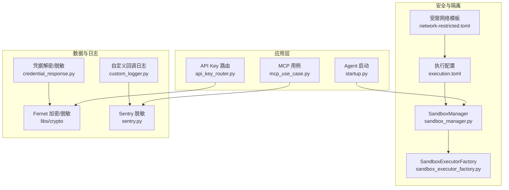
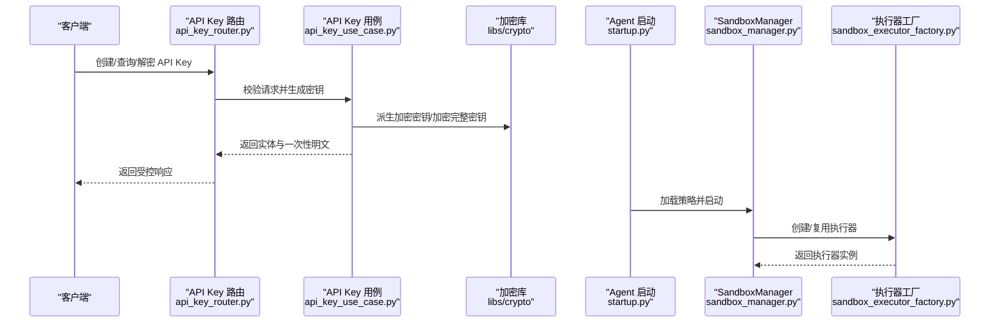
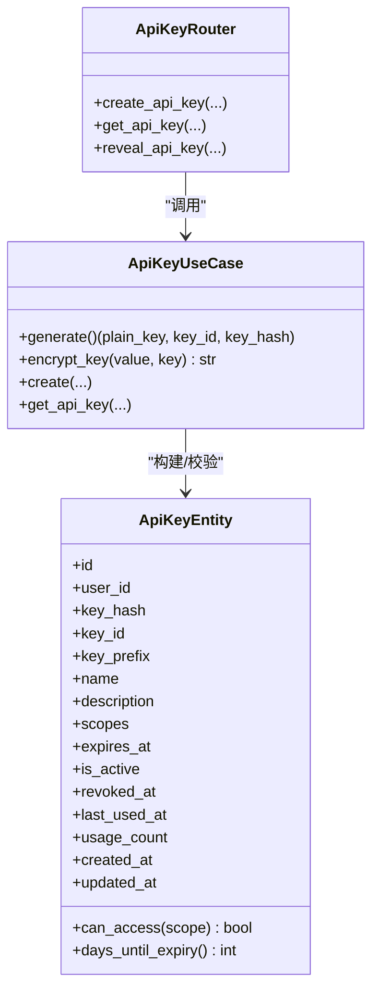
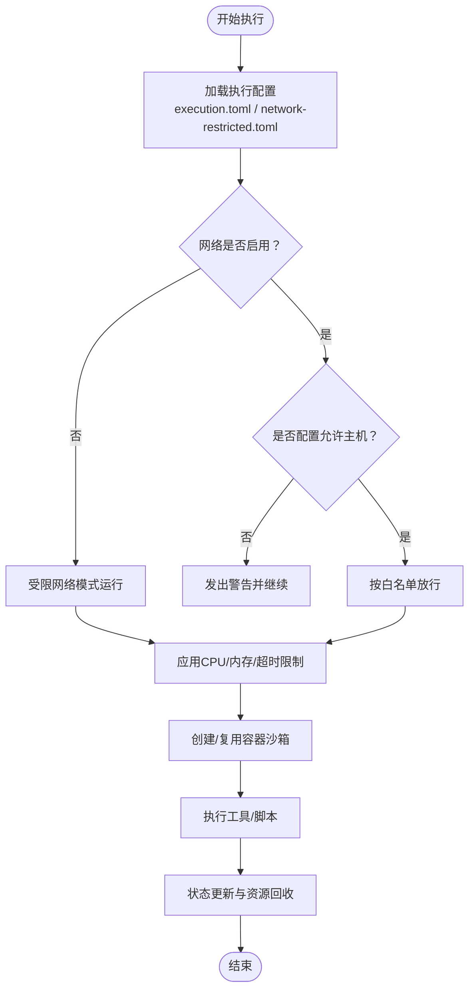
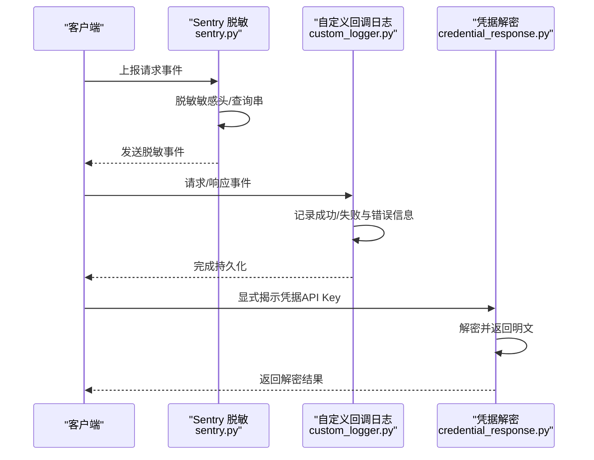
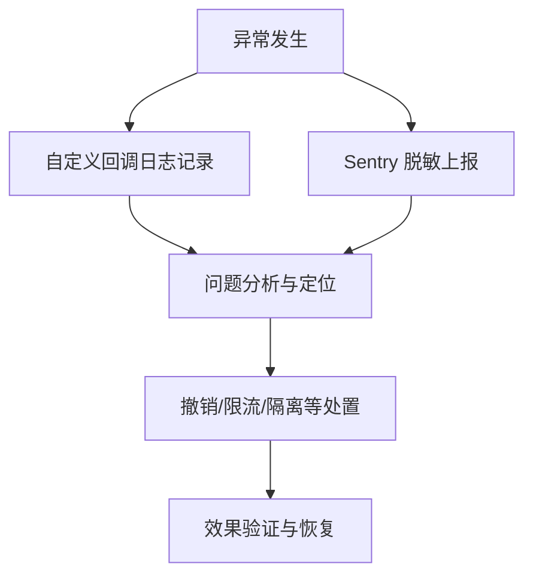
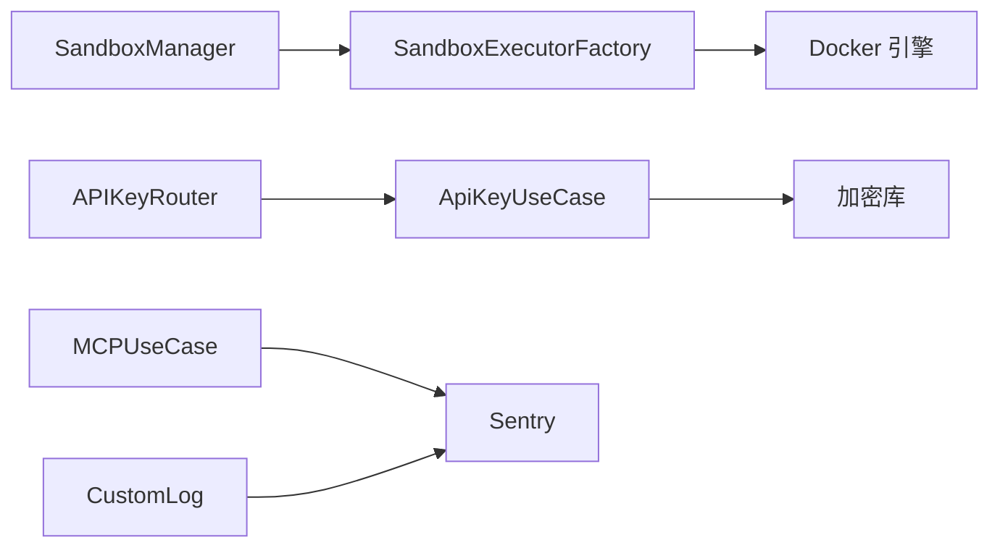

# 安全与隔离机制

<cite>
**本文引用的文件**
- [sandbox_manager.py](file://backend/domains/agent/infrastructure/sandbox/sandbox_manager.py)
- [sandbox_executor_factory.py](file://backend/domains/agent/infrastructure/sandbox/sandbox_executor_factory.py)
- [test_sandbox_manager.py](file://backend/tests/unit/test_sandbox_manager.py)
- [test_network_config.py](file://backend/scripts/test_network_config.py)
- [沙箱资源管理设计文档.md](file://backend/docs/沙箱资源管理设计文档.md)
- [execution.toml](file://backend/config/execution.toml)
- [network-restricted.toml](file://backend/config/environments/network-restricted.toml)
- [startup.py](file://backend/domains/agent/application/startup.py)
- [test_validators.py](file://backend/tests/unit/core/config/test_validators.py)
- [composite.py](file://backend/libs/config/validators/composite.py)
- [test_api_key_service.py](file://backend/tests/unit/core/auth/test_api_key_service.py)
- [api_key_use_case.py](file://backend/domains/identity/application/api_key_use_case.py)
- [api_key_router.py](file://backend/domains/identity/presentation/api_key_router.py)
- [test_fernet_crypto.py](file://backend/tests/unit/libs/test_fernet_crypto.py)
- [sentry.py](file://backend/libs/observability/sentry.py)
- [credential_response.py](file://backend/domains/gateway/presentation/credential_response.py)
- [mcp_use_case.py](file://backend/domains/agent/application/mcp_use_case.py)
- [custom_logger.py](file://backend/domains/gateway/infrastructure/callbacks/custom_logger.py)
- [sonarcloud-scan.sh](file://scripts/sonarcloud-scan.sh)
</cite>

## 目录
1. [引言](#引言)
2. [项目结构](#项目结构)
3. [核心组件](#核心组件)
4. [架构总览](#架构总览)
5. [详细组件分析](#详细组件分析)
6. [依赖关系分析](#依赖关系分析)
7. [性能考量](#性能考量)
8. [故障排查指南](#故障排查指南)
9. [结论](#结论)
10. [附录](#附录)

## 引言
本文件面向MCP工具系统的安全与隔离机制，系统化阐述安全架构设计原则、威胁模型、攻击面与防护策略；详解身份认证与授权（API密钥管理、权限验证、访问控制）、执行环境隔离（进程/网络/资源隔离）与数据安全（敏感信息过滤、数据加密、访问审计），并给出安全监控与事件响应、安全配置与合规建议及最佳实践。

## 项目结构
围绕安全与隔离的关键模块分布于后端域与基础设施层：
- 执行与隔离：SandboxManager、SandboxExecutorFactory、执行配置与环境模板
- 身份与授权：API Key实体、生成与加密、路由与用例
- 数据与日志：凭据解密与脱敏、Sentry事件脱敏、自定义回调日志
- 配置与验证：组合验证器、安全基线模板
- 运维与合规：SonarCloud扫描脚本

图表来源
- [startup.py:62-98](file://backend/domains/agent/application/startup.py#L62-L98)
- [sandbox_manager.py:201-239](file://backend/domains/agent/infrastructure/sandbox/sandbox_manager.py#L201-L239)
- [sandbox_executor_factory.py:17-51](file://backend/domains/agent/infrastructure/sandbox/sandbox_executor_factory.py#L17-L51)
- [execution.toml](file://backend/config/execution.toml)
- [network-restricted.toml:42-61](file://backend/config/environments/network-restricted.toml#L42-L61)
- [api_key_router.py:146-198](file://backend/domains/identity/presentation/api_key_router.py#L146-L198)
- [mcp_use_case.py:300-337](file://backend/domains/agent/application/mcp_use_case.py#L300-L337)
- [sentry.py:50-87](file://backend/libs/observability/sentry.py#L50-L87)
- [credential_response.py:60-79](file://backend/domains/gateway/presentation/credential_response.py#L60-L79)
- [custom_logger.py:90-129](file://backend/domains/gateway/infrastructure/callbacks/custom_logger.py#L90-L129)

章节来源
- [沙箱资源管理设计文档.md:12-51](file://backend/docs/沙箱资源管理设计文档.md#L12-L51)
- [execution.toml](file://backend/config/execution.toml)
- [network-restricted.toml:42-61](file://backend/config/environments/network-restricted.toml#L42-L61)

## 核心组件
- 沙箱管理器（SandboxManager）：负责沙箱生命周期、状态管理、用户/会话关联、资源限制与定期清理，作为隔离执行的中枢。
- 沙箱执行器工厂（SandboxExecutorFactory）：通过协议化接口创建执行器，支持默认实现与注入式Mock，便于测试与扩展。
- 执行配置与环境模板：集中定义沙箱模式、网络开关、安全参数、资源限制与超时等，提供“受限网络”等安全基线模板。
- API Key体系：实体、生成、加密存储、权限校验、路由暴露与解密展示，贯穿身份认证与授权。
- 数据与日志脱敏：凭据解密仅在必要路径执行，Sentry与自定义回调统一脱敏敏感头与查询串。
- 配置验证：组合验证器聚合沙箱与安全验证，确保部署前发现风险项。

章节来源
- [sandbox_manager.py:201-239](file://backend/domains/agent/infrastructure/sandbox/sandbox_manager.py#L201-L239)
- [sandbox_executor_factory.py:17-51](file://backend/domains/agent/infrastructure/sandbox/sandbox_executor_factory.py#L17-L51)
- [execution.toml](file://backend/config/execution.toml)
- [network-restricted.toml:42-61](file://backend/config/environments/network-restricted.toml#L42-L61)
- [api_key_use_case.py:82-120](file://backend/domains/identity/application/api_key_use_case.py#L82-L120)
- [api_key_router.py:146-198](file://backend/domains/identity/presentation/api_key_router.py#L146-L198)
- [sentry.py:50-87](file://backend/libs/observability/sentry.py#L50-L87)
- [credential_response.py:60-79](file://backend/domains/gateway/presentation/credential_response.py#L60-L79)
- [composite.py:17-56](file://backend/libs/config/validators/composite.py#L17-L56)

## 架构总览
下图展示MCP工具系统在安全与隔离方面的整体交互：应用启动加载沙箱策略与配置，API Key路由与用例负责身份与授权，沙箱管理器协调执行器完成隔离执行，日志与监控在必要处进行脱敏处理。

图表来源
- [api_key_router.py:146-198](file://backend/domains/identity/presentation/api_key_router.py#L146-L198)
- [api_key_use_case.py:82-120](file://backend/domains/identity/application/api_key_use_case.py#L82-L120)
- [startup.py:62-98](file://backend/domains/agent/application/startup.py#L62-L98)
- [sandbox_manager.py:201-239](file://backend/domains/agent/infrastructure/sandbox/sandbox_manager.py#L201-L239)
- [sandbox_executor_factory.py:17-51](file://backend/domains/agent/infrastructure/sandbox/sandbox_executor_factory.py#L17-L51)

## 详细组件分析

### 身份认证与授权（API Key）
- 设计要点
  - API Key实体包含作用域、过期时间、撤销状态、使用统计等字段，支持细粒度权限控制。
  - 生成流程：校验请求、生成密钥材料、加密存储、持久化并返回一次性明文。
  - 权限校验：can_access按作用域判断；撤销或过期即失效。
  - 解密展示：仅在“显式揭示”接口中解密，避免在列表/详情中泄露。
- 安全特性
  - 加密存储：基于Fernet派生密钥，保证密文不可逆。
  - 脱敏：路由层对敏感头与查询串进行脱敏。
  - 审计：使用计数与最后使用时间辅助追踪。

图表来源
- [api_key_use_case.py:82-120](file://backend/domains/identity/application/api_key_use_case.py#L82-L120)
- [api_key_router.py:146-198](file://backend/domains/identity/presentation/api_key_router.py#L146-L198)
- [test_api_key_service.py:293-376](file://backend/tests/unit/core/auth/test_api_key_service.py#L293-L376)

章节来源
- [api_key_use_case.py:82-120](file://backend/domains/identity/application/api_key_use_case.py#L82-L120)
- [api_key_router.py:146-198](file://backend/domains/identity/presentation/api_key_router.py#L146-L198)
- [test_api_key_service.py:293-376](file://backend/tests/unit/core/auth/test_api_key_service.py#L293-L376)
- [test_fernet_crypto.py:1-45](file://backend/tests/unit/libs/test_fernet_crypto.py#L1-L45)

### 执行环境安全隔离
- 进程隔离
  - 采用容器化执行器（PersistentDockerExecutor），每个沙箱对应独立容器，实现进程级隔离。
- 网络隔离
  - 支持开启/关闭网络，并可配置允许访问的主机白名单；提供“受限网络”模板强化默认安全。
- 资源隔离
  - 通过CPU/内存限制与超时控制，结合LRU淘汰与定期清理，防止资源滥用。
- 状态管理
  - ACTIVE/IDLE/DISCONNECTED/COMPLETING等状态机，配合标记与清理流程，保障资源回收。

图表来源
- [execution.toml](file://backend/config/execution.toml)
- [network-restricted.toml:42-61](file://backend/config/environments/network-restricted.toml#L42-L61)
- [test_network_config.py:151-205](file://backend/scripts/test_network_config.py#L151-L205)
- [test_validators.py:61-107](file://backend/tests/unit/core/config/test_validators.py#L61-L107)

章节来源
- [sandbox_manager.py:201-239](file://backend/domains/agent/infrastructure/sandbox/sandbox_manager.py#L201-L239)
- [sandbox_executor_factory.py:17-51](file://backend/domains/agent/infrastructure/sandbox/sandbox_executor_factory.py#L17-L51)
- [沙箱资源管理设计文档.md:12-51](file://backend/docs/沙箱资源管理设计文档.md#L12-L51)
- [test_sandbox_manager.py:358-393](file://backend/tests/unit/test_sandbox_manager.py#L358-L393)
- [test_network_config.py:151-205](file://backend/scripts/test_network_config.py#L151-L205)
- [test_validators.py:61-107](file://backend/tests/unit/core/config/test_validators.py#L61-L107)

### 数据安全与隐私保护
- 敏感信息过滤
  - Sentry在事件发送前对Authorization/Cookie/X-API-Key等敏感头与查询串进行脱敏。
  - 凭据解密仅在“显式揭示”接口执行，其他场景以掩码形式呈现。
- 数据加密
  - API Key与凭据均采用Fernet对称加密，密钥派生自应用密钥，确保不可逆存储。
- 访问审计
  - API Key使用计数、最后使用时间与撤销状态；MCP连接状态与错误记录用于审计。

图表来源
- [sentry.py:50-87](file://backend/libs/observability/sentry.py#L50-L87)
- [custom_logger.py:90-129](file://backend/domains/gateway/infrastructure/callbacks/custom_logger.py#L90-L129)
- [credential_response.py:60-79](file://backend/domains/gateway/presentation/credential_response.py#L60-L79)

章节来源
- [sentry.py:50-87](file://backend/libs/observability/sentry.py#L50-L87)
- [credential_response.py:60-79](file://backend/domains/gateway/presentation/credential_response.py#L60-L79)
- [custom_logger.py:90-129](file://backend/domains/gateway/infrastructure/callbacks/custom_logger.py#L90-L129)

### 安全监控与事件响应
- 异常检测与日志
  - 自定义回调日志记录成功/失败事件、错误码与消息，便于快速定位问题。
  - Sentry统一脱敏与上报，减少敏感信息泄露风险。
- 应急响应
  - API Key支持撤销与过期控制；沙箱状态机支持断开与闲置标记，便于快速回收资源。
  - MCP连接测试失败时记录状态与错误详情，辅助应急处置。

图表来源
- [custom_logger.py:90-129](file://backend/domains/gateway/infrastructure/callbacks/custom_logger.py#L90-L129)
- [sentry.py:50-87](file://backend/libs/observability/sentry.py#L50-L87)
- [mcp_use_case.py:300-337](file://backend/domains/agent/application/mcp_use_case.py#L300-L337)

章节来源
- [custom_logger.py:90-129](file://backend/domains/gateway/infrastructure/callbacks/custom_logger.py#L90-L129)
- [sentry.py:50-87](file://backend/libs/observability/sentry.py#L50-L87)
- [mcp_use_case.py:300-337](file://backend/domains/agent/application/mcp_use_case.py#L300-L337)

### 安全配置与合规
- 安全基线
  - 使用“受限网络”模板默认启用只读根文件系统、禁止提权、丢弃全部能力，限制内存/CPU并设置合理超时。
- 配置验证
  - 组合验证器在启动前聚合执行配置校验，发现不安全或冲突项及时阻断。
- 合规与扫描
  - 通过SonarCloud扫描脚本输出问题、漏洞、重复率与覆盖率等指标，支撑持续改进。

章节来源
- [network-restricted.toml:42-61](file://backend/config/environments/network-restricted.toml#L42-L61)
- [composite.py:17-56](file://backend/libs/config/validators/composite.py#L17-L56)
- [sonarcloud-scan.sh:346-371](file://scripts/sonarcloud-scan.sh#L346-L371)

## 依赖关系分析
- 组件耦合
  - SandboxManager依赖SandboxExecutorFactory进行执行器创建，支持默认与注入式实现，降低耦合。
  - API Key用例依赖加密库与仓储，路由负责鉴权与参数校验。
  - 日志与监控模块与业务逻辑弱耦合，通过中间件/回调实现。
- 外部依赖
  - Docker引擎提供容器隔离；Sentry提供事件采集与脱敏；SonarCloud提供静态分析。

图表来源
- [sandbox_manager.py:201-239](file://backend/domains/agent/infrastructure/sandbox/sandbox_manager.py#L201-L239)
- [sandbox_executor_factory.py:17-51](file://backend/domains/agent/infrastructure/sandbox/sandbox_executor_factory.py#L17-L51)
- [api_key_router.py:146-198](file://backend/domains/identity/presentation/api_key_router.py#L146-L198)
- [api_key_use_case.py:82-120](file://backend/domains/identity/application/api_key_use_case.py#L82-L120)
- [mcp_use_case.py:300-337](file://backend/domains/agent/application/mcp_use_case.py#L300-L337)
- [custom_logger.py:90-129](file://backend/domains/gateway/infrastructure/callbacks/custom_logger.py#L90-L129)

## 性能考量
- 沙箱复用与LRU淘汰：提升容器利用率，降低冷启动成本。
- 资源限制：CPU/内存上限与超时控制，避免资源争用与雪崩。
- 网络白名单：减少不必要的出站请求，降低延迟与带宽消耗。
- 加密与脱敏：在必要路径执行，避免对高频路径造成额外开销。

## 故障排查指南
- 沙箱无法创建/执行
  - 检查执行配置与网络模板，确认容器镜像、网络开关与资源限制。
  - 查看沙箱状态与清理任务是否正常。
- API Key无效或无法解密
  - 确认密钥是否撤销/过期；检查加密密钥配置；核对路由权限。
- 日志与监控异常
  - 检查Sentry脱敏规则与回调日志持久化；关注MCP连接状态与错误详情。
- 安全基线告警
  - 使用组合验证器在启动前发现问题；参考受限网络模板调整配置。

章节来源
- [test_sandbox_manager.py:358-393](file://backend/tests/unit/test_sandbox_manager.py#L358-L393)
- [test_network_config.py:151-205](file://backend/scripts/test_network_config.py#L151-L205)
- [test_validators.py:61-107](file://backend/tests/unit/core/config/test_validators.py#L61-L107)
- [composite.py:17-56](file://backend/libs/config/validators/composite.py#L17-L56)

## 结论
本系统通过容器化沙箱、严格的执行配置与安全基线、完善的API Key与凭据加密、统一的日志与脱敏机制，以及启动前配置验证，构建了多层次的安全与隔离体系。建议持续完善权限最小化、自动化渗透测试与合规扫描，以应对不断演进的威胁模型。

## 附录
- 威胁模型与防护策略
  - 攻击面：API入口、沙箱执行、凭据存储、日志与监控。
  - 防护：最小权限API Key、只读根文件系统、能力集丢弃、网络白名单、加密存储与脱敏、事件审计。
- 最佳实践
  - 默认启用受限网络与安全基线；定期轮换API Key；限制工具启用范围；对高危操作增加二次确认与审计。
- 常见问题
  - 网络访问失败：检查allowed_hosts与模板配置。
  - 超时/资源不足：调整CPU/内存限制与超时。
  - 密钥泄露：立即撤销并轮换，审查访问日志。