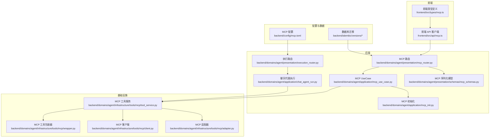
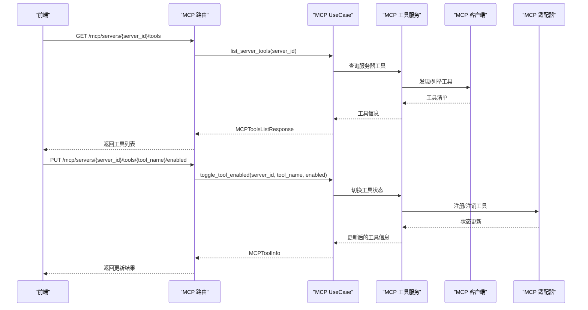
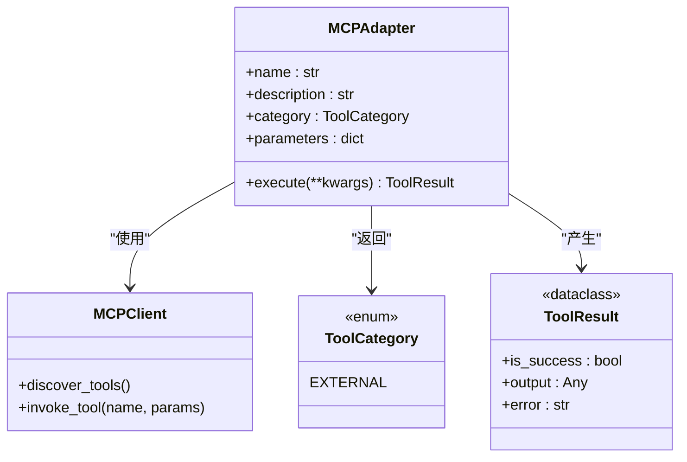
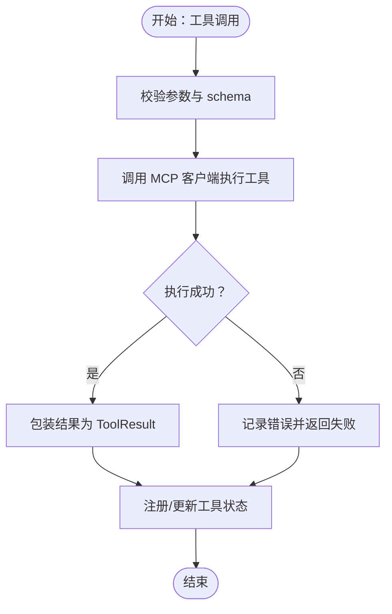
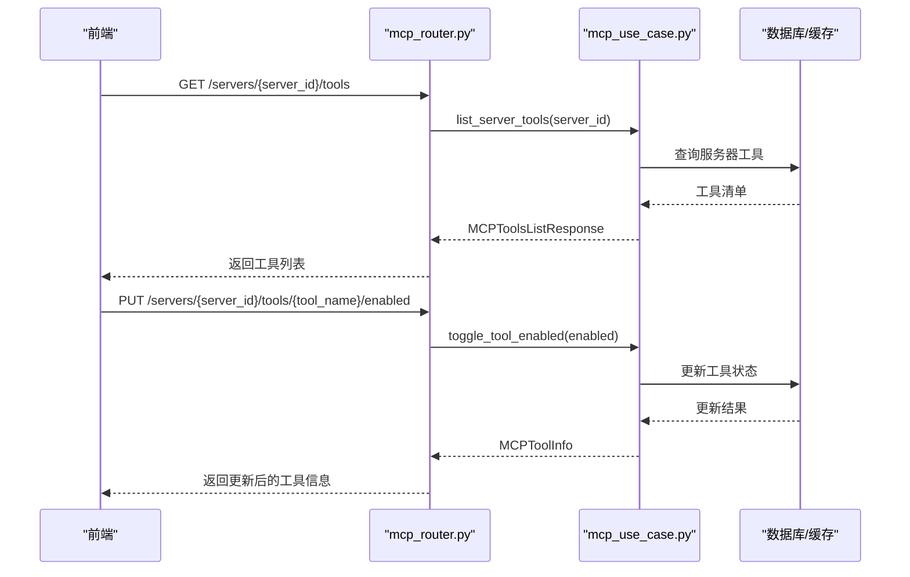
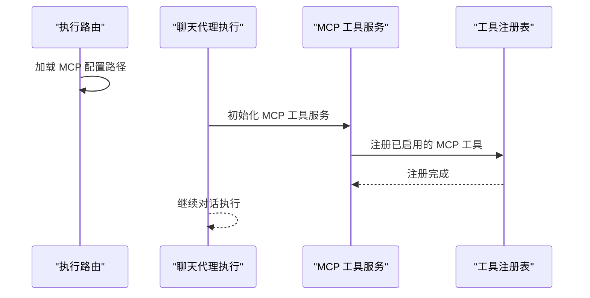
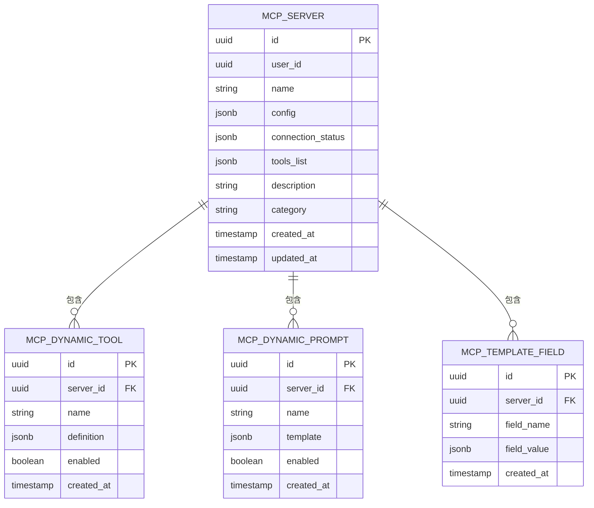
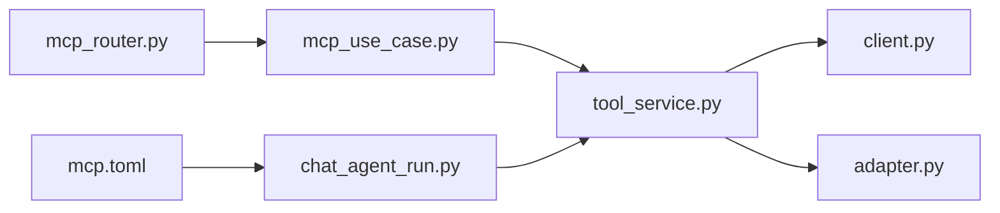

# 工具开发指南

<cite>
**本文档引用的文件**
- [mcp.toml](file://backend/config/mcp.toml)
- [mcp_schemas.py](file://backend/domains/agent/presentation/schemas/mcp_schemas.py)
- [mcp_router.py](file://backend/domains/agent/presentation/mcp_router.py)
- [mcp_use_case.py](file://backend/domains/agent/application/mcp_use_case.py)
- [mcp_init.py](file://backend/domains/agent/application/mcp_init.py)
- [adapter.py](file://backend/domains/agent/infrastructure/tools/mcp/adapter.py)
- [client.py](file://backend/domains/agent/infrastructure/tools/mcp/client.py)
- [tool_service.py](file://backend/domains/agent/infrastructure/tools/mcp/tool_service.py)
- [wrapper.py](file://backend/domains/agent/infrastructure/tools/mcp/wrapper.py)
- [__init__.py](file://backend/domains/agent/infrastructure/tools/mcp/__init__.py)
- [20260127_150000_add_mcp_servers.py](file://backend/alembic/versions/20260127_150000_add_mcp_servers.py)
- [20260127_160000_add_mcp_connection_status_and_tools.py](file://backend/alembic/versions/20260127_160000_add_mcp_connection_status_and_tools.py)
- [20260127_170000_add_mcp_description_and_category.py](file://backend/alembic/versions/20260127_170000_add_mcp_description_and_category.py)
- [20260129_add_mcp_dynamic_tools.py](file://backend/alembic/versions/20260129_add_mcp_dynamic_tools.py)
- [20260129_add_mcp_dynamic_prompts.py](file://backend/alembic/versions/20260129_add_mcp_dynamic_prompts.py)
- [20260129_add_mcp_template_fields.py](file://backend/alembic/versions/20260129_add_mcp_template_fields.py)
- [execution_router.py](file://backend/domains/agent/presentation/execution_router.py)
- [chat_agent_run.py](file://backend/domains/agent/application/chat_agent_run.py)
- [mcp.ts](file://frontend/src/api/mcp.ts)
- [mcp.ts 类型定义](file://frontend/src/types/mcp.ts)
- [mcp 页面测试](file://backend/tests/integration/api/test_mcp_tools_api.py)
- [mcp 页面测试（前端）](file://frontend/tests/mcp/mcp-page.test.tsx)
- [MCP 快速入门](file://backend/docs/mcp/MCP_QUICKSTART.md)
- [MCP 自动初始化](file://backend/docs/mcp/MCP_AUTO_INIT.md)
- [MCP 状态系统](file://backend/docs/mcp/MCP_STATUS_SYSTEM.md)
- [MCP 工具管理实现计划](file://docs/archive/plans/2025-01-28-mcp-tool-management-implementation.md)
</cite>

## 目录
1. [简介](#简介)
2. [项目结构](#项目结构)
3. [核心组件](#核心组件)
4. [架构总览](#架构总览)
5. [详细组件分析](#详细组件分析)
6. [依赖关系分析](#依赖关系分析)
7. [性能考虑](#性能考虑)
8. [故障排除指南](#故障排除指南)
9. [结论](#结论)
10. [附录](#附录)

## 简介
本指南面向希望基于 Model Context Protocol (MCP) 开发和集成工具的工程师，系统阐述工具类定义、标准接口、实现规范、配置与元数据管理、调试与测试方法、打包与发布流程，以及最佳实践与常见陷阱。文档以仓库中的实际实现为依据，结合数据库迁移、后端路由与 UseCase、前端 API 客户端、以及自动化初始化与状态管理等模块，帮助开发者从需求分析到上线运维的全流程落地。

## 项目结构
MCP 工具能力横跨后端应用层、基础设施层、前端交互层，并通过数据库迁移与配置文件支撑运行期管理。关键位置如下：
- 配置层：`backend/config/mcp.toml` 提供 MCP 服务器配置
- 应用层：`backend/domains/agent/application/` 下的 UseCase 与初始化逻辑
- 基础设施层：`backend/domains/agent/infrastructure/tools/mcp/` 下的适配器、客户端、服务与包装器
- 表现层：`backend/domains/agent/presentation/` 下的路由与序列化模型
- 数据库迁移：`backend/alembic/versions/` 下的 MCP 相关表结构变更
- 前端：`frontend/src/api/mcp.ts` 与 `frontend/src/types/mcp.ts` 提供工具列表与开关的 API 客户端

**图表来源**
- [mcp_router.py:88-130](file://backend/domains/agent/presentation/mcp_router.py#L88-L130)
- [mcp_schemas.py:717-741](file://backend/domains/agent/presentation/schemas/mcp_schemas.py#L717-L741)
- [mcp_use_case.py:111-141](file://backend/domains/agent/application/mcp_use_case.py#L111-L141)
- [mcp_init.py:1-18](file://backend/domains/agent/application/mcp_init.py#L1-L18)
- [adapter.py:16-56](file://backend/domains/agent/infrastructure/tools/mcp/adapter.py#L16-L56)
- [client.py](file://backend/domains/agent/infrastructure/tools/mcp/client.py)
- [tool_service.py](file://backend/domains/agent/infrastructure/tools/mcp/tool_service.py)
- [wrapper.py](file://backend/domains/agent/infrastructure/tools/mcp/wrapper.py)
- [execution_router.py:410-410](file://backend/domains/agent/presentation/execution_router.py#L410-L410)
- [chat_agent_run.py:383-413](file://backend/domains/agent/application/chat_agent_run.py#L383-L413)
- [mcp.toml](file://backend/config/mcp.toml)

**章节来源**
- [mcp_router.py:88-130](file://backend/domains/agent/presentation/mcp_router.py#L88-L130)
- [mcp_schemas.py:717-741](file://backend/domains/agent/presentation/schemas/mcp_schemas.py#L717-L741)
- [mcp_use_case.py:111-141](file://backend/domains/agent/application/mcp_use_case.py#L111-L141)
- [mcp_init.py:1-18](file://backend/domains/agent/application/mcp_init.py#L1-L18)
- [adapter.py:16-56](file://backend/domains/agent/infrastructure/tools/mcp/adapter.py#L16-L56)
- [client.py](file://backend/domains/agent/infrastructure/tools/mcp/client.py)
- [tool_service.py](file://backend/domains/agent/infrastructure/tools/mcp/tool_service.py)
- [wrapper.py](file://backend/domains/agent/infrastructure/tools/mcp/wrapper.py)
- [execution_router.py:410-410](file://backend/domains/agent/presentation/execution_router.py#L410-L410)
- [chat_agent_run.py:383-413](file://backend/domains/agent/application/chat_agent_run.py#L383-L413)
- [mcp.toml](file://backend/config/mcp.toml)

## 核心组件
- MCP 适配器（MCPAdapter）：将 MCP 协议的工具封装为系统工具接口，暴露名称、描述、类别、参数与异步执行方法。
- MCP 客户端（MCPClient）：负责与 MCP 服务器建立连接、发现工具、调用工具并处理响应。
- MCP 工具服务（MCPToolService）：协调客户端与适配器，管理工具生命周期与注册。
- MCP 工具包装器（MCPToolWrapper）：对工具调用进行包装，统一参数校验与结果格式。
- 路由与 UseCase：提供 MCP 服务器的增删改查、启用/禁用、工具列表与开关等 API。
- 序列化模型：定义工具信息、工具列表响应、工具开关请求等数据结构。
- 初始化与状态：系统级 MCP 服务器的自动初始化与状态管理。

**章节来源**
- [adapter.py:16-56](file://backend/domains/agent/infrastructure/tools/mcp/adapter.py#L16-L56)
- [client.py](file://backend/domains/agent/infrastructure/tools/mcp/client.py)
- [tool_service.py](file://backend/domains/agent/infrastructure/tools/mcp/tool_service.py)
- [wrapper.py](file://backend/domains/agent/infrastructure/tools/mcp/wrapper.py)
- [mcp_router.py:88-130](file://backend/domains/agent/presentation/mcp_router.py#L88-L130)
- [mcp_schemas.py:717-741](file://backend/domains/agent/presentation/schemas/mcp_schemas.py#L717-L741)
- [mcp_use_case.py:111-141](file://backend/domains/agent/application/mcp_use_case.py#L111-L141)
- [mcp_init.py:1-18](file://backend/domains/agent/application/mcp_init.py#L1-L18)

## 架构总览
MCP 工具开发遵循“配置驱动 + 服务编排 + 适配器模式”的架构。前端通过 API 客户端调用后端路由，路由委托给 UseCase，UseCase 使用 MCP 工具服务与 MCP 客户端交互，最终通过适配器将外部工具能力映射为系统内部工具接口。会话执行阶段根据会话配置动态加载并注册 MCP 工具。

**图表来源**
- [mcp_router.py:770-796](file://backend/domains/agent/presentation/mcp_router.py#L770-L796)
- [mcp_use_case.py:111-141](file://backend/domains/agent/application/mcp_use_case.py#L111-L141)
- [tool_service.py](file://backend/domains/agent/infrastructure/tools/mcp/tool_service.py)
- [adapter.py:16-56](file://backend/domains/agent/infrastructure/tools/mcp/adapter.py#L16-L56)

## 详细组件分析

### 组件一：MCP 适配器（MCPAdapter）
- 角色：将 MCP 工具适配为系统工具接口，提供名称、描述、类别、参数与异步执行方法。
- 关键属性与方法：
  - name/description/category/parameters：工具元数据与参数结构
  - execute(**kwargs)：异步执行工具，接收参数字典并返回工具结果
- 设计要点：
  - 参数 schema 来自 MCP 服务器的输入模式
  - 工具类别标记为外部工具，便于系统识别与治理
  - 日志记录用于问题排查

**图表来源**
- [adapter.py:16-56](file://backend/domains/agent/infrastructure/tools/mcp/adapter.py#L16-L56)

**章节来源**
- [adapter.py:16-56](file://backend/domains/agent/infrastructure/tools/mcp/adapter.py#L16-L56)

### 组件二：MCP 客户端与工具服务
- MCP 客户端：负责与 MCP 服务器通信，发现工具、调用工具并处理响应。
- MCP 工具服务：协调客户端与适配器，管理工具注册、生命周期与状态切换。
- 工具包装器：对工具调用进行统一包装，确保参数校验与结果格式一致。

**图表来源**
- [wrapper.py](file://backend/domains/agent/infrastructure/tools/mcp/wrapper.py)
- [tool_service.py](file://backend/domains/agent/infrastructure/tools/mcp/tool_service.py)
- [client.py](file://backend/domains/agent/infrastructure/tools/mcp/client.py)

**章节来源**
- [client.py](file://backend/domains/agent/infrastructure/tools/mcp/client.py)
- [tool_service.py](file://backend/domains/agent/infrastructure/tools/mcp/tool_service.py)
- [wrapper.py](file://backend/domains/agent/infrastructure/tools/mcp/wrapper.py)

### 组件三：路由与 UseCase（工具管理 API）
- 路由端点：
  - GET /mcp/servers/{server_id}/tools：获取服务器工具列表与 Token 占用
  - PUT /mcp/servers/{server_id}/tools/{tool_name}/enabled：切换工具启用状态
- UseCase 方法：
  - list_server_tools：查询服务器工具并统计 Token 数
  - toggle_tool_enabled：启用/禁用指定工具
- 序列化模型：
  - MCPToolInfo：工具信息（名称、描述、输入 schema、启用状态、Token 数）
  - MCPToolsListResponse：工具列表响应（服务器 ID/名称、工具数组、总 Token 数、启用数量）
  - MCPToolToggleRequest：工具开关请求体（enabled）

**图表来源**
- [mcp_router.py:770-796](file://backend/domains/agent/presentation/mcp_router.py#L770-L796)
- [mcp_schemas.py:717-741](file://backend/domains/agent/presentation/schemas/mcp_schemas.py#L717-L741)
- [mcp_use_case.py:111-141](file://backend/domains/agent/application/mcp_use_case.py#L111-L141)

**章节来源**
- [mcp_router.py:770-796](file://backend/domains/agent/presentation/mcp_router.py#L770-L796)
- [mcp_schemas.py:717-741](file://backend/domains/agent/presentation/schemas/mcp_schemas.py#L717-L741)
- [mcp_use_case.py:111-141](file://backend/domains/agent/application/mcp_use_case.py#L111-L141)

### 组件四：会话执行与工具注册
- 执行路由在启动时读取 MCP 配置文件路径，确保运行期可用。
- 聊天代理执行阶段根据会话配置加载并注册 MCP 工具，失败时记录警告并跳过。
- 工具服务负责实例化并注入工具注册表，支持动态启用/禁用。

**图表来源**
- [execution_router.py:410-410](file://backend/domains/agent/presentation/execution_router.py#L410-L410)
- [chat_agent_run.py:383-413](file://backend/domains/agent/application/chat_agent_run.py#L383-L413)
- [mcp.toml](file://backend/config/mcp.toml)

**章节来源**
- [execution_router.py:410-410](file://backend/domains/agent/presentation/execution_router.py#L410-L410)
- [chat_agent_run.py:383-413](file://backend/domains/agent/application/chat_agent_run.py#L383-L413)
- [mcp.toml](file://backend/config/mcp.toml)

### 组件五：数据库模型与迁移
- MCP 服务器表：存储服务器配置、连接状态、工具列表等字段
- 动态工具与提示表：按服务器维度存储运行时新增的工具与提示模板
- 模板字段：支持模板化配置与扩展
- 系统级 MCP 服务器：默认系统级服务器的初始化与拆分

**图表来源**
- [20260127_150000_add_mcp_servers.py:24-71](file://backend/alembic/versions/20260127_150000_add_mcp_servers.py#L24-L71)
- [20260127_160000_add_mcp_connection_status_and_tools.py](file://backend/alembic/versions/20260127_160000_add_mcp_connection_status_and_tools.py)
- [20260127_170000_add_mcp_description_and_category.py](file://backend/alembic/versions/20260127_170000_add_mcp_description_and_category.py)
- [20260129_add_mcp_dynamic_tools.py](file://backend/alembic/versions/20260129_add_mcp_dynamic_tools.py)
- [20260129_add_mcp_dynamic_prompts.py](file://backend/alembic/versions/20260129_add_mcp_dynamic_prompts.py)
- [20260129_add_mcp_template_fields.py](file://backend/alembic/versions/20260129_add_mcp_template_fields.py)

**章节来源**
- [20260127_150000_add_mcp_servers.py:24-71](file://backend/alembic/versions/20260127_150000_add_mcp_servers.py#L24-L71)
- [20260127_160000_add_mcp_connection_status_and_tools.py](file://backend/alembic/versions/20260127_160000_add_mcp_connection_status_and_tools.py)
- [20260127_170000_add_mcp_description_and_category.py](file://backend/alembic/versions/20260127_170000_add_mcp_description_and_category.py)
- [20260129_add_mcp_dynamic_tools.py](file://backend/alembic/versions/20260129_add_mcp_dynamic_tools.py)
- [20260129_add_mcp_dynamic_prompts.py](file://backend/alembic/versions/20260129_add_mcp_dynamic_prompts.py)
- [20260129_add_mcp_template_fields.py](file://backend/alembic/versions/20260129_add_mcp_template_fields.py)

## 依赖关系分析
- 组件耦合：
  - 路由依赖 UseCase；UseCase 依赖工具服务；工具服务依赖客户端与适配器
  - 会话执行阶段依赖工具服务与配置文件
- 外部依赖：
  - MCP 服务器（外部协议）
  - 数据库（Alembic 迁移定义的表结构）
- 接口契约：
  - 工具接口：名称、描述、类别、参数 schema、异步执行
  - 路由接口：工具列表、工具开关、服务器管理

**图表来源**
- [mcp_router.py:88-130](file://backend/domains/agent/presentation/mcp_router.py#L88-L130)
- [mcp_use_case.py:111-141](file://backend/domains/agent/application/mcp_use_case.py#L111-L141)
- [tool_service.py](file://backend/domains/agent/infrastructure/tools/mcp/tool_service.py)
- [adapter.py:16-56](file://backend/domains/agent/infrastructure/tools/mcp/adapter.py#L16-L56)
- [chat_agent_run.py:383-413](file://backend/domains/agent/application/chat_agent_run.py#L383-L413)
- [mcp.toml](file://backend/config/mcp.toml)

**章节来源**
- [mcp_router.py:88-130](file://backend/domains/agent/presentation/mcp_router.py#L88-L130)
- [mcp_use_case.py:111-141](file://backend/domains/agent/application/mcp_use_case.py#L111-L141)
- [tool_service.py](file://backend/domains/agent/infrastructure/tools/mcp/tool_service.py)
- [adapter.py:16-56](file://backend/domains/agent/infrastructure/tools/mcp/adapter.py#L16-L56)
- [chat_agent_run.py:383-413](file://backend/domains/agent/application/chat_agent_run.py#L383-L413)
- [mcp.toml](file://backend/config/mcp.toml)

## 性能考虑
- 工具发现与调用：
  - 缓存工具清单与连接状态，避免频繁重连与重复发现
  - 分页与批量操作工具列表，减少单次请求负载
- Token 统计：
  - 在工具信息中维护上下文 Token 占用，辅助会话上下文控制
- 并发与超时：
  - MCP 客户端调用设置合理超时与并发限制，防止阻塞
- 数据库访问：
  - 对工具列表与状态查询使用索引字段（如服务器 ID、名称），减少扫描

## 故障排除指南
- 工具无法加载：
  - 检查会话配置中的服务器 ID 是否有效
  - 查看工具服务初始化日志，确认连接状态
- 工具开关无效：
  - 确认路由端点与 UseCase 的开关逻辑正确
  - 核对前端 API 请求路径与参数编码
- 数据不一致：
  - 检查数据库迁移是否完成，确认表结构与字段存在
  - 核对系统级 MCP 服务器初始化脚本是否执行

**章节来源**
- [chat_agent_run.py:383-413](file://backend/domains/agent/application/chat_agent_run.py#L383-L413)
- [mcp_router.py:770-796](file://backend/domains/agent/presentation/mcp_router.py#L770-L796)
- [mcp_use_case.py:111-141](file://backend/domains/agent/application/mcp_use_case.py#L111-L141)
- [20260127_150000_add_mcp_servers.py:24-71](file://backend/alembic/versions/20260127_150000_add_mcp_servers.py#L24-L71)

## 结论
本指南基于仓库中的实际实现，系统梳理了 MCP 工具开发的全链路：从配置与元数据管理、后端路由与 UseCase、基础设施适配器与客户端、到前端 API 客户端与会话执行集成。通过数据库迁移与初始化机制，确保系统级 MCP 服务器的可用性与可扩展性。建议在开发过程中严格遵循接口契约、做好参数校验与错误处理，并结合测试与监控持续优化性能与稳定性。

## 附录

### A. 工具开发流程（从需求到上线）
- 需求分析：明确工具用途、输入输出、安全与性能要求
- 设计实现：定义工具接口、参数 schema、异常处理与日志
- 后端集成：实现适配器与客户端，接入 UseCase 与路由
- 前端对接：完善 API 客户端与类型定义，提供 UI 控制与状态展示
- 测试验证：编写单元测试、集成测试与端到端测试
- 部署发布：更新数据库迁移、配置文件与前端构建产物

**章节来源**
- [mcp_schemas.py:717-741](file://backend/domains/agent/presentation/schemas/mcp_schemas.py#L717-L741)
- [mcp_router.py:770-796](file://backend/domains/agent/presentation/mcp_router.py#L770-L796)
- [mcp_use_case.py:111-141](file://backend/domains/agent/application/mcp_use_case.py#L111-L141)
- [mcp.ts](file://frontend/src/api/mcp.ts)
- [mcp.ts 类型定义](file://frontend/src/types/mcp.ts)
- [mcp 页面测试](file://backend/tests/integration/api/test_mcp_tools_api.py)
- [mcp 页面测试（前端）](file://frontend/tests/mcp/mcp-page.test.tsx)

### B. 配置与元数据管理
- 配置文件：`backend/config/mcp.toml` 提供 MCP 服务器配置
- 元数据字段：工具名称、描述、输入 schema、启用状态、Token 占用
- 模板与动态扩展：支持模板化配置与运行时新增工具/提示

**章节来源**
- [mcp.toml](file://backend/config/mcp.toml)
- [mcp_schemas.py:717-741](file://backend/domains/agent/presentation/schemas/mcp_schemas.py#L717-L741)
- [20260129_add_mcp_template_fields.py](file://backend/alembic/versions/20260129_add_mcp_template_fields.py)

### C. 调试与测试方法
- 单元测试：针对适配器、客户端与工具服务的核心方法
- 集成测试：覆盖路由端点与 UseCase 的完整流程
- 端到端测试：从前端 UI 到后端 API 的整体验证

**章节来源**
- [mcp 页面测试](file://backend/tests/integration/api/test_mcp_tools_api.py)
- [mcp 页面测试（前端）](file://frontend/tests/mcp/mcp-page.test.tsx)

### D. 打包与发布流程
- 版本管理：通过 Alembic 迁移管理数据库结构演进
- 依赖处理：后端 Python 包与前端 npm 包的版本锁定
- 部署策略：容器化镜像构建与多环境配置

**章节来源**
- [20260127_150000_add_mcp_servers.py:24-71](file://backend/alembic/versions/20260127_150000_add_mcp_servers.py#L24-L71)
- [MCP 快速入门](file://backend/docs/mcp/MCP_QUICKSTART.md)
- [MCP 自动初始化](file://backend/docs/mcp/MCP_AUTO_INIT.md)
- [MCP 状态系统](file://backend/docs/mcp/MCP_STATUS_SYSTEM.md)

### E. 最佳实践与常见陷阱
- 最佳实践：
  - 明确工具接口契约，保持参数 schema 与文档一致
  - 异步执行与超时控制，避免阻塞主流程
  - 严格的错误处理与日志记录，便于定位问题
  - 使用索引字段优化数据库查询性能
- 常见陷阱：
  - 忽视工具开关状态导致误用
  - 参数 schema 不匹配引发执行失败
  - 未处理 MCP 服务器不可达的情况

**章节来源**
- [adapter.py:16-56](file://backend/domains/agent/infrastructure/tools/mcp/adapter.py#L16-L56)
- [client.py](file://backend/domains/agent/infrastructure/tools/mcp/client.py)
- [tool_service.py](file://backend/domains/agent/infrastructure/tools/mcp/tool_service.py)
- [chat_agent_run.py:383-413](file://backend/domains/agent/application/chat_agent_run.py#L383-L413)