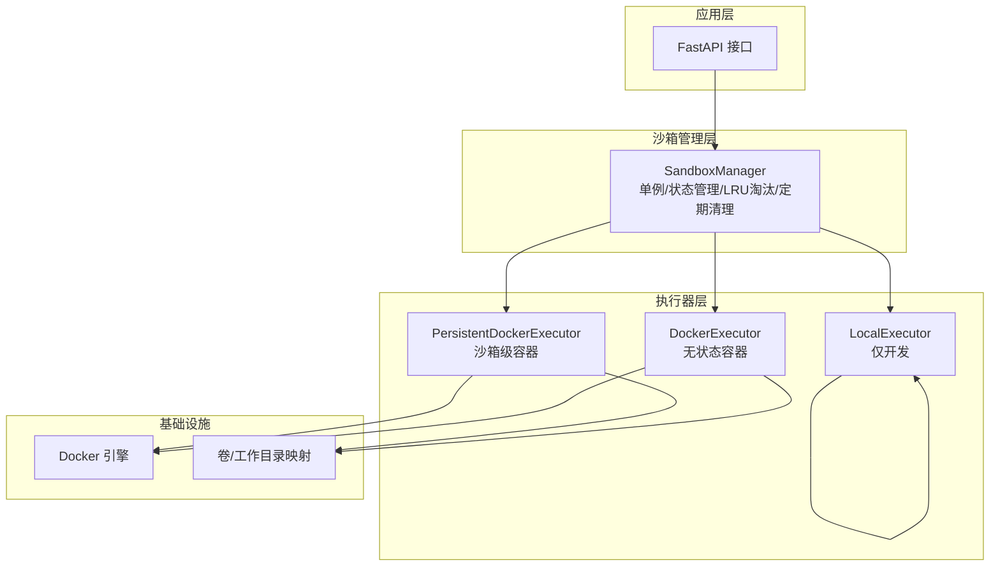
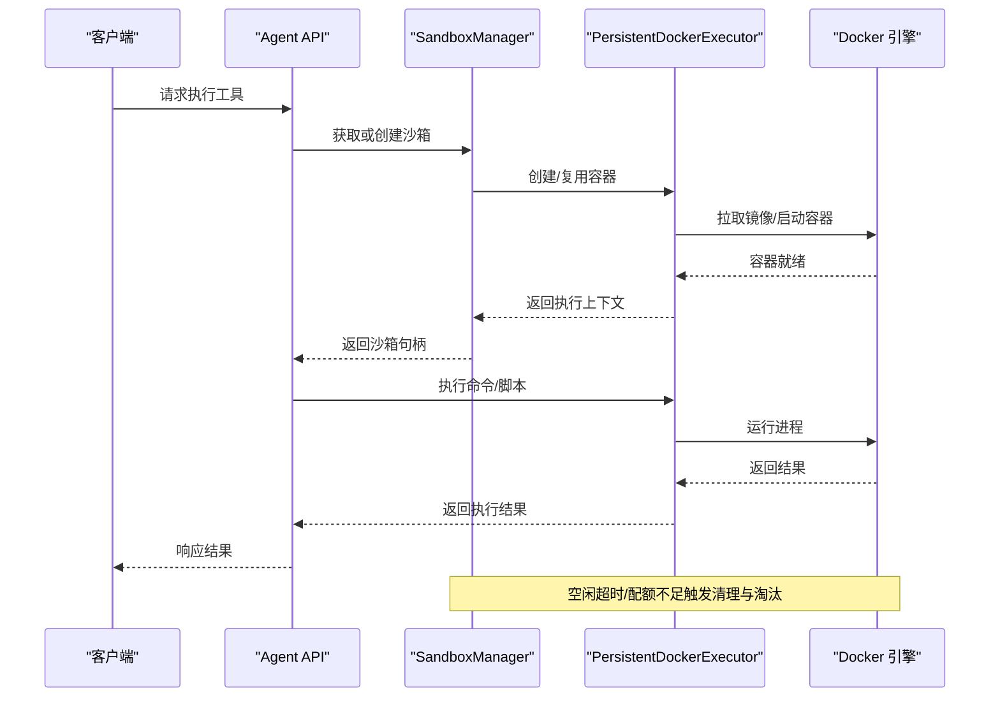
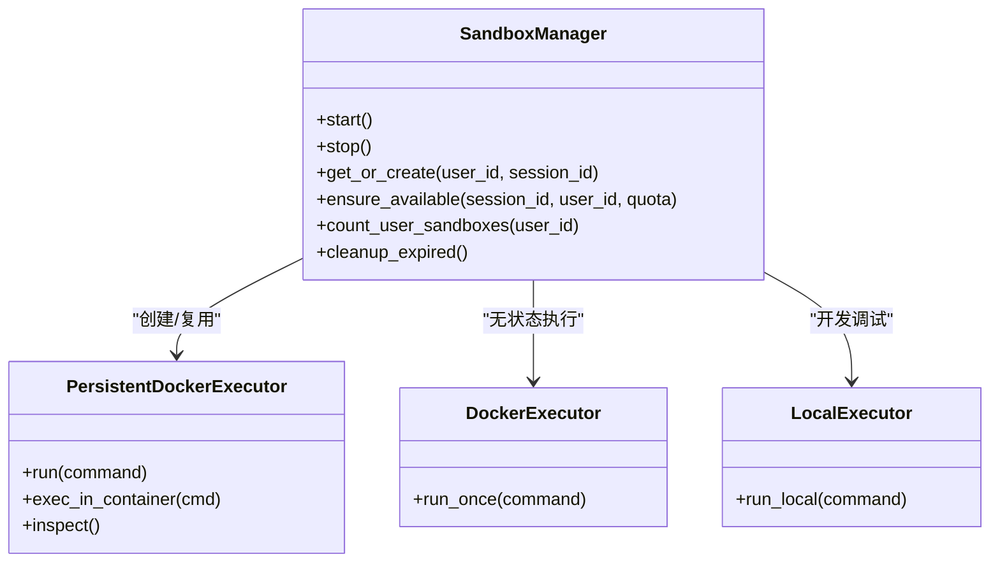
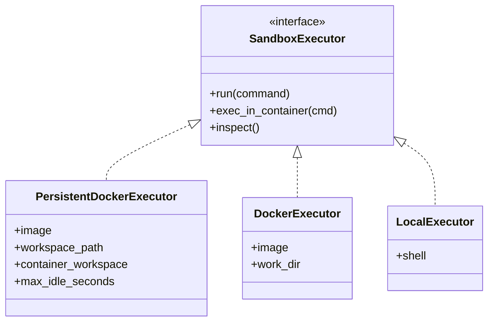
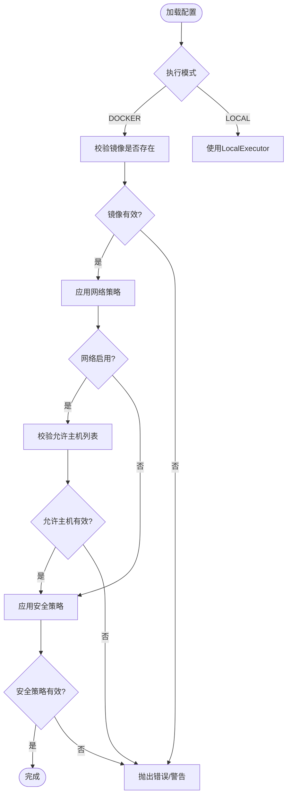
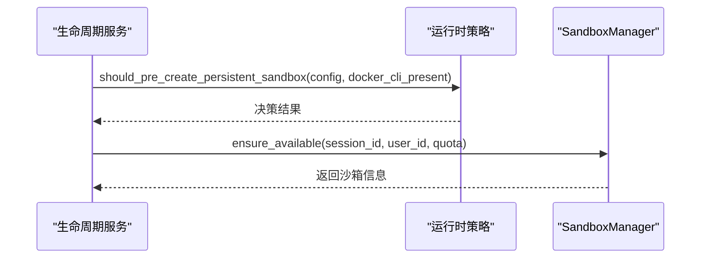
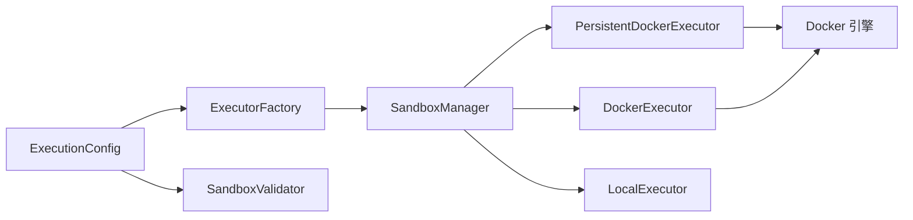

# 沙箱执行环境

<cite>
**本文引用的文件**
- [沙箱资源管理设计文档.md](file://backend/docs/沙箱资源管理设计文档.md)
- [execution.toml](file://backend/config/execution.toml)
- [network-restricted.toml](file://backend/config/environments/network-restricted.toml)
- [network-enabled.toml](file://backend/config/environments/network-enabled.toml)
- [docker-compose.yml](file://docker-compose.yml)
- [docker-compose.prod.yml](file://docker-compose.prod.yml)
- [sandbox_manager.py](file://backend/domains/agent/infrastructure/sandbox/sandbox_manager.py)
- [executor.py](file://backend/domains/agent/infrastructure/sandbox/executor.py)
- [factory.py](file://backend/domains/agent/infrastructure/sandbox/factory.py)
- [sandbox_executor_factory.py](file://backend/domains/agent/infrastructure/sandbox/sandbox_executor_factory.py)
- [sandbox_lifecycle.py](file://backend/domains/agent/domain/services/sandbox_lifecycle.py)
- [sandbox_runtime_policy.py](file://backend/domains/agent/domain/sandbox_runtime_policy.py)
- [sandbox_validator.py](file://backend/libs/config/validators/sandbox_validator.py)
- [cleanup_sandbox_containers.py](file://backend/scripts/cleanup_sandbox_containers.py)
- [test_sandbox_manager.py](file://backend/tests/unit/test_sandbox_manager.py)
- [test_sandbox_executor_factory.py](file://backend/tests/unit/test_sandbox_executor_factory.py)
- [test_validators.py](file://backend/tests/unit/core/config/test_validators.py)
</cite>

## 目录
1. [引言](#引言)
2. [项目结构](#项目结构)
3. [核心组件](#核心组件)
4. [架构总览](#架构总览)
5. [详细组件分析](#详细组件分析)
6. [依赖关系分析](#依赖关系分析)
7. [性能考虑](#性能考虑)
8. [故障排除指南](#故障排除指南)
9. [结论](#结论)
10. [附录](#附录)

## 引言
本文件面向MCP工具的沙箱执行环境，系统性阐述其设计理念、安全模型与技术实现，覆盖进程隔离、网络隔离与文件系统隔离；Docker容器的生命周期与资源分配；资源限制策略（CPU、内存、磁盘、网络带宽）；安全策略（用户权限、文件访问、网络访问）；监控与审计（资源统计、操作日志、异常检测）；以及配置与部署指南（环境变量、卷挂载、网络配置）。文档同时提供故障排除与性能优化建议，帮助读者在生产环境中稳定、安全地运行沙箱。

## 项目结构
沙箱执行环境由三层构成：应用层（API入口）、沙箱管理层（SandboxManager）与执行器层（Docker/Local执行器）。系统通过配置驱动模式选择执行模式，并在Docker引擎上运行持久化容器以实现强隔离。

图表来源
- [沙箱资源管理设计文档.md: 12-51:12-51](file://backend/docs/沙箱资源管理设计文档.md#L12-L51)
- [sandbox_manager.py](file://backend/domains/agent/infrastructure/sandbox/sandbox_manager.py)
- [executor.py](file://backend/domains/agent/infrastructure/sandbox/executor.py)

章节来源
- [沙箱资源管理设计文档.md: 12-51:12-51](file://backend/docs/沙箱资源管理设计文档.md#L12-L51)

## 核心组件
- SandboxManager：负责沙箱的创建、复用、状态管理（ACTIVE/IDLE/DISCONNECTED/COMPLETING）、用户/会话关联、资源限制（LRU淘汰）、定期清理等。
- 执行器层：包含PersistentDockerExecutor（沙箱级容器）、DockerExecutor（无状态容器）、LocalExecutor（仅开发）。
- 配置与验证：通过execution.toml与环境配置文件（如network-restricted.toml、network-enabled.toml）控制沙箱行为；SandboxValidator进行配置校验。
- 生命周期服务：sandbox_lifecycle.py提供会话级沙箱确保、查询与配额管理。
- 运行时策略：sandbox_runtime_policy.py决定是否预创建持久沙箱及策略偏好。

章节来源
- [sandbox_manager.py](file://backend/domains/agent/infrastructure/sandbox/sandbox_manager.py)
- [executor.py](file://backend/domains/agent/infrastructure/sandbox/executor.py)
- [factory.py](file://backend/domains/agent/infrastructure/sandbox/factory.py)
- [sandbox_executor_factory.py](file://backend/domains/agent/infrastructure/sandbox/sandbox_executor_factory.py)
- [sandbox_lifecycle.py](file://backend/domains/agent/domain/services/sandbox_lifecycle.py)
- [sandbox_runtime_policy.py](file://backend/domains/agent/domain/sandbox_runtime_policy.py)
- [sandbox_validator.py](file://backend/libs/config/validators/sandbox_validator.py)

## 架构总览
下图展示从API到Docker引擎的端到端调用链，以及沙箱状态流转与资源回收机制。

图表来源
- [沙箱资源管理设计文档.md: 12-51:12-51](file://backend/docs/沙箱资源管理设计文档.md#L12-L51)
- [sandbox_manager.py](file://backend/domains/agent/infrastructure/sandbox/sandbox_manager.py)
- [executor.py](file://backend/domains/agent/infrastructure/sandbox/executor.py)

## 详细组件分析

### SandboxManager（沙箱管理器）
职责与特性
- 单例模式：全局唯一实例，统一管理所有沙箱生命周期。
- 状态管理：维护沙箱状态机（ACTIVE/IDLE/DISCONNECTED/COMPLETING），支持空闲超时与自动回收。
- 用户/会话关联：按session_id与user_id建立映射，便于审计与配额控制。
- 资源限制与淘汰：基于LRU策略与配额上限，超限时驱逐旧沙箱。
- 定期清理：周期性扫描并清理僵尸容器与过期资源。
- 监控与审计：记录包安装、文件创建等操作，便于审计与异常检测。

图表来源
- [sandbox_manager.py](file://backend/domains/agent/infrastructure/sandbox/sandbox_manager.py)
- [executor.py](file://backend/domains/agent/infrastructure/sandbox/executor.py)

章节来源
- [sandbox_manager.py](file://backend/domains/agent/infrastructure/sandbox/sandbox_manager.py)
- [test_sandbox_manager.py: 489-523:489-523](file://backend/tests/unit/test_sandbox_manager.py#L489-L523)

### 执行器层（Executor）
- PersistentDockerExecutor：为每个沙箱维持一个长期运行的容器，适合需要保持状态的场景。
- DockerExecutor：一次性容器，适合短时任务，避免状态累积。
- LocalExecutor：仅用于开发与测试，不提供生产级隔离。

图表来源
- [executor.py](file://backend/domains/agent/infrastructure/sandbox/executor.py)

章节来源
- [executor.py](file://backend/domains/agent/infrastructure/sandbox/executor.py)
- [factory.py: 23-59:23-59](file://backend/domains/agent/infrastructure/sandbox/factory.py#L23-L59)
- [sandbox_executor_factory.py: 17-79:17-79](file://backend/domains/agent/infrastructure/sandbox/sandbox_executor_factory.py#L17-L79)

### 配置与验证（ExecutionConfig/SandboxConfig）
- execution.toml：集中定义沙箱模式（LOCAL/DOCKER）、网络策略、安全策略与资源限制。
- 环境配置：network-restricted.toml与network-enabled.toml分别提供受限与开放网络的默认策略。
- SandboxValidator：对配置进行合法性检查（如Docker模式必须提供镜像、网络开启需指定允许主机等）。

图表来源
- [sandbox_validator.py](file://backend/libs/config/validators/sandbox_validator.py)
- [test_validators.py: 64-107:64-107](file://backend/tests/unit/core/config/test_validators.py#L64-L107)

章节来源
- [execution.toml](file://backend/config/execution.toml)
- [network-restricted.toml: 42-61:42-61](file://backend/config/environments/network-restricted.toml#L42-L61)
- [network-enabled.toml](file://backend/config/environments/network-enabled.toml)
- [sandbox_validator.py](file://backend/libs/config/validators/sandbox_validator.py)
- [test_validators.py: 64-107:64-107](file://backend/tests/unit/core/config/test_validators.py#L64-L107)

### 生命周期与运行时策略
- sandbox_lifecycle.py：提供ensure_available、get_by_session、count_user_sandboxes等方法，确保会话拥有可用沙箱并处理超配额场景。
- sandbox_runtime_policy.py：判断是否需要预创建持久沙箱，结合Docker CLI可用性与配置共同决策。

图表来源
- [sandbox_lifecycle.py: 92-135:92-135](file://backend/domains/agent/domain/services/sandbox_lifecycle.py#L92-L135)
- [sandbox_runtime_policy.py](file://backend/domains/agent/domain/sandbox_runtime_policy.py)
- [test_sandbox_runtime_policy.py: 26-62:26-62](file://backend/tests/unit/agent/domain/test_sandbox_runtime_policy.py#L26-L62)

章节来源
- [sandbox_lifecycle.py: 92-135:92-135](file://backend/domains/agent/domain/services/sandbox_lifecycle.py#L92-L135)
- [sandbox_runtime_policy.py](file://backend/domains/agent/domain/sandbox_runtime_policy.py)
- [test_sandbox_runtime_policy.py: 26-62:26-62](file://backend/tests/unit/agent/domain/test_sandbox_runtime_policy.py#L26-L62)

## 依赖关系分析
- 组件耦合：SandboxManager依赖执行器工厂创建不同类型的执行器；执行器直接依赖Docker引擎。
- 外部依赖：Docker引擎、卷存储、网络策略（iptables/容器网络）。
- 配置驱动：通过execution.toml与环境配置文件影响沙箱行为，降低硬编码耦合。

图表来源
- [factory.py: 23-59:23-59](file://backend/domains/agent/infrastructure/sandbox/factory.py#L23-L59)
- [sandbox_executor_factory.py: 42-79:42-79](file://backend/domains/agent/infrastructure/sandbox/sandbox_executor_factory.py#L42-L79)
- [sandbox_manager.py](file://backend/domains/agent/infrastructure/sandbox/sandbox_manager.py)

章节来源
- [factory.py: 23-59:23-59](file://backend/domains/agent/infrastructure/sandbox/factory.py#L23-L59)
- [sandbox_executor_factory.py: 42-79:42-79](file://backend/domains/agent/infrastructure/sandbox/sandbox_executor_factory.py#L42-L79)
- [sandbox_manager.py](file://backend/domains/agent/infrastructure/sandbox/sandbox_manager.py)

## 性能考虑
- 容器复用：PersistentDockerExecutor减少频繁拉起容器的开销，提升响应速度。
- LRU淘汰与空闲回收：通过配额与空闲超时控制资源占用，避免资源泄漏。
- 资源限制：在execution.toml中设置合理的CPU/内存/磁盘限额，结合网络带宽限制，防止资源争用。
- 镜像优化：使用精简基础镜像（如python:3.11-slim），减少启动时间和磁盘占用。
- 网络策略：在受限网络环境下，仅放行必要主机，降低DNS与连接抖动带来的延迟。

## 故障排除指南
常见问题与排查步骤
- Docker模式未配置镜像
  - 现象：配置校验失败，提示缺少镜像。
  - 处理：在execution.toml中提供有效镜像名称，或切换至LOCAL模式。
  - 参考：[test_validators.py: 64-77:64-77](file://backend/tests/unit/core/config/test_validators.py#L64-L77)
- 网络启用但未配置允许主机
  - 现象：出现告警，提示未配置允许主机列表。
  - 处理：在配置中添加allowed_hosts，或关闭网络访问。
  - 参考：[test_validators.py: 79-88:79-88](file://backend/tests/unit/core/config/test_validators.py#L79-L88)
- 沙箱创建失败或超时
  - 现象：get_or_create失败或超时。
  - 处理：检查Docker守护进程状态、镜像拉取权限、卷挂载路径；确认配额与LRU策略未过度限制。
  - 参考：[sandbox_manager.py](file://backend/domains/agent/infrastructure/sandbox/sandbox_manager.py)
- 包安装与文件创建检测异常
  - 现象：包安装或文件创建未被正确记录。
  - 处理：检查命令格式与输出解析逻辑，确保命令被正确捕获与解析。
  - 参考：[test_sandbox_manager.py: 489-523:489-523](file://backend/tests/unit/test_sandbox_manager.py#L489-L523)
- 清理僵尸容器
  - 操作：执行清理脚本，移除长时间未使用的沙箱容器。
  - 参考：[cleanup_sandbox_containers.py](file://backend/scripts/cleanup_sandbox_containers.py)

章节来源
- [test_validators.py: 64-88:64-88](file://backend/tests/unit/core/config/test_validators.py#L64-L88)
- [test_sandbox_manager.py: 489-523:489-523](file://backend/tests/unit/test_sandbox_manager.py#L489-L523)
- [cleanup_sandbox_containers.py](file://backend/scripts/cleanup_sandbox_containers.py)

## 结论
该沙箱执行环境通过“配置驱动+多执行器+强隔离”的设计，在保证安全性的同时兼顾性能与可运维性。Docker持久化容器提供稳定的执行上下文，配合严格的资源与安全策略，能够有效防止越权与资源滥用。完善的监控与审计能力有助于持续改进与合规要求。建议在生产中结合环境配置文件与配额策略，持续优化镜像与网络策略，确保系统稳定高效运行。

## 附录

### 部署与配置指南
- 环境变量与配置文件
  - execution.toml：集中定义沙箱模式、网络、安全与资源限制。
  - 环境配置文件：network-restricted.toml与network-enabled.toml提供默认策略模板。
  - 参考：[execution.toml](file://backend/config/execution.toml)，[network-restricted.toml: 42-61:42-61](file://backend/config/environments/network-restricted.toml#L42-L61)，[network-enabled.toml](file://backend/config/environments/network-enabled.toml)
- 卷挂载与工作目录
  - PersistentDockerExecutor支持将主机路径映射到容器内工作目录，便于数据持久化与共享。
  - 参考：[sandbox_executor_factory.py: 49-78:49-78](file://backend/domains/agent/infrastructure/sandbox/sandbox_executor_factory.py#L49-L78)
- 网络配置
  - 在受限网络模式下，仅允许白名单主机访问；在开放网络模式下，允许自由访问外部网络。
  - 参考：[network-restricted.toml: 42-61:42-61](file://backend/config/environments/network-restricted.toml#L42-L61)，[network-enabled.toml](file://backend/config/environments/network-enabled.toml)
- Docker编排
  - 使用docker-compose与docker-compose.prod.yml进行服务编排与容器编排。
  - 参考：[docker-compose.yml](file://docker-compose.yml)，[docker-compose.prod.yml](file://docker-compose.prod.yml)

章节来源
- [execution.toml](file://backend/config/execution.toml)
- [network-restricted.toml: 42-61:42-61](file://backend/config/environments/network-restricted.toml#L42-L61)
- [network-enabled.toml](file://backend/config/environments/network-enabled.toml)
- [sandbox_executor_factory.py: 49-78:49-78](file://backend/domains/agent/infrastructure/sandbox/sandbox_executor_factory.py#L49-L78)
- [docker-compose.yml](file://docker-compose.yml)
- [docker-compose.prod.yml](file://docker-compose.prod.yml)