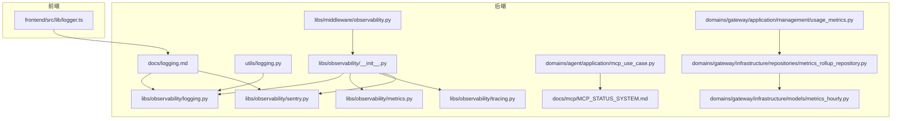
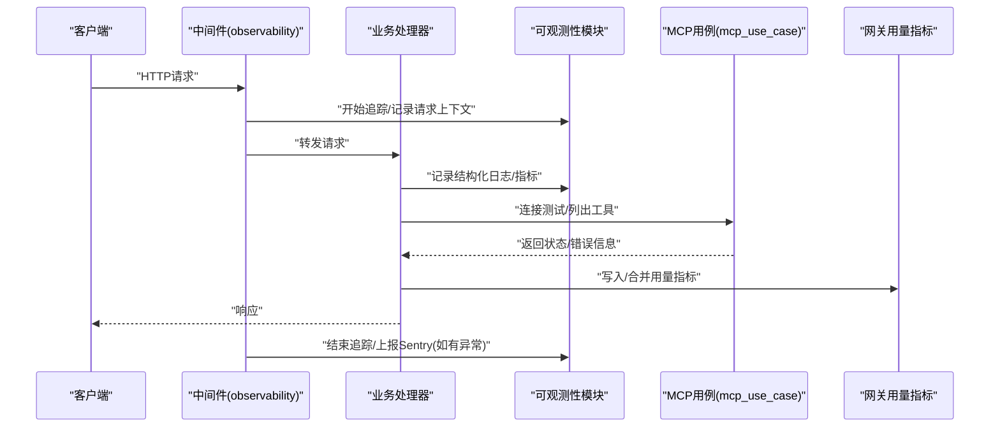
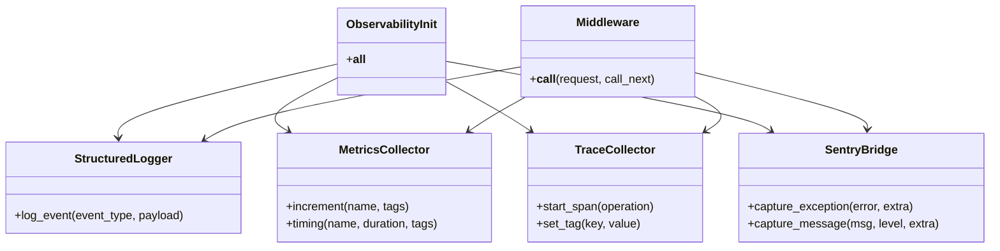
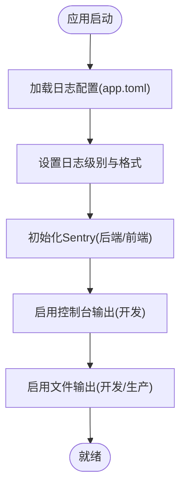
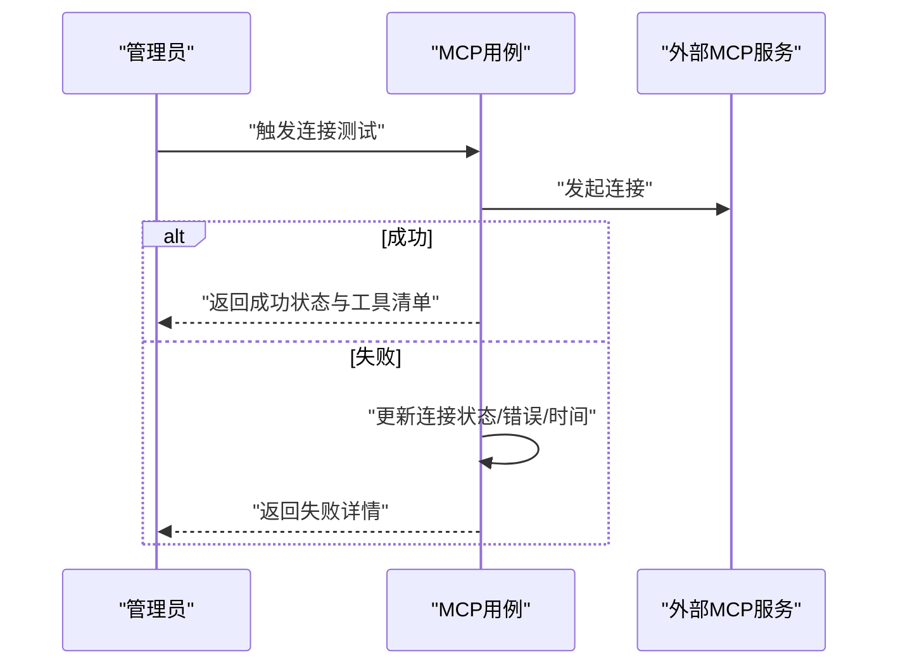
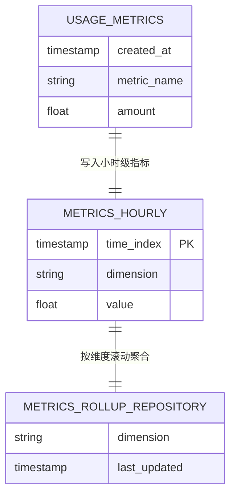
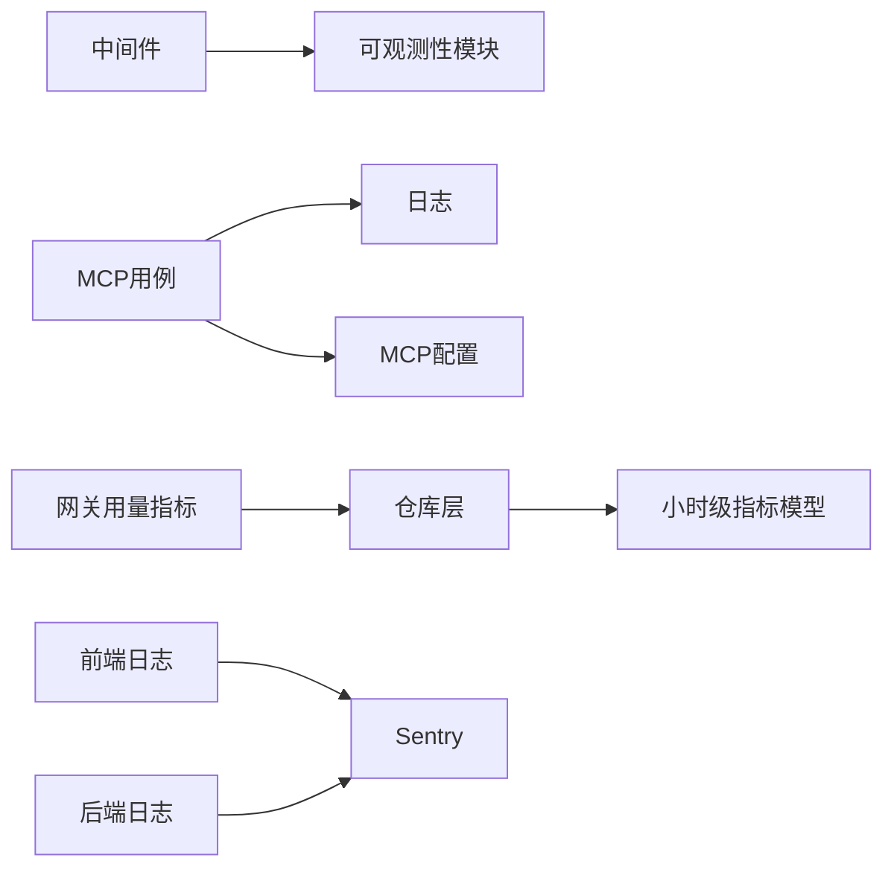

# 监控与调试

<cite>
**本文引用的文件**
- [libs/observability/__init__.py](file://backend/libs/observability/__init__.py)
- [libs/observability/logging.py](file://backend/libs/observability/logging.py)
- [libs/observability/metrics.py](file://backend/libs/observability/metrics.py)
- [libs/observability/tracing.py](file://backend/libs/observability/tracing.py)
- [libs/observability/sentry.py](file://backend/libs/observability/sentry.py)
- [libs/middleware/observability.py](file://backend/libs/middleware/observability.py)
- [utils/logging.py](file://backend/utils/logging.py)
- [docs/logging.md](file://docs/logging.md)
- [domains/agent/application/mcp_use_case.py](file://backend/domains/agent/application/mcp_use_case.py)
- [docs/mcp/MCP_STATUS_SYSTEM.md](file://backend/docs/mcp/MCP_STATUS_SYSTEM.md)
- [frontend/src/lib/logger.ts](file://frontend/src/lib/logger.ts)
- [backend/config/mcp.toml](file://backend/config/mcp.toml)
- [domains/gateway/application/management/usage_metrics.py](file://backend/domains/gateway/application/management/usage_metrics.py)
- [domains/gateway/infrastructure/repositories/metrics_rollup_repository.py](file://backend/domains/gateway/infrastructure/repositories/metrics_rollup_repository.py)
- [domains/gateway/infrastructure/models/metrics_hourly.py](file://backend/domains/gateway/infrastructure/models/metrics_hourly.py)
- [tests/unit/gateway/test_metrics_rollup_repository.py](file://backend/tests/unit/gateway/test_metrics_rollup_repository.py)
- [tests/unit/gateway/test_usage_metrics_merge.py](file://backend/tests/unit/gateway/test_usage_metrics_merge.py)
</cite>

## 目录
1. [引言](#引言)
2. [项目结构](#项目结构)
3. [核心组件](#核心组件)
4. [架构总览](#架构总览)
5. [详细组件分析](#详细组件分析)
6. [依赖关系分析](#依赖关系分析)
7. [性能考虑](#性能考虑)
8. [故障排查指南](#故障排查指南)
9. [结论](#结论)
10. [附录](#附录)

## 引言
本文件面向MCP工具系统的监控与调试场景，系统性阐述监控指标设计与采集机制、调试工具与方法、工具状态可视化展示、调试接口与使用方式、性能优化监控与分析方法，以及常见问题的诊断与解决流程。内容基于后端可观测性模块、前端日志工具、MCP状态系统文档与网关用量指标实现进行整理与扩展，帮助开发者与运维人员快速定位问题、优化性能并稳定交付。

## 项目结构
围绕监控与调试的关键代码分布在以下区域：
- 后端可观测性模块：统一的日志、指标、追踪与Sentry集成入口
- 中间件：在请求生命周期内注入可观测性能力
- 工具层日志：通用日志工具函数
- 文档：日志规范与Sentry配置说明
- MCP状态系统：工具服务器连接状态与可用工具列表
- 网关用量指标：历史趋势与聚合统计
- 前端日志工具：浏览器侧日志与Sentry集成

**图表来源**
- [libs/observability/__init__.py:1-15](file://backend/libs/observability/__init__.py#L1-L15)
- [libs/observability/logging.py](file://backend/libs/observability/logging.py)
- [libs/observability/metrics.py](file://backend/libs/observability/metrics.py)
- [libs/observability/tracing.py](file://backend/libs/observability/tracing.py)
- [libs/observability/sentry.py](file://backend/libs/observability/sentry.py)
- [libs/middleware/observability.py](file://backend/libs/middleware/observability.py)
- [utils/logging.py](file://backend/utils/logging.py)
- [docs/logging.md:76-219](file://docs/logging.md#L76-L219)
- [domains/agent/application/mcp_use_case.py:300-337](file://backend/domains/agent/application/mcp_use_case.py#L300-L337)
- [docs/mcp/MCP_STATUS_SYSTEM.md:125-196](file://backend/docs/mcp/MCP_STATUS_SYSTEM.md#L125-L196)
- [domains/gateway/application/management/usage_metrics.py](file://backend/domains/gateway/application/management/usage_metrics.py)
- [domains/gateway/infrastructure/repositories/metrics_rollup_repository.py](file://backend/domains/gateway/infrastructure/repositories/metrics_rollup_repository.py)
- [domains/gateway/infrastructure/models/metrics_hourly.py](file://backend/domains/gateway/infrastructure/models/metrics_hourly.py)
- [frontend/src/lib/logger.ts:1-176](file://frontend/src/lib/logger.ts#L1-L176)

**章节来源**
- [libs/observability/__init__.py:1-15](file://backend/libs/observability/__init__.py#L1-L15)
- [docs/logging.md:76-219](file://docs/logging.md#L76-L219)

## 核心组件
- 统一可观测性入口：导出日志、指标、追踪与Sentry组件，便于集中引入与替换
- 结构化日志：提供结构化事件记录能力，支持JSON格式与上下文元数据
- 指标采集：提供计数、计时与标签维度的指标记录接口
- 追踪系统：贯穿请求链路的分布式追踪能力
- Sentry集成：前后端错误上报与上下文增强
- 中间件：在请求进入/退出时自动注入追踪、日志与指标
- 工具层日志：提供便捷的日志获取与上下文设置函数
- MCP状态系统：记录服务器连接状态、最后连接时间、错误信息与可用工具清单
- 网关用量指标：小时级指标模型与滚动聚合仓库，支撑趋势分析与告警

**章节来源**
- [libs/observability/__init__.py:1-15](file://backend/libs/observability/__init__.py#L1-L15)
- [libs/observability/logging.py](file://backend/libs/observability/logging.py)
- [libs/observability/metrics.py](file://backend/libs/observability/metrics.py)
- [libs/observability/tracing.py](file://backend/libs/observability/tracing.py)
- [libs/observability/sentry.py](file://backend/libs/observability/sentry.py)
- [libs/middleware/observability.py](file://backend/libs/middleware/observability.py)
- [utils/logging.py](file://backend/utils/logging.py)
- [domains/agent/application/mcp_use_case.py:300-337](file://backend/domains/agent/application/mcp_use_case.py#L300-L337)
- [domains/gateway/application/management/usage_metrics.py](file://backend/domains/gateway/application/management/usage_metrics.py)
- [domains/gateway/infrastructure/repositories/metrics_rollup_repository.py](file://backend/domains/gateway/infrastructure/repositories/metrics_rollup_repository.py)
- [domains/gateway/infrastructure/models/metrics_hourly.py](file://backend/domains/gateway/infrastructure/models/metrics_hourly.py)

## 架构总览
下图展示了从请求进入系统到可观测性数据产出的整体流程，涵盖中间件注入、日志/指标/追踪采集、Sentry上报以及MCP状态更新与网关用量指标滚动聚合。

**图表来源**
- [libs/middleware/observability.py](file://backend/libs/middleware/observability.py)
- [libs/observability/logging.py](file://backend/libs/observability/logging.py)
- [libs/observability/metrics.py](file://backend/libs/observability/metrics.py)
- [libs/observability/tracing.py](file://backend/libs/observability/tracing.py)
- [libs/observability/sentry.py](file://backend/libs/observability/sentry.py)
- [domains/agent/application/mcp_use_case.py:300-337](file://backend/domains/agent/application/mcp_use_case.py#L300-L337)
- [domains/gateway/application/management/usage_metrics.py](file://backend/domains/gateway/application/management/usage_metrics.py)

## 详细组件分析

### 观测性模块与中间件
- 统一入口导出：通过__all__暴露MetricsCollector、StructuredLogger、TraceCollector，便于按需导入与替换
- 中间件职责：在请求生命周期内初始化追踪、记录请求上下文、捕获异常并上报Sentry
- 工具层日志：提供便捷的日志获取与上下文设置函数，配合结构化日志记录关键事件

**图表来源**
- [libs/observability/__init__.py:1-15](file://backend/libs/observability/__init__.py#L1-L15)
- [libs/observability/logging.py](file://backend/libs/observability/logging.py)
- [libs/observability/metrics.py](file://backend/libs/observability/metrics.py)
- [libs/observability/tracing.py](file://backend/libs/observability/tracing.py)
- [libs/observability/sentry.py](file://backend/libs/observability/sentry.py)
- [libs/middleware/observability.py](file://backend/libs/middleware/observability.py)

**章节来源**
- [libs/observability/__init__.py:1-15](file://backend/libs/observability/__init__.py#L1-L15)
- [libs/middleware/observability.py](file://backend/libs/middleware/observability.py)
- [utils/logging.py](file://backend/utils/logging.py)

### 日志与Sentry集成
- 后端日志配置：支持JSON格式、文件轮转、级别控制；开发/生产环境差异化输出
- 前端日志工具：提供结构化日志、Sentry集成、按环境过滤级别
- Sentry配置：后端与前端分别通过环境变量接入，错误自动上报并携带上下文

**图表来源**
- [docs/logging.md:76-219](file://docs/logging.md#L76-L219)
- [frontend/src/lib/logger.ts:1-176](file://frontend/src/lib/logger.ts#L1-L176)

**章节来源**
- [docs/logging.md:76-219](file://docs/logging.md#L76-L219)
- [frontend/src/lib/logger.ts:1-176](file://frontend/src/lib/logger.ts#L1-L176)

### MCP工具状态与可视化
- 状态字段：连接状态、最后连接时间、最后错误、可用工具数量与示例
- 前端类型定义：MCPStatus、颜色映射与状态文本，用于UI渲染
- 用例逻辑：连接测试失败时更新状态与错误信息，并返回标准化结果

**图表来源**
- [domains/agent/application/mcp_use_case.py:300-337](file://backend/domains/agent/application/mcp_use_case.py#L300-L337)
- [docs/mcp/MCP_STATUS_SYSTEM.md:125-196](file://backend/docs/mcp/MCP_STATUS_SYSTEM.md#L125-L196)

**章节来源**
- [domains/agent/application/mcp_use_case.py:300-337](file://backend/domains/agent/application/mcp_use_case.py#L300-L337)
- [docs/mcp/MCP_STATUS_SYSTEM.md:125-196](file://backend/docs/mcp/MCP_STATUS_SYSTEM.md#L125-L196)

### 网关用量指标与历史趋势
- 模型层：小时级指标表，包含时间戳、维度与度量
- 仓库层：滚动聚合逻辑，负责合并与去重
- 应用层：用量指标管理，负责写入与合并流程
- 测试：针对仓库与合并逻辑的单元测试

**图表来源**
- [domains/gateway/infrastructure/models/metrics_hourly.py](file://backend/domains/gateway/infrastructure/models/metrics_hourly.py)
- [domains/gateway/infrastructure/repositories/metrics_rollup_repository.py](file://backend/domains/gateway/infrastructure/repositories/metrics_rollup_repository.py)
- [domains/gateway/application/management/usage_metrics.py](file://backend/domains/gateway/application/management/usage_metrics.py)

**章节来源**
- [domains/gateway/infrastructure/models/metrics_hourly.py](file://backend/domains/gateway/infrastructure/models/metrics_hourly.py)
- [domains/gateway/infrastructure/repositories/metrics_rollup_repository.py](file://backend/domains/gateway/infrastructure/repositories/metrics_rollup_repository.py)
- [domains/gateway/application/management/usage_metrics.py](file://backend/domains/gateway/application/management/usage_metrics.py)
- [tests/unit/gateway/test_metrics_rollup_repository.py](file://backend/tests/unit/gateway/test_metrics_rollup_repository.py)
- [tests/unit/gateway/test_usage_metrics_merge.py](file://backend/tests/unit/gateway/test_usage_metrics_merge.py)

## 依赖关系分析
- 组件耦合：中间件依赖可观测性模块；业务用例依赖MCP状态与日志；网关用量指标形成独立的数据流
- 外部依赖：Sentry SDK（后端/前端），日志配置（app.toml），MCP配置（mcp.toml）
- 潜在环路：当前结构以中间件与用例为中心向外辐射，未见明显循环依赖

**图表来源**
- [libs/middleware/observability.py](file://backend/libs/middleware/observability.py)
- [libs/observability/logging.py](file://backend/libs/observability/logging.py)
- [domains/agent/application/mcp_use_case.py:300-337](file://backend/domains/agent/application/mcp_use_case.py#L300-L337)
- [backend/config/mcp.toml](file://backend/config/mcp.toml)
- [domains/gateway/application/management/usage_metrics.py](file://backend/domains/gateway/application/management/usage_metrics.py)
- [domains/gateway/infrastructure/repositories/metrics_rollup_repository.py](file://backend/domains/gateway/infrastructure/repositories/metrics_rollup_repository.py)
- [domains/gateway/infrastructure/models/metrics_hourly.py](file://backend/domains/gateway/infrastructure/models/metrics_hourly.py)
- [frontend/src/lib/logger.ts:1-176](file://frontend/src/lib/logger.ts#L1-L176)
- [docs/logging.md:76-219](file://docs/logging.md#L76-L219)

**章节来源**
- [libs/middleware/observability.py](file://backend/libs/middleware/observability.py)
- [libs/observability/logging.py](file://backend/libs/observability/logging.py)
- [domains/agent/application/mcp_use_case.py:300-337](file://backend/domains/agent/application/mcp_use_case.py#L300-L337)
- [backend/config/mcp.toml](file://backend/config/mcp.toml)
- [domains/gateway/application/management/usage_metrics.py](file://backend/domains/gateway/application/management/usage_metrics.py)
- [domains/gateway/infrastructure/repositories/metrics_rollup_repository.py](file://backend/domains/gateway/infrastructure/repositories/metrics_rollup_repository.py)
- [domains/gateway/infrastructure/models/metrics_hourly.py](file://backend/domains/gateway/infrastructure/models/metrics_hourly.py)
- [frontend/src/lib/logger.ts:1-176](file://frontend/src/lib/logger.ts#L1-L176)
- [docs/logging.md:76-219](file://docs/logging.md#L76-L219)

## 性能考虑
- 指标采样与批量上报：对高频指标采用批量缓冲与采样策略，降低I/O开销
- 追踪跨度控制：限制单次请求跨度数量与层级深度，避免追踪膨胀
- 日志级别与格式：生产环境使用JSON格式便于日志系统解析，避免过量DEBUG日志
- 网关指标滚动：按小时聚合减少存储压力，同时保留足够的历史窗口用于趋势分析
- 资源利用率：结合容器/平台监控（CPU、内存、网络）与指标数据交叉验证瓶颈

[本节为通用指导，无需具体文件分析]

## 故障排查指南
- 启用调试模式与详细日志
  - 后端：调整日志级别与格式，确保关键路径有结构化事件记录
  - 前端：在开发环境开启DEBUG级别日志，必要时临时提升级别
- 连接测试失败
  - 查看MCP用例返回的错误详情与最后连接时间，确认网络连通性与凭据有效性
  - 对比MCP配置文件中的服务器地址与访问范围
- 指标缺失或异常
  - 检查小时级指标表是否正常写入，核对仓库层滚动聚合逻辑
  - 关注测试用例中关于合并与去重的断言，确保边界条件被覆盖
- Sentry错误上报
  - 核对后端/前端DSN配置，确认上下文附加是否正确
  - 在本地复现错误并观察Sentry事件详情

**章节来源**
- [docs/logging.md:76-219](file://docs/logging.md#L76-L219)
- [domains/agent/application/mcp_use_case.py:300-337](file://backend/domains/agent/application/mcp_use_case.py#L300-L337)
- [domains/gateway/application/management/usage_metrics.py](file://backend/domains/gateway/application/management/usage_metrics.py)
- [domains/gateway/infrastructure/repositories/metrics_rollup_repository.py](file://backend/domains/gateway/infrastructure/repositories/metrics_rollup_repository.py)
- [tests/unit/gateway/test_metrics_rollup_repository.py](file://backend/tests/unit/gateway/test_metrics_rollup_repository.py)
- [tests/unit/gateway/test_usage_metrics_merge.py](file://backend/tests/unit/gateway/test_usage_metrics_merge.py)

## 结论
通过统一的可观测性入口、完善的日志与Sentry集成、MCP状态可视化以及网关用量指标体系，系统能够有效支撑工具执行过程的监控与调试。建议在生产环境中持续关注指标健康度、错误率与延迟分布，并结合Sentry事件与日志回溯进行根因分析，逐步完善告警阈值与自动化排障流程。

[本节为总结，无需具体文件分析]

## 附录

### 监控指标设计与采集要点
- 工具执行时间：使用计时指标记录请求耗时，按工具名与状态分组
- 资源消耗：结合平台指标（CPU/内存/IO）与业务指标（并发、队列长度）综合评估
- 错误率：按工具与HTTP状态码统计错误次数，计算错误率并设置阈值告警
- 指标标签：统一维度（如工具名、环境、版本），便于跨维度对比与聚合

[本节为概念性说明，无需具体文件分析]

### 调试接口与使用方法
- 调试模式：通过环境变量或配置文件切换日志级别与追踪开关
- 详细日志输出：在关键路径插入结构化事件，记录输入、输出与中间态
- 状态查询接口：提供MCP服务器状态与可用工具列表的查询端点，便于前端面板展示

[本节为概念性说明，无需具体文件分析]

### 性能优化监控与分析
- 瓶颈识别：结合指标趋势与追踪跨度，定位慢调用与阻塞点
- 资源利用率：对比CPU/内存与业务指标，识别资源与负载不匹配场景
- 优化建议：根据热点路径与缓存命中率调整策略，必要时引入异步处理或限流

[本节为通用指导，无需具体文件分析]

### 监控仪表板配置与自定义
- 数据源：对接Sentry事件、日志系统与数据库中的小时级指标
- 图表维度：按时间、工具、状态、环境等维度组合，支持实时与历史视图
- 告警规则：基于错误率、延迟、资源利用率设定阈值与抑制策略

[本节为通用指导，无需具体文件分析]