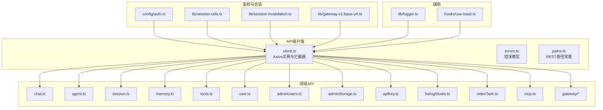
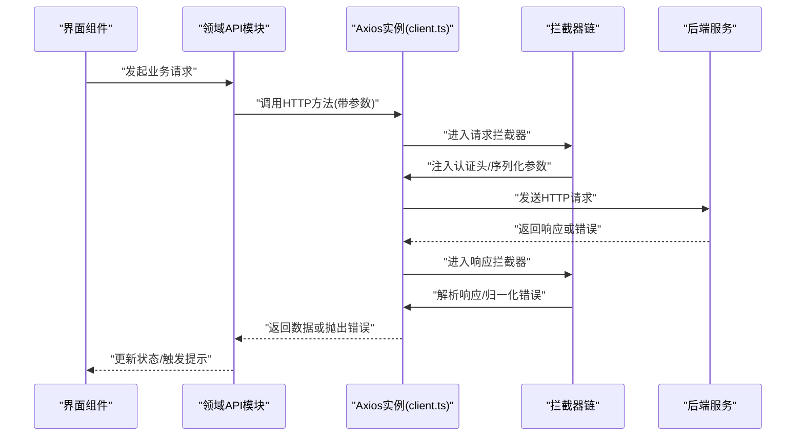
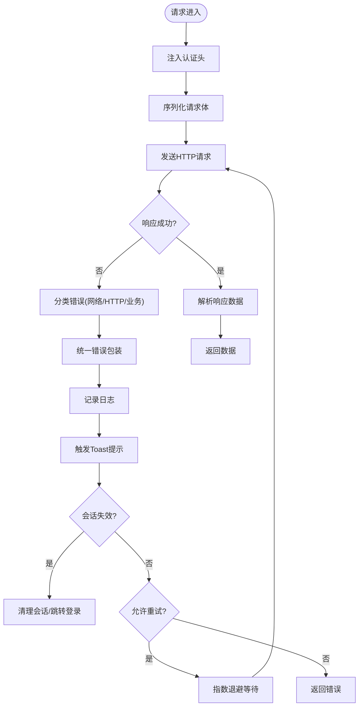
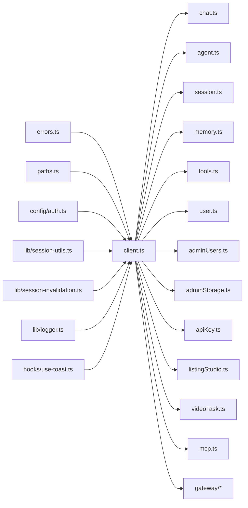

# API客户端系统

<cite>
**本文引用的文件**
- [client.ts](file://frontend/src/api/client.ts)
- [errors.ts](file://frontend/src/api/errors.ts)
- [paths.ts](file://frontend/src/api/paths.ts)
- [auth.ts](file://frontend/src/config/auth.ts)
- [session-utils.ts](file://frontend/src/lib/session-utils.ts)
- [session-invalidation.ts](file://frontend/src/lib/session-invalidation.ts)
- [gateway-v1-base-url.ts](file://frontend/src/lib/gateway-v1-base-url.ts)
- [logger.ts](file://frontend/src/lib/logger.ts)
- [use-toast.ts](file://frontend/src/hooks/use-toast.ts)
- [chat.ts](file://frontend/src/api/chat.ts)
- [agent.ts](file://frontend/src/api/agent.ts)
- [session.ts](file://frontend/src/api/session.ts)
- [memory.ts](file://frontend/src/api/memory.ts)
- [tools.ts](file://frontend/src/api/tools.ts)
- [user.ts](file://frontend/src/api/user.ts)
- [adminUsers.ts](file://frontend/src/api/adminUsers.ts)
- [adminStorage.ts](file://frontend/src/api/adminStorage.ts)
- [apiKey.ts](file://frontend/src/api/api-key.ts)
- [listingStudio.ts](file://frontend/src/api/listingStudio.ts)
- [videoTask.ts](file://frontend/src/api/videoTask.ts)
- [mcp.ts](file://frontend/src/api/mcp.ts)
- [gateway.ts](file://frontend/src/api/gateway/)
- [paths.test.ts](file://frontend/src/api/paths.test.ts)
- [client.test.ts](file://frontend/src/api/client.test.ts)
- [gateway.test.ts](file://frontend/src/api/gateway.test.ts)
</cite>

## 目录
1. [简介](#简介)
2. [项目结构](#项目结构)
3. [核心组件](#核心组件)
4. [架构总览](#架构总览)
5. [详细组件分析](#详细组件分析)
6. [依赖关系分析](#依赖关系分析)
7. [性能考虑](#性能考虑)
8. [故障排除指南](#故障排除指南)
9. [结论](#结论)
10. [附录](#附录)

## 简介
本文件为前端API客户端系统的全面技术文档，聚焦于HTTP客户端封装设计（基于Axios）、请求与响应拦截器、错误处理机制、API请求标准化流程、类型安全设计、鉴权与会话管理、以及与后端REST API的对接方式。文档同时提供最佳实践建议，涵盖并发请求、请求取消、重试策略等，并给出常见问题的排查方法。

## 项目结构
前端API客户端位于 `frontend/src/api` 目录下，采用按功能域分层组织：基础HTTP客户端、路径常量、错误模型、各领域API模块（如聊天、会话、记忆、工具、用户、管理员、API密钥、视频任务、MCP、网关等）。鉴权与会话管理位于 `frontend/src/config` 和 `frontend/src/lib` 目录中。

**图表来源**
- [client.ts](file://frontend/src/api/client.ts)
- [errors.ts](file://frontend/src/api/errors.ts)
- [paths.ts](file://frontend/src/api/paths.ts)
- [auth.ts](file://frontend/src/config/auth.ts)
- [session-utils.ts](file://frontend/src/lib/session-utils.ts)
- [session-invalidation.ts](file://frontend/src/lib/session-invalidation.ts)
- [gateway-v1-base-url.ts](file://frontend/src/lib/gateway-v1-base-url.ts)
- [logger.ts](file://frontend/src/lib/logger.ts)
- [use-toast.ts](file://frontend/src/hooks/use-toast.ts)
- [chat.ts](file://frontend/src/api/chat.ts)
- [agent.ts](file://frontend/src/api/agent.ts)
- [session.ts](file://frontend/src/api/session.ts)
- [memory.ts](file://frontend/src/api/memory.ts)
- [tools.ts](file://frontend/src/api/tools.ts)
- [user.ts](file://frontend/src/api/user.ts)
- [adminUsers.ts](file://frontend/src/api/adminUsers.ts)
- [adminStorage.ts](file://frontend/src/api/adminStorage.ts)
- [apiKey.ts](file://frontend/src/api/api-key.ts)
- [listingStudio.ts](file://frontend/src/api/listingStudio.ts)
- [videoTask.ts](file://frontend/src/api/videoTask.ts)
- [mcp.ts](file://frontend/src/api/mcp.ts)
- [gateway.ts](file://frontend/src/api/gateway/)

**章节来源**
- [client.ts](file://frontend/src/api/client.ts)
- [paths.ts](file://frontend/src/api/paths.ts)
- [auth.ts](file://frontend/src/config/auth.ts)
- [session-utils.ts](file://frontend/src/lib/session-utils.ts)
- [session-invalidation.ts](file://frontend/src/lib/session-invalidation.ts)
- [gateway-v1-base-url.ts](file://frontend/src/lib/gateway-v1-base-url.ts)
- [logger.ts](file://frontend/src/lib/logger.ts)
- [use-toast.ts](file://frontend/src/hooks/use-toast.ts)

## 核心组件
- Axios实例与拦截器：统一配置基础URL、超时、认证头注入、请求/响应拦截器、错误处理与重试策略。
- 错误模型：定义网络错误、HTTP状态错误、业务错误的分类与包装，便于UI展示与日志记录。
- 路径常量：集中管理REST API路径，避免硬编码，提升可维护性。
- 鉴权与会话：令牌获取、刷新、失效检测与清理，确保会话持久化与安全性。
- 领域API模块：按功能域拆分，每个模块负责特定资源的CRUD与业务操作。
- 辅助能力：日志记录、Toast提示、网关基础URL解析等。

**章节来源**
- [client.ts](file://frontend/src/api/client.ts)
- [errors.ts](file://frontend/src/api/errors.ts)
- [paths.ts](file://frontend/src/api/paths.ts)
- [auth.ts](file://frontend/src/config/auth.ts)
- [session-utils.ts](file://frontend/src/lib/session-utils.ts)
- [session-invalidation.ts](file://frontend/src/lib/session-invalidation.ts)
- [gateway-v1-base-url.ts](file://frontend/src/lib/gateway-v1-base-url.ts)
- [logger.ts](file://frontend/src/lib/logger.ts)
- [use-toast.ts](file://frontend/src/hooks/use-toast.ts)

## 架构总览
API客户端采用“中心化Axios实例 + 分层领域模块”的架构。所有HTTP请求通过统一的Axios实例发出，借助拦截器完成认证头注入、错误归一化、日志记录与重试控制；领域模块仅关注业务语义与数据转换。

**图表来源**
- [client.ts](file://frontend/src/api/client.ts)
- [chat.ts](file://frontend/src/api/chat.ts)
- [session.ts](file://frontend/src/api/session.ts)
- [user.ts](file://frontend/src/api/user.ts)

## 详细组件分析

### Axios实例与拦截器（client.ts）
- 基础配置：基础URL、超时、默认请求头。
- 请求拦截器：从鉴权配置与会话工具中读取令牌，注入Authorization头；对请求体进行序列化（如FormData、JSON）；支持请求取消标记。
- 响应拦截器：解析响应数据；根据HTTP状态码与业务字段区分错误类型；统一错误包装；记录日志；触发Toast提示；处理会话失效并执行清理。
- 重试策略：对幂等GET/HEAD请求在特定网络错误或5xx状态下进行有限次数重试，指数退避。
- 取消与并发：结合AbortController实现请求取消；限制并发请求数量以避免风暴效应。

**图表来源**
- [client.ts](file://frontend/src/api/client.ts)
- [errors.ts](file://frontend/src/api/errors.ts)
- [logger.ts](file://frontend/src/lib/logger.ts)
- [use-toast.ts](file://frontend/src/hooks/use-toast.ts)
- [session-invalidation.ts](file://frontend/src/lib/session-invalidation.ts)

**章节来源**
- [client.ts](file://frontend/src/api/client.ts)

### 错误处理机制（errors.ts）
- 错误分类：网络错误（连接失败、超时、DNS错误）、HTTP状态错误（4xx/5xx）、业务逻辑错误（后端返回的业务错误字段）。
- 统一包装：将不同来源的错误统一为可读的错误对象，包含错误码、消息、是否可重试、是否需要刷新令牌等元信息。
- UI友好提示：错误对象携带用户可见的消息，便于Toast或对话框展示。
- 日志记录：错误对象包含上下文信息，便于后端定位问题。

**章节来源**
- [errors.ts](file://frontend/src/api/errors.ts)

### API请求标准化流程
- 认证头添加：从鉴权配置读取当前令牌，注入到Authorization头；支持Bearer与自定义前缀。
- 请求参数序列化：根据Content-Type自动序列化JSON或FormData；对数组/对象进行扁平化或嵌套处理；对空值进行过滤。
- 响应数据解析：统一解析JSON响应；对分页、列表、单对象等结构进行规范化；对二进制流进行适配。
- 路径与查询参数：使用路径常量与查询参数构造器，避免硬编码与拼接错误。

**章节来源**
- [paths.ts](file://frontend/src/api/paths.ts)
- [client.ts](file://frontend/src/api/client.ts)

### 类型安全设计
- 请求参数类型：每个领域API模块的输入参数均定义明确的TypeScript接口，确保编译期校验。
- 响应数据接口：对后端返回的实体进行接口约束，包括可选字段、联合类型、分页结构等。
- 工具函数类型：序列化、路径构造、错误包装等工具函数具备明确的输入输出类型签名。
- 测试驱动：配套单元测试验证类型正确性与边界行为。

**章节来源**
- [chat.ts](file://frontend/src/api/chat.ts)
- [session.ts](file://frontend/src/api/session.ts)
- [user.ts](file://frontend/src/api/user.ts)
- [paths.test.ts](file://frontend/src/api/paths.test.ts)
- [client.test.ts](file://frontend/src/api/client.test.ts)

### 鉴权令牌管理与会话持久化
- 令牌获取与刷新：从鉴权配置读取当前令牌；在401未授权时触发刷新流程；刷新成功后重试原请求。
- 会话失效检测：响应拦截器识别401/403并触发会话失效处理；清理本地存储、路由跳转至登录页。
- 会话持久化：将令牌与用户信息持久化到安全存储；应用启动时恢复会话状态。
- 安全策略：避免在内存中长期持有敏感令牌；使用HttpOnly Cookie（后端侧）或安全存储（前端侧）策略。

**章节来源**
- [auth.ts](file://frontend/src/config/auth.ts)
- [session-utils.ts](file://frontend/src/lib/session-utils.ts)
- [session-invalidation.ts](file://frontend/src/lib/session-invalidation.ts)

### 与后端API的对接方式
- RESTful规范：严格遵循REST风格，使用标准HTTP方法与状态码；路径与资源命名一致；使用标准Content-Type与Accept头。
- 网关基础URL：动态解析网关v1基础URL，支持多租户与多环境切换。
- WebSocket：对于实时通信场景，采用独立的WebSocket连接管理器，遵循后端协议规范。

**章节来源**
- [gateway-v1-base-url.ts](file://frontend/src/lib/gateway-v1-base-url.ts)
- [gateway.ts](file://frontend/src/api/gateway/)

### 领域API模块概览
- 聊天（chat.ts）：消息发送、历史拉取、流式响应处理。
- 代理（agent.ts）：代理配置、工具绑定、执行计划。
- 会话（session.ts）：会话创建、状态管理、上下文同步。
- 记忆（memory.ts）：记忆检索、索引构建、访问统计。
- 工具（tools.ts）：工具注册、调用、结果解析。
- 用户（user.ts）：用户信息、头像上传、偏好设置。
- 管理员（adminUsers.ts、adminStorage.ts）：用户管理、存储配额。
- API密钥（apiKey.ts）：密钥生成、轮换、撤销。
- 列表工作室（listingStudio.ts）：内容列表、筛选、排序。
- 视频任务（videoTask.ts）：任务提交、进度查询、结果下载。
- MCP（mcp.ts）：MCP服务器管理、动态工具与提示。

**章节来源**
- [chat.ts](file://frontend/src/api/chat.ts)
- [agent.ts](file://frontend/src/api/agent.ts)
- [session.ts](file://frontend/src/api/session.ts)
- [memory.ts](file://frontend/src/api/memory.ts)
- [tools.ts](file://frontend/src/api/tools.ts)
- [user.ts](file://frontend/src/api/user.ts)
- [adminUsers.ts](file://frontend/src/api/adminUsers.ts)
- [adminStorage.ts](file://frontend/src/api/adminStorage.ts)
- [apiKey.ts](file://frontend/src/api/api-key.ts)
- [listingStudio.ts](file://frontend/src/api/listingStudio.ts)
- [videoTask.ts](file://frontend/src/api/videoTask.ts)
- [mcp.ts](file://frontend/src/api/mcp.ts)

## 依赖关系分析
- client.ts 是所有领域API模块的唯一HTTP入口，耦合度低、内聚性强。
- errors.ts 作为错误模型中心，被拦截器与各领域模块共同依赖。
- paths.ts 提供统一的路径与查询参数构造，减少重复逻辑。
- 鉴权与会话模块为client.ts提供令牌与失效处理能力。
- 辅助模块（logger、use-toast）为拦截器提供日志与提示能力。

**图表来源**
- [client.ts](file://frontend/src/api/client.ts)
- [errors.ts](file://frontend/src/api/errors.ts)
- [paths.ts](file://frontend/src/api/paths.ts)
- [auth.ts](file://frontend/src/config/auth.ts)
- [session-utils.ts](file://frontend/src/lib/session-utils.ts)
- [session-invalidation.ts](file://frontend/src/lib/session-invalidation.ts)
- [logger.ts](file://frontend/src/lib/logger.ts)
- [use-toast.ts](file://frontend/src/hooks/use-toast.ts)
- [chat.ts](file://frontend/src/api/chat.ts)
- [agent.ts](file://frontend/src/api/agent.ts)
- [session.ts](file://frontend/src/api/session.ts)
- [memory.ts](file://frontend/src/api/memory.ts)
- [tools.ts](file://frontend/src/api/tools.ts)
- [user.ts](file://frontend/src/api/user.ts)
- [adminUsers.ts](file://frontend/src/api/adminUsers.ts)
- [adminStorage.ts](file://frontend/src/api/adminStorage.ts)
- [apiKey.ts](file://frontend/src/api/api-key.ts)
- [listingStudio.ts](file://frontend/src/api/listingStudio.ts)
- [videoTask.ts](file://frontend/src/api/videoTask.ts)
- [mcp.ts](file://frontend/src/api/mcp.ts)
- [gateway.ts](file://frontend/src/api/gateway/)

**章节来源**
- [client.ts](file://frontend/src/api/client.ts)
- [errors.ts](file://frontend/src/api/errors.ts)
- [paths.ts](file://frontend/src/api/paths.ts)
- [auth.ts](file://frontend/src/config/auth.ts)
- [session-utils.ts](file://frontend/src/lib/session-utils.ts)
- [session-invalidation.ts](file://frontend/src/lib/session-invalidation.ts)
- [logger.ts](file://frontend/src/lib/logger.ts)
- [use-toast.ts](file://frontend/src/hooks/use-toast.ts)

## 性能考虑
- 并发限制：通过信号量或队列限制同时活跃请求数量，避免资源争用与风暴效应。
- 请求取消：对高频交互（如搜索、滚动加载）及时取消过期请求，减少无效网络开销。
- 缓存策略：对只读数据（如静态配置、字典）启用内存缓存与失效时间控制。
- 重试退避：对瞬时网络错误采用指数退避，降低对后端压力。
- 序列化优化：避免不必要的深拷贝与大对象序列化，优先使用流式处理（如上传、下载）。

## 故障排除指南
- 网络错误：检查基础URL、代理配置、证书与CORS设置；确认拦截器是否正确注入认证头。
- 401/403：确认令牌是否过期或被撤销；检查刷新流程与会话清理逻辑；查看日志与Toast提示。
- 5xx错误：查看后端日志与追踪ID；对幂等请求进行有限重试；记录失败上下文。
- 参数错误：核对请求体类型与必填字段；使用单元测试覆盖边界条件。
- 并发冲突：排查请求取消与竞态条件；确保UI层在组件卸载时取消未完成请求。
- 日志与监控：开启详细日志与错误上报，结合追踪ID快速定位问题。

**章节来源**
- [client.ts](file://frontend/src/api/client.ts)
- [errors.ts](file://frontend/src/api/errors.ts)
- [logger.ts](file://frontend/src/lib/logger.ts)
- [use-toast.ts](file://frontend/src/hooks/use-toast.ts)

## 结论
该API客户端系统通过中心化的Axios实例与完善的拦截器链路，实现了统一的请求标准化、错误分类与会话管理。配合严格的类型安全设计与领域模块化组织，既保证了开发效率，也提升了系统的可维护性与可靠性。建议在生产环境中进一步完善重试策略、并发控制与监控告警体系。

## 附录
- 最佳实践清单
  - 使用幂等方法进行重试；非幂等方法禁用自动重试。
  - 对高频请求启用请求取消与去抖动。
  - 在拦截器中统一处理错误与日志，避免分散逻辑。
  - 为每个领域模块编写单元测试与集成测试。
  - 明确错误边界与用户提示策略，保持一致性。