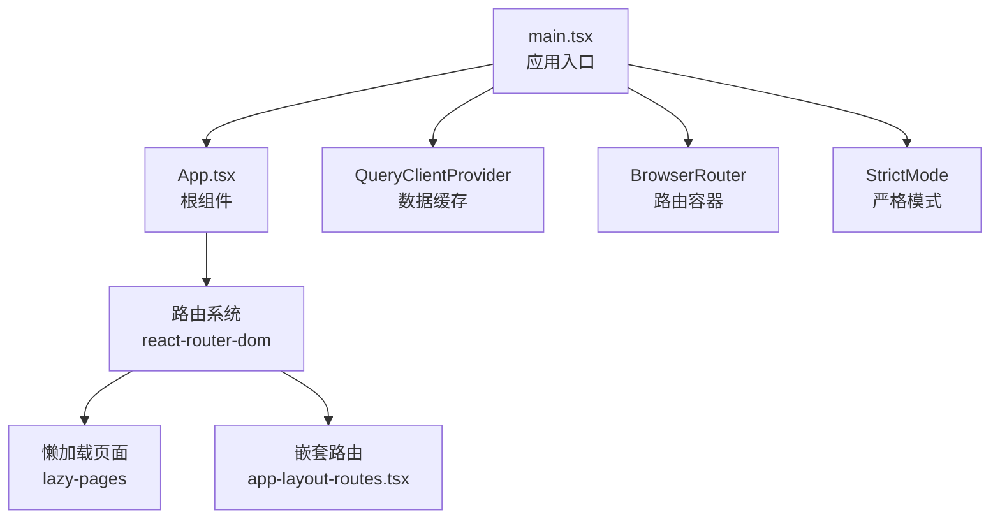
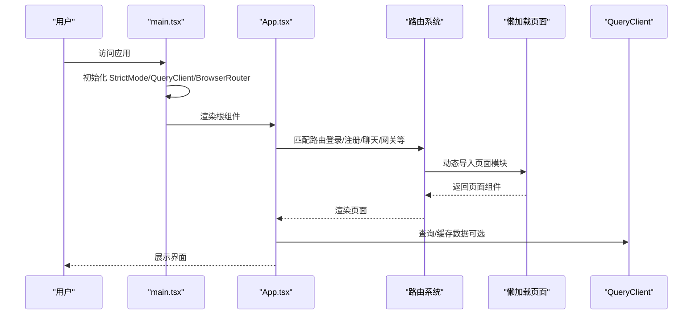
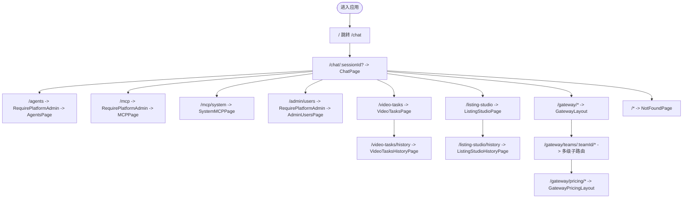
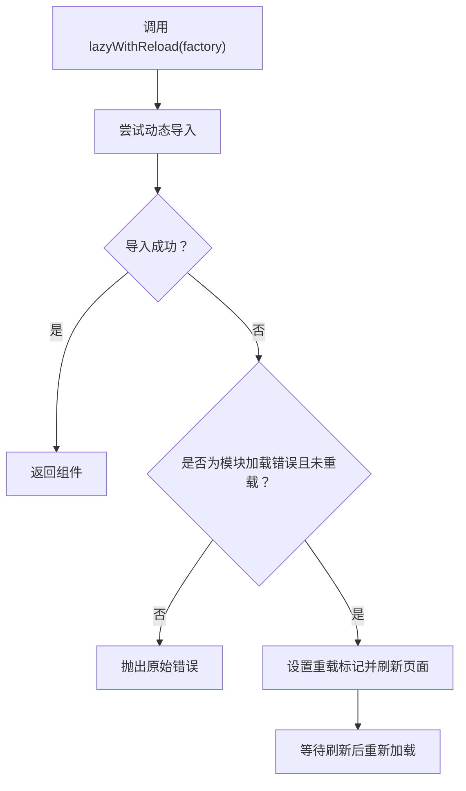
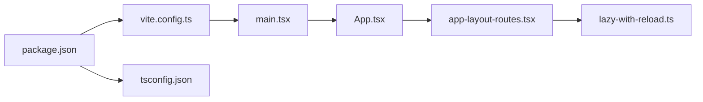

# React应用结构

<cite>
**本文引用的文件**
- [frontend/src/main.tsx](file://frontend/src/main.tsx)
- [frontend/src/App.tsx](file://frontend/src/App.tsx)
- [frontend/vite.config.ts](file://frontend/vite.config.ts)
- [frontend/tsconfig.json](file://frontend/tsconfig.json)
- [frontend/package.json](file://frontend/package.json)
- [frontend/src/routes/app-layout-routes.tsx](file://frontend/src/routes/app-layout-routes.tsx)
- [frontend/src/lib/lazy-with-reload.ts](file://frontend/src/lib/lazy-with-reload.ts)
</cite>

## 目录
1. [引言](#引言)
2. [项目结构](#项目结构)
3. [核心组件](#核心组件)
4. [架构总览](#架构总览)
5. [详细组件分析](#详细组件分析)
6. [依赖关系分析](#依赖关系分析)
7. [性能考虑](#性能考虑)
8. [故障排查指南](#故障排查指南)
9. [结论](#结论)
10. [附录](#附录)

## 引言
本文件面向React 18应用的前端工程，系统化梳理从入口初始化到路由、状态、组件与构建工具的整体架构。文档既为初学者提供入门路径（如React Hooks与组件生命周期的要点），也为有经验的开发者提供架构最佳实践与性能优化建议。内容覆盖以下主题：
- 入口点main.tsx的初始化流程与上下文配置
- 根组件App.tsx的职责划分与渲染结构
- Vite开发服务器、代理与生产构建策略
- TypeScript编译与类型检查策略
- 路由系统（含懒加载、嵌套路由、路由守卫）
- 状态管理（Zustand Store设计与异步更新）
- 组件层次（布局、页面、通用组件）
- 开发工具链与代码分割策略

## 项目结构
前端位于frontend目录，采用Vite+React 18+TypeScript技术栈，配合TailwindCSS与Radix UI生态。核心目录与职责概览：
- src：源码目录
  - api：API客户端与路径定义
  - components：通用UI组件与业务组件
  - features：按功能域划分的特性模块
  - hooks：自定义Hook
  - lib：通用工具库
  - pages：页面级组件（当前主要通过懒加载路由导入）
  - routes：路由配置与懒加载页面集合
  - stores：状态管理（Zustand Store）
  - types：类型声明
- 构建与配置
  - vite.config.ts：Vite配置（开发服务器、代理、别名、构建选项）
  - tsconfig.json：TypeScript编译选项与路径映射
  - package.json：脚本、依赖与开发工具链

图表来源
- [frontend/src/main.tsx:1-48](file://frontend/src/main.tsx#L1-L48)
- [frontend/src/App.tsx:1-42](file://frontend/src/App.tsx#L1-L42)
- [frontend/src/routes/app-layout-routes.tsx:1-141](file://frontend/src/routes/app-layout-routes.tsx#L1-L141)

章节来源
- [frontend/src/main.tsx:1-48](file://frontend/src/main.tsx#L1-L48)
- [frontend/src/App.tsx:1-42](file://frontend/src/App.tsx#L1-L42)
- [frontend/vite.config.ts:1-55](file://frontend/vite.config.ts#L1-L55)
- [frontend/tsconfig.json:1-40](file://frontend/tsconfig.json#L1-L40)
- [frontend/package.json:1-104](file://frontend/package.json#L1-L104)

## 核心组件
- 应用入口（main.tsx）
  - 初始化React.StrictMode、BrowserRouter、QueryClientProvider
  - 配置基础路径（APP_ROOT）、相对路径策略（v7_relativeSplatPath）
  - 清理动态导入重载标记，避免正常导航误刷新
  - 提供全局查询客户端（默认staleTime、retry策略）
- 根组件（App.tsx）
  - 主题提供者、认证提供者、提示工具提供者
  - Suspense统一兜底、Toaster全局通知
  - 定义登录/注册/SSO回调等非布局路由
  - 布局外层容器包裹应用主路由
- 路由系统（app-layout-routes.tsx）
  - 应用内主路由，支持嵌套与子路由
  - 平台管理员守卫（RequirePlatformAdmin）
  - 多级网关子路由（teams、models、pricing等）
  - 产品信息历史路径重定向
- 懒加载与热重载（lazy-with-reload.ts）
  - 动态导入失败时自动刷新一次，解决部署后chunk 404问题
  - 使用sessionStorage标记已触发过重载，避免重复刷新

章节来源
- [frontend/src/main.tsx:1-48](file://frontend/src/main.tsx#L1-L48)
- [frontend/src/App.tsx:1-42](file://frontend/src/App.tsx#L1-L42)
- [frontend/src/routes/app-layout-routes.tsx:1-141](file://frontend/src/routes/app-layout-routes.tsx#L1-L141)
- [frontend/src/lib/lazy-with-reload.ts:1-47](file://frontend/src/lib/lazy-with-reload.ts#L1-L47)

## 架构总览
下图展示从入口到路由、状态与UI的整体交互：

图表来源
- [frontend/src/main.tsx:1-48](file://frontend/src/main.tsx#L1-L48)
- [frontend/src/App.tsx:1-42](file://frontend/src/App.tsx#L1-L42)
- [frontend/src/routes/app-layout-routes.tsx:1-141](file://frontend/src/routes/app-layout-routes.tsx#L1-L141)
- [frontend/src/lib/lazy-with-reload.ts:1-47](file://frontend/src/lib/lazy-with-reload.ts#L1-L47)

## 详细组件分析

### 入口初始化（main.tsx）
- 关键点
  - 创建QueryClient并设置默认staleTime与retry，提升网络异常下的用户体验
  - 使用BrowserRouter配置basename与future.v7_relativeSplatPath，适配多实例部署与splat路径
  - 清理chunk重载标记，避免正常导航触发刷新
  - 严格模式启用，帮助发现副作用与潜在问题
- 设计考量
  - 将路由与查询缓存置于根部，确保全局可用
  - 明确的错误边界与兜底（后续可扩展）

章节来源
- [frontend/src/main.tsx:1-48](file://frontend/src/main.tsx#L1-L48)

### 根组件（App.tsx）
- 结构与职责
  - 主题提供者：统一深色/浅色主题与持久化
  - 认证提供者：集中处理登录态与权限
  - 提示工具提供者：Tooltip延迟配置
  - Suspense统一兜底：路由切换时的加载体验
  - Toaster全局通知：消息提示
  - 路由定义：登录/注册/SSO回调直出；其余路径进入布局容器
- 生命周期与Hooks
  - 作为顶层组件，负责组合Provider与路由容器
  - 通过Suspense与lazy结合，实现首屏与交互体验平衡

章节来源
- [frontend/src/App.tsx:1-42](file://frontend/src/App.tsx#L1-L42)

### 路由系统（app-layout-routes.tsx）
- 路由组织
  - 主路由：聊天、视频任务、Listing Studio、设置、管理员相关
  - 网关子路由：团队维度的多层级路由（概览、统计、密钥、凭据、模型、路由、定价、预算、日志、成员）
  - 守卫：平台管理员权限校验
  - 重定向：产品信息历史路径重定向至新的Listing Studio
- 嵌套路由与Outlet
  - 通过RoutePageOutlet包装，保证页面级布局与面包屑、标题等上下文一致
- 懒加载策略
  - 页面组件通过动态导入实现按需加载，减少首屏体积

图表来源
- [frontend/src/routes/app-layout-routes.tsx:1-141](file://frontend/src/routes/app-layout-routes.tsx#L1-L141)

章节来源
- [frontend/src/routes/app-layout-routes.tsx:1-141](file://frontend/src/routes/app-layout-routes.tsx#L1-L141)

### 懒加载与热重载（lazy-with-reload.ts）
- 功能目标
  - 解决部署后旧chunk 404导致的动态导入失败
  - 自动刷新一次以拉取最新index与assets，再尝试加载
- 实现要点
  - 通过sessionStorage标记已触发过重载，避免重复刷新
  - 对“模块加载失败”类错误进行识别与处理
  - 保持与React.lazy兼容的泛型约束

图表来源
- [frontend/src/lib/lazy-with-reload.ts:1-47](file://frontend/src/lib/lazy-with-reload.ts#L1-L47)

章节来源
- [frontend/src/lib/lazy-with-reload.ts:1-47](file://frontend/src/lib/lazy-with-reload.ts#L1-L47)

### 状态管理模式（Zustand）
- 设计原则
  - Store拆分：按领域（如聊天、用户、网关）拆分独立Store
  - 状态订阅：组件通过selector订阅所需字段，避免全量重渲染
  - 异步更新：在Action中封装API调用与本地状态联动
  - 无样板代码：基于immer或直接返回新对象的不可变更新
- 最佳实践
  - 将副作用（如网络请求）集中在Action中
  - 使用中间件（如persist、devtools）增强开发体验
  - 与React Query协作：Query用于服务端状态，Zustand用于客户端UI状态

（本节为概念性指导，不直接分析具体文件）

## 依赖关系分析
- 运行时依赖
  - React 18、react-router-dom、@tanstack/react-query、zustand
- 开发依赖
  - Vite、TypeScript、ESLint、Prettier、TailwindCSS、Radix UI、Lucide Icons
- 关键耦合点
  - main.tsx与App.tsx：入口与根组件的组合
  - App.tsx与路由系统：路由与布局的衔接
  - 路由系统与懒加载：页面按需加载与chunk管理
  - Vite配置与TypeScript：路径别名、模块解析、构建产物

图表来源
- [frontend/package.json:1-104](file://frontend/package.json#L1-L104)
- [frontend/vite.config.ts:1-55](file://frontend/vite.config.ts#L1-L55)
- [frontend/tsconfig.json:1-40](file://frontend/tsconfig.json#L1-L40)
- [frontend/src/main.tsx:1-48](file://frontend/src/main.tsx#L1-L48)
- [frontend/src/App.tsx:1-42](file://frontend/src/App.tsx#L1-L42)
- [frontend/src/routes/app-layout-routes.tsx:1-141](file://frontend/src/routes/app-layout-routes.tsx#L1-L141)
- [frontend/src/lib/lazy-with-reload.ts:1-47](file://frontend/src/lib/lazy-with-reload.ts#L1-L47)

章节来源
- [frontend/package.json:1-104](file://frontend/package.json#L1-L104)
- [frontend/vite.config.ts:1-55](file://frontend/vite.config.ts#L1-L55)
- [frontend/tsconfig.json:1-40](file://frontend/tsconfig.json#L1-L40)

## 性能考虑
- 代码分割
  - 路由级懒加载：按需加载页面模块，降低首屏体积
  - 图标按需引入：通过ESM图标直连，减少打包体积
- 缓存与重试
  - QueryClient默认staleTime与retry，提升弱网环境稳定性
- 构建优化
  - 生产构建开启source map便于排障
  - 路径别名与bundler解析，提升TypeScript与Vite的开发体验
- 开发体验
  - 代理绕过Cookie膨胀问题，避免431错误
  - 相对路径策略与basename配置，适配多实例部署

章节来源
- [frontend/src/main.tsx:14-21](file://frontend/src/main.tsx#L14-L21)
- [frontend/vite.config.ts:52-53](file://frontend/vite.config.ts#L52-L53)
- [frontend/vite.config.ts:34-51](file://frontend/vite.config.ts#L34-L51)

## 故障排查指南
- 动态导入失败
  - 现象：访问页面报错“模块加载失败”
  - 处理：lazyWithReload会在首次失败时自动刷新一次，若仍失败请检查网络与CDN
- 部署后页面空白或白屏
  - 现象：刷新后出现空白页
  - 处理：确认静态资源路径与basename配置一致；检查代理与跨域设置
- 路由跳转不生效或URL不变
  - 现象：navigate触发但URL未变化
  - 处理：main.tsx中明确禁用v7_startTransition以避免与某些UI事件冲突
- 开发代理Cookie问题
  - 现象：本地开发出现431错误
  - 处理：Vite代理移除Cookie头，改用Authorization/X-Anonymous-User-Id传递身份

章节来源
- [frontend/src/lib/lazy-with-reload.ts:34-46](file://frontend/src/lib/lazy-with-reload.ts#L34-L46)
- [frontend/src/main.tsx:37-42](file://frontend/src/main.tsx#L37-L42)
- [frontend/vite.config.ts:9-24](file://frontend/vite.config.ts#L9-L24)

## 结论
该React 18应用以清晰的入口初始化、稳定的路由体系与合理的懒加载策略为基础，结合Vite与TypeScript形成高效的开发与构建闭环。通过QueryClient与Zustand的分工协作，既能满足服务端状态缓存，也能高效管理客户端UI状态。建议在后续迭代中：
- 完善Zustand Store的拆分与中间件配置
- 扩展路由守卫与权限体系
- 加强性能监控与埋点
- 规范组件命名与文档化

## 附录
- 快速命令
  - 开发：npm run dev
  - 构建：npm run build
  - 预览：npm run preview
  - 类型检查：npm run typecheck
  - 代码格式化：npm run format
  - ESLint：npm run lint
- 路径别名
  - @/*、@/features/*、@/components/*、@/hooks/*、@/lib/*、@/stores/*、@/types/*、@/pages/*、@/api/*

章节来源
- [frontend/package.json:6-24](file://frontend/package.json#L6-L24)
- [frontend/tsconfig.json:23-35](file://frontend/tsconfig.json#L23-L35)