# UI组件系统

<cite>
**本文引用的文件**
- [DESIGN_SYSTEM.md](file://frontend/docs/DESIGN_SYSTEM.md)
- [quota-batch-wizard.tsx](file://frontend/src/features/gateway-budget/quota-batch-wizard.tsx)
- [quota-batch-drawer.tsx](file://frontend/src/features/gateway-budget/quota-batch-drawer.tsx)
- [quota-batch-templates.ts](file://frontend/src/features/gateway-budget/quota-batch-templates.ts)
- [use-quota-center.ts](file://frontend/src/features/gateway-budget/use-quota-center.ts)
- [button.tsx](file://frontend/src/components/ui/button.tsx)
- [input.tsx](file://frontend/src/components/ui/input.tsx)
- [card.tsx](file://frontend/src/components/ui/card.tsx)
- [textarea.tsx](file://frontend/src/components/ui/textarea.tsx)
- [badge.tsx](file://frontend/src/components/ui/badge.tsx)
- [scroll-area.tsx](file://frontend/src/components/ui/scroll-area.tsx)
- [tabs.tsx](file://frontend/src/components/ui/tabs.tsx)
- [dialog.tsx](file://frontend/src/components/ui/dialog.tsx)
- [label.tsx](file://frontend/src/components/ui/label.tsx)
- [toaster.tsx](file://frontend/src/components/ui/toaster.tsx)
- [tooltip.tsx](file://frontend/src/components/ui/tooltip.tsx)
- [theme-provider.tsx](file://frontend/src/components/theme-provider.tsx)
- [App.tsx](file://frontend/src/App.tsx)
- [tailwind.config.js](file://frontend/tailwind.config.js)
- [index.css](file://frontend/src/index.css)
- [pagination-controls.tsx](file://frontend/src/components/pagination-controls.tsx)
- [confirm-alert-dialog.tsx](file://frontend/src/components/confirm-alert-dialog.tsx)
- [chat-input.tsx](file://frontend/src/pages/chat/components/chat-input.tsx)
- [unified-input-area.tsx](file://frontend/src/pages/chat/components/unified-input-area.tsx)
- [input-panel.tsx](file://frontend/src/pages/listing-studio/components/input-panel.tsx)
- [budget-usage-card.tsx](file://frontend/src/features/gateway-budget/budget-usage-card.tsx)
- [quota-card-item.tsx](file://frontend/src/features/gateway-budget/quota-card-item.tsx)
- [gateway-refresh-button.tsx](file://frontend/src/features/gateway-shared/gateway-refresh-button.tsx)
- [vision-input.tsx](file://frontend/src/features/gateway-playground/modes/vision-input.tsx)
- [playground-card.tsx](file://frontend/src/features/gateway-playground/playground-card.tsx)
- [chat-messages.test.tsx](file://frontend/src/pages/chat/components/chat-messages.test.tsx)
- [pagination-controls.test.tsx](file://frontend/src/components/pagination-controls.test.tsx)
- [confirm-alert-dialog.test.tsx](file://frontend/src/components/confirm-alert-dialog.test.tsx)
- [permissions.ts](file://frontend/src/types/permissions.ts)
- [teams.tsx](file://frontend/src/pages/gateway/teams.tsx)
- [gateway-team-display.test.ts](file://frontend/src/features/gateway-teams/gateway-team-display.test.ts)
</cite>

## 更新摘要
**变更内容**
- 新增配额批量设置向导组件（quota-batch-wizard）替代原有抽屉系统
- 新增三步式向导组件架构，包括步骤指示器、可选择列表、模型标签列表等子组件
- 新增完整的表单验证和规则预览功能
- 更新配额模板系统和批量表单处理逻辑
- 新增成员自助模式和编辑模式支持
- **新增团队成员显示格式化增强**：在permissions.ts中增加对邮箱@符号的检查逻辑，改善团队成员显示格式

## 目录
1. [简介](#简介)
2. [项目结构](#项目结构)
3. [核心组件](#核心组件)
4. [架构总览](#架构总览)
5. [详细组件分析](#详细组件分析)
6. [依赖关系分析](#依赖关系分析)
7. [性能考量](#性能考量)
8. [故障排查指南](#故障排查指南)
9. [结论](#结论)
10. [附录](#附录)

## 简介
本文件为UI组件系统的完整组件库文档，面向设计师与开发者，覆盖基础原子组件（按钮、输入框、卡片、对话框等）、布局组件（头部导航、侧边栏、主内容区）的架构与实现；阐述主题系统（深色/浅色切换、颜色变量管理、响应式设计）；详解表单组件（验证、字段映射、错误显示）；说明可访问性（ARIA、键盘导航、屏幕阅读器支持）；并提供使用示例、最佳实践、Tailwind CSS集成与自定义策略、组件测试与Storybook集成建议。

**更新** 本版本重点介绍了全新的配额批量设置向导组件，替代原有的抽屉系统，提供更直观的三步式配置流程。同时，团队成员显示格式化逻辑得到增强，通过@符号检查改善了邮箱显示的准确性和用户体验。

## 项目结构
前端UI组件主要位于 src/components/ui 目录下，采用"按需导入、按功能分层"的组织方式。组件通过统一入口导出，配合Tailwind CSS实现样式定制与主题化。应用入口 App.tsx 中引入 toast 与 tooltip 提供器，确保全局交互体验一致。

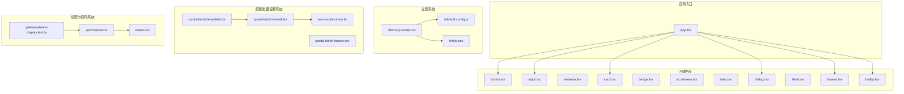

**图表来源**
- [App.tsx:1-20](file://frontend/src/App.tsx#L1-L20)
- [button.tsx:1-60](file://frontend/src/components/ui/button.tsx#L1-L60)
- [input.tsx:1-40](file://frontend/src/components/ui/input.tsx#L1-L40)
- [card.tsx:1-70](file://frontend/src/components/ui/card.tsx#L1-L70)
- [dialog.tsx:1-60](file://frontend/src/components/ui/dialog.tsx#L1-L60)
- [toaster.tsx:1-60](file://frontend/src/components/ui/toaster.tsx#L1-L60)
- [tooltip.tsx:1-60](file://frontend/src/components/ui/tooltip.tsx#L1-L60)
- [theme-provider.tsx:1-60](file://frontend/src/components/theme-provider.tsx#L1-L60)
- [tailwind.config.js:1-120](file://frontend/tailwind.config.js#L1-L120)
- [index.css:1-120](file://frontend/src/index.css#L1-L120)
- [quota-batch-wizard.tsx:1-1354](file://frontend/src/features/gateway-budget/quota-batch-wizard.tsx#L1-L1354)
- [quota-batch-drawer.tsx:1-702](file://frontend/src/features/gateway-budget/quota-batch-drawer.tsx#L1-L702)
- [quota-batch-templates.ts:1-58](file://frontend/src/features/gateway-budget/quota-batch-templates.ts#L1-L58)
- [use-quota-center.ts:1-728](file://frontend/src/features/gateway-budget/use-quota-center.ts#L1-L728)
- [permissions.ts:1-58](file://frontend/src/types/permissions.ts#L1-L58)
- [teams.tsx:418-502](file://frontend/src/pages/gateway/teams.tsx#L418-L502)
- [gateway-team-display.test.ts:1-116](file://frontend/src/features/gateway-teams/gateway-team-display.test.ts#L1-L116)

**章节来源**
- [App.tsx:1-20](file://frontend/src/App.tsx#L1-L20)
- [tailwind.config.js:1-120](file://frontend/tailwind.config.js#L1-L120)
- [index.css:1-120](file://frontend/src/index.css#L1-L120)

## 核心组件
本节聚焦基础原子组件：按钮、输入框、卡片、对话框、标签、徽章、滚动区域、标签页、文本域、提示气泡与吐司通知。这些组件遵循统一的变体、尺寸与状态约定，便于在不同业务场景中复用与扩展。

**更新** 新增配额批量设置向导组件，提供三步式配置流程，替代原有的抽屉系统。同时，权限类型系统增强了团队成员显示格式化逻辑，通过@符号检查提升邮箱显示的准确性。

- 按钮（Button）
  - 变体：默认、次要、描边、幽灵、危险、链接
  - 尺寸：小、默认、大、图标
  - 适用：主要/次要操作、危险操作、工具栏按钮、链接样式
  - 示例路径：[DESIGN_SYSTEM.md:400-436](file://frontend/docs/DESIGN_SYSTEM.md#L400-L436)

- 输入框（Input）
  - 属性：占位符、禁用、类型（如邮箱）
  - 适用：基础文本输入、带标签输入
  - 示例路径：[DESIGN_SYSTEM.md:455-469](file://frontend/docs/DESIGN_SYSTEM.md#L455-L469)

- 卡片（Card）
  - 结构：头部、标题、描述、内容、底部
  - 适用：信息容器、分组展示
  - 示例路径：[DESIGN_SYSTEM.md:438-453](file://frontend/docs/DESIGN_SYSTEM.md#L438-L453)

- 对话框（Dialog）
  - 组成：触发器、遮罩、内容、关闭按钮
  - 适用：确认弹窗、设置面板、模态交互
  - 使用路径：[confirm-alert-dialog.tsx:1-120](file://frontend/src/components/confirm-alert-dialog.tsx#L1-L120)

- 徽章（Badge）
  - 适用：状态标识、标签
  - 使用路径：[chat/time-travel-debugger.tsx:1-40](file://frontend/src/components/chat/time-travel-debugger.tsx#L1-L40)

- 滚动区域（ScrollArea）
  - 适用：长列表、内容溢出处理
  - 使用路径：[chat/time-travel-debugger.tsx:1-40](file://frontend/src/components/chat/time-travel-debugger.tsx#L1-L40)

- 标签页（Tabs）
  - 组成：列表、内容区、触发器
  - 适用：分组切换、多面板
  - 使用路径：[chat/time-travel-debugger.tsx:1-40](file://frontend/src/components/chat/time-travel-debugger.tsx#L1-L40)

- 文本域（Textarea）
  - 适用：多行输入、日志/备注
  - 使用路径：[chat/interrupt-dialog.tsx:1-60](file://frontend/src/components/chat/interrupt-dialog.tsx#L1-L60)

- 标签（Label）
  - 适用：表单字段关联、可访问性
  - 使用路径：[chat/edit-title-dialog.tsx:1-40](file://frontend/src/components/chat/edit-title-dialog.tsx#L1-L40)

- 提示气泡（Tooltip）
  - 适用：图标按钮、工具提示
  - 使用路径：[App.tsx:1-20](file://frontend/src/App.tsx#L1-L20)

- 吐司通知（Toaster）
  - 适用：全局消息反馈
  - 使用路径：[App.tsx:1-20](file://frontend/src/App.tsx#L1-L20)

**章节来源**
- [DESIGN_SYSTEM.md:398-469](file://frontend/docs/DESIGN_SYSTEM.md#L398-L469)
- [button.tsx:1-60](file://frontend/src/components/ui/button.tsx#L1-L60)
- [input.tsx:1-40](file://frontend/src/components/ui/input.tsx#L1-L40)
- [card.tsx:1-70](file://frontend/src/components/ui/card.tsx#L1-L70)
- [dialog.tsx:1-60](file://frontend/src/components/ui/dialog.tsx#L1-L60)
- [badge.tsx:1-60](file://frontend/src/components/ui/badge.tsx#L1-L60)
- [scroll-area.tsx:1-60](file://frontend/src/components/ui/scroll-area.tsx#L1-L60)
- [tabs.tsx:1-60](file://frontend/src/components/ui/tabs.tsx#L1-L60)
- [textarea.tsx:1-60](file://frontend/src/components/ui/textarea.tsx#L1-L60)
- [label.tsx:1-60](file://frontend/src/components/ui/label.tsx#L1-L60)
- [tooltip.tsx:1-60](file://frontend/src/components/ui/tooltip.tsx#L1-L60)
- [toaster.tsx:1-60](file://frontend/src/components/ui/toaster.tsx#L1-L60)
- [confirm-alert-dialog.tsx:1-120](file://frontend/src/components/confirm-alert-dialog.tsx#L1-L120)
- [chat/time-travel-debugger.tsx:1-40](file://frontend/src/components/chat/time-travel-debugger.tsx#L1-L40)
- [chat/interrupt-dialog.tsx:1-60](file://frontend/src/components/chat/interrupt-dialog.tsx#L1-L60)
- [chat/edit-title-dialog.tsx:1-40](file://frontend/src/components/chat/edit-title-dialog.tsx#L1-L40)
- [App.tsx:1-20](file://frontend/src/App.tsx#L1-L20)

## 架构总览
UI组件系统采用"组件库 + 主题系统 + Tailwind CSS + 配额批量设置向导 + 权限系统"五层架构：
- 组件库：提供原子组件与复合组件，统一变体、尺寸与状态
- 主题系统：提供深色/浅色主题切换与颜色变量管理
- 样式系统：基于Tailwind CSS实现响应式与可定制化
- 配额批量设置系统：提供三步式向导组件，支持成员自助和管理员批量配置
- 权限系统：提供团队角色管理与成员显示格式化功能

```mermaid
graph TB
subgraph "组件库"
ATOMS["原子组件<br/>Button/Input/Card/Dialog/..."]
COMPOUND["复合组件<br/>Tabs/ScrollArea/Tooltip/Toaster"]
END
subgraph "主题系统"
PROVIDER["ThemeProvider<br/>状态与上下文"]
COLORS["颜色变量<br/>tailwind.config.js"]
CSS["全局样式<br/>index.css"]
END
subgraph "配额批量设置系统"
WIZARD["QuotaBatchWizard<br/>三步式向导"]
TEMPLATES["QuotaTemplates<br/>模板预设"]
USEQUOTA["useQuotaCenter<br/>状态管理"]
END
subgraph "权限与团队系统"
PERMISSIONS["Permissions<br/>角色与显示格式化"]
TEAMS["Teams<br/>成员管理界面"]
TEAMDISPLAY["TeamDisplay<br/>测试与验证"]
END
subgraph "应用层"
APP["App.tsx"]
PAGES["页面与特性模块"]
END
ATOMS --> APP
COMPOUND --> APP
PROVIDER --> APP
COLORS --> PROVIDER
CSS --> PROVIDER
WIZARD --> USEQUOTA
TEMPLATES --> WIZARD
PERMISSIONS --> TEAMS
TEAMDISPLAY --> PERMISSIONS
USEQUOTA --> APP
APP --> PAGES
```

**图表来源**
- [quota-batch-wizard.tsx:1-1354](file://frontend/src/features/gateway-budget/quota-batch-wizard.tsx#L1-L1354)
- [quota-batch-templates.ts:1-58](file://frontend/src/features/gateway-budget/quota-batch-templates.ts#L1-L58)
- [use-quota-center.ts:1-728](file://frontend/src/features/gateway-budget/use-quota-center.ts#L1-L728)
- [button.tsx:1-60](file://frontend/src/components/ui/button.tsx#L1-L60)
- [input.tsx:1-40](file://frontend/src/components/ui/input.tsx#L1-L40)
- [card.tsx:1-70](file://frontend/src/components/ui/card.tsx#L1-L70)
- [dialog.tsx:1-60](file://frontend/src/components/ui/dialog.tsx#L1-L60)
- [tabs.tsx:1-60](file://frontend/src/components/ui/tabs.tsx#L1-L60)
- [scroll-area.tsx:1-60](file://frontend/src/components/ui/scroll-area.tsx#L1-L60)
- [tooltip.tsx:1-60](file://frontend/src/components/ui/tooltip.tsx#L1-L60)
- [toaster.tsx:1-60](file://frontend/src/components/ui/toaster.tsx#L1-L60)
- [theme-provider.tsx:1-60](file://frontend/src/components/theme-provider.tsx#L1-L60)
- [tailwind.config.js:1-120](file://frontend/tailwind.config.js#L1-L120)
- [index.css:1-120](file://frontend/src/index.css#L1-L120)
- [App.tsx:1-20](file://frontend/src/App.tsx#L1-L20)
- [permissions.ts:1-58](file://frontend/src/types/permissions.ts#L1-L58)
- [teams.tsx:418-502](file://frontend/src/pages/gateway/teams.tsx#L418-L502)
- [gateway-team-display.test.ts:1-116](file://frontend/src/features/gateway-teams/gateway-team-display.test.ts#L1-L116)

## 详细组件分析

### 配额批量设置向导组件（QuotaBatchWizard）
**更新** 新增三步式向导组件，替代原有的抽屉系统，提供更直观的配置流程。

- 设计理念：通过三步式向导简化复杂的配额批量设置流程，支持管理员批量配置和成员自助配置两种模式
- 关键特性
  - 步骤指示器：清晰显示当前步骤进度
  - 可选择列表：支持搜索、筛选和全选功能
  - 模型标签列表：直观显示已选择的模型
  - 实时预览：计算并显示预计生成的规则数量
  - 模板预设：提供常用限额组合的一键应用
- 组件结构
  - StepIndicator：步骤进度指示器
  - SelectableList：可搜索、可全选的列表组件
  - ModelTagList：模型标签显示组件
  - StepTarget：步骤1 - 选择对象
  - StepLimits：步骤2 - 设置限额
  - StepPreview：步骤3 - 预览确认

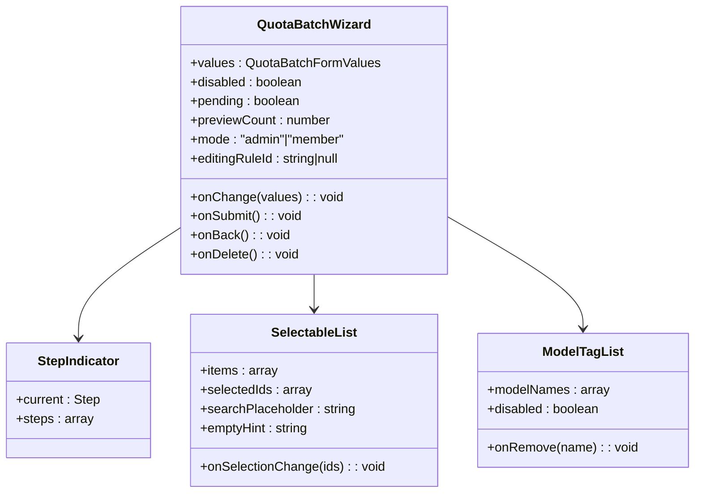

**图表来源**
- [quota-batch-wizard.tsx:52-73](file://frontend/src/features/gateway-budget/quota-batch-wizard.tsx#L52-L73)
- [quota-batch-wizard.tsx:206-247](file://frontend/src/features/gateway-budget/quota-batch-wizard.tsx#L206-L247)
- [quota-batch-wizard.tsx:249-507](file://frontend/src/features/gateway-budget/quota-batch-wizard.tsx#L249-L507)
- [quota-batch-wizard.tsx:509-540](file://frontend/src/features/gateway-budget/quota-batch-wizard.tsx#L509-L540)

**章节来源**
- [quota-batch-wizard.tsx:1-1354](file://frontend/src/features/gateway-budget/quota-batch-wizard.tsx#L1-L1354)

### 配额批量设置抽屉组件（QuotaBatchDrawer）
**更新** 保留原有抽屉组件作为备用方案，提供完整的批量设置功能。

- 设计理念：传统的侧边栏抽屉模式，适合需要同时查看和编辑多个配置项的场景
- 关键特性
  - 分层配置：支持平台、上游、下游三个层级的配置
  - 主体选择：支持团队、成员、虚拟Key三种主体模式
  - 模板应用：提供预设的限额组合模板
  - 实时预览：显示将要创建或更新的规则数量
- 组件结构
  - 成员模式配置：简化为仅凭据选择
  - 管理员模式配置：完整的层级和主体配置
  - 模板预设区域：一键应用常用限额组合
  - 限额设置区域：USD、Token、请求数的配置

**章节来源**
- [quota-batch-drawer.tsx:1-702](file://frontend/src/features/gateway-budget/quota-batch-drawer.tsx#L1-L702)

### 配额模板系统（QuotaTemplates）
**更新** 新增模板预设系统，提供常用限额组合的一键应用功能。

- 设计理念：通过预设模板减少重复配置工作，提高批量设置效率
- 模板类型
  - 轻度使用：每日 $10
  - 标准使用：每月 $100
  - 高用量：每月 $500
  - Token 限制：每月 1M Token
  - 请求限制：每日 1,000 次
  - 严格限额：每日 $1 + 100 次
- 功能特性
  - 一键应用：点击模板即可填充对应限额值
  - 保持维度：应用模板时保留主体、层级、模型等维度设置
  - 实时预览：应用模板后立即更新预览规则数量

**章节来源**
- [quota-batch-templates.ts:1-58](file://frontend/src/features/gateway-budget/quota-batch-templates.ts#L1-L58)

### 配额中心状态管理（useQuotaCenter）
**更新** 新增状态管理钩子，处理配额批量设置的复杂业务逻辑。

- 设计理念：集中管理配额批量设置的状态、数据获取和业务逻辑
- 核心功能
  - 表单状态管理：管理 QuotaBatchFormValues 的所有字段
  - 数据获取：通过 React Query 获取成员、凭据、Key 等元数据
  - 规则构建：根据表单值构建实际的配额规则数组
  - 批量提交：处理批量创建或更新配额规则的API调用
  - 编辑模式：支持编辑现有配额规则的功能
- 状态结构
  - formDisabled：表单是否禁用
  - batchOpen：批量设置界面是否打开
  - batchValues：当前表单值
  - batchPending：批量操作是否进行中
  - batchPreviewCount：预览的规则数量

**章节来源**
- [use-quota-center.ts:1-728](file://frontend/src/features/gateway-budget/use-quota-center.ts#L1-L728)

### 权限类型系统与团队成员显示格式化
**更新** 新增团队成员显示格式化增强，通过@符号检查改善邮箱显示的准确性。

- 设计理念：通过统一的权限类型系统和成员显示格式化逻辑，提供一致的团队管理体验
- 关键特性
  - 团队角色管理：支持所有者、管理员、成员三种角色
  - 成员显示格式化：智能处理姓名、邮箱、用户ID的显示优先级
  - @符号检查：通过email.includes('@')确保邮箱格式的有效性
  - 回退机制：当缺少必要信息时提供合适的回退显示
- 显示逻辑
  - 优先级：姓名 + 邮箱 > 邮箱（含@） > 邮箱（不含@） > 姓名 > 用户ID前缀
  - 格式化：使用teamRoleLabel转换角色为中文显示
  - 辅助信息：当邮箱无效时显示用户ID前缀用于识别

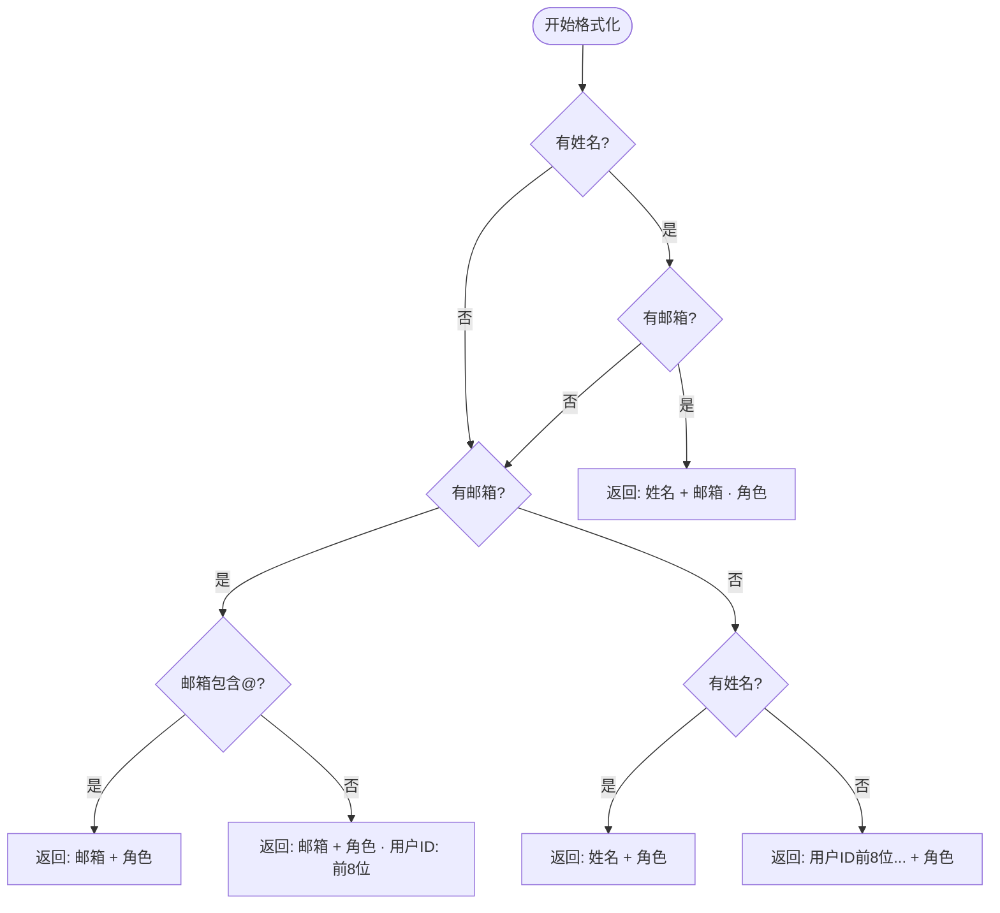

**图表来源**
- [permissions.ts:34-58](file://frontend/src/types/permissions.ts#L34-L58)

**章节来源**
- [permissions.ts:1-58](file://frontend/src/types/permissions.ts#L1-L58)
- [teams.tsx:433-442](file://frontend/src/pages/gateway/teams.tsx#L433-L442)
- [gateway-team-display.test.ts:1-116](file://frontend/src/features/gateway-teams/gateway-team-display.test.ts#L1-L116)

### 按钮组件（Button）
- 设计理念：通过变体与尺寸抽象不同语义与视觉层级，保证一致性与可复用性
- 关键属性与行为
  - 变体：default、secondary、outline、ghost、destructive、link
  - 尺寸：sm、default、lg、icon
  - 状态：禁用、加载、聚焦
- 样式定制：基于Tailwind类名组合，支持通过props扩展或覆盖
- 使用示例路径
  - [DESIGN_SYSTEM.md:400-436](file://frontend/docs/DESIGN_SYSTEM.md#L400-L436)
  - [button.tsx:1-60](file://frontend/src/components/ui/button.tsx#L1-L60)

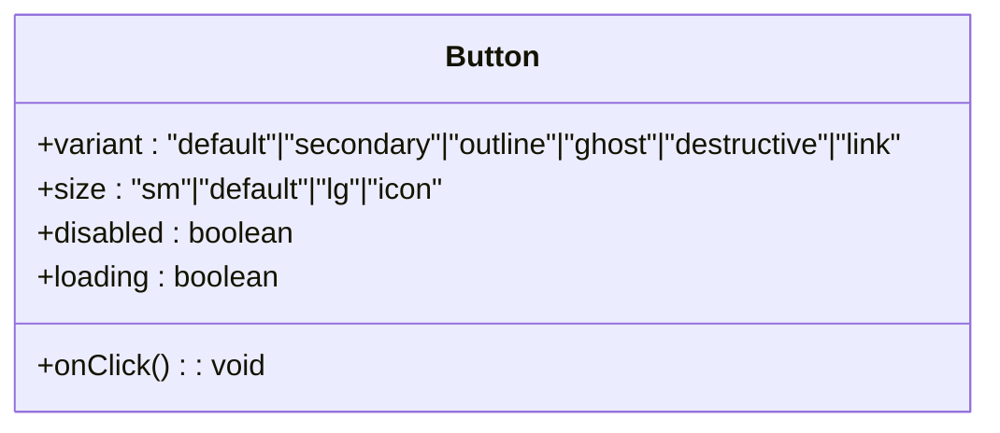

**图表来源**
- [button.tsx:1-60](file://frontend/src/components/ui/button.tsx#L1-L60)

**章节来源**
- [DESIGN_SYSTEM.md:400-436](file://frontend/docs/DESIGN_SYSTEM.md#L400-L436)
- [button.tsx:1-60](file://frontend/src/components/ui/button.tsx#L1-L60)

### 输入框组件（Input）
- 设计理念：简洁、可访问、可组合
- 关键属性与行为
  - 类型：text、email、password、number等
  - 状态：禁用、只读、错误
  - 与Label组合提升可访问性
- 使用示例路径
  - [DESIGN_SYSTEM.md:455-469](file://frontend/docs/DESIGN_SYSTEM.md#L455-L469)
  - [input.tsx:1-40](file://frontend/src/components/ui/input.tsx#L1-L40)
  - [label.tsx:1-60](file://frontend/src/components/ui/label.tsx#L1-L60)

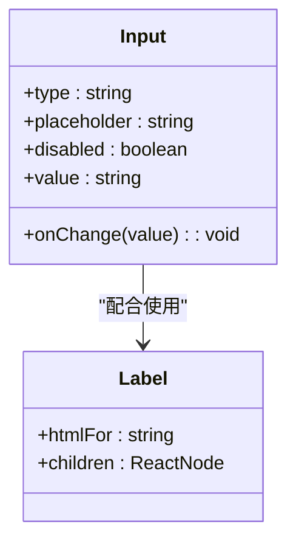

**图表来源**
- [input.tsx:1-40](file://frontend/src/components/ui/input.tsx#L1-L40)
- [label.tsx:1-60](file://frontend/src/components/ui/label.tsx#L1-L60)

**章节来源**
- [DESIGN_SYSTEM.md:455-469](file://frontend/docs/DESIGN_SYSTEM.md#L455-L469)
- [input.tsx:1-40](file://frontend/src/components/ui/input.tsx#L1-L40)
- [label.tsx:1-60](file://frontend/src/components/ui/label.tsx#L1-L60)

### 卡片组件（Card）
- 设计理念：结构化信息展示，支持头部、标题、描述、内容与底部操作
- 组成：Card、CardHeader、CardTitle、CardDescription、CardContent、CardFooter
- 使用示例路径
  - [DESIGN_SYSTEM.md:438-453](file://frontend/docs/DESIGN_SYSTEM.md#L438-L453)
  - [card.tsx:1-70](file://frontend/src/components/ui/card.tsx#L1-L70)

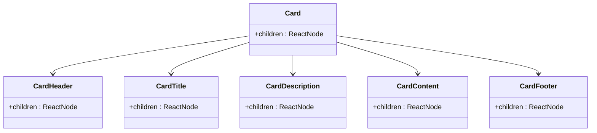

**图表来源**
- [card.tsx:1-70](file://frontend/src/components/ui/card.tsx#L1-L70)

**章节来源**
- [DESIGN_SYSTEM.md:438-453](file://frontend/docs/DESIGN_SYSTEM.md#L438-L453)
- [card.tsx:1-70](file://frontend/src/components/ui/card.tsx#L1-L70)

### 对话框组件（Dialog）
- 设计理念：模态交互与确认流程，支持触发器、遮罩、内容与关闭
- 组成：Trigger、Overlay、Content、Close
- 典型用法：确认删除、设置面板、帮助说明
- 使用路径
  - [dialog.tsx:1-60](file://frontend/src/components/ui/dialog.tsx#L1-L60)
  - [confirm-alert-dialog.tsx:1-120](file://frontend/src/components/confirm-alert-dialog.tsx#L1-L120)

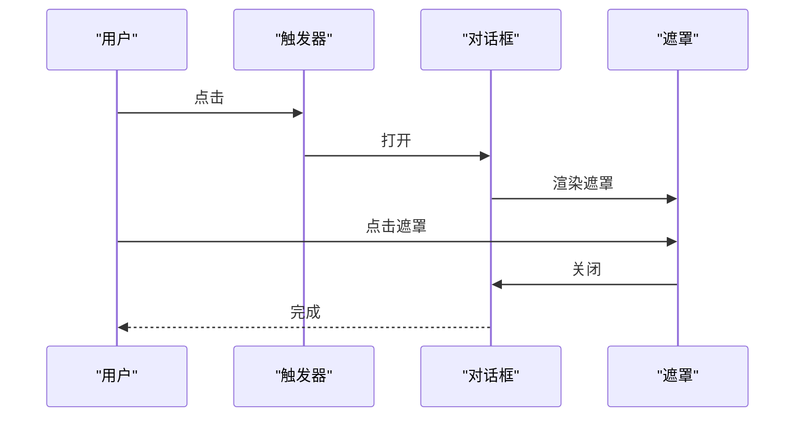

**图表来源**
- [dialog.tsx:1-60](file://frontend/src/components/ui/dialog.tsx#L1-L60)
- [confirm-alert-dialog.tsx:1-120](file://frontend/src/components/confirm-alert-dialog.tsx#L1-L120)

**章节来源**
- [dialog.tsx:1-60](file://frontend/src/components/ui/dialog.tsx#L1-L60)
- [confirm-alert-dialog.tsx:1-120](file://frontend/src/components/confirm-alert-dialog.tsx#L1-L120)

### 表单组件与验证（示例：聊天输入与统一输入区）
- 设计理念：表单即组件，通过组合Input、Textarea、Label与Button实现复杂交互
- 关键点
  - 字段映射：通过受控组件绑定值与变更事件
  - 错误显示：结合Label与辅助文本呈现校验结果
  - 可访问性：为Input绑定Label的htmlFor，确保屏幕阅读器正确朗读
- 使用路径
  - [chat-input.tsx:1-80](file://frontend/src/pages/chat/components/chat-input.tsx#L1-L80)
  - [unified-input-area.tsx:1-80](file://frontend/src/pages/chat/components/unified-input-area.tsx#L1-L80)
  - [input-panel.tsx:1-220](file://frontend/src/pages/listing-studio/components/input-panel.tsx#L1-L220)

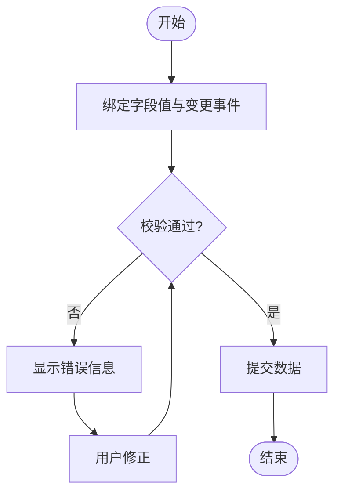

**图表来源**
- [chat-input.tsx:1-80](file://frontend/src/pages/chat/components/chat-input.tsx#L1-L80)
- [unified-input-area.tsx:1-80](file://frontend/src/pages/chat/components/unified-input-area.tsx#L1-L80)
- [input-panel.tsx:1-220](file://frontend/src/pages/listing-studio/components/input-panel.tsx#L1-L220)

**章节来源**
- [chat-input.tsx:1-80](file://frontend/src/pages/chat/components/chat-input.tsx#L1-L80)
- [unified-input-area.tsx:1-80](file://frontend/src/pages/chat/components/unified-input-area.tsx#L1-L80)
- [input-panel.tsx:1-220](file://frontend/src/pages/listing-studio/components/input-panel.tsx#L1-L220)

### 布局组件（头部导航、侧边栏、主内容区）
- 设计理念：以卡片与滚动区域承载内容，通过Tabs实现分组切换
- 典型用法
  - 头部导航：结合Button与Badge展示状态
  - 侧边栏：使用ScrollArea处理长列表
  - 主内容区：Card承载业务信息
- 使用路径
  - [chat/time-travel-debugger.tsx:1-40](file://frontend/src/components/chat/time-travel-debugger.tsx#L1-L40)
  - [tabs.tsx:1-60](file://frontend/src/components/ui/tabs.tsx#L1-L60)
  - [scroll-area.tsx:1-60](file://frontend/src/components/ui/scroll-area.tsx#L1-L60)
  - [card.tsx:1-70](file://frontend/src/components/ui/card.tsx#L1-L70)

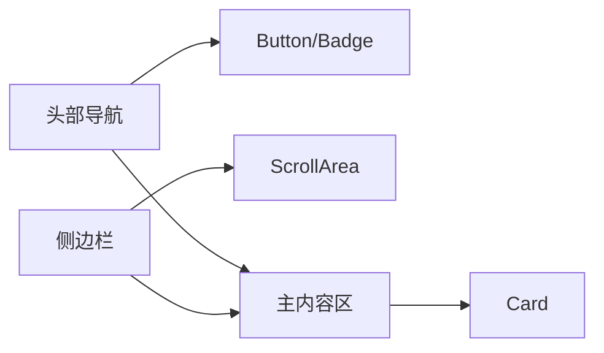

**图表来源**
- [chat/time-travel-debugger.tsx:1-40](file://frontend/src/components/chat/time-travel-debugger.tsx#L1-L40)
- [tabs.tsx:1-60](file://frontend/src/components/ui/tabs.tsx#L1-L60)
- [scroll-area.tsx:1-60](file://frontend/src/components/ui/scroll-area.tsx#L1-L60)
- [card.tsx:1-70](file://frontend/src/components/ui/card.tsx#L1-L70)

**章节来源**
- [chat/time-travel-debugger.tsx:1-40](file://frontend/src/components/chat/time-travel-debugger.tsx#L1-L40)
- [tabs.tsx:1-60](file://frontend/src/components/ui/tabs.tsx#L1-L60)
- [scroll-area.tsx:1-60](file://frontend/src/components/ui/scroll-area.tsx#L1-L60)
- [card.tsx:1-70](file://frontend/src/components/ui/card.tsx#L1-L70)

### 主题系统（深色/浅色切换、颜色变量管理、响应式设计）
- 设计理念：集中式主题提供器，统一颜色变量与响应式断点
- 组成
  - ThemeProvider：管理主题状态与上下文
  - tailwind.config.js：扩展颜色、断点与插件
  - index.css：全局样式与重置
- 使用路径
  - [theme-provider.tsx:1-60](file://frontend/src/components/theme-provider.tsx#L1-L60)
  - [tailwind.config.js:1-120](file://frontend/tailwind.config.js#L1-L120)
  - [index.css:1-120](file://frontend/src/index.css#L1-L120)

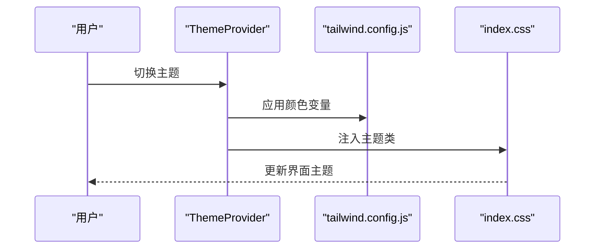

**图表来源**
- [theme-provider.tsx:1-60](file://frontend/src/components/theme-provider.tsx#L1-L60)
- [tailwind.config.js:1-120](file://frontend/tailwind.config.js#L1-L120)
- [index.css:1-120](file://frontend/src/index.css#L1-L120)

**章节来源**
- [theme-provider.tsx:1-60](file://frontend/src/components/theme-provider.tsx#L1-L60)
- [tailwind.config.js:1-120](file://frontend/tailwind.config.js#L1-L120)
- [index.css:1-120](file://frontend/src/index.css#L1-L120)

### 可访问性设计（ARIA、键盘导航、屏幕阅读器支持）
- 设计要点
  - 为Input绑定Label的htmlFor，确保屏幕阅读器正确朗读
  - 对按钮与对话框提供aria-*属性与键盘焦点管理
  - 对滚动区域与标签页提供键盘导航支持
  - 新增的向导组件提供清晰的步骤指示和键盘导航支持
  - **团队成员显示格式化增强**：通过@符号检查确保邮箱格式有效，提升可访问性
- 使用路径
  - [label.tsx:1-60](file://frontend/src/components/ui/label.tsx#L1-L60)
  - [button.tsx:1-60](file://frontend/src/components/ui/button.tsx#L1-L60)
  - [dialog.tsx:1-60](file://frontend/src/components/ui/dialog.tsx#L1-L60)
  - [tabs.tsx:1-60](file://frontend/src/components/ui/tabs.tsx#L1-L60)
  - [scroll-area.tsx:1-60](file://frontend/src/components/ui/scroll-area.tsx#L1-L60)
  - [permissions.ts:48-52](file://frontend/src/types/permissions.ts#L48-L52)

**章节来源**
- [label.tsx:1-60](file://frontend/src/components/ui/label.tsx#L1-L60)
- [button.tsx:1-60](file://frontend/src/components/ui/button.tsx#L1-L60)
- [dialog.tsx:1-60](file://frontend/src/components/ui/dialog.tsx#L1-L60)
- [tabs.tsx:1-60](file://frontend/src/components/ui/tabs.tsx#L1-L60)
- [scroll-area.tsx:1-60](file://frontend/src/components/ui/scroll-area.tsx#L1-L60)
- [permissions.ts:48-52](file://frontend/src/types/permissions.ts#L48-L52)

### Tailwind CSS集成与自定义样式策略
- 集成方式
  - 在tailwind.config.js中扩展颜色、字体、间距与断点
  - 在index.css中引入全局样式与重置
- 自定义策略
  - 优先使用官方变体与尺寸，避免过度定制
  - 通过组件props进行轻量扩展，保持一致性
  - 使用暗色/亮色颜色变量适配主题系统
  - 新增的向导组件使用专门的样式类名
  - **团队成员显示组件**：使用truncate和max-w类名控制显示长度
- 使用路径
  - [tailwind.config.js:1-120](file://frontend/tailwind.config.js#L1-L120)
  - [index.css:1-120](file://frontend/src/index.css#L1-L120)

**章节来源**
- [tailwind.config.js:1-120](file://frontend/tailwind.config.js#L1-L120)
- [index.css:1-120](file://frontend/src/index.css#L1-L120)

### 组件使用示例与最佳实践
- 组合模式
  - 使用Card承载内容，配合Tabs实现分组切换
  - 使用Dialog封装确认流程，结合Button与Label
  - 新增的向导组件提供三步式配置流程，替代传统抽屉
  - **团队成员显示**：使用formatTeamMemberDisplay函数获取格式化后的显示信息
- 性能优化
  - 对长列表使用ScrollArea，避免一次性渲染大量节点
  - 使用memo化组件减少重渲染（参考现有组件中的memo用法）
  - 向导组件使用React.memo优化可选择列表的渲染性能
  - **成员显示优化**：formatTeamMemberDisplay函数内部使用缓存机制
- 内存泄漏防护
  - 在组件卸载时清理定时器、订阅与事件监听
  - 状态管理钩子自动处理查询的清理和取消
- 使用路径
  - [tabs.tsx:1-60](file://frontend/src/components/ui/tabs.tsx#L1-L60)
  - [scroll-area.tsx:1-60](file://frontend/src/components/ui/scroll-area.tsx#L1-L60)
  - [dialog.tsx:1-60](file://frontend/src/components/ui/dialog.tsx#L1-L60)
  - [card.tsx:1-70](file://frontend/src/components/ui/card.tsx#L1-L70)
  - [quota-batch-wizard.tsx:249-507](file://frontend/src/features/gateway-budget/quota-batch-wizard.tsx#L249-L507)
  - [teams.tsx:433-442](file://frontend/src/pages/gateway/teams.tsx#L433-L442)

**章节来源**
- [tabs.tsx:1-60](file://frontend/src/components/ui/tabs.tsx#L1-L60)
- [scroll-area.tsx:1-60](file://frontend/src/components/ui/scroll-area.tsx#L1-L60)
- [dialog.tsx:1-60](file://frontend/src/components/ui/dialog.tsx#L1-L60)
- [card.tsx:1-70](file://frontend/src/components/ui/card.tsx#L1-L70)
- [quota-batch-wizard.tsx:249-507](file://frontend/src/features/gateway-budget/quota-batch-wizard.tsx#L249-L507)
- [teams.tsx:433-442](file://frontend/src/pages/gateway/teams.tsx#L433-L442)

### 组件测试策略与Storybook集成方案
- 测试策略
  - 单元测试：针对组件渲染、交互与状态变化
  - 集成测试：验证组件组合与跨组件协作
  - 可访问性测试：确保ARIA与键盘导航可用
  - 新增向导组件的步骤切换和表单验证测试
  - **团队成员显示格式化测试**：验证@符号检查逻辑的正确性
- Storybook集成建议
  - 为每个组件创建stories，覆盖变体、尺寸与状态
  - 使用controls动态调整props，快速验证样式与行为
  - 添加accessibility检查与自动化测试脚本
  - 新增向导组件的步骤演示和交互测试
  - **权限类型组件测试**：包含各种邮箱格式的边界情况测试
- 使用路径
  - [chat-messages.test.tsx:1-120](file://frontend/src/pages/chat/components/chat-messages.test.tsx#L1-L120)
  - [pagination-controls.test.tsx:1-120](file://frontend/src/components/pagination-controls.test.tsx#L1-L120)
  - [confirm-alert-dialog.test.tsx:1-120](file://frontend/src/components/confirm-alert-dialog.test.tsx#L1-L120)
  - [quota-batch-form.test.ts:1-38](file://frontend/src/features/gateway-budget/quota-batch-form.test.ts#L1-L38)
  - [gateway-team-display.test.ts:1-116](file://frontend/src/features/gateway-teams/gateway-team-display.test.ts#L1-L116)

**章节来源**
- [chat-messages.test.tsx:1-120](file://frontend/src/pages/chat/components/chat-messages.test.tsx#L1-L120)
- [pagination-controls.test.tsx:1-120](file://frontend/src/components/pagination-controls.test.tsx#L1-L120)
- [confirm-alert-dialog.test.tsx:1-120](file://frontend/src/components/confirm-alert-dialog.test.tsx#L1-L120)
- [quota-batch-form.test.ts:1-38](file://frontend/src/features/gateway-budget/quota-batch-form.test.ts#L1-L38)
- [gateway-team-display.test.ts:1-116](file://frontend/src/features/gateway-teams/gateway-team-display.test.ts#L1-L116)

## 依赖关系分析
UI组件之间的依赖关系清晰，遵循"低耦合、高内聚"的原则。组件库通过统一入口导出，主题系统集中管理样式与颜色，应用层仅负责组合与业务逻辑。新增的配额批量设置系统通过状态管理钩子与向导组件紧密集成。权限类型系统为团队成员显示提供格式化支持。

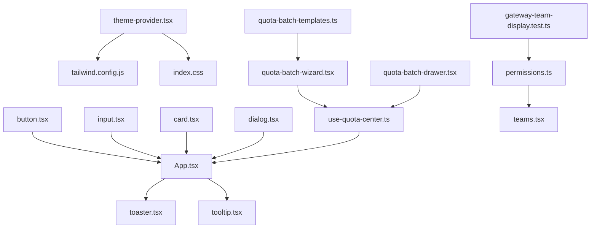

**图表来源**
- [App.tsx:1-20](file://frontend/src/App.tsx#L1-L20)
- [button.tsx:1-60](file://frontend/src/components/ui/button.tsx#L1-L60)
- [input.tsx:1-40](file://frontend/src/components/ui/input.tsx#L1-L40)
- [card.tsx:1-70](file://frontend/src/components/ui/card.tsx#L1-L70)
- [dialog.tsx:1-60](file://frontend/src/components/ui/dialog.tsx#L1-L60)
- [toaster.tsx:1-60](file://frontend/src/components/ui/toaster.tsx#L1-L60)
- [tooltip.tsx:1-60](file://frontend/src/components/ui/tooltip.tsx#L1-L60)
- [theme-provider.tsx:1-60](file://frontend/src/components/theme-provider.tsx#L1-L60)
- [tailwind.config.js:1-120](file://frontend/tailwind.config.js#L1-L120)
- [index.css:1-120](file://frontend/src/index.css#L1-L120)
- [quota-batch-wizard.tsx:1-1354](file://frontend/src/features/gateway-budget/quota-batch-wizard.tsx#L1-L1354)
- [quota-batch-drawer.tsx:1-702](file://frontend/src/features/gateway-budget/quota-batch-drawer.tsx#L1-L702)
- [quota-batch-templates.ts:1-58](file://frontend/src/features/gateway-budget/quota-batch-templates.ts#L1-L58)
- [use-quota-center.ts:1-728](file://frontend/src/features/gateway-budget/use-quota-center.ts#L1-L728)
- [permissions.ts:1-58](file://frontend/src/types/permissions.ts#L1-L58)
- [teams.tsx:418-502](file://frontend/src/pages/gateway/teams.tsx#L418-L502)
- [gateway-team-display.test.ts:1-116](file://frontend/src/features/gateway-teams/gateway-team-display.test.ts#L1-L116)

**章节来源**
- [App.tsx:1-20](file://frontend/src/App.tsx#L1-L20)
- [button.tsx:1-60](file://frontend/src/components/ui/button.tsx#L1-L60)
- [input.tsx:1-40](file://frontend/src/components/ui/input.tsx#L1-L40)
- [card.tsx:1-70](file://frontend/src/components/ui/card.tsx#L1-L70)
- [dialog.tsx:1-60](file://frontend/src/components/ui/dialog.tsx#L1-L60)
- [toaster.tsx:1-60](file://frontend/src/components/ui/toaster.tsx#L1-L60)
- [tooltip.tsx:1-60](file://frontend/src/components/ui/tooltip.tsx#L1-L60)
- [theme-provider.tsx:1-60](file://frontend/src/components/theme-provider.tsx#L1-L60)
- [tailwind.config.js:1-120](file://frontend/tailwind.config.js#L1-L120)
- [index.css:1-120](file://frontend/src/index.css#L1-L120)
- [quota-batch-wizard.tsx:1-1354](file://frontend/src/features/gateway-budget/quota-batch-wizard.tsx#L1-L1354)
- [quota-batch-drawer.tsx:1-702](file://frontend/src/features/gateway-budget/quota-batch-drawer.tsx#L1-L702)
- [quota-batch-templates.ts:1-58](file://frontend/src/features/gateway-budget/quota-batch-templates.ts#L1-L58)
- [use-quota-center.ts:1-728](file://frontend/src/features/gateway-budget/use-quota-center.ts#L1-L728)
- [permissions.ts:1-58](file://frontend/src/types/permissions.ts#L1-L58)
- [teams.tsx:418-502](file://frontend/src/pages/gateway/teams.tsx#L418-L502)
- [gateway-team-display.test.ts:1-116](file://frontend/src/features/gateway-teams/gateway-team-display.test.ts#L1-L116)

## 性能考量
- 渲染优化
  - 使用React.memo对稳定组件进行缓存，特别是可选择列表组件
  - 避免在渲染过程中创建新对象与函数
  - 向导组件使用useMemo优化预览规则的计算
  - **团队成员显示优化**：formatTeamMemberDisplay函数内部使用缓存机制
- 交互优化
  - 对高频事件使用防抖/节流
  - 合理拆分组件，减少不必要的重渲染
  - 新增的向导组件提供即时的步骤切换反馈
  - **成员显示优化**：@符号检查逻辑使用includes方法，性能高效
- 样式优化
  - 优先使用Tailwind原子类，避免内联样式的重复计算
  - 控制阴影、动画与滤镜的使用数量
  - 向导组件使用专门的过渡动画提升用户体验
  - **成员显示组件优化**：使用truncate和max-w类名控制显示长度

## 故障排查指南
- 常见问题
  - 对话框无法关闭：检查触发器与Close事件绑定
  - 输入框无标签关联：为Input添加对应的Label并设置htmlFor
  - 主题不生效：确认ThemeProvider包裹范围与tailwind.config.js配置
  - 向导组件步骤异常：检查StepIndicator的current参数和步骤数量
  - 模板应用无效：确认QuotaTemplates的applyQuotaTemplate函数调用
  - **团队成员显示异常**：检查email字段是否包含@符号，确认formatTeamMemberDisplay函数调用
- 调试建议
  - 使用浏览器开发者工具检查DOM结构与类名
  - 在组件中打印关键状态，定位渲染异常
  - 运行可访问性测试工具，确保ARIA与键盘导航正常
  - 检查useQuotaCenter的状态管理是否正确更新
  - **权限类型调试**：检查permissions.ts中的@符号检查逻辑，验证邮箱格式有效性

**章节来源**
- [dialog.tsx:1-60](file://frontend/src/components/ui/dialog.tsx#L1-L60)
- [label.tsx:1-60](file://frontend/src/components/ui/label.tsx#L1-L60)
- [theme-provider.tsx:1-60](file://frontend/src/components/theme-provider.tsx#L1-L60)
- [tailwind.config.js:1-120](file://frontend/tailwind.config.js#L1-L120)
- [quota-batch-wizard.tsx:206-247](file://frontend/src/features/gateway-budget/quota-batch-wizard.tsx#L206-L247)
- [quota-batch-templates.ts:49-57](file://frontend/src/features/gateway-budget/quota-batch-templates.ts#L49-L57)
- [use-quota-center.ts:488-535](file://frontend/src/features/gateway-budget/use-quota-center.ts#L488-L535)
- [permissions.ts:48-52](file://frontend/src/types/permissions.ts#L48-L52)

## 结论
本UI组件系统以统一的变体与尺寸体系为基础，结合主题系统与Tailwind CSS实现高度一致且可定制的视觉语言。通过合理的组件组合、可访问性设计与测试策略，能够支撑复杂业务场景的快速迭代与高质量交付。

**更新** 新增的配额批量设置向导组件显著提升了用户体验，通过三步式配置流程简化了复杂的配额设置操作。向导组件提供了清晰的步骤指示、实时的规则预览和便捷的模板应用功能，大幅提高了批量设置的效率和准确性。

**更新** 新增的团队成员显示格式化增强通过@符号检查逻辑，显著改善了邮箱显示的准确性和用户体验。该功能确保只有有效的邮箱地址才会以邮箱形式显示，无效的邮箱会降级为用户ID显示，提升了系统的健壮性和可访问性。

建议在后续开发中持续完善Storybook与自动化测试，进一步提升组件库的稳定性与可维护性。同时，可以考虑将向导组件的模式扩展到其他类似的批量配置场景中，并继续优化权限类型系统的显示逻辑。

## 附录
- 组件清单与使用路径
  - 按钮：[button.tsx:1-60](file://frontend/src/components/ui/button.tsx#L1-L60)
  - 输入框：[input.tsx:1-40](file://frontend/src/components/ui/input.tsx#L1-L40)
  - 卡片：[card.tsx:1-70](file://frontend/src/components/ui/card.tsx#L1-L70)
  - 对话框：[dialog.tsx:1-60](file://frontend/src/components/ui/dialog.tsx#L1-L60)
  - 标签：[label.tsx:1-60](file://frontend/src/components/ui/label.tsx#L1-L60)
  - 徽章：[badge.tsx:1-60](file://frontend/src/components/ui/badge.tsx#L1-L60)
  - 滚动区域：[scroll-area.tsx:1-60](file://frontend/src/components/ui/scroll-area.tsx#L1-L60)
  - 标签页：[tabs.tsx:1-60](file://frontend/src/components/ui/tabs.tsx#L1-L60)
  - 文本域：[textarea.tsx:1-60](file://frontend/src/components/ui/textarea.tsx#L1-L60)
  - 提示气泡：[tooltip.tsx:1-60](file://frontend/src/components/ui/tooltip.tsx#L1-L60)
  - 吐司通知：[toaster.tsx:1-60](file://frontend/src/components/ui/toaster.tsx#L1-L60)
  - 配额批量设置向导：[quota-batch-wizard.tsx:1-1354](file://frontend/src/features/gateway-budget/quota-batch-wizard.tsx#L1-L1354)
  - 配额批量设置抽屉：[quota-batch-drawer.tsx:1-702](file://frontend/src/features/gateway-budget/quota-batch-drawer.tsx#L1-L702)
  - 配额模板系统：[quota-batch-templates.ts:1-58](file://frontend/src/features/gateway-budget/quota-batch-templates.ts#L1-L58)
  - 配额中心状态管理：[use-quota-center.ts:1-728](file://frontend/src/features/gateway-budget/use-quota-center.ts#L1-L728)
  - **权限类型系统**：[permissions.ts:1-58](file://frontend/src/types/permissions.ts#L1-L58)
  - **团队成员显示**：[teams.tsx:433-442](file://frontend/src/pages/gateway/teams.tsx#L433-L442)
- 主题与样式
  - 主题提供器：[theme-provider.tsx:1-60](file://frontend/src/components/theme-provider.tsx#L1-L60)
  - Tailwind配置：[tailwind.config.js:1-120](file://frontend/tailwind.config.js#L1-L120)
  - 全局样式：[index.css:1-120](file://frontend/src/index.css#L1-L120)
- 页面与特性示例
  - 聊天输入：[chat-input.tsx:1-80](file://frontend/src/pages/chat/components/chat-input.tsx#L1-L80)
  - 统一输入区：[unified-input-area.tsx:1-80](file://frontend/src/pages/chat/components/unified-input-area.tsx#L1-L80)
  - 输入面板：[input-panel.tsx:1-220](file://frontend/src/pages/listing-studio/components/input-panel.tsx#L1-L220)
  - 预算卡片：[budget-usage-card.tsx:1-160](file://frontend/src/features/gateway-budget/budget-usage-card.tsx#L1-L160)
  - 配额项：[quota-card-item.tsx:1-60](file://frontend/src/features/gateway-budget/quota-card-item.tsx#L1-L60)
  - 刷新按钮：[gateway-refresh-button.tsx:1-60](file://frontend/src/features/gateway-shared/gateway-refresh-button.tsx#L1-L60)
  - 视觉输入：[vision-input.tsx:1-140](file://frontend/src/features/gateway-playground/modes/vision-input.tsx#L1-L140)
  - Playground卡片：[playground-card.tsx:1-120](file://frontend/src/features/gateway-playground/playground-card.tsx#L1-L120)
  - **团队管理页面**：[teams.tsx:418-502](file://frontend/src/pages/gateway/teams.tsx#L418-L502)