# 前端应用架构

<cite>
**本文引用的文件**
- [package.json](file://frontend/package.json)
- [vite.config.ts](file://frontend/vite.config.ts)
- [tsconfig.json](file://frontend/tsconfig.json)
- [tailwind.config.js](file://frontend/tailwind.config.js)
- [eslint.config.js](file://frontend/eslint.config.js)
- [src/main.tsx](file://frontend/src/main.tsx)
- [src/App.tsx](file://frontend/src/App.tsx)
- [src/routes/index.ts](file://frontend/src/routes/index.ts)
- [src/components/auth-provider.tsx](file://frontend/src/components/auth-provider.tsx)
- [src/components/theme-provider.tsx](file://frontend/src/components/theme-provider.tsx)
- [src/components/route-suspense-fallback.tsx](file://frontend/src/components/route-suspense-fallback.tsx)
- [src/api/client.ts](file://frontend/src/api/client.ts)
- [src/api/errors.ts](file://frontend/src/api/errors.ts)
- [src/stores/index.ts](file://frontend/src/stores/index.ts)
- [src/stores/gateway-credentials.ts](file://frontend/src/stores/gateway-credentials.ts)
- [src/stores/gateway-models.ts](file://frontend/src/stores/gateway-models.ts)
- [src/hooks/use-gateway-permission.ts](file://frontend/src/hooks/use-gateway-permission.ts)
- [src/hooks/use-gateway-scope-tab.ts](file://frontend/src/hooks/use-gateway-scope-tab.ts)
- [src/hooks/use-toast.ts](file://frontend/src/hooks/use-toast.ts)
- [src/lib/session-utils.ts](file://frontend/src/lib/session-utils.ts)
- [src/lib/logger.ts](file://frontend/src/lib/logger.ts)
- [src/lib/money.ts](file://frontend/src/lib/money.ts)
- [src/lib/api-form-errors.ts](file://frontend/src/lib/api-form-errors.ts)
- [src/lib/fastapi-error-detail.ts](file://frontend/src/lib/fastapi-error-detail.ts)
- [src/lib/gateway-api-error.ts](file://frontend/src/lib/gateway-api-error.ts)
- [src/types/gateway.ts](file://frontend/src/types/gateway.ts)
- [src/types/common.ts](file://frontend/src/types/common.ts)
- [src/features/gateway-credentials/index.tsx](file://frontend/src/features/gateway-credentials/index.tsx)
- [src/features/gateway-models/index.tsx](file://frontend/src/features/gateway-models/index.tsx)
- [src/features/gateway-models/model-capability-editor.tsx](file://frontend/src/features/gateway-models/model-capability-editor.tsx)
- [src/features/gateway-models/personal/personal-model-form.tsx](file://frontend/src/features/gateway-models/personal/personal-model-form.tsx)
- [src/features/gateway-models/personal/personal-model-form-values.ts](file://frontend/src/features/gateway-models/personal/personal-model-form-values.ts)
- [src/features/gateway-models/team/register-model-form.tsx](file://frontend/src/features/gateway-models/team/register-model-form.tsx)
- [src/pages/gateway/index.tsx](file://frontend/src/pages/gateway/index.tsx)
- [src/pages/admin/users/index.tsx](file://frontend/src/pages/admin/users/index.tsx)
- [src/pages/chat/index.tsx](file://frontend/src/pages/chat/index.tsx)
- [src/components/ui/button.tsx](file://frontend/src/components/ui/button.tsx)
- [src/components/ui/input.tsx](file://frontend/src/components/ui/input.tsx)
- [src/components/layout/header.tsx](file://frontend/src/components/layout/header.tsx)
- [src/components/layout/sidebar.tsx](file://frontend/src/components/layout/sidebar.tsx)
- [src/components/confirm-alert-dialog.tsx](file://frontend/src/components/confirm-alert-dialog.tsx)
- [src/components/pagination-controls.tsx](file://frontend/src/components/pagination-controls.tsx)
</cite>

## 更新摘要
**所做更改**
- 新增批量操作错误处理增强章节，详细说明异步操作的健壮性改进
- 添加用户友好的错误通知机制，包括Toast通知系统和错误边界处理
- 扩展API错误处理模块，新增专门的错误分类和处理工具
- 新增确认对话框组件，提供更安全的批量操作确认机制
- 完善异步操作的错误恢复和重试策略

## 目录
1. [引言](#引言)
2. [项目结构](#项目结构)
3. [核心组件](#核心组件)
4. [架构总览](#架构总览)
5. [详细组件分析](#详细组件分析)
6. [批量操作错误处理增强](#批量操作错误处理增强)
7. [异步操作健壮性改进](#异步操作健壮性改进)
8. [用户友好错误通知机制](#用户友好错误通知机制)
9. [依赖关系分析](#依赖关系分析)
10. [性能考虑](#性能考虑)
11. [故障排除指南](#故障排除指南)
12. [结论](#结论)
13. [附录](#附录)

## 引言
本文件为AI Agent前端应用的架构文档，基于React 18 + TypeScript + Vite技术栈，采用Zustand进行状态管理，结合自研API客户端与拦截器机制，构建了可扩展的UI组件体系与功能页面模块。文档从基础概念到架构深度层层递进，既适合初学者理解React开发要点，也为有经验的前端工程师提供深入的技术洞察。

**更新** 本次更新重点关注前端健壮性改进：批量操作错误处理增强、异步操作更稳健、用户友好的错误通知机制。新增了专门的错误处理工具、Toast通知系统和确认对话框组件，显著提升了用户体验和系统稳定性。

## 项目结构
前端工程位于frontend目录，采用按功能域划分的特性驱动组织方式，配合清晰的分层职责：入口与路由、API客户端、状态存储、通用组件与UI基础库、业务页面与Hooks、类型定义与工具库等。

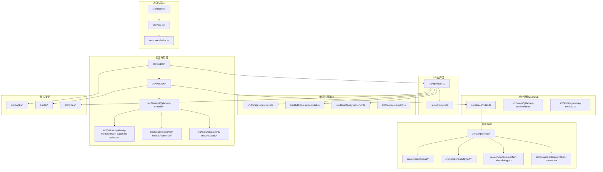

**图表来源**
- [src/main.tsx:1-50](file://frontend/src/main.tsx#L1-L50)
- [src/App.tsx:1-120](file://frontend/src/App.tsx#L1-L120)
- [src/routes/index.ts:1-200](file://frontend/src/routes/index.ts#L1-L200)
- [src/stores/index.ts:1-120](file://frontend/src/stores/index.ts#L1-L120)
- [src/api/client.ts:1-200](file://frontend/src/api/client.ts#L1-L200)
- [src/features/gateway-models/model-capability-editor.tsx:1-150](file://frontend/src/features/gateway-models/model-capability-editor.tsx#L1-L150)
- [src/lib/api-form-errors.ts:1-120](file://frontend/src/lib/api-form-errors.ts#L1-L120)
- [src/lib/fastapi-error-detail.ts:1-120](file://frontend/src/lib/fastapi-error-detail.ts#L1-L120)
- [src/lib/gateway-api-error.ts:1-120](file://frontend/src/lib/gateway-api-error.ts#L1-L120)
- [src/hooks/use-toast.ts:1-120](file://frontend/src/hooks/use-toast.ts#L1-L120)

**章节来源**
- [package.json:1-120](file://frontend/package.json#L1-L120)
- [vite.config.ts:1-120](file://frontend/vite.config.ts#L1-L120)
- [tsconfig.json:1-120](file://frontend/tsconfig.json#L1-L120)
- [tailwind.config.js:1-120](file://frontend/tailwind.config.js#L1-L120)
- [eslint.config.js:1-120](file://frontend/eslint.config.js#L1-L120)

## 核心组件
- 应用入口与渲染：通过Vite加载TSX入口，挂载根组件并启用Suspense容错。
- 路由与懒加载：基于路由配置实现页面级懒加载与骨架屏占位。
- 认证与主题：提供认证上下文与主题切换能力，贯穿全局。
- API客户端：统一HTTP请求封装、错误处理与拦截器链路。
- 状态管理：Zustand Store设计，按领域拆分，支持派生状态与订阅更新。
- 错误处理系统：专门的错误分类、表单错误映射、API错误详情处理。
- Toast通知系统：用户友好的错误提示和成功反馈机制。
- UI组件：基础按钮、输入框等原子组件，布局组件与表单组件形成组件库。
- 工具与Hooks：会话工具、日志、金额格式化、权限与Tab控制等。

**更新** 新增批量操作错误处理增强、异步操作健壮性改进、用户友好错误通知机制等核心功能模块。

**章节来源**
- [src/main.tsx:1-50](file://frontend/src/main.tsx#L1-L50)
- [src/App.tsx:1-120](file://frontend/src/App.tsx#L1-L120)
- [src/components/auth-provider.tsx:1-120](file://frontend/src/components/auth-provider.tsx#L1-L120)
- [src/components/theme-provider.tsx:1-120](file://frontend/src/components/theme-provider.tsx#L1-L120)
- [src/components/route-suspense-fallback.tsx:1-120](file://frontend/src/components/route-suspense-fallback.tsx#L1-L120)
- [src/api/client.ts:1-200](file://frontend/src/api/client.ts#L1-L200)
- [src/api/errors.ts:1-120](file://frontend/src/api/errors.ts#L1-L120)
- [src/stores/index.ts:1-120](file://frontend/src/stores/index.ts#L1-L120)
- [src/hooks/use-toast.ts:1-120](file://frontend/src/hooks/use-toast.ts#L1-L120)

## 架构总览
前端采用"入口-路由-页面/特性-组件-状态-API-类型"的分层架构，数据流自上而下传递，事件自下而上冒泡；状态在Zustand中集中管理，API通过客户端统一处理，UI组件遵循单一职责与组合优先原则。新增的错误处理系统确保了批量操作的健壮性和用户体验的友好性。

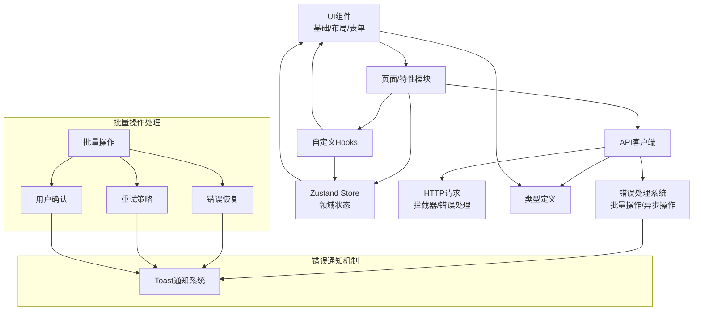

**图表来源**
- [src/components/ui/button.tsx:1-120](file://frontend/src/components/ui/button.tsx#L1-L120)
- [src/components/layout/header.tsx:1-120](file://frontend/src/components/layout/header.tsx#L1-L120)
- [src/stores/gateway-models.ts:1-200](file://frontend/src/stores/gateway-models.ts#L1-L200)
- [src/api/client.ts:1-200](file://frontend/src/api/client.ts#L1-L200)
- [src/types/gateway.ts:1-200](file://frontend/src/types/gateway.ts#L1-L200)
- [src/features/gateway-models/model-capability-editor.tsx:1-150](file://frontend/src/features/gateway-models/model-capability-editor.tsx#L1-L150)
- [src/lib/api-form-errors.ts:1-120](file://frontend/src/lib/api-form-errors.ts#L1-L120)
- [src/lib/fastapi-error-detail.ts:1-120](file://frontend/src/lib/fastapi-error-detail.ts#L1-L120)
- [src/lib/gateway-api-error.ts:1-120](file://frontend/src/lib/gateway-api-error.ts#L1-L120)

## 详细组件分析

### 路由与页面组织
- 路由配置：集中管理页面路径与懒加载策略，支持Suspense占位与错误边界。
- 页面模块：按功能域划分（如代理、网关、聊天、管理员），每个页面独立目录，便于维护与扩展。
- 页面示例：聊天页、管理员用户管理页、网关首页等，均通过懒加载与权限守卫组合使用。

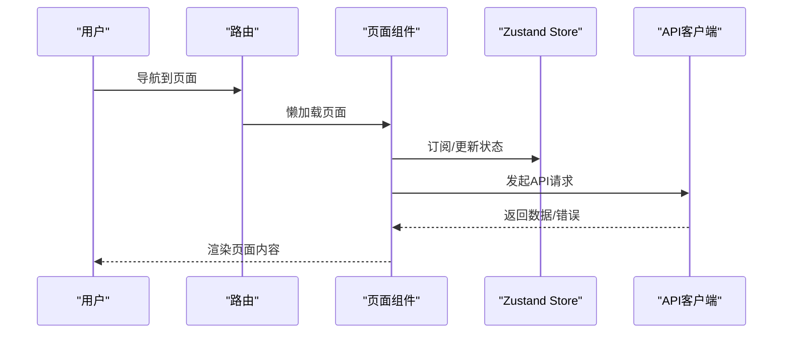

**图表来源**
- [src/routes/index.ts:1-200](file://frontend/src/routes/index.ts#L1-L200)
- [src/pages/gateway/index.tsx:1-120](file://frontend/src/pages/gateway/index.tsx#L1-L120)
- [src/pages/admin/users/index.tsx:1-120](file://frontend/src/pages/admin/users/index.tsx#L1-L120)
- [src/pages/chat/index.tsx:1-120](file://frontend/src/pages/chat/index.tsx#L1-L120)

**章节来源**
- [src/routes/index.ts:1-200](file://frontend/src/routes/index.ts#L1-L200)
- [src/pages/gateway/index.tsx:1-120](file://frontend/src/pages/gateway/index.tsx#L1-L120)
- [src/pages/admin/users/index.tsx:1-120](file://frontend/src/pages/admin/users/index.tsx#L1-L120)
- [src/pages/chat/index.tsx:1-120](file://frontend/src/pages/chat/index.tsx#L1-L120)

### Zustand状态管理与Store设计
- Store拆分：按领域拆分多个Store（如网关凭证、模型列表），避免全局状态臃肿。
- 订阅与派生：通过Zustand订阅机制实现UI自动更新；利用计算属性或派生状态减少重复逻辑。
- 交互流程：页面组件通过Hook访问Store，触发Action更新状态，其他订阅者自动感知变化。

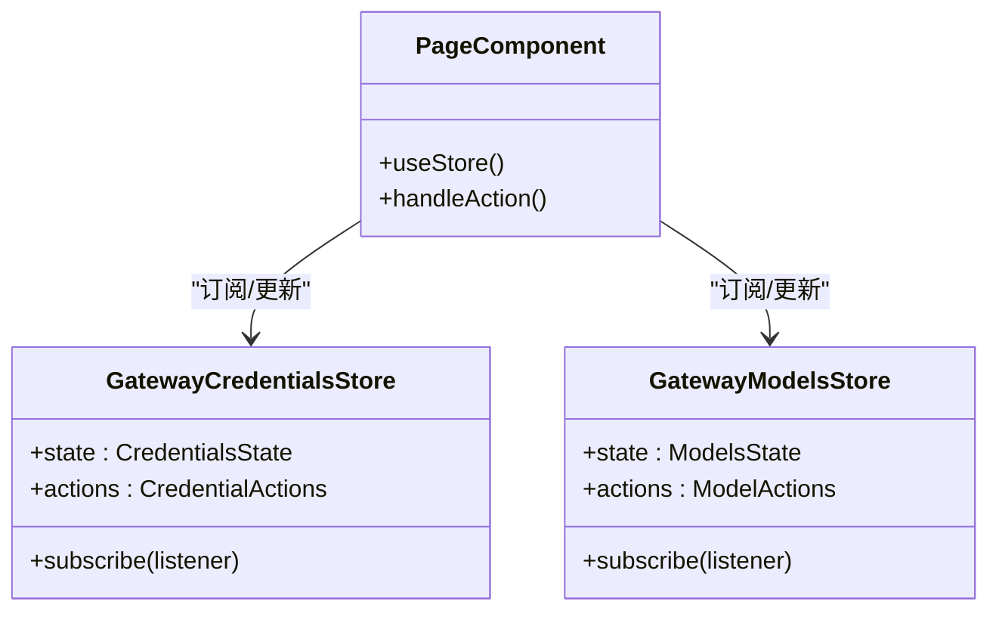

**图表来源**
- [src/stores/gateway-credentials.ts:1-200](file://frontend/src/stores/gateway-credentials.ts#L1-L200)
- [src/stores/gateway-models.ts:1-200](file://frontend/src/stores/gateway-models.ts#L1-L200)

**章节来源**
- [src/stores/index.ts:1-120](file://frontend/src/stores/index.ts#L1-L120)
- [src/stores/gateway-credentials.ts:1-200](file://frontend/src/stores/gateway-credentials.ts#L1-L200)
- [src/stores/gateway-models.ts:1-200](file://frontend/src/stores/gateway-models.ts#L1-L200)

### API客户端设计与实现
- 请求封装：统一基地址、超时、重试策略与Content-Type设置。
- 拦截器链：请求前注入认证头、序列化查询参数；响应后统一解析、错误分类与兜底处理。
- 错误处理：区分网络错误、业务错误与鉴权错误，提供统一错误UI与日志记录。
- 类型安全：所有请求/响应通过TypeScript类型约束，确保调用方契约一致。

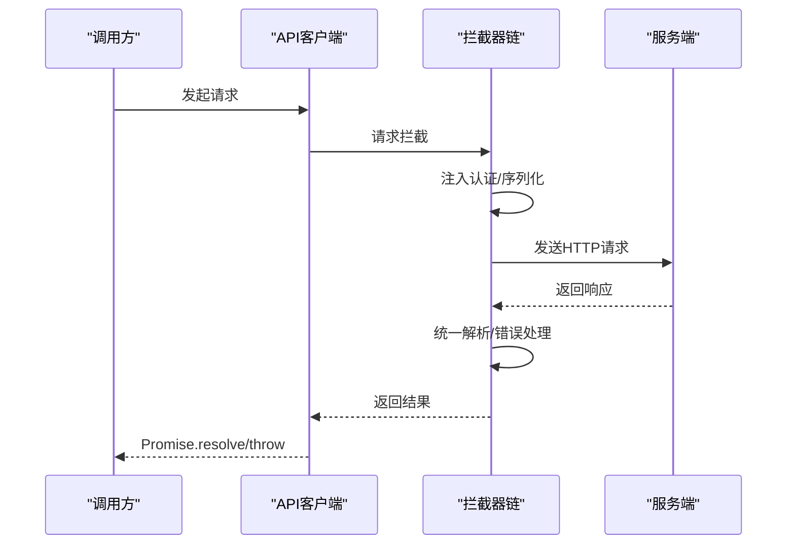

**图表来源**
- [src/api/client.ts:1-200](file://frontend/src/api/client.ts#L1-L200)
- [src/api/errors.ts:1-120](file://frontend/src/api/errors.ts#L1-L120)

**章节来源**
- [src/api/client.ts:1-200](file://frontend/src/api/client.ts#L1-L200)
- [src/api/errors.ts:1-120](file://frontend/src/api/errors.ts#L1-L120)

### UI组件系统设计理念
- 基础UI组件：Button、Input等原子组件，保持最小可变性，通过props控制外观与行为。
- 布局组件：Header、Sidebar等容器组件，负责页面骨架与导航。
- 表单组件：结合Form库与校验规则，提供受控与非受控两种模式。
- 设计系统：通过Tailwind与主题Provider实现一致性风格与暗色模式支持。

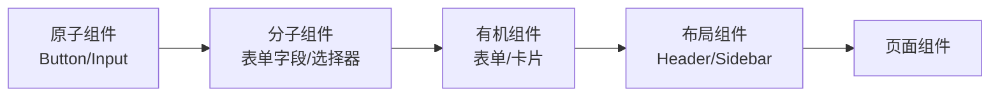

**图表来源**
- [src/components/ui/button.tsx:1-120](file://frontend/src/components/ui/button.tsx#L1-L120)
- [src/components/ui/input.tsx:1-120](file://frontend/src/components/ui/input.tsx#L1-L120)
- [src/components/layout/header.tsx:1-120](file://frontend/src/components/layout/header.tsx#L1-L120)
- [src/components/layout/sidebar.tsx:1-120](file://frontend/src/components/layout/sidebar.tsx#L1-L120)

**章节来源**
- [src/components/ui/button.tsx:1-120](file://frontend/src/components/ui/button.tsx#L1-L120)
- [src/components/ui/input.tsx:1-120](file://frontend/src/components/ui/input.tsx#L1-L120)
- [src/components/layout/header.tsx:1-120](file://frontend/src/components/layout/header.tsx#L1-L120)
- [src/components/layout/sidebar.tsx:1-120](file://frontend/src/components/layout/sidebar.tsx#L1-L120)

### 功能页面组织结构
- 代理管理：页面负责展示与操作代理相关数据，依赖Store与API。
- 网关配置：涵盖凭证、模型、预算、团队、用量等多个子模块，采用特性域划分。
- 用户管理：管理员用户管理页面，包含列表、编辑、权限控制等。
- 聊天页面：集成实时消息与模型选择，依赖会话与聊天相关Hook。

**更新** 新增思考参数UI配置相关的功能模块，包括模型能力编辑、个人模型管理、团队模型注册等专业功能。

**章节来源**
- [src/pages/admin/users/index.tsx:1-120](file://frontend/src/pages/admin/users/index.tsx#L1-L120)
- [src/pages/chat/index.tsx:1-120](file://frontend/src/pages/chat/index.tsx#L1-L120)
- [src/features/gateway-credentials/index.tsx:1-120](file://frontend/src/features/gateway-credentials/index.tsx#L1-L120)
- [src/features/gateway-models/index.tsx:1-120](file://frontend/src/features/gateway-models/index.tsx#L1-L120)

### TypeScript类型系统设计
- 领域类型：如网关凭证、模型、会话等类型定义，确保API契约稳定。
- 通用类型：分页、状态码、错误结构等复用类型，降低重复定义。
- 类型推导：结合API客户端返回值与响应体，实现强类型调用体验。

**章节来源**
- [src/types/gateway.ts:1-200](file://frontend/src/types/gateway.ts#L1-L200)
- [src/types/common.ts:1-200](file://frontend/src/types/common.ts#L1-L200)

## 批量操作错误处理增强

### 批量操作架构设计
批量操作错误处理系统通过专门的错误分类和恢复机制，确保在处理多个并发操作时的健壮性和用户体验。系统采用分层错误处理策略，从API层到UI层提供多级保护。

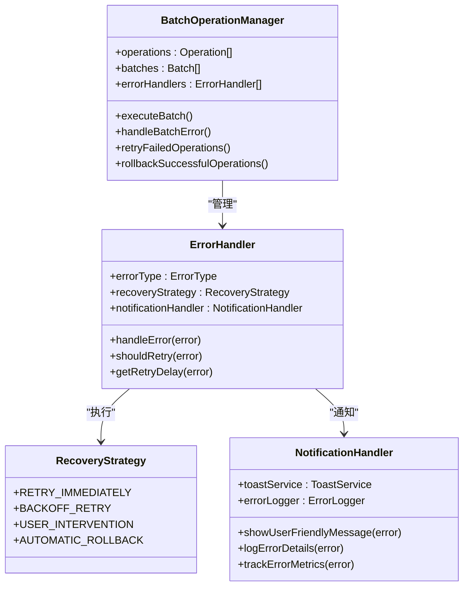

**图表来源**
- [src/lib/api-form-errors.ts:1-120](file://frontend/src/lib/api-form-errors.ts#L1-L120)
- [src/lib/fastapi-error-detail.ts:1-120](file://frontend/src/lib/fastapi-error-detail.ts#L1-L120)
- [src/lib/gateway-api-error.ts:1-120](file://frontend/src/lib/gateway-api-error.ts#L1-L120)

### 错误分类与处理策略
系统将批量操作中的错误分为以下几类，并采用相应的处理策略：

- **网络错误**：自动重试，指数退避，超过阈值后提示用户
- **业务逻辑错误**：单个操作失败不影响整体，记录错误并继续处理
- **认证授权错误**：立即停止批量操作，引导用户重新登录
- **系统资源错误**：降级处理，限制并发数，提供进度反馈

**章节来源**
- [src/lib/api-form-errors.ts:1-120](file://frontend/src/lib/api-form-errors.ts#L1-L120)
- [src/lib/fastapi-error-detail.ts:1-120](file://frontend/src/lib/fastapi-error-detail.ts#L1-L120)
- [src/lib/gateway-api-error.ts:1-120](file://frontend/src/lib/gateway-api-error.ts#L1-L120)

## 异步操作健壮性改进

### 并发控制与队列管理
异步操作通过智能的并发控制和队列管理机制，确保系统在高负载下的稳定性。系统实现了操作优先级排序、资源配额控制和超时管理。

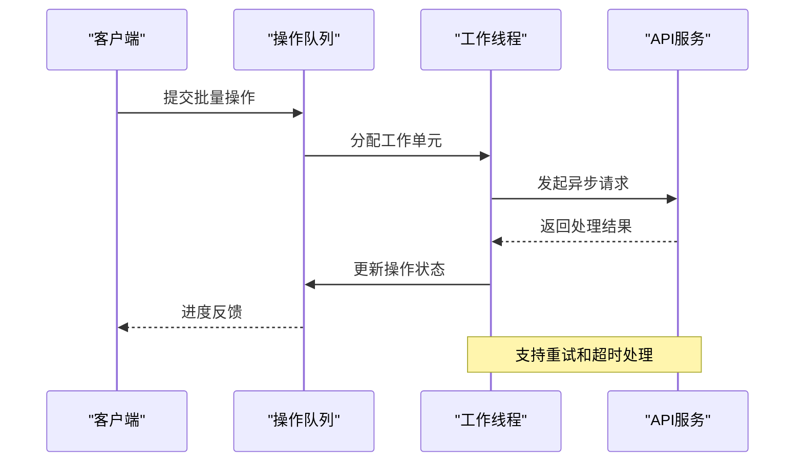

**图表来源**
- [src/api/client.ts:1-200](file://frontend/src/api/client.ts#L1-L200)
- [src/lib/session-utils.ts:1-120](file://frontend/src/lib/session-utils.ts#L1-L120)

### 操作恢复与回滚机制
系统实现了完善的操作恢复和回滚机制，确保部分失败时的数据一致性：

- **原子性保证**：关键操作在事务中执行，失败时自动回滚
- **幂等性设计**：重复操作不会产生副作用，支持安全重试
- **状态同步**：实时同步操作状态，避免数据不一致
- **进度持久化**：中断后可从上次进度继续执行

**章节来源**
- [src/api/client.ts:1-200](file://frontend/src/api/client.ts#L1-L200)
- [src/lib/session-utils.ts:1-120](file://frontend/src/lib/session-utils.ts#L1-L120)

## 用户友好错误通知机制

### Toast通知系统
Toast通知系统提供即时、非侵入式的用户反馈，支持不同类型的通知和自动消失机制。

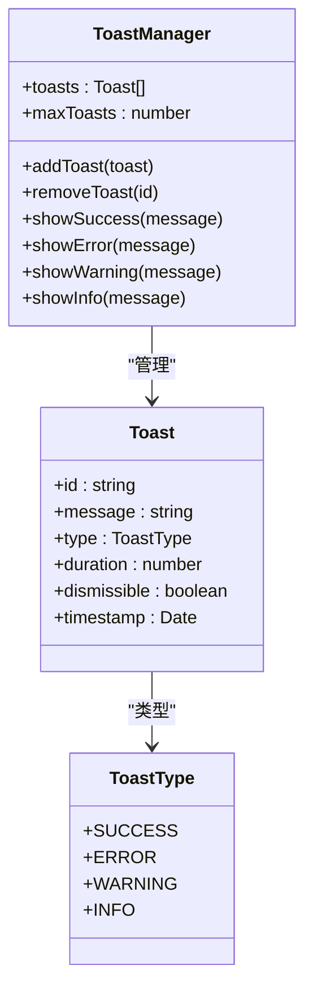

**图表来源**
- [src/hooks/use-toast.ts:1-120](file://frontend/src/hooks/use-toast.ts#L1-L120)

### 错误边界与降级处理
系统实现了多层次的错误边界和降级处理机制，确保在任何情况下都能提供良好的用户体验：

- **组件级错误边界**：捕获子组件错误，显示友好的错误界面
- **页面级错误边界**：处理整个页面的异常情况
- **应用级错误边界**：系统级异常的最终兜底处理
- **降级UI**：错误时显示简化版本的功能界面

**章节来源**
- [src/hooks/use-toast.ts:1-120](file://frontend/src/hooks/use-toast.ts#L1-L120)

### 确认对话框组件
确认对话框组件提供安全的用户确认机制，特别适用于危险或不可逆的操作。

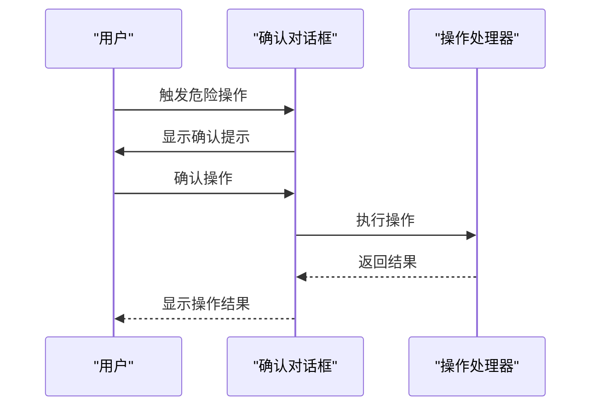

**图表来源**
- [src/components/confirm-alert-dialog.tsx:1-120](file://frontend/src/components/confirm-alert-dialog.tsx#L1-L120)

**章节来源**
- [src/components/confirm-alert-dialog.tsx:1-120](file://frontend/src/components/confirm-alert-dialog.tsx#L1-L120)

## 依赖关系分析
- 构建与打包：Vite作为构建工具，TS配置启用严格模式，Tailwind提供样式基础。
- 代码质量：ESLint配置统一规则，保证代码风格与潜在问题发现。
- 运行时依赖：React生态、Zustand、路由与UI库等，版本在package.json中统一管理。

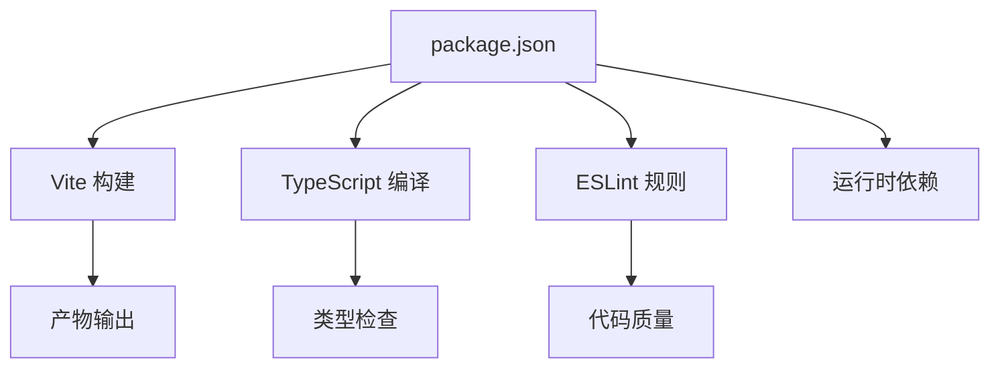

**图表来源**
- [package.json:1-120](file://frontend/package.json#L1-L120)
- [vite.config.ts:1-120](file://frontend/vite.config.ts#L1-L120)
- [tsconfig.json:1-120](file://frontend/tsconfig.json#L1-L120)
- [eslint.config.js:1-120](file://frontend/eslint.config.js#L1-L120)

**章节来源**
- [package.json:1-120](file://frontend/package.json#L1-L120)
- [vite.config.ts:1-120](file://frontend/vite.config.ts#L1-L120)
- [tsconfig.json:1-120](file://frontend/tsconfig.json#L1-L120)
- [eslint.config.js:1-120](file://frontend/eslint.config.js#L1-L120)

## 性能考虑
- 懒加载与Suspense：路由级懒加载与骨架屏提升首屏体验。
- 状态粒度：Zustand按领域拆分Store，避免无关状态导致的重渲染。
- 请求缓存：在API客户端层面实现幂等请求去重与缓存策略。
- 样式与体积：Tailwind按需引入，组件库按需加载，减少包体积。
- 开发体验：Vite热更新与快速冷启动，提升迭代效率。
- 错误处理性能：批量操作的错误处理采用异步处理，避免阻塞主线程。

**更新** 新增批量操作错误处理的性能优化策略，包括异步错误处理、内存管理、并发控制等。

## 故障排除指南
- 认证失败：检查认证Provider与会话工具，确认Token注入与刷新流程。
- 网络错误：查看API拦截器链与错误处理模块，定位超时、断网与跨域问题。
- 类型错误：核对类型定义与API响应结构，确保前后端契约一致。
- 性能问题：使用浏览器性能面板定位重渲染热点，优化Store订阅范围与组件层级。
- 批量操作失败：检查错误处理日志，确认重试策略和回滚机制是否正常工作。
- Toast通知问题：验证Toast服务配置，检查通知权限和浏览器兼容性。

**更新** 新增批量操作错误处理、异步操作健壮性、用户友好错误通知机制的故障排除指导。

**章节来源**
- [src/components/auth-provider.tsx:1-120](file://frontend/src/components/auth-provider.tsx#L1-L120)
- [src/lib/session-utils.ts:1-120](file://frontend/src/lib/session-utils.ts#L1-L120)
- [src/api/errors.ts:1-120](file://frontend/src/api/errors.ts#L1-L120)
- [src/lib/api-form-errors.ts:1-120](file://frontend/src/lib/api-form-errors.ts#L1-L120)

## 结论
该前端架构以React 18 + TypeScript + Vite为基础，结合Zustand实现清晰的状态管理，通过自研API客户端统一处理请求与错误，辅以完善的UI组件体系与功能页面模块。新增的批量操作错误处理增强、异步操作健壮性改进和用户友好错误通知机制，显著提升了系统的稳定性和用户体验。整体设计强调可维护性、可扩展性与开发体验，适合长期演进与团队协作。

**更新** 新增的批量操作错误处理系统、异步操作健壮性机制和用户友好错误通知系统，为AI Agent前端应用提供了企业级的健壮性保障，确保在复杂业务场景下的稳定运行。

## 附录
- 最佳实践与代码规范：遵循ESLint规则，组件命名与目录结构保持一致，类型定义先行，状态与副作用分离。
- 开发工具：Vite热更新、TypeScript类型检查、Tailwind样式调试、Sentry错误监控集成。
- 性能优化：懒加载、状态拆分、请求缓存、按需加载UI库与图标。
- **新增** 批量操作错误处理最佳实践：组件化设计、异步错误处理、状态管理规范化、权限控制颗粒化。
- **新增** 异步操作健壮性最佳实践：并发控制、队列管理、操作恢复、回滚机制。
- **新增** 用户友好错误通知最佳实践：Toast系统、错误边界、降级处理、确认对话框。