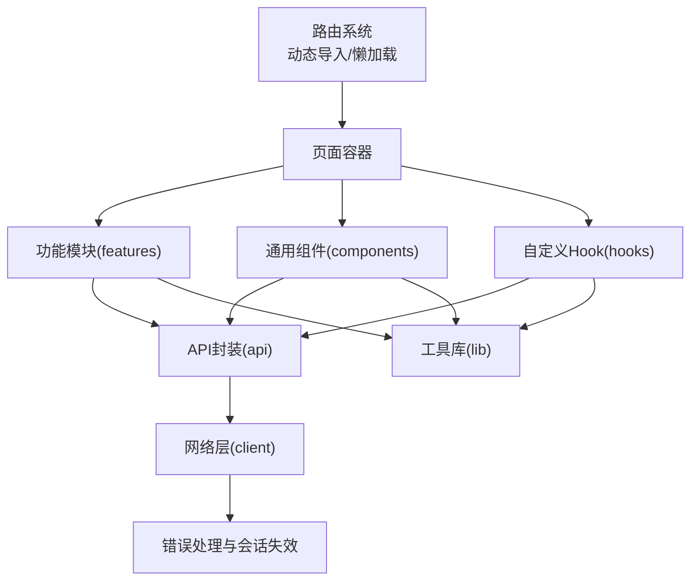
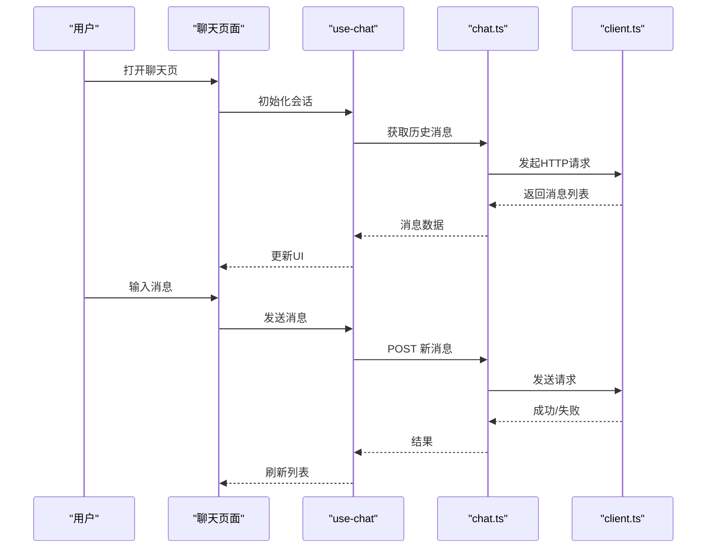
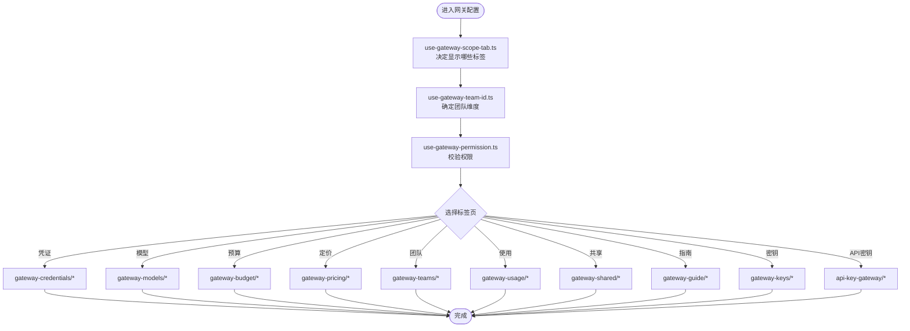
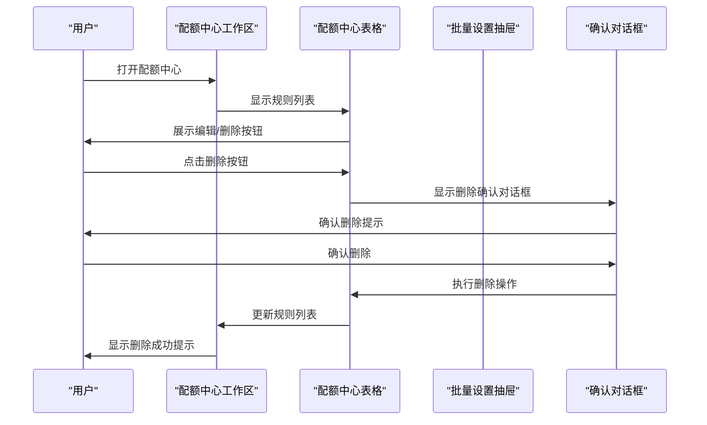
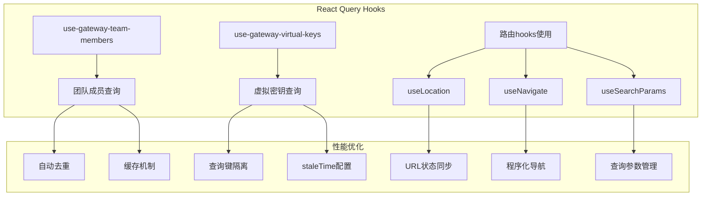
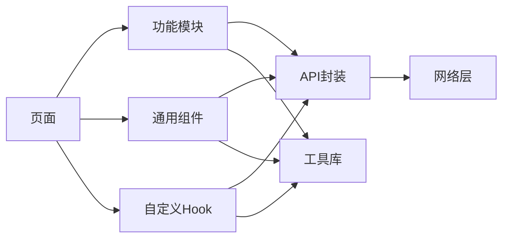

# 功能页面

<cite>
**本文引用的文件**
- [App.tsx](file://frontend/src/App.tsx)
- [main.tsx](file://frontend/src/main.tsx)
- [client.ts](file://frontend/src/api/client.ts)
- [paths.ts](file://frontend/src/api/paths.ts)
- [chat.ts](file://frontend/src/api/chat.ts)
- [agent.ts](file://frontend/src/api/agent.ts)
- [gateway.test.ts](file://frontend/src/api/gateway.test.ts)
- [adminUsers.ts](file://frontend/src/api/adminUsers.ts)
- [use-chat.ts](file://frontend/src/hooks/use-chat.ts)
- [use-copy-to-clipboard.ts](file://frontend/src/hooks/use-copy-to-clipboard.ts)
- [use-gateway-permission.ts](file://frontend/src/hooks/use-gateway-permission.ts)
- [use-gateway-scope-tab.ts](file://frontend/src/hooks/use-gateway-scope-tab.ts)
- [use-gateway-team-id.ts](file://frontend/src/hooks/use-gateway-team-id.ts)
- [use-listing-studio-capabilities.ts](file://frontend/src/hooks/use-listing-studio-capabilities.ts)
- [use-toast.ts](file://frontend/src/hooks/use-toast.ts)
- [use-gateway-team-members.ts](file://frontend/src/features/gateway-teams/use-gateway-team-members.ts)
- [use-gateway-virtual-keys.ts](file://frontend/src/features/gateway-keys/use-gateway-virtual-keys.ts)
- [budgets.tsx](file://frontend/src/pages/gateway/budgets.tsx)
- [logs.tsx](file://frontend/src/pages/gateway/logs.tsx)
- [lazy-with-reload.ts](file://frontend/src/lib/lazy-with-reload.ts)
- [session-invalidation.ts](file://frontend/src/lib/session-invalidation.ts)
- [gateway-v1-base-url.ts](file://frontend/src/lib/gateway-v1-base-url.ts)
- [gateway-api-error.ts](file://frontend/src/lib/gateway-api-error.ts)
- [money.ts](file://frontend/src/lib/money.ts)
- [pagination.ts](file://frontend/src/lib/pagination.ts)
- [model-selector.tsx](file://frontend/src/components/model-selector.tsx)
- [pagination-controls.tsx](file://frontend/src/components/pagination-controls.tsx)
- [confirm-alert-dialog.tsx](file://frontend/src/components/confirm-alert-dialog.tsx)
- [route-suspense-fallback.tsx](file://frontend/src/components/route-suspense-fallback.tsx)
- [require-platform-admin.tsx](file://frontend/src/components/require-platform-admin.tsx)
- [theme-provider.tsx](file://frontend/src/components/theme-provider.tsx)
- [auth-provider.tsx](file://frontend/src/components/auth-provider.tsx)
- [quota-center-workspace.tsx](file://frontend/src/features/gateway-budget/quota-center-workspace.tsx)
- [quota-center-table.tsx](file://frontend/src/features/gateway-budget/quota-center-table.tsx)
- [quota-card-grid.tsx](file://frontend/srcfeatures/gateway-budget/quota-card-grid.tsx)
- [quota-card-item.tsx](file://frontend/srcfeatures/gateway-budget/quota-card-item.tsx)
- [quota-overview-cards.tsx](file://frontend/srcfeatures/gateway-budget/quota-overview-cards.tsx)
- [quota-rule-utils.ts](file://frontend/srcfeatures/gateway-budget/quota-rule-utils.ts)
- [use-quota-center.ts](file://frontend/srcfeatures/gateway-budget/use-quota-center.ts)
- [quota-batch-drawer.tsx](file://frontend/srcfeatures/gateway-budget/quota-batch-drawer.tsx)
- [gateway-budget/index.tsx](file://frontend/srcfeatures/gateway-budget/index.tsx)
- [gateway-credentials/index.tsx](file://frontend/srcfeatures/gateway-credentials/index.tsx)
- [gateway-models/index.tsx](file://frontend/srcfeatures/gateway-models/index.tsx)
- [gateway-playground/index.tsx](file://frontend/srcfeatures/gateway-playground/index.tsx)
- [gateway-pricing/index.tsx](file://frontend/srcfeatures/gateway-pricing/index.tsx)
- [gateway-teams/index.tsx](file://frontend/srcfeatures/gateway-teams/index.tsx)
- [gateway-usage/index.tsx](file://frontend/srcfeatures/gateway-usage/index.tsx)
- [admin-users/index.tsx](file://frontend/srcfeatures/admin-users/index.tsx)
- [gateway-keys/index.tsx](file://frontend/srcfeatures/gateway-keys/index.tsx)
- [gateway-shared/index.tsx](file://frontend/srcfeatures/gateway-shared/index.tsx)
- [gateway-guide/index.tsx](file://frontend/srcfeatures/gateway-guide/index.tsx)
- [api-key-gateway/index.tsx](file://frontend/srcfeatures/api-key-gateway/index.tsx)
- [chat/index.tsx](file://frontend/srcpages/chat/index.tsx)
- [gateway/index.tsx](file://frontend/srcpages/gateway/index.tsx)
- [agents/index.tsx](file://frontend/srcpages/agents/index.tsx)
- [admin/index.tsx](file://frontend/srcpages/admin/index.tsx)
- [auth/index.tsx](file://frontend/srcpages/auth/index.tsx)
- [listing-studio/index.tsx](file://frontend/srcpages/listing-studio/index.tsx)
- [settings/index.tsx](file://frontend/srcpages/settings/index.tsx)
- [video-tasks/index.tsx](file://frontend/srcpages/video-tasks/index.tsx)
- [not-found/index.tsx](file://frontend/srcpages/not-found/index.tsx)
- [mcp/index.tsx](file://frontend/srcpages/mcp/index.tsx)
- [studio/components/index.tsx](file://frontend/srcpages/studio/components/index.tsx)
- [route-topology-editor.tsx](file://frontend/srcfeatures/gateway-models/routes/route-topology-editor.tsx)
- [route-workspace.tsx](file://frontend/srcfeatures/gateway-models/routes/route-workspace.tsx)
- [create-route-panel.tsx](file://frontend/srcfeatures/gateway-models/routes/create-route-panel.tsx)
- [gateway-model-list-shell.tsx](file://frontend/srcfeatures/gateway-models/list/gateway-model-list-shell.tsx)
</cite>

## 更新摘要
**所做更改**
- 新增React Query hooks集成：引入use-gateway-team-members和use-gateway-virtual-keys两个React Query hooks
- 虚拟密钥hooks重构：use-gateway-virtual-keys提供团队级别的虚拟密钥查询功能
- 路由hooks使用：在gateway/logs.tsx中使用useLocation、useNavigate、useSearchParams进行路由状态管理
- 配额中心hooks重构：配额中心工作区的hooks得到增强，支持更复杂的查询和状态管理
- 性能优化：React Query提供缓存、去重和自动刷新机制

## 目录
1. [引言](#引言)
2. [项目结构](#项目结构)
3. [核心组件](#核心组件)
4. [架构总览](#架构总览)
5. [详细组件分析](#详细组件分析)
6. [依赖分析](#依赖分析)
7. [性能考虑](#性能考虑)
8. [故障排查指南](#故障排查指南)
9. [结论](#结论)
10. [附录](#附录)

## 引言
本文件为功能页面系统的全面架构文档，聚焦前端页面层的组织与设计，覆盖聊天页面、代理管理页面、网关配置页面与用户管理页面的结构与交互；阐述代理特性、网关预算管理、凭证管理、模型管理等独立功能模块的模块化实现；说明页面路由的配置与懒加载策略（动态导入、路由守卫与权限控制）；总结自定义 Hook 的设计与复用模式（数据获取、表单处理、状态管理）；梳理页面常量与配置的管理策略（API 端点、表单配置、业务规则常量）；并提供页面开发最佳实践、性能优化技巧以及页面间导航与数据传递机制。

**更新** 本次更新重点关注React Query hooks的集成，包括虚拟密钥和路由hooks的使用，以及配额中心的hooks重构，显著提升了数据获取的性能和用户体验。

## 项目结构
前端采用按"功能域"划分的模块化组织方式：pages 定义顶层页面入口，features 定义可复用的功能模块，hooks 提供跨页面的通用逻辑，components 提供 UI 组合与通用控件，api 封装后端接口，lib 提供工具与类型支持，routes 存放路由配置（根据目录存在情况推断）。

```mermaid
graph TB
subgraph "应用入口"
A["main.tsx"]
B["App.tsx"]
end
subgraph "页面层"
P1["pages/chat/*"]
P2["pages/gateway/*"]
P3["pages/agents/*"]
P4["pages/admin/*"]
P5["pages/auth/*"]
P6["pages/listing-studio/*"]
P7["pages/settings/*"]
P8["pages/video-tasks/*"]
P9["pages/not-found/*"]
P10["pages/mcp/*"]
P11["pages/studio/components/*"]
end
subgraph "功能模块(features)"
F1["features/gateway-budget/*"]
F2["features/gateway-credentials/*"]
F3["features/gateway-models/*"]
F4["features/gateway-playground/*"]
F5["features/gateway-pricing/*"]
F6["features/gateway-teams/*"]
F7["features/gateway-usage/*"]
F8["features/admin-users/*"]
F9["features/gateway-keys/*"]
F10["features/gateway-shared/*"]
F11["features/gateway-guide/*"]
F12["features/api-key-gateway/*"]
end
subgraph "通用层"
H["hooks/*"]
C["components/*"]
API["api/*"]
L["lib/*"]
end
A --> B
B --> P1
B --> P2
B --> P3
B --> P4
B --> P5
B --> P6
B --> P7
B --> P8
B --> P9
B --> P10
B --> P11
P2 --> F1
P2 --> F2
P2 --> F3
P2 --> F4
P2 --> F5
P2 --> F6
P2 --> F7
P2 --> F8
P2 --> F9
P2 --> F10
P2 --> F11
P2 --> F12
P1 --> H
P2 --> H
P3 --> H
P4 --> H
P5 --> H
P6 --> H
P7 --> H
P8 --> H
P9 --> H
P10 --> H
P11 --> H
P1 --> C
P2 --> C
P3 --> C
P4 --> C
P5 --> C
P6 --> C
P7 --> C
P8 --> C
P9 --> C
P10 --> C
P11 --> C
P1 --> API
P2 --> API
P3 --> API
P4 --> API
P5 --> API
P6 --> API
P7 --> API
P8 --> API
P9 --> API
P10 --> API
P11 --> API
H --> L
C --> L
API --> L
```

**图表来源**
- [main.tsx](file://frontend/src/main.tsx)
- [App.tsx](file://frontend/src/App.tsx)
- [chat/index.tsx](file://frontend/srcpages/chat/index.tsx)
- [gateway/index.tsx](file://frontend/srcpages/gateway/index.tsx)
- [admin-users/index.tsx](file://frontend/srcfeatures/admin-users/index.tsx)
- [gateway-credentials/index.tsx](file://frontend/srcfeatures/gateway-credentials/index.tsx)
- [gateway-models/index.tsx](file://frontend/srcfeatures/gateway-models/index.tsx)
- [gateway-playground/index.tsx](file://frontend/srcfeatures/gateway-playground/index.tsx)
- [gateway-pricing/index.tsx](file://frontend/srcfeatures/gateway-pricing/index.tsx)
- [gateway-teams/index.tsx](file://frontend/srcfeatures/gateway-teams/index.tsx)
- [gateway-usage/index.tsx](file://frontend/srcfeatures/gateway-usage/index.tsx)
- [gateway-keys/index.tsx](file://frontend/srcfeatures/gateway-keys/index.tsx)
- [gateway-shared/index.tsx](file://frontend/srcfeatures/gateway-shared/index.tsx)
- [gateway-guide/index.tsx](file://frontend/srcfeatures/gateway-guide/index.tsx)
- [api-key-gateway/index.tsx](file://frontend/srcfeatures/api-key-gateway/index.tsx)

**章节来源**
- [main.tsx](file://frontend/src/main.tsx)
- [App.tsx](file://frontend/src/App.tsx)

## 核心组件
- 应用入口与渲染
  - 入口文件负责挂载根组件与主题/认证提供器，确保全局样式与权限上下文可用。
- 页面容器
  - 各页面以独立目录组织，包含路由参数、查询参数解析、页面级状态与布局。
- 功能模块
  - features 下的模块以"领域+能力"命名，封装独立的 CRUD、配置与视图逻辑，便于复用与测试。
- 通用组件
  - components 提供可复用 UI 控件与布局，如分页、模型选择器、确认对话框、路由占位等。
- 自定义 Hook
  - hooks 聚合跨页面的数据获取、表单处理、权限与状态管理逻辑，提升代码复用与一致性。
- 工具库
  - lib 提供网络错误处理、金额格式化、分页计算、会话失效处理、懒加载增强等工具。

**章节来源**
- [main.tsx](file://frontend/src/main.tsx)
- [App.tsx](file://frontend/src/App.tsx)
- [theme-provider.tsx](file://frontend/srccomponents/theme-provider.tsx)
- [auth-provider.tsx](file://frontend/srccomponents/auth-provider.tsx)
- [route-suspense-fallback.tsx](file://frontend/srccomponents/route-suspense-fallback.tsx)

## 架构总览
页面层通过路由驱动，结合 Suspense 与懒加载实现按需加载；功能模块以组合式设计嵌入页面；通用组件与 Hook 提升一致性和可维护性；API 层统一管理端点与错误处理；工具库提供横切关注点支持。

**图表来源**
- [lazy-with-reload.ts](file://frontend/srclib/lazy-with-reload.ts)
- [client.ts](file://frontend/srcapi/client.ts)
- [gateway-api-error.ts](file://frontend/srclib/gateway-api-error.ts)
- [session-invalidation.ts](file://frontend/srclib/session-invalidation.ts)

## 详细组件分析

### 聊天页面
- 设计模式
  - 基于消息列表与输入区域的双栏布局；支持实时消息流与历史回放；通过 Hook 管理会话状态与发送流程。
  - 使用分页组件进行历史消息加载；模型选择器切换推理模型；复制到剪贴板 Hook 提升交互效率。
- 关键实现要点
  - 数据流：消息获取 → 渲染 → 用户输入 → 发送请求 → 实时更新。
  - 错误处理：网络异常、权限不足、服务不可用的提示与重试。
  - 性能：虚拟滚动用于长历史消息；图片懒加载；输入防抖。
- 依赖关系
  - use-chat.ts：消息获取与发送；pagination-controls.tsx：分页；model-selector.tsx：模型切换；use-copy-to-clipboard.ts：复制；gateway-v1-base-url.ts：端点基址。

**图表来源**
- [chat/index.tsx](file://frontend/srcpages/chat/index.tsx)
- [use-chat.ts](file://frontend/srchooks/use-chat.ts)
- [chat.ts](file://frontend/srcapi/chat.ts)
- [client.ts](file://frontend/srcapi/client.ts)

**章节来源**
- [chat/index.tsx](file://frontend/srcpages/chat/index.tsx)
- [use-chat.ts](file://frontend/srchooks/use-chat.ts)
- [chat.ts](file://frontend/srcapi/chat.ts)
- [pagination-controls.tsx](file://frontend/srccomponents/pagination-controls.tsx)
- [model-selector.tsx](file://frontend/srccomponents/model-selector.tsx)
- [use-copy-to-clipboard.ts](file://frontend/srchooks/use-copy-to-clipboard.ts)
- [gateway-v1-base-url.ts](file://frontend/srclib/gateway-v1-base-url.ts)

### 代理管理页面
- 设计模式
  - 列表/详情/编辑三段式结构；支持批量操作与筛选；基于表单配置驱动的新增/编辑流程。
- 关键实现要点
  - 表单配置来源于常量与后端返回；校验规则在 Hook 中集中处理；权限控制在页面与功能模块中分层实现。
- 依赖关系
  - agent.ts：代理相关 API；features/admin-users：用户关联；components/ui：通用表单控件。

**章节来源**
- [agents/index.tsx](file://frontend/srcpages/agents/index.tsx)
- [agent.ts](file://frontend/srcapi/agent.ts)
- [admin-users/index.tsx](file://frontend/srcfeatures/admin-users/index.tsx)

### 网关配置页面
- 设计模式
  - 多标签页（凭证、模型、预算、定价、团队、使用、共享等）的配置中心；每个标签页为独立功能模块，职责单一且可复用。
- 关键实现要点
  - 权限 Hook：use-gateway-permission.ts 与 use-gateway-scope-tab.ts 协同控制可见性与可编辑性。
  - 团队上下文：use-gateway-team-id.ts 提供当前团队维度，贯穿所有网关功能。
  - 错误处理：gateway-api-error.ts 统一解析网关类错误并转为用户可读提示。
- 依赖关系
  - features 下各模块：gateway-credentials、gateway-models、gateway-budget、gateway-pricing、gateway-teams、gateway-usage、gateway-shared、gateway-guide、gateway-keys、api-key-gateway。
  - hooks：use-gateway-permission.ts、use-gateway-scope-tab.ts、use-gateway-team-id.ts。
  - lib：gateway-v1-base-url.ts、gateway-api-error.ts、money.ts、pagination.ts。

**图表来源**
- [gateway/index.tsx](file://frontend/srcpages/gateway/index.tsx)
- [use-gateway-permission.ts](file://frontend/srchooks/use-gateway-permission.ts)
- [use-gateway-scope-tab.ts](file://frontend/srchooks/use-gateway-scope-tab.ts)
- [use-gateway-team-id.ts](file://frontend/srchooks/use-gateway-team-id.ts)
- [gateway-credentials/index.tsx](file://frontend/srcfeatures/gateway-credentials/index.tsx)
- [gateway-models/index.tsx](file://frontend/srcfeatures/gateway-models/index.tsx)
- [gateway-budget/index.tsx](file://frontend/srcfeatures/gateway-budget/index.tsx)
- [gateway-pricing/index.tsx](file://frontend/srcfeatures/gateway-pricing/index.tsx)
- [gateway-teams/index.tsx](file://frontend/srcfeatures/gateway-teams/index.tsx)
- [gateway-usage/index.tsx](file://frontend/srcfeatures/gateway-usage/index.tsx)
- [gateway-shared/index.tsx](file://frontend/srcfeatures/gateway-shared/index.tsx)
- [gateway-guide/index.tsx](file://frontend/srcfeatures/gateway-guide/index.tsx)
- [gateway-keys/index.tsx](file://frontend/srcfeatures/gateway-keys/index.tsx)
- [api-key-gateway/index.tsx](file://frontend/srcfeatures/api-key-gateway/index.tsx)

**章节来源**
- [gateway/index.tsx](file://frontend/srcpages/gateway/index.tsx)
- [use-gateway-permission.ts](file://frontend/srchooks/use-gateway-permission.ts)
- [use-gateway-scope-tab.ts](file://frontend/srchooks/use-gateway-scope-tab.ts)
- [use-gateway-team-id.ts](file://frontend/srchooks/use-gateway-team-id.ts)
- [gateway-api-error.ts](file://frontend/srclib/gateway-api-error.ts)
- [money.ts](file://frontend/srclib/money.ts)
- [pagination.ts](file://frontend/srclib/pagination.ts)

### 用户管理页面
- 设计模式
  - 列表展示与详情编辑分离；支持角色分配与权限变更；与网关团队维度联动。
- 关键实现要点
  - 与网关团队上下文绑定；权限校验前置；批量操作与单条操作统一处理。
- 依赖关系
  - adminUsers.ts：用户管理 API； features/gateway-teams：团队信息； components/ui：分页与表单控件。

**章节来源**
- [admin/index.tsx](file://frontend/srcpages/admin/index.tsx)
- [admin-users/index.tsx](file://frontend/srcfeatures/admin-users/index.tsx)
- [adminUsers.ts](file://frontend/srcapi/adminUsers.ts)

### 认证与权限控制
- 设计模式
  - 认证提供器包裹应用，统一处理登录态与会话失效；路由层通过守卫实现访问控制；页面层通过 require-platform-admin.tsx 进行平台管理员权限校验。
- 关键实现要点
  - 会话失效自动跳转登录；错误提示统一；权限不足时隐藏或禁用相关操作。
- 依赖关系
  - auth-provider.tsx：认证上下文； require-platform-admin.tsx：平台管理员守卫； session-invalidation.ts：会话失效处理。

**章节来源**
- [auth-provider.tsx](file://frontend/srccomponents/auth-provider.tsx)
- [require-platform-admin.tsx](file://frontend/srccomponents/require-platform-admin.tsx)
- [session-invalidation.ts](file://frontend/srclib/session-invalidation.ts)

### 路由与懒加载
- 设计模式
  - 使用动态导入与 Suspense 实现页面级懒加载；路由守卫在进入前校验权限；错误边界兜底 404。
- 关键实现要点
  - 路由占位：route-suspense-fallback.tsx 提供加载态；懒加载增强：lazy-with-reload.ts 支持热更新场景。
- 依赖关系
  - lazy-with-reload.ts：增强懒加载； route-suspense-fallback.tsx：加载占位； not-found/index.tsx：404 页面。

**章节来源**
- [lazy-with-reload.ts](file://frontend/srclib/lazy-with-reload.ts)
- [route-suspense-fallback.tsx](file://frontend/srccomponents/route-suspense-fallback.tsx)
- [not-found/index.tsx](file://frontend/srcpages/not-found/index.tsx)

### 自定义 Hook 设计与复用
- use-chat.ts：封装消息获取、发送、状态管理；支持分页与实时更新。
- use-copy-to-clipboard.ts：封装复制逻辑与反馈。
- use-gateway-permission.ts：封装网关权限判断与缓存。
- use-gateway-scope-tab.ts：封装标签页可见性与默认项。
- use-gateway-team-id.ts：封装团队维度选择与持久化。
- use-listing-studio-capabilities.ts：封装 Listing Studio 能力检测。
- use-toast.ts：封装通知与错误提示。
- **新增React Query hooks**：
  - use-gateway-team-members.ts：使用React Query获取团队成员列表，支持去重和缓存
  - use-gateway-virtual-keys.ts：使用React Query获取团队虚拟密钥列表，支持查询键和过期时间配置
- 复用模式：将副作用与状态收敛到 Hook，页面仅负责渲染与事件调度；跨页面共享逻辑集中在 hooks 层。

**更新** 新增的React Query hooks提供了更强的数据获取能力，包括自动缓存、去重和智能刷新机制。

**章节来源**
- [use-chat.ts](file://frontend/srchooks/use-chat.ts)
- [use-copy-to-clipboard.ts](file://frontend/srchooks/use-copy-to-clipboard.ts)
- [use-gateway-permission.ts](file://frontend/srchooks/use-gateway-permission.ts)
- [use-gateway-scope-tab.ts](file://frontend/srchooks/use-gateway-scope-tab.ts)
- [use-gateway-team-id.ts](file://frontend/srchooks/use-gateway-team-id.ts)
- [use-listing-studio-capabilities.ts](file://frontend/srchooks/use-listing-studio-capabilities.ts)
- [use-toast.ts](file://frontend/srchooks/use-toast.ts)
- [use-gateway-team-members.ts](file://frontend/srcfeatures/gateway-teams/use-gateway-team-members.ts)
- [use-gateway-virtual-keys.ts](file://frontend/srcfeatures/gateway-keys/use-gateway-virtual-keys.ts)

### 页面常量与配置管理
- API 端点定义
  - paths.ts：集中定义后端 API 路径；client.ts：封装 HTTP 客户端与拦截器；gateway.test.ts：测试用例验证端点正确性。
- 表单配置与业务规则
  - features 下各模块内部维护表单字段、校验规则与默认值；components 下提供通用表单控件与校验工具。
- 金额与分页
  - money.ts：金额格式化与计算；pagination.ts：分页参数与页码计算。

**章节来源**
- [paths.ts](file://frontend/srcapi/paths.ts)
- [client.ts](file://frontend/srcapi/client.ts)
- [gateway.test.ts](file://frontend/srcapi/gateway.test.ts)
- [money.ts](file://frontend/srclib/money.ts)
- [pagination.ts](file://frontend/srclib/pagination.ts)

### 配额中心工作区重大UI增强

**更新** 本次更新重点改进了配额中心工作区的用户体验，新增多项重要功能增强：

#### 配额中心工作区（QuotaCenterWorkspace）
- 新增确认对话框：支持单条和批量删除操作的确认机制
- 增强编辑/删除功能：表格和卡片视图都支持规则的编辑和删除操作
- 改进概览卡片：成员模式下简化为关注个人配额指标
- 支持多种视图模式：表格和卡片两种展示方式自由切换

#### 配额中心表格（QuotaCenterTable）
- 新增批量删除功能：支持多选规则的批量删除操作
- 增强规则来源识别：新增"来源"列，区分计划类配额与自定义配额
- 改进编辑/删除按钮：仅对可编辑的规则显示相应操作按钮
- 优化计划规则管理：为计划类规则提供直接跳转到对应管理页面的链接

#### 配额卡网格（QuotaCardGrid）
- 完整支持编辑/删除功能：每个卡片都支持编辑和删除操作
- 增强分组和排序功能：支持按模型、主体、凭据、层级分组，以及使用率排序
- 改进平均使用率计算：为每个分组计算并显示平均使用率

#### 配额卡单项（QuotaCardItem）
- 完整的操作按钮：支持编辑和删除功能
- 改进计划规则标识：清晰显示计划类配额的来源信息
- 优化布局设计：更好的视觉层次和信息密度

#### 配额概览卡片（QuotaOverviewCards）
- 成员模式简化：在成员模式下仅显示个人相关的配额指标
- 个人视角优化：显示个人配额数量、本月已用金额和即将重置的配额数量

#### 批量设置抽屉（QuotaBatchDrawer）
- 增强搜索过滤：支持成员、Key、凭据的模糊搜索过滤
- 改进凭据选项：在成员模式下自动过滤只能本人使用的凭据
- 优化预填功能：支持从其他页面跳转时的自动预填和打开

**图表来源**
- [quota-center-workspace.tsx](file://frontend/srcfeatures/gateway-budget/quota-center-workspace.tsx)
- [quota-center-table.tsx](file://frontend/srcfeatures/gateway-budget/quota-center-table.tsx)
- [quota-card-grid.tsx](file://frontend/srcfeatures/gateway-budget/quota-card-grid.tsx)
- [quota-card-item.tsx](file://frontend/srcfeatures/gateway-budget/quota-card-item.tsx)
- [quota-overview-cards.tsx](file://frontend/srcfeatures/gateway-budget/quota-overview-cards.tsx)
- [quota-batch-drawer.tsx](file://frontend/srcfeatures/gateway-budget/quota-batch-drawer.tsx)

**章节来源**
- [quota-center-workspace.tsx](file://frontend/srcfeatures/gateway-budget/quota-center-workspace.tsx)
- [quota-center-table.tsx](file://frontend/srcfeatures/gateway-budget/quota-center-table.tsx)
- [quota-card-grid.tsx](file://frontend/srcfeatures/gateway-budget/quota-card-grid.tsx)
- [quota-card-item.tsx](file://frontend/srcfeatures/gateway-budget/quota-card-item.tsx)
- [quota-overview-cards.tsx](file://frontend/srcfeatures/gateway-budget/quota-overview-cards.tsx)
- [quota-batch-drawer.tsx](file://frontend/srcfeatures/gateway-budget/quota-batch-drawer.tsx)
- [use-quota-center.ts](file://frontend/srcfeatures/gateway-budget/use-quota-center.ts)
- [quota-rule-utils.ts](file://frontend/srcfeatures/gateway-budget/quota-rule-utils.ts)

### React Query Hooks集成

**更新** 新增React Query hooks集成，显著提升了数据获取的性能和用户体验：

#### 团队成员hooks（use-gateway-team-members）
- 基于React Query的团队成员查询，支持自动去重和缓存
- 查询键设计：['gateway', 'team-members', teamId]确保唯一性
- 条件启用：只有当teamId有效时才执行查询
- 性能优化：利用React Query的缓存机制避免重复请求

#### 虚拟密钥hooks（use-gateway-virtual-keys）
- 团队级别的虚拟密钥查询，支持React Query的去重和缓存
- 查询键设计：['gateway', 'keys', teamId]确保查询隔离
- 配置选项：支持enabled和staleTime配置，灵活控制查询行为
- 性能优化：staleTime配置避免频繁刷新，提升用户体验

#### 路由hooks使用
- 在gateway/logs.tsx中使用useLocation、useNavigate、useSearchParams进行路由状态管理
- 支持keepPreviousData选项，避免数据闪烁
- 结合React Router进行URL状态同步

**图表来源**
- [use-gateway-team-members.ts](file://frontend/srcfeatures/gateway-teams/use-gateway-team-members.ts)
- [use-gateway-virtual-keys.ts](file://frontend/srcfeatures/gateway-keys/use-gateway-virtual-keys.ts)
- [logs.tsx](file://frontend/srcpages/gateway/logs.tsx)

**章节来源**
- [use-gateway-team-members.ts](file://frontend/srcfeatures/gateway-teams/use-gateway-team-members.ts)
- [use-gateway-virtual-keys.ts](file://frontend/srcfeatures/gateway-keys/use-gateway-virtual-keys.ts)
- [logs.tsx](file://frontend/srcpages/gateway/logs.tsx)

## 依赖分析
- 组件耦合
  - 页面对功能模块为组合依赖，模块对工具库为横向依赖；组件对 API 为单向依赖。
- 外部依赖
  - React 生态（Suspense、Hooks）、路由（动态导入）、UI 组件库（通过 components/ui 汇聚）、React Query（数据获取）。
- 循环依赖
  - 通过 hooks 与 lib 抽象横切逻辑，避免页面与模块之间的循环调用。

**图表来源**
- [client.ts](file://frontend/srcapi/client.ts)
- [paths.ts](file://frontend/srcapi/paths.ts)
- [use-chat.ts](file://frontend/srchooks/use-chat.ts)
- [pagination-controls.tsx](file://frontend/srccomponents/pagination-controls.tsx)

**章节来源**
- [client.ts](file://frontend/srcapi/client.ts)
- [paths.ts](file://frontend/srcapi/paths.ts)

## 性能考虑
- 代码分割
  - 页面级懒加载减少首屏体积；按需导入功能模块；路由占位避免白屏。
- 图片与媒体
  - 图片懒加载与骨架屏；视频任务页面按需加载大文件。
- 列表性能
  - 虚拟滚动处理长列表；分页加载与本地缓存；避免不必要的重渲染。
- 状态与副作用
  - 将副作用收敛到 Hook；合理使用 useMemo/useCallback；避免在渲染阶段发起网络请求。
- 缓存与重试
  - 对稳定数据进行内存缓存；对幂等请求支持自动重试；对非幂等请求提供确认与撤销。
- **React Query性能优化**
  - **更新** 新增React Query hooks提供自动缓存和去重机制，显著减少重复请求
  - 查询键设计确保数据隔离和唯一性，避免缓存污染
  - staleTime配置平衡数据新鲜度和性能
  - enabled选项支持条件查询，避免无效请求
- **配额中心性能优化**
  - **更新** 新增确认对话框减少误操作带来的重复请求
  - 批量删除功能支持异步处理，避免长时间阻塞UI
  - 成员模式下的概览卡片简化数据计算，提升响应速度
  - 搜索过滤功能支持防抖，减少频繁的API调用

## 故障排查指南
- 登录态与会话失效
  - 会话失效自动跳转登录；错误提示统一；必要时刷新页面恢复。
- 网关错误
  - 使用 gateway-api-error.ts 解析错误并转为用户可读提示；区分网络错误与业务错误。
- 端点问题
  - 通过 paths.ts 校验端点拼写；client.ts 检查请求头与拦截器；gateway.test.ts 验证端点行为。
- 权限问题
  - 检查 use-gateway-permission.ts 与 require-platform-admin.tsx 的权限判定逻辑；确认团队维度是否正确。
- **React Query相关问题**
  - **更新** 检查查询键设计是否正确，确保数据隔离和唯一性
  - 验证enabled选项配置，确保条件查询正常工作
  - 确认staleTime配置是否合理，平衡数据新鲜度和性能
  - 检查查询缓存状态，避免缓存污染
- **配额中心问题**
  - **更新** 检查确认对话框的触发条件，确保只有可删除的规则才会显示删除按钮
  - 验证批量删除功能的异步处理，确保删除结果正确反馈
  - 确认成员模式下的凭据过滤逻辑，避免显示他人创建的凭据
  - 检查概览卡片的数据计算，确保在成员模式下只显示个人相关指标

**章节来源**
- [session-invalidation.ts](file://frontend/srclib/session-invalidation.ts)
- [gateway-api-error.ts](file://frontend/srclib/gateway-api-error.ts)
- [paths.ts](file://frontend/srcapi/paths.ts)
- [gateway.test.ts](file://frontend/srcapi/gateway.test.ts)
- [use-gateway-permission.ts](file://frontend/srchooks/use-gateway-permission.ts)
- [require-platform-admin.tsx](file://frontend/srccomponents/require-platform-admin.tsx)
- [use-gateway-team-members.ts](file://frontend/srcfeatures/gateway-teams/use-gateway-team-members.ts)
- [use-gateway-virtual-keys.ts](file://frontend/srcfeatures/gateway-keys/use-gateway-virtual-keys.ts)

## 结论
该功能页面系统通过"页面 + 功能模块 + 通用组件 + 自定义 Hook + 工具库"的分层设计，实现了高内聚、低耦合与强复用。路由懒加载与权限守卫保障了性能与安全；统一的错误处理与配置管理提升了可维护性。

**更新** 本次更新通过新增React Query hooks集成，显著提升了数据获取的性能和用户体验，包括use-gateway-team-members和use-gateway-virtual-keys两个hooks的引入，以及在gateway/logs.tsx中对路由hooks的使用。配额中心的hooks重构进一步增强了功能模块的复杂性和可维护性。建议在后续迭代中持续完善模块边界、补充端到端测试与性能监控，以进一步提升稳定性与开发体验。

## 附录
- 页面间导航与数据传递
  - 路由参数与查询参数：在页面内解析并传入功能模块；避免跨页面直接共享状态。
  - 路由守卫：在进入页面前校验权限与团队维度；必要时引导至登录或无权限页面。
  - 通知与提示：统一使用 use-toast.ts；错误与成功提示明确区分。
  - **配额中心数据传递**：通过 use-quota-center Hook 在组件间传递状态和方法；批量设置向导支持预填和自动打开。
  - **React Query数据传递**：通过查询键在组件间共享查询状态；支持跨页面的数据缓存和同步。
- 最佳实践清单
  - 组件拆分：单一职责；Props 明确；事件向上冒泡。
  - 数据流：页面只负责渲染；数据获取与状态管理下沉到 Hook。
  - 用户体验：加载态、骨架屏、空状态、错误态完整覆盖；键盘可访问性与无障碍。
  - 代码规范：TypeScript 类型约束；ESLint/Prettier 规范；单元测试与集成测试并重。
  - **配额中心最佳实践**：使用确认对话框防止误删操作；优化搜索过滤提升用户体验；在成员模式下简化数据展示；支持批量操作提高管理效率。
  - **React Query最佳实践**：合理设计查询键，确保数据隔离；正确配置enabled和staleTime；利用React Query的缓存和去重机制；避免在渲染阶段发起网络请求。
  - **路由hooks最佳实践**：使用useLocation进行URL状态监听；使用useNavigate进行程序化导航；使用useSearchParams管理查询参数；结合Suspense处理异步状态。