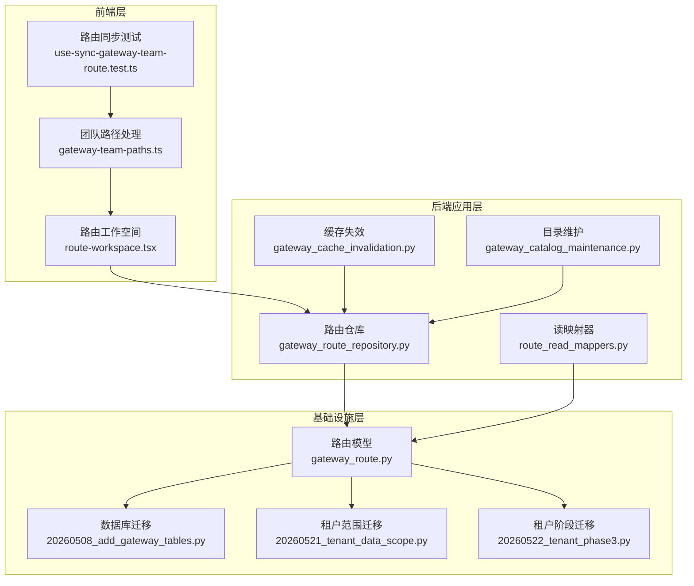
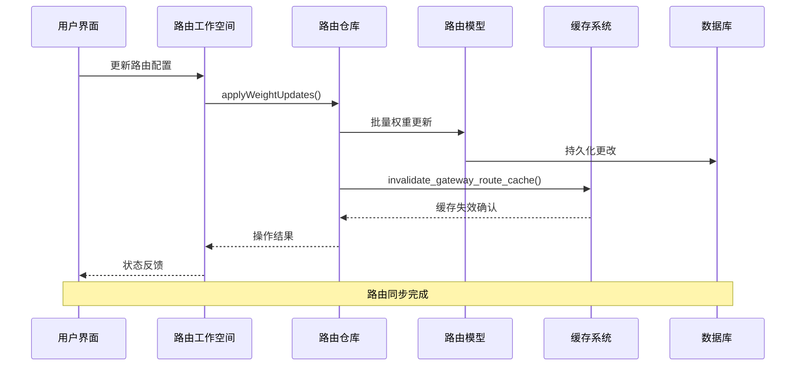
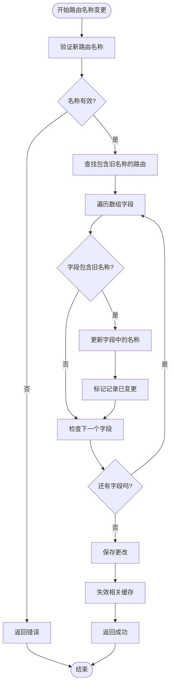
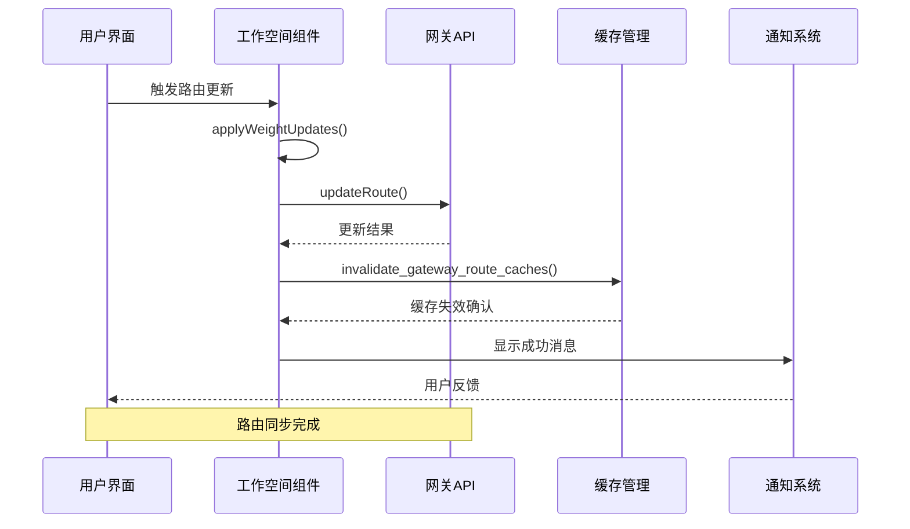
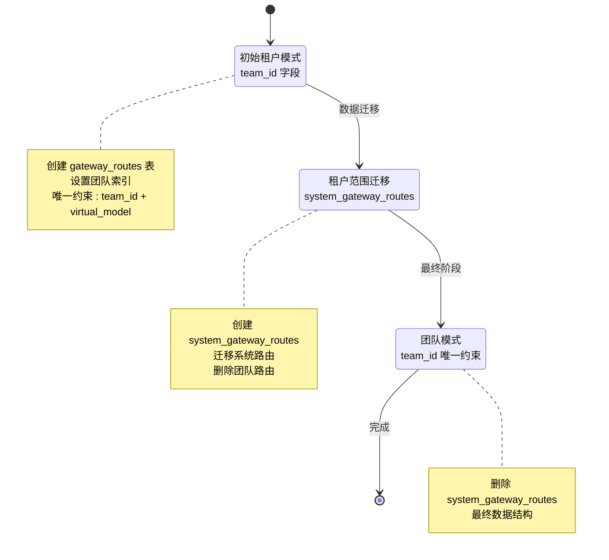
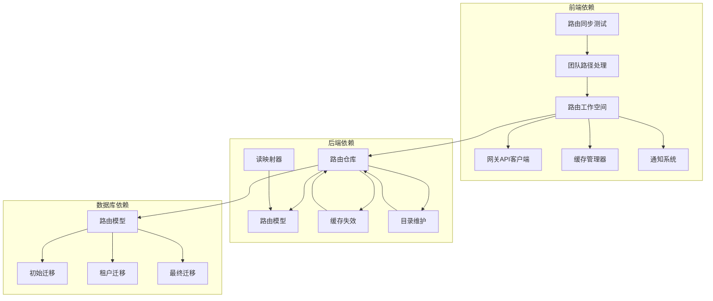

# 网关团队路由同步机制

<cite>
**本文档引用的文件**
- [gateway_route_repository.py](file://backend/domains/gateway/infrastructure/repositories/gateway_route_repository.py)
- [route-workspace.tsx](file://frontend/src/features/gateway-models/routes/route-workspace.tsx)
- [route_read_mappers.py](file://backend/domains/gateway/application/management/route_read_mappers.py)
- [use-sync-gateway-team-route.test.ts](file://frontend/src/features/gateway-teams/use-sync-gateway-team-route.test.ts)
- [gateway-team-paths.ts](file://frontend/src/features/gateway-teams/gateway-team-paths.ts)
- [20260508_add_gateway_tables.py](file://backend/alembic/versions/20260508_add_gateway_tables.py)
- [20260521_tenant_data_scope.py](file://backend/alembic/versions/20260521_tenant_data_scope.py)
- [20260522_tenant_phase3.py](file://backend/alembic/versions/20260522_tenant_phase3.py)
- [gateway_cache_invalidation.py](file://backend/domains/gateway/application/gateway_cache_invalidation.py)
- [gateway_catalog_maintenance.py](file://backend/domains/gateway/application/gateway_catalog_maintenance.py)
- [gateway_route.py](file://backend/domains/gateway/infrastructure/models/gateway_route.py)
</cite>

## 目录
1. [引言](#引言)
2. [项目结构](#项目结构)
3. [核心组件](#核心组件)
4. [架构概览](#架构概览)
5. [详细组件分析](#详细组件分析)
6. [依赖关系分析](#依赖关系分析)
7. [性能考虑](#性能考虑)
8. [故障排除指南](#故障排除指南)
9. [结论](#结论)

## 引言

本文档深入分析了AI Agent项目中网关团队路由同步机制的设计与实现。该机制负责在多租户环境下维护和同步不同团队之间的路由配置，确保路由名称变更、权重调整和访问控制的一致性。

系统采用分层架构设计，包含前端用户界面、后端应用逻辑、数据存储和缓存失效机制等多个层面，实现了完整的路由同步生命周期管理。

## 项目结构

项目采用模块化组织方式，网关相关功能主要分布在以下目录结构中：

**图表来源**
- [route-workspace.tsx:245-289](file://frontend/src/features/gateway-models/routes/route-workspace.tsx#L245-L289)
- [gateway_route_repository.py:272-294](file://backend/domains/gateway/infrastructure/repositories/gateway_route_repository.py#L272-L294)
- [gateway_route.py](file://backend/domains/gateway/infrastructure/models/gateway_route.py)

**章节来源**
- [route-workspace.tsx:245-289](file://frontend/src/features/gateway-models/routes/route-workspace.tsx#L245-L289)
- [gateway_route_repository.py:272-294](file://backend/domains/gateway/infrastructure/repositories/gateway_route_repository.py#L272-L294)

## 核心组件

### 路由仓库组件

路由仓库是系统的核心数据访问组件，负责处理路由的增删改查操作以及复杂的业务逻辑。

**主要职责：**
- 路由数据的持久化和检索
- 路由名称变更时的级联更新
- 权重更新的批量处理
- 数据一致性保证

### 前端路由工作空间

提供用户友好的路由管理界面，支持实时编辑、验证和同步路由配置。

**核心功能：**
- 路由创建、更新、删除操作
- 权重调整和批量更新
- 缓存失效和状态管理
- 错误处理和用户反馈

### 读映射器组件

负责将ORM模型转换为API响应格式，支持系统路由和团队路由的不同视图。

**转换逻辑：**
- 租户作用域的ORM字典映射
- 系统路由和团队路由的标识区分
- 数据源标记和元数据处理

**章节来源**
- [gateway_route_repository.py:272-294](file://backend/domains/gateway/infrastructure/repositories/gateway_route_repository.py#L272-L294)
- [route_read_mappers.py:12-20](file://backend/domains/gateway/application/management/route_read_mappers.py#L12-L20)

## 架构概览

系统采用分层架构设计，实现了清晰的关注点分离和职责划分：

**图表来源**
- [route-workspace.tsx:245-289](file://frontend/src/features/gateway-models/routes/route-workspace.tsx#L245-L289)
- [gateway_route_repository.py:272-294](file://backend/domains/gateway/infrastructure/repositories/gateway_route_repository.py#L272-L294)

系统架构的关键特点包括：

1. **分层设计**：清晰的前端-后端分层，每层职责明确
2. **事件驱动**：通过缓存失效机制实现数据同步
3. **事务一致性**：确保路由更新的原子性和一致性
4. **租户隔离**：支持多租户环境下的路由管理

## 详细组件分析

### 路由名称变更同步机制

当路由名称发生变更时，系统需要自动更新所有相关的引用，确保数据一致性。

**图表来源**
- [gateway_route_repository.py:272-294](file://backend/domains/gateway/infrastructure/repositories/gateway_route_repository.py#L272-L294)

**实现细节：**
- 支持多个数组字段的级联更新
- 自动检测和跳过不相关的记录
- 批量处理提高性能
- 完整的错误处理机制

### 前端路由同步流程

前端组件提供了完整的路由管理界面，支持实时同步和状态反馈。

**图表来源**
- [route-workspace.tsx:245-289](file://frontend/src/features/gateway-models/routes/route-workspace.tsx#L245-L289)

**前端特性：**
- 实时权重更新和验证
- 自动缓存失效处理
- 用户友好的错误处理
- 响应式状态管理

### 租户数据范围迁移

系统经历了从租户到团队的数据范围演进，确保向后兼容性和数据完整性。

**图表来源**
- [20260508_add_gateway_tables.py:333-337](file://backend/alembic/versions/20260508_add_gateway_tables.py#L333-L337)
- [20260521_tenant_data_scope.py:102-120](file://backend/alembic/versions/20260521_tenant_data_scope.py#L102-L120)
- [20260522_tenant_phase3.py:45-51](file://backend/alembic/versions/20260522_tenant_phase3.py#L45-L51)

**迁移策略：**
- 渐进式数据迁移避免服务中断
- 完整的备份和回滚机制
- 数据完整性验证
- 性能优化的索引重建

**章节来源**
- [gateway_route_repository.py:272-294](file://backend/domains/gateway/infrastructure/repositories/gateway_route_repository.py#L272-L294)
- [route-workspace.tsx:245-289](file://frontend/src/features/gateway-models/routes/route-workspace.tsx#L245-L289)
- [20260508_add_gateway_tables.py:333-337](file://backend/alembic/versions/20260508_add_gateway_tables.py#L333-L337)

## 依赖关系分析

系统各组件之间的依赖关系体现了清晰的架构层次：

**图表来源**
- [route-workspace.tsx:245-289](file://frontend/src/features/gateway-models/routes/route-workspace.tsx#L245-L289)
- [gateway_route_repository.py:272-294](file://backend/domains/gateway/infrastructure/repositories/gateway_route_repository.py#L272-L294)
- [route_read_mappers.py:12-20](file://backend/domains/gateway/application/management/route_read_mappers.py#L12-L20)

**依赖特点：**
- 单向依赖关系，避免循环引用
- 接口抽象降低耦合度
- 明确的职责边界
- 可测试性良好的设计

**章节来源**
- [gateway_cache_invalidation.py:32-36](file://backend/domains/gateway/application/gateway_cache_invalidation.py#L32-L36)
- [gateway_catalog_maintenance.py:47-108](file://backend/domains/gateway/application/gateway_catalog_maintenance.py#L47-L108)

## 性能考虑

系统在设计时充分考虑了性能优化和扩展性要求：

### 缓存策略
- **智能缓存失效**：仅对受影响的路由进行缓存清理
- **批量更新优化**：减少数据库往返次数
- **前端状态缓存**：提升用户体验

### 数据库优化
- **索引优化**：为常用查询字段建立索引
- **唯一约束**：防止数据重复和冲突
- **事务管理**：确保数据一致性

### 并发处理
- **乐观锁机制**：处理并发更新场景
- **重试机制**：网络异常时的自动恢复
- **超时控制**：防止长时间阻塞

## 故障排除指南

### 常见问题及解决方案

**路由名称变更失败**
- 检查新名称是否符合命名规范
- 验证目标路由是否存在
- 查看数据库约束冲突日志

**缓存同步问题**
- 手动触发缓存失效
- 检查缓存服务状态
- 验证缓存键生成逻辑

**权限访问错误**
- 确认用户团队成员身份
- 检查路由访问权限设置
- 验证API密钥有效性

**章节来源**
- [use-sync-gateway-team-route.test.ts:1-42](file://frontend/src/features/gateway-teams/use-sync-gateway-team-route.test.ts#L1-L42)
- [gateway-team-paths.ts:1-16](file://frontend/src/features/gateway-teams/gateway-team-paths.ts#L1-L16)

## 结论

网关团队路由同步机制展现了现代Web应用的优秀架构实践。通过分层设计、事件驱动的缓存管理和渐进式的数据迁移策略，系统实现了高效、可靠和可扩展的路由管理能力。

该机制的关键优势包括：

1. **数据一致性**：通过级联更新确保路由名称变更的完整传播
2. **性能优化**：智能缓存策略和批量处理提升系统响应速度
3. **可扩展性**：模块化的架构设计支持未来的功能扩展
4. **用户体验**：直观的前端界面和及时的状态反馈

系统为多租户环境下的路由管理提供了可靠的解决方案，为AI Agent平台的稳定运行奠定了坚实基础。