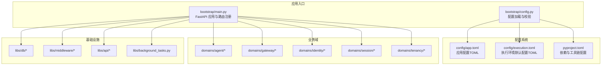
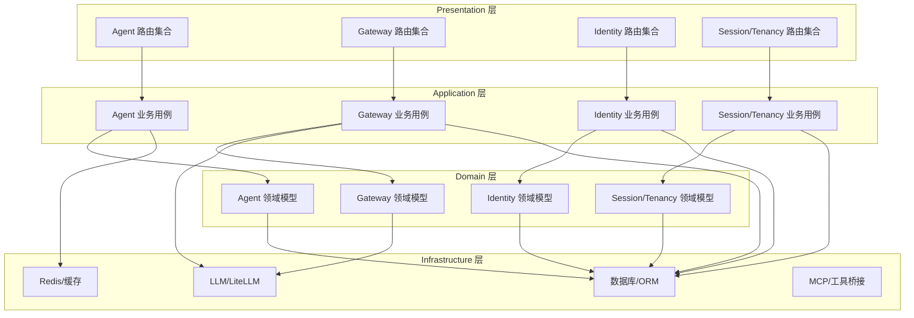
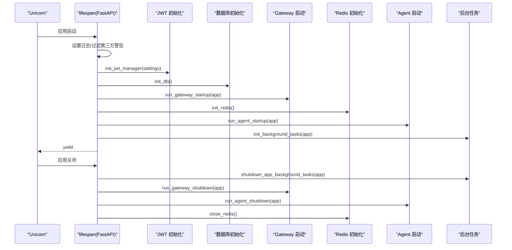
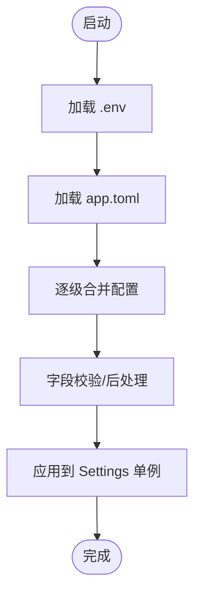
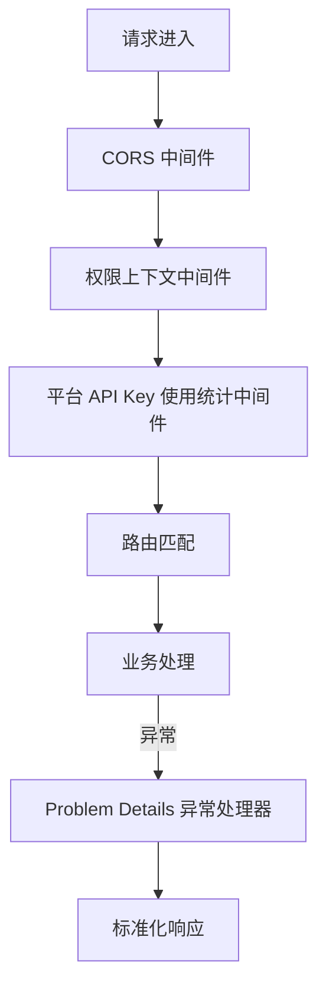
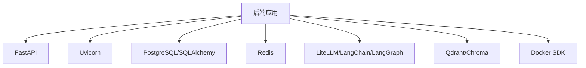
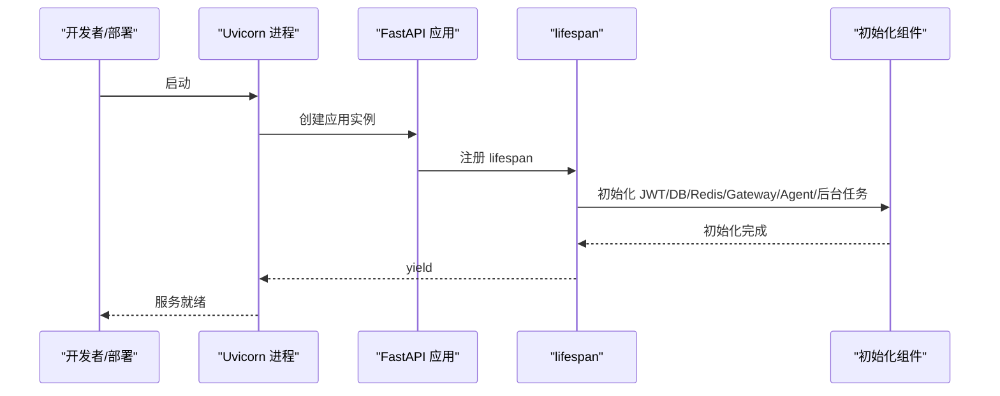

# 后端服务架构

<cite>
**本文引用的文件**
- [bootstrap/main.py](file://backend/bootstrap/main.py)
- [bootstrap/config.py](file://backend/bootstrap/config.py)
- [config/app.toml](file://backend/config/app.toml)
- [config/execution.toml](file://backend/config/execution.toml)
- [pyproject.toml](file://backend/pyproject.toml)
- [domains/agent/application/mcp_use_case.py](file://backend/domains/agent/application/mcp_use_case.py)
- [domains/agent/infrastructure/routing/router.py](file://backend/domains/agent/infrastructure/routing/router.py)
- [libs/db/database.py](file://backend/libs/db/database.py)
- [libs/db/redis.py](file://backend/libs/db/redis.py)
- [libs/middleware/permission.py](file://backend/libs/middleware/permission.py)
- [domains/gateway/presentation/platform_api_key_usage_middleware.py](file://backend/domains/gateway/presentation/platform_api_key_usage_middleware.py)
- [libs/api/problem_details.py](file://backend/libs/api/problem_details.py)
- [libs/background_tasks.py](file://backend/libs/background_tasks.py)
- [domains/identity/infrastructure/auth/jwt.py](file://backend/domains/identity/infrastructure/auth/jwt.py)
- [domains/agent/presentation/agent_router.py](file://backend/domains/agent/presentation/agent_router.py)
- [domains/session/presentation/__init__.py](file://backend/domains/session/presentation/__init__.py)
- [domains/identity/presentation/router.py](file://backend/domains/identity/presentation/router.py)
- [domains/tenancy/presentation/teams_router.py](file://backend/domains/tenancy/presentation/teams_router.py)
- [domains/gateway/presentation/management_router.py](file://backend/domains/gateway/presentation/management_router.py)
- [domains/gateway/presentation/openai_compat_router.py](file://backend/domains/gateway/presentation/openai_compat_router.py)
- [domains/gateway/presentation/anthropic_compat_router.py](file://backend/domains/gateway/presentation/anthropic_compat_router.py)
- [libs/api/paths.py](file://backend/libs/api/paths.py)
- [alembic/env.py](file://backend/alembic/env.py)
</cite>

## 目录
1. [引言](#引言)
2. [项目结构](#项目结构)
3. [核心组件](#核心组件)
4. [架构总览](#架构总览)
5. [详细组件分析](#详细组件分析)
6. [依赖分析](#依赖分析)
7. [性能考虑](#性能考虑)
8. [故障排查指南](#故障排查指南)
9. [结论](#结论)
10. [附录](#附录)

## 引言
本文件为 AI Agent 后端服务的架构文档，聚焦以下目标：
- 解释 FastAPI 应用的启动与配置机制，包括依赖注入容器与生命周期管理
- 描述 DDD 四层架构（presentation、application、domain、infrastructure）在本项目中的落地
- 阐述 agent、gateway、identity、session、tenancy 等业务域的设计与交互
- 说明基础设施层的抽象设计（数据库、缓存、存储、中间件）
- 提供配置管理系统（环境配置、应用配置、LLM 模型配置）的详细说明
- 总结服务启动流程、依赖解析与错误处理机制

本文件既面向初学者解释核心概念，也为有经验的开发者提供足够的技术深度。

## 项目结构
后端采用“按领域划分”的模块组织方式，核心入口位于 bootstrap，配置集中于 config，业务域分布在 domains，基础设施能力封装在 libs，数据库迁移由 alembic 管理。

图表来源
- [bootstrap/main.py:182-537](file://backend/bootstrap/main.py#L182-L537)
- [bootstrap/config.py:34-457](file://backend/bootstrap/config.py#L34-L457)
- [config/app.toml:1-179](file://backend/config/app.toml#L1-L179)
- [config/execution.toml:1-173](file://backend/config/execution.toml#L1-L173)
- [pyproject.toml:1-351](file://backend/pyproject.toml#L1-L351)

章节来源
- [bootstrap/main.py:182-537](file://backend/bootstrap/main.py#L182-L537)
- [bootstrap/config.py:34-457](file://backend/bootstrap/config.py#L34-L457)
- [config/app.toml:1-179](file://backend/config/app.toml#L1-L179)
- [config/execution.toml:1-173](file://backend/config/execution.toml#L1-L173)
- [pyproject.toml:1-351](file://backend/pyproject.toml#L1-L351)

## 核心组件
- FastAPI 应用与生命周期：通过 lifespan 管理启动/关闭阶段，初始化 JWT、数据库、Redis、Gateway/Agent 启停、后台任务等
- 配置系统：Settings 使用 pydantic-settings 从环境变量、.env、app.toml 逐级合并，提供强类型配置
- 中间件体系：权限上下文、平台 API Key 使用统计、CORS 等
- 异常处理：统一 RFC 7807 Problem Details 响应
- 路由注册：按领域聚合注册 API 路由

章节来源
- [bootstrap/main.py:108-181](file://backend/bootstrap/main.py#L108-L181)
- [bootstrap/config.py:34-457](file://backend/bootstrap/config.py#L34-L457)
- [libs/middleware/permission.py](file://backend/libs/middleware/permission.py)
- [domains/gateway/presentation/platform_api_key_usage_middleware.py](file://backend/domains/gateway/presentation/platform_api_key_usage_middleware.py)
- [libs/api/problem_details.py](file://backend/libs/api/problem_details.py)

## 架构总览
本项目采用 DDD 四层架构：
- presentation 层：API 路由与视图，负责请求/响应映射与协议适配
- application 层：业务用例编排，协调 domain 与 infrastructure
- domain 层：核心业务模型与规则，保证业务不变量
- infrastructure 层：外部系统集成（数据库、缓存、LLM、MCP 等）

图表来源
- [bootstrap/main.py:388-494](file://backend/bootstrap/main.py#L388-L494)
- [domains/agent/application/mcp_use_case.py:41](file://backend/domains/agent/application/mcp_use_case.py#L41)
- [domains/agent/infrastructure/routing/router.py:21](file://backend/domains/agent/infrastructure/routing/router.py#L21)

## 详细组件分析

### FastAPI 应用启动与生命周期
- 启动阶段：设置事件循环策略（Windows）、初始化日志、抑制第三方警告、初始化 JWT、数据库、Gateway/Agent 启停、Redis、后台任务
- 关闭阶段：关闭后台任务、Gateway/Agent 关停、关闭 LiteLLM 异步客户端、关闭 Redis
- 生命周期装饰器 lifespan 管理异步资源的创建与释放，确保资源有序回收

图表来源
- [bootstrap/main.py:108-181](file://backend/bootstrap/main.py#L108-L181)

章节来源
- [bootstrap/main.py:108-181](file://backend/bootstrap/main.py#L108-L181)

### 配置管理与加载机制
- 配置优先级：环境变量 > .env > app.toml > 代码默认值
- Settings 使用 pydantic-settings BaseSettings，支持 SecretStr、字段校验、别名与后处理
- app.toml 与 execution.toml 提供应用与执行环境的结构化配置，支持环境变量占位符
- pyproject.toml 定义依赖与工具链，确保类型检查、格式化、测试等一致性

图表来源
- [bootstrap/config.py:34-457](file://backend/bootstrap/config.py#L34-L457)
- [config/app.toml:1-179](file://backend/config/app.toml#L1-L179)
- [config/execution.toml:1-173](file://backend/config/execution.toml#L1-L173)
- [pyproject.toml:1-351](file://backend/pyproject.toml#L1-L351)

章节来源
- [bootstrap/config.py:34-457](file://backend/bootstrap/config.py#L34-L457)
- [config/app.toml:1-179](file://backend/config/app.toml#L1-L179)
- [config/execution.toml:1-173](file://backend/config/execution.toml#L1-L173)
- [pyproject.toml:1-351](file://backend/pyproject.toml#L1-L351)

### 中间件与异常处理
- CORS 中间件：根据环境动态配置允许源与暴露头
- ASGI 中间件：权限上下文中间件、平台 API Key 使用统计中间件
- 全局异常处理器：将各类业务与系统异常转换为 RFC 7807 Problem Details 响应

图表来源
- [bootstrap/main.py:192-227](file://backend/bootstrap/main.py#L192-L227)
- [bootstrap/main.py:235-382](file://backend/bootstrap/main.py#L235-L382)
- [libs/middleware/permission.py](file://backend/libs/middleware/permission.py)
- [domains/gateway/presentation/platform_api_key_usage_middleware.py](file://backend/domains/gateway/presentation/platform_api_key_usage_middleware.py)
- [libs/api/problem_details.py](file://backend/libs/api/problem_details.py)

章节来源
- [bootstrap/main.py:192-227](file://backend/bootstrap/main.py#L192-L227)
- [bootstrap/main.py:235-382](file://backend/bootstrap/main.py#L235-L382)
- [libs/middleware/permission.py](file://backend/libs/middleware/permission.py)
- [domains/gateway/presentation/platform_api_key_usage_middleware.py](file://backend/domains/gateway/presentation/platform_api_key_usage_middleware.py)
- [libs/api/problem_details.py](file://backend/libs/api/problem_details.py)

### 路由注册与 API 结构
- 路由前缀：统一使用 api_v1_path，兼容 OpenAI/Anthropic 兼容入口
- 路由分组：认证、API Key、Agent、Session、聊天、工具、记忆、系统、评估、执行、MCP、用量、视频任务、Listing Studio、平台管理、Gateway 管理与兼容入口等
- 兼容旧路径：/v1/* 重定向至新的兼容面

章节来源
- [bootstrap/main.py:388-494](file://backend/bootstrap/main.py#L388-L494)
- [libs/api/paths.py](file://backend/libs/api/paths.py)

### DDD 四层架构实现要点
- presentation 层：各域的路由模块负责协议适配与请求/响应映射
- application 层：用例编排业务流程，协调 domain 与 infrastructure
- domain 层：实体与规则，保证业务不变量
- infrastructure 层：数据库、缓存、LLM、MCP 等外部系统集成

章节来源
- [bootstrap/main.py:388-494](file://backend/bootstrap/main.py#L388-L494)
- [domains/agent/application/mcp_use_case.py:41](file://backend/domains/agent/application/mcp_use_case.py#L41)
- [domains/agent/infrastructure/routing/router.py:21](file://backend/domains/agent/infrastructure/routing/router.py#L21)

### 业务域设计与关系

#### Agent 域
- 职责：Agent 生命周期管理、聊天、工具、记忆、MCP、执行配置、视频任务、Listing Studio 等
- 关键路由：agent_router、chat_router、tools_router、memory_router、execution_router、mcp_router、mcp_server_router、video_task_router、listing_studio_router、system_router、admin_storage_router
- 关键用例：MCP 用例、启动/关闭生命周期管理

章节来源
- [bootstrap/main.py:45-56](file://backend/bootstrap/main.py#L45-L56)
- [domains/agent/application/mcp_use_case.py:41](file://backend/domains/agent/application/mcp_use_case.py#L41)

#### Gateway 域
- 职责：AI 网关模型目录、凭证、预算、用量、兼容 OpenAI/Anthropic 协议
- 关键路由：gateway_mgmt_router、openai_compat_router、anthropic_compat_router、tenancy_teams_router
- 关键中间件：平台 API Key 使用统计中间件

章节来源
- [bootstrap/main.py:61-67](file://backend/bootstrap/main.py#L61-L67)
- [bootstrap/main.py:476-493](file://backend/bootstrap/main.py#L476-L493)
- [domains/gateway/presentation/platform_api_key_usage_middleware.py](file://backend/domains/gateway/presentation/platform_api_key_usage_middleware.py)

#### Identity 域
- 职责：认证、API Key、用量统计
- 关键路由：identity_router、api_key_router、usage_router、admin_users_router
- 关键基础设施：JWT 管理器初始化

章节来源
- [bootstrap/main.py:68](file://backend/bootstrap/main.py#L68)
- [bootstrap/main.py:392-395](file://backend/bootstrap/main.py#L392-L395)
- [bootstrap/main.py:426-431](file://backend/bootstrap/main.py#L426-L431)
- [bootstrap/main.py:455-459](file://backend/bootstrap/main.py#L455-L459)
- [domains/identity/infrastructure/auth/jwt.py](file://backend/domains/identity/infrastructure/auth/jwt.py)

#### Session 域
- 职责：会话管理
- 关键路由：session_router

章节来源
- [bootstrap/main.py:73](file://backend/bootstrap/main.py#L73)
- [domains/session/presentation/__init__.py](file://backend/domains/session/presentation/__init__.py)

#### Tenancy 域
- 职责：团队与租户管理
- 关键路由：tenancy_teams_router

章节来源
- [bootstrap/main.py:74](file://backend/bootstrap/main.py#L74)
- [domains/tenancy/presentation/teams_router.py](file://backend/domains/tenancy/presentation/teams_router.py)

### 基础设施层抽象设计

#### 数据库与 ORM
- 使用 SQLAlchemy 异步与 Alembic 迁移
- 连接池参数与回显配置在 Settings 中管理

章节来源
- [libs/db/database.py](file://backend/libs/db/database.py)
- [bootstrap/config.py:74-77](file://backend/bootstrap/config.py#L74-L77)
- [alembic/env.py](file://backend/alembic/env.py)

#### 缓存与 Redis
- Redis 用于缓存、队列（Celery）、会话等
- 初始化/关闭在 lifespan 中管理

章节来源
- [libs/db/redis.py](file://backend/libs/db/redis.py)
- [bootstrap/main.py:148-152](file://backend/bootstrap/main.py#L148-L152)
- [bootstrap/main.py:179](file://backend/bootstrap/main.py#L179)
- [bootstrap/config.py:82-87](file://backend/bootstrap/config.py#L82-L87)

#### LLM 与 LiteLLM
- 支持多提供商（OpenAI、Anthropic、DashScope、DeepSeek、VolcEngine、Zhipuai、本地 Ollama）
- 提供商默认 API Base 来源于 domain 层，运行时由 Gateway 可见目录兜底

章节来源
- [bootstrap/config.py:105-140](file://backend/bootstrap/config.py#L105-L140)
- [config/app.toml:35-67](file://backend/config/app.toml#L35-L67)

#### MCP 与工具桥接
- MCP 服务器与工具适配，Agent 侧通过用例编排

章节来源
- [domains/agent/application/mcp_use_case.py:41](file://backend/domains/agent/application/mcp_use_case.py#L41)
- [domains/agent/infrastructure/routing/router.py:21](file://backend/domains/agent/infrastructure/routing/router.py#L21)

## 依赖分析
- 语言与框架：Python 3.11+、FastAPI、Uvicorn
- 数据库：PostgreSQL（异步驱动）
- 缓存：Redis
- 向量数据库：Qdrant/Chroma
- LLM：LiteLLM、LangChain/LangGraph、SimpleMem、FastEmbed
- 工具与沙箱：Docker SDK、MCP

图表来源
- [pyproject.toml:10-76](file://backend/pyproject.toml#L10-L76)

章节来源
- [pyproject.toml:10-76](file://backend/pyproject.toml#L10-L76)

## 性能考虑
- 异步 I/O：数据库、缓存、LLM 调用均采用异步实现
- 缓存与索引：数据库迁移包含性能索引，Gateway 日志明细表按月分区
- Token 优化：提示词缓存、记忆摘要、分层记忆、SimpleMem
- 资源限制：沙箱超时、内存/CPU/Disk 限制，网络白名单
- 监控与可观测性：指标、链路追踪开关

章节来源
- [bootstrap/config.py:314-347](file://backend/bootstrap/config.py#L314-L347)
- [config/execution.toml:24-72](file://backend/config/execution.toml#L24-L72)
- [bootstrap/config.py:358-360](file://backend/bootstrap/config.py#L358-L360)

## 故障排查指南
- 全局异常处理：统一转为 Problem Details，便于前端与网关解析
- 开发模式：打印堆栈与详细错误信息
- 常见错误分类：验证错误、未找到、权限不足、认证失败、令牌错误、冲突、限流、外部服务错误、工具执行错误、检查点错误、通用 Agent 错误
- LiteLLM 客户端清理：应用关闭时主动关闭异步客户端，避免资源泄漏

章节来源
- [bootstrap/main.py:235-382](file://backend/bootstrap/main.py#L235-L382)
- [bootstrap/main.py:166-178](file://backend/bootstrap/main.py#L166-L178)

## 结论
本架构以 DDD 为核心，结合 FastAPI 的异步能力与丰富的生态，构建了可扩展、可观测、可治理的 AI Agent 后端服务。通过清晰的配置体系、中间件与异常处理机制，以及对 LLM、MCP、向量数据库等基础设施的抽象，系统在功能完整性与工程稳定性之间取得平衡。建议在生产环境中重点关注：
- 配置的最小暴露面与密钥管理
- 网关路由与日志的合规与成本控制
- 沙箱与工具调用的安全边界
- 监控与告警的完善

## 附录

### 服务启动流程（代码级）

图表来源
- [bootstrap/main.py:182-189](file://backend/bootstrap/main.py#L182-L189)
- [bootstrap/main.py:108-181](file://backend/bootstrap/main.py#L108-L181)