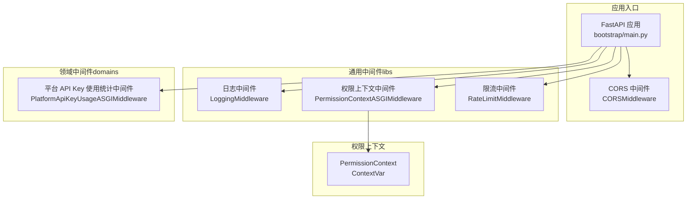
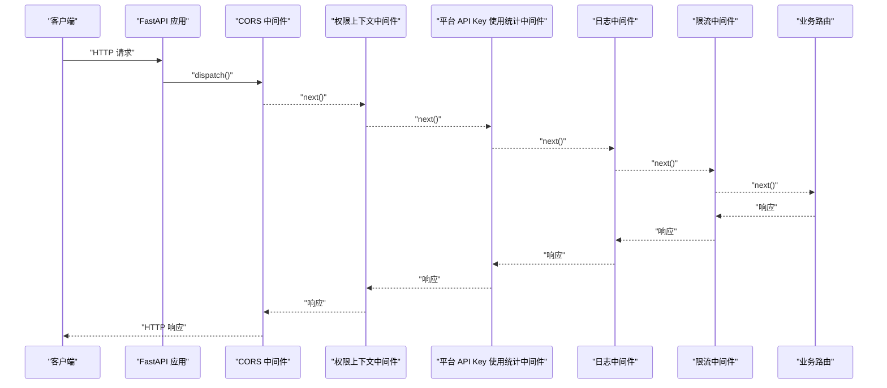
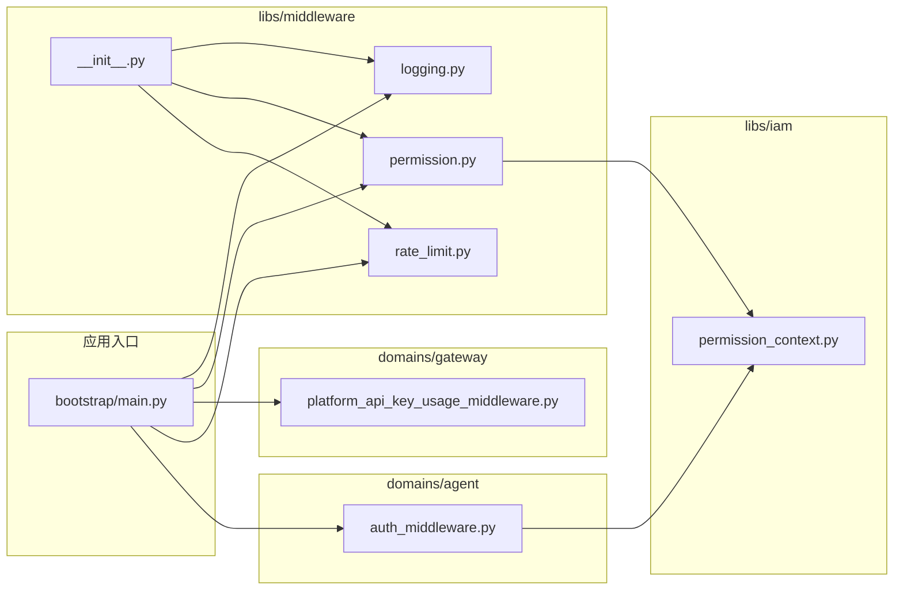

# 中间件系统

<cite>
**本文引用的文件**
- [bootstrap/main.py](file://backend/bootstrap/main.py)
- [bootstrap/config.py](file://backend/bootstrap/config.py)
- [libs/middleware/__init__.py](file://backend/libs/middleware/__init__.py)
- [libs/middleware/logging.py](file://backend/libs/middleware/logging.py)
- [libs/middleware/permission.py](file://backend/libs/middleware/permission.py)
- [libs/middleware/rate_limit.py](file://backend/libs/middleware/rate_limit.py)
- [domains/gateway/presentation/platform_api_key_usage_middleware.py](file://backend/domains/gateway/presentation/platform_api_key_usage_middleware.py)
- [domains/agent/infrastructure/mcp_server/auth_middleware.py](file://backend/domains/agent/infrastructure/mcp_server/auth_middleware.py)
- [libs/iam/permission_context.py](file://backend/libs/iam/permission_context.py)
</cite>

## 目录
1. [简介](#简介)
2. [项目结构](#项目结构)
3. [核心组件](#核心组件)
4. [架构总览](#架构总览)
5. [组件详解](#组件详解)
6. [依赖关系分析](#依赖关系分析)
7. [性能考量](#性能考量)
8. [故障排查指南](#故障排查指南)
9. [结论](#结论)
10. [附录](#附录)

## 简介
本文件为 AI Agent 中间件系统的深入技术文档，聚焦于请求处理流水线、中间件注册机制与执行顺序控制，系统性阐述认证中间件、日志中间件、限流中间件、CORS 中间件以及平台 API Key 使用统计中间件的实现与集成方式。文档还涵盖配置与管理（启用/禁用、参数传递）、异常处理、性能优化、开发指南与安全最佳实践，既适合初学者理解中间件在 Web 应用中的作用，也为资深开发者提供实现细节与扩展方法。

## 项目结构
中间件体系主要分布在以下位置：
- 通用中间件（libs 层）：日志、权限上下文、限流
- 领域中间件（domains 层）：平台 API Key 使用统计（ASGI）
- 应用入口（bootstrap）：CORS 中间件注册、全局异常处理、路由挂载
- 权限上下文（libs/iam）：ContextVar 驱动的请求级权限上下文

**图表来源**
- [bootstrap/main.py:192-227](file://backend/bootstrap/main.py#L192-L227)
- [libs/middleware/__init__.py:9-17](file://backend/libs/middleware/__init__.py#L9-L17)
- [libs/middleware/permission.py:21-36](file://backend/libs/middleware/permission.py#L21-L36)
- [domains/gateway/presentation/platform_api_key_usage_middleware.py:29-94](file://backend/domains/gateway/presentation/platform_api_key_usage_middleware.py#L29-L94)
- [libs/iam/permission_context.py:78-96](file://backend/libs/iam/permission_context.py#L78-L96)

**章节来源**
- [bootstrap/main.py:183-227](file://backend/bootstrap/main.py#L183-L227)
- [libs/middleware/__init__.py:1-18](file://backend/libs/middleware/__init__.py#L1-L18)

## 核心组件
- CORS 中间件：在应用启动时注册，负责跨域资源共享控制，暴露必要的响应头以支持限流与网关指标透传。
- 权限上下文中间件（ASGI）：在 ASGI 生命周期开始时预清/清理权限上下文，避免跨请求污染；实际上下文由认证依赖在解析身份后写入。
- 平台 API Key 使用统计中间件（ASGI）：在 /v1/* 代理响应后回写平台 sk-* 的使用统计，兼容 SSE/StreamingResponse。
- 日志中间件：记录请求与响应日志，包含方法、路径、状态码与耗时。
- 限流中间件：基于客户端标识与用户标识的分钟/小时级请求计数，超限返回 429 并附 Retry-After。

**章节来源**
- [bootstrap/main.py:192-227](file://backend/bootstrap/main.py#L192-L227)
- [libs/middleware/permission.py:21-36](file://backend/libs/middleware/permission.py#L21-L36)
- [domains/gateway/presentation/platform_api_key_usage_middleware.py:29-94](file://backend/domains/gateway/presentation/platform_api_key_usage_middleware.py#L29-L94)
- [libs/middleware/logging.py:18-59](file://backend/libs/middleware/logging.py#L18-L59)
- [libs/middleware/rate_limit.py:20-88](file://backend/libs/middleware/rate_limit.py#L20-L88)

## 架构总览
中间件注册与执行顺序遵循“先注册、先执行”的原则。应用入口集中注册 CORS、权限上下文、平台 API Key 使用统计等中间件，并在路由挂载之前完成。请求进入时，依次经过 CORS、权限上下文、平台 API Key 使用统计、日志、限流，再进入业务路由；响应返回时，按相反顺序回传。

**图表来源**
- [bootstrap/main.py:192-227](file://backend/bootstrap/main.py#L192-L227)
- [libs/middleware/logging.py:21-58](file://backend/libs/middleware/logging.py#L21-L58)
- [libs/middleware/rate_limit.py:35-77](file://backend/libs/middleware/rate_limit.py#L35-L77)
- [domains/gateway/presentation/platform_api_key_usage_middleware.py:35-94](file://backend/domains/gateway/presentation/platform_api_key_usage_middleware.py#L35-L94)

## 组件详解

### CORS 中间件
- 注册位置：应用入口在创建 FastAPI 实例后立即注册 CORSMiddleware。
- 关键行为：
  - 允许凭据（Cookie）传输；
  - 暴露多种限流与网关相关响应头，便于前端与监控系统识别；
  - 开发环境下允许特定本地源，生产环境由配置决定。
- 配置来源：CORS 源列表来自配置模块，支持环境变量覆盖。

**章节来源**
- [bootstrap/main.py:192-223](file://backend/bootstrap/main.py#L192-L223)
- [bootstrap/config.py:198-200](file://backend/bootstrap/config.py#L198-L200)

### 权限上下文中间件（ASGI）
- 设计要点：
  - 仅在 HTTP 类型的 ASGI 作用域下生效；
  - 在进入应用前预清 ContextVar，在应用结束时清理，避免跨请求污染；
  - 与流式响应（如 SSE）兼容，避免 BaseHTTPMiddleware 的竞态问题。
- 与权限上下文的关系：
  - 实际权限上下文由认证依赖在解析身份后写入；
  - 该中间件仅负责生命周期内的初始化与清理。

**章节来源**
- [libs/middleware/permission.py:21-36](file://backend/libs/middleware/permission.py#L21-L36)
- [libs/iam/permission_context.py:78-96](file://backend/libs/iam/permission_context.py#L78-L96)

### 平台 API Key 使用统计中间件（ASGI）
- 功能概述：
  - 在 /v1/* 代理响应后回写平台 sk-* 的使用统计；
  - 支持从 scope/state 获取上下文，兼容不同路由场景；
  - 记录端点、方法、IP、UA、状态码、耗时等信息；
  - 异常记录但不影响请求主流程。
- 与业务集成：
  - 通过 use case 记录使用情况并提交事务；
  - 与权限上下文配合，确保数据过滤与审计一致性。

**章节来源**
- [domains/gateway/presentation/platform_api_key_usage_middleware.py:29-94](file://backend/domains/gateway/presentation/platform_api_key_usage_middleware.py#L29-L94)

### 日志中间件
- 记录内容：
  - 请求阶段：方法、路径、客户端 IP；
  - 响应阶段：状态码、耗时（毫秒）；
- 性能影响：轻量日志记录，开销主要来自格式化与 IO；可通过日志级别与格式优化降低开销。

**章节来源**
- [libs/middleware/logging.py:18-59](file://backend/libs/middleware/logging.py#L18-L59)

### 限流中间件
- 限流策略：
  - 基于客户端 IP 与用户 ID 组合标识；
  - 分钟级与小时级独立计数；
  - 超限时返回 429，并设置 Retry-After 响应头。
- 数据结构与清理：
  - 使用字典保存每个标识的请求时间戳；
  - 每次请求前清理过期记录（1 分钟与 1 小时窗口外的时间戳）。
- 性能特征：均摊 O(n) 清理成本，n 为该标识的近似请求数；内存占用与并发连接数成正比。

**章节来源**
- [libs/middleware/rate_limit.py:20-88](file://backend/libs/middleware/rate_limit.py#L20-L88)

### 认证中间件（MCP）
- 适用范围：MCP 服务器访问控制，校验 API Key 并检查 MCP 作用域权限；
- 关键流程：
  - 从 Authorization 头解析 Bearer 凭据；
  - 校验 API Key 格式与有效性；
  - 按服务器名称映射所需作用域，检查权限交集；
  - 记录 API Key 使用（在权限上下文安装后进行仓储过滤）；
  - 提供可选验证版本，未提供凭据时返回匿名上下文。
- 错误处理：针对认证失败、权限不足、请求无效分别抛出相应异常，由全局异常处理器统一输出。

**章节来源**
- [domains/agent/infrastructure/mcp_server/auth_middleware.py:46-183](file://backend/domains/agent/infrastructure/mcp_server/auth_middleware.py#L46-L183)

## 依赖关系分析
- 中间件聚合导出：libs/middleware/__init__.py 聚合通用中间件，便于统一导入与管理。
- 应用入口依赖：
  - CORS 中间件依赖配置模块提供的 CORS 源列表；
  - 权限上下文中间件依赖权限上下文模块；
  - 平台 API Key 使用统计中间件依赖数据库会话工厂与领域 use case。
- 认证中间件依赖：
  - API Key 验证 use case；
  - 权限上下文组合器（用于安装租户过滤）。

**图表来源**
- [bootstrap/main.py:192-227](file://backend/bootstrap/main.py#L192-L227)
- [libs/middleware/__init__.py:9-17](file://backend/libs/middleware/__init__.py#L9-L17)
- [libs/middleware/permission.py:15-15](file://backend/libs/middleware/permission.py#L15-L15)
- [domains/agent/infrastructure/mcp_server/auth_middleware.py:13-16](file://backend/domains/agent/infrastructure/mcp_server/auth_middleware.py#L13-L16)
- [libs/iam/permission_context.py:78-96](file://backend/libs/iam/permission_context.py#L78-L96)

**章节来源**
- [bootstrap/main.py:192-227](file://backend/bootstrap/main.py#L192-L227)
- [libs/middleware/__init__.py:9-17](file://backend/libs/middleware/__init__.py#L9-L17)

## 性能考量
- 执行效率
  - CORS 与日志中间件为轻量 I/O 操作，对吞吐影响较小；
  - 限流中间件在请求前清理过期记录，均摊成本可控；建议根据流量规模调整分钟/小时阈值。
- 内存占用
  - 限流中间件按标识维护时间戳列表，连接数越多内存占用越高；可通过合理阈值与清理策略平衡。
- 链式调优
  - 将高频低成本中间件置于链路前端（如 CORS、日志），将昂贵或条件分支较多的中间件靠后；
  - 对流式响应（SSE/StreamingResponse）优先使用 ASGI 中间件，避免 BaseHTTPMiddleware 的竞态与额外拷贝。
- 并发与事件循环
  - Windows 平台需注意事件循环策略，确保异步数据库与外部服务正常运行。

**章节来源**
- [libs/middleware/rate_limit.py:79-88](file://backend/libs/middleware/rate_limit.py#L79-L88)
- [bootstrap/main.py:23-24](file://backend/bootstrap/main.py#L23-L24)

## 故障排查指南
- CORS 相关问题
  - 症状：浏览器跨域失败或凭据无法传输；
  - 排查：确认 CORS 源列表配置、是否允许凭据、暴露头是否包含限流与网关相关响应头。
- 权限上下文泄漏
  - 症状：不同请求间出现权限错乱；
  - 排查：确认权限上下文中间件是否在 ASGI 层正确初始化与清理；检查认证依赖是否在解析身份后写入上下文。
- 平台 API Key 使用统计未记录
  - 症状：使用统计缺失；
  - 排查：确认中间件是否注册、scope/state 是否包含上下文、数据库会话是否可用、异常日志是否记录。
- 限流误伤
  - 症状：合法请求被 429；
  - 排查：核对分钟/小时阈值、标识合并逻辑（用户 ID 优先于客户端 IP）、清理策略是否生效。
- 认证失败
  - 症状：401/403；
  - 排查：确认 API Key 格式、有效期、作用域权限、认证异常处理器是否正确输出。

**章节来源**
- [bootstrap/main.py:192-223](file://backend/bootstrap/main.py#L192-L223)
- [libs/middleware/permission.py:27-35](file://backend/libs/middleware/permission.py#L27-L35)
- [domains/gateway/presentation/platform_api_key_usage_middleware.py:68-94](file://backend/domains/gateway/presentation/platform_api_key_usage_middleware.py#L68-L94)
- [libs/middleware/rate_limit.py:48-71](file://backend/libs/middleware/rate_limit.py#L48-L71)
- [domains/agent/infrastructure/mcp_server/auth_middleware.py:67-127](file://backend/domains/agent/infrastructure/mcp_server/auth_middleware.py#L67-L127)

## 结论
本中间件系统通过清晰的职责划分与严格的生命周期管理，实现了 CORS、权限上下文、平台 API Key 使用统计、日志与限流等横切能力。应用入口集中注册与统一异常处理保证了稳定性与可观测性；ASGI 中间件与 ContextVar 的结合提升了流式响应与权限隔离的可靠性。通过合理的配置与调优，可在保障安全与审计的前提下获得良好的性能表现。

## 附录

### 中间件注册与配置清单
- CORS 中间件
  - 注册：应用入口创建后立即注册；
  - 配置：CORS 源列表来自配置模块，开发环境默认允许本地源。
- 权限上下文中间件（ASGI）
  - 注册：应用入口注册；
  - 行为：请求边界预清/清理 ContextVar。
- 平台 API Key 使用统计中间件（ASGI）
  - 注册：应用入口注册；
  - 行为：代理响应后回写使用统计。
- 日志中间件
  - 注册：应用入口注册；
  - 行为：记录请求与响应日志。
- 限流中间件
  - 注册：应用入口注册；
  - 行为：分钟/小时级请求限制，超限返回 429。

**章节来源**
- [bootstrap/main.py:192-227](file://backend/bootstrap/main.py#L192-L227)
- [bootstrap/config.py:198-200](file://backend/bootstrap/config.py#L198-L200)

### 自定义中间件开发指南
- 选择中间件类型
  - 若涉及流式响应或严格生命周期控制，优先实现 ASGI 中间件；
  - 若为简单请求/响应处理，可采用 BaseHTTPMiddleware。
- 生命周期与上下文
  - 对需要跨层共享的信息，使用 ContextVar 并在 ASGI 边界初始化/清理；
  - 明确中间件职责，避免过度耦合。
- 参数与配置
  - 通过应用入口或配置模块注入参数，支持环境变量覆盖；
  - 为关键阈值与窗口提供可调参数。
- 测试与调试
  - 编写单元测试覆盖正常路径与异常路径；
  - 使用最小化路由与 mock 依赖，定位问题；
  - 关注日志与异常处理器输出，确保错误可诊断。

### 安全最佳实践
- 输入验证
  - 对所有外部输入进行严格校验（如 API Key 格式、路径参数）；
  - 使用依赖注入与 Pydantic 校验，避免裸参数直接使用。
- 输出编码
  - 对日志与响应中的敏感字段进行脱敏处理；
  - 避免在错误信息中泄露内部实现细节。
- 敏感信息过滤
  - 在日志与异常输出中过滤 Authorization 头、API Key 等敏感信息；
  - 使用安全日志格式与集中化日志收集。
- 权限与租户隔离
  - 通过权限上下文与仓储层过滤确保数据隔离；
  - 在多租户场景下，确保默认兜底与显式授权一致。