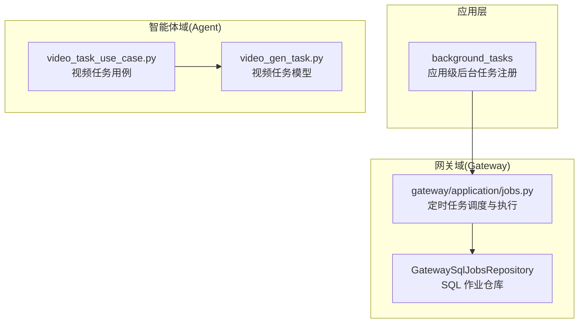
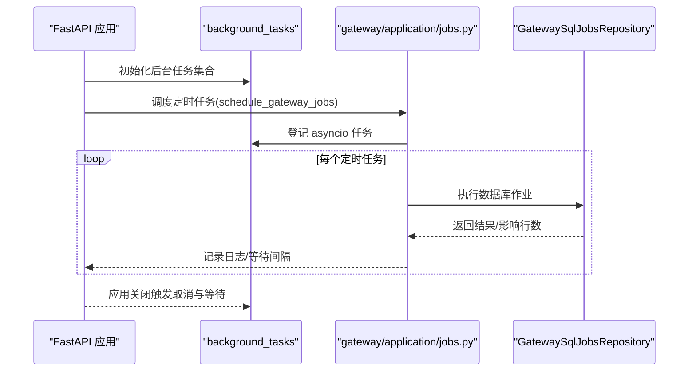
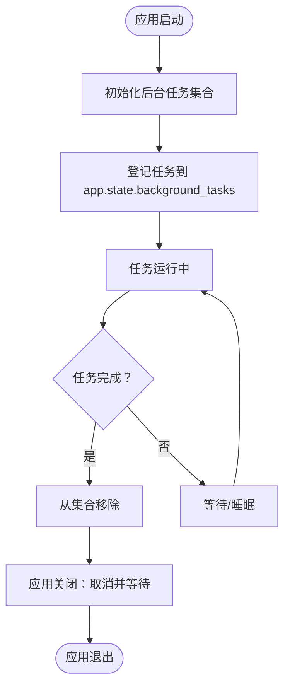
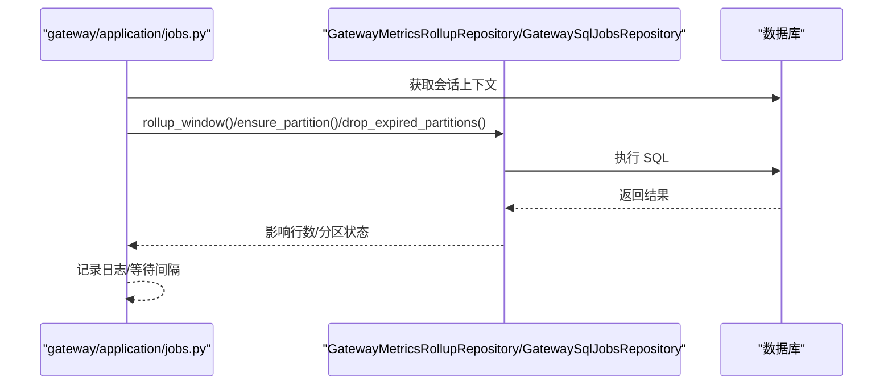
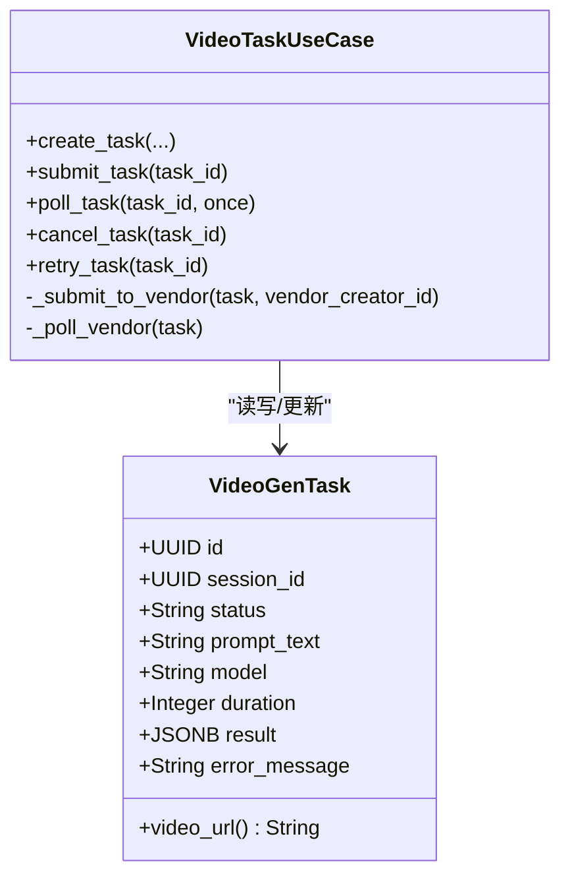
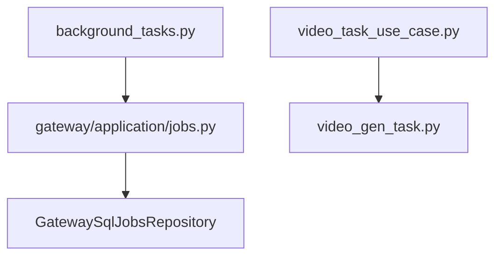

# 后台任务系统

<cite>
**本文引用的文件**
- [backend/libs/background_tasks.py](file://backend/libs/background_tasks.py)
- [backend/domains/gateway/application/jobs.py](file://backend/domains/gateway/application/jobs.py)
- [backend/domains/agent/application/video_task_use_case.py](file://backend/domains/agent/application/video_task_use_case.py)
- [backend/domains/agent/infrastructure/models/video_gen_task.py](file://backend/domains/agent/infrastructure/models/video_gen_task.py)
- [backend/tests/unit/libs/test_background_tasks.py](file://backend/tests/unit/libs/test_background_tasks.py)
- [backend/bootstrap/config.py](file://backend/bootstrap/config.py)
- [backend/domains/gateway/infrastructure/jobs/__init__.py](file://backend/domains/gateway/infrastructure/jobs/__init__.py)
</cite>

## 目录
1. [引言](#引言)
2. [项目结构](#项目结构)
3. [核心组件](#核心组件)
4. [架构总览](#架构总览)
5. [详细组件分析](#详细组件分析)
6. [依赖分析](#依赖分析)
7. [性能考量](#性能考量)
8. [故障排查指南](#故障排查指南)
9. [结论](#结论)
10. [附录](#附录)

## 引言
本技术文档围绕 AI Agent 后台任务系统展开，系统以“应用级后台任务注册与生命周期管理”为核心，结合“定时作业（Gateway 后台任务）”和“视频生成任务（异步轮询与厂商集成）”两大场景，提供从任务队列管理、工作进程调度、状态跟踪、持久化与重试、监控与健康检查到配置与部署的完整说明。文档既面向初学者解释后台任务的重要性与常见应用场景，也为有经验的开发者提供深入的实现细节与性能优化建议。

## 项目结构
后台任务系统主要分布在以下模块：
- 应用级后台任务注册与生命周期管理：位于 libs/background_tasks.py
- Gateway 后台定时任务：位于 domains/gateway/application/jobs.py
- 视频生成任务用例与模型：位于 domains/agent/application/video_task_use_case.py 与 domains/agent/infrastructure/models/video_gen_task.py
- 测试与配置：tests/unit/libs/test_background_tasks.py、bootstrap/config.py
- Gateway 任务仓库导出：domains/gateway/infrastructure/jobs/__init__.py

图表来源
- [backend/libs/background_tasks.py:1-40](file://backend/libs/background_tasks.py#L1-L40)
- [backend/domains/gateway/application/jobs.py:126-132](file://backend/domains/gateway/application/jobs.py#L126-L132)
- [backend/domains/gateway/infrastructure/jobs/__init__.py:1-5](file://backend/domains/gateway/infrastructure/jobs/__init__.py#L1-L5)
- [backend/domains/agent/application/video_task_use_case.py:61-72](file://backend/domains/agent/application/video_task_use_case.py#L61-L72)
- [backend/domains/agent/infrastructure/models/video_gen_task.py:30-67](file://backend/domains/agent/infrastructure/models/video_gen_task.py#L30-L67)

章节来源
- [backend/libs/background_tasks.py:1-40](file://backend/libs/background_tasks.py#L1-L40)
- [backend/domains/gateway/application/jobs.py:126-132](file://backend/domains/gateway/application/jobs.py#L126-L132)
- [backend/domains/gateway/infrastructure/jobs/__init__.py:1-5](file://backend/domains/gateway/infrastructure/jobs/__init__.py#L1-L5)
- [backend/domains/agent/application/video_task_use_case.py:61-72](file://backend/domains/agent/application/video_task_use_case.py#L61-L72)
- [backend/domains/agent/infrastructure/models/video_gen_task.py:30-67](file://backend/domains/agent/infrastructure/models/video_gen_task.py#L30-L67)

## 核心组件
- 应用级后台任务注册与生命周期管理
  - 初始化任务集合、登记任务并在应用关闭时统一取消与等待结束，保证优雅停机。
- Gateway 后台定时任务
  - 滚动聚合、分区维护、日志保留、告警扫描、计划生命周期处理等，均以 asyncio 任务形式运行，并通过应用状态集中管理。
- 视频生成任务
  - 用例负责任务创建、提交、轮询、取消、重试与状态持久化；模型定义任务状态与字段；与厂商 API 客户端交互。

章节来源
- [backend/libs/background_tasks.py:12-40](file://backend/libs/background_tasks.py#L12-L40)
- [backend/domains/gateway/application/jobs.py:34-124](file://backend/domains/gateway/application/jobs.py#L34-L124)
- [backend/domains/agent/application/video_task_use_case.py:129-303](file://backend/domains/agent/application/video_task_use_case.py#L129-L303)
- [backend/domains/agent/infrastructure/models/video_gen_task.py:20-67](file://backend/domains/agent/infrastructure/models/video_gen_task.py#L20-L67)

## 架构总览
系统采用“应用级后台任务注册 + 定时任务循环 + 业务任务用例”的分层架构：
- 应用层通过 background_tasks 统一注册与管理 asyncio 任务集合，确保进程退出时能取消并等待任务结束。
- Gateway 域提供多个定时任务循环，周期性执行数据库滚动聚合、分区维护、日志清理、告警与计划生命周期处理。
- Agent 域提供视频生成任务的业务用例，封装与厂商 API 的交互、状态转换与持久化，支持轮询与重试。

图表来源
- [backend/domains/gateway/application/jobs.py:126-132](file://backend/domains/gateway/application/jobs.py#L126-L132)
- [backend/libs/background_tasks.py:12-40](file://backend/libs/background_tasks.py#L12-L40)

章节来源
- [backend/domains/gateway/application/jobs.py:126-132](file://backend/domains/gateway/application/jobs.py#L126-L132)
- [backend/libs/background_tasks.py:12-40](file://backend/libs/background_tasks.py#L12-L40)

## 详细组件分析

### 应用级后台任务注册与生命周期管理
- 功能要点
  - 幂等初始化：避免重复创建任务集合。
  - 任务登记：自动添加完成回调，完成后从集合中移除。
  - 优雅停机：统一取消并等待所有已登记任务结束，吞掉取消异常。
- 设计模式
  - 使用 asyncio.Task 与 done callback 实现任务生命周期跟踪。
  - 通过 app.state.background_tasks 维护全局集合，便于集中管理。
- 错误处理
  - 回调中抑制异常，防止影响主流程。
  - 停机时使用 gather(return_exceptions=True) 确保不会因个别任务取消抛错而中断整体停机流程。

图表来源
- [backend/libs/background_tasks.py:12-40](file://backend/libs/background_tasks.py#L12-L40)

章节来源
- [backend/libs/background_tasks.py:12-40](file://backend/libs/background_tasks.py#L12-L40)
- [backend/tests/unit/libs/test_background_tasks.py:15-50](file://backend/tests/unit/libs/test_background_tasks.py#L15-L50)

### Gateway 后台定时任务
- 任务类型与职责
  - 滚动聚合：周期性将最近小时级明细聚合到汇总表。
  - 分区维护：提前确保未来两个月的分区表存在。
  - 日志保留：按配置的保留天数定期清理过期分区。
  - 告警扫描：周期性扫描规则、写事件并发送通知。
  - 计划生命周期：统一处理上游 ProviderPlan 与下游 EntitlementPlan 的过期与自动续期。
- 执行模型
  - 基于 asyncio 无限循环，每个任务独立 sleep 间隔。
  - 通过配置项设置各任务的执行间隔与保留策略。
- 数据持久化与并发控制
  - 每个循环内使用独立数据库会话上下文，避免跨循环共享状态。
  - 任务之间相互独立，互不阻塞，通过 sleep 控制并发度。

图表来源
- [backend/domains/gateway/application/jobs.py:34-124](file://backend/domains/gateway/application/jobs.py#L34-L124)

章节来源
- [backend/domains/gateway/application/jobs.py:1-143](file://backend/domains/gateway/application/jobs.py#L1-L143)

### 视频生成任务用例与模型
- 任务状态与模型
  - 状态枚举：待提交、运行中、已完成、失败、已取消。
  - 字段覆盖：会话关联、厂商 workflow_id/run_id、提示词与来源、模型与时长、参考图、站点、结果与错误信息等。
- 业务流程
  - 创建：参数校验、会话解析与标题补全、持久化、可选自动提交。
  - 提交：校验状态与必要字段，调用厂商客户端提交，更新状态与厂商 ID。
  - 轮询：根据厂商状态码更新本地状态，提取视频 URL，必要时标记失败。
  - 取消：仅允许待提交或运行中的任务取消。
  - 重试：仅失败或已取消的任务可重试，重置状态与厂商字段后重新提交。
- 与厂商 API 的交互
  - 通过 VideoAPIClient 封装提交与轮询接口，兼容未实现时的占位逻辑。
  - 对返回结果进行多路径提取 video_url，增强兼容性。

图表来源
- [backend/domains/agent/infrastructure/models/video_gen_task.py:20-171](file://backend/domains/agent/infrastructure/models/video_gen_task.py#L20-L171)
- [backend/domains/agent/application/video_task_use_case.py:61-563](file://backend/domains/agent/application/video_task_use_case.py#L61-L563)

章节来源
- [backend/domains/agent/infrastructure/models/video_gen_task.py:20-171](file://backend/domains/agent/infrastructure/models/video_gen_task.py#L20-L171)
- [backend/domains/agent/application/video_task_use_case.py:61-563](file://backend/domains/agent/application/video_task_use_case.py#L61-L563)

### 任务执行模型与并发控制
- 同步/异步处理
  - 应用级后台任务：基于 asyncio，适合 I/O 密集型定时任务。
  - 视频任务：创建与查询为同步请求，提交与轮询为异步/轮询式处理。
- 任务优先级与并发控制
  - Gateway 任务间无显式优先级，通过独立循环与 sleep 控制并发度。
  - 视频任务轮询频率由厂商 API 与业务策略决定，避免过度轮询。
- 资源限制
  - 每个任务循环使用独立数据库会话，减少锁竞争。
  - 通过配置项控制任务间隔与保留策略，避免资源峰值。

章节来源
- [backend/domains/gateway/application/jobs.py:34-124](file://backend/domains/gateway/application/jobs.py#L34-L124)
- [backend/domains/agent/application/video_task_use_case.py:272-350](file://backend/domains/agent/application/video_task_use_case.py#L272-L350)

### 任务持久化机制与重试策略
- 持久化
  - Gateway：通过 GatewayMetricsRollupRepository 与 GatewaySqlJobsRepository 写入汇总表与维护分区。
  - 视频任务：通过 VideoGenTaskRepository 持久化状态、厂商 ID、结果与错误信息。
- 重试策略
  - 视频任务：仅失败或已取消的任务允许重试，重置状态与厂商字段后重新提交。
  - 失败处理：捕获异常并标记失败，记录错误信息；轮询失败时同样标记失败。
- 失败恢复
  - 提交失败：标记失败并记录错误。
  - 轮询失败：记录错误并标记失败。
  - 结果缺失：当任务完成但未返回视频 URL 时，标记失败并提示重试。

章节来源
- [backend/domains/gateway/application/jobs.py:34-124](file://backend/domains/gateway/application/jobs.py#L34-L124)
- [backend/domains/agent/application/video_task_use_case.py:382-430](file://backend/domains/agent/application/video_task_use_case.py#L382-L430)
- [backend/domains/agent/application/video_task_use_case.py:464-540](file://backend/domains/agent/application/video_task_use_case.py#L464-L540)

### 监控与管理
- 执行统计与日志
  - Gateway 任务在成功执行后记录调试/信息级别日志，包含影响行数、分区数量等。
  - 视频任务在提交、轮询、失败与成功时记录详细日志，便于追踪。
- 性能指标
  - Gateway 滚动聚合与分区维护的执行时间受数据库性能与索引影响，可通过索引优化与分区策略提升性能。
  - 视频任务轮询频率应与厂商限流策略匹配，避免触发限流。
- 健康检查
  - 应用关闭时统一取消后台任务，确保服务平滑退出。
  - 建议在生产环境增加外部健康探针与任务存活检测。

章节来源
- [backend/domains/gateway/application/jobs.py:34-124](file://backend/domains/gateway/application/jobs.py#L34-L124)
- [backend/domains/agent/application/video_task_use_case.py:431-540](file://backend/domains/agent/application/video_task_use_case.py#L431-L540)
- [backend/libs/background_tasks.py:30-40](file://backend/libs/background_tasks.py#L30-L40)

### 任务编排最佳实践
- 任务依赖
  - Gateway 滚动聚合应在分区维护之后执行，确保明细表存在。
  - 视频任务提交后进入轮询阶段，避免重复提交。
- 批量处理
  - Gateway 任务以窗口方式处理数据，降低单次写入压力。
  - 视频任务轮询可按批次进行，避免一次性轮询过多任务导致超时。
- 资源限制
  - 通过配置项控制任务间隔与保留策略，避免高峰期资源紧张。
  - 对厂商 API 调用进行限速与退避重试，避免触发限流。

章节来源
- [backend/domains/gateway/application/jobs.py:34-124](file://backend/domains/gateway/application/jobs.py#L34-L124)
- [backend/domains/agent/application/video_task_use_case.py:272-350](file://backend/domains/agent/application/video_task_use_case.py#L272-L350)

### 配置与部署
- 配置项
  - Gateway 任务间隔与保留策略：通过配置文件中的相应键值控制。
  - 工作进程数量：bootstrap/config.py 中包含 workers 配置项，用于进程级并发控制。
- 部署建议
  - 将后台任务与 Web 服务分离部署，确保任务不受请求高峰影响。
  - 使用容器编排平台（如 Kubernetes）管理任务副本与资源配额。
  - 为任务容器设置合理的 CPU/内存限制与重启策略。

章节来源
- [backend/bootstrap/config.py:67](file://backend/bootstrap/config.py#L67)
- [backend/domains/gateway/application/jobs.py:34-124](file://backend/domains/gateway/application/jobs.py#L34-L124)

## 依赖分析
- 组件耦合
  - background_tasks 与 gateway/application/jobs.py 通过 register_app_background_task 解耦，后者仅依赖前者提供的任务登记能力。
  - 视频任务用例依赖模型与仓库，通过 AsyncSession 与数据库交互，避免直接依赖具体实现。
- 外部依赖
  - Gateway 任务依赖数据库与分区策略，需配合索引与分区表维护。
  - 视频任务依赖厂商 API 客户端，需考虑网络与限流因素。

图表来源
- [backend/libs/background_tasks.py:18-27](file://backend/libs/background_tasks.py#L18-L27)
- [backend/domains/gateway/application/jobs.py:126-132](file://backend/domains/gateway/application/jobs.py#L126-L132)
- [backend/domains/agent/application/video_task_use_case.py:61-72](file://backend/domains/agent/application/video_task_use_case.py#L61-L72)

章节来源
- [backend/libs/background_tasks.py:18-27](file://backend/libs/background_tasks.py#L18-L27)
- [backend/domains/gateway/application/jobs.py:126-132](file://backend/domains/gateway/application/jobs.py#L126-L132)
- [backend/domains/agent/application/video_task_use_case.py:61-72](file://backend/domains/agent/application/video_task_use_case.py#L61-L72)

## 性能考量
- 数据库性能
  - Gateway 滚动聚合与分区维护需配合索引与分区策略，减少全表扫描。
  - 建议在高频查询字段上建立合适索引，并定期分析统计信息。
- I/O 与并发
  - 视频任务轮询频率应与厂商限流策略匹配，避免触发限流。
  - 对于大量任务，建议分批处理与限速，避免瞬时压力过大。
- 资源分配
  - 通过配置项合理设置任务间隔与保留策略，避免资源峰值。
  - 在容器编排平台中为任务设置合理的资源配额与重启策略。

## 故障排查指南
- 应用停机任务未退出
  - 检查是否正确调用初始化与停机函数，确认任务已登记到 app.state.background_tasks。
- Gateway 任务报错
  - 查看日志中 warning 信息，定位数据库异常或分区维护失败原因。
- 视频任务提交/轮询失败
  - 检查厂商客户端是否可用，查看错误信息与状态码映射。
  - 确认任务状态与必要字段（workflow_id/run_id/prompt_text）是否齐全。
- 单元测试参考
  - 可参考单元测试对任务登记、取消与完成清理行为的断言。

章节来源
- [backend/tests/unit/libs/test_background_tasks.py:15-50](file://backend/tests/unit/libs/test_background_tasks.py#L15-L50)
- [backend/domains/gateway/application/jobs.py:34-124](file://backend/domains/gateway/application/jobs.py#L34-L124)
- [backend/domains/agent/application/video_task_use_case.py:272-350](file://backend/domains/agent/application/video_task_use_case.py#L272-L350)

## 结论
该后台任务系统通过应用级任务注册与生命周期管理、Gateway 定时任务与视频生成任务用例，构建了稳定、可观测且可扩展的异步处理框架。系统在任务隔离、优雅停机、状态持久化与重试方面具备良好设计，并提供了清晰的监控与配置接口。建议在生产环境中结合容器编排与限流策略，持续优化数据库索引与任务间隔，以获得更佳的性能与稳定性。

## 附录
- 相关文件路径与用途
  - libs/background_tasks.py：应用级后台任务注册与停机处理
  - domains/gateway/application/jobs.py：Gateway 定时任务调度与执行
  - domains/agent/application/video_task_use_case.py：视频任务业务用例
  - domains/agent/infrastructure/models/video_gen_task.py：视频任务模型
  - tests/unit/libs/test_background_tasks.py：后台任务单元测试
  - bootstrap/config.py：系统配置（含 workers）
  - domains/gateway/infrastructure/jobs/__init__.py：Gateway 任务仓库导出