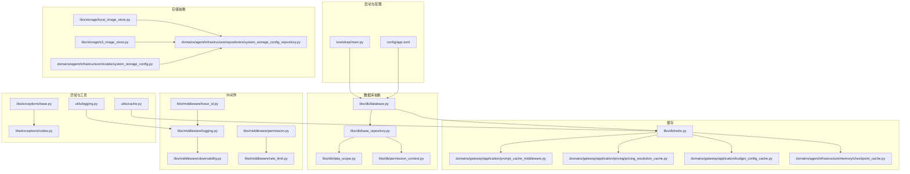
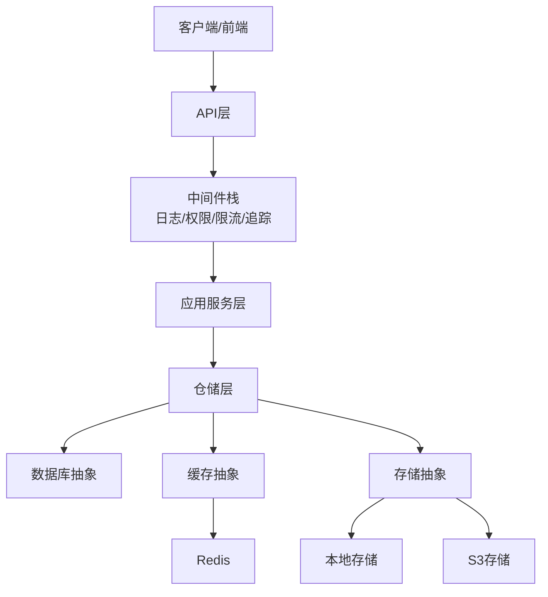
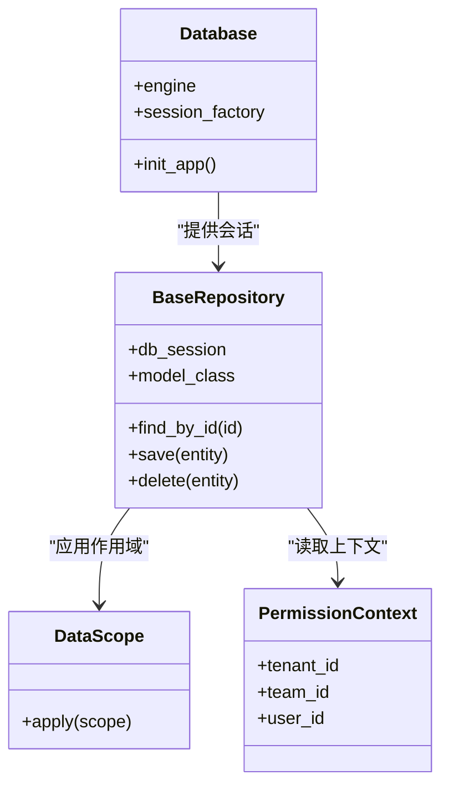
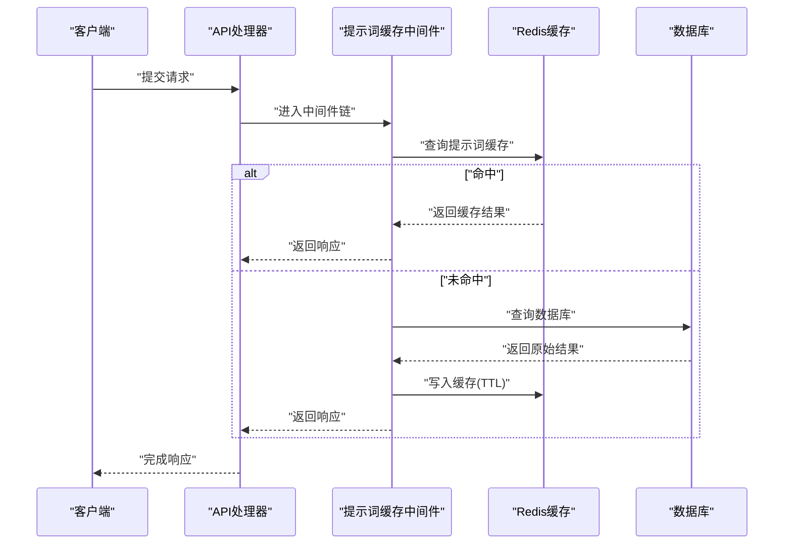
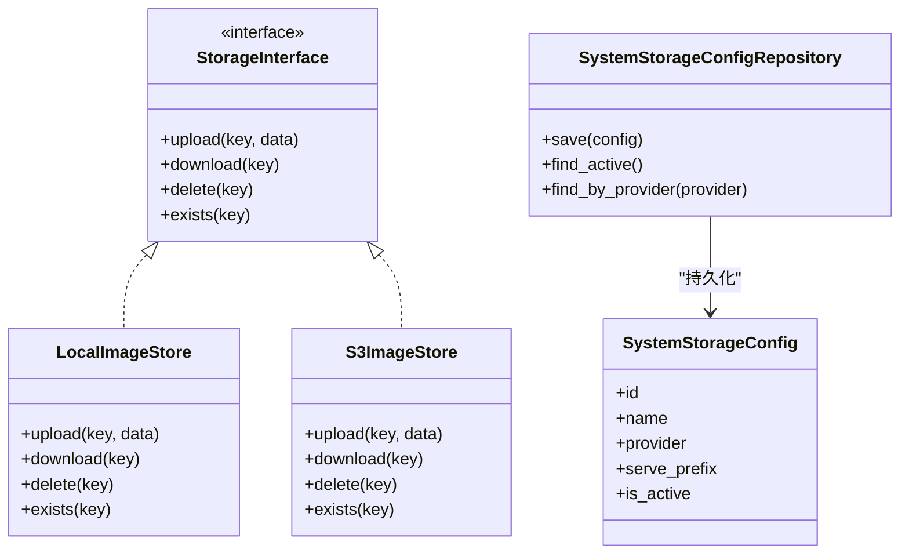
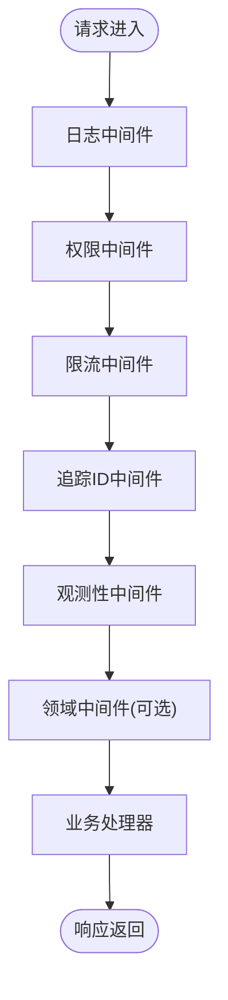
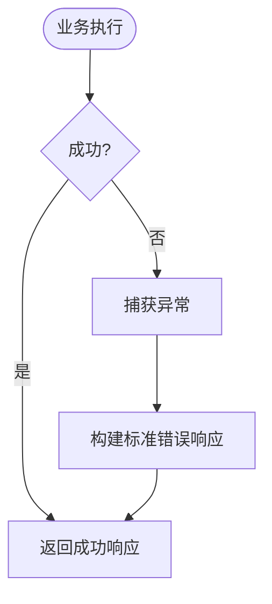
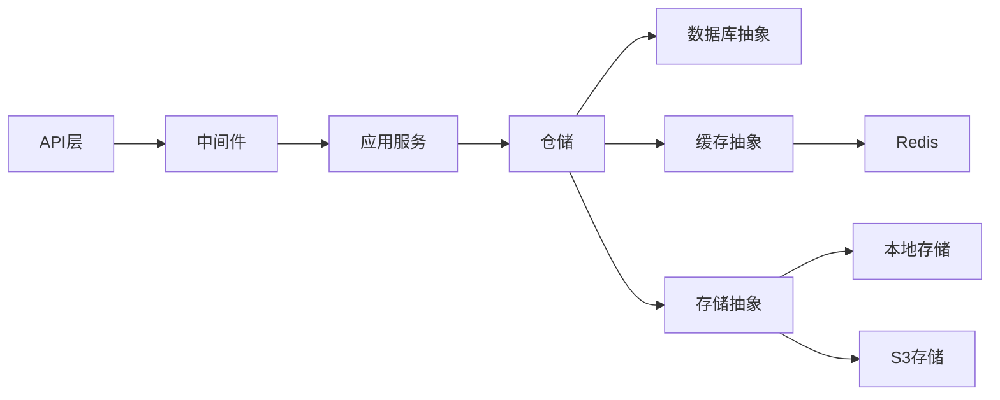

# 基础设施层

<cite>
**本文引用的文件**
- [backend/libs/db/database.py](file://backend/libs/db/database.py)
- [backend/libs/db/base_repository.py](file://backend/libs/db/base_repository.py)
- [backend/libs/db/data_scope.py](file://backend/libs/db/data_scope.py)
- [backend/libs/db/permission_context.py](file://backend/libs/db/permission_context.py)
- [backend/libs/db/redis.py](file://backend/libs/db/redis.py)
- [backend/libs/storage/local_image_store.py](file://backend/libs/storage/local_image_store.py)
- [backend/libs/storage/s3_image_store.py](file://backend/libs/storage/s3_image_store.py)
- [backend/libs/middleware/logging.py](file://backend/libs/middleware/logging.py)
- [backend/libs/middleware/observability.py](file://backend/libs/middleware/observability.py)
- [backend/libs/middleware/permission.py](file://backend/libs/middleware/permission.py)
- [backend/libs/middleware/rate_limit.py](file://backend/libs/middleware/rate_limit.py)
- [backend/libs/middleware/trace_id.py](file://backend/libs/middleware/trace_id.py)
- [backend/libs/exceptions/base.py](file://backend/libs/exceptions/base.py)
- [backend/libs/exceptions/codes.py](file://backend/libs/exceptions/codes.py)
- [backend/bootstrap/composition/identity_services.py](file://backend/bootstrap/composition/identity_services.py)
- [backend/bootstrap/main.py](file://backend/bootstrap/main.py)
- [backend/domains/gateway/application/prompt_cache_middleware.py](file://backend/domains/gateway/application/prompt_cache_middleware.py)
- [backend/domains/agent/infrastructure/memory/checkpoint_cache.py](file://backend/domains/agent/infrastructure/memory/checkpoint_cache.py)
- [backend/domains/gateway/application/budget_config_cache.py](file://backend/domains/gateway/application/budget_config_cache.py)
- [backend/domains/gateway/application/pricing/pricing_resolution_cache.py](file://backend/domains/gateway/application/pricing/pricing_resolution_cache.py)
- [backend/domains/agent/infrastructure/models/system_storage_config.py](file://backend/domains/agent/infrastructure/models/system_storage_config.py)
- [backend/domains/agent/infrastructure/repositories/system_storage_config_repository.py](file://backend/domains/agent/infrastructure/repositories/system_storage_config_repository.py)
- [backend/utils/cache.py](file://backend/utils/cache.py)
- [backend/utils/logging.py](file://backend/utils/logging.py)
- [backend/config/app.toml](file://backend/config/app.toml)
</cite>

## 目录
1. [引言](#引言)
2. [项目结构](#项目结构)
3. [核心组件](#核心组件)
4. [架构总览](#架构总览)
5. [详细组件分析](#详细组件分析)
6. [依赖关系分析](#依赖关系分析)
7. [性能考量](#性能考量)
8. [故障排查指南](#故障排查指南)
9. [结论](#结论)
10. [附录](#附录)

## 引言
本文件聚焦于AI Agent基础设施层，系统化阐述数据库抽象、缓存系统、存储抽象与中间件组件的设计理念与实现方式。文档既面向初学者解释基础设施抽象的价值与边界，也为资深开发者提供深入的实现细节、依赖注入配置与生命周期管理建议。

## 项目结构
基础设施层主要分布在以下模块：
- 数据库与仓储：backend/libs/db
- 缓存：backend/libs/db/redis.py 及多处应用级缓存（如网关定价缓存、预算配置缓存等）
- 存储：backend/libs/storage（本地与S3）及系统存储配置模型与仓库
- 中间件：backend/libs/middleware 与领域特定中间件（如网关提示词缓存中间件）
- 异常体系：backend/libs/exceptions
- 启动与依赖注入：backend/bootstrap
- 工具与通用能力：backend/utils

图表来源
- [backend/bootstrap/main.py](file://backend/bootstrap/main.py)
- [backend/config/app.toml](file://backend/config/app.toml)
- [backend/libs/db/database.py](file://backend/libs/db/database.py)
- [backend/libs/db/base_repository.py](file://backend/libs/db/base_repository.py)
- [backend/libs/db/data_scope.py](file://backend/libs/db/data_scope.py)
- [backend/libs/db/redis.py](file://backend/libs/db/redis.py)
- [backend/libs/storage/local_image_store.py](file://backend/libs/storage/local_image_store.py)
- [backend/libs/storage/s3_image_store.py](file://backend/libs/storage/s3_image_store.py)
- [backend/domains/gateway/application/prompt_cache_middleware.py](file://backend/domains/gateway/application/prompt_cache_middleware.py)
- [backend/domains/gateway/application/pricing/pricing_resolution_cache.py](file://backend/domains/gateway/application/pricing/pricing_resolution_cache.py)
- [backend/domains/gateway/application/budget_config_cache.py](file://backend/domains/gateway/application/budget_config_cache.py)
- [backend/domains/agent/infrastructure/memory/checkpoint_cache.py](file://backend/domains/agent/infrastructure/memory/checkpoint_cache.py)
- [backend/domains/agent/infrastructure/models/system_storage_config.py](file://backend/domains/agent/infrastructure/models/system_storage_config.py)
- [backend/domains/agent/infrastructure/repositories/system_storage_config_repository.py](file://backend/domains/agent/infrastructure/repositories/system_storage_config_repository.py)
- [backend/libs/middleware/logging.py](file://backend/libs/middleware/logging.py)
- [backend/libs/middleware/observability.py](file://backend/libs/middleware/observability.py)
- [backend/libs/middleware/permission.py](file://backend/libs/middleware/permission.py)
- [backend/libs/middleware/rate_limit.py](file://backend/libs/middleware/rate_limit.py)
- [backend/libs/middleware/trace_id.py](file://backend/libs/middleware/trace_id.py)
- [backend/libs/exceptions/base.py](file://backend/libs/exceptions/base.py)
- [backend/libs/exceptions/codes.py](file://backend/libs/exceptions/codes.py)
- [backend/utils/cache.py](file://backend/utils/cache.py)
- [backend/utils/logging.py](file://backend/utils/logging.py)

章节来源
- [backend/bootstrap/main.py](file://backend/bootstrap/main.py)
- [backend/config/app.toml](file://backend/config/app.toml)

## 核心组件
- 数据库抽象与仓储：通过统一的数据库连接与会话管理，结合数据作用域与权限上下文，提供安全可控的数据访问边界。
- 缓存系统：以Redis为核心，覆盖提示词缓存、定价解析缓存、预算配置缓存与检查点缓存等场景，支持键空间策略与失效策略。
- 存储抽象：统一本地与S3存储接口，配合系统存储配置模型与仓库，实现跨环境一致的文件/图像存储能力。
- 中间件体系：涵盖日志、可观测性、权限控制、限流与追踪ID传播，形成横切关注点的标准化接入点。
- 异常处理：自定义异常基类与错误码体系，统一错误响应格式与语义化错误分类。

章节来源
- [backend/libs/db/database.py](file://backend/libs/db/database.py)
- [backend/libs/db/base_repository.py](file://backend/libs/db/base_repository.py)
- [backend/libs/db/redis.py](file://backend/libs/db/redis.py)
- [backend/libs/storage/local_image_store.py](file://backend/libs/storage/local_image_store.py)
- [backend/libs/storage/s3_image_store.py](file://backend/libs/storage/s3_image_store.py)
- [backend/libs/middleware/logging.py](file://backend/libs/middleware/logging.py)
- [backend/libs/middleware/observability.py](file://backend/libs/middleware/observability.py)
- [backend/libs/middleware/permission.py](file://backend/libs/middleware/permission.py)
- [backend/libs/middleware/rate_limit.py](file://backend/libs/middleware/rate_limit.py)
- [backend/libs/middleware/trace_id.py](file://backend/libs/middleware/trace_id.py)
- [backend/libs/exceptions/base.py](file://backend/libs/exceptions/base.py)
- [backend/libs/exceptions/codes.py](file://backend/libs/exceptions/codes.py)

## 架构总览
基础设施层采用“分层+抽象”的设计：上层业务通过仓储与服务接口调用，底层由数据库、缓存与存储提供统一能力；中间件在请求链路中注入横切逻辑；异常体系保证错误的一致表达与处理。

图表来源
- [backend/libs/db/database.py](file://backend/libs/db/database.py)
- [backend/libs/db/redis.py](file://backend/libs/db/redis.py)
- [backend/libs/storage/local_image_store.py](file://backend/libs/storage/local_image_store.py)
- [backend/libs/storage/s3_image_store.py](file://backend/libs/storage/s3_image_store.py)
- [backend/libs/middleware/logging.py](file://backend/libs/middleware/logging.py)
- [backend/libs/middleware/permission.py](file://backend/libs/middleware/permission.py)
- [backend/libs/middleware/rate_limit.py](file://backend/libs/middleware/rate_limit.py)
- [backend/libs/middleware/trace_id.py](file://backend/libs/middleware/trace_id.py)

## 详细组件分析

### 数据库抽象与仓储
- 连接与会话管理：集中初始化数据库引擎与会话工厂，确保连接池参数与生命周期可控。
- 仓储基类：封装CRUD与查询构建，屏蔽SQLAlchemy细节，提供统一的实体操作接口。
- 数据作用域与权限上下文：在查询层面注入租户/团队/用户维度的过滤条件，保障数据隔离与权限控制。
- 事务处理：通过会话与上下文管理事务边界，支持嵌套事务与回滚策略。

图表来源
- [backend/libs/db/database.py](file://backend/libs/db/database.py)
- [backend/libs/db/base_repository.py](file://backend/libs/db/base_repository.py)
- [backend/libs/db/data_scope.py](file://backend/libs/db/data_scope.py)
- [backend/libs/db/permission_context.py](file://backend/libs/db/permission_context.py)

章节来源
- [backend/libs/db/database.py](file://backend/libs/db/database.py)
- [backend/libs/db/base_repository.py](file://backend/libs/db/base_repository.py)
- [backend/libs/db/data_scope.py](file://backend/libs/db/data_scope.py)
- [backend/libs/db/permission_context.py](file://backend/libs/db/permission_context.py)

### 缓存系统（Redis）
- 集成与配置：通过统一的Redis客户端封装，集中管理连接、序列化与超时策略。
- 键空间策略：针对不同业务域采用前缀化命名，避免键冲突并便于清理与统计。
- 失效机制：支持基于TTL的自动过期与显式删除，结合业务场景选择LRU或主动淘汰。
- 性能优化：批量读写、Pipeline、热点键分片与只读副本利用，降低延迟与提升吞吐。
- 应用示例：
  - 提示词缓存中间件：对重复提示进行命中与降级处理。
  - 定价解析缓存：缓存模型定价与路由决策结果。
  - 预算配置缓存：缓存系统预算策略与配额状态。
  - 检查点缓存：Agent记忆检查点的快速加载与持久化。

图表来源
- [backend/domains/gateway/application/prompt_cache_middleware.py](file://backend/domains/gateway/application/prompt_cache_middleware.py)
- [backend/libs/db/redis.py](file://backend/libs/db/redis.py)

章节来源
- [backend/libs/db/redis.py](file://backend/libs/db/redis.py)
- [backend/domains/gateway/application/prompt_cache_middleware.py](file://backend/domains/gateway/application/prompt_cache_middleware.py)
- [backend/domains/gateway/application/pricing/pricing_resolution_cache.py](file://backend/domains/gateway/application/pricing/pricing_resolution_cache.py)
- [backend/domains/gateway/application/budget_config_cache.py](file://backend/domains/gateway/application/budget_config_cache.py)
- [backend/domains/agent/infrastructure/memory/checkpoint_cache.py](file://backend/domains/agent/infrastructure/memory/checkpoint_cache.py)

### 存储抽象（本地与S3）
- 统一接口：定义上传、下载、删除与存在性检查等标准方法，屏蔽后端差异。
- 本地存储：适合开发与小规模部署，路径映射与静态资源服务。
- S3存储：适配云厂商对象存储，支持签名URL、跨区域复制与版本控制。
- 系统存储配置：通过模型与仓库管理全局存储策略（如唯一激活配置、前缀与域名），确保一致性与可审计。

图表来源
- [backend/libs/storage/local_image_store.py](file://backend/libs/storage/local_image_store.py)
- [backend/libs/storage/s3_image_store.py](file://backend/libs/storage/s3_image_store.py)
- [backend/domains/agent/infrastructure/models/system_storage_config.py](file://backend/domains/agent/infrastructure/models/system_storage_config.py)
- [backend/domains/agent/infrastructure/repositories/system_storage_config_repository.py](file://backend/domains/agent/infrastructure/repositories/system_storage_config_repository.py)

章节来源
- [backend/libs/storage/local_image_store.py](file://backend/libs/storage/local_image_store.py)
- [backend/libs/storage/s3_image_store.py](file://backend/libs/storage/s3_image_store.py)
- [backend/domains/agent/infrastructure/models/system_storage_config.py](file://backend/domains/agent/infrastructure/models/system_storage_config.py)
- [backend/domains/agent/infrastructure/repositories/system_storage_config_repository.py](file://backend/domains/agent/infrastructure/repositories/system_storage_config_repository.py)

### 中间件系统
- 日志中间件：统一请求/响应日志、耗时统计与敏感信息脱敏。
- 观测性中间件：指标采集、链路追踪与健康检查。
- 权限中间件：基于角色/租户/团队的访问控制与授权判定。
- 限流中间件：令牌桶/滑动窗口等算法，按用户/IP/密钥维度限速。
- 追踪ID中间件：在请求头与日志中传递Trace ID，贯穿全链路。
- 领域中间件：如提示词缓存中间件，将缓存策略下沉到请求链路。

图表来源
- [backend/libs/middleware/logging.py](file://backend/libs/middleware/logging.py)
- [backend/libs/middleware/permission.py](file://backend/libs/middleware/permission.py)
- [backend/libs/middleware/rate_limit.py](file://backend/libs/middleware/rate_limit.py)
- [backend/libs/middleware/trace_id.py](file://backend/libs/middleware/trace_id.py)
- [backend/libs/middleware/observability.py](file://backend/libs/middleware/observability.py)
- [backend/domains/gateway/application/prompt_cache_middleware.py](file://backend/domains/gateway/application/prompt_cache_middleware.py)

章节来源
- [backend/libs/middleware/logging.py](file://backend/libs/middleware/logging.py)
- [backend/libs/middleware/observability.py](file://backend/libs/middleware/observability.py)
- [backend/libs/middleware/permission.py](file://backend/libs/middleware/permission.py)
- [backend/libs/middleware/rate_limit.py](file://backend/libs/middleware/rate_limit.py)
- [backend/libs/middleware/trace_id.py](file://backend/libs/middleware/trace_id.py)
- [backend/domains/gateway/application/prompt_cache_middleware.py](file://backend/domains/gateway/application/prompt_cache_middleware.py)

### 异常处理机制
- 自定义异常基类：定义异常层次与通用字段（如错误码、消息、上下文）。
- 错误码体系：标准化错误码枚举，便于前端与监控系统识别。
- 错误响应格式：统一JSON结构，包含时间戳、错误码、消息与可选详情。
- 最佳实践：在中间件或异常处理器中捕获并转换为标准响应，避免泄露内部错误细节。

图表来源
- [backend/libs/exceptions/base.py](file://backend/libs/exceptions/base.py)
- [backend/libs/exceptions/codes.py](file://backend/libs/exceptions/codes.py)

章节来源
- [backend/libs/exceptions/base.py](file://backend/libs/exceptions/base.py)
- [backend/libs/exceptions/codes.py](file://backend/libs/exceptions/codes.py)

### 依赖注入与生命周期管理
- 启动装配：在应用启动时注册数据库、缓存、存储与中间件等组件，建立全局单例。
- 服务组合：通过组合模块（composition）集中管理服务依赖关系与初始化顺序。
- 生命周期：确保在应用关闭时正确释放数据库连接、缓存连接与文件句柄等资源。
- 配置驱动：通过配置文件（如app.toml）控制组件启用、参数与环境切换。

章节来源
- [backend/bootstrap/main.py](file://backend/bootstrap/main.py)
- [backend/bootstrap/composition/identity_services.py](file://backend/bootstrap/composition/identity_services.py)
- [backend/config/app.toml](file://backend/config/app.toml)

## 依赖关系分析
- 组件耦合：仓储依赖数据库抽象；缓存与存储作为可插拔后端被仓储与应用服务使用；中间件在API层形成横切依赖。
- 外部依赖：数据库（SQLAlchemy）、Redis、S3 SDK；中间件依赖HTTP框架与日志/观测库。
- 循环依赖规避：通过接口与抽象类解耦，避免仓储与服务之间的直接循环引用。

图表来源
- [backend/libs/db/database.py](file://backend/libs/db/database.py)
- [backend/libs/db/redis.py](file://backend/libs/db/redis.py)
- [backend/libs/storage/local_image_store.py](file://backend/libs/storage/local_image_store.py)
- [backend/libs/storage/s3_image_store.py](file://backend/libs/storage/s3_image_store.py)
- [backend/libs/middleware/logging.py](file://backend/libs/middleware/logging.py)

章节来源
- [backend/libs/db/database.py](file://backend/libs/db/database.py)
- [backend/libs/db/redis.py](file://backend/libs/db/redis.py)
- [backend/libs/storage/local_image_store.py](file://backend/libs/storage/local_image_store.py)
- [backend/libs/storage/s3_image_store.py](file://backend/libs/storage/s3_image_store.py)
- [backend/libs/middleware/logging.py](file://backend/libs/middleware/logging.py)

## 性能考量
- 数据库：合理设置连接池大小、超时与重试；使用批量写入与索引优化；在高频查询上引入只读副本。
- 缓存：热点键预热、TTL策略与冷热分离；避免缓存穿透与雪崩；定期清理过期键。
- 存储：分块上传/断点续传、CDN加速与压缩；S3使用多版本与生命周期策略。
- 中间件：减少同步阻塞操作，异步化日志与指标上报；限流与熔断保护下游。

## 故障排查指南
- 数据库问题：检查连接池耗尽、慢查询与锁等待；核对数据作用域与权限上下文是否正确注入。
- 缓存问题：验证键前缀与TTL设置；确认序列化/反序列化一致性；排查网络抖动导致的失败重试。
- 存储问题：校验凭证与权限策略；检查URL签名与跨域配置；定位上传/下载失败的具体阶段。
- 中间件问题：开启详细日志，定位中间件顺序与拦截点；核对追踪ID是否完整传递。
- 异常问题：根据错误码快速定位业务域；在异常处理器中输出结构化日志以便检索。

章节来源
- [backend/libs/exceptions/base.py](file://backend/libs/exceptions/base.py)
- [backend/libs/exceptions/codes.py](file://backend/libs/exceptions/codes.py)
- [backend/utils/logging.py](file://backend/utils/logging.py)

## 结论
基础设施层通过抽象与标准化，将数据库、缓存、存储与中间件等横切能力下沉，使上层业务专注于领域逻辑。配合完善的异常体系、依赖注入与生命周期管理，既能满足初学者快速理解，也能支撑复杂场景下的扩展与优化。

## 附录
- 关键实现参考路径（不展示具体代码内容）：
  - 数据库与仓储：[database.py](file://backend/libs/db/database.py)，[base_repository.py](file://backend/libs/db/base_repository.py)，[data_scope.py](file://backend/libs/db/data_scope.py)，[permission_context.py](file://backend/libs/db/permission_context.py)
  - 缓存：[redis.py](file://backend/libs/db/redis.py)，[prompt_cache_middleware.py](file://backend/domains/gateway/application/prompt_cache_middleware.py)，[pricing_resolution_cache.py](file://backend/domains/gateway/application/pricing/pricing_resolution_cache.py)，[budget_config_cache.py](file://backend/domains/gateway/application/budget_config_cache.py)，[checkpoint_cache.py](file://backend/domains/agent/infrastructure/memory/checkpoint_cache.py)
  - 存储：[local_image_store.py](file://backend/libs/storage/local_image_store.py)，[s3_image_store.py](file://backend/libs/storage/s3_image_store.py)，[system_storage_config.py](file://backend/domains/agent/infrastructure/models/system_storage_config.py)，[system_storage_config_repository.py](file://backend/domains/agent/infrastructure/repositories/system_storage_config_repository.py)
  - 中间件：[logging.py](file://backend/libs/middleware/logging.py)，[observability.py](file://backend/libs/middleware/observability.py)，[permission.py](file://backend/libs/middleware/permission.py)，[rate_limit.py](file://backend/libs/middleware/rate_limit.py)，[trace_id.py](file://backend/libs/middleware/trace_id.py)
  - 异常：[base.py](file://backend/libs/exceptions/base.py)，[codes.py](file://backend/libs/exceptions/codes.py)
  - 启动与配置：[main.py](file://backend/bootstrap/main.py)，[identity_services.py](file://backend/bootstrap/composition/identity_services.py)，[app.toml](file://backend/config/app.toml)
  - 工具：[cache.py](file://backend/utils/cache.py)，[logging.py](file://backend/utils/logging.py)