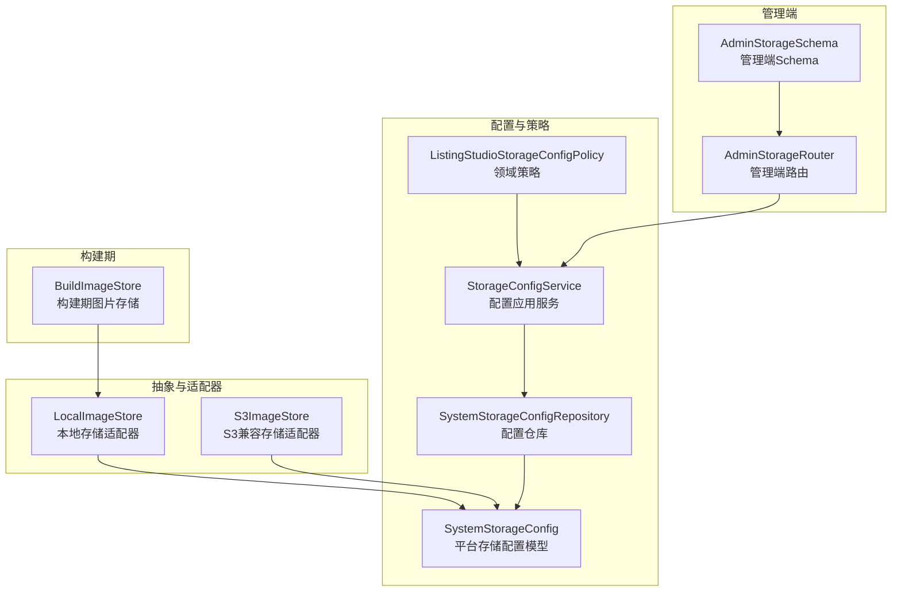
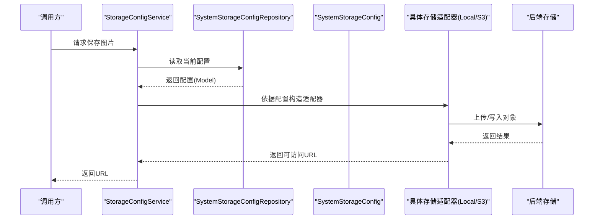
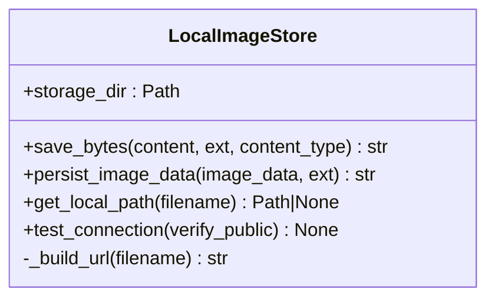
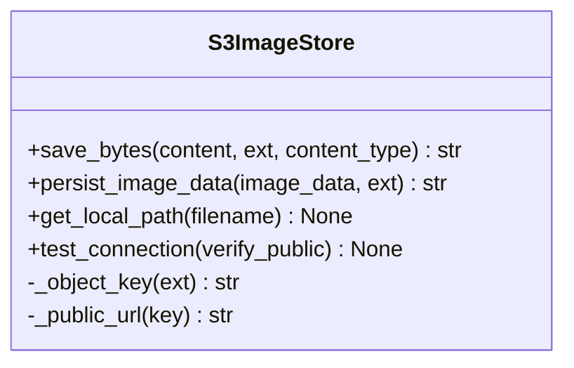
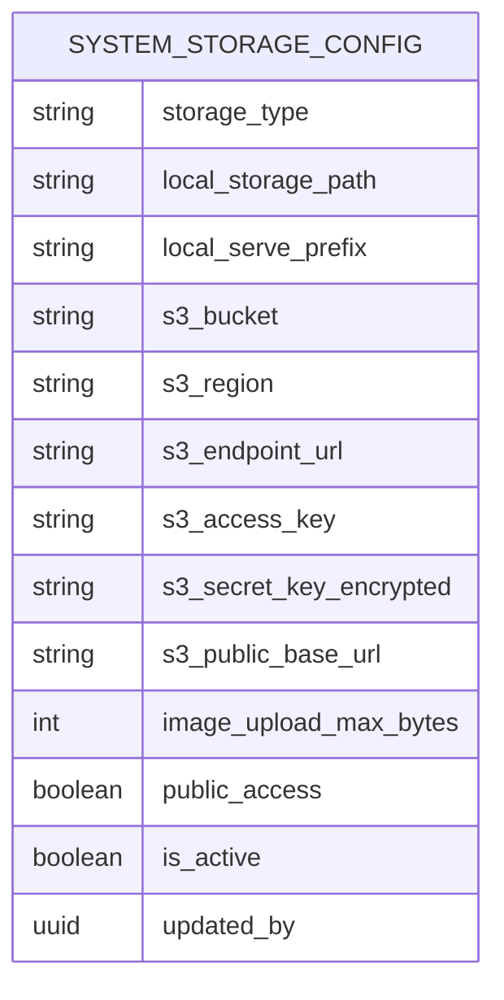
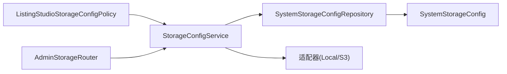

# 存储抽象层

<cite>
**本文引用的文件**
- [backend/libs/storage/__init__.py](file://backend/libs/storage/__init__.py)
- [backend/libs/storage/local_image_store.py](file://backend/libs/storage/local_image_store.py)
- [backend/libs/storage/s3_image_store.py](file://backend/libs/storage/s3_image_store.py)
- [backend/domains/agent/infrastructure/models/system_storage_config.py](file://backend/domains/agent/infrastructure/models/system_storage_config.py)
- [backend/domains/agent/application/storage_config_service.py](file://backend/domains/agent/application/storage_config_service.py)
- [backend/domains/agent/infrastructure/repositories/system_storage_config_repository.py](file://backend/domains/agent/infrastructure/repositories/system_storage_config_repository.py)
- [backend/domains/agent/presentation/admin_storage_router.py](file://backend/domains/agent/presentation/admin_storage_router.py)
- [backend/domains/agent/presentation/schemas/admin_storage.py](file://backend/domains/agent/presentation/schemas/admin_storage.py)
- [backend/domains/agent/domain/listing_studio/storage_config_policy.py](file://backend/domains/agent/domain/listing_studio/storage_config_policy.py)
- [backend/domains/agent/infrastructure/storage/build_image_store.py](file://backend/domains/agent/infrastructure/storage/build_image_store.py)
- [backend/tests/integration/api/test_admin_storage_api.py](file://backend/tests/integration/api/test_admin_storage_api.py)
- [backend/tests/unit/application/test_storage_config_service.py](file://backend/tests/unit/application/test_storage_config_service.py)
- [backend/tests/unit/domain/test_listing_studio_storage_config_policy.py](file://backend/tests/unit/domain/test_listing_studio_storage_config_policy.py)
- [backend/tests/unit/application/test_storage_config_serve_prefix.py](file://backend/tests/unit/application/test_storage_config_serve_prefix.py)
</cite>

## 目录
1. [引言](#引言)
2. [项目结构](#项目结构)
3. [核心组件](#核心组件)
4. [架构总览](#架构总览)
5. [组件详解](#组件详解)
6. [依赖关系分析](#依赖关系分析)
7. [性能考量](#性能考量)
8. [故障排查指南](#故障排查指南)
9. [结论](#结论)
10. [附录](#附录)

## 引言
本技术文档聚焦于AI Agent存储抽象层的设计与实现，目标是为本地存储与云存储（S3兼容）提供统一的接口抽象，屏蔽底层差异，使上层业务仅需面向统一的“图片存储”能力进行开发与运维。文档从抽象理念、适配器实现、配置管理、性能优化、监控维护、安全考虑等方面展开，并兼顾初学者与资深工程师的不同需求。

## 项目结构
存储抽象层主要分布在以下位置：
- 抽象与适配器实现：backend/libs/storage
- 平台级存储配置模型与仓库：backend/domains/agent/infrastructure/models 与 repositories
- 应用服务与领域策略：backend/domains/agent/application 与 domain
- 管理端接口与Schema：backend/domains/agent/presentation
- 构建期图片存储适配器：backend/domains/agent/infrastructure/storage
- 测试：backend/tests 下对应模块

图表来源
- [backend/libs/storage/local_image_store.py:1-90](file://backend/libs/storage/local_image_store.py#L1-L90)
- [backend/libs/storage/s3_image_store.py:1-113](file://backend/libs/storage/s3_image_store.py#L1-L113)
- [backend/domains/agent/infrastructure/models/system_storage_config.py:1-73](file://backend/domains/agent/infrastructure/models/system_storage_config.py#L1-L73)
- [backend/domains/agent/application/storage_config_service.py](file://backend/domains/agent/application/storage_config_service.py)
- [backend/domains/agent/infrastructure/repositories/system_storage_config_repository.py](file://backend/domains/agent/infrastructure/repositories/system_storage_config_repository.py)
- [backend/domains/agent/domain/listing_studio/storage_config_policy.py](file://backend/domains/agent/domain/listing_studio/storage_config_policy.py)
- [backend/domains/agent/presentation/admin_storage_router.py](file://backend/domains/agent/presentation/admin_storage_router.py)
- [backend/domains/agent/presentation/schemas/admin_storage.py](file://backend/domains/agent/presentation/schemas/admin_storage.py)
- [backend/domains/agent/infrastructure/storage/build_image_store.py](file://backend/domains/agent/infrastructure/storage/build_image_store.py)

章节来源
- [backend/libs/storage/__init__.py:1-7](file://backend/libs/storage/__init__.py#L1-L7)
- [backend/libs/storage/local_image_store.py:1-90](file://backend/libs/storage/local_image_store.py#L1-L90)
- [backend/libs/storage/s3_image_store.py:1-113](file://backend/libs/storage/s3_image_store.py#L1-L113)
- [backend/domains/agent/infrastructure/models/system_storage_config.py:1-73](file://backend/domains/agent/infrastructure/models/system_storage_config.py#L1-L73)

## 核心组件
- 本地存储适配器 LocalImageStore：将图片保存至本地文件系统，支持URL前缀与公开访问基地址，提供写入探测与路径穿越安全校验。
- S3兼容存储适配器 S3ImageStore：通过异步客户端上传对象，支持自定义Endpoint、Region、AccessKey/SecretKey与公开URL，提供连接性与公开URL可达性验证。
- 平台存储配置 SystemStorageConfig：以单行singleton形式记录存储类型、本地路径、S3参数、上传限制、公开访问开关与激活状态等。
- 配置仓库与应用服务：负责持久化与读取配置、提供运行时选择具体适配器的能力。
- 领域策略与管理端接口：约束访问范围与权限，提供管理员配置入口与校验逻辑。

章节来源
- [backend/libs/storage/local_image_store.py:19-90](file://backend/libs/storage/local_image_store.py#L19-L90)
- [backend/libs/storage/s3_image_store.py:17-113](file://backend/libs/storage/s3_image_store.py#L17-L113)
- [backend/domains/agent/infrastructure/models/system_storage_config.py:18-73](file://backend/domains/agent/infrastructure/models/system_storage_config.py#L18-L73)

## 架构总览
存储抽象层采用“统一接口 + 多适配器”的模式：
- 上层仅依赖统一的图片存储接口（如save_bytes、persist_image_data），无需感知底层是本地还是S3。
- 运行时根据SystemStorageConfig动态选择适配器实例，确保配置变更即时生效。
- 管理端提供配置接口，结合领域策略与权限控制，保障配置的安全与合规。

图表来源
- [backend/domains/agent/application/storage_config_service.py](file://backend/domains/agent/application/storage_config_service.py)
- [backend/domains/agent/infrastructure/repositories/system_storage_config_repository.py](file://backend/domains/agent/infrastructure/repositories/system_storage_config_repository.py)
- [backend/domains/agent/infrastructure/models/system_storage_config.py:18-73](file://backend/domains/agent/infrastructure/models/system_storage_config.py#L18-L73)
- [backend/libs/storage/local_image_store.py:43-54](file://backend/libs/storage/local_image_store.py#L43-L54)
- [backend/libs/storage/s3_image_store.py:44-69](file://backend/libs/storage/s3_image_store.py#L44-L69)

## 组件详解

### 本地存储适配器 LocalImageStore
- 职责
  - 将二进制内容保存到本地目录，生成唯一文件名与可访问URL。
  - 支持对Base64编码的图片数据进行解析与持久化。
  - 提供写入探测（目录可写）与路径穿越安全校验。
- 关键点
  - URL构建：基于serve_prefix与public_base_url组合。
  - 文件命名：UUID.hex + 扩展名，避免冲突。
  - 安全校验：get_local_path中对相对路径与存在性进行检查。
- 使用场景
  - 开发/测试环境或小规模部署的临时存储。
  - 对延迟敏感且存储在本地网络内的场景。

图表来源
- [backend/libs/storage/local_image_store.py:19-90](file://backend/libs/storage/local_image_store.py#L19-L90)

章节来源
- [backend/libs/storage/local_image_store.py:19-90](file://backend/libs/storage/local_image_store.py#L19-L90)

### S3兼容存储适配器 S3ImageStore
- 职责
  - 通过异步S3客户端上传对象，生成公开可访问URL。
  - 支持自定义Endpoint、Region、凭据与公开URL基地址。
  - 提供连接性验证（head_bucket）与公开URL可达性验证。
- 关键点
  - 对象键命名：固定前缀 + UUID.hex + 扩展名。
  - 内容类型：可选设置ContentType。
  - 公开URL：public_base_url + key。
- 使用场景
  - 生产环境的高可用、跨区域对象存储。
  - 需要CDN加速与全球分发的图片资源。

图表来源
- [backend/libs/storage/s3_image_store.py:17-113](file://backend/libs/storage/s3_image_store.py#L17-L113)

章节来源
- [backend/libs/storage/s3_image_store.py:17-113](file://backend/libs/storage/s3_image_store.py#L17-L113)

### 平台存储配置 SystemStorageConfig
- 数据模型
  - 存储类型：local 或 s3。
  - 本地参数：本地存储根目录、URL前缀。
  - S3参数：bucket、region、endpoint、access_key、secret_key、public_base_url。
  - 业务参数：最大上传字节数、是否公开访问、是否激活、更新人。
- 设计要点
  - 单行singleton：保证全局唯一配置。
  - 加密字段：敏感凭据以加密形式存储。
  - 默认值：合理默认便于快速启用。

图表来源
- [backend/domains/agent/infrastructure/models/system_storage_config.py:18-73](file://backend/domains/agent/infrastructure/models/system_storage_config.py#L18-L73)

章节来源
- [backend/domains/agent/infrastructure/models/system_storage_config.py:18-73](file://backend/domains/agent/infrastructure/models/system_storage_config.py#L18-L73)

### 应用服务与仓库
- StorageConfigService
  - 负责根据SystemStorageConfig动态选择适配器实例。
  - 提供运行时配置读取与适配器初始化。
- SystemStorageConfigRepository
  - 提供配置的持久化读写接口。
- 领域策略 ListingStudioStorageConfigPolicy
  - 控制图片上传与访问的策略边界（如命名规范、大小限制、可见性）。

章节来源
- [backend/domains/agent/application/storage_config_service.py](file://backend/domains/agent/application/storage_config_service.py)
- [backend/domains/agent/infrastructure/repositories/system_storage_config_repository.py](file://backend/domains/agent/infrastructure/repositories/system_storage_config_repository.py)
- [backend/domains/agent/domain/listing_studio/storage_config_policy.py](file://backend/domains/agent/domain/listing_studio/storage_config_policy.py)

### 管理端接口与Schema
- AdminStorageRouter
  - 提供管理员配置存储参数的REST接口。
- AdminStorageSchema
  - 定义请求/响应的数据结构与校验规则。

章节来源
- [backend/domains/agent/presentation/admin_storage_router.py](file://backend/domains/agent/presentation/admin_storage_router.py)
- [backend/domains/agent/presentation/schemas/admin_storage.py](file://backend/domains/agent/presentation/schemas/admin_storage.py)

### 构建期图片存储 BuildImageStore
- 用途
  - 在构建阶段或离线任务中使用本地存储进行图片生成与落盘。
- 关系
  - 通常复用LocalImageStore作为基础能力。

章节来源
- [backend/domains/agent/infrastructure/storage/build_image_store.py](file://backend/domains/agent/infrastructure/storage/build_image_store.py)

## 依赖关系分析
- 适配器与配置解耦：适配器不直接读取配置，而是由应用服务根据SystemStorageConfig构造。
- 仓库与模型解耦：仓库封装ORM细节，应用服务只关心业务语义。
- 策略与服务解耦：策略负责规则判定，服务负责执行与编排。
- 管理端与核心逻辑解耦：管理端仅负责配置输入，不影响运行时适配器选择。

图表来源
- [backend/domains/agent/application/storage_config_service.py](file://backend/domains/agent/application/storage_config_service.py)
- [backend/domains/agent/infrastructure/repositories/system_storage_config_repository.py](file://backend/domains/agent/infrastructure/repositories/system_storage_config_repository.py)
- [backend/domains/agent/infrastructure/models/system_storage_config.py:18-73](file://backend/domains/agent/infrastructure/models/system_storage_config.py#L18-L73)
- [backend/domains/agent/domain/listing_studio/storage_config_policy.py](file://backend/domains/agent/domain/listing_studio/storage_config_policy.py)
- [backend/domains/agent/presentation/admin_storage_router.py](file://backend/domains/agent/presentation/admin_storage_router.py)

## 性能考量
- 分块上传与并发
  - 当前S3适配器为单对象PUT，未见分块上传实现；对于大文件建议扩展为多部分上传并行上传各分片，最后合并。
  - 并发控制：在应用服务层引入限流与队列，避免瞬时高并发导致的资源争用。
- 缓存策略
  - 对热点图片增加CDN缓存与浏览器缓存头，减少回源压力。
  - 本地存储可结合反向代理缓存（如Nginx）提升命中率。
- 传输优化
  - S3上传时设置合适的ContentType与ContentEncoding，有利于CDN与浏览器缓存。
- 存储成本
  - 合理设置上传上限与生命周期策略，避免无限增长。
  - 对历史图片进行冷热分层存储。

## 故障排查指南
- 本地存储问题
  - 目录不可写：通过test_connection写探针文件定位权限问题。
  - 路径穿越：get_local_path会拒绝越界访问，检查serve_prefix与传入文件名。
- S3连接问题
  - bucket不可达：通过head_bucket验证权限与网络连通。
  - 公开URL不可访问：开启verify_public后，适配器会HEAD探针URL并校验状态码。
- 配置问题
  - 配置未生效：确认is_active与updated_by信息，核对应用服务是否正确读取最新配置。
  - 凭据错误：检查加密字段解密流程与凭据有效期。
- 管理端接口
  - 接口返回异常：查看AdminStorageRouter的Schema校验与服务层异常处理。

章节来源
- [backend/libs/storage/local_image_store.py:69-78](file://backend/libs/storage/local_image_store.py#L69-L78)
- [backend/libs/storage/s3_image_store.py:79-110](file://backend/libs/storage/s3_image_store.py#L79-L110)
- [backend/tests/integration/api/test_admin_storage_api.py](file://backend/tests/integration/api/test_admin_storage_api.py)
- [backend/tests/unit/application/test_storage_config_service.py](file://backend/tests/unit/application/test_storage_config_service.py)
- [backend/tests/unit/domain/test_listing_studio_storage_config_policy.py](file://backend/tests/unit/domain/test_listing_studio_storage_config_policy.py)
- [backend/tests/unit/application/test_storage_config_serve_prefix.py](file://backend/tests/unit/application/test_storage_config_serve_prefix.py)

## 结论
该存储抽象层通过统一接口与多适配器模式，实现了本地与S3存储的无缝切换；配合平台级配置模型、应用服务与领域策略，既满足了开发与生产的差异化需求，又提供了可审计、可扩展的治理能力。建议后续在大文件场景引入分块上传与并发控制，在监控与告警方面完善空间使用统计与完整性校验机制。

## 附录

### 配置管理与环境变量
- 配置来源
  - SystemStorageConfig：数据库中的平台级配置，支持加密凭据与激活状态。
  - 环境变量：可在启动时注入S3 Endpoint、Region、AccessKey/SecretKey等，供应用服务读取并构造适配器。
- 最佳实践
  - 将敏感凭据置于密钥管理服务，避免硬编码。
  - 通过CI/CD注入环境变量，确保不同环境的配置隔离。

章节来源
- [backend/domains/agent/infrastructure/models/system_storage_config.py:23-45](file://backend/domains/agent/infrastructure/models/system_storage_config.py#L23-L45)
- [backend/domains/agent/application/storage_config_service.py](file://backend/domains/agent/application/storage_config_service.py)

### 监控与维护
- 空间使用统计
  - 本地存储：定期扫描存储目录并统计占用。
  - S3存储：通过对象数量与总字节数指标评估容量趋势。
- 完整性校验
  - 上传后计算哈希并与ETag对比（S3）或本地文件校验，建立定期巡检任务。
- 清理策略
  - 基于时间阈值与访问频率的归档/删除策略，保留热数据，迁移冷数据。

### 安全考虑
- 数据加密
  - 传输加密：强制HTTPS与TLS。
  - 静态加密：S3端加密（SSE-S3或SSE-KMS）或本地磁盘加密。
- 访问控制
  - IAM最小权限原则：仅为对象存储授予必要权限。
  - 公开访问开关：public_access谨慎开启，优先使用签名URL。
- 审计日志
  - 记录所有配置变更与关键操作（上传、删除、权限修改），保留至少90天以上。