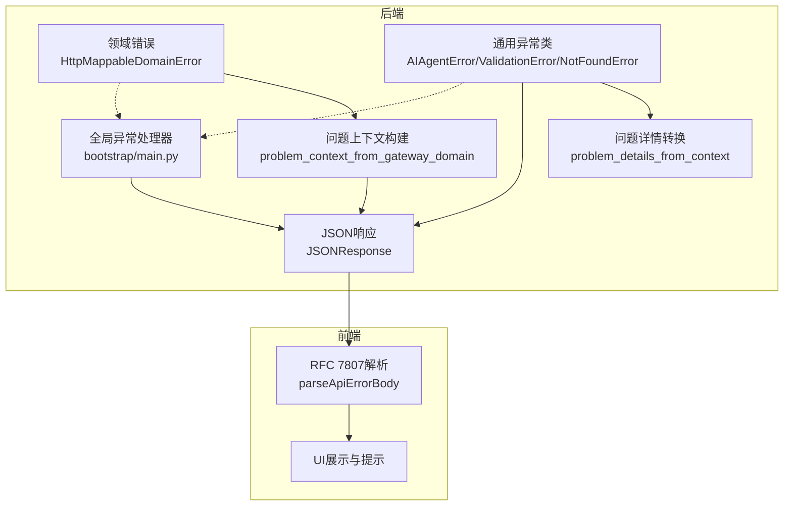
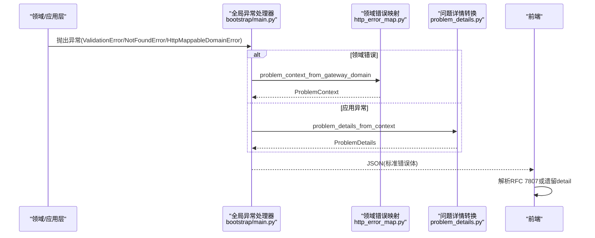
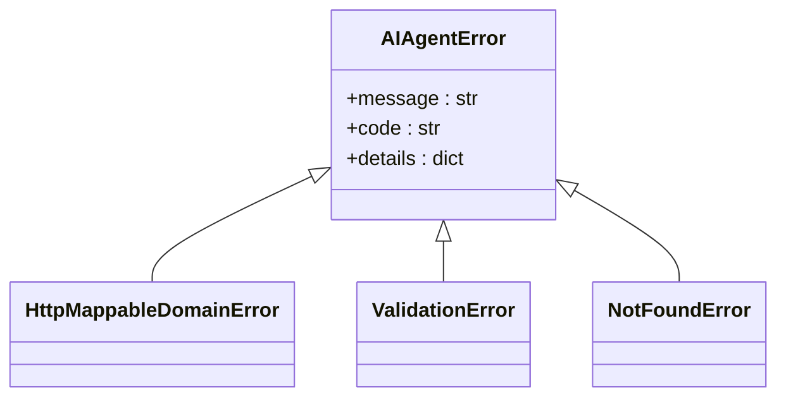
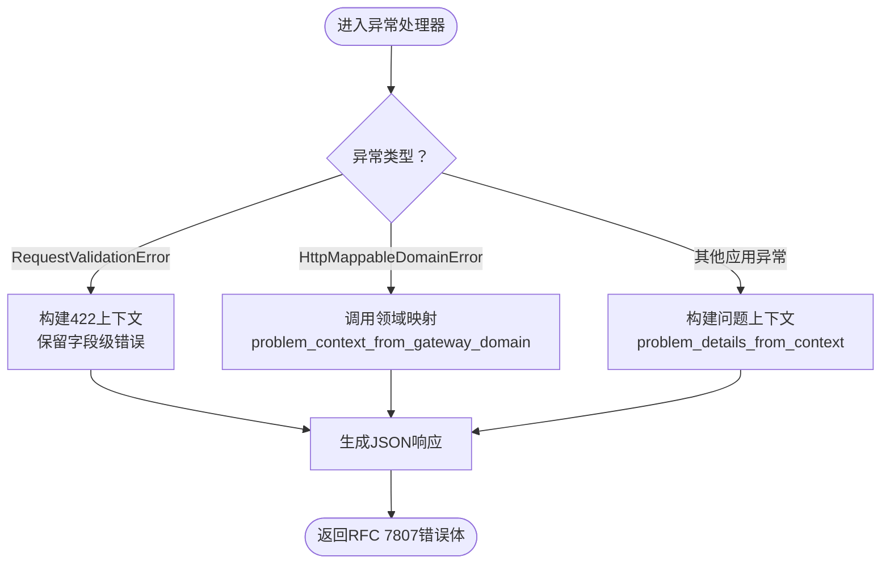
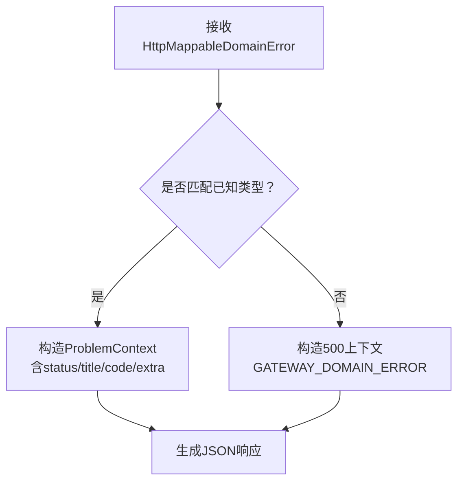
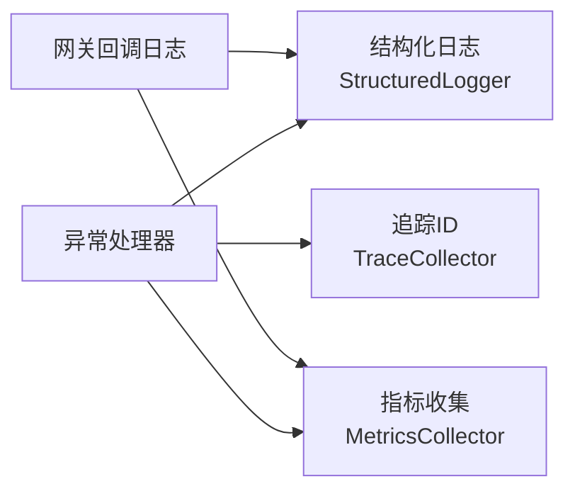
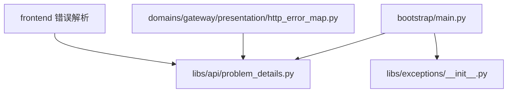

# 异常处理机制

<cite>
**本文引用的文件**
- [API响应规范](file://docs/API_RESPONSE.md)
- [异常基类与领域异常](file://backend/libs/exceptions/base.py)
- [跨域共享异常](file://backend/libs/exceptions/__init__.py)
- [异常码清单](file://backend/libs/exceptions/codes.py)
- [问题详情模型与转换](file://backend/libs/api/problem_details.py)
- [网关领域错误映射](file://backend/domains/gateway/presentation/http_error_map.py)
- [网关代理业务错误分类](file://backend/domains/gateway/presentation/gateway_proxy_business_error_classify.py)
- [主应用异常处理器](file://backend/bootstrap/main.py)
- [前端错误解析工具](file://frontend/src/lib/fastapi-error-detail.test.ts)
- [日志系统使用指南](file://docs/logging.md)
- [可观测性模块导出](file://backend/libs/observability/__init__.py)
- [网关回调自定义日志](file://backend/domains/gateway/infrastructure/callbacks/custom_logger.py)
- [架构测试：禁止在路由层抛出HTTPException](file://backend/tests/architecture/test_no_router_http_exception.py)
- [集成测试：错误响应模式](file://backend/tests/integration/api/test_error_response_schema.py)
- [集成测试：校验错误模式](file://backend/tests/integration/api/test_validation_error_schema.py)
- [单元测试：网关代理调用错误](file://backend/tests/unit/gateway/test_gateway_proxy_invocation_error.py)
</cite>

## 目录
1. [引言](#引言)
2. [项目结构](#项目结构)
3. [核心组件](#核心组件)
4. [架构总览](#架构总览)
5. [详细组件分析](#详细组件分析)
6. [依赖关系分析](#依赖关系分析)
7. [性能考量](#性能考量)
8. [故障排查指南](#故障排查指南)
9. [结论](#结论)
10. [附录](#附录)

## 引言
本文件系统性阐述AI Agent项目的异常处理机制，覆盖异常类层次、错误响应格式标准化、异常传播链路、国际化与本地化、日志与可观测性、以及测试策略与最佳实践。目标是帮助初学者理解异常处理的基本概念与价值，同时为资深开发者提供深入的实现细节与调试技巧。

## 项目结构
异常处理涉及后端异常定义与转换、问题详情（Problem Details）标准化、全局异常处理器、前端错误解析、可观测性日志与指标等模块。整体采用“领域错误 → 问题上下文 → 标准化响应”的分层设计，并通过架构测试约束路由层不得直接抛出HTTPException。

图表来源
- [网关领域错误映射:269-282](file://backend/domains/gateway/presentation/http_error_map.py#L269-L282)
- [问题详情模型与转换:75-89](file://backend/libs/api/problem_details.py#L75-L89)
- [主应用异常处理器:235-310](file://backend/bootstrap/main.py#L235-L310)
- [前端错误解析工具:5-41](file://frontend/src/lib/fastapi-error-detail.test.ts#L5-L41)

章节来源
- [API响应规范:49-142](file://docs/API_RESPONSE.md#L49-L142)
- [主应用异常处理器:235-310](file://backend/bootstrap/main.py#L235-L310)

## 核心组件
- 异常基类与领域异常
  - AIAgentError：所有异常的基类，提供message、code、details字段。
  - HttpMappableDomainError：可被表现层映射为HTTP的领域错误基类。
- 跨域共享异常
  - 提供ValidationError、NotFoundError等常用异常类，统一从libs.exceptions导入。
- 异常码清单
  - 统一维护错误码常量，确保前后端一致。
- 问题详情模型与转换
  - ProblemDetails模型与ProblemContext上下文，支持RFC 7807标准错误体。
  - 提供从请求校验错误、领域错误到问题详情的转换函数。
- 网关领域错误映射
  - 将特定领域异常映射为HTTP状态码与问题上下文。
- 主应用异常处理器
  - 注册针对不同异常类型的全局处理器，输出标准化错误响应。
- 前端错误解析
  - 支持RFC 7807与遗留detail字符串，解析错误消息、代码与字段级错误。
- 可观测性与日志
  - 提供结构化日志、指标与追踪能力，便于定位异常与性能瓶颈。

章节来源
- [异常基类与领域异常:6-35](file://backend/libs/exceptions/base.py#L6-L35)
- [跨域共享异常:31-100](file://backend/libs/exceptions/__init__.py#L31-L100)
- [异常码清单:63-82](file://backend/libs/exceptions/codes.py#L63-L82)
- [问题详情模型与转换:48-91](file://backend/libs/api/problem_details.py#L48-L91)
- [网关领域错误映射:269-282](file://backend/domains/gateway/presentation/http_error_map.py#L269-L282)
- [主应用异常处理器:235-310](file://backend/bootstrap/main.py#L235-L310)
- [前端错误解析工具:5-41](file://frontend/src/lib/fastapi-error-detail.test.ts#L5-L41)
- [日志系统使用指南:1-74](file://docs/logging.md#L1-L74)

## 架构总览
异常处理遵循“领域错误/应用异常 → 问题上下文 → 标准化响应 → 前端解析”的链路，确保错误语义清晰、格式一致、可追踪。

图表来源
- [主应用异常处理器:235-310](file://backend/bootstrap/main.py#L235-L310)
- [网关领域错误映射:269-282](file://backend/domains/gateway/presentation/http_error_map.py#L269-L282)
- [问题详情模型与转换:75-89](file://backend/libs/api/problem_details.py#L75-L89)
- [前端错误解析工具:5-41](file://frontend/src/lib/fastapi-error-detail.test.ts#L5-L41)

## 详细组件分析

### 异常层次与传播
- 设计理念
  - 无域依赖的异常基类打破循环导入，确保libs.exceptions稳定。
  - HttpMappableDomainError用于可被表现层映射的领域错误，避免在应用层直接构造HTTP语义。
  - 应用层统一通过libs.exceptions导入异常类，减少跨域耦合。
- 传播机制
  - 领域/应用层抛出异常，由bootstrap/main.py注册的全局异常处理器捕获并转换为RFC 7807标准错误体。
  - 对于FastAPI的RequestValidationError，统一转换为422并保留字段级错误数组。
  - 对于OpenAI/Anthropic协议例外接口，保持上游错误体格式，不走RFC 7807。

图表来源
- [异常基类与领域异常:6-35](file://backend/libs/exceptions/base.py#L6-L35)
- [跨域共享异常:31-100](file://backend/libs/exceptions/__init__.py#L31-L100)

章节来源
- [异常基类与领域异常:6-35](file://backend/libs/exceptions/base.py#L6-L35)
- [跨域共享异常:31-100](file://backend/libs/exceptions/__init__.py#L31-L100)
- [主应用异常处理器:235-310](file://backend/bootstrap/main.py#L235-L310)
- [API响应规范:128-142](file://docs/API_RESPONSE.md#L128-L142)

### 错误响应格式标准化
- 标准化字段
  - type、title、status、detail、instance、code、errors、extra。
- 默认标题与状态映射
  - 通过default_title_for_status根据HTTP状态返回默认标题。
- 字段级校验错误
  - RequestValidationError统一转换为RFC 7807，errors数组保留loc/msg/type。
- 422与400/401/403/404/409/429/502/500映射
  - 映射关系参见API响应规范中的表格与说明。

图表来源
- [问题详情模型与转换:75-89](file://backend/libs/api/problem_details.py#L75-L89)
- [问题详情模型与转换:144-172](file://backend/libs/api/problem_details.py#L144-L172)
- [主应用异常处理器:235-310](file://backend/bootstrap/main.py#L235-L310)

章节来源
- [API响应规范:49-96](file://docs/API_RESPONSE.md#L49-L96)
- [问题详情模型与转换:61-91](file://backend/libs/api/problem_details.py#L61-L91)
- [问题详情模型与转换:144-172](file://backend/libs/api/problem_details.py#L144-L172)

### 领域错误映射与HTTP状态
- 网关领域错误映射
  - 通过problem_context_from_gateway_domain将已知领域异常映射为对应ProblemContext；未知走500。
  - 支持团队访问、模型不存在等常见场景。
- 业务错误分类
  - 网关代理业务错误分类用于区分不同上游错误类型，辅助更精准的错误响应与告警。

图表来源
- [网关领域错误映射:269-282](file://backend/domains/gateway/presentation/http_error_map.py#L269-L282)
- [网关代理业务错误分类](file://backend/domains/gateway/presentation/gateway_proxy_business_error_classify.py)

章节来源
- [网关领域错误映射:256-282](file://backend/domains/gateway/presentation/http_error_map.py#L256-L282)
- [网关代理业务错误分类](file://backend/domains/gateway/presentation/gateway_proxy_business_error_classify.py)

### 国际化与本地化
- 错误消息本地化
  - 建议在前端层基于code与title进行本地化渲染，detail作为兼容保留字段。
  - 前端解析工具支持解析RFC 7807与遗留detail字符串，便于逐步迁移。
- 字段级错误本地化
  - errors数组中的loc与msg可用于定位字段并结合本地化词典显示友好提示。

章节来源
- [API响应规范:49-76](file://docs/API_RESPONSE.md#L49-L76)
- [前端错误解析工具:5-41](file://frontend/src/lib/fastapi-error-detail.test.ts#L5-L41)

### 日志记录与监控
- 日志系统
  - 后端提供结构化日志与Trace ID追踪，便于关联异常发生上下文。
  - 支持记录API调用、LLM调用、MCP工具调用等关键事件。
- 网关回调日志
  - 自定义回调在成功/失败事件中持久化错误码与错误消息，便于审计与告警。
- 指标与追踪
  - 可观测性模块导出MetricsCollector与TraceCollector，建议在异常处理器中埋点统计错误分布与耗时。

图表来源
- [日志系统使用指南:46-74](file://docs/logging.md#L46-L74)
- [可观测性模块导出:7-15](file://backend/libs/observability/__init__.py#L7-L15)
- [网关回调自定义日志:90-129](file://backend/domains/gateway/infrastructure/callbacks/custom_logger.py#L90-L129)

章节来源
- [日志系统使用指南:1-74](file://docs/logging.md#L1-L74)
- [可观测性模块导出:7-15](file://backend/libs/observability/__init__.py#L7-L15)
- [网关回调自定义日志:90-129](file://backend/domains/gateway/infrastructure/callbacks/custom_logger.py#L90-L129)

### 异常处理最佳实践
- 异常分类
  - 业务异常：使用HttpMappableDomainError并提供明确的ProblemContext。
  - 应用异常：ValidationError、NotFoundError等，由全局处理器统一转换。
  - HTTP异常白名单：仅允许特定兼容适配器文件内抛出HTTPException。
- 错误恢复策略
  - 对可重试的外部服务错误（如限流、网络抖动）建议在上层策略中重试与退避。
  - 对输入校验错误，优先返回422并保留字段级错误，提升修复效率。
- 用户体验优化
  - 前端解析RFC 7807，优先展示code与title，再降级到detail。
  - 字段级错误用于高亮表单错误位置，减少用户困惑。

章节来源
- [API响应规范:108-125](file://docs/API_RESPONSE.md#L108-L125)
- [架构测试：禁止在路由层抛出HTTPException:49-64](file://backend/tests/architecture/test_no_router_http_exception.py#L49-L64)

### 测试方法
- 单元测试
  - 针对异常类与映射逻辑的单元测试，验证异常码、标题与上下文字段。
- 集成测试
  - 验证错误响应模式与校验错误模式，断言status、code、detail与errors。
- 端到端测试
  - 覆盖真实请求路径，验证从异常抛出到前端解析的完整链路。

章节来源
- [集成测试：错误响应模式](file://backend/tests/integration/api/test_error_response_schema.py)
- [集成测试：校验错误模式](file://backend/tests/integration/api/test_validation_error_schema.py)
- [单元测试：网关代理调用错误](file://backend/tests/unit/gateway/test_gateway_proxy_invocation_error.py)

## 依赖关系分析
- 组件耦合
  - bootstrap/main.py依赖libs.api.problem_details与各异常类，负责统一异常转换。
  - domains.gateway.presentation.http_error_map依赖异常码与默认标题映射。
  - 前端依赖RFC 7807解析工具，确保兼容遗留错误体。
- 外部依赖
  - FastAPI的RequestValidationError统一转换为RFC 7807。
  - OpenAI/Anthropic协议例外接口保持上游错误体格式。

图表来源
- [主应用异常处理器:235-310](file://backend/bootstrap/main.py#L235-L310)
- [问题详情模型与转换:75-89](file://backend/libs/api/problem_details.py#L75-L89)
- [跨域共享异常:31-100](file://backend/libs/exceptions/__init__.py#L31-L100)
- [网关领域错误映射:269-282](file://backend/domains/gateway/presentation/http_error_map.py#L269-L282)
- [前端错误解析工具:5-41](file://frontend/src/lib/fastapi-error-detail.test.ts#L5-L41)

章节来源
- [主应用异常处理器:235-310](file://backend/bootstrap/main.py#L235-L310)
- [问题详情模型与转换:75-89](file://backend/libs/api/problem_details.py#L75-L89)
- [网关领域错误映射:269-282](file://backend/domains/gateway/presentation/http_error_map.py#L269-L282)

## 性能考量
- 异常开销
  - 异常路径应尽量避免昂贵操作（如大对象序列化），优先使用轻量上下文。
- 响应体积
  - errors数组仅保留必要字段，避免冗余信息导致响应膨胀。
- 监控与告警
  - 建议在异常处理器中埋点统计错误分布与耗时，结合Trace ID进行根因分析。

## 故障排查指南
- 常见问题
  - 422字段级错误缺失：检查RequestValidationError转换逻辑与字段映射。
  - 500未知领域错误：确认problem_context_from_gateway_domain是否覆盖该异常类型。
  - 前端无法解析错误：核对RFC 7807字段与遗留detail兼容逻辑。
- 排查步骤
  - 查看后端日志与Trace ID，定位异常发生上下文。
  - 检查异常处理器是否正确转换为ProblemDetails。
  - 核对前端解析工具对code、title、detail与errors的处理。

章节来源
- [主应用异常处理器:235-310](file://backend/bootstrap/main.py#L235-L310)
- [问题详情模型与转换:144-172](file://backend/libs/api/problem_details.py#L144-L172)
- [前端错误解析工具:5-41](file://frontend/src/lib/fastapi-error-detail.test.ts#L5-L41)
- [日志系统使用指南:32-44](file://docs/logging.md#L32-L44)

## 结论
本项目通过统一的异常基类、标准化的问题详情格式、严格的异常传播链路与前端解析工具，实现了高一致性与可追踪的异常处理体系。配合可观测性与架构测试，确保异常处理既满足初学者易理解，又具备资深开发者所需的深度与稳定性。

## 附录
- 新增错误码流程
  - 在异常码清单登记常量 → 在异常模块或域errors.py定义异常类 → 如为领域错误，在http_error_map.py增加映射 → 补充集成测试断言。
- HTTPException白名单
  - 仅允许在OpenAI/Anthropic兼容适配器文件内抛出HTTPException，其他位置禁止新增。

章节来源
- [API响应规范:108-125](file://docs/API_RESPONSE.md#L108-L125)
- [架构测试：禁止在路由层抛出HTTPException:49-64](file://backend/tests/architecture/test_no_router_http_exception.py#L49-L64)