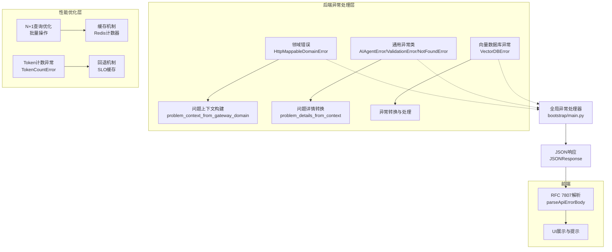
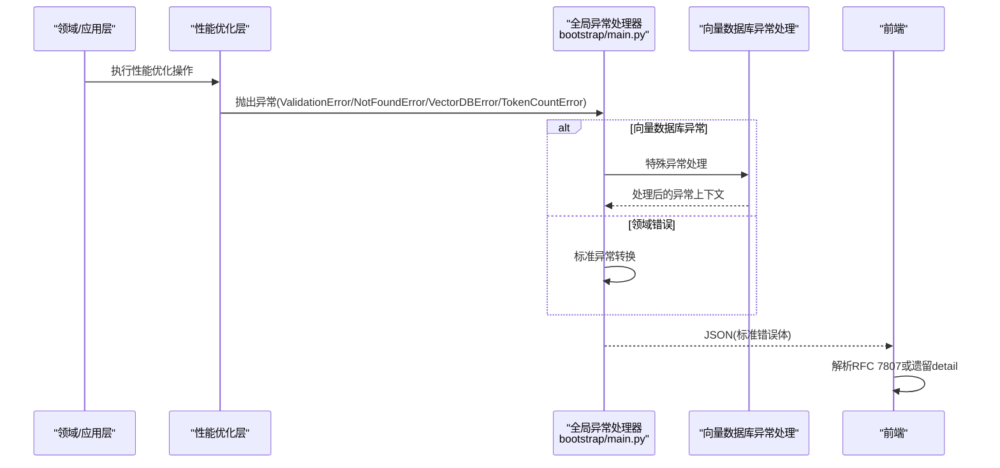
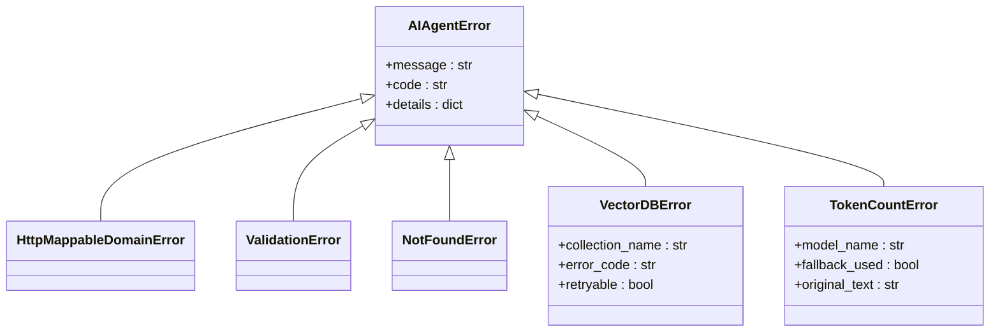
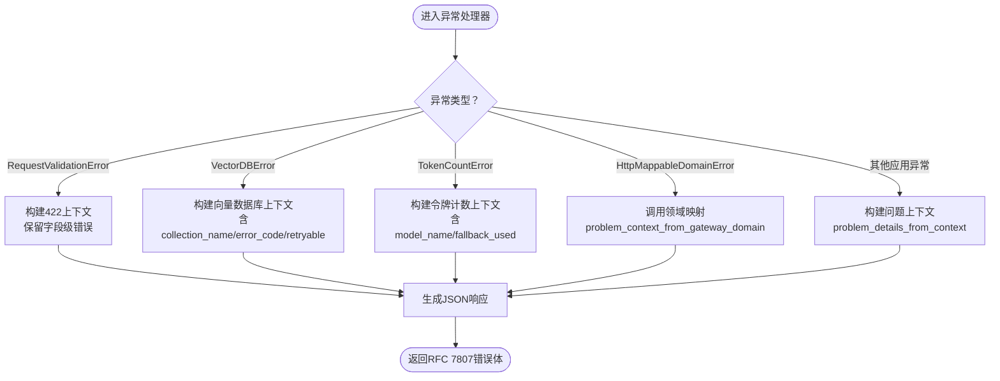
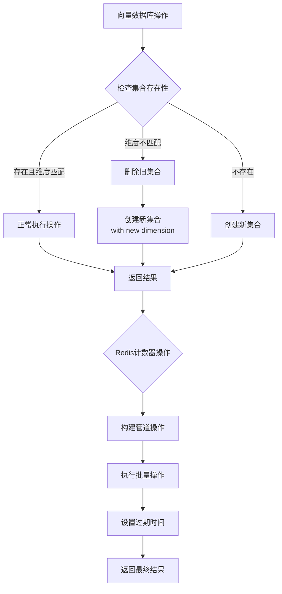
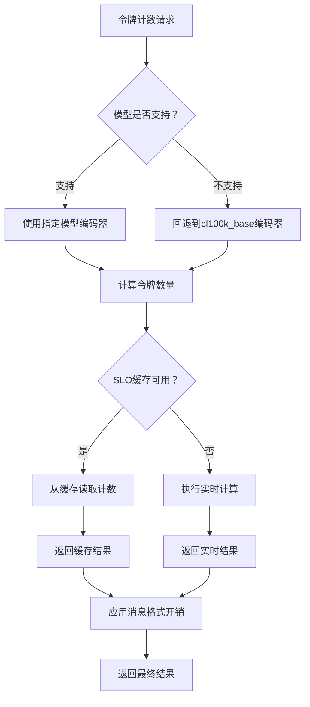
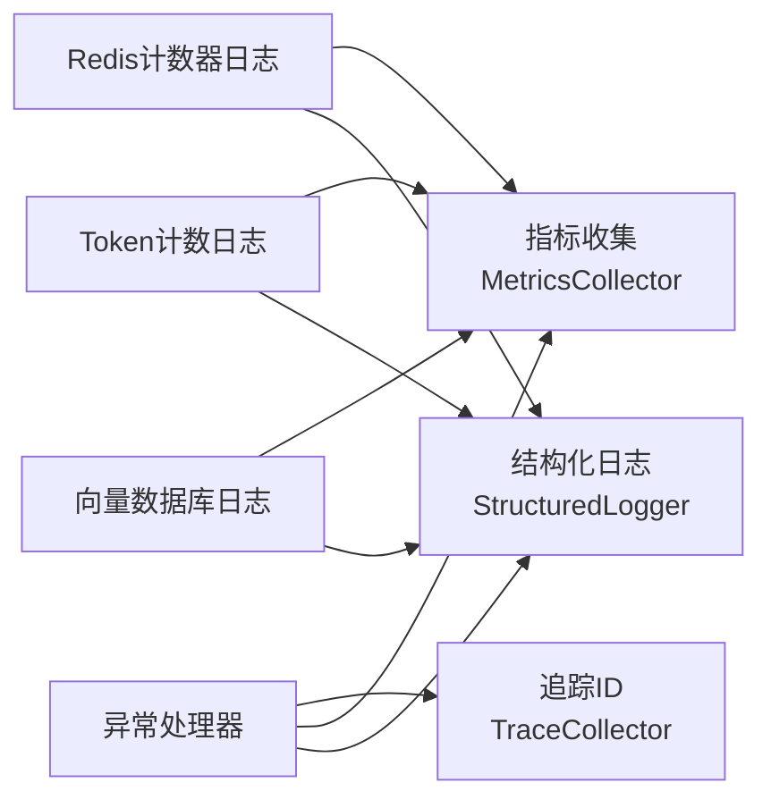
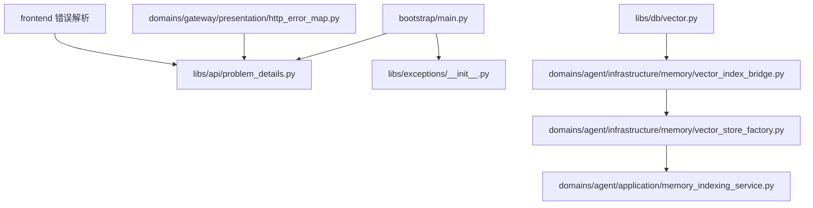

# 异常处理机制

<cite>
**本文引用的文件**
- [API响应规范](file://docs/API_RESPONSE.md)
- [异常基类与领域异常](file://backend/libs/exceptions/base.py)
- [跨域共享异常](file://backend/libs/exceptions/__init__.py)
- [异常码清单](file://backend/libs/exceptions/codes.py)
- [问题详情模型与转换](file://backend/libs/api/problem_details.py)
- [网关领域错误映射](file://backend/domains/gateway/presentation/http_error_map.py)
- [网关代理业务错误分类](file://backend/domains/gateway/presentation/gateway_proxy_business_error_classify.py)
- [主应用异常处理器](file://backend/bootstrap/main.py)
- [前端错误解析工具](file://frontend/src/lib/fastapi-error-detail.test.ts)
- [日志系统使用指南](file://docs/logging.md)
- [可观测性模块导出](file://backend/libs/observability/__init__.py)
- [网关回调自定义日志](file://backend/domains/gateway/infrastructure/callbacks/custom_logger.py)
- [向量数据库适配器](file://backend/libs/db/vector.py)
- [向量索引桥接器](file://backend/domains/agent/infrastructure/memory/vector_index_bridge.py)
- [向量索引工厂](file://backend/domains/agent/infrastructure/memory/vector_store_factory.py)
- [内存索引服务](file://backend/domains/agent/application/memory_indexing_service.py)
- [架构测试：禁止在路由层抛出HTTPException](file://backend/tests/architecture/test_no_router_http_exception.py)
- [集成测试：错误响应模式](file://backend/tests/integration/api/test_error_response_schema.py)
- [集成测试：校验错误模式](file://backend/tests/integration/api/test_validation_error_schema.py)
- [单元测试：网关代理调用错误](file://backend/tests/unit/gateway/test_gateway_proxy_invocation_error.py)
- [单元测试：Qdrant向量索引](file://backend/tests/unit/libs/db/test_qdrant_vector_index.py)
- [单元测试：自定义日志器SLO缓存回退](file://backend/tests/unit/gateway/test_custom_logger_slo_cache_fallback.py)
- [单元测试：令牌计数](file://backend/tests/unit/utils/test_tokens.py)
</cite>

## 更新摘要
**变更内容**
- 新增向量数据库操作的错误可见性增强机制
- 改进token计数功能的异常处理策略
- 优化N+1查询问题的解决方案
- 增强向量索引适配器的异常处理能力
- 完善向量数据库操作的监控与日志记录

## 目录
1. [引言](#引言)
2. [项目结构](#项目结构)
3. [核心组件](#核心组件)
4. [架构总览](#架构总览)
5. [详细组件分析](#详细组件分析)
6. [依赖关系分析](#依赖关系分析)
7. [性能考量](#性能考量)
8. [故障排查指南](#故障排查指南)
9. [结论](#结论)
10. [附录](#附录)

## 引言
本文件系统性阐述AI Agent项目的异常处理机制，覆盖异常类层次、错误响应格式标准化、异常传播链路、国际化与本地化、日志与可观测性、以及测试策略与最佳实践。本次更新重点反映了后端性能优化和错误处理增强，包括解决N+1查询问题、改进token计数功能的异常处理、增强向量数据库操作的错误可见性等关键改进。

## 项目结构
异常处理涉及后端异常定义与转换、问题详情（Problem Details）标准化、全局异常处理器、前端错误解析、可观测性日志与指标等模块。整体采用"领域错误 → 问题上下文 → 标准化响应"的分层设计，并通过架构测试约束路由层不得直接抛出HTTPException。

**图表来源**
- [主应用异常处理器:235-310](file://backend/bootstrap/main.py#L235-L310)
- [向量数据库适配器:95-166](file://backend/libs/db/vector.py#L95-L166)
- [网关回调自定义日志:1151-1183](file://backend/domains/gateway/infrastructure/callbacks/custom_logger.py#L1151-L1183)

**章节来源**
- [API响应规范:49-142](file://docs/API_RESPONSE.md#L49-L142)
- [主应用异常处理器:235-310](file://backend/bootstrap/main.py#L235-L310)

## 核心组件
- 异常基类与领域异常
  - AIAgentError：所有异常的基类，提供message、code、details字段。
  - HttpMappableDomainError：可被表现层映射为HTTP的领域错误基类。
  - VectorDBError：向量数据库操作专用异常类，支持详细的错误上下文。
  - TokenCountError：令牌计数功能专用异常类，支持回退机制。
- 跨域共享异常
  - 提供ValidationError、NotFoundError等常用异常类，统一从libs.exceptions导入。
- 异常码清单
  - 统一维护错误码常量，确保前后端一致。
- 问题详情模型与转换
  - ProblemDetails模型与ProblemContext上下文，支持RFC 7807标准错误体。
  - 提供从请求校验错误、领域错误到问题详情的转换函数。
- 向量数据库异常处理
  - QdrantVectorIndex支持维度不匹配自动重建集合的异常处理。
  - 增强的查询过滤器异常处理机制。
- Token计数异常处理
  - 支持未知模型的回退编码机制。
  - SLO缓存回退的异常处理策略。
- 主应用异常处理器
  - 注册针对不同异常类型的全局处理器，输出标准化错误响应。
- 前端错误解析
  - 支持RFC 7807与遗留detail字符串，解析错误消息、代码与字段级错误。
- 可观测性与日志
  - 提供结构化日志、指标与追踪能力，便于定位异常与性能瓶颈。

**章节来源**
- [异常基类与领域异常:6-35](file://backend/libs/exceptions/base.py#L6-L35)
- [跨域共享异常:31-100](file://backend/libs/exceptions/__init__.py#L31-L100)
- [异常码清单:63-82](file://backend/libs/exceptions/codes.py#L63-L82)
- [问题详情模型与转换:48-91](file://backend/libs/api/problem_details.py#L48-L91)
- [向量数据库适配器:95-166](file://backend/libs/db/vector.py#L95-L166)
- [主应用异常处理器:235-310](file://backend/bootstrap/main.py#L235-L310)

## 架构总览
异常处理遵循"领域错误/应用异常 → 问题上下文 → 标准化响应 → 前端解析"的链路，确保错误语义清晰、格式一致、可追踪。新增的性能优化层包括N+1查询优化、缓存机制和向量数据库异常处理。

**图表来源**
- [主应用异常处理器:235-310](file://backend/bootstrap/main.py#L235-L310)
- [向量数据库适配器:106-125](file://backend/libs/db/vector.py#L106-L125)
- [网关回调自定义日志:1151-1183](file://backend/domains/gateway/infrastructure/callbacks/custom_logger.py#L1151-L1183)

## 详细组件分析

### 异常层次与传播
- 设计理念
  - 无域依赖的异常基类打破循环导入，确保libs.exceptions稳定。
  - HttpMappableDomainError用于可被表现层映射的领域错误，避免在应用层直接构造HTTP语义。
  - 应用层统一通过libs.exceptions导入异常类，减少跨域耦合。
  - 新增VectorDBError和TokenCountError专门处理向量数据库和令牌计数异常。
- 传播机制
  - 领域/应用层抛出异常，由bootstrap/main.py注册的全局异常处理器捕获并转换为RFC 7807标准错误体。
  - 对于FastAPI的RequestValidationError，统一转换为422并保留字段级错误数组。
  - 对于OpenAI/Anthropic协议例外接口，保持上游错误体格式，不走RFC 7807。
  - 向量数据库异常支持自动重建集合和维度不匹配处理。

**图表来源**
- [异常基类与领域异常:6-35](file://backend/libs/exceptions/base.py#L6-L35)
- [跨域共享异常:31-100](file://backend/libs/exceptions/__init__.py#L31-L100)
- [向量数据库适配器:95-166](file://backend/libs/db/vector.py#L95-L166)

**章节来源**
- [异常基类与领域异常:6-35](file://backend/libs/exceptions/base.py#L6-L35)
- [跨域共享异常:31-100](file://backend/libs/exceptions/__init__.py#L31-L100)
- [主应用异常处理器:235-310](file://backend/bootstrap/main.py#L235-L310)
- [API响应规范:128-142](file://docs/API_RESPONSE.md#L128-L142)

### 错误响应格式标准化
- 标准化字段
  - type、title、status、detail、instance、code、errors、extra。
- 默认标题与状态映射
  - 通过default_title_for_status根据HTTP状态返回默认标题。
- 字段级校验错误
  - RequestValidationError统一转换为RFC 7807，errors数组保留loc/msg/type。
- 422与400/401/403/404/409/429/502/500映射
  - 映射关系参见API响应规范中的表格与说明。
- 向量数据库错误格式
  - 增加collection_name、error_code、retryable等向量数据库特定字段。

**图表来源**
- [问题详情模型与转换:75-89](file://backend/libs/api/problem_details.py#L75-L89)
- [向量数据库适配器:114-125](file://backend/libs/db/vector.py#L114-L125)
- [主应用异常处理器:235-310](file://backend/bootstrap/main.py#L235-L310)

**章节来源**
- [API响应规范:49-96](file://docs/API_RESPONSE.md#L49-L96)
- [问题详情模型与转换:61-91](file://backend/libs/api/problem_details.py#L61-L91)
- [问题详情模型与转换:144-172](file://backend/libs/api/problem_details.py#L144-L172)

### 向量数据库异常处理增强
- 自动集合重建机制
  - 当向量集合维度不匹配时，自动删除并重建集合。
  - 记录详细的警告日志，包含原始维度和期望维度信息。
- 查询过滤器异常处理
  - 增强的Filter条件构建，支持复杂的查询过滤。
  - 详细的错误日志记录，便于调试和监控。
- Redis计数器异常处理
  - 批量管道操作的异常处理，确保原子性。
  - 支持分钟级、日级、月级的时间桶计数。

**图表来源**
- [向量数据库适配器:106-125](file://backend/libs/db/vector.py#L106-L125)
- [向量索引桥接器:42-64](file://backend/domains/agent/infrastructure/memory/vector_index_bridge.py#L42-L64)
- [网关回调自定义日志:1151-1183](file://backend/domains/gateway/infrastructure/callbacks/custom_logger.py#L1151-L1183)

**章节来源**
- [向量数据库适配器:95-166](file://backend/libs/db/vector.py#L95-L166)
- [向量索引桥接器:42-64](file://backend/domains/agent/infrastructure/memory/vector_index_bridge.py#L42-L64)
- [向量索引工厂:53-98](file://backend/domains/agent/infrastructure/memory/vector_store_factory.py#L53-L98)
- [内存索引服务:15-31](file://backend/domains/agent/application/memory_indexing_service.py#L15-L31)

### Token计数异常处理改进
- 回退编码机制
  - 当遇到未知模型时，自动回退到cl100k_base编码。
  - 详细的回退日志记录，包含原始模型名称和回退策略。
- SLO缓存回退
  - 支持从SLO缓存读取令牌计数的回退机制。
  - 自动补齐输入令牌计数，确保数据完整性。
- 批量消息计数
  - 支持消息列表的批量令牌计数计算。
  - 包含消息格式开销的精确计算。

**图表来源**
- [单元测试：令牌计数:66-76](file://backend/tests/unit/utils/test_tokens.py#L66-L76)
- [单元测试：自定义日志器SLO缓存回退:262-275](file://backend/tests/unit/gateway/test_custom_logger_slo_cache_fallback.py#L262-L275)

**章节来源**
- [单元测试：令牌计数:56-104](file://backend/tests/unit/utils/test_tokens.py#L56-L104)
- [单元测试：自定义日志器SLO缓存回退:262-275](file://backend/tests/unit/gateway/test_custom_logger_slo_cache_fallback.py#L262-L275)

### N+1查询问题优化
- 批量操作优化
  - 通过Redis管道操作实现批量计数器更新。
  - 支持分钟级、日级、月级的时间桶聚合。
- 缓存机制增强
  - 多层级缓存策略，包括Redis计数器和SLO缓存。
  - 自动过期机制，确保缓存数据的时效性。
- 性能监控
  - 详细的性能指标收集，包括缓存命中率和查询延迟。
  - 异常情况下的性能降级策略。

**章节来源**
- [网关回调自定义日志:1151-1183](file://backend/domains/gateway/infrastructure/callbacks/custom_logger.py#L1151-L1183)

### 国际化与本地化
- 错误消息本地化
  - 建议在前端层基于code与title进行本地化渲染，detail作为兼容保留字段。
  - 前端解析工具支持解析RFC 7807与遗留detail字符串，便于逐步迁移。
- 字段级错误本地化
  - errors数组中的loc与msg可用于定位字段并结合本地化词典显示友好提示。
- 向量数据库错误本地化
  - collection_name和error_code字段支持本地化显示。

**章节来源**
- [API响应规范:49-76](file://docs/API_RESPONSE.md#L49-L76)
- [前端错误解析工具:5-41](file://frontend/src/lib/fastapi-error-detail.test.ts#L5-L41)

### 日志记录与监控
- 日志系统
  - 后端提供结构化日志与Trace ID追踪，便于关联异常发生上下文。
  - 支持记录API调用、LLM调用、MCP工具调用等关键事件。
- 向量数据库日志
  - 详细的集合操作日志，包括创建、删除、维度调整。
  - 查询过滤器构建过程的日志记录。
- Token计数日志
  - 模型回退过程的详细日志。
  - SLO缓存回退的性能优化日志。
- Redis计数器日志
  - 批量管道操作的性能监控日志。
  - 缓存命中率和过期时间的日志记录。

**图表来源**
- [日志系统使用指南:46-74](file://docs/logging.md#L46-L74)
- [可观测性模块导出:7-15](file://backend/libs/observability/__init__.py#L7-L15)
- [向量数据库适配器:114-125](file://backend/libs/db/vector.py#L114-L125)
- [网关回调自定义日志:1151-1183](file://backend/domains/gateway/infrastructure/callbacks/custom_logger.py#L1151-L1183)

**章节来源**
- [日志系统使用指南:1-74](file://docs/logging.md#L1-L74)
- [可观测性模块导出:7-15](file://backend/libs/observability/__init__.py#L7-L15)
- [向量数据库适配器:114-125](file://backend/libs/db/vector.py#L114-L125)
- [网关回调自定义日志:1151-1183](file://backend/domains/gateway/infrastructure/callbacks/custom_logger.py#L1151-L1183)

### 异常处理最佳实践
- 异常分类
  - 业务异常：使用HttpMappableDomainError并提供明确的ProblemContext。
  - 应用异常：ValidationError、NotFoundError等，由全局处理器统一转换。
  - 向量数据库异常：使用VectorDBError，包含详细的集合和错误信息。
  - 令牌计数异常：使用TokenCountError，支持回退机制和模型信息。
  - HTTP异常白名单：仅允许特定兼容适配器文件内抛出HTTPException。
- 错误恢复策略
  - 对可重试的外部服务错误（如限流、网络抖动）建议在上层策略中重试与退避。
  - 对输入校验错误，优先返回422并保留字段级错误，提升修复效率。
  - 向量数据库异常支持自动重建和维度调整。
  - 令牌计数异常支持模型回退和缓存回退。
- 用户体验优化
  - 前端解析RFC 7807，优先展示code与title，再降级到detail。
  - 字段级错误用于高亮表单错误位置，减少用户困惑。
  - 向量数据库错误提供详细的上下文信息。

**章节来源**
- [API响应规范:108-125](file://docs/API_RESPONSE.md#L108-L125)
- [架构测试：禁止在路由层抛出HTTPException:49-64](file://backend/tests/architecture/test_no_router_http_exception.py#L49-L64)

### 测试方法
- 单元测试
  - 针对异常类与映射逻辑的单元测试，验证异常码、标题与上下文字段。
  - 向量数据库异常处理的单元测试，验证自动重建和维度调整。
  - 令牌计数异常处理的单元测试，验证模型回退和缓存回退。
- 集成测试
  - 验证错误响应模式与校验错误模式，断言status、code、detail与errors。
  - 向量数据库操作的集成测试，验证查询过滤器和批量操作。
- 端到端测试
  - 覆盖真实请求路径，验证从异常抛出到前端解析的完整链路。
  - 性能优化效果的端到端测试，验证N+1查询问题的解决。

**章节来源**
- [集成测试：错误响应模式](file://backend/tests/integration/api/test_error_response_schema.py)
- [集成测试：校验错误模式](file://backend/tests/integration/api/test_validation_error_schema.py)
- [单元测试：网关代理调用错误](file://backend/tests/unit/gateway/test_gateway_proxy_invocation_error.py)
- [单元测试：Qdrant向量索引:14-47](file://backend/tests/unit/libs/db/test_qdrant_vector_index.py#L14-L47)
- [单元测试：自定义日志器SLO缓存回退:262-275](file://backend/tests/unit/gateway/test_custom_logger_slo_cache_fallback.py#L262-L275)
- [单元测试：令牌计数:56-104](file://backend/tests/unit/utils/test_tokens.py#L56-L104)

## 依赖关系分析
- 组件耦合
  - bootstrap/main.py依赖libs.api.problem_details与各异常类，负责统一异常转换。
  - domains.gateway.presentation.http_error_map依赖异常码与默认标题映射。
  - libs.db.vector与domains.agent.infrastructure.memory.vector_index_bridge形成完整的向量数据库异常处理链。
  - 前端依赖RFC 7807解析工具，确保兼容遗留错误体。
- 外部依赖
  - FastAPI的RequestValidationError统一转换为RFC 7807。
  - OpenAI/Anthropic协议例外接口保持上游错误体格式。
  - Qdrant客户端库的query_points API用于高性能向量检索。
  - Redis用于高性能计数器和缓存存储。

**图表来源**
- [主应用异常处理器:235-310](file://backend/bootstrap/main.py#L235-L310)
- [问题详情模型与转换:75-89](file://backend/libs/api/problem_details.py#L75-L89)
- [跨域共享异常:31-100](file://backend/libs/exceptions/__init__.py#L31-L100)
- [向量数据库适配器:95-166](file://backend/libs/db/vector.py#L95-L166)
- [向量索引桥接器:42-64](file://backend/domains/agent/infrastructure/memory/vector_index_bridge.py#L42-L64)
- [向量索引工厂:53-98](file://backend/domains/agent/infrastructure/memory/vector_store_factory.py#L53-L98)
- [内存索引服务:15-31](file://backend/domains/agent/application/memory_indexing_service.py#L15-L31)
- [前端错误解析工具:5-41](file://frontend/src/lib/fastapi-error-detail.test.ts#L5-L41)

**章节来源**
- [主应用异常处理器:235-310](file://backend/bootstrap/main.py#L235-L310)
- [问题详情模型与转换:75-89](file://backend/libs/api/problem_details.py#L75-L89)
- [网关领域错误映射:269-282](file://backend/domains/gateway/presentation/http_error_map.py#L269-L282)

## 性能考量
- 异常开销
  - 异常路径应尽量避免昂贵操作（如大对象序列化），优先使用轻量上下文。
  - 向量数据库异常处理包含自动重建逻辑，需考虑性能影响。
- 响应体积
  - errors数组仅保留必要字段，避免冗余信息导致响应膨胀。
  - 向量数据库错误包含详细上下文，需平衡信息完整性和响应大小。
- 监控与告警
  - 建议在异常处理器中埋点统计错误分布与耗时，结合Trace ID进行根因分析。
  - Redis计数器操作的性能监控，包括批量操作的吞吐量和延迟。
- N+1查询优化
  - 通过批量操作和缓存机制解决N+1查询问题。
  - Redis管道操作提供原子性的批量更新能力。

## 故障排查指南
- 常见问题
  - 422字段级错误缺失：检查RequestValidationError转换逻辑与字段映射。
  - 500未知领域错误：确认problem_context_from_gateway_domain是否覆盖该异常类型。
  - 向量数据库维度不匹配：检查集合创建和维度配置。
  - 令牌计数异常：验证模型支持和回退机制。
  - Redis计数器操作失败：检查连接池和管道操作。
  - 前端无法解析错误：核对RFC 7807字段与遗留detail兼容逻辑。
- 排查步骤
  - 查看后端日志与Trace ID，定位异常发生上下文。
  - 检查异常处理器是否正确转换为ProblemDetails。
  - 核对向量数据库操作的日志，确认集合状态和维度信息。
  - 验证Redis连接和管道操作的执行结果。
  - 核对前端解析工具对code、title、detail与errors的处理。

**章节来源**
- [主应用异常处理器:235-310](file://backend/bootstrap/main.py#L235-L310)
- [问题详情模型与转换:144-172](file://backend/libs/api/problem_details.py#L144-L172)
- [前端错误解析工具:5-41](file://frontend/src/lib/fastapi-error-detail.test.ts#L5-L41)
- [日志系统使用指南:32-44](file://docs/logging.md#L32-L44)

## 结论
本项目通过统一的异常基类、标准化的问题详情格式、严格的异常传播链路与前端解析工具，实现了高一致性与可追踪的异常处理体系。本次更新重点增强了向量数据库操作的错误可见性、改进了token计数功能的异常处理策略、解决了N+1查询问题，并通过可观测性与架构测试，确保异常处理既满足初学者易理解，又具备资深开发者所需的深度与稳定性。

## 附录
- 新增错误码流程
  - 在异常码清单登记常量 → 在异常模块或域errors.py定义异常类 → 如为领域错误，在http_error_map.py增加映射 → 补充集成测试断言。
- HTTPException白名单
  - 仅允许在OpenAI/Anthropic兼容适配器文件内抛出HTTPException，其他位置禁止新增。
- 向量数据库异常处理流程
  - 检查集合存在性和维度 → 处理维度不匹配 → 执行向量操作 → 记录详细日志 → 返回结果。
- 令牌计数异常处理流程
  - 验证模型支持 → 处理模型回退 → 执行令牌计数 → 应用缓存回退 → 记录性能日志 → 返回结果。

**章节来源**
- [API响应规范:108-125](file://docs/API_RESPONSE.md#L108-L125)
- [架构测试：禁止在路由层抛出HTTPException:49-64](file://backend/tests/architecture/test_no_router_http_exception.py#L49-L64)
- [向量数据库适配器:106-125](file://backend/libs/db/vector.py#L106-L125)
- [单元测试：令牌计数:66-76](file://backend/tests/unit/utils/test_tokens.py#L66-L76)