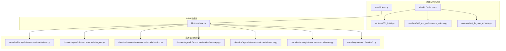
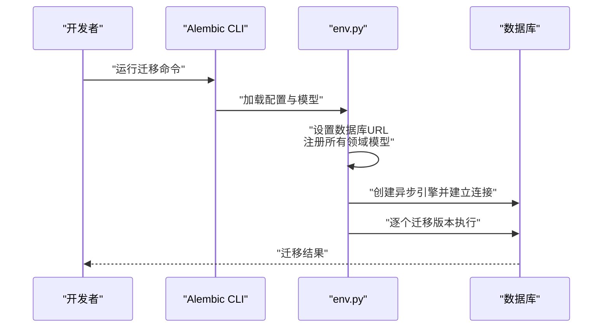
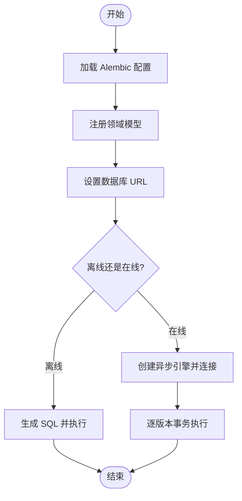
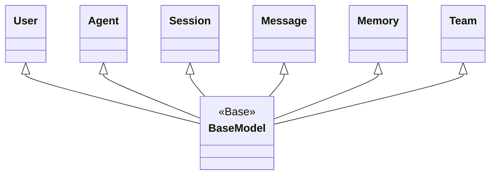
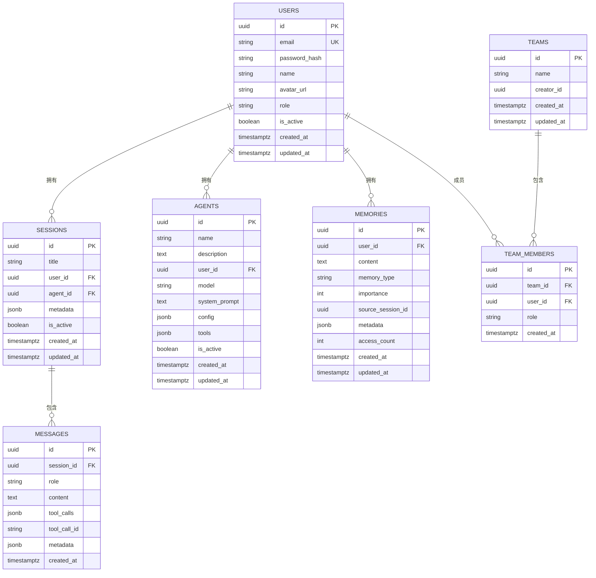
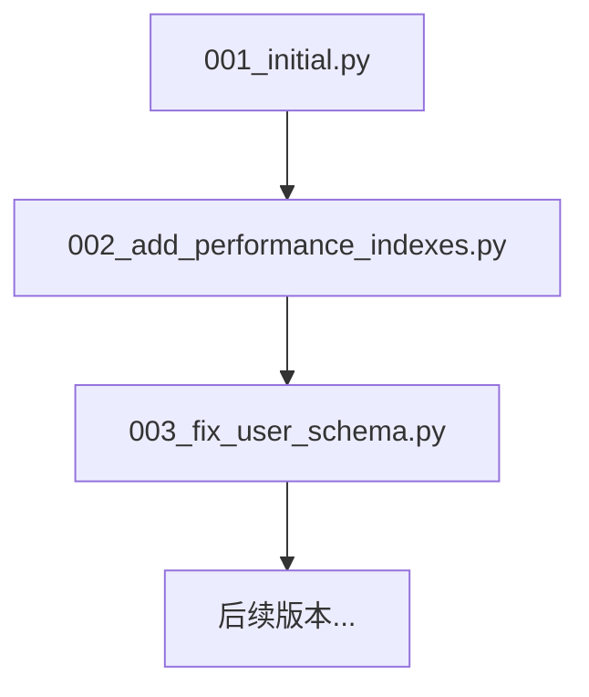
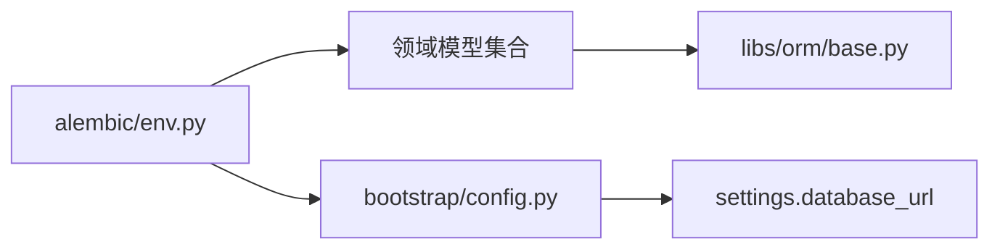

# 数据库抽象层

<cite>
**本文引用的文件**
- [backend/alembic/env.py](file://backend/alembic/env.py)
- [backend/alembic/script.py.mako](file://backend/alembic/script.py.mako)
- [backend/alembic/versions/001_initial.py](file://backend/alembic/versions/001_initial.py)
- [backend/alembic/versions/002_add_performance_indexes.py](file://backend/alembic/versions/002_add_performance_indexes.py)
- [backend/alembic/versions/003_fix_user_schema.py](file://backend/alembic/versions/003_fix_user_schema.py)
- [backend/libs/orm/base.py](file://backend/libs/orm/base.py)
- [backend/bootstrap/config.py](file://backend/bootstrap/config.py)
- [backend/domains/agent/infrastructure/models/agent.py](file://backend/domains/agent/infrastructure/models/agent.py)
- [backend/domains/identity/infrastructure/models/user.py](file://backend/domains/identity/infrastructure/models/user.py)
- [backend/domains/session/infrastructure/models/session.py](file://backend/domains/session/infrastructure/models/session.py)
- [backend/domains/agent/infrastructure/models/message.py](file://backend/domains/agent/infrastructure/models/message.py)
- [backend/domains/agent/infrastructure/models/memory.py](file://backend/domains/agent/infrastructure/models/memory.py)
- [backend/domains/gateway/infrastructure/models/provider_credential.py](file://backend/domains/gateway/infrastructure/models/provider_credential.py)
- [backend/domains/tenancy/infrastructure/models/team.py](file://backend/domains/tenancy/infrastructure/models/team.py)
- [backend/domains/agent/infrastructure/models/video_gen_task.py](file://backend/domains/agent/infrastructure/models/video_gen_task.py)
- [backend/domains/agent/infrastructure/models/mcp_server.py](file://backend/domains/agent/infrastructure/models/mcp_server.py)
- [backend/domains/agent/infrastructure/models/system_storage_config.py](file://backend/domains/agent/infrastructure/models/system_storage_config.py)
- [backend/domains/agent/infrastructure/models/listing_studio_job.py](file://backend/domains/agent/infrastructure/models/listing_studio_job.py)
- [backend/domains/agent/infrastructure/models/listing_studio_job_step.py](file://backend/domains/agent/infrastructure/models/listing_studio_job_step.py)
- [backend/domains/agent/infrastructure/models/listing_studio_prompt_template.py](file://backend/domains/agent/infrastructure/models/listing_studio_prompt_template.py)
- [backend/domains/agent/infrastructure/models/mcp_dynamic_prompt.py](file://backend/domains/agent/infrastructure/models/mcp_dynamic_prompt.py)
- [backend/domains/agent/infrastructure/models/mcp_dynamic_tool.py](file://backend/domains/agent/infrastructure/models/mcp_dynamic_tool.py)
- [backend/domains/gateway/infrastructure/models/budget.py](file://backend/domains/gateway/infrastructure/models/budget.py)
- [backend/domains/gateway/infrastructure/models/alert.py](file://backend/domains/gateway/infrastructure/models/alert.py)
- [backend/domains/gateway/infrastructure/models/gateway_model.py](file://backend/domains/gateway/infrastructure/models/gateway_model.py)
- [backend/domains/gateway/infrastructure/models/request_log.py](file://backend/domains/gateway/infrastructure/models/request_log.py)
- [backend/domains/gateway/infrastructure/models/pricing_downstream.py](file://backend/domains/gateway/infrastructure/models/pricing_downstream.py)
- [backend/domains/gateway/infrastructure/models/pricing_upstream.py](file://backend/domains/gateway/infrastructure/models/pricing_upstream.py)
- [backend/domains/gateway/infrastructure/models/system_gateway.py](file://backend/domains/gateway/infrastructure/models/system_gateway.py)
- [backend/domains/identity/infrastructure/models/api_key.py](file://backend/domains/identity/infrastructure/models/api_key.py)
- [backend/scripts/generate_alembic_sql_files.py](file://backend/scripts/generate_alembic_sql_files.py)
- [backend/scripts/migrate_test_db.py](file://backend/scripts/migrate_test_db.py)
- [backend/scripts/run_dev_server.py](file://backend/scripts/run_dev_server.py)
- [backend/scripts/run_server.py](file://backend/scripts/run_server.py)
- [backend/pyproject.toml](file://backend/pyproject.toml)
</cite>

## 目录
1. [简介](#简介)
2. [项目结构](#项目结构)
3. [核心组件](#核心组件)
4. [架构总览](#架构总览)
5. [详细组件分析](#详细组件分析)
6. [依赖分析](#依赖分析)
7. [性能考量](#性能考量)
8. [故障排查指南](#故障排查指南)
9. [结论](#结论)
10. [附录](#附录)

## 简介
本文件系统化梳理后端数据库抽象层的设计与实现，覆盖以下主题：
- SQLAlchemy ORM 使用模式与模型定义
- 数据库连接池管理与事务处理机制
- 实体关系映射、字段类型与约束
- Alembic 迁移体系：生成、版本控制与演进策略
- 连接配置、池参数调优、超时与故障恢复
- 查询优化、批量操作与事务边界管理最佳实践
- 性能监控与调试技巧
- 面向初学者解释 ORM 抽象价值，同时为有经验开发者提供深入实现细节与优化建议

## 项目结构
数据库抽象层由三层构成：
- 迁移与元数据层：Alembic 环境配置、模板与迁移脚本
- ORM 基座层：统一的 Base 元数据与模型基类
- 应用层：各领域模型在基础设施层的定义与使用

图表来源
- [backend/alembic/env.py:18-87](file://backend/alembic/env.py#L18-L87)
- [backend/alembic/script.py.mako:1-32](file://backend/alembic/script.py.mako#L1-L32)
- [backend/libs/orm/base.py](file://backend/libs/orm/base.py)
- [backend/domains/agent/infrastructure/models/agent.py](file://backend/domains/agent/infrastructure/models/agent.py)
- [backend/domains/identity/infrastructure/models/user.py](file://backend/domains/identity/infrastructure/models/user.py)
- [backend/domains/session/infrastructure/models/session.py](file://backend/domains/session/infrastructure/models/session.py)
- [backend/domains/agent/infrastructure/models/message.py](file://backend/domains/agent/infrastructure/models/message.py)
- [backend/domains/agent/infrastructure/models/memory.py](file://backend/domains/agent/infrastructure/models/memory.py)
- [backend/domains/tenancy/infrastructure/models/team.py](file://backend/domains/tenancy/infrastructure/models/team.py)
- [backend/domains/gateway/infrastructure/models/provider_credential.py](file://backend/domains/gateway/infrastructure/models/provider_credential.py)

章节来源
- [backend/alembic/env.py:18-87](file://backend/alembic/env.py#L18-L87)
- [backend/alembic/script.py.mako:1-32](file://backend/alembic/script.py.mako#L1-L32)
- [backend/libs/orm/base.py](file://backend/libs/orm/base.py)

## 核心组件
- Alembic 环境配置：集中注册所有领域模型，设置数据库 URL，支持离线与在线迁移，并通过异步引擎执行迁移。
- ORM 基类：统一的 Base 元数据对象，作为所有模型的基类，确保迁移与查询共享同一元数据。
- 领域模型：按领域划分的基础设施层模型，涵盖身份、会话、消息、记忆、网关、团队等模块。
- 迁移脚本：版本化的数据库演进脚本，包含建表、索引、约束与数据修正。

章节来源
- [backend/alembic/env.py:18-100](file://backend/alembic/env.py#L18-L100)
- [backend/alembic/script.py.mako:1-32](file://backend/alembic/script.py.mako#L1-L32)
- [backend/libs/orm/base.py](file://backend/libs/orm/base.py)

## 架构总览
数据库抽象层采用“迁移驱动 + 统一元数据 + 分域模型”的架构：
- 迁移驱动：通过 Alembic 在离线/在线模式下执行数据库演进。
- 统一元数据：所有模型继承自同一 Base，保证迁移与查询一致性。
- 分域模型：按业务域组织模型，避免跨域耦合，便于维护与扩展。

图表来源
- [backend/alembic/env.py:150-176](file://backend/alembic/env.py#L150-L176)

章节来源
- [backend/alembic/env.py:103-176](file://backend/alembic/env.py#L103-L176)

## 详细组件分析

### Alembic 环境与迁移流程
- 模型注册：显式导入各领域模型，确保 SQLAlchemy 能发现并注册其元数据。
- URL 配置：从应用配置中读取数据库连接字符串，统一迁移与运行时连接。
- 离线/在线迁移：支持离线 SQL 生成与在线异步迁移，保证 CI/CD 与生产环境一致性。
- 事务策略：每个迁移版本在独立事务中执行，提升失败回滚的可控性。

图表来源
- [backend/alembic/env.py:103-176](file://backend/alembic/env.py#L103-L176)

章节来源
- [backend/alembic/env.py:18-100](file://backend/alembic/env.py#L18-L100)
- [backend/alembic/env.py:103-176](file://backend/alembic/env.py#L103-L176)

### ORM 基类与模型约定
- 统一基类：所有模型继承自同一 Base，确保元数据一致与迁移正确性。
- 字段类型：优先使用 UUID 主键、JSONB 存储结构化数据、TIMESTAMPTZ 记录时序。
- 约束与索引：外键约束、唯一索引、GIN 索引、部分索引等，兼顾查询性能与数据完整性。

图表来源
- [backend/libs/orm/base.py](file://backend/libs/orm/base.py)
- [backend/domains/identity/infrastructure/models/user.py](file://backend/domains/identity/infrastructure/models/user.py)
- [backend/domains/agent/infrastructure/models/agent.py](file://backend/domains/agent/infrastructure/models/agent.py)
- [backend/domains/session/infrastructure/models/session.py](file://backend/domains/session/infrastructure/models/session.py)
- [backend/domains/agent/infrastructure/models/message.py](file://backend/domains/agent/infrastructure/models/message.py)
- [backend/domains/agent/infrastructure/models/memory.py](file://backend/domains/agent/infrastructure/models/memory.py)
- [backend/domains/tenancy/infrastructure/models/team.py](file://backend/domains/tenancy/infrastructure/models/team.py)

章节来源
- [backend/libs/orm/base.py](file://backend/libs/orm/base.py)

### 领域模型与实体关系
- 用户与会话：用户是会话的拥有者，会话可关联代理。
- 会话与消息：消息属于会话，按时间排序。
- 记忆与用户：记忆属于用户，支持按类型与重要度检索。
- 团队与成员：团队包含成员，支撑多租户场景。
- 网关与凭证：提供上游/下游定价、预算、告警、请求日志等能力。

图表来源
- [backend/domains/identity/infrastructure/models/user.py](file://backend/domains/identity/infrastructure/models/user.py)
- [backend/domains/agent/infrastructure/models/agent.py](file://backend/domains/agent/infrastructure/models/agent.py)
- [backend/domains/session/infrastructure/models/session.py](file://backend/domains/session/infrastructure/models/session.py)
- [backend/domains/agent/infrastructure/models/message.py](file://backend/domains/agent/infrastructure/models/message.py)
- [backend/domains/agent/infrastructure/models/memory.py](file://backend/domains/agent/infrastructure/models/memory.py)
- [backend/domains/tenancy/infrastructure/models/team.py](file://backend/domains/tenancy/infrastructure/models/team.py)

章节来源
- [backend/domains/identity/infrastructure/models/user.py](file://backend/domains/identity/infrastructure/models/user.py)
- [backend/domains/agent/infrastructure/models/agent.py](file://backend/domains/agent/infrastructure/models/agent.py)
- [backend/domains/session/infrastructure/models/session.py](file://backend/domains/session/infrastructure/models/session.py)
- [backend/domains/agent/infrastructure/models/message.py](file://backend/domains/agent/infrastructure/models/message.py)
- [backend/domains/agent/infrastructure/models/memory.py](file://backend/domains/agent/infrastructure/models/memory.py)
- [backend/domains/tenancy/infrastructure/models/team.py](file://backend/domains/tenancy/infrastructure/models/team.py)

### 迁移脚本示例与演进策略
- 初始版本：创建用户、代理、会话、消息、记忆、工作流等核心表及基础索引。
- 性能索引：复合索引、部分索引、GIN 索引，优化高频查询路径。
- 模式修复：对现有表进行列重命名、新增列、约束调整等非破坏性变更。

图表来源
- [backend/alembic/versions/001_initial.py:21-171](file://backend/alembic/versions/001_initial.py#L21-L171)
- [backend/alembic/versions/002_add_performance_indexes.py:20-80](file://backend/alembic/versions/002_add_performance_indexes.py#L20-L80)
- [backend/alembic/versions/003_fix_user_schema.py:20-161](file://backend/alembic/versions/003_fix_user_schema.py#L20-L161)

章节来源
- [backend/alembic/versions/001_initial.py:21-171](file://backend/alembic/versions/001_initial.py#L21-L171)
- [backend/alembic/versions/002_add_performance_indexes.py:20-80](file://backend/alembic/versions/002_add_performance_indexes.py#L20-L80)
- [backend/alembic/versions/003_fix_user_schema.py:20-161](file://backend/alembic/versions/003_fix_user_schema.py#L20-L161)

### 连接配置与管理
- 数据库 URL：从应用配置读取，确保迁移与运行时一致。
- 异步引擎：使用异步连接器，适合高并发与长连接场景。
- 连接池参数：可通过 SQLAlchemy 配置池大小、超时、回收策略等（在实际配置文件中设置）。
- 故障恢复：连接失败时重试策略与超时控制需结合部署环境配置。

章节来源
- [backend/alembic/env.py:92-93](file://backend/alembic/env.py#L92-L93)
- [backend/alembic/env.py:155-159](file://backend/alembic/env.py#L155-L159)

### 事务处理机制
- 每个迁移版本在独立事务中执行，失败可回滚，保障数据库状态一致性。
- 在应用层，建议将一次业务操作封装在单个事务内，避免跨服务悬挂事务。

章节来源
- [backend/alembic/env.py:120-121](file://backend/alembic/env.py#L120-L121)
- [backend/alembic/env.py](file://backend/alembic/env.py#L143)

### 数据库模型定义方式
- 字段类型：UUID、String、Text、Boolean、DateTime、JSONB 等。
- 约束：主键、外键、唯一、非空、默认值。
- 索引：普通索引、复合索引、部分索引、GIN 索引。

章节来源
- [backend/alembic/versions/001_initial.py:23-56](file://backend/alembic/versions/001_initial.py#L23-L56)
- [backend/alembic/versions/002_add_performance_indexes.py:22-70](file://backend/alembic/versions/002_add_performance_indexes.py#L22-L70)

### Alembic 迁移系统实现
- 生成：通过模板脚本生成迁移骨架，开发者补充具体变更。
- 版本控制：基于版本号顺序执行，支持升级与降级。
- 演进策略：先离线生成 SQL 校验，再在线执行，确保生产安全。

章节来源
- [backend/alembic/script.py.mako:1-32](file://backend/alembic/script.py.mako#L1-L32)
- [backend/alembic/env.py:123-136](file://backend/alembic/env.py#L123-L136)

## 依赖分析
- 模型到元数据：所有模型依赖统一 Base，确保迁移与查询共享元数据。
- 环境到模型：env.py 显式导入各领域模型，避免跨域 re-export 导致的边界模糊。
- 运行时配置：数据库 URL 来自应用配置，保证迁移与运行时一致。

图表来源
- [backend/alembic/env.py:18-100](file://backend/alembic/env.py#L18-L100)
- [backend/bootstrap/config.py](file://backend/bootstrap/config.py)

章节来源
- [backend/alembic/env.py:18-100](file://backend/alembic/env.py#L18-L100)
- [backend/bootstrap/config.py](file://backend/bootstrap/config.py)

## 性能考量
- 查询优化
  - 复合索引：针对高频过滤+排序组合（如会话按用户+创建时间）。
  - 部分索引：仅索引活跃数据，减少索引体积与写放大。
  - GIN 索引：对 JSONB 字段的查询进行加速。
- 批量操作
  - 使用批量插入/更新，减少往返次数。
  - 合理拆分批次，避免单次事务过大。
- 事务边界
  - 将一次业务语义的操作置于同一事务，避免跨服务长事务。
  - 对只读查询尽量缩短事务持有时间。
- 监控与调试
  - 开启慢查询日志与执行计划分析。
  - 使用数据库性能剖析工具定位热点表与索引。
  - 结合应用日志与数据库审计，追踪异常访问模式。

## 故障排查指南
- 迁移失败
  - 检查模型是否已注册（env.py 中的导入列表）。
  - 确认数据库 URL 与连接权限。
  - 使用离线模式生成 SQL 并人工校验。
- 连接问题
  - 校验连接池参数与超时设置。
  - 观察连接泄漏与长时间占用。
- 性能问题
  - 分析执行计划，确认索引使用情况。
  - 评估复合索引与部分索引的收益。
  - 审视 JSONB 查询是否需要 GIN 索引。

章节来源
- [backend/alembic/env.py:103-176](file://backend/alembic/env.py#L103-L176)
- [backend/alembic/versions/002_add_performance_indexes.py:20-80](file://backend/alembic/versions/002_add_performance_indexes.py#L20-L80)

## 结论
该数据库抽象层通过“迁移驱动 + 统一元数据 + 分域模型”的设计，实现了清晰的职责分离与可演进的数据库结构。配合 Alembic 的离线/在线迁移、合理的索引策略与事务边界管理，能够在保证一致性的同时满足高性能与可维护性的双重目标。建议在实践中持续关注索引有效性、批量操作的节奏与监控告警，以维持长期稳定运行。

## 附录
- 运行迁移与开发辅助脚本
  - 生成迁移 SQL 文件：用于离线校验与审阅。
  - 测试数据库迁移：快速验证迁移脚本在测试库中的行为。
  - 开发/生产服务器启动：统一加载配置与数据库连接。

章节来源
- [backend/scripts/generate_alembic_sql_files.py](file://backend/scripts/generate_alembic_sql_files.py)
- [backend/scripts/migrate_test_db.py](file://backend/scripts/migrate_test_db.py)
- [backend/scripts/run_dev_server.py](file://backend/scripts/run_dev_server.py)
- [backend/scripts/run_server.py](file://backend/scripts/run_server.py)
- [backend/pyproject.toml](file://backend/pyproject.toml)