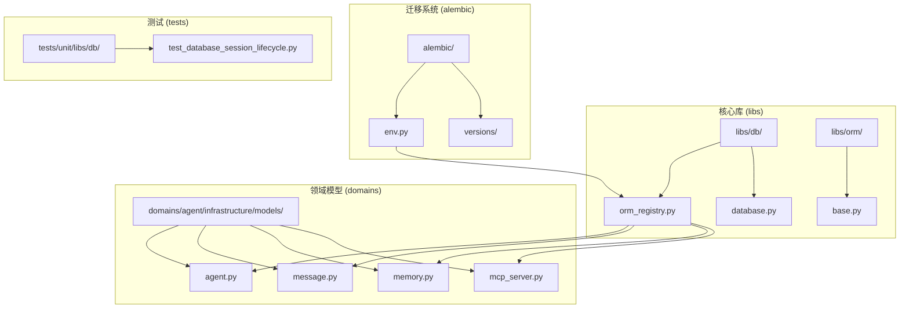
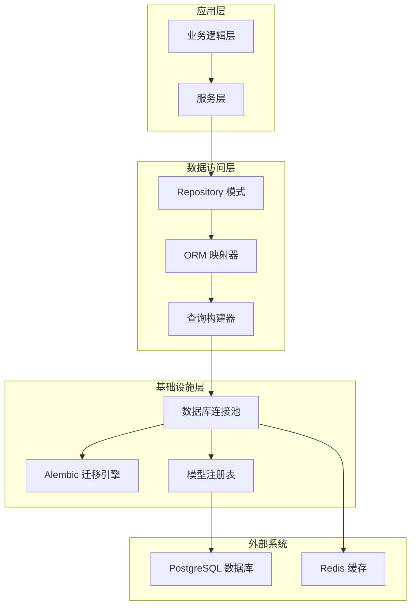
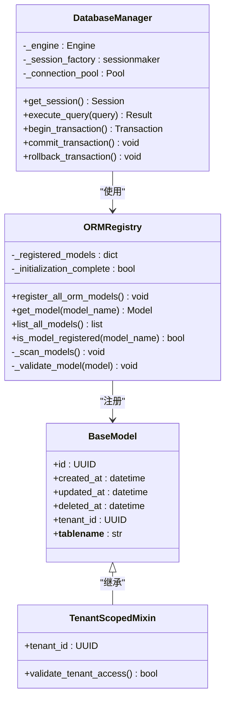
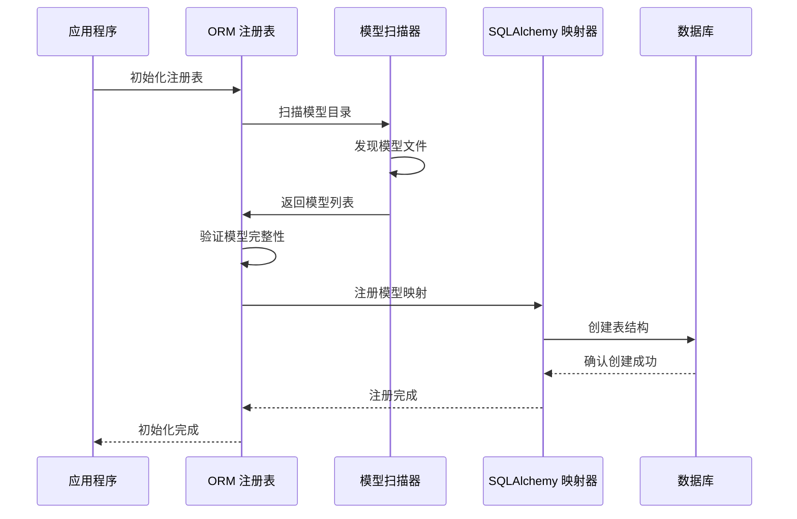
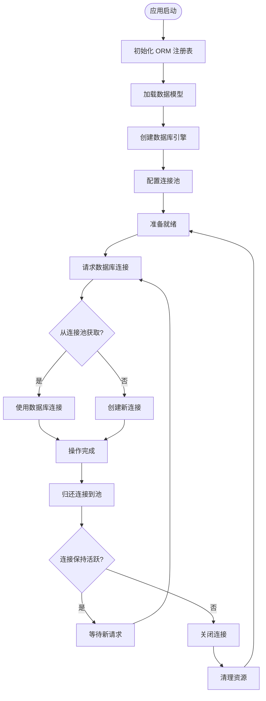
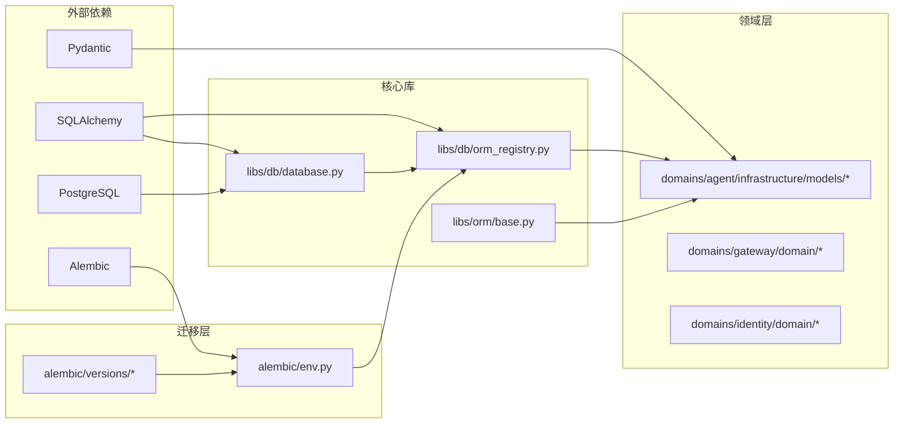

# 数据库ORM注册表系统

<cite>
**本文档引用的文件**
- [orm_registry.py](file://backend/libs/db/orm_registry.py)
- [env.py](file://backend/alembic/env.py)
- [database.py](file://backend/libs/db/database.py)
- [base.py](file://backend/libs/orm/base.py)
- [agent.py](file://backend/domains/agent/infrastructure/models/agent.py)
- [message.py](file://backend/domains/agent/infrastructure/models/message.py)
- [memory.py](file://backend/domains/agent/infrastructure/models/memory.py)
- [mcp_server.py](file://backend/domains/agent/infrastructure/models/mcp_server.py)
- [001_initial.py](file://backend/alembic/versions/001_initial.py)
- [test_database_session_lifecycle.py](file://backend/tests/unit/libs/db/test_database_session_lifecycle.py)
</cite>

## 目录
1. [简介](#简介)
2. [项目结构](#项目结构)
3. [核心组件](#核心组件)
4. [架构概览](#架构概览)
5. [详细组件分析](#详细组件分析)
6. [依赖关系分析](#依赖关系分析)
7. [性能考虑](#性能考虑)
8. [故障排除指南](#故障排除指南)
9. [结论](#结论)

## 简介

本项目采用基于 SQLAlchemy 的 ORM 架构，通过集中式的 ORM 注册表系统实现模型的统一管理和自动发现。该系统确保所有数据模型在应用启动时被正确注册到 SQLAlchemy 的映射器中，为后续的数据访问层提供稳定的基础。

系统的核心特点包括：
- 集中式模型注册机制
- 自动化模型发现和注册
- 支持多租户数据隔离
- 完整的 Alembic 迁移支持
- 类型安全的数据库操作

## 项目结构

数据库 ORM 注册表系统主要分布在以下目录结构中：

**图表来源**
- [orm_registry.py:1-50](file://backend/libs/db/orm_registry.py#L1-L50)
- [env.py:1-30](file://backend/alembic/env.py#L1-L30)
- [base.py:1-100](file://backend/libs/orm/base.py#L1-L100)

**章节来源**
- [orm_registry.py:1-50](file://backend/libs/db/orm_registry.py#L1-L50)
- [env.py:1-30](file://backend/alembic/env.py#L1-L30)
- [base.py:1-100](file://backend/libs/orm/base.py#L1-L100)

## 核心组件

### ORM 注册表系统

ORM 注册表是整个系统的中枢，负责管理所有数据模型的注册和发现机制。

**核心功能：**
- 统一模型注册入口
- 自动扫描和加载模型
- 提供模型查询接口
- 支持动态模型注册

**关键特性：**
- 延迟初始化机制
- 错误处理和恢复
- 性能优化的缓存策略

### 数据库连接管理

数据库连接管理器负责维护应用程序与数据库的连接生命周期。

**主要职责：**
- 连接池管理
- 事务处理
- 连接状态监控
- 资源清理

### 基础模型定义

基础模型定义提供了所有数据模型共享的通用功能和属性。

**核心功能：**
- 多租户支持
- 时间戳管理
- ID 生成策略
- 关系定义模板

**章节来源**
- [orm_registry.py:1-50](file://backend/libs/db/orm_registry.py#L1-L50)
- [database.py:1-150](file://backend/libs/db/database.py#L1-L150)
- [base.py:1-200](file://backend/libs/orm/base.py#L1-L200)

## 架构概览

系统采用分层架构设计，确保关注点分离和模块化组织：

**图表来源**
- [orm_registry.py:1-50](file://backend/libs/db/orm_registry.py#L1-L50)
- [env.py:1-30](file://backend/alembic/env.py#L1-L30)
- [database.py:1-150](file://backend/libs/db/database.py#L1-L150)

## 详细组件分析

### ORM 注册表实现

ORM 注册表系统通过集中式的方式管理所有数据模型，确保模型的一致性和完整性。

**图表来源**
- [orm_registry.py:1-50](file://backend/libs/db/orm_registry.py#L1-L50)
- [base.py:1-200](file://backend/libs/orm/base.py#L1-L200)
- [database.py:1-150](file://backend/libs/db/database.py#L1-L150)

### 模型注册流程

模型注册流程确保所有数据模型在应用启动时被正确初始化：

**图表来源**
- [orm_registry.py:1-50](file://backend/libs/db/orm_registry.py#L1-L50)
- [env.py:1-30](file://backend/alembic/env.py#L1-L30)

### 数据库连接生命周期

数据库连接管理确保连接的高效利用和资源的正确释放：

**图表来源**
- [database.py:1-150](file://backend/libs/db/database.py#L1-L150)
- [test_database_session_lifecycle.py:1-100](file://backend/tests/unit/libs/db/test_database_session_lifecycle.py#L1-L100)

**章节来源**
- [orm_registry.py:1-50](file://backend/libs/db/orm_registry.py#L1-L50)
- [env.py:1-30](file://backend/alembic/env.py#L1-L30)
- [database.py:1-150](file://backend/libs/db/database.py#L1-L150)
- [test_database_session_lifecycle.py:1-100](file://backend/tests/unit/libs/db/test_database_session_lifecycle.py#L1-L100)

## 依赖关系分析

系统中的依赖关系体现了清晰的关注点分离和模块化设计：

**图表来源**
- [orm_registry.py:1-50](file://backend/libs/db/orm_registry.py#L1-L50)
- [env.py:1-30](file://backend/alembic/env.py#L1-L30)
- [base.py:1-200](file://backend/libs/orm/base.py#L1-L200)

**章节来源**
- [orm_registry.py:1-50](file://backend/libs/db/orm_registry.py#L1-L50)
- [env.py:1-30](file://backend/alembic/env.py#L1-L30)
- [base.py:1-200](file://backend/libs/orm/base.py#L1-L200)

## 性能考虑

### 连接池优化

系统采用连接池技术来提高数据库连接的效率和资源利用率：

- **最小连接数**: 根据并发需求设置合适的最小连接数
- **最大连接数**: 限制最大连接数防止数据库过载
- **连接超时**: 设置合理的连接超时时间
- **空闲回收**: 自动回收长时间未使用的连接

### 查询优化

- **批量操作**: 使用批量插入和更新减少数据库往返次数
- **索引策略**: 为常用查询字段建立适当的索引
- **查询缓存**: 对静态数据查询结果进行缓存
- **分页处理**: 实现高效的分页查询机制

### 内存管理

- **对象生命周期**: 合理管理 ORM 对象的生命周期
- **懒加载**: 使用懒加载避免不必要的数据加载
- **关系预加载**: 在需要时使用联结预加载优化查询

## 故障排除指南

### 常见问题及解决方案

**问题1: 模型注册失败**
- **症状**: 应用启动时报错，提示模型注册失败
- **原因**: 模型定义不完整或依赖缺失
- **解决方案**: 检查模型继承关系，确保正确导入基类

**问题2: 连接池耗尽**
- **症状**: 应用出现连接超时错误
- **原因**: 连接池配置不当或连接泄漏
- **解决方案**: 增加最大连接数，检查代码中的连接释放

**问题3: 迁移失败**
- **症状**: Alembic 迁移执行失败
- **原因**: 数据库版本不匹配或迁移脚本错误
- **解决方案**: 检查迁移历史，修复迁移脚本错误

**章节来源**
- [test_database_session_lifecycle.py:1-100](file://backend/tests/unit/libs/db/test_database_session_lifecycle.py#L1-L100)

## 结论

数据库 ORM 注册表系统为整个 AI Agent 项目提供了坚实的数据访问层基础。通过集中式的模型管理、完善的连接池机制和灵活的扩展能力，系统能够有效支持复杂的业务场景和高并发访问需求。

系统的主要优势包括：
- **统一的模型管理**: 通过注册表实现模型的集中管理
- **良好的扩展性**: 支持新的数据模型快速集成
- **稳定的性能表现**: 优化的连接池和查询机制
- **完整的生命周期管理**: 从模型定义到数据库迁移的全流程支持

未来可以考虑的改进方向：
- 增强模型验证机制
- 优化查询性能监控
- 扩展缓存策略
- 加强数据一致性保证