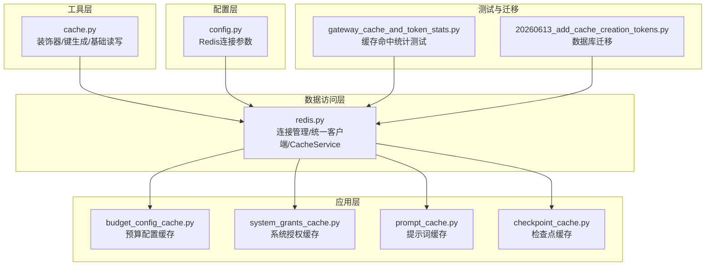
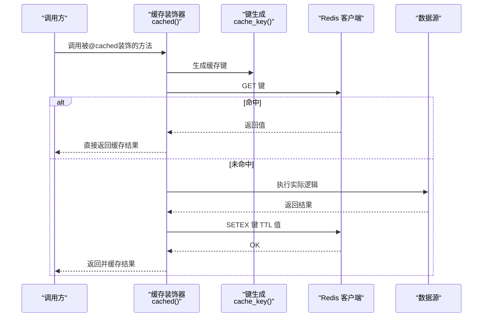
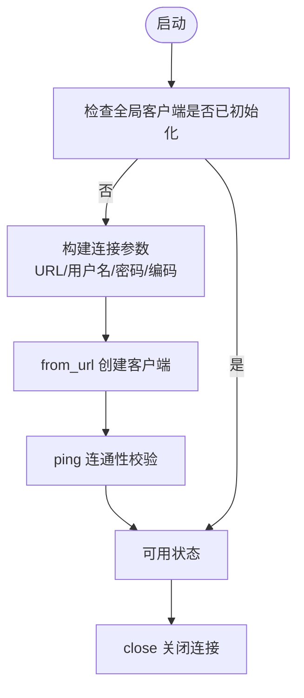
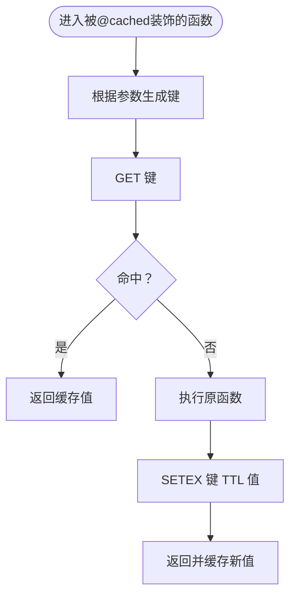
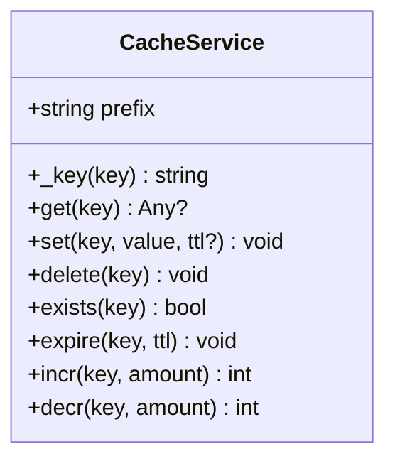
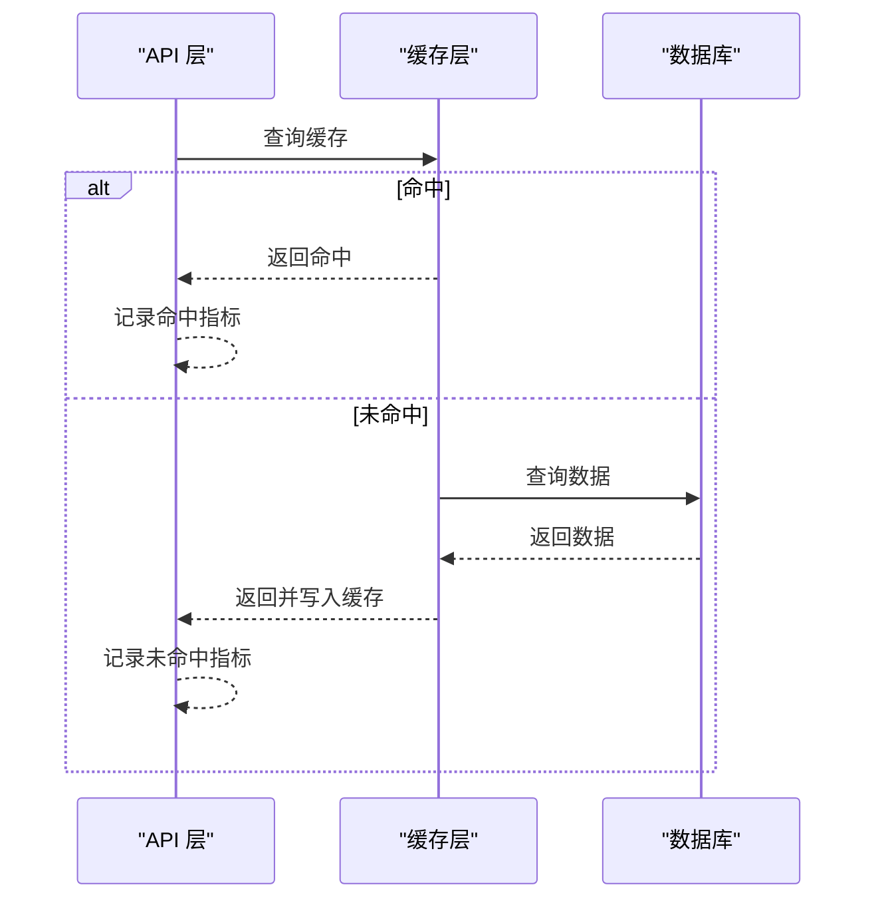
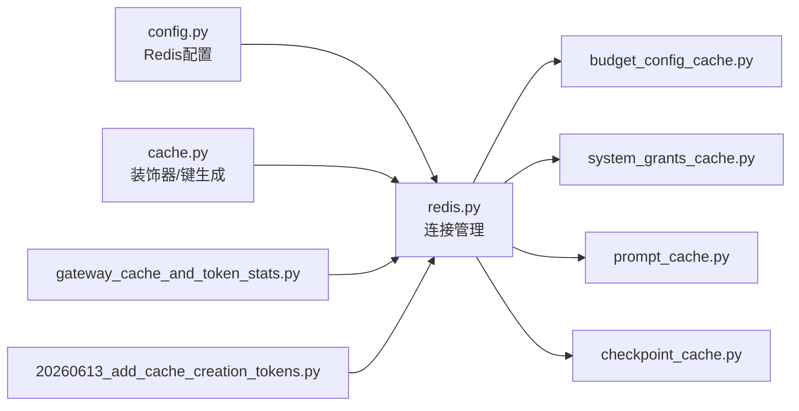

# 缓存系统

<cite>
**本文引用的文件**
- [cache.py](file://backend/utils/cache.py)
- [redis.py](file://backend/libs/db/redis.py)
- [config.py](file://backend/bootstrap/config.py)
- [budget_config_cache.py](file://backend/domains/gateway/application/budget_config_cache.py)
- [system_grants_cache.py](file://backend/domains/gateway/application/system_grants_cache.py)
- [checkpoint_cache.py](file://backend/domains/agent/infrastructure/memory/checkpoint_cache.py)
- [prompt_cache.py](file://backend/domains/agent/infrastructure/llm/prompt_cache.py)
- [gateway_cache_and_token_stats.py](file://backend/tests/integration/api/test_gateway_cache_and_token_stats.py)
- [test_quota_plan_service_and_guards.py](file://backend/tests/unit/gateway/test_quota_plan_service_and_guards.py)
- [20260613_add_cache_creation_tokens.py](file://backend/alembic/versions/20260613_add_cache_creation_tokens.py)
</cite>

## 目录
1. [引言](#引言)
2. [项目结构](#项目结构)
3. [核心组件](#核心组件)
4. [架构总览](#架构总览)
5. [详细组件分析](#详细组件分析)
6. [依赖关系分析](#依赖关系分析)
7. [性能考量](#性能考量)
8. [故障排查指南](#故障排查指南)
9. [结论](#结论)
10. [附录](#附录)

## 引言
本文件面向AI Agent系统的缓存子系统，系统性阐述Redis集成、键设计、失效策略、读写一致性、穿透与雪崩防护、批量与管道优化、监控与调试、以及配置最佳实践。文档既适合入门者理解缓存的基本价值与常见问题，也为资深开发者提供实现细节与优化建议。

## 项目结构
后端中与缓存直接相关的关键模块分布如下：
- 工具层：通用缓存装饰器与键生成、基础读写封装
- 数据访问层：Redis连接管理与统一客户端服务
- 应用层：网关预算配置、系统授权、提示词与检查点等具体缓存场景
- 配置层：Redis连接参数与环境变量
- 测试与迁移：缓存命中统计与计费指标的集成测试及数据库迁移

图表来源
- [cache.py:1-132](file://backend/utils/cache.py#L1-L132)
- [redis.py:1-126](file://backend/libs/db/redis.py#L1-L126)
- [budget_config_cache.py](file://backend/domains/gateway/application/budget_config_cache.py)
- [system_grants_cache.py](file://backend/domains/gateway/application/system_grants_cache.py)
- [prompt_cache.py](file://backend/domains/agent/infrastructure/llm/prompt_cache.py)
- [checkpoint_cache.py](file://backend/domains/agent/infrastructure/memory/checkpoint_cache.py)
- [config.py](file://backend/bootstrap/config.py)
- [gateway_cache_and_token_stats.py](file://backend/tests/integration/api/test_gateway_cache_and_token_stats.py)
- [20260613_add_cache_creation_tokens.py](file://backend/alembic/versions/20260613_add_cache_creation_tokens.py)

章节来源
- [cache.py:1-132](file://backend/utils/cache.py#L1-L132)
- [redis.py:1-126](file://backend/libs/db/redis.py#L1-L126)
- [config.py](file://backend/bootstrap/config.py)

## 核心组件
- Redis连接管理与客户端
  - 同步/异步两种客户端获取方式，支持用户名密码认证与ping连通性校验
  - 统一的全局客户端实例，避免重复连接
- 缓存装饰器与键生成
  - 基于函数签名生成稳定键，支持自定义前缀
  - TTL控制与失效接口
- 基础读写封装
  - get/set/delete/exists/expire/incr/decr等常用操作
  - JSON序列化/反序列化，确保跨请求一致

章节来源
- [redis.py:29-68](file://backend/libs/db/redis.py#L29-L68)
- [redis.py:71-122](file://backend/libs/db/redis.py#L71-L122)
- [cache.py:24-43](file://backend/utils/cache.py#L24-L43)
- [cache.py:45-93](file://backend/utils/cache.py#L45-L93)
- [cache.py:114-132](file://backend/utils/cache.py#L114-L132)

## 架构总览
缓存系统在应用中的位置与交互如下：

图表来源
- [cache.py:52-93](file://backend/utils/cache.py#L52-L93)
- [cache.py:45-49](file://backend/utils/cache.py#L45-L49)
- [cache.py:114-127](file://backend/utils/cache.py#L114-L127)

## 详细组件分析

### 1) Redis连接与客户端管理
- 初始化流程
  - 从配置读取URL、用户名、密码等参数
  - 使用from_url创建客户端并执行ping验证
  - 提供同步与异步两种获取方式
- 生命周期
  - 单例持有，提供close方法释放连接
- 认证与安全
  - 支持用户名/密码认证；decode_responses开启，保证字符串类型

图表来源
- [redis.py:29-48](file://backend/libs/db/redis.py#L29-L48)
- [redis.py:58-68](file://backend/libs/db/redis.py#L58-L68)

章节来源
- [redis.py:29-68](file://backend/libs/db/redis.py#L29-L68)

### 2) 缓存装饰器与键生成
- 键生成策略
  - 将函数参数序列化为JSON并排序，MD5生成固定长度键名
  - 前缀隔离不同业务域
- 装饰器行为
  - 先查缓存，命中则返回
  - 未命中则执行原函数，并以TTL写入缓存
- 失效与扫描
  - 支持按通配符扫描并删除匹配键
  - 提供单键删除与读写封装

图表来源
- [cache.py:52-93](file://backend/utils/cache.py#L52-L93)
- [cache.py:114-127](file://backend/utils/cache.py#L114-L127)

章节来源
- [cache.py:45-93](file://backend/utils/cache.py#L45-L93)
- [cache.py:96-111](file://backend/utils/cache.py#L96-L111)

### 3) CacheService统一服务
- 前缀隔离
  - 通过构造函数传入前缀，避免键冲突
- 常用操作
  - get/set/delete/exists/expire/incr/decr
  - JSON序列化/反序列化
- 适用场景
  - 需要集中管理键空间与TTL的业务模块

图表来源
- [redis.py:71-122](file://backend/libs/db/redis.py#L71-L122)

章节来源
- [redis.py:71-122](file://backend/libs/db/redis.py#L71-L122)

### 4) 应用层缓存场景

#### 4.1 网关预算配置缓存
- 目标：降低频繁查询预算配置的开销
- 实现要点：使用CacheService或装饰器缓存配置对象，设置合理TTL
- 失效策略：配置变更时主动失效相关键

章节来源
- [budget_config_cache.py](file://backend/domains/gateway/application/budget_config_cache.py)

#### 4.2 系统授权缓存
- 目标：加速鉴权判断，减少对权限中心的依赖
- 实现要点：以用户/租户维度生成键，结合角色与策略进行组合键设计
- 失效策略：权限变更时按用户/租户维度失效

章节来源
- [system_grants_cache.py](file://backend/domains/gateway/application/system_grants_cache.py)

#### 4.3 提示词缓存
- 目标：复用历史提示词，减少LLM输入计算成本
- 实现要点：以模板+参数组合生成稳定键，TTL基于提示词稳定性设定
- 失效策略：模板更新或参数集合变化时失效

章节来源
- [prompt_cache.py](file://backend/domains/agent/infrastructure/llm/prompt_cache.py)

#### 4.4 检查点缓存
- 目标：加速Agent记忆与上下文恢复
- 实现要点：以会话ID+步骤号为键，结合LRU或TTL控制容量
- 失效策略：会话结束或步骤推进时清理

章节来源
- [checkpoint_cache.py](file://backend/domains/agent/infrastructure/memory/checkpoint_cache.py)

### 5) 读写一致性、穿透与雪崩防护

- 读写一致性
  - 写后读：在写入缓存后立即返回最新值，避免脏读
  - 双写：写数据库后再写缓存，失败回滚
  - 失效策略：写路径主动失效相关键，确保后续读取走新数据
- 缓存穿透
  - 空值缓存：对不存在的结果也写入短TTL的空值占位
  - 参数校验：对非法参数直接拒绝或快速失败
- 缓存雪崩
  - TTL随机化：为同一键增加随机抖动，避免同时过期
  - 分层缓存：热点数据多级缓存（本地LRU+Redis），降低单一节点压力
  - 降级熔断：对下游异常时快速降级，保护缓存与数据库

章节来源
- [cache.py:52-93](file://backend/utils/cache.py#L52-L93)
- [redis.py:71-122](file://backend/libs/db/redis.py#L71-L122)

### 6) 键设计原则
- 命名规范
  - 前缀区分业务域，冒号分隔层级，如“域:子域:标识”
  - 函数装饰器默认前缀“cache”，可通过参数覆盖
- 作用域划分
  - 用户级：user:{userId}:...
  - 会话级：session:{sessionId}:...
  - 全局级：global:...
- 过期时间策略
  - 热点配置：短TTL+后台异步刷新
  - 历史数据：长TTL或永不过期，配合LRU淘汰
  - 临时令牌：与有效期一致或略短

章节来源
- [cache.py:45-49](file://backend/utils/cache.py#L45-L49)
- [redis.py:77-79](file://backend/libs/db/redis.py#L77-L79)

### 7) 性能优化技术
- 批量操作
  - scan_iter遍历键空间，分批处理，避免阻塞
  - 批量删除：先收集再DEL，减少RTT
- 管道命令
  - 使用pipeline合并多条SET/GET，提升吞吐
- 内存管理
  - 合理设置TTL与最大内存策略
  - 对大对象采用压缩或分片存储
- 并发控制
  - 互斥锁：热点键更新时加锁，避免惊群
  - 读写分离：热读冷写，降低竞争

章节来源
- [cache.py:96-111](file://backend/utils/cache.py#L96-L111)
- [test_quota_plan_service_and_guards.py:59-65](file://backend/tests/unit/gateway/test_quota_plan_service_and_guards.py#L59-L65)

### 8) 监控与调试
- 命中率统计
  - 结合网关请求日志与缓存命中标志，统计命中/未命中比例
- 内存使用分析
  - 通过INFO与MEMORY命令观察内存占用与碎片率
- 性能指标
  - RTT、QPS、失效率、TTL分布
- 计费与Token统计
  - 数据库迁移新增cache_creation_tokens字段，用于统计缓存创建产生的Token消耗

图表来源
- [gateway_cache_and_token_stats.py](file://backend/tests/integration/api/test_gateway_cache_and_token_stats.py)
- [20260613_add_cache_creation_tokens.py:1-44](file://backend/alembic/versions/20260613_add_cache_creation_tokens.py#L1-L44)

章节来源
- [gateway_cache_and_token_stats.py](file://backend/tests/integration/api/test_gateway_cache_and_token_stats.py)
- [20260613_add_cache_creation_tokens.py:1-44](file://backend/alembic/versions/20260613_add_cache_creation_tokens.py#L1-L44)

### 9) 配置最佳实践
- 连接配置
  - 使用环境变量注入URL、用户名、密码
  - 设置合理的最大连接数与超时
- 集群部署
  - 使用哨兵/集群模式，开启自动故障转移
  - 读写分离：主写从读，热点读取走从节点
- 持久化
  - RDB快照+AOF混合持久化，平衡恢复速度与数据安全
- 故障转移
  - 主从切换时阻塞时间最小化
  - 客户端具备重试与退避策略

章节来源
- [config.py](file://backend/bootstrap/config.py)
- [redis.py:29-36](file://backend/libs/db/redis.py#L29-L36)

## 依赖关系分析

图表来源
- [config.py](file://backend/bootstrap/config.py)
- [redis.py:1-126](file://backend/libs/db/redis.py#L1-L126)
- [cache.py:1-132](file://backend/utils/cache.py#L1-L132)
- [budget_config_cache.py](file://backend/domains/gateway/application/budget_config_cache.py)
- [system_grants_cache.py](file://backend/domains/gateway/application/system_grants_cache.py)
- [prompt_cache.py](file://backend/domains/agent/infrastructure/llm/prompt_cache.py)
- [checkpoint_cache.py](file://backend/domains/agent/infrastructure/memory/checkpoint_cache.py)
- [gateway_cache_and_token_stats.py](file://backend/tests/integration/api/test_gateway_cache_and_token_stats.py)
- [20260613_add_cache_creation_tokens.py](file://backend/alembic/versions/20260613_add_cache_creation_tokens.py)

章节来源
- [redis.py:1-126](file://backend/libs/db/redis.py#L1-L126)
- [cache.py:1-132](file://backend/utils/cache.py#L1-L132)

## 性能考量
- 管道与批处理
  - 合理使用pipeline减少网络往返
  - 批量扫描与删除，避免长时间阻塞
- TTL与淘汰策略
  - 热点键短TTL+异步刷新
  - 大对象考虑压缩或外部存储
- 并发与一致性
  - 互斥锁避免惊群
  - 读多写少场景优先读缓存

## 故障排查指南
- 连接失败
  - 检查URL、用户名、密码与网络连通性
  - 观察ping是否成功
- 命中率低
  - 检查键前缀与TTL是否正确
  - 分析热点键是否过期过于集中
- 内存飙升
  - 查看内存使用与碎片率
  - 调整最大内存与淘汰策略
- 失效异常
  - 确认扫描模式与删除逻辑
  - 检查键空间是否被其他模块污染

章节来源
- [redis.py:29-48](file://backend/libs/db/redis.py#L29-L48)
- [cache.py:96-111](file://backend/utils/cache.py#L96-L111)

## 结论
本缓存系统以统一的连接管理与键空间设计为基础，结合装饰器与服务类提供灵活的读写能力。通过合理的TTL、穿透与雪崩防护策略，以及批量与管道优化，能够在高并发下保持稳定与高性能。配合监控与数据库指标迁移，可实现对缓存效果的可观测与持续优化。

## 附录
- 常用命令参考
  - GET/SETEX/DEL/EXISTS/EXPIRE/SCAN/INCRBY/DECRBY
- 建议的键前缀
  - 预算配置：budget:config:{id}
  - 系统授权：system:grants:{userId}
  - 提示词：prompt:{templateId}:{digest}
  - 检查点：checkpoint:{sessionId}:{step}