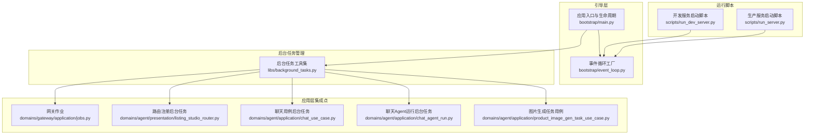
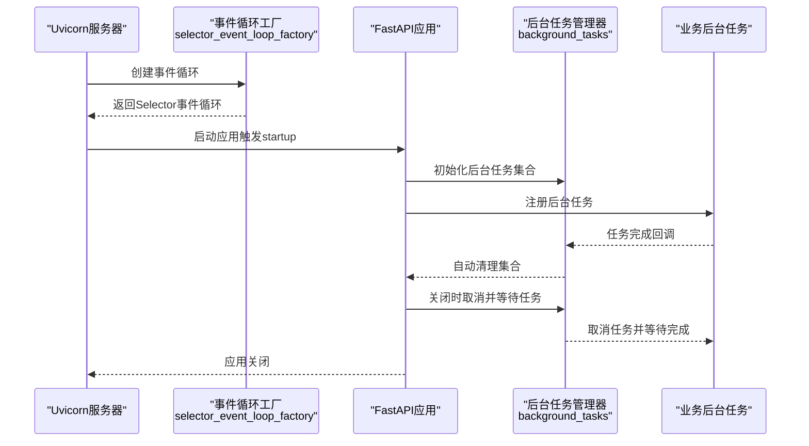
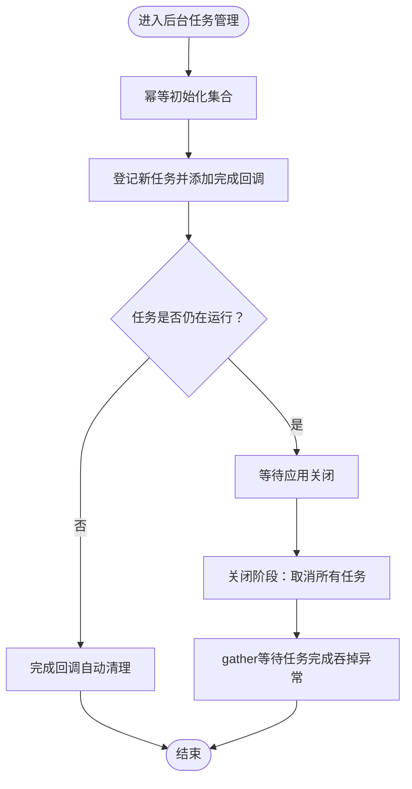
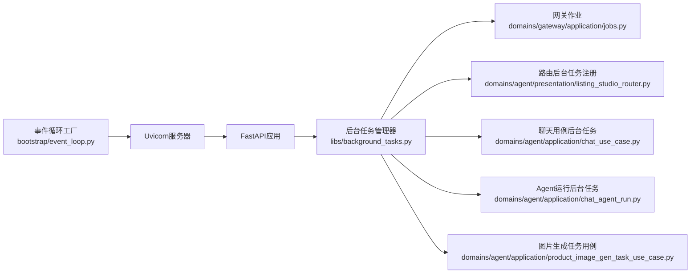

# 事件循环管理

<cite>
**本文引用的文件**
- [backend/bootstrap/event_loop.py](file://backend/bootstrap/event_loop.py)
- [backend/bootstrap/main.py](file://backend/bootstrap/main.py)
- [backend/libs/background_tasks.py](file://backend/libs/background_tasks.py)
- [backend/scripts/run_server.py](file://backend/scripts/run_server.py)
- [backend/scripts/run_dev_server.py](file://backend/scripts/run_dev_server.py)
- [backend/domains/agent/application/chat_use_case.py](file://backend/domains/agent/application/chat_use_case.py)
- [backend/domains/agent/application/chat_agent_run.py](file://backend/domains/agent/application/chat_agent_run.py)
- [backend/domains/agent/application/product_image_gen_task_use_case.py](file://backend/domains/agent/application/product_image_gen_task_use_case.py)
- [backend/domains/gateway/application/jobs.py](file://backend/domains/gateway/application/jobs.py)
- [backend/domains/agent/presentation/listing_studio_router.py](file://backend/domains/agent/presentation/listing_studio_router.py)
- [backend/tests/unit/libs/test_background_tasks.py](file://backend/tests/unit/libs/test_background_tasks.py)
</cite>

## 目录
1. [简介](#简介)
2. [项目结构](#项目结构)
3. [核心组件](#核心组件)
4. [架构总览](#架构总览)
5. [详细组件分析](#详细组件分析)
6. [依赖关系分析](#依赖关系分析)
7. [性能考虑](#性能考虑)
8. [故障排查指南](#故障排查指南)
9. [结论](#结论)
10. [附录](#附录)

## 简介
本技术文档围绕AI Agent事件循环管理展开，重点解析backend/bootstrap/event_loop.py中事件循环的设计与实现，涵盖以下主题：
- 异步任务调度与后台作业管理
- 定时任务处理与周期性作业
- 事件循环启动与停止机制（含优雅关闭与资源清理）
- 后台任务执行模型（任务队列、并发控制、错误恢复）
- 事件循环与FastAPI应用的集成（生命周期钩子、信号处理）
- 架构图与任务调度流程图
- 性能监控指标、任务超时与内存泄漏防护
- 面向初学者的异步编程基础概念与面向高级用户的事件驱动架构细节

## 项目结构
事件循环相关的核心文件分布于以下模块：
- 事件循环工厂与策略：backend/bootstrap/event_loop.py
- 应用入口与生命周期集成：backend/bootstrap/main.py
- 后台任务注册与关闭：backend/libs/background_tasks.py
- 服务器脚本与事件循环工厂绑定：backend/scripts/run_server.py、backend/scripts/run_dev_server.py
- 使用示例与集成点：多个应用层use case与router中对后台任务的注册与管理

图表来源
- [backend/bootstrap/event_loop.py:1-40](file://backend/bootstrap/event_loop.py#L1-L40)
- [backend/bootstrap/main.py:150-170](file://backend/bootstrap/main.py#L150-L170)
- [backend/libs/background_tasks.py:1-40](file://backend/libs/background_tasks.py#L1-L40)
- [backend/scripts/run_server.py:1-50](file://backend/scripts/run_server.py#L1-L50)
- [backend/scripts/run_dev_server.py:1-30](file://backend/scripts/run_dev_server.py#L1-L30)
- [backend/domains/gateway/application/jobs.py:1-40](file://backend/domains/gateway/application/jobs.py#L1-L40)
- [backend/domains/agent/presentation/listing_studio_router.py:1-60](file://backend/domains/agent/presentation/listing_studio_router.py#L1-L60)
- [backend/domains/agent/application/chat_use_case.py:100-350](file://backend/domains/agent/application/chat_use_case.py#L100-L350)
- [backend/domains/agent/application/chat_agent_run.py:260-280](file://backend/domains/agent/application/chat_agent_run.py#L260-L280)
- [backend/domains/agent/application/product_image_gen_task_use_case.py:160-250](file://backend/domains/agent/application/product_image_gen_task_use_case.py#L160-L250)

章节来源
- [backend/bootstrap/event_loop.py:1-40](file://backend/bootstrap/event_loop.py#L1-L40)
- [backend/bootstrap/main.py:150-170](file://backend/bootstrap/main.py#L150-L170)
- [backend/libs/background_tasks.py:1-40](file://backend/libs/background_tasks.py#L1-L40)
- [backend/scripts/run_server.py:1-50](file://backend/scripts/run_server.py#L1-L50)
- [backend/scripts/run_dev_server.py:1-30](file://backend/scripts/run_dev_server.py#L1-L30)

## 核心组件
- 事件循环工厂与平台兼容策略
  - Windows上绕过asyncio.set_event_loop_policy，避免ProactorEventLoop导致的兼容问题，通过自定义工厂函数selector_event_loop_factory提供稳定的Selector事件循环。
  - 工厂函数作为Uvicorn配置参数传递，确保服务端与客户端一致的事件循环行为。

- FastAPI生命周期集成
  - 在应用启动阶段初始化后台任务集合，在应用关闭阶段统一取消并等待后台任务完成，保证优雅停机与资源回收。

- 后台任务注册与管理
  - 提供幂等初始化、任务登记、完成回调自动清理、统一关闭与等待的完整能力，支持任意数量的后台任务并发存在。

- 业务层集成点
  - 多个应用use case与router在需要时创建并注册后台任务，确保长耗时或周期性任务不阻塞主请求线程。

章节来源
- [backend/bootstrap/event_loop.py:1-40](file://backend/bootstrap/event_loop.py#L1-L40)
- [backend/bootstrap/main.py:150-170](file://backend/bootstrap/main.py#L150-L170)
- [backend/libs/background_tasks.py:1-40](file://backend/libs/background_tasks.py#L1-L40)

## 架构总览
事件循环管理的整体架构围绕“事件循环工厂 + FastAPI生命周期 + 后台任务管理”三部分协作展开。Uvicorn通过事件循环工厂创建事件循环，FastAPI在startup/shutdown钩子中调用后台任务管理器，业务层在需要时注册后台任务。

图表来源
- [backend/bootstrap/event_loop.py:25-40](file://backend/bootstrap/event_loop.py#L25-L40)
- [backend/bootstrap/main.py:150-170](file://backend/bootstrap/main.py#L150-L170)
- [backend/libs/background_tasks.py:12-39](file://backend/libs/background_tasks.py#L12-L39)
- [backend/domains/gateway/application/jobs.py:1-40](file://backend/domains/gateway/application/jobs.py#L1-L40)

## 详细组件分析

### 事件循环工厂与平台兼容
- 设计目标
  - 统一事件循环类型，避免Windows默认ProactorEventLoop带来的兼容性问题。
  - 通过工厂函数暴露给Uvicorn，确保服务端与客户端一致的事件循环行为。

- 关键实现要点
  - 工厂函数selector_event_loop_factory返回稳定的Selector事件循环实例。
  - 文档注释明确说明绕过asyncio.set_event_loop_policy的原因与替代方案。

- 集成方式
  - Uvicorn通过loop参数指定工厂函数，确保事件循环策略可控。

章节来源
- [backend/bootstrap/event_loop.py:1-40](file://backend/bootstrap/event_loop.py#L1-L40)

### FastAPI生命周期钩子与优雅关闭
- 启动阶段
  - 在应用启动时初始化后台任务集合，确保后续注册的后台任务有容器存放。
- 关闭阶段
  - 统一取消所有已登记的任务，并等待它们完成，吞掉取消异常，保证进程安全退出。

- 与服务器脚本的配合
  - 生产与开发脚本均通过事件循环工厂确保事件循环策略一致，避免不同环境下的差异。

章节来源
- [backend/bootstrap/main.py:150-170](file://backend/bootstrap/main.py#L150-L170)
- [backend/scripts/run_server.py:1-50](file://backend/scripts/run_server.py#L1-L50)
- [backend/scripts/run_dev_server.py:1-30](file://backend/scripts/run_dev_server.py#L1-L30)

### 后台任务注册与管理
- 幂等初始化
  - 仅在app.state中不存在background_tasks时创建集合，避免重复初始化。
- 任务登记与自动清理
  - 登记后为任务添加完成回调，任务完成后自动从集合中移除。
- 关闭与等待
  - 关闭时遍历集合取消所有任务，使用gather并开启return_exceptions以避免异常中断整体等待。

- 测试验证
  - 单测覆盖了任务被取消、完成后自动清理等关键行为，确保实现正确性。

图表来源
- [backend/libs/background_tasks.py:12-39](file://backend/libs/background_tasks.py#L12-L39)

章节来源
- [backend/libs/background_tasks.py:1-40](file://backend/libs/background_tasks.py#L1-L40)
- [backend/tests/unit/libs/test_background_tasks.py:15-54](file://backend/tests/unit/libs/test_background_tasks.py#L15-L54)

### 业务层后台任务集成点
- 网关作业
  - 在网关应用层创建并注册后台任务，用于周期性或长耗时的系统维护任务。
- 路由层注册
  - 路由在响应请求时根据需要创建后台任务，避免阻塞请求处理。
- 聊天用例与Agent运行
  - 在聊天流程中创建后台任务，处理非阻塞的后续动作（如日志、缓存更新等）。
- 图片生成任务用例
  - 将长耗时的图片生成任务放入后台队列，提升接口响应速度。

章节来源
- [backend/domains/gateway/application/jobs.py:1-40](file://backend/domains/gateway/application/jobs.py#L1-L40)
- [backend/domains/agent/presentation/listing_studio_router.py:1-60](file://backend/domains/agent/presentation/listing_studio_router.py#L1-L60)
- [backend/domains/agent/application/chat_use_case.py:100-350](file://backend/domains/agent/application/chat_use_case.py#L100-L350)
- [backend/domains/agent/application/chat_agent_run.py:260-280](file://backend/domains/agent/application/chat_agent_run.py#L260-L280)
- [backend/domains/agent/application/product_image_gen_task_use_case.py:160-250](file://backend/domains/agent/application/product_image_gen_task_use_case.py#L160-L250)

### 异步任务调度、后台作业管理与定时任务处理
- 任务调度
  - 使用asyncio.create_task创建任务，结合事件循环工厂确保跨平台一致性。
- 后台作业管理
  - 通过后台任务管理器集中管理，支持并发控制（集合大小即并发上限）、自动清理与统一关闭。
- 定时任务处理
  - 建议在业务层使用asyncio.sleep或更高层的定时器库（如APScheduler的协程适配）创建周期性任务，并注册到后台任务管理器。

章节来源
- [backend/libs/background_tasks.py:12-39](file://backend/libs/background_tasks.py#L12-L39)
- [backend/domains/gateway/application/jobs.py:1-40](file://backend/domains/gateway/application/jobs.py#L1-L40)

### 事件循环与FastAPI集成、生命周期钩子与信号处理
- 生命周期钩子
  - startup：初始化后台任务集合。
  - shutdown：取消并等待所有后台任务完成。
- 信号处理
  - 建议在应用入口处注册SIGTERM/SIGINT信号处理器，触发FastAPI的shutdown流程，确保后台任务有序关闭。

章节来源
- [backend/bootstrap/main.py:150-170](file://backend/bootstrap/main.py#L150-L170)

## 依赖关系分析
事件循环管理涉及的依赖关系如下：

图表来源
- [backend/bootstrap/event_loop.py:1-40](file://backend/bootstrap/event_loop.py#L1-L40)
- [backend/bootstrap/main.py:150-170](file://backend/bootstrap/main.py#L150-L170)
- [backend/libs/background_tasks.py:1-40](file://backend/libs/background_tasks.py#L1-L40)
- [backend/domains/gateway/application/jobs.py:1-40](file://backend/domains/gateway/application/jobs.py#L1-L40)
- [backend/domains/agent/presentation/listing_studio_router.py:1-60](file://backend/domains/agent/presentation/listing_studio_router.py#L1-L60)
- [backend/domains/agent/application/chat_use_case.py:100-350](file://backend/domains/agent/application/chat_use_case.py#L100-L350)
- [backend/domains/agent/application/chat_agent_run.py:260-280](file://backend/domains/agent/application/chat_agent_run.py#L260-L280)
- [backend/domains/agent/application/product_image_gen_task_use_case.py:160-250](file://backend/domains/agent/application/product_image_gen_task_use_case.py#L160-L250)

章节来源
- [backend/bootstrap/event_loop.py:1-40](file://backend/bootstrap/event_loop.py#L1-L40)
- [backend/bootstrap/main.py:150-170](file://backend/bootstrap/main.py#L150-L170)
- [backend/libs/background_tasks.py:1-40](file://backend/libs/background_tasks.py#L1-L40)

## 性能考虑
- 事件循环选择
  - 使用Selector事件循环避免Windows ProactorEventLoop的兼容性问题，减少跨平台差异导致的性能波动。
- 并发控制
  - 后台任务集合大小即并发上限，建议根据CPU/IO特性与资源限制合理设置任务数。
- 资源清理
  - 关闭阶段统一取消并等待，避免僵尸任务占用资源；完成回调自动清理集合，防止集合膨胀。
- 监控指标建议
  - 后台任务总数、活跃任务数、任务执行时延、失败率、取消次数、内存占用趋势。
- 超时与重试
  - 对长耗时任务设置超时与重试策略，避免单点阻塞；对可重试的网络/IO操作采用指数退避。
- 内存泄漏防护
  - 确保任务完成回调正确移除引用，避免闭包持有外部对象导致循环引用；定期检查app.state.background_tasks集合大小。

## 故障排查指南
- 症状：应用无法优雅关闭，进程卡住
  - 排查：确认shutdown阶段是否调用后台任务管理器的关闭逻辑；检查是否存在未完成的后台任务。
- 症状：后台任务未被清理，集合持续增长
  - 排查：确认任务是否添加完成回调；查看完成回调是否被正确执行。
- 症状：Windows环境下事件循环异常
  - 排查：确认Uvicorn是否通过事件循环工厂创建事件循环；避免直接调用asyncio.set_event_loop_policy。
- 单元测试参考
  - 参考后台任务单元测试，验证任务取消与自动清理的行为是否符合预期。

章节来源
- [backend/tests/unit/libs/test_background_tasks.py:15-54](file://backend/tests/unit/libs/test_background_tasks.py#L15-L54)

## 结论
事件循环管理通过“事件循环工厂 + FastAPI生命周期 + 后台任务管理器”的组合，实现了跨平台一致的事件循环行为、可靠的后台任务调度与优雅关闭。该方案具备良好的扩展性与可维护性，适合在AI Agent系统中承载长耗时与周期性任务，保障系统的稳定性与性能。

## 附录
- 初学者异步编程基础
  - 事件循环：程序调度异步任务的核心引擎。
  - 任务与协程：协程是异步函数，任务是调度与执行的载体。
  - 并发与并发控制：通过集合或队列限制并发度，避免资源争用。
  - 错误处理：使用try/except与gather(return_exceptions=True)捕获与聚合异常。
- 高级实践建议
  - 使用上下文管理器与信号处理器确保资源释放。
  - 对关键路径进行性能剖析，识别瓶颈并优化。
  - 为后台任务引入可观测性（日志、指标、追踪），便于定位问题。