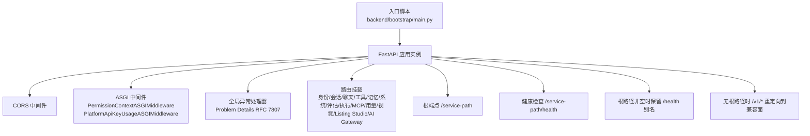
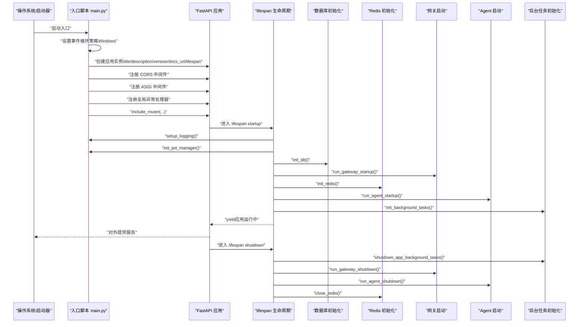
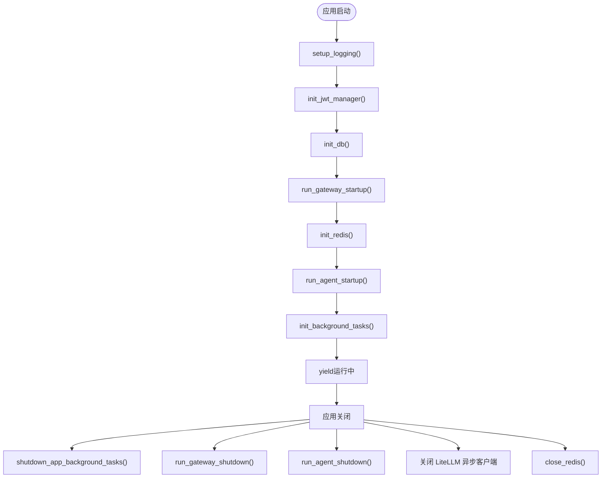
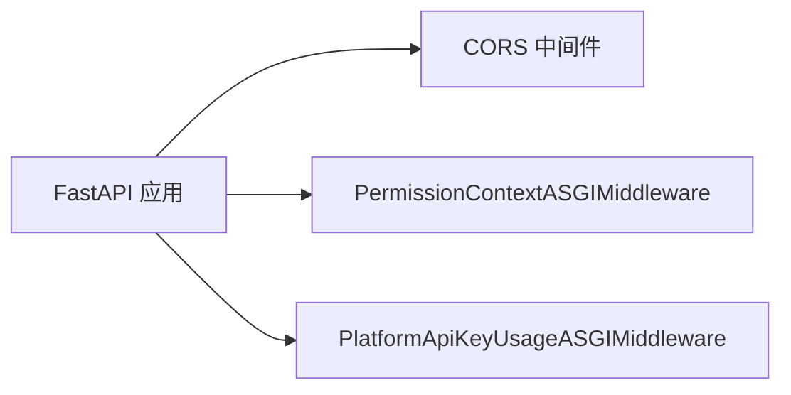
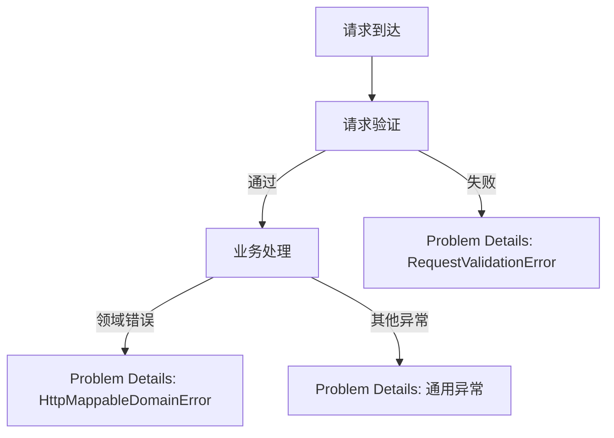
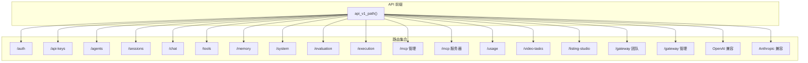
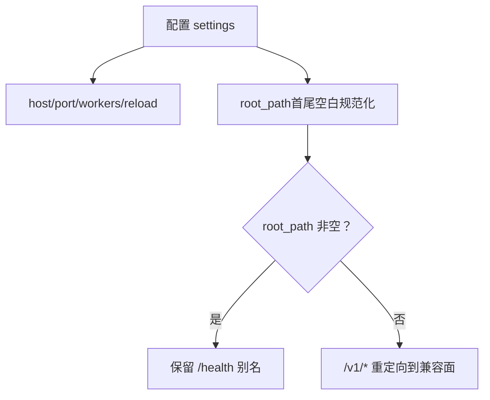
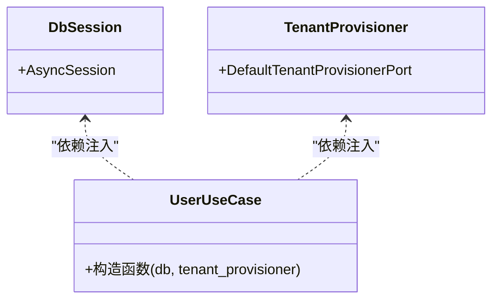
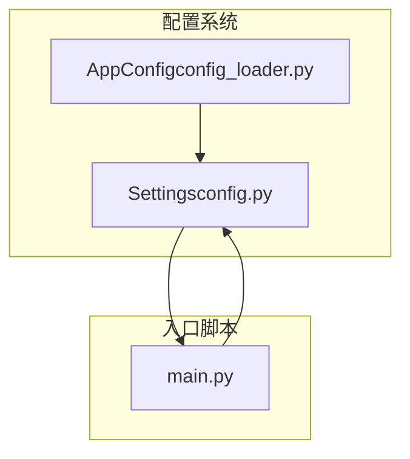

# 应用入口点

<cite>
**本文引用的文件**   
- [main.py](file://backend/bootstrap/main.py)
- [config.py](file://backend/bootstrap/config.py)
- [config_loader.py](file://backend/bootstrap/config_loader.py)
- [identity_services.py](file://backend/bootstrap/composition/identity_services.py)
</cite>

## 目录
1. [引言](#引言)
2. [项目结构](#项目结构)
3. [核心组件](#核心组件)
4. [架构总览](#架构总览)
5. [详细组件分析](#详细组件分析)
6. [依赖分析](#依赖分析)
7. [性能考虑](#性能考虑)
8. [故障排查指南](#故障排查指南)
9. [结论](#结论)
10. [附录](#附录)

## 引言
本文聚焦于AI Agent后端的应用入口点，系统性解析 backend/bootstrap/main.py 中FastAPI应用实例的创建流程，涵盖应用配置选项、中间件注册、路由挂载、启动参数处理、身份服务组合器的依赖注入与生命周期管理，以及应用初始化顺序与关键组件注册流程。同时提供启动时序图与依赖关系图，给出常见启动错误排查方法与性能调优建议，既面向初学者解释FastAPI基本概念，也为有经验的开发者提供深入的源码分析。

## 项目结构
本项目的后端入口位于 backend/bootstrap/main.py，负责：
- 构建FastAPI应用实例（标题、描述、版本、文档页开关、生命周期）
- 注册CORS与ASGI中间件
- 注册全局异常处理器
- 挂载各领域路由（身份、会话、聊天、工具、记忆、系统、评估、执行、MCP、用量、视频任务、Listing Studio、AI Gateway等）
- 定义根端点与健康检查端点，并根据根路径配置处理兼容重定向

**图表来源**
- [main.py:182-537](file://backend/bootstrap/main.py#L182-L537)

**章节来源**
- [main.py:182-537](file://backend/bootstrap/main.py#L182-L537)

## 核心组件
- FastAPI应用实例与生命周期
  - 使用 lifespan 钩子在启动阶段完成日志初始化、JWT管理器初始化、数据库连接、网关与Agent启动、Redis初始化、后台任务初始化；在关闭阶段执行相反的清理流程。
  - 文档页开关由配置决定：仅在调试模式开启。
- 中间件体系
  - CORS中间件：开发环境允许本地前端跨域访问，生产环境严格限定来源。
  - ASGI中间件：权限上下文与平台API Key用量记录，兼容SSE/StreamingResponse。
- 全局异常处理
  - 统一返回RFC 7807 Problem Details格式，覆盖请求验证、领域错误、鉴权/认证、速率限制、外部服务、工具执行、检查点、通用异常等。
- 路由体系
  - 路由按领域划分，统一前缀 api_v1_path()，部分兼容路由保留旧路径并返回弃用头。
- 启动参数与根路径
  - 服务器监听地址、端口、工作进程数、热重载等由配置控制；根路径 root_path 用于服务级前缀，影响路由与健康检查别名。

**章节来源**
- [main.py:108-180](file://backend/bootstrap/main.py#L108-L180)
- [main.py:182-190](file://backend/bootstrap/main.py#L182-L190)
- [main.py:192-227](file://backend/bootstrap/main.py#L192-L227)
- [main.py:234-383](file://backend/bootstrap/main.py#L234-L383)
- [main.py:388-537](file://backend/bootstrap/main.py#L388-L537)
- [config.py:47-70](file://backend/bootstrap/config.py#L47-L70)
- [config.py:52](file://backend/bootstrap/config.py#L52)

## 架构总览
下图展示应用启动的关键时序：从事件循环策略设置到FastAPI实例创建、中间件注册、路由挂载、生命周期管理，再到最终对外提供服务。

**图表来源**
- [main.py:18-25](file://backend/bootstrap/main.py#L18-L25)
- [main.py:182-190](file://backend/bootstrap/main.py#L182-L190)
- [main.py:108-180](file://backend/bootstrap/main.py#L108-L180)

## 详细组件分析

### FastAPI应用实例与生命周期
- 事件循环策略：Windows平台设置 SelectorEventLoopPolicy，确保异步数据库驱动正常工作。
- 应用实例创建：设置标题、描述、版本、文档页开关（调试模式）、生命周期回调。
- 生命周期管理：
  - 启动阶段：日志初始化、LiteLLM警告抑制、JWT管理器初始化、数据库初始化、网关启动、Redis初始化（开发环境可忽略不可用）、Agent启动、后台任务初始化、Agent可流式HTTP生命周期。
  - 关闭阶段：后台任务关闭、网关关闭、Agent关闭、LiteLLM异步客户端清理、Redis关闭。

**图表来源**
- [main.py:18-25](file://backend/bootstrap/main.py#L18-L25)
- [main.py:108-180](file://backend/bootstrap/main.py#L108-L180)

**章节来源**
- [main.py:18-25](file://backend/bootstrap/main.py#L18-L25)
- [main.py:108-180](file://backend/bootstrap/main.py#L108-L180)

### 中间件注册与作用
- CORS中间件：开发环境允许本地前端访问，生产环境严格限定来源；暴露大量速率限制与网关相关响应头。
- ASGI中间件：
  - 权限上下文中间件：为每个请求建立权限上下文，支持后续授权判断。
  - 平台API Key用量中间件：记录平台API Key的使用情况，便于审计与限流。

**图表来源**
- [main.py:192-227](file://backend/bootstrap/main.py#L192-L227)

**章节来源**
- [main.py:192-227](file://backend/bootstrap/main.py#L192-L227)

### 全局异常处理器（Problem Details）
- 统一异常映射：请求验证错误、领域错误、验证错误、资源未找到、权限拒绝、认证/令牌错误、冲突、速率限制、外部服务错误、工具执行错误、检查点错误、通用异常。
- 返回格式：遵循RFC 7807 Problem Details，开发模式下打印堆栈便于调试。

**图表来源**
- [main.py:234-383](file://backend/bootstrap/main.py#L234-L383)

**章节来源**
- [main.py:234-383](file://backend/bootstrap/main.py#L234-L383)

### 路由挂载与API前缀
- API前缀统一由 api_v1_path() 生成；部分兼容路由保留旧路径并返回弃用头。
- 路由覆盖身份、会话、聊天、工具、记忆、系统、评估、执行、MCP、用量、视频任务、Listing Studio、AI Gateway团队与管理API、OpenAI/Anthropic兼容入口等。

**图表来源**
- [main.py:388-494](file://backend/bootstrap/main.py#L388-L494)

**章节来源**
- [main.py:388-494](file://backend/bootstrap/main.py#L388-L494)

### 启动参数处理与根路径
- 服务器配置：host、port、workers、reload 由配置控制。
- 根路径 root_path：用于服务级前缀，影响路由与健康检查别名；提供首尾空白规范化处理。
- 兼容重定向：无根路径时，/v1/* 重定向到新的兼容面（OpenAI或Anthropic）。

**图表来源**
- [config.py:47-70](file://backend/bootstrap/config.py#L47-L70)
- [config.py:52](file://backend/bootstrap/config.py#L52)
- [main.py:512-537](file://backend/bootstrap/main.py#L512-L537)

**章节来源**
- [config.py:47-70](file://backend/bootstrap/config.py#L47-L70)
- [config.py:52](file://backend/bootstrap/config.py#L52)
- [main.py:512-537](file://backend/bootstrap/main.py#L512-L537)

### 身份服务组合器与依赖注入
- 依赖工厂：在 identity_services.py 中定义 get_user_use_case，使用 Depends(get_db) 注入数据库会话，并通过租户供应器注入 DefaultTenantProvisionerPort，最终构造 UserUseCase。
- 作用：为身份域的业务用例提供统一的依赖注入入口，保证事务与租户上下文的一致性。

**图表来源**
- [identity_services.py:15](file://backend/bootstrap/composition/identity_services.py#L15)
- [identity_services.py:18-24](file://backend/bootstrap/composition/identity_services.py#L18-L24)

**章节来源**
- [identity_services.py:15](file://backend/bootstrap/composition/identity_services.py#L15)
- [identity_services.py:18-24](file://backend/bootstrap/composition/identity_services.py#L18-L24)

## 依赖分析
- 配置来源与优先级
  - 配置类 Settings 定义了应用、服务器、数据库、Redis、向量库、LLM提供商、安全、存储、工具沙箱、Agent执行、检查点、Token优化、日志与监控、AI Gateway等配置项。
  - 配置加载顺序：环境变量 > .env > config/app.toml > 默认值。
  - TOML配置加载器支持环境变量插值与深度合并，提供更丰富的应用逻辑配置（如SimpleMem、Agent、Checkpoint、Token优化、Logging、Monitoring）。
- 入口脚本对配置的使用
  - 应用实例标题、文档页开关、日志级别/格式、CORS来源、根路径等均来自配置。
  - 生命周期中使用的数据库、Redis、JWT管理器、网关与Agent启动逻辑均依赖配置。

**图表来源**
- [config.py:34-457](file://backend/bootstrap/config.py#L34-L457)
- [config_loader.py:249-418](file://backend/bootstrap/config_loader.py#L249-L418)
- [main.py:182-190](file://backend/bootstrap/main.py#L182-L190)

**章节来源**
- [config.py:34-457](file://backend/bootstrap/config.py#L34-L457)
- [config_loader.py:249-418](file://backend/bootstrap/config_loader.py#L249-L418)
- [main.py:182-190](file://backend/bootstrap/main.py#L182-L190)

## 性能考虑
- 事件循环策略：Windows平台使用SelectorEventLoopPolicy，避免某些异步驱动（如psycopg异步）的兼容性问题。
- 数据库连接池：通过配置调整数据库连接池大小与溢出，平衡并发与资源占用。
- Redis可用性：开发环境Redis不可用时仅告警不阻断，减少启动时间；生产环境建议确保Redis可用。
- LiteLLM客户端清理：应用关闭时主动关闭异步客户端，避免资源泄漏。
- 日志与监控：生产环境建议关闭调试文档页，降低静态资源开销；合理设置日志级别与格式，避免过度输出。

**章节来源**
- [main.py:18-25](file://backend/bootstrap/main.py#L18-L25)
- [main.py:148-153](file://backend/bootstrap/main.py#L148-L153)
- [main.py:166-178](file://backend/bootstrap/main.py#L166-L178)
- [config.py:74-78](file://backend/bootstrap/config.py#L74-L78)

## 故障排查指南
- 启动失败（Windows异步驱动）
  - 现象：数据库或异步操作报错。
  - 排查：确认事件循环策略已在入口处设置；使用uvicorn启动时需正确传递loop工厂。
- CORS跨域问题
  - 现象：浏览器跨域失败。
  - 排查：检查配置中的cors_origins；开发环境允许本地源，生产环境必须精确配置。
- Redis不可用
  - 现象：启动阶段出现Redis不可用告警。
  - 排查：开发环境可接受；生产环境需修复Redis连接。
- 根路径导致路由404
  - 现象：路由404。
  - 排查：检查root_path是否首尾有空白字符，配置已做规范化处理，但建议确认环境变量与.env文件。
- 兼容重定向
  - 现象：/v1/*访问被301重定向。
  - 排查：确认无根路径场景下的重定向行为；必要时通过新兼容面访问。
- 未捕获异常
  - 现象：500错误。
  - 排查：查看日志中的异常堆栈；开发模式下会在stderr打印详细堆栈。

**章节来源**
- [main.py:18-25](file://backend/bootstrap/main.py#L18-L25)
- [main.py:192-227](file://backend/bootstrap/main.py#L192-L227)
- [main.py:148-153](file://backend/bootstrap/main.py#L148-L153)
- [config.py:52](file://backend/bootstrap/config.py#L52)
- [main.py:512-537](file://backend/bootstrap/main.py#L512-L537)
- [main.py:368-383](file://backend/bootstrap/main.py#L368-L383)

## 结论
入口脚本以清晰的生命周期管理、严格的中间件与异常处理、规范化的路由挂载与配置驱动为核心，构建了可扩展、可观测、易维护的FastAPI应用骨架。通过身份服务组合器实现依赖注入与租户上下文，配合完善的配置系统与启动参数处理，满足从开发到生产的多样化部署需求。

## 附录
- 初学者快速理解
  - FastAPI是一个现代、高性能的Web框架，支持自动API文档、类型校验与异步。
  - 应用实例通过 lifespan 管理启动与关闭，适合放置数据库、缓存、外部服务的初始化与清理。
  - 中间件分为HTTP与ASGI两类，ASGI中间件对SSE/流式响应更友好。
  - 路由按领域组织，统一前缀，便于扩展与维护。
- 进阶参考
  - 配置系统采用Pydantic Settings与TOML加载器，支持环境变量插值与深度合并。
  - 身份服务组合器展示了如何在FastAPI中进行依赖注入与领域用例封装。