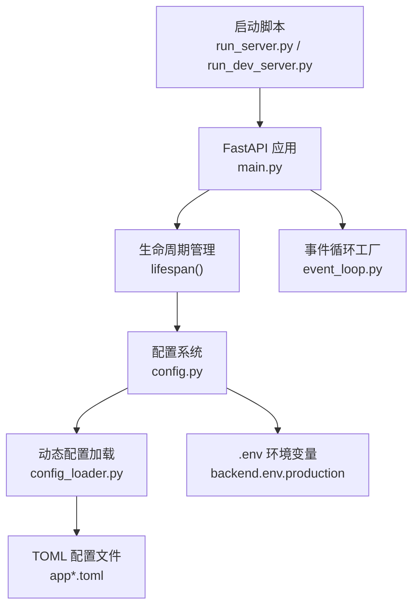
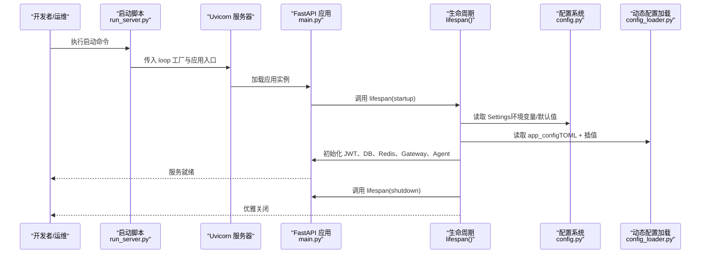
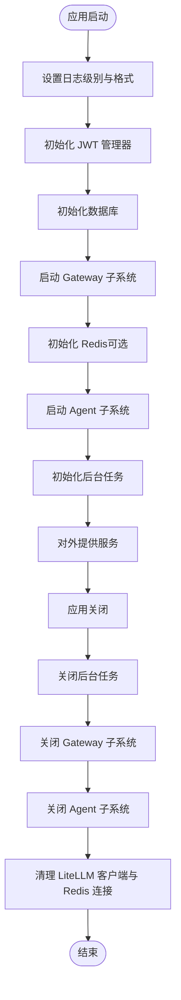
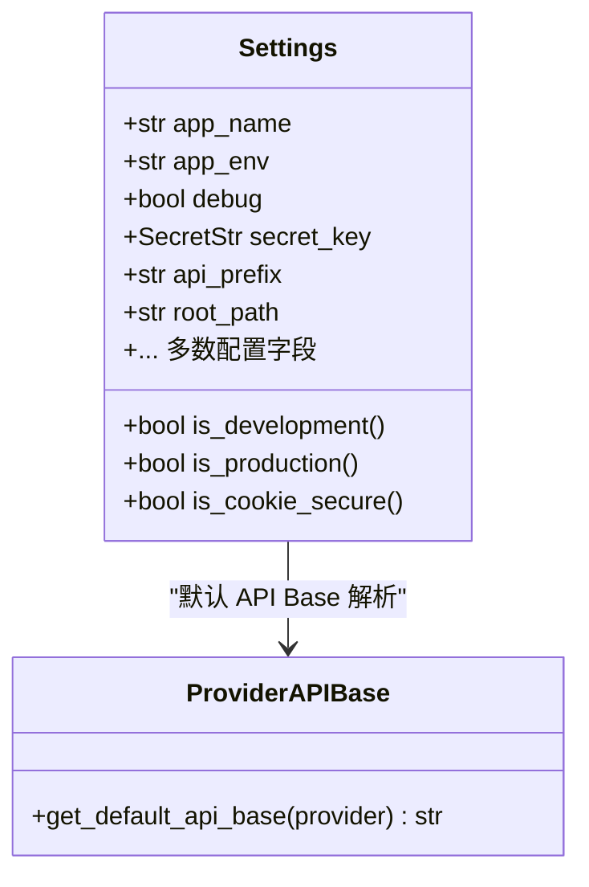
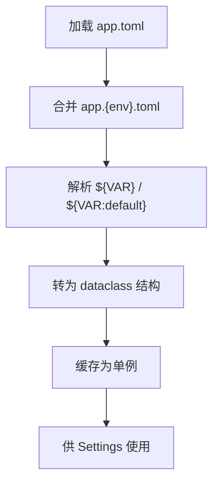
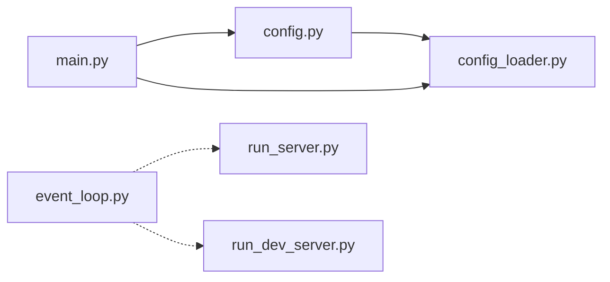

# 应用启动与配置

<cite>
**本文引用的文件**
- [main.py](file://backend/bootstrap/main.py)
- [config.py](file://backend/bootstrap/config.py)
- [config_loader.py](file://backend/bootstrap/config_loader.py)
- [event_loop.py](file://backend/bootstrap/event_loop.py)
- [run_server.py](file://backend/scripts/run_server.py)
- [run_dev_server.py](file://backend/scripts/run_dev_server.py)
- [app.toml](file://backend/config/app.toml)
- [app.development.toml](file://backend/config/app.development.toml)
- [app.production.toml](file://backend/config/app.production.toml)
- [app.staging.toml](file://backend/config/app.staging.toml)
- [execution.toml](file://backend/config/execution.toml)
- [mcp.toml](file://backend/config/mcp.toml)
- [tools.toml](file://backend/config/tools.toml)
- [backend.env.production](file://deploy/backend.env.production)
</cite>

## 目录
1. [引言](#引言)
2. [项目结构](#项目结构)
3. [核心组件](#核心组件)
4. [架构总览](#架构总览)
5. [详细组件分析](#详细组件分析)
6. [依赖分析](#依赖分析)
7. [性能考虑](#性能考虑)
8. [故障排查指南](#故障排查指南)
9. [结论](#结论)
10. [附录](#附录)

## 引言
本文件面向初学者与高级开发者，系统性阐述 AI Agent 后端应用的启动与配置体系，重点覆盖以下方面：
- FastAPI 应用的启动流程与生命周期管理
- 依赖注入容器与配置加载机制
- 配置系统设计（环境变量解析、配置验证与默认值处理）
- 动态配置加载（TOML + 环境变量插值、优先级与热重载）
- 事件循环管理与异步任务调度
- 启动序列图与配置解析流程图
- 常见配置错误与解决方案
- 性能优化建议与最佳实践

## 项目结构
后端启动与配置相关的核心位置如下：
- 启动入口与生命周期：backend/bootstrap/main.py
- 配置系统：backend/bootstrap/config.py
- 动态配置加载：backend/bootstrap/config_loader.py
- 事件循环工厂：backend/bootstrap/event_loop.py
- 启动脚本：backend/scripts/run_server.py、backend/scripts/run_dev_server.py
- 配置文件：backend/config/*.toml、deploy/backend.env.production



图表来源
- [main.py:182-190](file://backend/bootstrap/main.py#L182-L190)
- [config.py:449-457](file://backend/bootstrap/config.py#L449-L457)
- [config_loader.py:410-418](file://backend/bootstrap/config_loader.py#L410-L418)
- [event_loop.py:28-35](file://backend/bootstrap/event_loop.py#L28-L35)

章节来源
- [main.py:182-190](file://backend/bootstrap/main.py#L182-L190)
- [config.py:449-457](file://backend/bootstrap/config.py#L449-L457)
- [config_loader.py:410-418](file://backend/bootstrap/config_loader.py#L410-L418)
- [event_loop.py:28-35](file://backend/bootstrap/event_loop.py#L28-L35)

## 核心组件
本节概述四大核心组件及其职责：
- FastAPI 应用与生命周期：负责应用初始化、中间件注册、全局异常处理、路由挂载与生命周期钩子
- 配置系统（Settings）：基于 Pydantic Settings 的强类型配置，支持环境变量、.env 与 TOML 的优先级解析
- 动态配置加载（AppConfig）：以 dataclass 结构加载 TOML 配置，支持环境变量插值与深度合并
- 事件循环工厂：为 uvicorn 提供兼容 Windows 的 SelectorEventLoop 工厂

章节来源
- [main.py:108-180](file://backend/bootstrap/main.py#L108-L180)
- [config.py:34-457](file://backend/bootstrap/config.py#L34-L457)
- [config_loader.py:249-418](file://backend/bootstrap/config_loader.py#L249-L418)
- [event_loop.py:28-35](file://backend/bootstrap/event_loop.py#L28-L35)

## 架构总览
应用启动的关键交互如下：



图表来源
- [run_server.py:1-200](file://backend/scripts/run_server.py#L1-L200)
- [main.py:108-180](file://backend/bootstrap/main.py#L108-L180)
- [config.py:449-457](file://backend/bootstrap/config.py#L449-L457)
- [config_loader.py:410-418](file://backend/bootstrap/config_loader.py#L410-L418)

## 详细组件分析

### FastAPI 应用初始化与生命周期
- 应用创建：通过 FastAPI 构造函数设置标题、描述、版本、文档地址与生命周期回调
- 生命周期管理：lifespan 管理启动阶段的日志初始化、JWT 管理器、数据库与 Redis 初始化、Gateway 与 Agent 启动、后台任务初始化；以及关闭阶段的资源清理
- 中间件与异常处理：CORS、权限上下文、平台 API Key 使用记录等 ASGI 中间件；全局 RFC 7807 Problem Details 异常处理器
- 路由挂载：按域划分的路由集合，包括认证、会话、聊天、工具、记忆、系统、评估、执行、MCP、用量、视频任务、Listing Studio、平台管理与 AI Gateway 兼容入口



图表来源
- [main.py:108-180](file://backend/bootstrap/main.py#L108-L180)

章节来源
- [main.py:182-190](file://backend/bootstrap/main.py#L182-L190)
- [main.py:192-227](file://backend/bootstrap/main.py#L192-L227)
- [main.py:234-383](file://backend/bootstrap/main.py#L234-L383)
- [main.py:388-537](file://backend/bootstrap/main.py#L388-L537)

### 配置系统设计（Settings）
- 优先级：环境变量 > .env 文件 > config/app.toml > 代码默认值
- 环境变量解析：通过 Pydantic Settings 的 env_file 与 case_insensitive 行为，结合字段别名与校验器实现灵活映射
- 验证与默认值：字段级默认值、字段后处理（如 JWT 密钥回退）、运行时校验（如 SSO 模式下的内部密钥必填）
- 特性开关：开发/生产标志、Cookie 安全策略、日志级别与格式、监控与追踪开关
- LLM 与网关配置：多提供商凭据、默认 API Base 解析、网关目录同步策略、慢查询阈值、成本与展示货币等



图表来源
- [config.py:34-457](file://backend/bootstrap/config.py#L34-L457)

章节来源
- [config.py:34-457](file://backend/bootstrap/config.py#L34-L457)

### 动态配置加载（AppConfig）
- 结构化数据类：以 dataclass 表达基础设施、LLM 提供商、SimpleMem、Agent、检查点、Token 优化、日志与监控等配置
- TOML 加载：app.toml 为基础配置，app.{env}.toml 为环境特定覆盖；两者深度合并
- 环境变量插值：支持 ${VAR} 与 ${VAR:default} 语法，递归解析字符串、字典与列表
- 单例缓存：lru_cache 缓存加载结果，避免重复 IO



图表来源
- [config_loader.py:357-408](file://backend/bootstrap/config_loader.py#L357-L408)
- [config_loader.py:324-350](file://backend/bootstrap/config_loader.py#L324-L350)
- [config_loader.py:271-307](file://backend/bootstrap/config_loader.py#L271-L307)

章节来源
- [config_loader.py:249-418](file://backend/bootstrap/config_loader.py#L249-L418)
- [config_loader.py:357-408](file://backend/bootstrap/config_loader.py#L357-L408)
- [config_loader.py:324-350](file://backend/bootstrap/config_loader.py#L324-L350)
- [config_loader.py:271-307](file://backend/bootstrap/config_loader.py#L271-L307)

### 事件循环管理与异步任务调度
- Windows 兼容：uvicorn ≥ 0.40 绕过全局事件循环策略，需通过 loop 工厂显式注入 SelectorEventLoop
- 跨平台工厂：selector_event_loop_factory 返回 SelectorEventLoop，保证 psycopg 异步连接可用
- 启动脚本集成：run_server.py 与 run_dev_server.py 在 uvicorn.run 中传入 loop 参数

```mermaid
sequenceDiagram
participant Uvicorn as "Uvicorn"
participant Factory as "selector_event_loop_factory"
participant Loop as "SelectorEventLoop"
Uvicorn->>Factory : 获取事件循环工厂
Factory-->>Uvicorn : 返回 SelectorEventLoop 实例
Uvicorn->>Loop : 使用事件循环运行应用
```

图表来源
- [event_loop.py:28-35](file://backend/bootstrap/event_loop.py#L28-L35)
- [run_server.py:1-200](file://backend/scripts/run_server.py#L1-L200)
- [run_dev_server.py:1-200](file://backend/scripts/run_dev_server.py#L1-L200)

章节来源
- [event_loop.py:28-35](file://backend/bootstrap/event_loop.py#L28-L35)
- [run_server.py:1-200](file://backend/scripts/run_server.py#L1-L200)
- [run_dev_server.py:1-200](file://backend/scripts/run_dev_server.py#L1-L200)

## 依赖分析
- 组件耦合
  - main.py 依赖 settings（config.py）与 app_config（config_loader.py）
  - config.py 依赖 config_loader.py 的 app_config 作为部分字段的默认值来源
  - event_loop.py 与 run_server.py/run_dev_server.py 通过字符串导入路径耦合
- 外部依赖
  - FastAPI、uvicorn、pydantic-settings、tomllib、asyncio
- 潜在环依赖
  - config_loader.py 显式避免使用 utils/logging，防止循环依赖



图表来源
- [main.py:34-42](file://backend/bootstrap/main.py#L34-L42)
- [config.py:21-22](file://backend/bootstrap/config.py#L21-L22)
- [config_loader.py:410-418](file://backend/bootstrap/config_loader.py#L410-L418)
- [event_loop.py:31-35](file://backend/bootstrap/event_loop.py#L31-L35)

章节来源
- [main.py:34-42](file://backend/bootstrap/main.py#L34-L42)
- [config.py:21-22](file://backend/bootstrap/config.py#L21-L22)
- [config_loader.py:410-418](file://backend/bootstrap/config_loader.py#L410-L418)
- [event_loop.py:31-35](file://backend/bootstrap/event_loop.py#L31-L35)

## 性能考虑
- 配置缓存：Settings 与 AppConfig 均使用 lru_cache，避免重复解析与 IO
- 启动阶段延迟最小化：仅在必要时初始化 Redis；数据库与网关初始化采用异步并行策略
- 日志与监控：生产环境建议关闭调试文档与冗余日志，开启指标与可选追踪
- 事件循环：Windows 平台强制使用 SelectorEventLoop，避免阻塞与异常

## 故障排查指南
- 启动失败（Windows + psycopg）
  - 症状：ProactorEventLoop 导致 psycopg 异步连接报错
  - 解决：在 uvicorn.run 中显式传入 loop="bootstrap.event_loop:selector_event_loop_factory"
  - 参考：[event_loop.py:28-35](file://backend/bootstrap/event_loop.py#L28-L35)
- SSO 模式身份伪造风险
  - 症状：SSO 或 hybrid 模式缺少 giikin_internal_key
  - 解决：设置 giikin_internal_key，确保 fail-closed 安全策略
  - 参考：[config.py:257-266](file://backend/bootstrap/config.py#L257-L266)
- CORS 配置错误
  - 症状：跨域请求失败或 Cookie 无法携带
  - 解决：allow_credentials=True 时不允许 allow_origins=["*"]，需明确列出可信源
  - 参考：[main.py:195-206](file://backend/bootstrap/main.py#L195-L206)
- 配置未生效
  - 症状：环境变量未覆盖 TOML 配置
  - 解决：确认环境变量名大小写（Pydantic 不区分大小写）与插值语法 ${VAR} 或 ${VAR:default}
  - 参考：[config_loader.py:324-350](file://backend/bootstrap/config_loader.py#L324-L350)
- 配置文件路径错误
  - 症状：找不到 app.toml 或 app.{env}.toml
  - 解决：确保配置目录 backend/config 存在且文件命名正确
  - 参考：[config_loader.py:377-396](file://backend/bootstrap/config_loader.py#L377-L396)
- 生产环境安全
  - 症状：Cookie 非 HTTPS、调试文档暴露
  - 解决：设置 cookie_secure、关闭 debug、设置 APP_ENV=production
  - 参考：[config.py:442-447](file://backend/bootstrap/config.py#L442-L447)

章节来源
- [event_loop.py:28-35](file://backend/bootstrap/event_loop.py#L28-L35)
- [config.py:257-266](file://backend/bootstrap/config.py#L257-L266)
- [main.py:195-206](file://backend/bootstrap/main.py#L195-L206)
- [config_loader.py:324-350](file://backend/bootstrap/config_loader.py#L324-L350)
- [config_loader.py:377-396](file://backend/bootstrap/config_loader.py#L377-L396)
- [config.py:442-447](file://backend/bootstrap/config.py#L442-L447)

## 结论
本技术文档从启动流程、配置系统、动态加载与事件循环四个维度，全面梳理了 AI Agent 应用的启动与配置机制。通过明确的优先级与严格的验证，配合环境变量插值与单例缓存，系统在灵活性与安全性之间取得平衡。建议在生产环境中严格遵循安全配置与性能优化建议，确保稳定与可观测性。

## 附录
- 配置文件参考
  - 基础配置：[app.toml](file://backend/config/app.toml)
  - 开发环境：[app.development.toml](file://backend/config/app.development.toml)
  - 生产环境：[app.production.toml](file://backend/config/app.production.toml)
  - 预发布环境：[app.staging.toml](file://backend/config/app.staging.toml)
  - 执行配置：[execution.toml](file://backend/config/execution.toml)
  - MCP 配置：[mcp.toml](file://backend/config/mcp.toml)
  - 工具配置：[tools.toml](file://backend/config/tools.toml)
- 环境变量示例
  - 生产环境变量：[backend.env.production](file://deploy/backend.env.production)
- 启动脚本
  - 生产运行：[run_server.py](file://backend/scripts/run_server.py)
  - 开发运行：[run_dev_server.py](file://backend/scripts/run_dev_server.py)