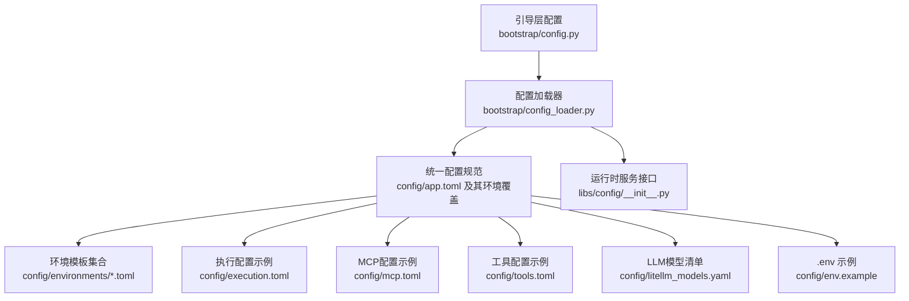
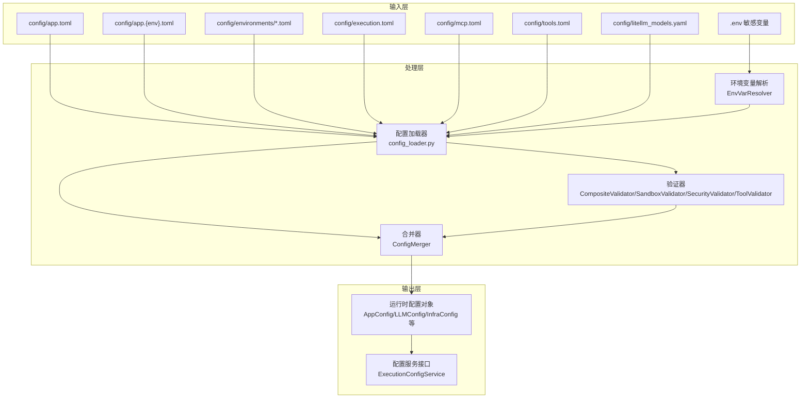
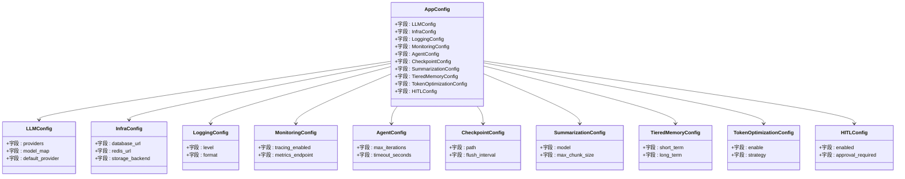
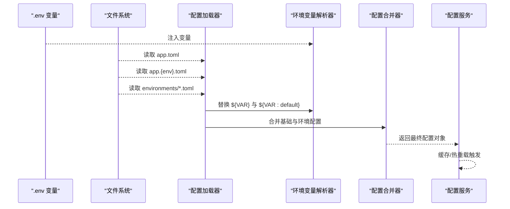
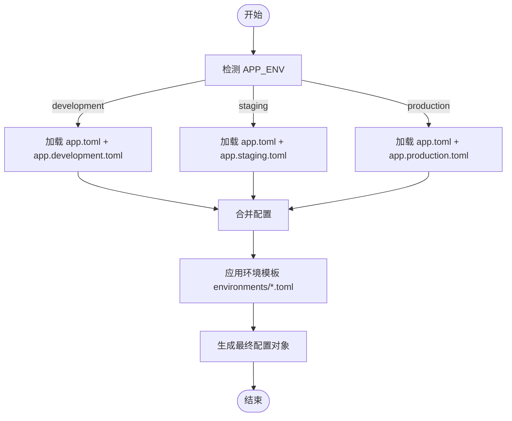
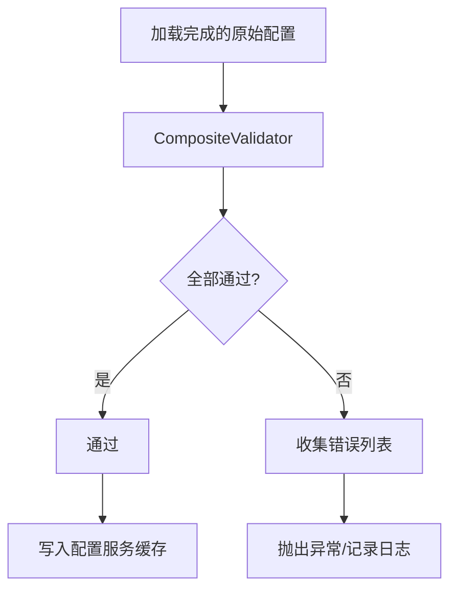
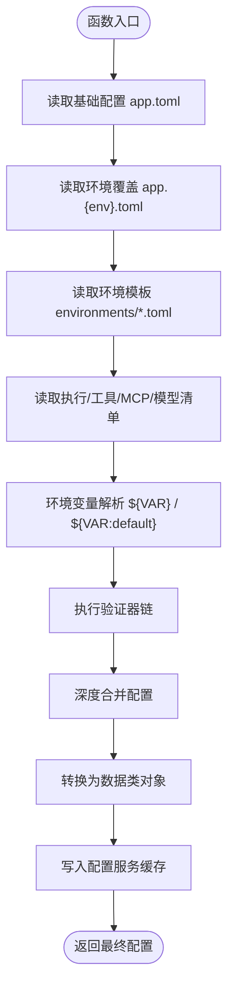
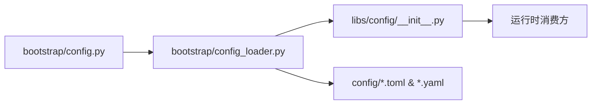

# 配置系统

<cite>
**本文引用的文件**
- [backend/bootstrap/config.py](file://backend/bootstrap/config.py)
- [backend/bootstrap/config_loader.py](file://backend/bootstrap/config_loader.py)
- [backend/docs/CONFIGURATION.md](file://backend/docs/CONFIGURATION.md)
- [backend/docs/archive/execution-config-architecture-refactor.md](file://backend/docs/archive/execution-config-architecture-refactor.md)
- [backend/libs/config/__init__.py](file://backend/libs/config/__init__.py)
- [backend/config/app.toml](file://backend/config/app.toml)
- [backend/config/app.development.toml](file://backend/config/app.development.toml)
- [backend/config/app.production.toml](file://backend/config/app.production.toml)
- [backend/config/app.staging.toml](file://backend/config/app.staging.toml)
- [backend/config/environments/local-dev.toml](file://backend/config/environments/local-dev.toml)
- [backend/config/environments/docker-dev.toml](file://backend/config/environments/docker-dev.toml)
- [backend/config/environments/docker-prod.toml](file://backend/config/environments/docker-prod.toml)
- [backend/config/environments/k8s-prod.toml](file://backend/config/environments/k8s-prod.toml)
- [backend/config/environments/minimal.toml](file://backend/config/environments/minimal.toml)
- [backend/config/environments/network-enabled.toml](file://backend/config/environments/network-enabled.toml)
- [backend/config/environments/network-restricted.toml](file://backend/config/environments/network-restricted.toml)
- [backend/config/environments/node-dev.toml](file://backend/config/environments/node-dev.toml)
- [backend/config/environments/python-dev.toml](file://backend/config/environments/python-dev.toml)
- [backend/config/execution.toml](file://backend/config/execution.toml)
- [backend/config/mcp.toml](file://backend/config/mcp.toml)
- [backend/config/tools.toml](file://backend/config/tools.toml)
- [backend/config/litellm_models.yaml](file://backend/config/litellm_models.yaml)
- [backend/config/env.example](file://backend/config/env.example)
- [backend/scripts/run_dev_server.py](file://backend/scripts/run_dev_server.py)
- [backend/scripts/run_server.py](file://backend/scripts/run_server.py)
</cite>

## 目录
1. [引言](#引言)
2. [项目结构](#项目结构)
3. [核心组件](#核心组件)
4. [架构总览](#架构总览)
5. [详细组件分析](#详细组件分析)
6. [依赖关系分析](#依赖关系分析)
7. [性能考量](#性能考量)
8. [故障排查指南](#故障排查指南)
9. [结论](#结论)
10. [附录](#附录)

## 引言
本文件为AI Agent配置系统的全面技术文档，聚焦于以下目标：
- 深入解释配置类设计与字段定义、类型验证与默认值设置
- 详述动态配置加载机制：环境变量优先级、配置文件合并与热重载能力
- 阐明多环境配置管理策略：development、staging、production等差异化配置
- 解释配置验证机制与错误处理流程
- 提供配置系统架构图与配置解析流程图
- 总结最佳实践、常见错误与解决方案
- 面向初学者讲解配置管理基本概念，同时为有经验开发者提供扩展与自定义指导

## 项目结构
配置系统由“引导层配置”“统一配置规范”“环境化配置集合”“运行时加载与服务”四部分组成：
- 引导层配置：在应用启动阶段负责解析基础配置并构建运行时对象
- 统一配置规范：以TOML/YAML为载体，集中管理LLM、基础设施、监控、代理等模块配置
- 环境化配置集合：按部署场景提供最小可用、本地开发、容器/云原生等模板
- 运行时加载与服务：提供加载、合并、验证、缓存与热重载能力

图表来源
- [backend/bootstrap/config.py](file://backend/bootstrap/config.py)
- [backend/bootstrap/config_loader.py](file://backend/bootstrap/config_loader.py)
- [backend/libs/config/__init__.py](file://backend/libs/config/__init__.py)
- [backend/config/app.toml](file://backend/config/app.toml)
- [backend/config/app.development.toml](file://backend/config/app.development.toml)
- [backend/config/app.production.toml](file://backend/config/app.production.toml)
- [backend/config/app.staging.toml](file://backend/config/app.staging.toml)
- [backend/config/environments/local-dev.toml](file://backend/config/environments/local-dev.toml)
- [backend/config/environments/docker-dev.toml](file://backend/config/environments/docker-dev.toml)
- [backend/config/environments/docker-prod.toml](file://backend/config/environments/docker-prod.toml)
- [backend/config/environments/k8s-prod.toml](file://backend/config/environments/k8s-prod.toml)
- [backend/config/environments/minimal.toml](file://backend/config/environments/minimal.toml)
- [backend/config/environments/network-enabled.toml](file://backend/config/environments/network-enabled.toml)
- [backend/config/environments/network-restricted.toml](file://backend/config/environments/network-restricted.toml)
- [backend/config/environments/node-dev.toml](file://backend/config/environments/node-dev.toml)
- [backend/config/environments/python-dev.toml](file://backend/config/environments/python-dev.toml)
- [backend/config/execution.toml](file://backend/config/execution.toml)
- [backend/config/mcp.toml](file://backend/config/mcp.toml)
- [backend/config/tools.toml](file://backend/config/tools.toml)
- [backend/config/litellm_models.yaml](file://backend/config/litellm_models.yaml)
- [backend/config/env.example](file://backend/config/env.example)

章节来源
- [backend/docs/CONFIGURATION.md:10-160](file://backend/docs/CONFIGURATION.md#L10-L160)

## 核心组件
- 配置类与数据结构：以dataclass或Pydantic BaseModel形式定义各子系统配置，包含字段类型、默认值与校验约束
- 配置加载器：负责解析TOML/YAML、注入环境变量、合并层级配置、生成最终配置对象
- 配置服务接口：暴露统一的获取与重置能力，支持缓存与热重载
- 环境模板：提供最小可用、本地开发、容器/云原生等场景的配置样例

章节来源
- [backend/bootstrap/config_loader.py:42-406](file://backend/bootstrap/config_loader.py#L42-L406)
- [backend/libs/config/__init__.py:14-55](file://backend/libs/config/__init__.py#L14-L55)
- [backend/docs/CONFIGURATION.md:100-160](file://backend/docs/CONFIGURATION.md#L100-L160)

## 架构总览
下图展示配置系统整体架构：从环境变量与基础配置文件出发，经由加载器与验证器，最终形成运行时配置对象，并被各子系统消费。

图表来源
- [backend/bootstrap/config_loader.py:42-406](file://backend/bootstrap/config_loader.py#L42-L406)
- [backend/libs/config/__init__.py:14-55](file://backend/libs/config/__init__.py#L14-L55)
- [backend/docs/CONFIGURATION.md:100-160](file://backend/docs/CONFIGURATION.md#L100-L160)

## 详细组件分析

### 配置类设计与字段定义
- 设计模式：采用结构化数据类（如AppConfig、LLMConfig、InfraConfig等）承载配置，确保字段类型明确、默认值清晰、可序列化
- 字段组织：按子系统划分（如LLM、基础设施、监控、代理、内存、日志等），便于维护与扩展
- 类型与默认值：通过类型注解与默认值保证配置对象的完整性；必要时提供显式校验逻辑
- 扩展点：新增配置项遵循现有命名与层级风格，避免破坏既有契约

图表来源
- [backend/bootstrap/config_loader.py:249-406](file://backend/bootstrap/config_loader.py#L249-L406)

章节来源
- [backend/bootstrap/config_loader.py:42-406](file://backend/bootstrap/config_loader.py#L42-L406)

### 动态配置加载机制
- 环境变量优先级：通过环境变量解析器将${VAR}与${VAR:default}语法注入到配置中，实现敏感信息与运行时参数的外部化
- 配置文件合并：按“基础配置 + 环境覆盖”的顺序进行深度合并，后加载项覆盖前加载项的同名键
- 热重载能力：通过配置服务接口提供重置与刷新能力，结合文件系统事件或定时轮询实现增量更新

图表来源
- [backend/bootstrap/config_loader.py:42-406](file://backend/bootstrap/config_loader.py#L42-L406)
- [backend/libs/config/__init__.py:42-46](file://backend/libs/config/__init__.py#L42-L46)

章节来源
- [backend/bootstrap/config_loader.py:42-406](file://backend/bootstrap/config_loader.py#L42-L406)
- [backend/libs/config/__init__.py:42-46](file://backend/libs/config/__init__.py#L42-L46)

### 多环境配置管理策略
- 环境识别：通过APP_ENV区分development、staging、production等环境
- 合并规则：基础配置（app.toml）与环境覆盖（app.{env}.toml）按顺序合并，后者覆盖前者
- 场景模板：提供local-dev、docker-dev、docker-prod、k8s-prod、minimal、network-enabled/restricted、node-dev、python-dev等模板，适配不同部署形态

图表来源
- [backend/docs/CONFIGURATION.md:134-160](file://backend/docs/CONFIGURATION.md#L134-L160)
- [backend/config/app.development.toml](file://backend/config/app.development.toml)
- [backend/config/app.production.toml](file://backend/config/app.production.toml)
- [backend/config/app.staging.toml](file://backend/config/app.staging.toml)
- [backend/config/environments/local-dev.toml](file://backend/config/environments/local-dev.toml)
- [backend/config/environments/docker-dev.toml](file://backend/config/environments/docker-dev.toml)
- [backend/config/environments/docker-prod.toml](file://backend/config/environments/docker-prod.toml)
- [backend/config/environments/k8s-prod.toml](file://backend/config/environments/k8s-prod.toml)
- [backend/config/environments/minimal.toml](file://backend/config/environments/minimal.toml)
- [backend/config/environments/network-enabled.toml](file://backend/config/environments/network-enabled.toml)
- [backend/config/environments/network-restricted.toml](file://backend/config/environments/network-restricted.toml)
- [backend/config/environments/node-dev.toml](file://backend/config/environments/node-dev.toml)
- [backend/config/environments/python-dev.toml](file://backend/config/environments/python-dev.toml)

章节来源
- [backend/docs/CONFIGURATION.md:134-160](file://backend/docs/CONFIGURATION.md#L134-L160)

### 配置验证机制与错误处理
- 验证器接口：提供CompositeValidator、SandboxValidator、SecurityValidator、ToolValidator等，分别负责沙箱安全、工具可用性、配置Schema一致性等
- 错误处理：验证失败返回结构化结果，记录失败原因与位置，便于定位问题
- 集成方式：在加载完成后统一执行验证，失败时中断启动或回退到安全配置

图表来源
- [backend/libs/config/__init__.py:48-55](file://backend/libs/config/__init__.py#L48-L55)

章节来源
- [backend/libs/config/__init__.py:48-55](file://backend/libs/config/__init__.py#L48-L55)

### 配置解析流程图（代码级）

图表来源
- [backend/bootstrap/config_loader.py:42-406](file://backend/bootstrap/config_loader.py#L42-L406)
- [backend/libs/config/__init__.py:42-46](file://backend/libs/config/__init__.py#L42-L46)

## 依赖关系分析
- 组件耦合：配置加载器依赖环境变量解析器与合并器；配置服务作为门面协调加载与缓存
- 外部依赖：TOML/YAML解析库、环境变量解析语法、文件系统访问
- 潜在循环：当前设计通过接口与服务门面避免直接循环依赖

图表来源
- [backend/bootstrap/config.py](file://backend/bootstrap/config.py)
- [backend/bootstrap/config_loader.py](file://backend/bootstrap/config_loader.py)
- [backend/libs/config/__init__.py](file://backend/libs/config/__init__.py)

章节来源
- [backend/bootstrap/config.py](file://backend/bootstrap/config.py)
- [backend/bootstrap/config_loader.py](file://backend/bootstrap/config_loader.py)
- [backend/libs/config/__init__.py](file://backend/libs/config/__init__.py)

## 性能考量
- 配置缓存：配置服务提供重置与获取，避免重复解析与验证
- 增量更新：热重载建议基于文件mtime或事件驱动，仅在变更时重建配置对象
- 解析优化：对大型YAML/TOML文件采用流式解析与延迟求值，减少内存峰值
- 并发安全：在多线程/多进程环境中确保配置读取的一致性与原子性

## 故障排查指南
- 症状：配置未生效或类型不匹配
  - 排查：确认字段类型与默认值是否正确；检查环境覆盖是否遗漏
  - 参考路径：[backend/bootstrap/config_loader.py:249-406](file://backend/bootstrap/config_loader.py#L249-L406)
- 症状：环境变量未替换
  - 排查：检查.env文件与变量名拼写；确认解析语法正确
  - 参考路径：[backend/config/env.example](file://backend/config/env.example)
- 症状：合并冲突或覆盖无效
  - 排查：核对加载顺序与键路径；确认环境覆盖文件存在且格式正确
  - 参考路径：[backend/docs/CONFIGURATION.md:144-151](file://backend/docs/CONFIGURATION.md#L144-L151)
- 症状：启动失败或验证报错
  - 排查：查看验证器返回的错误列表；逐项修复Schema或工具配置
  - 参考路径：[backend/libs/config/__init__.py:48-55](file://backend/libs/config/__init__.py#L48-L55)

章节来源
- [backend/bootstrap/config_loader.py:249-406](file://backend/bootstrap/config_loader.py#L249-L406)
- [backend/config/env.example](file://backend/config/env.example)
- [backend/docs/CONFIGURATION.md:144-151](file://backend/docs/CONFIGURATION.md#L144-L151)
- [backend/libs/config/__init__.py:48-55](file://backend/libs/config/__init__.py#L48-L55)

## 结论
该配置系统通过“结构化配置类 + 动态加载器 + 验证与合并 + 环境模板 + 服务化接口”的设计，实现了高可维护性与可扩展性的统一配置管理。建议在团队内推广统一的配置命名规范与环境模板复用策略，并结合CI/CD自动化校验与热重载能力，持续提升交付效率与稳定性。

## 附录

### 最佳实践
- 将敏感信息放入.env并通过${VAR}语法注入，避免硬编码
- 使用app.toml集中管理通用配置，仅在app.{env}.toml中覆盖差异
- 为每种部署形态准备对应环境模板，减少手工调整
- 对关键配置增加验证器，尽早发现配置错误
- 在启动脚本中集成配置校验与热重载监听

章节来源
- [backend/docs/CONFIGURATION.md:100-160](file://backend/docs/CONFIGURATION.md#L100-L160)
- [backend/scripts/run_dev_server.py](file://backend/scripts/run_dev_server.py)
- [backend/scripts/run_server.py](file://backend/scripts/run_server.py)

### 常见配置错误与解决方案
- 键名拼写错误：检查大小写与层级路径，确保与数据类字段一致
- 默认值缺失：为可选字段提供合理默认值，避免None导致的运行时异常
- 环境覆盖顺序不当：确认app.toml在前、app.{env}.toml在后
- 验证失败：根据验证器输出修正Schema或工具清单

章节来源
- [backend/bootstrap/config_loader.py:42-406](file://backend/bootstrap/config_loader.py#L42-L406)
- [backend/libs/config/__init__.py:48-55](file://backend/libs/config/__init__.py#L48-L55)