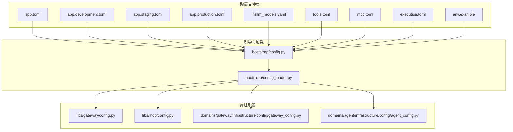
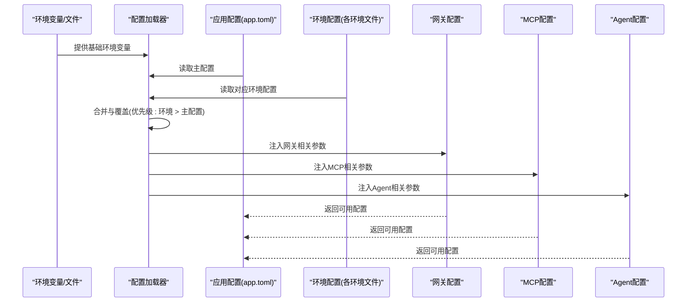
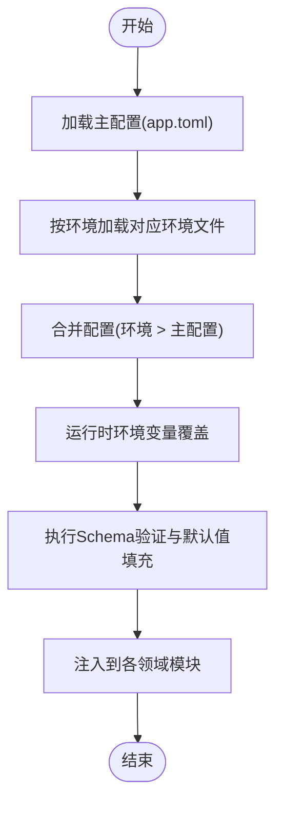
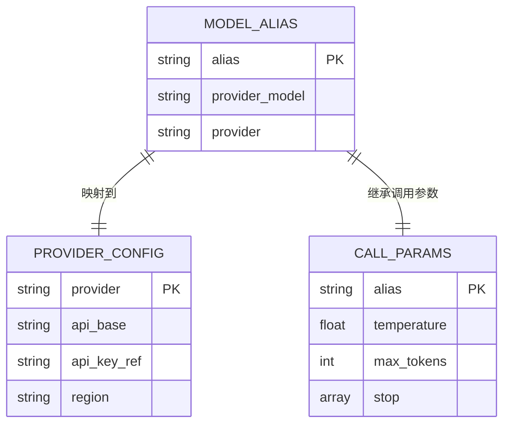
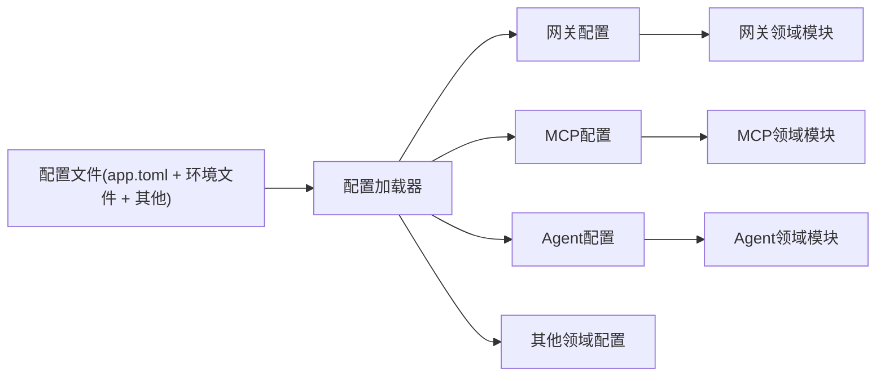

# 配置管理系统

<cite>
**本文引用的文件**
- [app.toml](file://backend/config/app.toml)
- [app.development.toml](file://backend/config/app.development.toml)
- [app.staging.toml](file://backend/config/app.staging.toml)
- [app.production.toml](file://backend/config/app.production.toml)
- [litellm_models.yaml](file://backend/config/litellm_models.yaml)
- [tools.toml](file://backend/config/tools.toml)
- [mcp.toml](file://backend/config/mcp.toml)
- [execution.toml](file://backend/config/execution.toml)
- [env.example](file://backend/config/env.example)
- [bootstrap/config.py](file://backend/bootstrap/config.py)
- [bootstrap/config_loader.py](file://backend/bootstrap/config_loader.py)
- [libs/config/__init__.py](file://backend/libs/config/__init__.py)
- [libs/gateway/config.py](file://backend/libs/gateway/config.py)
- [libs/mcp/config.py](file://backend/libs/mcp/config.py)
- [domains/gateway/infrastructure/config/gateway_config.py](file://backend/domains/gateway/infrastructure/config/gateway_config.py)
- [domains/agent/infrastructure/config/agent_config.py](file://backend/domains/agent/infrastructure/config/agent_config.py)
- [scripts/test_litellm_models.py](file://backend/scripts/test_litellm_models.py)
- [scripts/test_tool_registry.py](file://backend/scripts/test_tool_registry.py)
- [scripts/seed_gateway_models.py](file://backend/scripts/seed_gateway_models.py)
- [docs/CONFIGURATION.md](file://backend/docs/CONFIGURATION.md)
- [docs/gateway/GATEWAY_PRICING_AND_LITELLM_COST.md](file://backend/docs/gateway/GATEWAY_PRICING_AND_LITELLM_COST.md)
- [docs/mcp/MCP_QUICKSTART.md](file://backend/docs/mcp/MCP_QUICKSTART.md)
</cite>

## 目录
1. [简介](#简介)
2. [项目结构](#项目结构)
3. [核心组件](#核心组件)
4. [架构总览](#架构总览)
5. [详细组件分析](#详细组件分析)
6. [依赖关系分析](#依赖关系分析)
7. [性能考量](#性能考量)
8. [故障排除指南](#故障排除指南)
9. [结论](#结论)
10. [附录](#附录)

## 简介
本文件为AI Agent配置管理系统的技术文档，系统化阐述配置体系的多层次架构：环境配置、应用配置与运行时配置。重点覆盖以下方面：
- 环境配置：多环境（development、staging、production）的配置差异与优先级处理
- 应用配置：app.toml中的数据库、缓存、日志与安全参数
- LLM模型配置：litellm_models.yaml中的模型别名映射、提供商设置与调用参数
- 工具与MCP配置：tools.toml与mcp.toml的结构与用途
- 配置验证与默认值：Schema验证与默认值处理策略
- 配置热重载：实现方式与最佳实践
- 入门与进阶：从概念到实操的完整指南

## 项目结构
配置相关文件主要位于后端backend/config目录，并通过引导模块与各领域模块加载与使用。

**图表来源**
- [bootstrap/config.py](file://backend/bootstrap/config.py)
- [bootstrap/config_loader.py](file://backend/bootstrap/config_loader.py)
- [libs/gateway/config.py](file://backend/libs/gateway/config.py)
- [libs/mcp/config.py](file://backend/libs/mcp/config.py)
- [domains/gateway/infrastructure/config/gateway_config.py](file://backend/domains/gateway/infrastructure/config/gateway_config.py)
- [domains/agent/infrastructure/config/agent_config.py](file://backend/domains/agent/infrastructure/config/agent_config.py)

**章节来源**
- [bootstrap/config.py](file://backend/bootstrap/config.py)
- [bootstrap/config_loader.py](file://backend/bootstrap/config_loader.py)

## 核心组件
- 环境配置文件集：按环境拆分的配置文件，用于差异化部署与运行时注入
- 应用配置中心：app.toml作为主入口，结合环境文件进行合并与覆盖
- LLM模型配置：litellm_models.yaml集中管理模型别名、提供商与调用参数
- 工具与MCP配置：tools.toml定义工具注册与执行策略；mcp.toml定义MCP服务器与动态工具
- 引导与加载器：负责解析、合并、验证与注入配置
- 领域配置适配：网关、MCP、Agent等模块按需读取与使用配置

**章节来源**
- [app.toml](file://backend/config/app.toml)
- [litellm_models.yaml](file://backend/config/litellm_models.yaml)
- [tools.toml](file://backend/config/tools.toml)
- [mcp.toml](file://backend/config/mcp.toml)
- [execution.toml](file://backend/config/execution.toml)

## 架构总览
配置系统采用“环境文件 + 主配置 + 加载器”的分层架构，确保在不同环境中以最小差异实现一致的行为。

**图表来源**
- [bootstrap/config_loader.py](file://backend/bootstrap/config_loader.py)
- [libs/gateway/config.py](file://backend/libs/gateway/config.py)
- [libs/mcp/config.py](file://backend/libs/mcp/config.py)
- [domains/gateway/infrastructure/config/gateway_config.py](file://backend/domains/gateway/infrastructure/config/gateway_config.py)
- [domains/agent/infrastructure/config/agent_config.py](file://backend/domains/agent/infrastructure/config/agent_config.py)

## 详细组件分析

### 环境配置与优先级
- 多环境文件：development、staging、production分别提供差异化参数，如数据库连接、缓存超时、日志级别等
- 优先级策略：环境文件覆盖主配置；运行时环境变量可进一步覆盖文件配置
- 示例路径参考：
  - [app.development.toml](file://backend/config/app.development.toml)
  - [app.staging.toml](file://backend/config/app.staging.toml)
  - [app.production.toml](file://backend/config/app.production.toml)

**图表来源**
- [bootstrap/config_loader.py](file://backend/bootstrap/config_loader.py)
- [app.toml](file://backend/config/app.toml)

**章节来源**
- [app.development.toml](file://backend/config/app.development.toml)
- [app.staging.toml](file://backend/config/app.staging.toml)
- [app.production.toml](file://backend/config/app.production.toml)

### 应用配置(app.toml)结构
- 数据库连接：包含连接字符串、池大小、超时等参数
- 缓存设置：Redis或本地缓存的地址、过期时间、序列化方式
- 日志配置：输出级别、格式、文件轮转策略
- 安全参数：密钥存储、加密算法、访问控制开关
- 执行配置：执行模式、并发限制、超时策略
- 参考路径：
  - [app.toml](file://backend/config/app.toml)
  - [execution.toml](file://backend/config/execution.toml)

**章节来源**
- [app.toml](file://backend/config/app.toml)
- [execution.toml](file://backend/config/execution.toml)

### LLM模型配置(litellm_models.yaml)
- 模型别名映射：将内部模型名映射到提供商具体模型
- 提供商设置：API Base、认证信息、区域与版本
- 调用参数：温度、最大令牌数、频率惩罚、停用词等
- 成本与定价：按提供商与模型维度的成本计算
- 参考路径：
  - [litellm_models.yaml](file://backend/config/litellm_models.yaml)
  - [docs/gateway/GATEWAY_PRICING_AND_LITELLM_COST.md](file://backend/docs/gateway/GATEWAY_PRICING_AND_LITELLM_COST.md)
  - [scripts/test_litellm_models.py](file://backend/scripts/test_litellm_models.py)
  - [scripts/seed_gateway_models.py](file://backend/scripts/seed_gateway_models.py)

**图表来源**
- [litellm_models.yaml](file://backend/config/litellm_models.yaml)

**章节来源**
- [litellm_models.yaml](file://backend/config/litellm_models.yaml)
- [scripts/test_litellm_models.py](file://backend/scripts/test_litellm_models.py)
- [scripts/seed_gateway_models.py](file://backend/scripts/seed_gateway_models.py)

### 工具配置(tools.toml)
- 工具注册：工具名称、类型、入口函数、参数校验
- 执行策略：并发度、超时、重试与熔断
- 权限与沙箱：执行上下文、资源限制、隔离策略
- 参考路径：
  - [tools.toml](file://backend/config/tools.toml)
  - [scripts/test_tool_registry.py](file://backend/scripts/test_tool_registry.py)

**章节来源**
- [tools.toml](file://backend/config/tools.toml)
- [scripts/test_tool_registry.py](file://backend/scripts/test_tool_registry.py)

### MCP服务器配置(mcp.toml)
- 服务器定义：地址、协议、鉴权方式
- 动态工具与提示：动态注册工具、模板字段、运行时提示
- 连接状态与健康检查：心跳、重连策略、错误恢复
- 参考路径：
  - [mcp.toml](file://backend/config/mcp.toml)
  - [docs/mcp/MCP_QUICKSTART.md](file://backend/docs/mcp/MCP_QUICKSTART.md)

**章节来源**
- [mcp.toml](file://backend/config/mcp.toml)
- [docs/mcp/MCP_QUICKSTART.md](file://backend/docs/mcp/MCP_QUICKSTART.md)

### 配置验证与默认值
- Schema验证：对关键配置字段进行类型与范围校验
- 默认值处理：未显式配置时采用安全默认值
- 错误处理：验证失败时抛出明确异常并记录上下文
- 参考路径：
  - [bootstrap/config_loader.py](file://backend/bootstrap/config_loader.py)
  - [libs/config/__init__.py](file://backend/libs/config/__init__.py)

**章节来源**
- [bootstrap/config_loader.py](file://backend/bootstrap/config_loader.py)
- [libs/config/__init__.py](file://backend/libs/config/__init__.py)

### 配置热重载
- 文件监控：监听配置文件变更事件
- 增量更新：仅更新受影响的配置段，避免全量重启
- 平滑切换：在新旧配置之间进行渐进式替换，保证服务连续性
- 最佳实践：变更前备份、变更后自检、回滚预案
- 参考路径：
  - [bootstrap/config_loader.py](file://backend/bootstrap/config_loader.py)

**章节来源**
- [bootstrap/config_loader.py](file://backend/bootstrap/config_loader.py)

## 依赖关系分析
配置系统在引导阶段完成解析与注入，随后由各领域模块按需读取。

**图表来源**
- [bootstrap/config_loader.py](file://backend/bootstrap/config_loader.py)
- [libs/gateway/config.py](file://backend/libs/gateway/config.py)
- [libs/mcp/config.py](file://backend/libs/mcp/config.py)
- [domains/gateway/infrastructure/config/gateway_config.py](file://backend/domains/gateway/infrastructure/config/gateway_config.py)
- [domains/agent/infrastructure/config/agent_config.py](file://backend/domains/agent/infrastructure/config/agent_config.py)

**章节来源**
- [bootstrap/config_loader.py](file://backend/bootstrap/config_loader.py)

## 性能考量
- 配置解析缓存：对已解析的配置进行内存缓存，减少重复解析开销
- 分段加载：按需加载特定配置段，避免一次性加载全部配置
- 并发安全：在热重载场景下保证配置读写一致性
- 日志与可观测性：对配置加载过程进行结构化日志记录，便于问题定位

## 故障排除指南
- 验证失败：检查Schema字段是否正确、默认值是否合理
- 环境覆盖异常：确认环境文件优先级与运行时变量覆盖顺序
- LLM模型不可用：核对模型别名映射、提供商配置与API Key
- 工具执行失败：检查工具入口、参数校验与沙箱权限
- MCP连接问题：验证服务器地址、鉴权与动态工具注册状态
- 参考路径：
  - [docs/CONFIGURATION.md](file://backend/docs/CONFIGURATION.md)
  - [scripts/test_litellm_models.py](file://backend/scripts/test_litellm_models.py)
  - [scripts/test_tool_registry.py](file://backend/scripts/test_tool_registry.py)

**章节来源**
- [docs/CONFIGURATION.md](file://backend/docs/CONFIGURATION.md)
- [scripts/test_litellm_models.py](file://backend/scripts/test_litellm_models.py)
- [scripts/test_tool_registry.py](file://backend/scripts/test_tool_registry.py)

## 结论
本配置管理系统通过清晰的分层与严格的验证机制，在多环境下实现了高一致性与可维护性。建议在生产中结合热重载与可观测性，持续优化配置变更流程与回滚策略。

## 附录
- 环境变量示例：参考 [env.example](file://backend/config/env.example)
- 配置文档：参考 [docs/CONFIGURATION.md](file://backend/docs/CONFIGURATION.md)