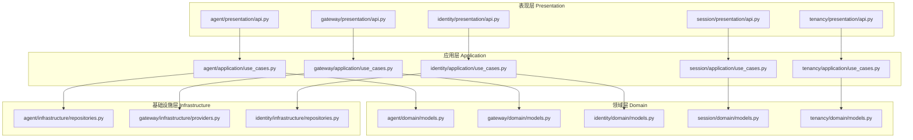
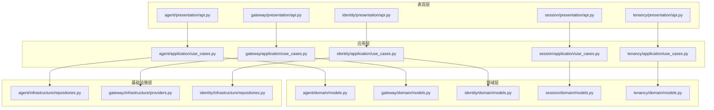
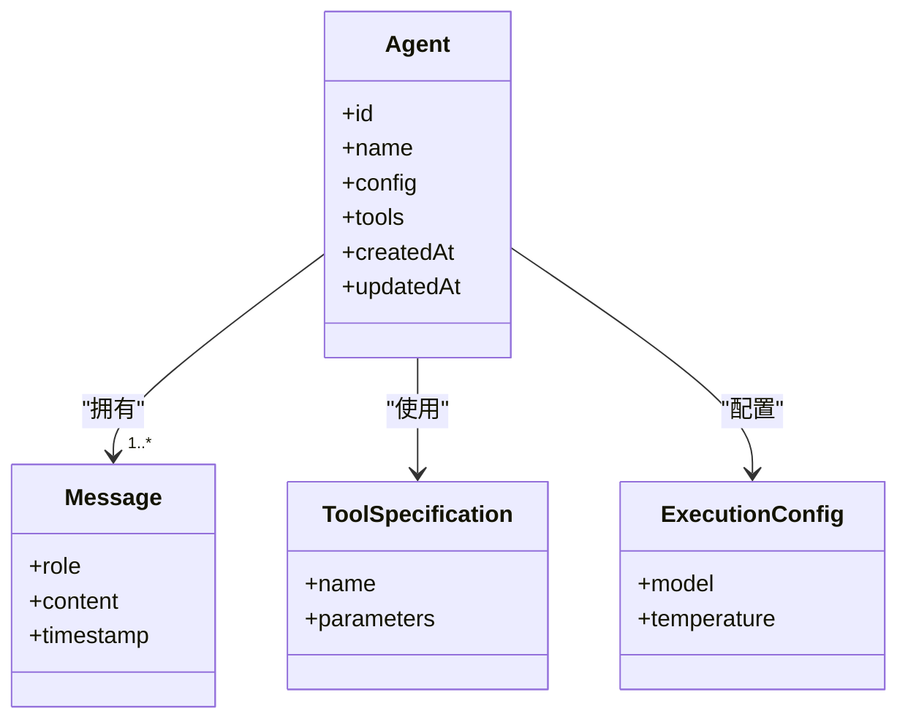
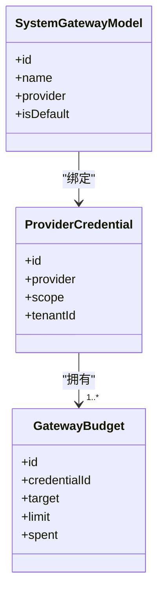
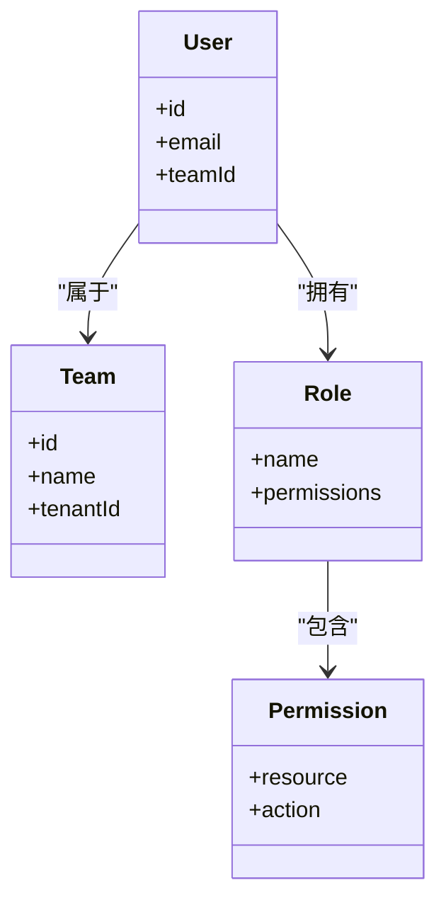
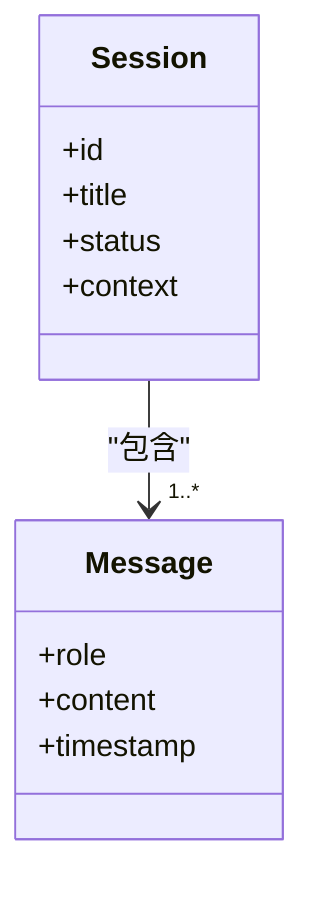
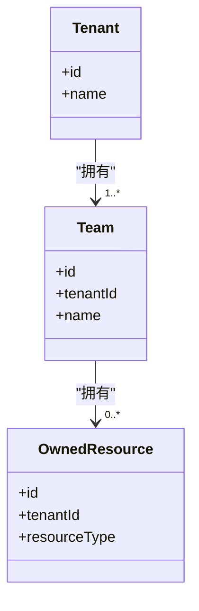
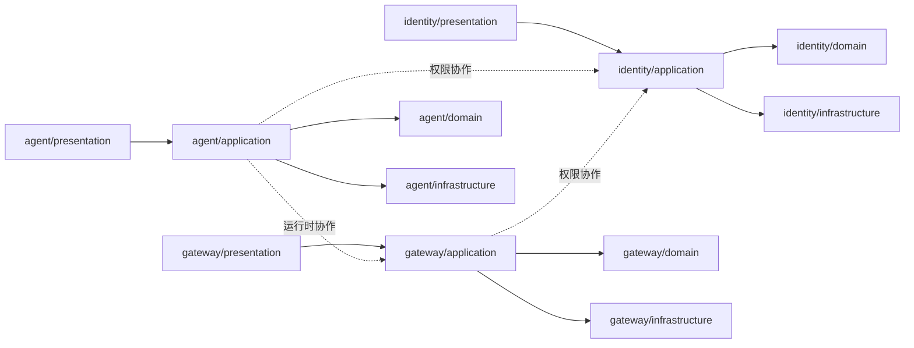

# 领域层设计

<cite>
**本文引用的文件**
- [README.md](file://README.md)
- [ARCHITECTURE.md](file://docs/ARCHITECTURE.md)
- [AI_GATEWAY_DOMAIN_ARCHITECTURE.md](file://docs/AI_GATEWAY_DOMAIN_ARCHITECTURE.md)
- [LANGGRAPH_ARCHITECTURE_RATIONALE.md](file://docs/LANGGRAPH_ARCHITECTURE_RATIONALE.md)
- [CONTEXT_MANAGEMENT_IMPLEMENTATION.md](file://docs/CONTEXT_MANAGEMENT_IMPLEMENTATION.md)
- [AUTHENTICATION.md](file://docs/AUTHENTICATION.md)
- [CODE_STANDARDS.md](file://docs/CODE_STANDARDS.md)
- [CONFIGURATION.md](file://docs/CONFIGURATION.md)
- [AGENT_ARCHITECTURE_DESIGN.md](file://docs/AGENT_ARCHITECTURE_DESIGN.md)
- [mcp.toml](file://backend/config/mcp.toml)
- [tools.toml](file://backend/config/tools.toml)
- [litellm_models.yaml](file://backend/config/litellm_models.yaml)
- [app.toml](file://backend/config/app.toml)
- [app.development.toml](file://backend/config/app.development.toml)
- [app.production.toml](file://backend/config/app.production.toml)
- [app.staging.toml](file://backend/config/app.staging.toml)
- [execution.toml](file://backend/config/execution.toml)
- [bootstrap/main.py](file://backend/bootstrap/main.py)
- [bootstrap/composition/identity_services.py](file://backend/bootstrap/composition/identity_services.py)
- [libs/llm/__init__.py](file://backend/libs/llm/__init__.py)
- [libs/gateway/__init__.py](file://backend/libs/gateway/__init__.py)
- [libs/iam/__init__.py](file://backend/libs/iam/__init__.py)
- [libs/middleware/__init__.py](file://backend/libs/middleware/__init__.py)
- [domains/agent/domain/models.py](file://backend/domains/agent/domain/models.py)
- [domains/agent/application/use_cases.py](file://backend/domains/agent/application/use_cases.py)
- [domains/agent/presentation/api.py](file://backend/domains/agent/presentation/api.py)
- [domains/agent/infrastructure/repositories.py](file://backend/domains/agent/infrastructure/repositories.py)
- [domains/gateway/domain/models.py](file://backend/domains/gateway/domain/models.py)
- [domains/gateway/application/use_cases.py](file://backend/domains/gateway/application/use_cases.py)
- [domains/gateway/presentation/api.py](file://backend/domains/gateway/presentation/api.py)
- [domains/gateway/infrastructure/providers.py](file://backend/domains/gateway/infrastructure/providers.py)
- [domains/identity/domain/models.py](file://backend/domains/identity/domain/models.py)
- [domains/identity/application/use_cases.py](file://backend/domains/identity/application/use_cases.py)
- [domains/identity/presentation/api.py](file://backend/domains/identity/presentation/api.py)
- [domains/identity/infrastructure/repositories.py](file://backend/domains/identity/infrastructure/repositories.py)
- [domains/session/domain/models.py](file://backend/domains/session/domain/models.py)
- [domains/session/application/use_cases.py](file://backend/domains/session/application/use_cases.py)
- [domains/session/presentation/api.py](file://backend/domains/session/presentation/api.py)
- [domains/tenancy/domain/models.py](file://backend/domains/tenancy/domain/models.py)
- [domains/tenancy/application/use_cases.py](file://backend/domains/tenancy/application/use_cases.py)
- [domains/tenancy/presentation/api.py](file://backend/domains/tenancy/presentation/api.py)
- [tests/architecture/test_agent_no_gateway_domain_import.py](file://backend/tests/architecture/test_agent_no_gateway_domain_import.py)
- [tests/architecture/test_gateway_no_agent_import.py](file://backend/tests/architecture/test_gateway_no_agent_import.py)
- [tests/architecture/test_domain_no_sqlalchemy.py](file://backend/tests/architecture/test_domain_no_sqlalchemy.py)
- [tests/architecture/test_presentation_no_infrastructure.py](file://backend/tests/architecture/test_presentation_no_infrastructure.py)
- [tests/unit/gateway/test_gateway_models.py](file://backend/tests/unit/gateway/test_gateway_models.py)
- [tests/unit/agent/test_agent_models.py](file://backend/tests/unit/agent/test_agent_models.py)
- [tests/unit/identity/test_identity_models.py](file://backend/tests/unit/identity/test_identity_models.py)
- [tests/unit/tenancy/test_tenancy_models.py](file://backend/tests/unit/tenancy/test_tenancy_models.py)
</cite>

## 目录
1. [引言](#引言)
2. [项目结构](#项目结构)
3. [核心组件](#核心组件)
4. [架构总览](#架构总览)
5. [详细组件分析](#详细组件分析)
6. [依赖分析](#依赖分析)
7. [性能考虑](#性能考虑)
8. [故障排除指南](#故障排除指南)
9. [结论](#结论)
10. [附录](#附录)

## 引言
本文件面向AI Agent领域的“领域层”设计，基于DDD四层架构（表现层、应用层、领域层、基础设施层）对后端代码进行系统化梳理与说明。重点覆盖以下业务域的设计理念与实现方式：
- agent域：代理实体与会话管理
- gateway域：LLM网关服务与模型管理
- identity域：用户认证与权限管理
- session域：会话状态与标题管理
- tenancy域：多租户架构与团队管理

同时，文档阐述领域模型设计原则（实体完整性、值对象不可变性、聚合根边界）、领域事件触发与处理机制、跨域协作模式，并总结最佳实践与常见反模式。

## 项目结构
后端采用按“域”划分的模块化组织方式，每个域包含四层：
- presentation：API路由与HTTP接口
- application：业务用例编排与流程控制
- domain：实体、值对象、聚合根与领域逻辑
- infrastructure：外部集成抽象与数据访问

图表来源
- [domains/agent/presentation/api.py](file://backend/domains/agent/presentation/api.py)
- [domains/gateway/presentation/api.py](file://backend/domains/gateway/presentation/api.py)
- [domains/identity/presentation/api.py](file://backend/domains/identity/presentation/api.py)
- [domains/session/presentation/api.py](file://backend/domains/session/presentation/api.py)
- [domains/tenancy/presentation/api.py](file://backend/domains/tenancy/presentation/api.py)
- [domains/agent/application/use_cases.py](file://backend/domains/agent/application/use_cases.py)
- [domains/gateway/application/use_cases.py](file://backend/domains/gateway/application/use_cases.py)
- [domains/identity/application/use_cases.py](file://backend/domains/identity/application/use_cases.py)
- [domains/session/application/use_cases.py](file://backend/domains/session/application/use_cases.py)
- [domains/tenancy/application/use_cases.py](file://backend/domains/tenancy/application/use_cases.py)
- [domains/agent/domain/models.py](file://backend/domains/agent/domain/models.py)
- [domains/gateway/domain/models.py](file://backend/domains/gateway/domain/models.py)
- [domains/identity/domain/models.py](file://backend/domains/identity/domain/models.py)
- [domains/session/domain/models.py](file://backend/domains/session/domain/models.py)
- [domains/tenancy/domain/models.py](file://backend/domains/tenancy/domain/models.py)
- [domains/agent/infrastructure/repositories.py](file://backend/domains/agent/infrastructure/repositories.py)
- [domains/gateway/infrastructure/providers.py](file://backend/domains/gateway/infrastructure/providers.py)
- [domains/identity/infrastructure/repositories.py](file://backend/domains/identity/infrastructure/repositories.py)

章节来源
- [README.md](file://README.md)
- [ARCHITECTURE.md](file://docs/ARCHITECTURE.md)

## 核心组件
本节从四层视角概述各域的关键构件与职责边界。

- 表现层（Presentation）
  - 负责HTTP路由、请求参数解析、响应封装与错误映射
  - 各域API以独立模块暴露REST接口，遵循统一的鉴权与中间件策略

- 应用层（Application）
  - 编排业务用例，协调领域模型与基础设施
  - 处理跨聚合的业务流程，确保事务一致性与幂等性

- 领域层（Domain）
  - 定义实体、值对象与聚合根，表达核心业务规则
  - 通过不变量与领域方法保证业务语义正确性

- 基础设施层（Infrastructure）
  - 抽象外部系统（数据库、第三方LLM、缓存、消息队列等）
  - 提供仓储、适配器与工具类，屏蔽技术细节

章节来源
- [CODE_STANDARDS.md](file://docs/CODE_STANDARDS.md)
- [bootstrap/main.py](file://backend/bootstrap/main.py)
- [bootstrap/composition/identity_services.py](file://backend/bootstrap/composition/identity_services.py)

## 架构总览
下图展示四层架构在各域中的落地关系与交互路径：

图表来源
- [domains/agent/presentation/api.py](file://backend/domains/agent/presentation/api.py)
- [domains/gateway/presentation/api.py](file://backend/domains/gateway/presentation/api.py)
- [domains/identity/presentation/api.py](file://backend/domains/identity/presentation/api.py)
- [domains/session/presentation/api.py](file://backend/domains/session/presentation/api.py)
- [domains/tenancy/presentation/api.py](file://backend/domains/tenancy/presentation/api.py)
- [domains/agent/application/use_cases.py](file://backend/domains/agent/application/use_cases.py)
- [domains/gateway/application/use_cases.py](file://backend/domains/gateway/application/use_cases.py)
- [domains/identity/application/use_cases.py](file://backend/domains/identity/application/use_cases.py)
- [domains/session/application/use_cases.py](file://backend/domains/session/application/use_cases.py)
- [domains/tenancy/application/use_cases.py](file://backend/domains/tenancy/application/use_cases.py)
- [domains/agent/domain/models.py](file://backend/domains/agent/domain/models.py)
- [domains/gateway/domain/models.py](file://backend/domains/gateway/domain/models.py)
- [domains/identity/domain/models.py](file://backend/domains/identity/domain/models.py)
- [domains/session/domain/models.py](file://backend/domains/session/domain/models.py)
- [domains/tenancy/domain/models.py](file://backend/domains/tenancy/domain/models.py)
- [domains/agent/infrastructure/repositories.py](file://backend/domains/agent/infrastructure/repositories.py)
- [domains/gateway/infrastructure/providers.py](file://backend/domains/gateway/infrastructure/providers.py)
- [domains/identity/infrastructure/repositories.py](file://backend/domains/identity/infrastructure/repositories.py)

## 详细组件分析

### agent域：代理实体与会话管理
- 领域模型
  - 聚合根：Agent（包含配置、工具、执行上下文）
  - 值对象：ToolSpecification、ExecutionConfig、Message
  - 不变量：代理标识唯一、工具集合非空、执行配置合法
- 应用用例
  - 创建/更新代理、启动会话、执行计划、保存/恢复检查点
- 基础设施
  - 仓储接口与实现，支持持久化代理与会话元数据
- 表现层
  - 提供代理CRUD、会话聊天、计划执行等API

图表来源
- [domains/agent/domain/models.py](file://backend/domains/agent/domain/models.py)

章节来源
- [domains/agent/domain/models.py](file://backend/domains/agent/domain/models.py)
- [domains/agent/application/use_cases.py](file://backend/domains/agent/application/use_cases.py)
- [domains/agent/presentation/api.py](file://backend/domains/agent/presentation/api.py)
- [domains/agent/infrastructure/repositories.py](file://backend/domains/agent/infrastructure/repositories.py)
- [AGENT_ARCHITECTURE_DESIGN.md](file://docs/AGENT_ARCHITECTURE_DESIGN.md)

### gateway域：LLM网关服务与模型管理
- 领域模型
  - ProviderCredential（凭证与作用域）、SystemGatewayModel（系统模型）、GatewayBudget（预算与配额）
  - 关键不变量：凭证作用域与租户一致性、模型唯一性、预算限额校验
- 应用用例
  - 凭证探测与连通性测试、模型注册与定价、请求路由与计费、预算与配额控制
- 基础设施
  - 供应商适配器（OpenAI、Claude、DashScope等），日志与指标采集
- 表现层
  - 凭证管理、模型列表、预算查询、请求日志查询等API

图表来源
- [domains/gateway/domain/models.py](file://backend/domains/gateway/domain/models.py)

章节来源
- [domains/gateway/domain/models.py](file://backend/domains/gateway/domain/models.py)
- [domains/gateway/application/use_cases.py](file://backend/domains/gateway/application/use_cases.py)
- [domains/gateway/presentation/api.py](file://backend/domains/gateway/presentation/api.py)
- [domains/gateway/infrastructure/providers.py](file://backend/domains/gateway/infrastructure/providers.py)
- [AI_GATEWAY_DOMAIN_ARCHITECTURE.md](file://docs/AI_GATEWAY_DOMAIN_ARCHITECTURE.md)

### identity域：用户认证与权限管理
- 领域模型
  - User、Team、Role、Permission；通过Team实现多租户隔离
- 应用用例
  - 用户登录/登出、团队切换、权限校验、API密钥管理
- 基础设施
  - 用户仓储、权限仓储、SSO桥接与审计日志
- 表现层
  - 登录、用户信息、团队列表、权限变更等API

图表来源
- [domains/identity/domain/models.py](file://backend/domains/identity/domain/models.py)

章节来源
- [domains/identity/domain/models.py](file://backend/domains/identity/domain/models.py)
- [domains/identity/application/use_cases.py](file://backend/domains/identity/application/use_cases.py)
- [domains/identity/presentation/api.py](file://backend/domains/identity/presentation/api.py)
- [domains/identity/infrastructure/repositories.py](file://backend/domains/identity/infrastructure/repositories.py)
- [AUTHENTICATION.md](file://docs/AUTHENTICATION.md)

### session域：会话状态与标题管理
- 领域模型
  - Session（状态、标题、上下文）、Message（角色、内容、时间戳）
- 应用用例
  - 会话创建/更新、标题归档、上下文截断与压缩
- 基础设施
  - 会话仓储、消息存储、检查点缓存
- 表现层
  - 会话列表、消息历史、标题更新等API

图表来源
- [domains/session/domain/models.py](file://backend/domains/session/domain/models.py)

章节来源
- [domains/session/domain/models.py](file://backend/domains/session/domain/models.py)
- [domains/session/application/use_cases.py](file://backend/domains/session/application/use_cases.py)
- [domains/session/presentation/api.py](file://backend/domains/session/presentation/api.py)

### tenancy域：多租户架构与团队管理
- 领域模型
  - Tenant、Team、OwnedResource；通过租户隔离数据与预算
- 应用用例
  - 租户初始化、团队创建与成员管理、资源归属与可见性控制
- 基础设施
  - 多租户中间件、数据作用域过滤、预算同步
- 表现层
  - 租户设置、团队管理、资源查询等API

图表来源
- [domains/tenancy/domain/models.py](file://backend/domains/tenancy/domain/models.py)

章节来源
- [domains/tenancy/domain/models.py](file://backend/domains/tenancy/domain/models.py)
- [domains/tenancy/application/use_cases.py](file://backend/domains/tenancy/application/use_cases.py)
- [domains/tenancy/presentation/api.py](file://backend/domains/tenancy/presentation/api.py)

## 依赖分析
- 层内依赖
  - presentation仅依赖application，不直接依赖infrastructure
  - application依赖domain不变量与业务规则，必要时调用infrastructure
  - domain不依赖其他层，保持纯业务语义
  - infrastructure抽象外部系统，被application调用
- 域间依赖
  - agent与gateway存在运行时协作（代理执行经由网关路由），但编译期无直接导入
  - gateway与identity协作（凭证与权限），agent与identity协作（用户与团队）

图表来源
- [tests/architecture/test_agent_no_gateway_domain_import.py](file://backend/tests/architecture/test_agent_no_gateway_domain_import.py)
- [tests/architecture/test_gateway_no_agent_import.py](file://backend/tests/architecture/test_gateway_no_agent_import.py)
- [tests/architecture/test_domain_no_sqlalchemy.py](file://backend/tests/architecture/test_domain_no_sqlalchemy.py)
- [tests/architecture/test_presentation_no_infrastructure.py](file://backend/tests/architecture/test_presentation_no_infrastructure.py)

章节来源
- [tests/architecture/test_agent_no_gateway_domain_import.py](file://backend/tests/architecture/test_agent_no_gateway_domain_import.py)
- [tests/architecture/test_gateway_no_agent_import.py](file://backend/tests/architecture/test_gateway_no_agent_import.py)
- [tests/architecture/test_domain_no_sqlalchemy.py](file://backend/tests/architecture/test_domain_no_sqlalchemy.py)
- [tests/architecture/test_presentation_no_infrastructure.py](file://backend/tests/architecture/test_presentation_no_infrastructure.py)

## 性能考虑
- 查询优化
  - 使用索引与分页，避免N+1查询
  - 对高频字段建立复合索引（如租户+创建时间、凭证+模型）
- 缓存策略
  - 将只读模型与常用配置放入缓存，降低数据库压力
- 并发与事务
  - 用例中合理拆分长事务，避免锁竞争
- 日志与可观测性
  - 统一日志格式与追踪ID，便于定位热点与瓶颈

## 故障排除指南
- 常见问题
  - 凭证无效或过期：检查ProviderCredential有效期与作用域
  - 模型不可用：确认SystemGatewayModel是否启用且GatewayBudget未超支
  - 会话异常：核对Session状态机与Message序列完整性
  - 权限不足：检查User的Team与Role权限矩阵
- 排查步骤
  - 查看请求日志与响应码
  - 校验租户作用域与数据隔离
  - 复现最小用例并逐步缩小范围
- 单元测试与集成测试
  - 使用领域模型测试验证不变量
  - 使用集成测试验证跨域协作流程

章节来源
- [tests/unit/gateway/test_gateway_models.py](file://backend/tests/unit/gateway/test_gateway_models.py)
- [tests/unit/agent/test_agent_models.py](file://backend/tests/unit/agent/test_agent_models.py)
- [tests/unit/identity/test_identity_models.py](file://backend/tests/unit/identity/test_identity_models.py)
- [tests/unit/tenancy/test_tenancy_models.py](file://backend/tests/unit/tenancy/test_tenancy_models.py)

## 结论
该系统以DDD四层架构为核心，围绕agent、gateway、identity、session、tenancy五大域构建了清晰的职责边界与协作关系。通过严格的领域建模与用例编排，实现了从API到基础设施的解耦与可演进性。建议持续强化领域事件与CQRS模式，进一步提升跨域一致性与扩展能力。

## 附录
- 配置参考
  - 应用配置：[app.toml](file://backend/config/app.toml)、[app.development.toml](file://backend/config/app.development.toml)、[app.production.toml](file://backend/config/app.production.toml)、[app.staging.toml](file://backend/config/app.staging.toml)
  - 执行配置：[execution.toml](file://backend/config/execution.toml)
  - 工具与MCP配置：[tools.toml](file://backend/config/tools.toml)、[mcp.toml](file://backend/config/mcp.toml)
  - LiteLLM模型清单：[litellm_models.yaml](file://backend/config/litellm_models.yaml)
- 启动与组合
  - 应用入口：[bootstrap/main.py](file://backend/bootstrap/main.py)
  - 身份服务组合：[bootstrap/composition/identity_services.py](file://backend/bootstrap/composition/identity_services.py)
- 核心库
  - LLM与网关适配：[libs/llm/__init__.py](file://backend/libs/llm/__init__.py)、[libs/gateway/__init__.py](file://backend/libs/gateway/__init__.py)
  - IAM与中间件：[libs/iam/__init__.py](file://backend/libs/iam/__init__.py)、[libs/middleware/__init__.py](file://backend/libs/middleware/__init__.py)