# API安全

<cite>
**本文引用的文件**
- [main.py](file://backend/bootstrap/main.py)
- [platform_api_key_usage_middleware.py](file://backend/domains/gateway/presentation/platform_api_key_usage_middleware.py)
- [test_platform_api_key_usage_middleware.py](file://backend/tests/unit/gateway/test_platform_api_key_usage_middleware.py)
- [openai_compat_router.py](file://backend/domains/gateway/presentation/openai_compat_router.py)
- [20260127_180000_add_api_keys.up.sql](file://backend/alembic/sql/20260127_180000_add_api_keys.up.sql)
- [usage_log_reads.py](file://backend/domains/gateway/application/management/usage_log_reads.py)
- [test_gateway_proxy_auth_headers.py](file://backend/tests/unit/gateway/test_gateway_proxy_auth_headers.py)
- [playground-request.ts](file://frontend/src/features/gateway-playground/playground-request.ts)
- [mask-display.test.ts](file://frontend/src/features/gateway-credentials/mask-display.test.ts)
- [security_validator.py](file://backend/libs/config/validators/security_validator.py)
- [rate_limit.py](file://backend/libs/middleware/rate_limit.py)
- [proxy_rate_limit_headers.py](file://backend/domains/gateway/application/proxy_rate_limit_headers.py)
- [redis_rate_limit_usage_reader.py](file://backend/domains/gateway/infrastructure/redis_rate_limit_usage_reader.py)
- [logging.py](file://backend/libs/middleware/logging.py)
- [observability.py](file://backend/libs/middleware/observability.py)
- [trace_id.py](file://backend/libs/middleware/trace_id.py)
- [auth_middleware.py](file://backend/domains/agent/infrastructure/mcp_server/auth_middleware.py)
- [jwt.py](file://backend/domains/identity/infrastructure/auth/jwt.py)
- [rbac_adapter.py](file://backend/domains/identity/infrastructure/auth/rbac_adapter.py)
- [authz_http.py](file://backend/libs/iam/authz_http.py)
- [problem_response_from_request_validation](file://backend/bootstrap/main.py)
- [problem_response_from_http_mappable](file://backend/bootstrap/main.py)
- [problem_response_from_agent_error](file://backend/bootstrap/main.py)
</cite>

## 目录
1. [引言](#引言)
2. [项目结构](#项目结构)
3. [核心组件](#核心组件)
4. [架构总览](#架构总览)
5. [详细组件分析](#详细组件分析)
6. [依赖关系分析](#依赖关系分析)
7. [性能考量](#性能考量)
8. [故障排查指南](#故障排查指南)
9. [结论](#结论)
10. [附录](#附录)

## 引言
本文件面向API开发者与安全工程师，系统化梳理AI Agent项目的API安全设计与实现，覆盖请求验证、参数过滤、输入清理、访问控制（IP白名单、速率限制）、签名与完整性保护、错误处理与敏感信息脱敏、安全中间件、API版本控制与兼容性、监控与异常检测、安全配置最佳实践以及安全审计与日志记录等主题。内容基于仓库中实际代码与迁移脚本进行归纳总结，并通过图示与来源标注帮助读者快速定位实现位置。

## 项目结构
后端采用FastAPI应用，通过引导程序集中注册路由、中间件与全局异常处理器；网关域提供OpenAI兼容接口与平台密钥使用统计；前端对敏感头部进行显示脱敏；安全中间件与速率限制在通用库中实现；数据库迁移脚本定义了API密钥使用日志表结构。

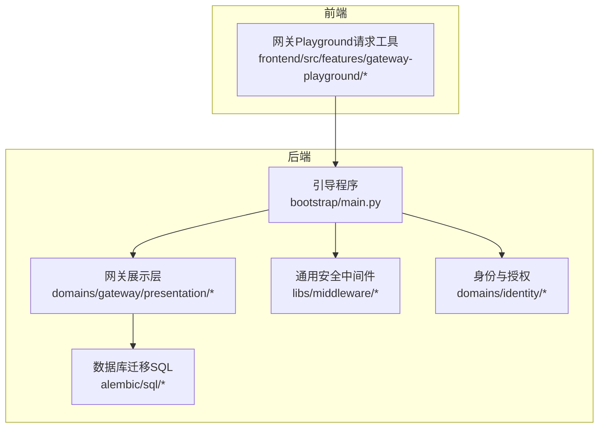

**图表来源**
- [main.py:227-515](file://backend/bootstrap/main.py#L227-L515)
- [platform_api_key_usage_middleware.py:49-100](file://backend/domains/gateway/presentation/platform_api_key_usage_middleware.py#L49-L100)
- [rate_limit.py](file://backend/libs/middleware/rate_limit.py)
- [openai_compat_router.py:293-320](file://backend/domains/gateway/presentation/openai_compat_router.py#L293-L320)
- [20260127_180000_add_api_keys.up.sql:51-67](file://backend/alembic/sql/20260127_180000_add_api_keys.up.sql#L51-L67)

**章节来源**
- [main.py:227-515](file://backend/bootstrap/main.py#L227-L515)

## 核心组件
- 安全中间件与异常处理：在引导程序中注册平台密钥使用中间件与全局异常处理器，统一输出RFC 7807问题详情响应。
- 请求验证与参数过滤：通过FastAPI校验器与自定义安全校验器保障输入合法性。
- 访问控制与速率限制：通用速率限制中间件与网关域的速率限制头生成逻辑配合Redis使用读取器实现限流。
- 签名与完整性：前端对Authorization与x-api-key进行显示脱敏；后端在网关代理认证中解析Bearer与x-api-key。
- 错误处理与脱敏：统一异常映射到标准Problem Details；前端对敏感头部与密钥列表进行脱敏显示。
- 版本控制与兼容：以OpenAI兼容路由为代表的v1前缀版本化接口。
- 监控与审计：平台密钥使用中间件记录endpoint、method、ip、UA、状态码、响应时间等；数据库迁移脚本定义使用日志表结构。

**章节来源**
- [main.py:227-267](file://backend/bootstrap/main.py#L227-L267)
- [platform_api_key_usage_middleware.py:49-100](file://backend/domains/gateway/presentation/platform_api_key_usage_middleware.py#L49-L100)
- [rate_limit.py](file://backend/libs/middleware/rate_limit.py)
- [proxy_rate_limit_headers.py](file://backend/domains/gateway/application/proxy_rate_limit_headers.py)
- [redis_rate_limit_usage_reader.py](file://backend/domains/gateway/infrastructure/redis_rate_limit_usage_reader.py)
- [playground-request.ts:136-151](file://frontend/src/features/gateway-playground/playground-request.ts#L136-L151)
- [mask-display.test.ts:1-21](file://frontend/src/features/gateway-credentials/mask-display.test.ts#L1-L21)
- [openai_compat_router.py:293-320](file://backend/domains/gateway/presentation/openai_compat_router.py#L293-L320)
- [20260127_180000_add_api_keys.up.sql:51-67](file://backend/alembic/sql/20260127_180000_add_api_keys.up.sql#L51-L67)

## 架构总览
下图展示了API安全的关键交互路径：客户端请求进入FastAPI应用，经由安全中间件与异常处理器，再进入网关展示层路由，最终落库或返回响应。平台密钥使用中间件在响应阶段记录使用日志。

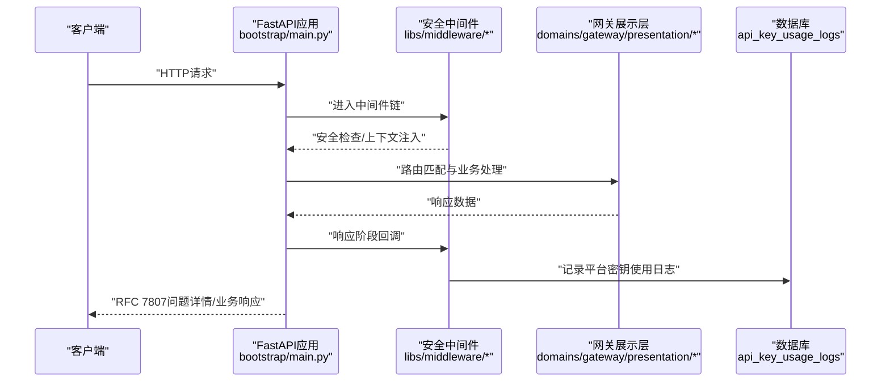

**图表来源**
- [main.py:227-267](file://backend/bootstrap/main.py#L227-L267)
- [platform_api_key_usage_middleware.py:49-100](file://backend/domains/gateway/presentation/platform_api_key_usage_middleware.py#L49-L100)
- [20260127_180000_add_api_keys.up.sql:51-67](file://backend/alembic/sql/20260127_180000_add_api_keys.up.sql#L51-L67)

## 详细组件分析

### 平台密钥使用中间件（记录API调用行为）
- 功能要点
  - 在请求处理完成后收集路径、方法、客户端IP、User-Agent、状态码、响应时间等信息。
  - 使用会话工厂构建领域用例，持久化记录到api_key_usage_logs表。
  - 异常时仅记录日志，不影响主流程。
- 关键实现位置
  - 中间件类与上下文类型定义、生命周期钩子与记录逻辑。
  - 测试用例验证记录行为与上下文注入。
- 数据模型
  - 迁移脚本定义了api_key_usage_logs表字段与索引，支撑审计与统计。

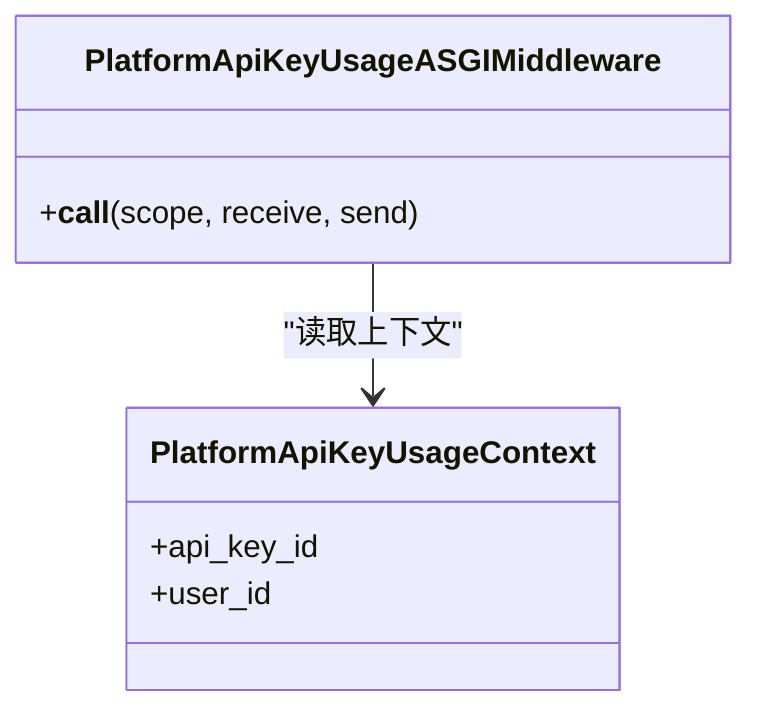

**图表来源**
- [platform_api_key_usage_middleware.py:49-100](file://backend/domains/gateway/presentation/platform_api_key_usage_middleware.py#L49-L100)

**章节来源**
- [platform_api_key_usage_middleware.py:49-100](file://backend/domains/gateway/presentation/platform_api_key_usage_middleware.py#L49-L100)
- [test_platform_api_key_usage_middleware.py:1-45](file://backend/tests/unit/gateway/test_platform_api_key_usage_middleware.py#L1-L45)
- [20260127_180000_add_api_keys.up.sql:51-67](file://backend/alembic/sql/20260127_180000_add_api_keys.up.sql#L51-L67)

### 请求验证、参数过滤与输入清理
- 请求验证
  - 全局异常处理器将FastAPI的请求验证错误映射为RFC 7807问题详情响应，避免泄露内部细节。
- 参数过滤与输入清理
  - 自定义安全校验器用于配置层面的安全约束。
  - 网关代理认证中优先选择Bearer令牌，若缺失则回退到x-api-key，缺失时抛出认证错误，防止空令牌绕过。
- 统一错误响应
  - 将多种异常类型映射为标准Problem Details，便于客户端处理与日志审计。

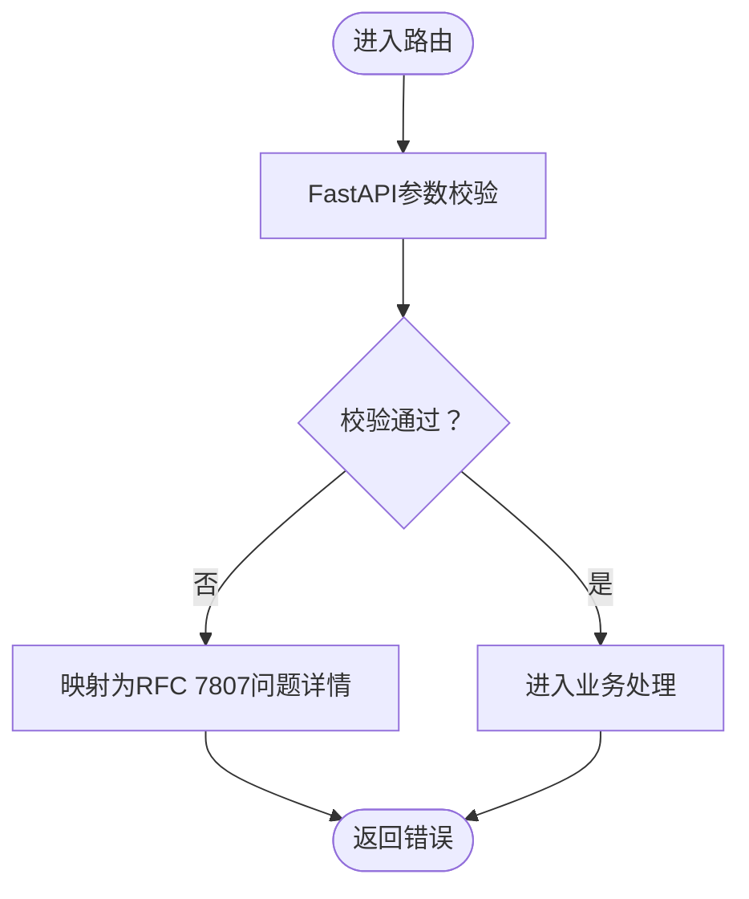

**图表来源**
- [main.py:235-267](file://backend/bootstrap/main.py#L235-L267)
- [test_gateway_proxy_auth_headers.py:1-28](file://backend/tests/unit/gateway/test_gateway_proxy_auth_headers.py#L1-L28)
- [security_validator.py](file://backend/libs/config/validators/security_validator.py)

**章节来源**
- [main.py:235-267](file://backend/bootstrap/main.py#L235-L267)
- [test_gateway_proxy_auth_headers.py:1-28](file://backend/tests/unit/gateway/test_gateway_proxy_auth_headers.py#L1-L28)
- [security_validator.py](file://backend/libs/config/validators/security_validator.py)

### API访问控制策略（IP白名单、速率限制与频率控制）
- 速率限制
  - 通用速率限制中间件提供基础限流能力。
  - 网关域根据上游能力与配额生成速率限制相关响应头，结合Redis使用读取器实现用量查询与阈值判断。
- IP白名单
  - 未在当前代码中发现显式IP白名单实现，建议在反向代理或WASM插件层实现。
- 频率控制
  - 通过速率限制中间件与网关侧头信息共同实现。

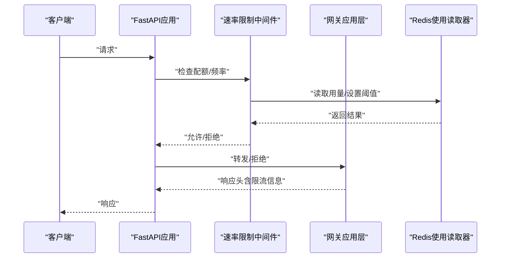

**图表来源**
- [rate_limit.py](file://backend/libs/middleware/rate_limit.py)
- [proxy_rate_limit_headers.py](file://backend/domains/gateway/application/proxy_rate_limit_headers.py)
- [redis_rate_limit_usage_reader.py](file://backend/domains/gateway/infrastructure/redis_rate_limit_usage_reader.py)

**章节来源**
- [rate_limit.py](file://backend/libs/middleware/rate_limit.py)
- [proxy_rate_limit_headers.py](file://backend/domains/gateway/application/proxy_rate_limit_headers.py)
- [redis_rate_limit_usage_reader.py](file://backend/domains/gateway/infrastructure/redis_rate_limit_usage_reader.py)

### API签名验证与消息完整性保护
- 签名与完整性
  - 未在当前代码中发现专用API签名算法实现。
  - 前端对Authorization与x-api-key进行显示脱敏，降低敏感信息泄露风险。
- 建议
  - 结合时间戳与nonce的HMAC签名方案，服务端校验签名与有效期。
  - 对关键请求体进行摘要计算并随签名传输，服务端复算比对。

**章节来源**
- [playground-request.ts:136-151](file://frontend/src/features/gateway-playground/playground-request.ts#L136-L151)

### API错误处理与敏感信息脱敏
- 统一错误响应
  - 全局异常处理器将多种异常映射为RFC 7807问题详情，避免泄露内部堆栈与敏感信息。
- 前端脱敏
  - 对Authorization与x-api-key进行显示脱敏；密钥列表支持切换显示/隐藏。
- 后端脱敏
  - 平台密钥使用中间件记录日志时不直接暴露原始密钥，仅记录派生标识与统计维度。

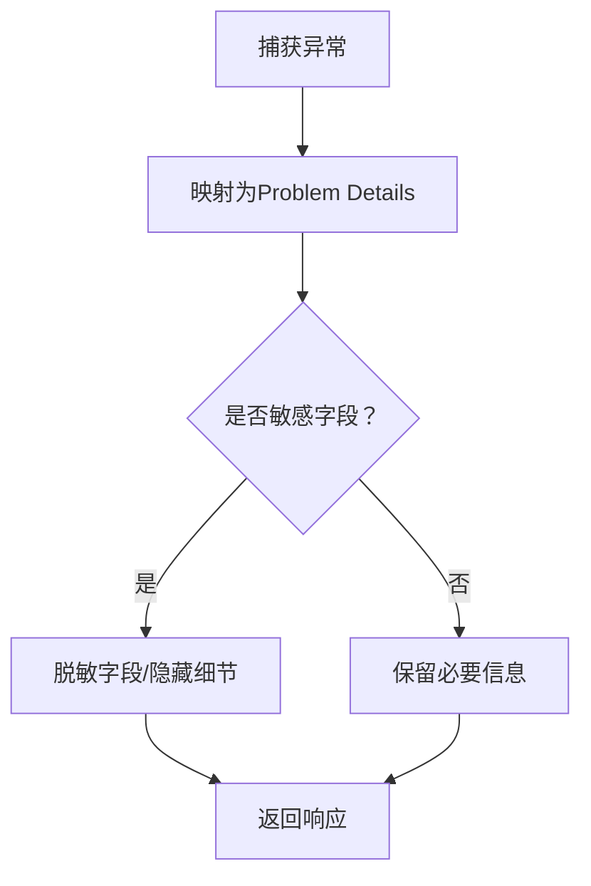

**图表来源**
- [main.py:235-267](file://backend/bootstrap/main.py#L235-L267)
- [playground-request.ts:136-151](file://frontend/src/features/gateway-playground/playground-request.ts#L136-L151)
- [mask-display.test.ts:1-21](file://frontend/src/features/gateway-credentials/mask-display.test.ts#L1-L21)

**章节来源**
- [main.py:235-267](file://backend/bootstrap/main.py#L235-L267)
- [playground-request.ts:136-151](file://frontend/src/features/gateway-playground/playground-request.ts#L136-L151)
- [mask-display.test.ts:1-21](file://frontend/src/features/gateway-credentials/mask-display.test.ts#L1-L21)

### API安全中间件实现（请求拦截、安全检查、响应处理）
- 请求拦截与安全检查
  - 速率限制中间件在请求进入时执行配额与频率检查。
  - 平台密钥使用中间件在响应阶段收集指标并记录日志。
- 响应处理
  - 统一异常处理器确保错误响应格式一致且不泄露敏感信息。
  - 网关代理认证解析Bearer与x-api-key，缺失时抛出认证错误。

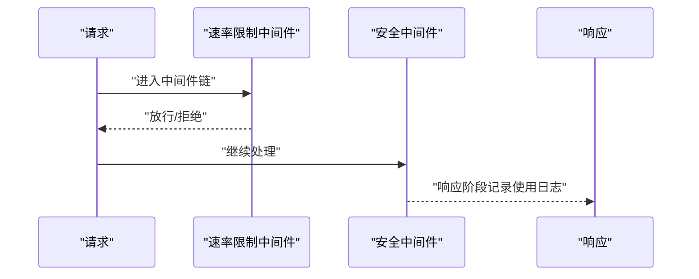

**图表来源**
- [rate_limit.py](file://backend/libs/middleware/rate_limit.py)
- [platform_api_key_usage_middleware.py:49-100](file://backend/domains/gateway/presentation/platform_api_key_usage_middleware.py#L49-L100)
- [test_gateway_proxy_auth_headers.py:1-28](file://backend/tests/unit/gateway/test_gateway_proxy_auth_headers.py#L1-L28)

**章节来源**
- [rate_limit.py](file://backend/libs/middleware/rate_limit.py)
- [platform_api_key_usage_middleware.py:49-100](file://backend/domains/gateway/presentation/platform_api_key_usage_middleware.py#L49-L100)
- [test_gateway_proxy_auth_headers.py:1-28](file://backend/tests/unit/gateway/test_gateway_proxy_auth_headers.py#L1-L28)

### API版本控制与向后兼容性
- 版本化接口
  - OpenAI兼容路由使用v1前缀，明确版本边界。
- 兼容性策略
  - 通过标签与前缀区分不同版本，旧版接口可作为“已弃用”保留以便平滑迁移。

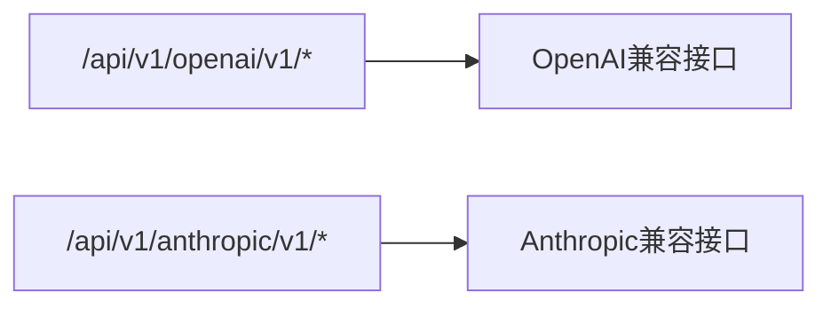

**图表来源**
- [openai_compat_router.py:293-320](file://backend/domains/gateway/presentation/openai_compat_router.py#L293-L320)
- [main.py:482-493](file://backend/bootstrap/main.py#L482-L493)

**章节来源**
- [openai_compat_router.py:293-320](file://backend/domains/gateway/presentation/openai_compat_router.py#L293-L320)
- [main.py:482-493](file://backend/bootstrap/main.py#L482-L493)

### API监控与异常检测
- 使用日志与统计
  - 平台密钥使用中间件记录endpoint、method、ip、UA、状态码、响应时间等，配合数据库索引实现高效查询。
  - 管理域提供按轴聚合的用量统计接口，支持多维分析。
- 可观测性
  - 通用中间件提供日志与追踪ID注入能力，便于端到端追踪。

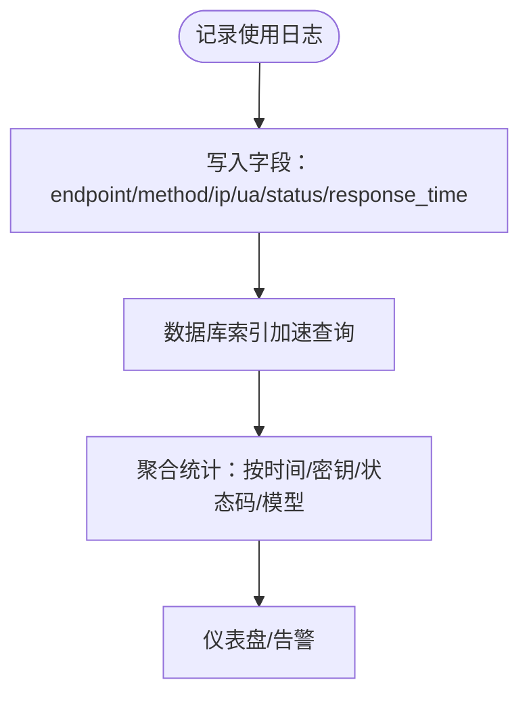

**图表来源**
- [platform_api_key_usage_middleware.py:77-87](file://backend/domains/gateway/presentation/platform_api_key_usage_middleware.py#L77-L87)
- [20260127_180000_add_api_keys.up.sql:51-67](file://backend/alembic/sql/20260127_180000_add_api_keys.up.sql#L51-L67)
- [usage_log_reads.py:165-205](file://backend/domains/gateway/application/management/usage_log_reads.py#L165-L205)
- [logging.py](file://backend/libs/middleware/logging.py)
- [observability.py](file://backend/libs/middleware/observability.py)
- [trace_id.py](file://backend/libs/middleware/trace_id.py)

**章节来源**
- [platform_api_key_usage_middleware.py:77-87](file://backend/domains/gateway/presentation/platform_api_key_usage_middleware.py#L77-L87)
- [20260127_180000_add_api_keys.up.sql:51-67](file://backend/alembic/sql/20260127_180000_add_api_keys.up.sql#L51-L67)
- [usage_log_reads.py:165-205](file://backend/domains/gateway/application/management/usage_log_reads.py#L165-L205)
- [logging.py](file://backend/libs/middleware/logging.py)
- [observability.py](file://backend/libs/middleware/observability.py)
- [trace_id.py](file://backend/libs/middleware/trace_id.py)

### API安全配置最佳实践
- 输入校验
  - 使用Pydantic模型与FastAPI内置校验，结合自定义安全校验器。
- 令牌管理
  - 优先使用Bearer令牌；如使用x-api-key，确保传输通道加密。
- 速率限制
  - 为不同角色与密钥设置差异化配额；启用Redis用量读取器进行动态阈值控制。
- 日志与脱敏
  - 统一问题详情响应；对敏感头部与密钥列表进行前端脱敏显示。
- 版本演进
  - 以v1前缀明确版本边界；旧版接口标记为“已弃用”，提供迁移指引。

**章节来源**
- [security_validator.py](file://backend/libs/config/validators/security_validator.py)
- [test_gateway_proxy_auth_headers.py:1-28](file://backend/tests/unit/gateway/test_gateway_proxy_auth_headers.py#L1-L28)
- [rate_limit.py](file://backend/libs/middleware/rate_limit.py)
- [playground-request.ts:136-151](file://frontend/src/features/gateway-playground/playground-request.ts#L136-L151)
- [openai_compat_router.py:293-320](file://backend/domains/gateway/presentation/openai_compat_router.py#L293-L320)

### 常见API安全威胁与防护
- 参数污染与注入
  - 通过严格参数校验与输入清理减少风险；统一错误响应避免信息泄露。
- 未授权访问
  - 网关代理认证解析Bearer与x-api-key，缺失即拒绝；结合RBAC与JWT实现细粒度授权。
- 速率滥用
  - 通过速率限制中间件与Redis用量读取器实施配额控制。
- 敏感信息泄露
  - 前端脱敏显示Authorization与x-api-key；后端不记录明文密钥。

**章节来源**
- [test_gateway_proxy_auth_headers.py:1-28](file://backend/tests/unit/gateway/test_gateway_proxy_auth_headers.py#L1-L28)
- [jwt.py](file://backend/domains/identity/infrastructure/auth/jwt.py)
- [rbac_adapter.py](file://backend/domains/identity/infrastructure/auth/rbac_adapter.py)
- [authz_http.py](file://backend/libs/iam/authz_http.py)
- [playground-request.ts:136-151](file://frontend/src/features/gateway-playground/playground-request.ts#L136-L151)

### API安全审计与日志记录
- 审计字段
  - endpoint、method、ip_address、user_agent、status_code、response_time_ms、api_key_id、user_id等。
- 存储与索引
  - 迁移脚本定义表结构与索引，便于按时间、密钥、状态码等维度检索。
- 查询与统计
  - 管理域提供聚合接口，支持按轴统计与客户端类型细分。

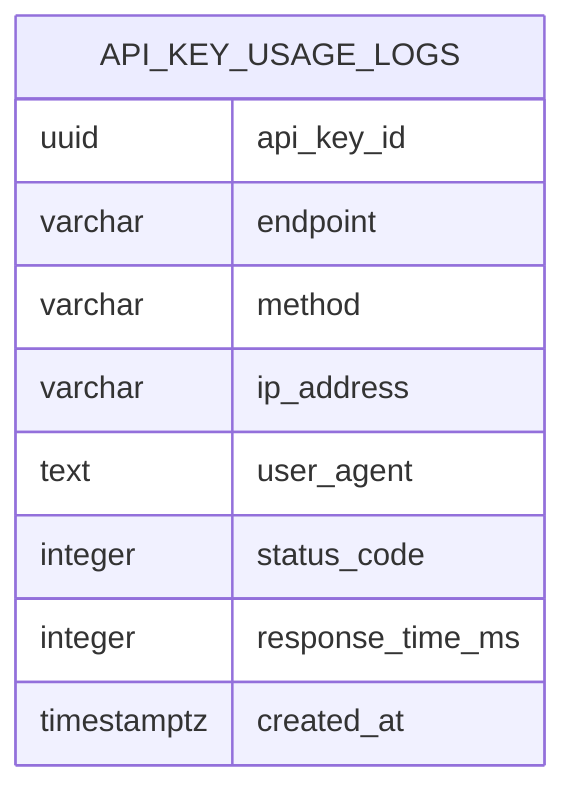

**图表来源**
- [20260127_180000_add_api_keys.up.sql:51-67](file://backend/alembic/sql/20260127_180000_add_api_keys.up.sql#L51-L67)

**章节来源**
- [platform_api_key_usage_middleware.py:77-87](file://backend/domains/gateway/presentation/platform_api_key_usage_middleware.py#L77-L87)
- [20260127_180000_add_api_keys.up.sql:51-67](file://backend/alembic/sql/20260127_180000_add_api_keys.up.sql#L51-L67)
- [usage_log_reads.py:165-205](file://backend/domains/gateway/application/management/usage_log_reads.py#L165-L205)

## 依赖关系分析
- 应用层依赖
  - 引导程序集中注册中间件与异常处理器，依赖各中间件模块与领域用例工厂。
- 网关域依赖
  - 展示层依赖应用层用例与基础设施；应用层依赖数据库会话工厂与Redis读取器。
- 前端依赖
  - Playground与凭证展示模块依赖后端接口与安全脱敏工具。

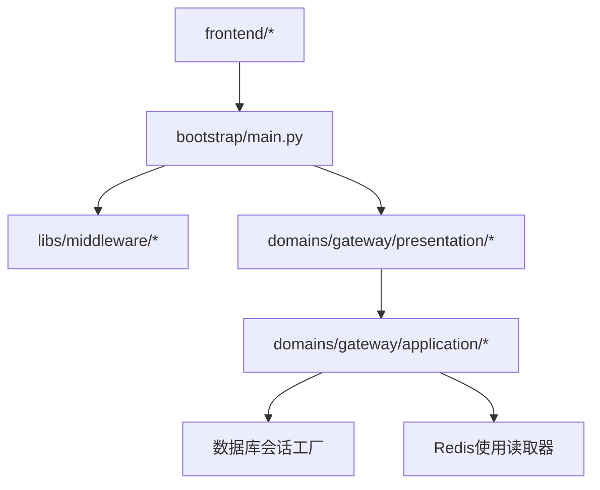

**图表来源**
- [main.py:227-515](file://backend/bootstrap/main.py#L227-L515)
- [platform_api_key_usage_middleware.py:49-100](file://backend/domains/gateway/presentation/platform_api_key_usage_middleware.py#L49-L100)
- [redis_rate_limit_usage_reader.py](file://backend/domains/gateway/infrastructure/redis_rate_limit_usage_reader.py)

**章节来源**
- [main.py:227-515](file://backend/bootstrap/main.py#L227-L515)
- [platform_api_key_usage_middleware.py:49-100](file://backend/domains/gateway/presentation/platform_api_key_usage_middleware.py#L49-L100)
- [redis_rate_limit_usage_reader.py](file://backend/domains/gateway/infrastructure/redis_rate_limit_usage_reader.py)

## 性能考量
- 中间件开销
  - 速率限制与使用日志记录均在请求/响应边界执行，需关注I/O与序列化成本。
- 数据库与索引
  - api_key_usage_logs表具备按api_key_id与created_at索引，建议按查询模式持续优化。
- 缓存与限流
  - Redis用量读取器应合理设置TTL与批量更新策略，避免热点Key抖动。

## 故障排查指南
- 请求验证失败
  - 检查全局异常处理器是否正确映射为RFC 7807问题详情；查看日志中的错误明细。
- 认证失败
  - 确认Authorization与x-api-key解析逻辑；确保令牌格式与来源正确。
- 限流触发
  - 检查速率限制中间件配置与Redis用量读取器返回值；核对配额与时间窗口。
- 使用日志缺失
  - 排查平台密钥使用中间件是否被正确注册；确认会话提交与异常捕获逻辑。

**章节来源**
- [main.py:235-267](file://backend/bootstrap/main.py#L235-L267)
- [test_gateway_proxy_auth_headers.py:1-28](file://backend/tests/unit/gateway/test_gateway_proxy_auth_headers.py#L1-L28)
- [platform_api_key_usage_middleware.py:89-93](file://backend/domains/gateway/presentation/platform_api_key_usage_middleware.py#L89-L93)

## 结论
本项目在API安全方面形成了较为完整的体系：统一的请求验证与错误映射、前端脱敏、平台密钥使用审计、速率限制与Redis用量读取、版本化接口与兼容策略。建议在现有基础上补充API签名与完整性保护、IP白名单策略与更细粒度的授权控制，以进一步提升整体安全性与可观测性。

## 附录
- 相关实现位置
  - 引导程序与异常处理：[main.py:227-267](file://backend/bootstrap/main.py#L227-L267)
  - 平台密钥使用中间件：[platform_api_key_usage_middleware.py:49-100](file://backend/domains/gateway/presentation/platform_api_key_usage_middleware.py#L49-L100)
  - 速率限制中间件：[rate_limit.py](file://backend/libs/middleware/rate_limit.py)
  - 网关代理认证解析：[test_gateway_proxy_auth_headers.py:1-28](file://backend/tests/unit/gateway/test_gateway_proxy_auth_headers.py#L1-L28)
  - 前端脱敏工具：[playground-request.ts:136-151](file://frontend/src/features/gateway-playground/playground-request.ts#L136-L151)
  - 数据库迁移脚本：[20260127_180000_add_api_keys.up.sql:51-67](file://backend/alembic/sql/20260127_180000_add_api_keys.up.sql#L51-L67)
  - 用量统计接口：[usage_log_reads.py:165-205](file://backend/domains/gateway/application/management/usage_log_reads.py#L165-L205)