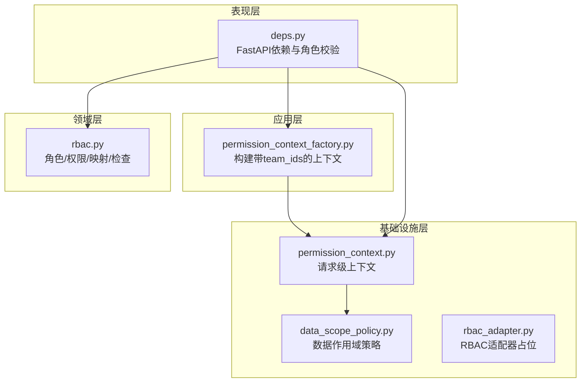
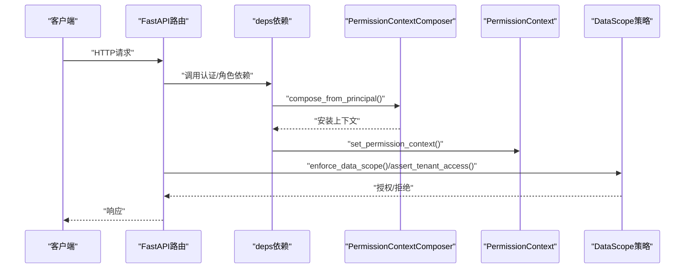
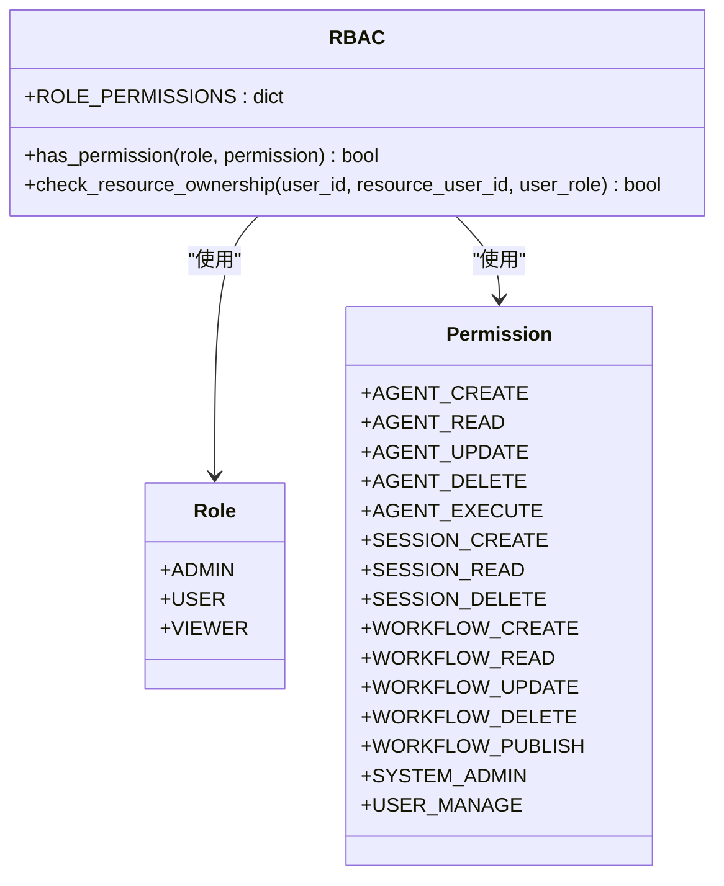
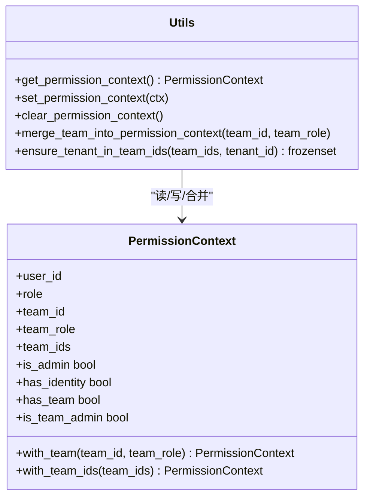
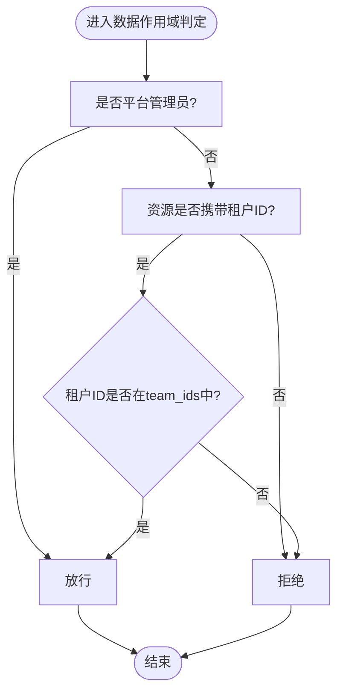
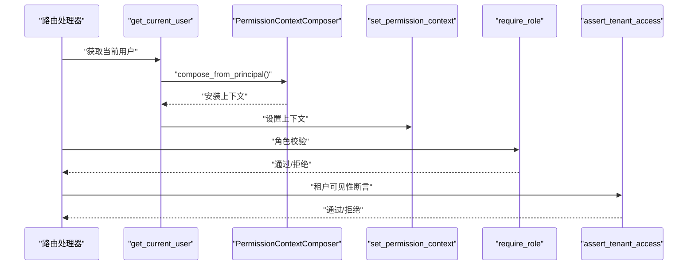
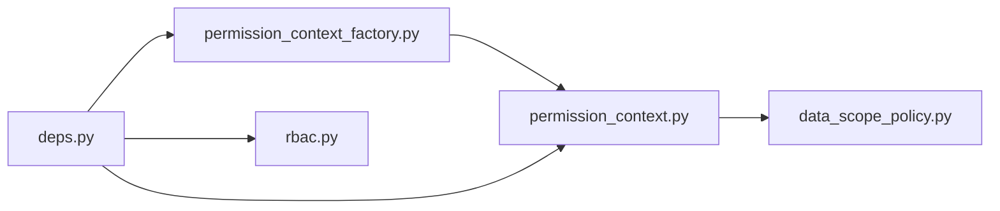

# RBAC权限模型

<cite>
**本文引用的文件**
- [rbac.py](file://backend/domains/identity/domain/rbac.py)
- [permission_context.py](file://backend/libs/iam/permission_context.py)
- [data_scope_policy.py](file://backend/libs/iam/data_scope_policy.py)
- [deps.py](file://backend/domains/identity/presentation/deps.py)
- [permission_context_factory.py](file://backend/domains/identity/application/permission_context_factory.py)
- [rbac_adapter.py](file://backend/domains/identity/infrastructure/auth/rbac_adapter.py)
- [__init__.py（libs/iam）](file://backend/libs/iam/__init__.py)
- [test_rbac.py](file://backend/tests/unit/core/auth/test_rbac.py)
- [test_permission_context.py](file://backend/tests/unit/libs/db/test_permission_context.py)
- [test_data_scope_equivalence.py](file://backend/tests/unit/libs/db/test_data_scope_equivalence.py)
- [test_session_permissions.py](file://backend/tests/integration/api/test_session_permissions.py)
- [test_auth_me.py](file://backend/tests/integration/api/test_auth_me.py)
- [test_session_authz_path_parity.py](file://backend/tests/integration/api/test_session_authz_path_parity.py)
- [test_authz_http.py](file://backend/tests/unit/libs/iam/test_authz_http.py)
- [test_gateway_proxy_auth_headers.py](file://backend/tests/unit/core/auth/test_gateway_proxy_auth_headers.py)
</cite>

## 目录
1. [简介](#简介)
2. [项目结构](#项目结构)
3. [核心组件](#核心组件)
4. [架构总览](#架构总览)
5. [详细组件分析](#详细组件分析)
6. [依赖关系分析](#依赖关系分析)
7. [性能考虑](#性能考虑)
8. [故障排查指南](#故障排查指南)
9. [结论](#结论)
10. [附录](#附录)

## 简介
本文件系统化阐述AI Agent项目的RBAC权限模型，覆盖角色与权限定义、权限上下文构建、权限检查机制、数据作用域策略、缓存与性能优化、配置与审计、异常处理与安全日志，以及扩展与最佳实践。目标读者为系统管理员与开发者，既提供高层理解也提供落地实现指引。

## 项目结构
RBAC相关能力主要分布在以下层次：
- 领域层：角色与权限枚举、角色-权限映射、权限检查逻辑
- 应用层：权限上下文工厂，解析用户团队成员关系，构建带团队ID集合的上下文
- 基础设施层：IAM横切关注点（权限上下文存储与传播）、数据作用域策略
- 表现层：FastAPI依赖注入，将认证、角色校验与权限上下文安装到请求生命周期
- 测试层：对RBAC、权限上下文、数据作用域等进行单元与集成测试

图表来源
- [deps.py:1-177](file://backend/domains/identity/presentation/deps.py#L1-L177)
- [permission_context_factory.py:1-36](file://backend/domains/identity/application/permission_context_factory.py#L1-L36)
- [rbac.py:1-116](file://backend/domains/identity/domain/rbac.py#L1-L116)
- [permission_context.py:1-129](file://backend/libs/iam/permission_context.py#L1-L129)
- [data_scope_policy.py:1-62](file://backend/libs/iam/data_scope_policy.py#L1-L62)
- [rbac_adapter.py:1-10](file://backend/domains/identity/infrastructure/auth/rbac_adapter.py#L1-L10)

章节来源
- [deps.py:1-177](file://backend/domains/identity/presentation/deps.py#L1-L177)
- [permission_context_factory.py:1-36](file://backend/domains/identity/application/permission_context_factory.py#L1-L36)
- [rbac.py:1-116](file://backend/domains/identity/domain/rbac.py#L1-L116)
- [permission_context.py:1-129](file://backend/libs/iam/permission_context.py#L1-L129)
- [data_scope_policy.py:1-62](file://backend/libs/iam/data_scope_policy.py#L1-L62)
- [rbac_adapter.py:1-10](file://backend/domains/identity/infrastructure/auth/rbac_adapter.py#L1-L10)

## 核心组件
- 角色与权限
  - 角色：管理员、普通用户、只读用户
  - 权限：按资源域划分（Agent、Session、Workflow、系统），涵盖增删改查与执行等
  - 映射：管理员拥有全部权限；普通用户拥有资源域的读写与执行；只读用户仅读取
- 权限上下文
  - 请求级上下文，包含用户ID、角色、活动团队、团队角色、可访问租户集合
  - 提供不可变构造与合并方法，支持在已有上下文上附加团队信息
- 数据作用域策略
  - 通过资源与动作（读/列/写/删）判定资源租户是否在上下文允许集合内
  - 管理员恒放行，未携带租户ID的资源拒绝访问
- 权限检查机制
  - 表现层依赖：认证、角色依赖、租户访问断言
  - 领域层检查：角色-权限映射与资源所有权检查

章节来源
- [rbac.py:13-70](file://backend/domains/identity/domain/rbac.py#L13-L70)
- [permission_context.py:13-76](file://backend/libs/iam/permission_context.py#L13-L76)
- [data_scope_policy.py:12-53](file://backend/libs/iam/data_scope_policy.py#L12-L53)
- [deps.py:64-177](file://backend/domains/identity/presentation/deps.py#L64-L177)

## 架构总览
下图展示一次典型API请求的权限流：认证与角色校验、权限上下文安装、数据作用域判定与权限检查。

图表来源
- [deps.py:64-94](file://backend/domains/identity/presentation/deps.py#L64-L94)
- [permission_context_factory.py:15-35](file://backend/domains/identity/application/permission_context_factory.py#L15-L35)
- [permission_context.py:83-95](file://backend/libs/iam/permission_context.py#L83-L95)
- [data_scope_policy.py:42-52](file://backend/libs/iam/data_scope_policy.py#L42-L52)

## 详细组件分析

### 组件A：RBAC领域模型（角色、权限与映射）
- 设计要点
  - 使用枚举表达角色与权限，保证类型安全与可读性
  - 以字典维护角色到权限集合的映射，便于集中管理与扩展
  - 提供权限检查函数，支持字符串角色输入与异常兜底
  - 提供资源所有权检查，管理员豁免，其余用户仅能访问自身资源
- 复杂度与性能
  - 角色-权限查询为O(1)，空间开销与角色数及权限基数线性相关
- 错误处理
  - 非法角色字符串返回无权限，避免异常传播
- 扩展建议
  - 新增角色/权限时，同步更新映射表与相关策略
  - 可引入“继承”或“权限模板”以降低重复配置

图表来源
- [rbac.py:13-116](file://backend/domains/identity/domain/rbac.py#L13-L116)

章节来源
- [rbac.py:13-116](file://backend/domains/identity/domain/rbac.py#L13-L116)
- [test_rbac.py:19-40](file://backend/tests/unit/core/auth/test_rbac.py#L19-L40)

### 组件B：权限上下文（请求级安全上下文）
- 设计要点
  - 使用不可变数据类封装上下文，避免并发修改
  - 通过ContextVar在请求生命周期内传递，支持在无HTTP入口场景构建
  - 提供with_team/with_team_ids方法，支持在既有上下文上附加团队信息
  - 提供工具函数确保活动租户在可访问集合内
- 复杂度与性能
  - 上下文对象为轻量结构，操作为O(1)
- 错误处理
  - 合并团队上下文前需存在上下文，否则抛出运行时错误
- 扩展建议
  - 可增加更多上下文维度（如供应商、项目等）
  - 支持多租户/多团队叠加场景

图表来源
- [permission_context.py:13-129](file://backend/libs/iam/permission_context.py#L13-L129)

章节来源
- [permission_context.py:13-129](file://backend/libs/iam/permission_context.py#L13-L129)
- [test_permission_context.py:23-53](file://backend/tests/unit/libs/db/test_permission_context.py#L23-L53)

### 组件C：数据作用域策略（租户可见性）
- 设计要点
  - 定义资源与动作，基于上下文team_ids判定资源租户是否允许访问
  - 管理员恒放行，未携带租户ID的资源拒绝访问
  - 提供解析与断言工具，支持在路由层显式强制授权
- 复杂度与性能
  - 成员检查为O(n)（n为team_ids大小），通常较小，可接受
- 错误处理
  - 缺失上下文直接抛错，确保强制授权链路完整
- 扩展建议
  - 引入范围缓存（按用户/租户维度）减少重复解析
  - 支持资源级白名单/黑名单策略

图表来源
- [data_scope_policy.py:42-52](file://backend/libs/iam/data_scope_policy.py#L42-L52)
- [permission_context.py:33-51](file://backend/libs/iam/permission_context.py#L33-L51)

章节来源
- [data_scope_policy.py:12-62](file://backend/libs/iam/data_scope_policy.py#L12-L62)
- [test_data_scope_equivalence.py:33-49](file://backend/tests/unit/libs/db/test_data_scope_equivalence.py#L33-L49)

### 组件D：权限上下文工厂（后台任务/无HTTP入口）
- 设计要点
  - 通过用户ID解析其可访问的全部租户集合
  - 返回带team_ids的上下文，必要时附加活动团队与角色
- 性能与复杂度
  - 依赖团队成员解析，I/O成本取决于数据库与索引设计
- 扩展建议
  - 引入缓存与失效策略，减少重复解析
  - 支持批量解析与异步预热

章节来源
- [permission_context_factory.py:15-35](file://backend/domains/identity/application/permission_context_factory.py#L15-L35)

### 组件E：表现层依赖与权限检查（FastAPI）
- 设计要点
  - 认证依赖：获取当前用户并安装权限上下文
  - 角色依赖：校验用户角色，不满足则抛出权限拒绝
  - 租户访问断言：委托底层断言函数进行可见性校验
- 错误处理
  - 角色不符抛出权限拒绝错误
  - 用户UUID解析失败抛出认证错误
- 扩展建议
  - 可在适配器层补充基于Permission枚举的细粒度装饰器
  - 结合路由路径与资源ID实现动态权限判定

图表来源
- [deps.py:64-177](file://backend/domains/identity/presentation/deps.py#L64-L177)

章节来源
- [deps.py:64-177](file://backend/domains/identity/presentation/deps.py#L64-L177)
- [rbac_adapter.py:1-10](file://backend/domains/identity/infrastructure/auth/rbac_adapter.py#L1-L10)
- [__init__.py（libs/iam）:1-52](file://backend/libs/iam/__init__.py#L1-L52)

## 依赖关系分析
- 组件耦合
  - 表现层依赖应用层的上下文组合器与领域层RBAC
  - 应用层依赖基础设施层的上下文与数据作用域策略
  - 基础设施层彼此独立，通过公共接口交互
- 外部依赖
  - FastAPI依赖注入、SQLAlchemy会话
  - 测试框架pytest与相关断言库
- 循环依赖
  - 未发现循环导入；各层职责清晰

图表来源
- [deps.py:17-29](file://backend/domains/identity/presentation/deps.py#L17-L29)
- [permission_context_factory.py:9-10](file://backend/domains/identity/application/permission_context_factory.py#L9-L10)
- [permission_context.py:78-95](file://backend/libs/iam/permission_context.py#L78-L95)
- [data_scope_policy.py:9](file://backend/libs/iam/data_scope_policy.py#L9)

章节来源
- [deps.py:17-29](file://backend/domains/identity/presentation/deps.py#L17-L29)
- [permission_context_factory.py:9-10](file://backend/domains/identity/application/permission_context_factory.py#L9-L10)
- [permission_context.py:78-95](file://backend/libs/iam/permission_context.py#L78-L95)
- [data_scope_policy.py:9](file://backend/libs/iam/data_scope_policy.py#L9)

## 性能考虑
- 上下文解析
  - 团队成员解析可能涉及数据库查询，建议在应用层引入缓存（按用户ID/租户维度）
  - 对热点用户可做预热，减少首次访问延迟
- 数据作用域判定
  - team_ids集合较小，成员检查成本低；若集合较大，可考虑哈希集合或布隆过滤器
- 权限检查
  - 角色-权限映射为常量时间；建议将常用权限映射放入进程内缓存
- 中间件与装饰器
  - 避免重复安装上下文；确保上下文在请求开始即就绪
- I/O与连接
  - 数据库会话复用与连接池配置，减少连接开销

## 故障排查指南
- 常见问题
  - 403权限不足：检查角色依赖与权限映射；确认当前用户角色是否正确
  - 401未认证：确认令牌有效性与解析；检查UUID转换错误
  - 404/403租户不可见：确认资源租户ID与上下文team_ids一致性；检查管理员豁免逻辑
  - 上下文缺失：确认依赖链路是否正确安装上下文
- 排查步骤
  - 查看请求级上下文状态与团队信息
  - 对比数据作用域策略与期望的team_ids
  - 核对RBAC映射与资源所有权检查逻辑
  - 关注测试用例覆盖的关键分支（管理员、普通用户、只读用户）
- 相关测试参考
  - RBAC单元测试：管理员/普通用户/只读用户的权限断言
  - 权限上下文单元测试：上下文属性、冻结特性、空上下文
  - 数据作用域一致性测试：策略与断言行为一致性
  - API集成测试：会话权限、认证与路径一致性

章节来源
- [test_rbac.py:19-40](file://backend/tests/unit/core/auth/test_rbac.py#L19-L40)
- [test_permission_context.py:23-53](file://backend/tests/unit/libs/db/test_permission_context.py#L23-L53)
- [test_data_scope_equivalence.py:33-49](file://backend/tests/unit/libs/db/test_data_scope_equivalence.py#L33-L49)
- [test_session_permissions.py](file://backend/tests/integration/api/test_session_permissions.py)
- [test_auth_me.py](file://backend/tests/integration/api/test_auth_me.py)
- [test_session_authz_path_parity.py](file://backend/tests/integration/api/test_session_authz_path_parity.py)
- [test_authz_http.py](file://backend/tests/unit/libs/iam/test_authz_http.py)

## 结论
本RBAC模型以清晰的角色-权限映射为核心，结合请求级权限上下文与数据作用域策略，实现了从认证到资源可见性的全链路授权。通过依赖注入与上下文传播，系统在保持简洁的同时具备良好的扩展性。建议在生产环境中配合缓存、审计与监控，持续优化性能与安全性。

## 附录

### 权限配置管理与模板
- 角色-权限模板
  - 管理员：全权限
  - 普通用户：资源域读写与执行
  - 只读用户：资源域只读
- 批量授权
  - 通过团队成员解析一次性生成team_ids，批量应用于仓库层过滤
- 权限审计
  - 建议在上下文安装与权限检查处埋点，记录用户、角色、资源、动作与结果

### 权限异常处理与安全日志
- 异常类型
  - 认证错误：令牌无效或UUID解析失败
  - 权限拒绝：角色不符或租户不可见
- 日志建议
  - 记录请求ID、用户ID、角色、资源标识、动作、决策结果
  - 区分“策略拒绝”与“上下文缺失”两类错误

### 扩展方法与自定义规则
- 自定义权限规则
  - 在领域层新增权限枚举与映射；在策略层扩展数据作用域判定
- 继承与模板
  - 引入“权限模板”与“继承链”，减少重复配置
- 细粒度装饰器
  - 在适配器层补充基于Permission枚举的路由装饰器